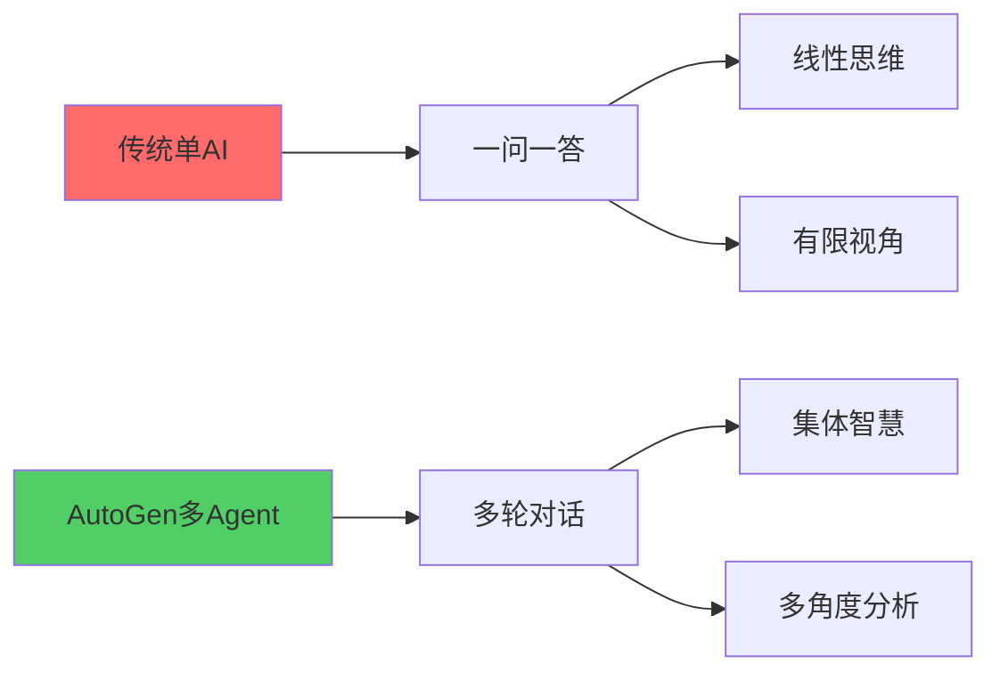
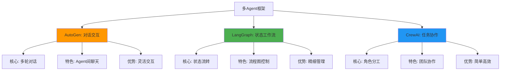
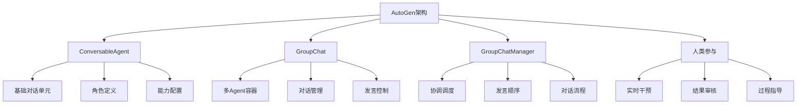

# AutoGen完全指南：对话式多Agent系统的艺术

> 💬 当AI不仅能回答问题，还能互相聊天、协作解决问题——这就是AutoGen的魅力！本文带你深入对话式多Agent的神奇世界。

朋友们，先来个真实场景感受一下：

**编程难题的突破**
> 程序员小李遇到一个复杂bug，他向AI助手提问。
> 但这次不一样——不是单个AI回答，而是**三个AI专家**开始讨论：
> 
> **代码专家**："这个错误可能是因为异步调用的问题..."
> **架构师**："我建议重构这部分，使用设计模式..."
> **调试专家**："可以在第87行打断点，检查变量状态..."
> 
> 经过几轮讨论，他们给出了完美解决方案！

这就是AutoGen带来的**对话式协作**革命！

## 🎯 为什么AutoGen如此特别？

**传统AI vs AutoGen的区别：**



**AutoGen的三大核心优势：**

1. **🤝 真正的协作** - Agent之间能真正"对话"，不是简单组合
2. **🔄 动态交互** - 根据对话进展动态调整策略
3. **👥 角色扮演** - 每个Agent有明确的专业角色

### 三大框架终极对比



---

## 🏗️ AutoGen架构深度解析

### 核心组件：理解AutoGen的四大支柱



**1. ConversableAgent - 对话Agent基类**
这是AutoGen的核心，每个Agent都是从这个类派生的：

```python
from autogen import ConversableAgent

# 创建一个基础Agent
agent = ConversableAgent(
    name="assistant",
    system_message="你是一个有帮助的AI助手",
    llm_config=llm_config
)
```

**2. GroupChat - 群聊容器**
管理多个Agent的对话环境：

```python
from autogen import GroupChat

groupchat = GroupChat(
    agents=[agent1, agent2, agent3],
    messages=[],
    max_round=10  # 最多10轮对话
)
```

**3. GroupChatManager - 对话管理器**
控制对话流程和发言顺序：

```python
from autogen import GroupChatManager

manager = GroupChatManager(
    groupchat=groupchat,
    llm_config=llm_config
)
```

**4. 人类参与模式** | 对话式协作 | 状态流转控制 | 角色化分工 |
| **交互方式** | 多轮动态对话 | 预定义工作流 | 任务链执行 |
| **人类参与** | 高度灵活 | 有限参与 | 配置时参与 |
| **学习曲线** | 中等 | 中高 | 低 |
| **控制粒度** | 消息级别 | 节点级别 | 任务级别 |
| **典型场景** | 复杂问题求解、创意讨论 | 业务流程自动化、客服系统 | 内容生成、数据分析 |

### 选择指南：什么情况下用AutoGen？

**✅ 适合AutoGen的场景：**
- 需要多角度讨论的复杂问题
- 人类希望参与决策过程
- 问题解决路径不明确
- 需要创意碰撞和头脑风暴
- 实时交互和动态调整

**❌ 不适合AutoGen的场景：**
- 简单重复性任务
- 明确的线性工作流
- 需要严格的过程控制
- 对执行时间有严格要求
- 不需要人类干预

---

## 🚀 AutoGen最佳实践

### 1. Agent设计的黄金法则

```python
# ✅ 好的Agent设计
good_agent = ConversableAgent(
    name="GoodAgent",
    system_message="""
    # 明确的专业领域
    你是[具体领域]专家
    
    # 清晰的能力描述
    擅长：[具体技能1]、[技能2]、[技能3]
    
    # 期望的行为规范
    请：[具体行为指导]
    
    # 交互风格设定
    对话风格：[专业/友好/严谨等]
    """,
    llm_config=llm_config
)

# ❌ 不好的Agent设计
bad_agent = ConversableAgent(
    name="BadAgent", 
    system_message="""你是个助手""",  # 太模糊
    llm_config=llm_config
)
```

### 2. 群聊配置优化

```python
# 优化后的群聊配置
optimized_group_chat = GroupChat(
    agents=agents_list,
    messages=[],
    max_round=optimal_max_round(),  # 动态计算最大轮数
    speaker_selection_method=smart_selection,  # 智能选择
    allow_repeat_speaker=True,  # 但限制频率
    function_call_filter=relevant_functions,  # 过滤无关功能
    message_filter=remove_redundant  # 去除冗余消息
)

def optimal_max_round():
    """根据Agent数量动态计算最大轮数"""
    base_rounds = 8
    additional_per_agent = 2
    return base_rounds + (len(agents_list) - 1) * additional_per_agent
```

### 3. 对话质量控制

```python
# 对话质量监控
def monitor_conversation_quality(messages):
    """监控对话质量"""
    
    quality_metrics = {
        "relevance": check_relevance(messages),
        "depth": assess_conversation_depth(messages), 
        "collaboration": measure_collaboration(messages),
        "progress": evaluate_progress(messages)
    }
    
    # 如果质量下降，介入调整
    if quality_metrics["progress"] < 0.5:
        return "需要人类干预"
    elif quality_metrics["relevance"] < 0.7:
        return "调整对话方向"
    else:
        return "继续自动对话"
```

### 4. 性能优化策略

```python
# 缓存和优化
from functools import lru_cache

@lru_cache(maxsize=100)
def cached_agent_response(agent_name: str, message: str) -> str:
    """缓存Agent响应"""
    # 实际的处理逻辑
    return processed_response

# 批量处理消息
def batch_process_messages(messages):
    """批量处理提高效率"""
    # 实现批量处理逻辑
    pass
```

---

## 📈 进阶特性：AutoGen的高级应用

### 1. 多模态对话支持

```python
# 支持图像处理的Agent
multimodal_agent = ConversableAgent(
    name="MultimodalExpert",
    system_message="""你是多模态AI专家，能够：
    - 分析和描述图像内容
    - 结合文本和图像信息
    - 生成图文结合的回复
    - 处理视觉相关的问题
    
    请充分利用多模态能力。""",
    llm_config={
        "config_list": config_list,
        "max_tokens": 2000,
        "temperature": 0.3
    }
)
```

### 2. 长期记忆和上下文管理

```python
# 带记忆的Agent配置
agent_with_memory = ConversableAgent(
    name="AgentWithMemory",
    system_message="你是有长期记忆的AI助手",
    llm_config=llm_config,
    # 记忆管理配置
    memory_config={
        "max_history": 50,  # 保存50轮对话
        "summary_frequency": 10,  # 每10轮生成摘要
        "importance_weighting": True  # 重要性加权
    }
)
```

### 3. 实时协作和流式输出

```python
# 流式对话示例
def stream_chat_example():
    """流式对话演示"""
    
    for chunk in user_proxy.stream_chat(
        code_expert,
        message="请逐步解释这个算法",
        stream=True
    ):
        print(f"{chunk['name']}: {chunk['content']}")
        # 实时显示对话进展
```

---

**🌟 AutoGen的三大突破：**
1. **真正的多Agent对话** - 不是简单组合，而是真正的互动
2. **灵活的人类参与** - 从完全自动到全程人工的各种模式
3. **动态的问题求解** - 根据对话进展智能调整策略

**💡 关键技术洞察：**
- Agent角色设计要专业明确
- 群聊配置需要精心调优  
- 对话质量需要持续监控
- 性能优化要考虑实际场景

**🚀 应用场景展望：**
> "AutoGen最适合那些需要'集体智慧'的复杂问题。当单个AI的视角有限，当问题需要多专业碰撞，当人类希望深度参与——这就是AutoGen闪耀的时刻。"
---
