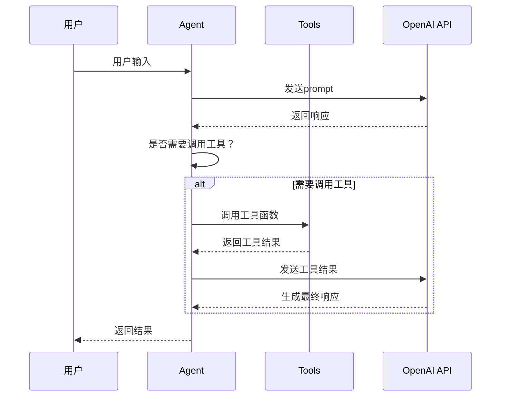
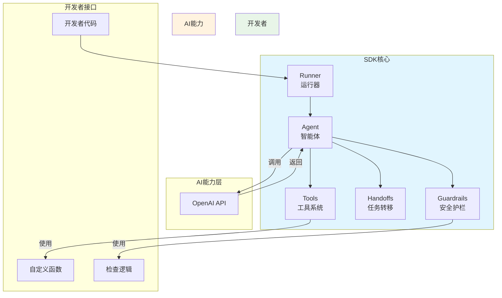
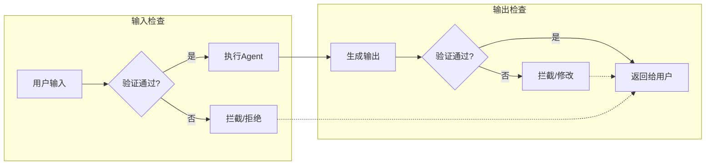
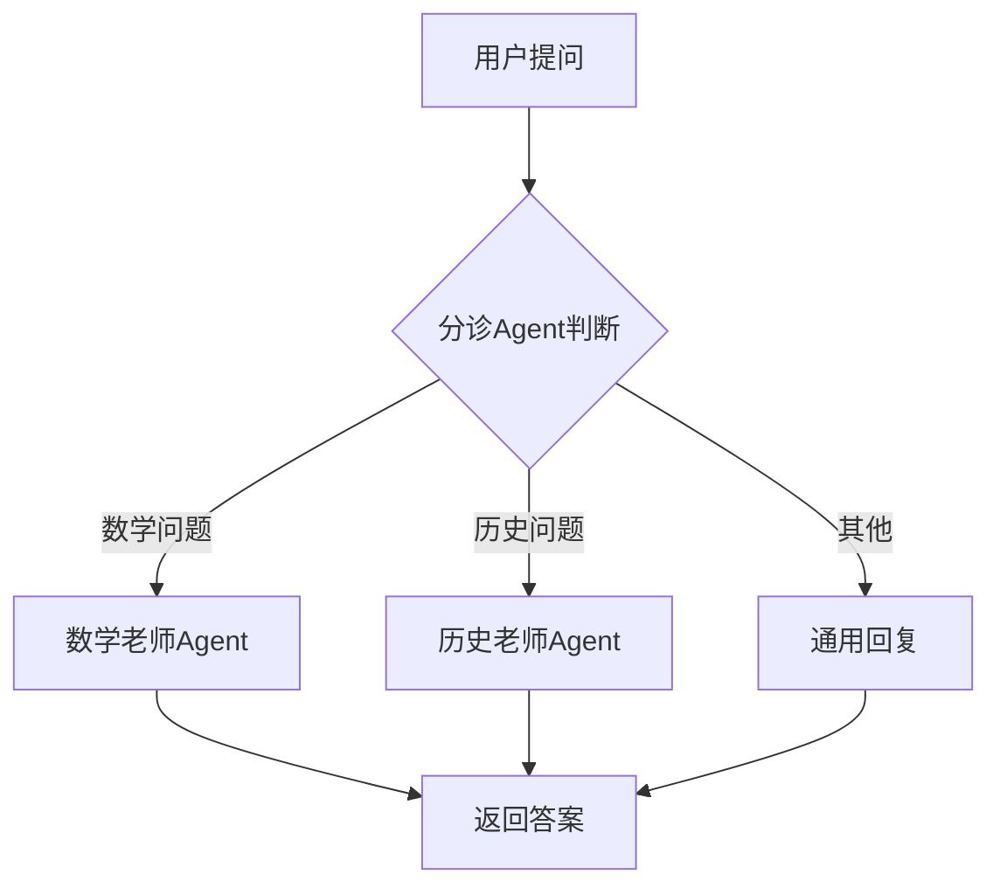
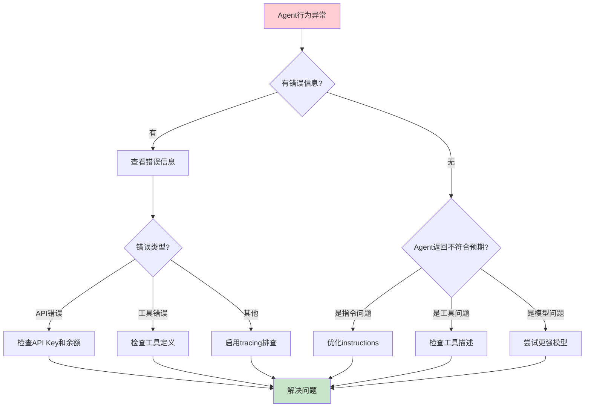

# OpenAI Agents SDK 深度指南：一篇文章带你从入门到实战

> 如果你是一名Python开发者，如果你对AI应用开发感兴趣，那么这篇文章将是你学习OpenAI Agents SDK最全面的指南。我们将用最通俗易懂的方式，一步步带你了解这个由OpenAI官方推出的智能体开发工具包。

## 一、为什么你需要关注OpenAI Agents SDK？

在AI应用开发领域，有一个现实的问题困扰着无数开发者：如何让大语言模型真正“动”起来？

当你第一次使用OpenAI API时，你可能会觉得很简单——发送一个prompt，得到一个回复。但当你试图构建一个真正有用的应用时，你会发现问题来了：如何让AI调用外部工具？如何让多个AI协同工作？如何保证输出内容的安全可靠？如何追踪整个对话过程的每一步？

这些问题相信每个尝试过AI应用开发的同学都遇到过。而OpenAI Agents SDK，正是为了解决这些问题而生的。

2024年底，OpenAI正式发布了Agents SDK。这是一个轻量级、易用、几乎没有抽象层的Python包，专门用于构建智能体AI应用。用OpenAI的话说，这是他们此前用于智能体实验的项目“Swarm”的生产就绪升级版。

那么，这个SDK到底能做什么？让我们继续往下看。

## 二、核心设计理念：简单与强大的平衡

在深入代码之前，我们先来理解一下OpenAI Agents SDK的核心设计理念。这有助于你更好地把握这个工具的特点。

### 2.1 两个核心原则

Agents SDK遵循两个核心设计原则：

**原则一：功能丰富 vs. 简洁上手**

这意味着SDK的功能足够丰富，值得你在生产项目中使用，但它的基本组件足够少，你能够在一两天内快速上手。不会像某些框架一样，学习曲线陡峭得让人望而却步。

**原则二：开箱即用 vs. 精确自定义**

这意味着SDK提供了合适的默认值，让你能够快速启动项目，但同时你也完全可以精确自定义实际发生的行为。它不会强迫你使用某种特定的方式，而是给你足够的灵活性。

### 2.2 极简的核心组件

SDK只有三个基本组件，听起来是不是很惊人？

| 组件 | 中文名称 | 说明 |
|------|----------|------|
| **Agent** | 智能体 | 配备了指令和工具的LLM |
| **Handoffs** | 任务转移 | 允许智能体将任务委派给其他智能体 |
| **Guardrails** | 安全护栏 | 用于验证智能体的输入和输出 |

是的，你没看错，整个SDK的核心概念就这三个。正是这种极简设计，让Agents SDK变得极其易用。

下面这张图展示了Agent的典型工作流程：



在这个流程中，Agent会自动判断是否需要调用工具，如果需要就自动调用，然后结合工具返回的结果生成最终的回答。这就是所谓的"Agent Loop"——Agent会自动循环处理工具调用，直到任务完成。

## 三、环境准备与安装

好了，现在开始动手吧！首先，我们需要安装Agents SDK。

### 3.1 安装Python包

Agents SDK是一个Python包，所以你需要确保已经安装了Python环境（建议Python 3.10及以上版本）。安装非常简单，只需要一行命令：

```bash
pip install openai-agents
```

如果你使用Poetry作为包管理工具，也可以这样：

```bash
poetry add openai-agents
```

如果你想体验最新功能，也可以安装预览版：

```bash
pip install openai-agents --pre
```

### 3.2 配置API密钥

安装完成后，你需要配置OpenAI的API密钥。Agents SDK支持多种配置方式：

**方式一：环境变量（推荐）**

```bash
export OPENAI_API_KEY=sk-your-api-key-here
```

**方式二：在代码中设置**

```python
import os
os.environ["OPENAI_API_KEY"] = "sk-your-api-key-here"
```

**方式三：使用OPENAI_BASE_URL（针对兼容OpenAI API的自定义端点）**

```bash
export OPENAI_API_KEY=your-api-key
export OPENAI_BASE_URL=https://your-custom-endpoint.com/v1
```

获取API Key的方式很简单：访问 [platform.openai.com](https://platform.openai.com)，注册账号后在API Keys页面创建即可。

> ⚠️ **温馨提示**：_API Key一定要妥善保管，不要暴露在代码仓库中。使用环境变量是最安全的做法。_

## 四、第一个Agent：Hello World

现在，让我们创建我们的第一个Agent！这是一个最简单的例子，但我们可以通过它理解整个SDK的工作方式。

### 4.1 最简单的代码

```python
from agents import Agent, Runner

# 创建一个最简单的Agent
agent = Agent(name="Assistant", instructions="You are a helpful assistant")

# 运行Agent
result = Runner.run_sync(agent, "Write a haiku about recursion in programming.")

# 打印结果
print(result.final_output)
```

运行这段代码，你会看到类似这样的输出：

```
Code within the code,
Functions calling themselves,
Infinite loop's dance.
```

是不是很酷？我们只用了不到10行代码，就创建了一个能够与用户对话的AI Agent！

### 4.2 代码解析

让我们拆解这段代码，看看每一部分做了什么：

**第一步：导入模块**

```python
from agents import Agent, Runner
```

这里我们从agents包导入了两个核心类：Agent（智能体）和Runner（运行器）。

**第二步：创建Agent实例**

```python
agent = Agent(name="Assistant", instructions="You are a helpful assistant")
```

创建Agent时，我们只需要两个参数：
- `name`: 智能体的名字，用于标识
- `instructions`: 智能体的指令，相当于系统提示词（System Prompt）

**第三步：运行Agent**

```python
result = Runner.run_sync(agent, "Write a haiku about recursion in programming.")
```

Runner是我们运行Agent的入口。`run_sync`是同步运行方式，会阻塞到结果返回。还有异步方式`run_async`，我们后面会讲到。

**第四步：获取结果**

```python
print(result.final_output)
```

result包含了很多信息，`final_output`是我们最关心的——智能体返回的最终文本。

### 4.3 异步运行方式

在生产环境中，我们通常更倾向于使用异步方式，以获得更好的性能：

```python
import asyncio
from agents import Agent, Runner

async def main():
    agent = Agent(name="Assistant", instructions="You are a helpful assistant")
    result = await Runner.run(agent, "What is the meaning of life?")
    print(result.final_output)

asyncio.run(main())
```

这里我们使用`Runner.run()`，它是一个async方法。我们可以通过`asyncio.run()`来运行异步函数。

## 五、深入Agent配置

现在我们了解了最基础的Agent。但实际上，Agent可以配置的内容远不止name和instructions。让我详细介绍一下Agent的完整配置。

### 5.0 SDK整体架构

在深入配置之前，让我们先看一下SDK的整体架构，这样能更好地理解各个组件之间的关系：



如上图所示，开发者通过编写自定义函数来定义Tools和检查逻辑，然后创建Agent实例，最后通过Runner来运行Agent。Agent在执行过程中会调用OpenAI API来完成推理，并可以根据配置进行任务转移和安全检查。

### 5.1 Agent的所有配置参数

```python
agent = Agent(
    # 必填参数
    name="数学辅导老师",
    instructions="你是一位耐心的数学老师，帮助学生解决数学问题。",
    
    # 可选参数
    model="gpt-4o",                    # 使用的模型，默认gpt-4o
    tools=[],                          # 可用工具列表
    handoffs=[],                      # 可交接的其他智能体
    input_guardrails=[],              # 输入安全护栏
    output_guardrails=[],            # 输出安全护栏
    output_type=None,                 # 输出结构模型
)
```

让我逐一解释这些参数：

| 参数 | 类型 | 说明 |
|------|------|------|
| `name` | str | 智能体名称，必填 |
| `instructions` | str | 智能体指令/系统提示词，必填 |
| `model` | str | 使用的模型，默认为"gpt-4o" |
| `tools` | list[Tool] | 工具列表，默认为空 |
| `handoffs` | list[Agent] | 可交接的智能体列表 |
| `input_guardrails` | list[InputGuardrail] | 输入安全护栏 |
| `output_guardrails` | list[OutputGuardrail] | 输出安全护栏 |
| `output_type` | Type[BaseModel] | 输出结构模型（Pydantic模型类） |

### 5.2 为Agent添加工具

Agent最强大的地方在于它可以调用工具（Tools）。你只需要定义一个Python函数，SDK会自动将其转换为Agent可以调用的工具。

```python
from agents import Agent, function_tool

@function_tool
def calculate(expression: str) -> str:
    """计算数学表达式的值"""
    # 这是一个简单的计算器实现
    # 实际项目中你可以调用计算API
    try:
        result = eval(expression)
        return str(result)
    except Exception as e:
        return f"计算错误: {str(e)}"

# 创建带有工具的Agent
agent = Agent(
    name="数学助手",
    instructions="你是一个数学助手，帮助用户进行数学计算。",
    tools=[calculate]
)

# 运行Agent
result = Runner.run_sync(agent, "计算 125 * 17 的结果")
print(result.final_output)
```

运行结果：

```
125乘以17等于2125。我通过计算器工具验证了这个结果。
```

> 🔑 _关键点_：只需要给函数加上`@function_tool`装饰器，SDK会自动：1. 使用函数的文档字符串生成工具描述
2. 使用函数参数生成工具的模式定义
3. 处理函数调用的执行和返回

### 5.3 使用LambdaTool更灵活地定义工具

如果你不想用装饰器，也可以直接使用LambdaTool：

```python
from agents import Agent, LambdaTool

# 使用LambdaTool定义工具
天气查询工具 = LambdaTool.from_function(
    name="查询天气",
    description="查询指定城市的天气情况",
    function=lambda city: f"{city}今天天气晴朗，25度"
)

agent = Agent(
    name="天气助手",
    instructions="你是一个天气助手，用工具查询天气信息并告知用户。",
    tools=[天气查询工具]
)

result = Runner.run_sync(agent, "北京今天天气怎么样？")
print(result.final_output)
```

## 六、安全护栏：保障输出安全可靠

安全护栏（Guardrails）是Agents SDK的另一个核心功能。它用于验证智能体的输入和输出，确保内容安全合规。

### 6.1 什么是安全护栏？

简单来说，安全护栏是一种检查机制，可以在智能体处理输入之前（或返回输出之前）进行验证。如果验证不通过，智能体的执行会被阻止或触发特定的处理逻辑。

下面这张图展示了安全护栏的工作位置和流程：



如上图所示：
- **输入护栏** 在Agent处理输入之前拦截，检查通过才允许继续执行
- **输出护栏** 在返回结果之前检查输出内容，确保安全合规

如果护栏验证失败（triggered），可以通过设置`tripwire_triggered=True`来阻止Agent继续执行或返回修改后的响应。

### 6.2 输入安全护栏示例

让我们看一个实际的例子：创建一个作业帮助机器人，但只在用户询问作业相关问题时才激活。

```python
from pydantic import BaseModel
from agents import Agent, Runner, GuardrailFunctionOutput, InputGuardrail

# 第一步：定义输出模型
class HomeworkOutput(BaseModel):
    is_homework: bool
    reasoning: str

# 第二步：创建护栏检查Agent
guardrail_agent = Agent(
    name="作业检查员",
    instructions="判断用户的问题是否与学校作业相关。",
    output_type=HomeworkOutput
)

# 第三步：定义护栏函数
async def homework_guardrail(ctx, agent, input_data):
    result = await Runner.run(guardrail_agent, input_data, context=ctx.context)
    final_output = result.final_output_as(HomeworkOutput)
    
    return GuardrailFunctionOutput(
        output_info=final_output,
        tripwire_triggered=not final_output.is_homework,
    )

# 第四步：创建主智能体，配置输入护栏
triage_agent = Agent(
    name="分诊机器人",
    instructions="你是一个帮助学生解答作业问题的机器人。",
    input_guardrails=[
        InputGuardrail(guardrail_function=homework_guardrail)
    ]
)

# 测试
result = Runner.run_sync(triage_agent, "请帮我解答这道数学题：2+2等于几？")
print(result.final_output)
```

运行结果会根据输入有所不同。如果不是作业相关问题，护栏会触发，阻止智能体继续执行。

### 6.3 输出安全护栏

除了输入护栏，还有输出护栏，用于在返回结果前检查输出内容：

```python
from agents import Agent, OutputGuardrail, GuardrailFunctionOutput

# 定义输出护栏函数
async def output_guardrail(ctx, agent, input_data, response):
    # 检查输出是否包含敏感词
    sensitive_words = ["暴力", "赌博", "诈骗"]
    for word in sensitive_words:
        if word in response:
            return GuardrailFunctionOutput(
                output_info={"flagged": True, "word": word},
                tripwire_triggered=True
            )
    
    return GuardrailFunctionOutput(
        output_info={"flagged": False},
        tripwire_triggered=False
    )

# 配置输出护栏
agent = Agent(
    name="安全助手",
    instructions="你是 一个友好的助手。",
    output_guardrails=[
        OutputGuardrail(guardrail_function=output_guardrail)
    ]
)
```

## 七、任务转移：多Agent协作

任务转移（Handoffs）是Agents SDK最强大的特性之一。它允许一个Agent将任务���派给另一个Agent，实现多Agent协作。

### 7.1 什么时候使用任务转移？

想象这样一个场景：你去医院看病，分诊护士会根据你的症状把你分配到不同的科室。任务转移就是类似的概念——Agent会根据用户的需求，将其分配给最专业的“专家Agent”。

### 7.2 多Agent协作示例

```python
from agents import Agent, Runner

# 创建数学专家Agent
math_tutor_agent = Agent(
    name="数学老师",
    instructions="你是一位数学老师，帮助学生解决数学问题。在解答时要逐步解释你的推理过程。"
)

# 创建历史老师Agent
history_tutor_agent = Agent(
    name="历史老师",
    instructions="你是一位历史老师，帮助学生了解历史事件和人物。用生动的方式讲述历史故事。"
)

# 创建分诊Agent
triage_agent = Agent(
    name="分诊老师",
    instructions="根据学生的问题，将其分配给最合适的老师。",
    handoffs=[history_tutor_agent, math_tutor_agent]
)

# 运行
result = Runner.run_sync(triage_agent, "谁是美国第一任总统？")
print(result.final_output)
```

运行结果会由历史老师Agent来回答，因为它更适合回答历史问题。

### 7.3 交接的内部机制

当你配置了handoffs后，Agent会自动获得一个工具，允许它将对话转移到其他Agent。这个转移是“无缝”的——上下文信息会被保留，转移后的Agent能够看到之前的对话历史。



上图展示了任务转移的流程：分诊Agent首先分析用户问题，然后决定将任务转移给哪个专业Agent。

## 八、Runner详解：运行与结果处理

Runner是我们运行Agent的入口，它提供了多种运行方式。

### 8.1 运行方式对比

| 方法 | 说明 | 适用场景 |
|------|------|----------|
| `Runner.run_sync()` | 同步运行 | 简单脚本、快速原型 |
| `Runner.run()` | 异步运行 | 生产环境 |
| `Runner.run_streamed()` | 流式输出 | 需要实时显示输出 |

### 8.2 处理运行结果

Runner.run()返回一个Result对象，它包含丰富的信息：

```python
from agents import Agent, Runner

async def main():
    agent = Agent(name="助手", instructions="你是一个乐于助人的助手。")
    result = await Runner.run(agent, "请介绍一下你自己")
    
    # 各种属性
    print(result.final_output)              # 最终输出文本
    print(result.last_agent)              # 最后一个处理的Agent
    print(result.input_items)            # 输入项列表
    print(result.output_items)         # 输出项列表
    
    # 如果配置了output_type，可以这样获取结构化输出
    # result.final_output_as(YourModel)

asyncio.run(main())
```

### 8.3 流式输出

如果你需要实时显示Agent的输出，可以使用流式输出：

```python
from agents import Agent, Runner

async def main():
    agent = Agent(name="助手", instructions="写一首关于春天的诗")
    
    # 使用流式输出
    async for event in Runner.run_streamed(agent, "请写一首关于春天的诗"):
        if event.type == "agent_delta":
            print(event.data.delta, end="", flush=True)

asyncio.run(main())
```

这样就可以实时显示Agent的输出，营造更好的用户体验。

## 九、完整实战案例：智能客服机器人

好了，现在我们已经学习了Agents SDK的核心概念。让我来实战一下，创建一个智能客服机器人！

### 9.1 需求分析

我们要创建一个智能客服机��人��它应该：
1. 能够判断用户的问题是关于产品还是技术问题
2. 能够调用内部API查询订单状态
3. 能够调用内部API查询技术文档
4. 能够在回答问题前进行安全检查

### 9.2 完整代码

```python
import asyncio
from pydantic import BaseModel
from agents import (
    Agent, Runner, function_tool, 
    InputGuardrail, GuardrailFunctionOutput
)

# ============ 第一步：定义工具函数 ============

@function_tool
def get_order_status(order_id: str) -> str:
    """查询订单状态"""
    # 模拟API调用
    orders = {
        "1001": "已发货，预计明天送达",
        "1002": "处理中，预计3天后发货",
        "1003": "已签收"
    }
    return orders.get(order_id, "未找到该订单")

@function_tool
def get_tech_docs(keyword: str) -> str:
    """查询技术文档"""
    # 模拟文档查询
    docs = {
        "api": "我们的API文档在 https://docs.example.com/api",
        "sdk": "SDK安装指南：pip install our-sdk",
        "auth": "认证方式：使用API Key进行认证"
    }
    return docs.get(keyword, "未找到相关文档")

# ============ 第二步：定义Agent ============

# 产品客服Agent
product_agent = Agent(
    name="产品客服",
    instructions="你是一个贴心的产品客服，帮助用户解答产品相关问题和查询订单。",
    tools=[get_order_status]
)

# 技术客服Agent
tech_agent = Agent(
    name="技术客服",
    instructions="你是一个专业的技术客服，帮助用户解决技术问题和查询文档。",
    tools=[get_tech_docs]
)

# 分诊Agent
triage_agent = Agent(
    name="智能客服",
    instructions="你是客服中心的分诊员，根据用户的问题类型，将其分配给合适的客服。",
    handoffs=[product_agent, tech_agent]
)

# ============ 第三步：运行 ============

async def main():
    print("=== 智能客服系统 ===")
    print("请提出您的问题（输入'退出'结束）\n")
    
    while True:
        user_input = input("您: ").strip()
        if user_input in ["退出", "exit", "quit"]:
            print("感谢使用，再见！")
            break
            
        result = await Runner.run(triage_agent, user_input)
        print(f"客服: {result.final_output}\n")

if __name__ == "__main__":
    asyncio.run(main())
```

### 9.3 运行效果

```
=== 智能客服系统 ===
请提出您的问题（输入'退出'结束）

您: 我的订单1001到哪里了？
客服: 您好！我来帮您查询一下订单1001的状态。
根据查询结果，您的订单已发货，预计明天送达。请注意查收！

您: 如何使用你们的API？
客服: 您好！关于API使用问题，我帮您查询了技术文档。
我们的API文档在 https://docs.example.com/api
如有更多问题，欢迎继续咨询！
```

## 十、进阶功能一览

除了上面介绍的核心功能，Agents SDK还有更多强大的特性：

### 10.1 追踪与调试

Agents SDK内置了强大的追踪功能，可以追踪Agent的每一步操作：

```python
from agents import Agent, Runner
from agents.tracing import tracing_enabled

# 启用追踪
tracing_enabled(True)

agent = Agent(name="助手", instructions="你现在是一个助手")
result = Runner.run_sync(agent, "你好")
```

你可以在 [LangSmith](https://smith.langchain.com/) 中查看完整的追踪日志，非常适合调试和优化Agent。

### 10.2 人在回路中

Agents SDK支持在关键步骤引入人工介入：

```python
from agents import HumanInTheLoop

# 配置人在回路中
agent = Agent(
    name="审批助手",
    instructions="你是审批助手",
    handoff_tools=[HumanInTheLoop(approval_required=True)]
)
```

这样Agent在执行特定操作前需要人工确认。

### 10.3 沙盒环境

对于需要安全的工具执行环境，SDK提供了沙盒功能：

```python
from agents.sandbox import Sandbox

# 在沙盒中运行
with Sandbox() as sandbox:
    result = sandbox.run(agent, "执行这个代码")
```

### 10.4 MCP集成

Agents SDK还支持MCP（Model Context Protocol）服务集成：

```python
from agents.mcp import MCPTool

# 添加MCP工具
mcp_tool = MCPTool(name="file_reader", command="npx -y @modelcontextprotocol/server-filesystem .")
agent = Agent(name="助手", tools=[mcp_tool])
```

## 十一、常见问题与最佳实践

### 11.0 常见问题排查流程

当你遇到问题时，可以按照以下流程来排查：



### 11.1 常见问题

**Q: Agent的行为不符合预期怎么办？**

A: 首先检查instructions是否足够清晰具体。其次可以启用tracing来追踪Agent的思考过程。

**Q: 工具调用失败怎么办？**

A: 使用try-except包装工具函数，让Agent能够看到错误信息并进行重试或给出友好的错误提示。

**Q: 如何选择合适的模型？**

A: 对于简单任务，gpt-4o-mini足够且更便宜；对于复杂推理任务，使用gpt-4o。

### 11.2 最佳实践

1. **instructions要清晰具体**：不要期望Agent能“猜”到你的意图，把要求明明白白写出来。

2. **工具函数要有完善的错误处理**：确保工具在各种情况下都能给出有用的反馈。

3. **合理使用安全护栏**：不要过度使用护栏，否则会影响Agent的响应速度。

4. **利用任务转移实现分工**：让不同的Agent负责不同的专业领域，最后通过分诊Agent统一调度。

5. **启用追踪进行调试**：开发阶段一定要启用tracing，便于发现问题。

## 十二、总结

到这里，我们已经完整地学习了OpenAI Agents SDK的核心内容。让我来总结一下今天学到的关键点：

### 核心概念回顾

| 概念 | 说明 |
|------|------|
| Agent | 配备指令和工具的LLM，是SDK的核心构建块 |
| Runner | 运行Agent的入口，提供同步/异步/流式多种运行方式 |
| Tools | 将Python函数转换为Agent可调用的工具 |
| Guardrails | 输入输出的安全检查机制 |
| Handoffs | 多Agent协作的任务转移机制 |

下面这张图总结了本文讲解的核心知识点：

```mermaid
graph TD
    A[OpenAI Agents SDK] --> B[环境安装]
    A --> C[Hello World]
    A --> D[Agent配置]
    A --> E[工具系统]
    A --> F[安全护栏]
    A --> G[任务转移]
    A --> H[运行器]
    A --> I[进阶功能]
    
    B --> B1[pip安装]
    B --> B2[API Key配置]
    
    C --> C1[创建Agent]
    C --> C2[运行Agent]
    C --> C3[同步/异步]
    
    D --> D1[必填参数]
    D1 --> D11[name]
    D1 --> D12[instructions]
    D --> D2[可选参数]
    D2 --> D21[model]
    D2 --> D22[tools]
    D2 --> D23[handoffs]
    D2 --> D24[guardrails]
    D2 --> D25[output_type]
    
    E --> E1[@function_tool]
    E --> E2[LambdaTool]
    E --> E3[工具自动转换]
    
    F --> F1[Input Guardrail]
    F --> F2[Output Guardrail]
    F --> F3[触发器逻辑]
    
    G --> G1[多Agent协作]
    G --> G2[分诊模式]
    G --> G3[无缝交接]
    
    H --> H1[run_sync]
    H --> H2[run_async]
    H --> H3[run_streamed]
    H --> H4[Result处理]
    
    I --> I1[追踪调试]
    I --> I2[人在回路]
    I --> I3[沙盒环境]
    I --> I4[MCP集成]
    
    style A fill:#e3f2fd
    style B fill:#f3e5f5
    style C fill:#e8f5e8
    style D fill:#fff3e0
    style E fill:#e0f2f1
    style F fill:#fce4ec
    style G fill:#e1f5fe
    style H fill:#f1f8e9
    style I fill:#f5f5f5
```