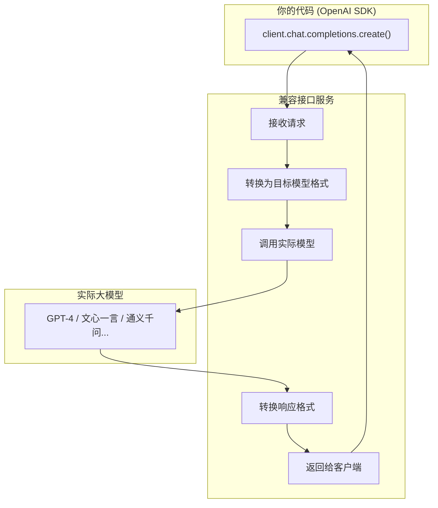

# OpenAI 兼容接口：让所有大模型都能用同一套代码调用

> 做AI应用开发的小伙伴一定遇到过这种情况：当你辛辛苦苦用 OpenAI 的 API 写完一套代码后，想要换成国产大模型（比如文心一言、通义千问），却发现——接口完全不一样，又要重新适配一套代码。这个问题困扰了无数开发者，直到「OpenAI 兼容接口」的出现。今天这篇文章，就让你彻底搞明白这个让AI开发变得更简单的神器。

---

## 一、从一个真实的痛点说起

### 1.1 小明的故事

小明是一名AI应用开发者，他开发了一个智能客服机器人。最初，他用 OpenAI 的 GPT-4 写了一套完整的代码：

```python
# 用 OpenAI API 调用的代码
import openai

client = openai.OpenAI(api_key="sk-xxxxx")

response = client.chat.completions.create(
    model="gpt-4",
    messages=[
        {"role": "user", "content": "你好，请帮我推荐一款手机"}
    ]
)

print(response.choices[0].message.content)
```

代码跑通了，效果很好，小明很开心。

但是问题来了：

1. **老板说**：GPT-4 太贵了，换成国产大模型吧，成本能省一半
2. **小明说**：好的，然后他发现——
   - 百度文心一言的接口和 OpenAI 不一样
   - 阿里通义千问的接口也不一样
   - 智谱清言的接口又不一样
   - 每个都要写一套新的适配代码

小明崩溃了。难道每次换模型都要重写一套代码？

### 1.2 解决方案的出现

有没有一种方法，能够**用同一套代码调用所有大模型**？

答案是：**有！这就是 OpenAI 兼容接口**。

有了它，小明只需要改一个配置：

```python
# 之前用 OpenAI
client = openai.OpenAI(api_key="sk-xxxxx", base_url="https://api.openai.com/v1")

# 现在用其他模型（只需要改这一行）
client = openai.OpenAI(api_key="your-api-key", base_url="https://api.deepseek.com/v1")
```

代码不用变，只需要改一个地址和密钥，就能切换到其他大模型。这就是 OpenAI 兼容接口的威力。

---

## 二、什么是 OpenAI 兼容接口？

### 2.1 官方定义

**OpenAI 兼容接口（OpenAI Compatible API）** 是指：其他大模型厂商为了让自己的 API 能够用 OpenAI 的 SDK 来调用，而特意把自己的接口设计成和 OpenAI 一样的格式。

简单来说就是：**我模仿你的接口格式，你就能用同一套代码调用我**。

### 2.2 用比喻来理解

想象一下：

- **OpenAI 就像 iPhone**：它定义了手机的各种接口（充电口、耳机孔、数据线）
- **其他厂商**: 为了让 iPhone 的配件能用，它们把接口做得和 iPhone 一样
- **OpenAI 兼容接口**: 就是其他手机厂商把自己的「接口」做得和 iPhone 一样，这样 iPhone 的充电器、耳机都能直接用

这就是「兼容」的含义：**我向你看齐，你用的工具就能直接用在我身上**。

### 2.3 哪些厂商支持 OpenAI 兼容接口？

现在支持 OpenAI 兼容接口的大模型厂商非常多：

| 厂商 | 模型 | 接口地址 |
|------|------|----------|
| **OpenAI** | GPT-4、GPT-4o | `https://api.openai.com/v1` |
| **DeepSeek** | DeepSeek Chat | `https://api.deepseek.com/v1` |
| **阿里云（通义千问）** | qwen-turbo、qwen-max | `https://dashscope.aliyuncs.com/compatible-mode/v1` |
| **百度（文心一言）** | ernie-4.0-8k | `https://qianfan.baidubce.com/v2` |
| **智谱AI** | glm-4 | `https://open.bigmodel.cn/api/paas/v4` |
| **腾讯（混元）** | hunyuan | `https://hunyuan.tencentcos.net` |
| **本地部署（Ollama）** | llama2、qwen2 | `http://localhost:11434/v1` |
| **硅基流动（SiliconFlow）** | 聚合多家模型 | `https://api.siliconflow.cn/v1` |

基本上，**国内外主流的大模型都支持 OpenAI 兼容接口**，你不需要担心适配问题。

---

## 三、OpenAI 兼容接口的原理

### 3.1 核心思路

OpenAI 兼容接口的核心思路很简单：**请求格式相同，响应格式相同，SDK 相同**。



你的代码发的是一个「OpenAI 格式的请求」，兼容接口服务收到后，转换成目标模型能理解的格式，调用模型，然后把结果再转成「OpenAI 格式的响应」返回给你。

### 3.2 请求格式对比

**标准的 OpenAI 请求格式**：

```json
{
    "model": "gpt-4",
    "messages": [
        {"role": "user", "content": "你好"}
    ],
    "temperature": 0.7,
    "max_tokens": 1000
}
```

**DeepSeek 兼容接口的请求**（完全一样）：

```json
{
    "model": "deepseek-chat",
    "messages": [
        {"role": "user", "content": "你好"}
    ],
    "temperature": 0.7,
    "max_tokens": 1000
}
```

**通义千问兼容接口的请求**（完全一样）：

```json
{
    "model": "qwen-turbo",
    "messages": [
        {"role": "user", "content": "你好"}
    ],
    "temperature": 0.7,
    "max_tokens": 1000
}
```

看出来了吗？**格式完全一样**，只是 `model` 字段换成对应的模型名。

### 3.3 响应格式对比

**OpenAI 的响应**：

```json
{
    "id": "chatcmpl-xxx",
    "object": "chat.completion",
    "created": 1234567890,
    "model": "gpt-4",
    "choices": [
        {
            "index": 0,
            "message": {
                "role": "assistant",
                "content": "你好！有什么可以帮助你的吗？"
            },
            "finish_reason": "stop"
        }
    ],
    "usage": {
        "prompt_tokens": 10,
        "completion_tokens": 20,
        "total_tokens": 30
    }
}
```

**DeepSeek 的响应**（完全一样的结构）：

```json
{
    "id": "chatcmpl-xxx",
    "object": "chat.completion",
    "created": 1234567890,
    "model": "deepseek-chat",
    "choices": [
        {
            "index": 0,
            "message": {
                "role": "assistant",
                "content": "你好！有什么可以帮助你的？"
            },
            "finish_reason": "stop"
        }
    ],
    "usage": {
        "prompt_tokens": 10,
        "completion_tokens": 20,
        "total_tokens": 30
    }
}
```

**这意味着**：你用 OpenAI SDK 解析响应的代码，**完全不用改**，就能解析其他模型的响应。

---

## 四、实战：如何使用 OpenAI 兼容接口

### 4.1 环境准备

首先，你需要安装 OpenAI 的 Python SDK：

```bash
pip install openai
```

或者使用 Go 语言：

```bash
go get github.com/sashabaranov/go-openai
```

### 4.2 方式一：调用 DeepSeek

DeepSeek 是目前最流行的国产大模型之一，价格便宜，效果也很好。

```python
from openai import OpenAI

# 创建一个客户端
# 关键点：修改 base_url 和 api_key
client = OpenAI(
    api_key="sk-xxxxxxxxxxxxxxxx",  # DeepSeek 的 API Key
    base_url="https://api.deepseek.com/v1"  # DeepSeek 的接口地址
)

# 调用模型（代码和用 OpenAI 完全一样）
response = client.chat.completions.create(
    model="deepseek-chat",  # DeepSeek 的模型名
    messages=[
        {"role": "user", "content": "用一句话解释什么是量子计算"}
    ],
    temperature=0.7,
    max_tokens=500
)

# 打印结果
print(response.choices[0].message.content)
```

这就是全部代码！只需要改 `api_key` 和 `base_url`，其他代码完全不用动。

### 4.3 方式二：调用通义千问

阿里云的通义千问也支持 OpenAI 兼容接口：

```python
from openai import OpenAI

client = OpenAI(
    api_key="sk-xxxxxxxxxxxxxxxx",  # 通义千问的 API Key
    base_url="https://dashscope.aliyuncs.com/compatible-mode/v1"  # 通义千问的接口地址
)

response = client.chat.completions.create(
    model="qwen-turbo",  # 通义千问的模型名
    messages=[
        {"role": "user", "content": "用一句话解释什么是量子计算"}
    ],
    temperature=0.7,
    max_tokens=500
)

print(response.choices[0].message.content)
```

### 4.4 方式三：调用文心一言

百度的文心一言同样支持：

```python
from openai import OpenAI

client = OpenAI(
    api_key="xxxxxxxxxxxxxxxx",  # 百度的 API Key
    base_url="https://qianfan.baidubce.com/v2"  # 百度的接口地址
)

response = client.chat.completions.create(
    model="ernie-4.0-8k",  # 文心一言的模型名
    messages=[
        {"role": "user", "content": "用一句话解释什么是量子计算"}
    ],
    temperature=0.7,
    max_tokens=500
)

print(response.choices[0].message.content)
```

### 4.5 方式四：调用本地部署的模型（Ollama）

如果你在本地部署了大模型（比如用 Ollama），也可以通过 OpenAI 兼容接口调用：

```python
from openai import OpenAI

client = OpenAI(
    api_key="ollama",  # 本地部署不需要真实的 Key
    base_url="http://localhost:11434/v1"  # Ollama 的本地地址
)

response = client.chat.completions.create(
    model="llama2",  # 你本地部署的模型名
    messages=[
        {"role": "user", "content": "用一句话解释什么是量子计算"}
    ],
    temperature=0.7,
    max_tokens=500
)

print(response.choices[0].message.content)
```

这意味着：**你可以用同样的代码在本测测试、线上切换模型**，非常方便。

### 4.6 方式五：用 Go 语言调用

如果你用 Go 语言开发，也完全支持：

```go
package main

import (
    "context"
    "fmt"
    openai "github.com/sashabaranov/go-openai"
)

func main() {
    // 创建客户端
    client := openai.NewClient(
        "sk-xxxxxxxxxxxxxxxx",  // DeepSeek 的 API Key
        openai.WithBaseURL("https://api.deepseek.com/v1"),  // DeepSeek 的接口地址
    )

    // 创建请求
    resp, err := client.CreateChatCompletion(
        context.Background(),
        openai.ChatCompletionRequest{
            Model: "deepseek-chat",
            Messages: []openai.ChatCompletionMessage{
                {
                    Role:    openai.ChatMessageRoleUser,
                    Content: "用一句话解释什么是量子计算",
                },
            },
        },
    )

    if err != nil {
        fmt.Printf("Error: %v\n", err)
        return
    }

    // 打印结果
    fmt.Println(resp.Choices[0].Message.Content)
}
```

Go 语言的代码和 Python 几乎一样，只是语法不同。

---

## 五、一个完整的项目示例

### 5.1 场景：智能问答机器人

假设我们要开发一个智能问答机器人，需要：

1. 支持多种大模型切换
2. 能够配置使用哪个模型
3. 代码保持简洁

### 5.2 解决方案：配置化切换模型

我们可以把模型配置放在一个配置文件里：

```python
# config.py
from dataclasses import dataclass
from enum import Enum

class ModelProvider(Enum):
    OPENAI = "openai"
    DEEPSEEK = "deepseek"
    QWEN = "qwen"
    ERNIE = "ernie"

@dataclass
class ModelConfig:
    provider: ModelProvider
    model: str
    base_url: str
    api_key: str

# 模型配置
CONFIGS = {
    ModelProvider.DEEPSEEK: ModelConfig(
        provider=ModelProvider.DEEPSEEK,
        model="deepseek-chat",
        base_url="https://api.deepseek.com/v1",
        api_key="your-deepseek-key"
    ),
    ModelProvider.QWEN: ModelConfig(
        provider=ModelProvider.QWEN,
        model="qwen-turbo",
        base_url="https://dashscope.aliyuncs.com/compatible-mode/v1",
        api_key="your-qwen-key"
    ),
    ModelProvider.ERNIE: ModelConfig(
        provider=ModelProvider.ERNIE,
        model="ernie-4.0-8k",
        base_url="https://qianfan.baidubce.com/v2",
        api_key="your-ernie-key"
    ),
}
```

### 5.3 统一的问答客户端

然后创建一个统一的客户端类：

```python
# chat_client.py
from openai import OpenAI
from config import ModelProvider, CONFIGS

class AIChatClient:
    def __init__(self, provider: ModelProvider):
        config = CONFIGS[provider]
        self.client = OpenAI(
            api_key=config.api_key,
            base_url=config.base_url
        )
        self.model = config.model
    
    def chat(self, message: str) -> str:
        response = self.client.chat.completions.create(
            model=self.model,
            messages=[
                {"role": "user", "content": message}
            ]
        )
        return response.choices[0].message.content
    
    def chat_with_history(self, messages: list) -> str:
        response = self.client.chat.completions.create(
            model=self.model,
            messages=messages
        )
        return response.choices[0].message.content
```

### 5.4 使用示例

现在，切换模型只需要改一个参数：

```python
# main.py
from chat_client import AIChatClient
from config import ModelProvider

# 使用 DeepSeek
client = AIChatClient(ModelProvider.DEEPSEEK)
print(client.chat("你好，请介绍一下自己"))

# 想要换成通义千问？只需要改这一行
client = AIChatClient(ModelProvider.QWEN)
print(client.chat("你好，请介绍一下自己"))

# 想要换成文心一言？再改这一行
client = AIChatClient(ModelProvider.ERNIE)
print(client.chat("你好，请介绍一下自己"))
```

这就是 **OpenAI 兼容接口的威力**：一套代码，能够在多个大模型之间自由切换。

---

## 六、流式输出：让体验更丝滑

### 6.1 什么是流式输出？

普通API是一口气返回完整回答，但流式输出是**一个字一个字地返回**，让你感觉像是在和真人对话：

```
普通返回：你好，我叫小明，今年25岁。
流式返回：你 -> 好 -> ， -> 我 -> 叫 -> 小 -> 明 -> ...
```

### 6.2 流式输出的代码

OpenAI 兼容接口同样支持流式输出：

```python
from openai import OpenAI

client = OpenAI(
    api_key="sk-xxxxxxxxxxxxxxxx",
    base_url="https://api.deepseek.com/v1"
)

# 流式调用
stream = client.chat.completions.create(
    model="deepseek-chat",
    messages=[
        {"role": "user", "content": "写一首关于春天的诗"}
    ],
    stream=True  # 关键：开启流式输出
)

# 逐字打印
for chunk in stream:
    if chunk.choices[0].delta.content:
        print(chunk.choices[0].delta.content, end="", flush=True)
```

### 6.3 Flask + 流式输出示例

如果要在 Web 应用中使用流式输出，需要配合 Flask 的流式响应：

```python
from flask import Flask, request, Response, stream_with_context
from openai import OpenAI

app = Flask(__name__)

@app.route("/chat", methods=["POST"])
def chat():
    data = request.json
    user_message = data.get("message", "")
    
    # 创建客户端
    client = OpenAI(
        api_key="sk-xxxxxxxxxxxxxxxx",
        base_url="https://api.deepseek.com/v1"
    )
    
    def generate():
        stream = client.chat.completions.create(
            model="deepseek-chat",
            messages=[
                {"role": "user", "content": user_message}
            ],
            stream=True
        )
        
        for chunk in stream:
            if chunk.choices[0].delta.content:
                yield chunk.choices[0].delta.content
    
    return Response(
        stream_with_context(generate()),
        content_type="text/event-stream"
    )
```

这样，前端就能收到流式返回的文字了。

---

## 七、常见问题汇总

### Q1：OpenAI 兼容接口和原生 API 有什么区别？

**没有本质区别**。兼容接口在功能上几乎和原生 API 一样，只是格式保持一致。唯一的差异可能是：

- 某些特殊参数可能不完全支持
- 部分厂商可能有调用频率限制

但对于 99% 的使用场景，两者完全等价。

### Q2：所有模型都支持完整的 OpenAI 功能吗？

大多数模型支持以下核心功能：

- `chat.completions.create`：对话生成
- `embeddings.create`：文本嵌入
- `models.list`：模型列表

部分高级功能（如 Function Calling、Vision 图像识别）可能不是所有厂商都支持，需要查看具体文档。

### Q3：如何选择合适的模型？

| 场景 | 推荐模型 | 理由 |
|------|----------|------|
| 日常对话 | DeepSeek Chat、qwen-turbo | 便宜，效果好 |
| 复杂推理 | DeepSeek Coder、GPT-4 | 推理能力强 |
| 代码生成 | DeepSeek Coder、Claude | 代码能力强 |
| 中文优化 | 通义千问、文心一言 | 中文效果更好 |
| 私有化部署 | Ollama | 数据安全 |

### Q4：调用这些接口需要翻墙吗？

**不需要**。国内的大模型（DeepSeek、通义千问、文心一言）都是国内服务器，不需要翻墙。只有调用 OpenAI 官方 API 才需要。

### Q5：如何获取 API Key？

每个厂商的获取方式不同：

- **DeepSeek**：访问 https://platform.deepseek.com 注册后获取
- **通义千问**：访问 https://dashscope.console.aliyun.com 开通服务
- **文心一言**：访问 https://login.bce.baidu.com 开通千帆平台

### Q6：费用如何计算？

各厂商的定价不同，一般来说：

- **DeepSeek**：输入 $0.27/M tokens，输出 $1.1/M tokens
- **通义千问**：输入 ¥1-2/M tokens，输出 ¥2-8/M tokens
- **文心一言**：按调用次数计费

具体价格请参考各厂商的官方定价页面。

### Q7：如何保证 API Key 的安全？

**不要把 API Key 硬编码在代码里**。推荐的做法是：

```python
import os

# 从环境变量读取
api_key = os.environ.get("DEEPSEEK_API_KEY")
# 或者从配置文件读取
```

---

OpenAI 兼容接口就是一个**统一大模型调用的标准**。无论你用 GPT-4、DeepSeek、通义千问还是文心一言，只要它们支持这个标准，你就能用同一套代码调用它们。

它的核心价值在于：

- **降低切换成本**：换模型只需要改配置
- **统一开发体验**：学会一个，就会全部
- **生态丰富**：所有主流 SDK 都支持
- **国产友好**：国内模型基本都支持

---

## 九、附录：常用接口地址速查表

| 厂商 | base_url | 模型名称 |
|------|----------|----------|
| OpenAI | `https://api.openai.com/v1` | gpt-4, gpt-4o, gpt-3.5-turbo |
| DeepSeek | `https://api.deepseek.com/v1` | deepseek-chat |
| 通义千问 | `https://dashscope.aliyuncs.com/compatible-mode/v1` | qwen-turbo, qwen-max |
| 文心一言 | `https://qianfan.baidubce.com/v2` | ernie-4.0-8k |
| 智谱AI | `https://open.bigmodel.cn/api/paas/v4` | glm-4 |
| Ollama | `http://localhost:11434/v1` | llama2, qwen2 |

---