# PaddleOCR 深度解析：从文字识别原理到工业级 OCR 系统

> 当你用手机拍下一张发票，几秒钟后金额、日期、税号自动填入表单；当你将一本纸质书拍照，瞬间得到可编辑的文字——这背后，OCR（光学字符识别）技术在默默运转。在众多 OCR 工具中，PaddleOCR 以 73000+ GitHub Star 登顶全球 OCR 项目榜首，成为中文世界乃至全球最具影响力的开源 OCR 工具包。本文将从 OCR 的基本原理出发，由浅入深，全面拆解 PaddleOCR 的技术内核。

---

## 一、OCR 是什么？——一个古老问题的新解法

### 1.1 从"让机器识字"说起

OCR 的历史比大多数人想象的要久远。1914 年，Emanuel Goldberg 发明了能够将印刷字符转化为电信号的机器；1950 年，David Shepard 发明了第一台商用 OCR 设备。早期的 OCR 系统依赖手工设计的特征（如笔画方向、穿越线数量），只能识别特定字体和固定格式的印刷文字。

真正的变革发生在深度学习时代。2010 年代，卷积神经网络（CNN）和循环神经网络（RNN）的引入，使得 OCR 从"模板匹配"进化为"端到端学习"，识别精度和通用性实现了质的飞跃。

### 1.2 OCR 的三阶段范式

一个完整的 OCR 系统通常包含三个核心步骤：

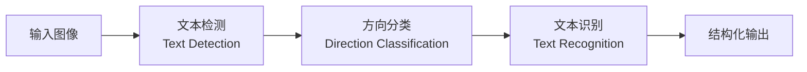

**文本检测**：定位图像中所有文字的区域，输出每个文字区域的边界框（通常是多边形或矩形）。

**方向分类**：判断检测到的文字区域的阅读方向（0°、90°、180°、270°），将非水平文字旋转至正确方向，为后续识别做好准备。

**文本识别**：对每个文字区域进行字符级识别，将图像中的文字转化为可编辑的文本字符串。

这三个步骤环环相扣：检测不准，识别区域就错；方向判错，识别必然混乱；识别模型差，前面做得再好也白搭。

### 1.3 为什么 OCR 如此困难？

OCR 面临的挑战远比"识别印刷体"复杂：

| 挑战类型 | 具体表现 | 示例场景 |
|---------|---------|---------|
| 场景复杂性 | 光照变化、模糊、遮挡、透视畸变 | 街景招牌、随手拍 |
| 文字多样性 | 字体、大小、颜色、排列方向各异 | 海报、广告 |
| 语言多样性 | 中英日韩混排、竖排文字、从右到左书写 | 多语言文档 |
| 形态多样性 | 弯曲文字、艺术字、手写体 | 手写笔记、书法 |
| 长尾问题 | 生僻字、数学公式、化学符号 | 学术论文 |

这些挑战，决定了 OCR 不可能靠一个"万能模型"解决所有问题，而需要一套精心设计的系统工程。

---

## 二、PaddleOCR 是什么？——从开源工具到生态体系

### 2.1 诞生背景

2020 年，百度 PaddlePaddle 团队发布了 PaddleOCR。彼时，OCR 领域存在一个尴尬局面：

- **学术端**：大量论文提出了先进的检测和识别算法，但代码复现困难、工程化程度低。
- **工业端**：商业 OCR 服务价格高昂，且对定制化需求支持不足；开源方案零散，缺少统一的工具链。

PaddleOCR 的目标很明确：**提供一套"开箱即用"的超轻量 OCR 系统，同时覆盖从学术研究到工业部署的完整链路。**

### 2.2 核心设计哲学

PaddleOCR 的设计遵循三个原则：

**1. 超轻量**

PP-OCR 系列最令人印象深刻的标签是"超轻量"——整个检测+方向分类+识别三件套模型不到 10MB。这意味着它可以在手机端甚至嵌入式设备上实时运行。在模型参数量的每一个数量级上做极致压缩，是 PaddleOCR 团队的核心追求。

**2. 模块化**

PaddleOCR 将 OCR 系统拆解为检测、识别、分类、文档分析等独立模块，每个模块可以单独替换、升级和训练。你可以用 DB 检测器搭配 SVTR 识别器，也可以换成 East 检测器搭配 CRNN 识别器——灵活组合。

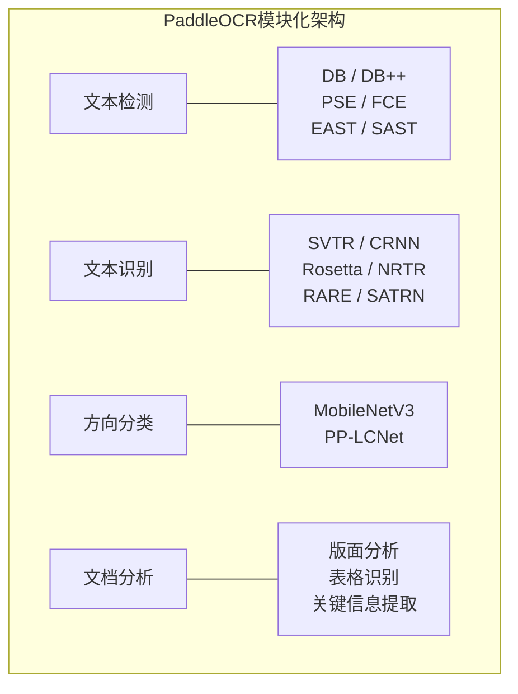

**3. 全流程**

PaddleOCR 不只是"模型集合"，它覆盖了数据准备、模型训练、压缩量化、推理部署的完整闭环。从标注工具 (PPOCRLabel) 到服务部署 (PaddleServing)，从 Python 推理到 C++ 部署，从服务端到移动端，形成了完整的工具生态。

### 2.3 GitHub 73000+ Star 的背后

截至 2026 年，PaddleOCR 在 GitHub 上获得了超过 73000 个 Star，成为全球 OCR 领域 Star 数最高的项目。这并非偶然：

- **真正可用**：不是 demo 级别的概念验证，而是可以直接用于生产的工业级方案。
- **持续迭代**：从 PP-OCRv1 到 PP-OCRv5，每一代都有实质性提升。
- **中文友好**：对中文场景的优化深度远超其他开源项目。
- **社区活跃**：丰富的文档、教程、Issue 响应，降低了使用门槛。

---

## 三、文本检测：找到文字在哪里

### 3.1 文本检测的核心问题

文本检测本质上是一个特殊的"目标检测"任务，但它有着独特的挑战：

**形状多变**：文字不总是矩形。弯曲的招牌文字、倾斜的手写行，需要用多边形而非矩形框来标注。

**长宽比极端**：一行文字可能横跨整张图片，长宽比达到 10:1 甚至更高，远超通用目标检测中的物体。

**密集排列**：文档中的文字行紧密排列，间距很小，框与框之间容易重叠或遗漏。

**多尺度**：同一张图中，字号可能相差数倍（如标题和正文）。

### 3.2 DB 算法：PaddleOCR 的检测基石

PaddleOCR 从 v1 起就选择了 **DB（Differentiable Binarization，可微分二值化）** 作为默认的文本检测算法。DB 最初由清华和百度在 2020 年提出，其核心创新在于：**将传统后处理中的二值化操作融入网络训练过程中，使其可微分，从而端到端优化。**

#### 3.2.1 传统分割方法的痛点

在 DB 之前，基于分割的文本检测方法流程如下：

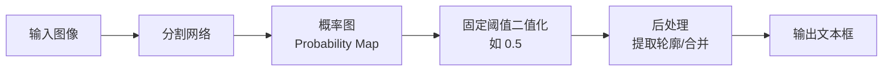

问题出在 **步骤 D**：固定阈值二值化是不可微分的操作，网络无法针对最终检测效果优化阈值选择。阈值太高，文字区域碎裂；阈值太低，文字区域粘连。这个"阈值鸿沟"成为分割方法精度的瓶颈。

#### 3.2.2 DB 的核心突破：可微分二值化

DB 的核心思想是：**让网络自己学习每个像素的最优二值化阈值。**

网络同时输出两个图：

- **概率图（Probability Map）** $P$：每个像素属于文字区域的概率。
- **阈值图（Threshold Map）** $T$：每个像素自适应的二值化阈值。

然后，用以下公式进行可微分近似二值化：

$$\hat{B}_{i,j} = \frac{1}{1 + e^{-k(P_{i,j} - T_{i,j})}}$$

其中 $k$ 是放大因子（通常取 50），控制近似程度。当 $k \to \infty$ 时，该公式退化为标准二值化；当 $k$ 有限时，该公式是光滑可微分的。

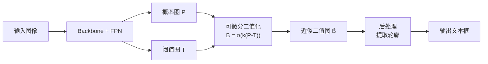

**为什么这比固定阈值好？**

关键在于：**不同区域的最优阈值可能完全不同。** 背景复杂的区域需要更高的阈值来过滤噪声，而文字边缘模糊的区域则需要更低的阈值来保留完整轮廓。DB 让网络为每个像素学习一个自适应阈值，消除了手工调参的痛苦。

更重要的是，阈值图也是网络输出的一部分，可以和概率图一起被端到端优化——整个流程完全可微分，训练信号可以直接从最终损失反传到阈值图的生成过程。

#### 3.2.3 DB 的损失函数

DB 的损失函数由三部分组成：

$$L = L_b + \alpha \cdot L_s + \beta \cdot L_t$$

- $L_b$：二值图损失（计算近似二值图与标注之间的 Dice 损失）
- $L_s$：概率图损失（计算概率图与标注之间的 Dice 损失）
- $L_t$：阈值图损失（计算阈值图与文字区域膨胀边界之间的 L1 损失）

其中 $\alpha$ 和 $\beta$ 是权重系数。值得注意的是，$L_t$ 并不直接约束阈值图等于某个固定值，而是约束它在文字边缘附近产生合理的梯度——这有助于锐化概率图的边界。

#### 3.2.4 后处理：从二值图到文本框

得到二值图后，DB 的后处理非常简洁：

1. 对二值图进行连通域分析，提取所有连通区域的轮廓。
2. 对轮廓进行简化（用 cv2.approxPolyDP），得到多边形表示。
3. 用最小外接矩形或直接用多边形作为文本框输出。

相比传统方法需要复杂的 NMS（非极大值抑制）操作，DB 的后处理更简洁高效。

### 3.3 DB++：自适应尺度融合

DB++ 在 DB 的基础上引入了 **ASF（Adaptive Scale Fusion，自适应尺度融合）** 机制，替换了 FPN 中简单的上采样相加操作。

在标准 FPN 中，不同尺度的特征图通过上采样对齐后直接相加。但不同尺度的特征对不同大小的文字重要性不同——浅层特征擅长捕捉小文字细节，深层特征擅长理解大文字语义。ASF 为每个尺度学习一组注意力权重，自适应地调整不同尺度特征的融合比例：

$$F_{fused} = \sum_{i} w_i \cdot F_i$$

其中 $w_i$ 是通过注意力模块学习的权重，$F_i$ 是第 $i$ 个尺度的特征。

### 3.4 PP-OCR 各版本的检测演进

PaddleOCR 在每个版本中都对检测模块进行了针对性优化：

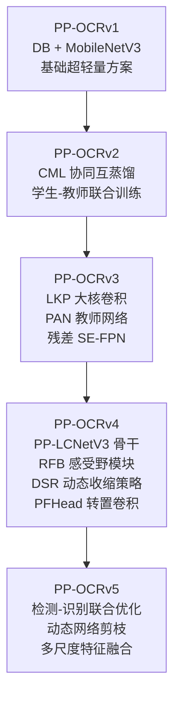

**PP-OCRv2 的 CML 蒸馏**：协同互蒸馏（Collaborative Mutual Learning）让教师模型和学生模型相互学习，而非单向知识传递。这避免了传统蒸馏中教师模型"独断"导致的偏差传递。

**PP-OCRv3 的大核卷积**：LKP（Large Kernel Profile）卷积使用大尺寸卷积核（如 7×7 甚至 11×11），在不显著增加参数量的前提下大幅扩大了感受野，让检测器更容易捕捉长文本行的完整信息。

**PP-OCRv4 的 RFB 模块**：RFB（Receptive Field Block）模拟人类视觉的感受野结构，通过多分支不同膨胀率的卷积组合，在不增加太多计算量的前提下增强了特征的多尺度感受野。特别有助于检测不同大小的文字。

**PP-OCRv4 的 DSR 策略**：动态收缩比率（Dynamic Shrink Ratio）让训练过程中文本区域的收缩比例从 0.4 线性增长到 0.6。前期较小的收缩比例让模型更容易学习到文字的大致区域，后期较大的收缩比例促使模型精确定位文字边界——这是一种渐进式课程学习的思想。

---

## 四、文本识别：读懂文字说了什么

### 4.1 从 CRNN 到 SVTR：识别范式的演进

文本识别的核心任务是：给定一个裁剪好的文字图像，输出对应的文字序列。这是一个典型的 **序列到序列** 问题。

#### 4.1.1 CRNN：经典三段式

CRNN（Convolutional Recurrent Neural Network, 2015）是文本识别领域的经典之作，其架构清晰优雅：

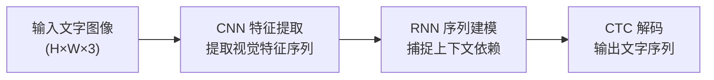

**CNN 部分**：通常使用 VGG、ResNet 或 MobileNet 提取特征。关键操作是将图像转换为特征序列——将高度维度压缩为 1，保留宽度维度的序列信息。

**RNN 部分**：使用双向 LSTM 对特征序列进行上下文建模。前向 LSTM 捕捉从左到右的依赖，后向 LSTM 捕捉从右到左的依赖。

**CTC 解码**：CTC（Connectionist Temporal Classification）是训练序列识别模型的关键技术。它解决了一个核心问题：**训练时没有字符级的对齐标注。** 我们只有图像和对应的整行文字，不知道每个字符在图像中的精确位置。CTC 通过引入"空白"符号和折叠机制，允许网络在不对齐的情况下计算损失：

$$p(l|x) = \sum_{\pi \in \mathcal{B}^{-1}(l)} \prod_{t=1}^{T} p_t(\pi_t|x)$$

其中 $l$ 是目标文字序列，$\pi$ 是所有可以映射到 $l$ 的路径，$\mathcal{B}^{-1}$ 是折叠去空白的逆操作。

CTC 的一个重要假设是**条件独立性**：每个时间步的输出相互独立。这意味着 CTC 无法直接建模字符之间的语言模型关系——这是它的优势（训练简单），也是它的局限（缺乏上下文）。

#### 4.1.2 Attention 解码：引入语言模型

为了克服 CTC 的条件独立性限制，基于 Attention 的序列到序列模型被引入文本识别：

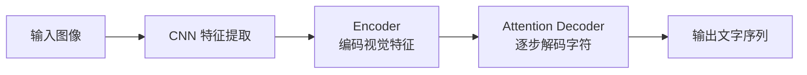

Attention 解码器在每一步解码时，都会"关注"编码器输出中最相关的位置，从而在识别当前字符时参考已有上下文。这相当于内置了一个隐式的语言模型。

但 Attention 也有问题：**曝光偏差（Exposure Bias）**。训练时使用真实标签作为解码器输入（Teacher Forcing），推理时使用自己的预测结果，这种训练-推理的不一致可能导致错误累积。

#### 4.1.3 SVTR：纯视觉 Transformer 的突破

PP-OCRv3 开始引入的 **SVTR（Scene Text Recognition with Visual Tokens, 2022）** 代表了一种新的识别范式——完全抛弃 RNN，用 Transformer 的全局注意力来建模文字序列：

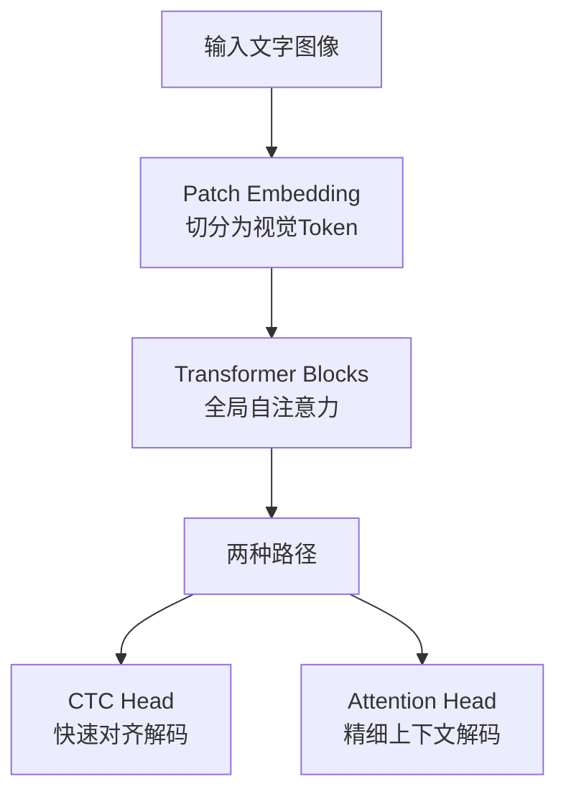

SVTR 的核心洞察是：**文字识别中的上下文依赖不一定需要时序建模，全局视觉注意力就足够了。** 相比 RNN 逐步传递信息，Transformer 的自注意力机制可以直接建模任意两个位置的关系，更高效地捕捉远距离依赖。

在 PaddleOCR 中，SVTR 与轻量级 CNN 骨干网络结合，形成了 **SVTR_LCNet** 混合架构：前端用 CNN 快速提取局部特征，后端用 Transformer 建模全局上下文，在精度和速度之间取得了极佳平衡。

### 4.2 PP-OCR 识别模块的技术演进

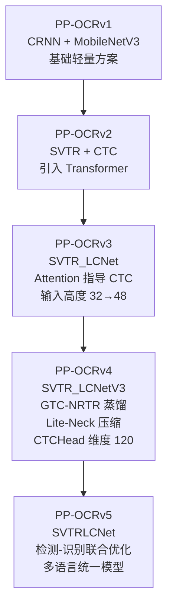

**PP-OCRv3 的关键升级**：

1. **输入分辨率提升**：识别模型的输入图像高度从 32px 提升到 48px。看似微小的变化，实际影响深远——更高的输入分辨率意味着更精细的字符细节，尤其对中文这类结构复杂的文字至关重要。

2. **Attention 指导 CTC**：用 Attention 分支的输出作为软标签来指导 CTC 分支的训练。CTC 分支用于推理（速度快），Attention 分支仅在训练时提供更精确的梯度信号——这是一种"训练时用 Attention 的精确性，推理时用 CTC 的高效性"的巧妙策略。

3. **自监督预训练**：利用海量无标注文字图像进行自监督预训练，为模型提供更好的初始化。

**PP-OCRv4 的关键升级**：

1. **GTC-NRTR**：用 Transformer 架构的 NRTR 分支替代传统的 Attention 分支来指导 CTC 训练。NRTR 的序列建模能力更强，能更稳定地提供高质量指导信号，同时抑制简单样本上的过拟合。

2. **DF 数据挖掘**：利用已有模型对训练数据进行预测，根据置信度筛选和过滤低质量标注数据。"垃圾进、垃圾出"是机器学习的铁律——在数据上花功夫往往比在模型上花功夫更有效。

3. **多尺度训练**：随机在 32/48/64 三种输入高度之间切换，增强模型对不同字号文字的鲁棒性。

4. **CTC 蒸馏改进**：在 CTC 输出 logits 上沿文本长度维度取均值进行蒸馏，消除了 CTC 输出中 Blank 位分布差异带来的对齐困难。

**PP-OCRv5 的关键升级**：

PP-OCRv5 是一次范式级的跃迁。论文标题点明了它的野心：**"A Specialized 5M-Parameter Model Rivaling Billion-Parameter Vision-Language Models on OCR Tasks"**——仅 500 万参数，在 OCR 任务上媲美十亿参数级的视觉语言模型。

1. **检测-识别联合优化**：不再将检测和识别作为独立任务分别训练，而是在端到端框架中联合优化。检测模块的输出直接作为识别模块的输入，梯度可以回传到检测模块，使得检测器学到"对识别更友好的文本框"。

2. **数据驱动的三维度分析**：从数据难度（Data Difficulty）、数据准确性（Data Accuracy）、数据多样性（Data Diversity）三个维度系统性地分析和优化训练数据，形成了一套完整的数据工程方法论。

3. **多语言统一模型**：首次实现单模型支持多种文字类型（简体中文、繁体中文、中文拼音、英文、数字），无需切换模型。在 106 种语言的实验中，PP-OCRv5 展现了强大的跨语言泛化能力。

---

## 五、方向分类：不起眼但不可或缺的一环

### 5.1 为什么需要方向分类？

在真实场景中，文字并不总是水平的。拍照时的倾斜、书本的竖排、海报的旋转文字……如果识别模型收到一个倒置或侧放的文字图像，几乎不可能正确识别。

方向分类器是一个轻量级的图像分类模型，将检测到的文字区域分为 0°、90°、180°、270° 四个方向，然后根据分类结果将文字旋转到正确方向。

### 5.2 模型设计

方向分类器的模型非常轻量——通常只有几兆参数。PP-OCR 各版本使用的骨干网络从 MobileNetV3 演进到 PP-LCNet，核心思想一致：**用最少的参数实现可靠的方向判断。**

值得注意的是，方向分类器的训练数据需要特别构造——从原始文档图像中裁剪出文字区域，然后人工或自动旋转为不同方向。数据增强策略（如随机旋转、颜色扰动）对分类器的鲁棒性至关重要。

---

## 六、PP-Structure：超越文字识别，走向文档理解

### 6.1 从"识别文字"到"理解文档"

单纯识别出文字内容，在很多场景下是不够的。一张增值税发票，你不仅需要识别出所有文字，还需要知道哪些是"发票号码"、哪些是"金额"、哪些是"购买方"；一份 PDF 合同，你需要区分标题、正文、签名区、表格。

**PP-Structure** 是 PaddleOCR 团队推出的文档理解工具包，它在文本检测和识别的基础上，增加了版面分析、表格识别和关键信息提取三大能力：

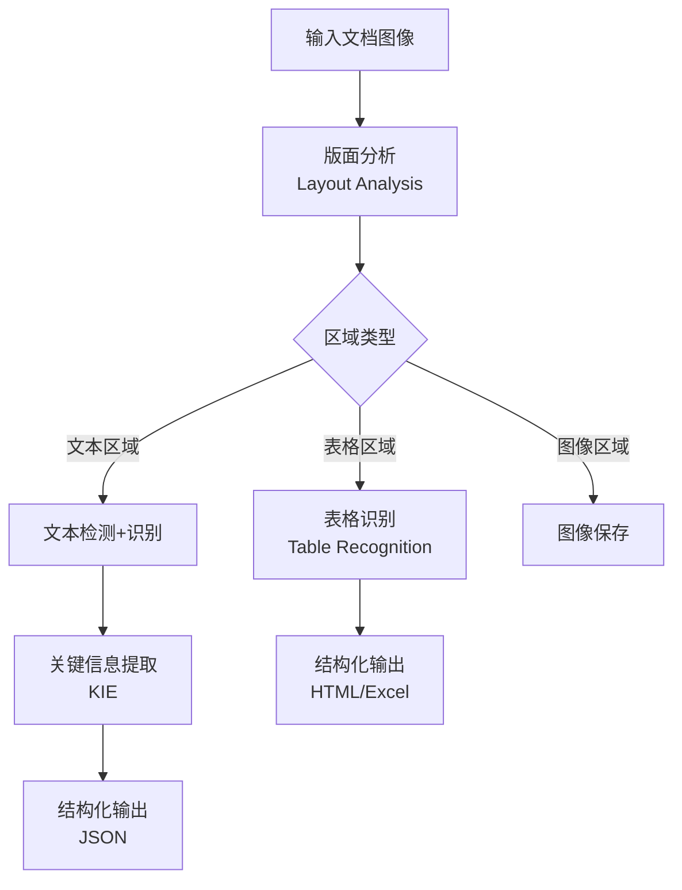

### 6.2 版面分析

版面分析的任务是将文档图像划分为不同类型的区域：标题、正文、表格、图片、列表等。PP-StructureV2 使用 **PP-LCNet** 作为骨干网络，结合 PicoDet 的检测头，实现了快速准确的版面区域检测。

版面分析的难点在于：
- 不同文档的版面差异巨大（论文、发票、身份证、试卷……）
- 区域之间的边界模糊（正文和注脚之间？标题和正文之间？）
- 嵌套结构（表格内的文字、图中的文字）

### 6.3 表格识别

表格识别是 PP-Structure 的核心亮点之一。它需要完成三个子任务：

1. **表格区域检测**：定位图像中的表格位置。
2. **表格结构识别**：识别行列关系、合并单元格等结构信息。
3. **单元格内容识别**：识别每个单元格中的文字。

PP-StructureV2 的表格识别模块采用 **SLANet（Structure Learning Approach Network）**：

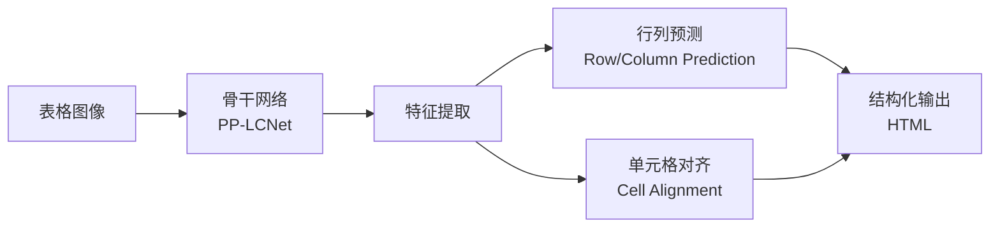

SLANet 的创新在于将表格结构识别建模为行列关系预测问题：对每个像素预测它属于第几行第几列，然后通过后处理将相邻的同行列像素聚合为单元格。这种方法对复杂表格（合并单元格、跨行跨列）有较好的适应性。

最终，表格识别可以输出 HTML 格式的结构化结果，直接粘贴到 Excel 或 Word 中使用。

### 6.4 关键信息提取

关键信息提取（KIE）是从非结构化文字中抽取结构化字段的任务。比如从身份证中提取"姓名"、"身份证号"、"地址"等字段。

PP-Structure 的 KIE 模块使用 **VI-LayoutXLM** 模型，它融合了视觉特征（图像）、布局特征（位置坐标）和文本特征（识别结果），三者协同建模：

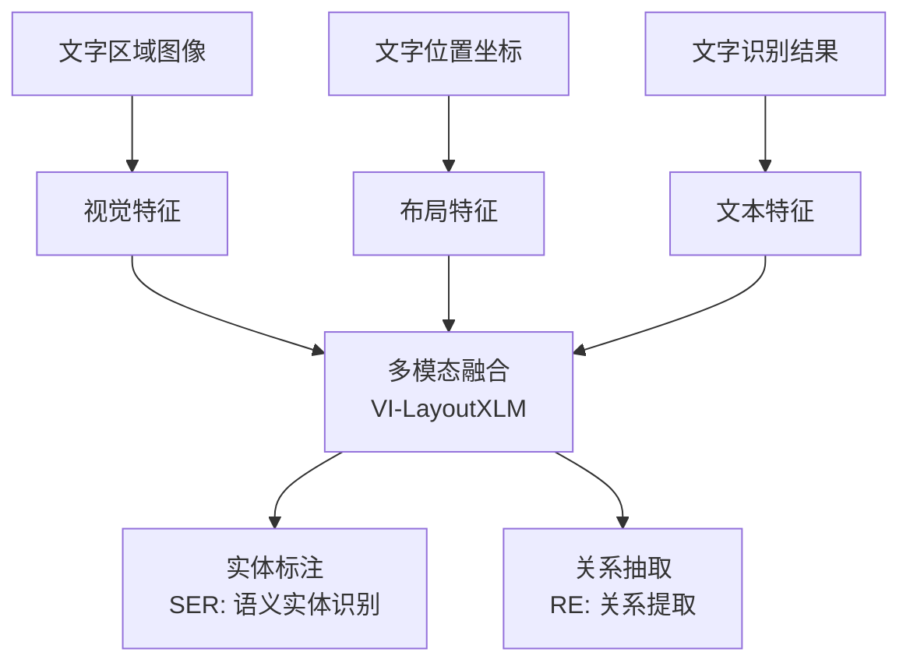

**SER（Semantic Entity Recognition）**：为每个文字区域分配语义标签（如"姓名"、"金额"）。

**RE（Relation Extraction）**：识别语义实体之间的关系（如"发票号码"对应的值是哪个文字区域）。

---

## 七、蒸馏与训练策略：小模型如何拥有大智慧

### 7.1 为什么蒸馏如此重要？

PaddleOCR 的核心目标之一是"超轻量"——模型必须在手机端实时运行。但轻量模型的容量有限，直接训练往往精度不足。知识蒸馏（Knowledge Distillation）是解决这一矛盾的核心技术。

知识蒸馏的核心思想是：**用一个大的"教师模型"指导小的"学生模型"训练，让学生模型在不增加推理成本的前提下获得接近教师模型的精度。**

### 7.2 PP-OCR 中的蒸馏策略演进

**PP-OCRv2 的 CML 蒸馏**：

CML（Collaborative Mutual Learning）是一种双向蒸馏策略：

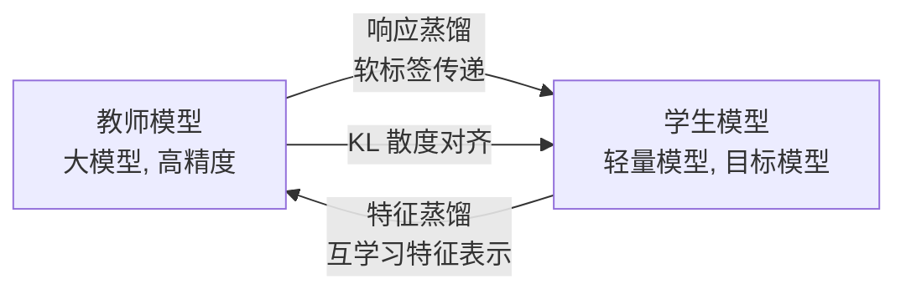

传统蒸馏是单向的（教师 → 学生），CML 引入了学生到教师方向的反馈，使教师也能从学生的特征中获益。PP-OCRv4 进一步引入了 KL 散度损失来对齐师生网络的响应分布，使蒸馏过程更加稳定。

**PP-OCRv4 的 DKD 蒸馏**：

DKD（Decoupled Knowledge Distillation）将传统的 KD 损失解耦为两个部分：

- **目标类知识**：教师对正确类别的置信度分布。
- **非目标类知识**：教师在错误类别之间的区分度信息。

通过分别调整这两部分的权重，可以更精细地控制蒸馏过程，避免教师模型在某些类别上的过度自信或偏见被传递给学生。

**PP-OCRv4 的 GTC-NRTR 蒸馏**：

在识别模块中，PP-OCRv4 使用 NRTR（一种 Transformer 序列到序列模型）作为教师来指导 CTC 分支的训练。NRTR 的 Attention 解码提供了逐字符的精确对齐信息，这对 CTC 来说是极为珍贵的指导——CTC 本身无法获得这种细粒度的对齐信号。

### 7.3 数据工程：被低估的关键角色

在 PP-OCR 的迭代中，"数据策略"的贡献不亚于模型架构创新：

| 策略 | 版本 | 核心思想 |
|------|------|---------|
| TextConAug | v3 | 文字内容增强，基于文字内容相似性合成训练样本 |
| UDML | v3 | 统一深度互学习，多模块联合蒸馏 |
| DF 数据挖掘 | v4 | 用模型预测筛选低质量标注数据 |
| 多尺度训练 | v4 | 随机切换输入分辨率，增强多尺度鲁棒性 |
| 数据三维度分析 | v5 | 从难度、准确性、多样性三个维度系统性优化数据 |
| 自监督预训练 | v3/v5 | 利用无标注数据学习通用视觉表示 |

**数据 > 算法**，这在 PP-OCR 的迭代中体现得淋漓尽致。PP-OCRv5 论文甚至将"数据驱动的三维度分析"列为核心贡献之一——模型架构只是 5M 参数的轻量网络，真正让它在精度上媲美十亿参数 VLM 的，是对训练数据的极致工程。

---

## 八、PP-OCRv5 vs VLM：小模型的逆袭

### 8.1 OCR 2.0 时代的挑战

2023 年以来，GPT-4V、Qwen-VL 等视觉语言大模型（VLM）展示了惊人的 OCR 能力——直接看图读字，无需检测-识别流水线。一时间，"传统 OCR 已死"的论调甚嚣尘上。

PP-OCRv5 的论文正面回应了这一挑战：

> "我们证明了 PP-OCRv5，仅凭 500 万参数的专业化模型，在 OCR 任务上达到了与十亿参数 VLM 相当的性能，同时在定位精度和幻觉问题上表现更优。"

### 8.2 专业模型 vs 通用模型

```mermaid
graph TD
    subgraph VLM["视觉语言大模型<br/>（如 GPT-4V, Qwen-VL）"]
        V1[优势：通用性强<br/>无需训练即用]
        V2[劣势：参数量巨大<br/>推理慢、成本高]
        V3[劣势：幻觉问题<br/>可能"编造"文字]
        V4[劣势：定位不准<br/>难以精确输出文本框]
    end
    subgraph Specialized["专业化 OCR 模型<br/>（如 PP-OCRv5）"]
        S1[优势：参数量极小<br/>5M, 可端侧部署]
        S2[优势：推理极快<br/>毫秒级响应]
        S3[优势：定位精确<br/>像素级文本框]
        S4[优势：无幻觉<br/>输出严格基于视觉证据]
    end
```

**VLM 的幻觉问题**：VLM 在 OCR 任务中最致命的问题是"幻觉"——在文字模糊或部分遮挡时，VLM 倾向于根据上下文"猜测"出合理但不存在的文字。例如，将模糊的"杭州"识别为"广州"，因为后者在训练语料中更常见。专业化 OCR 模型则严格基于视觉特征输出，不会"脑补"。

**VLM 的定位问题**：VLM 输出的是文字内容，而非精确的空间位置。在需要文本框坐标的场景（如文档编辑、表格提取），VLM 无法直接满足需求。PP-OCRv5 的检测模块可以输出像素级的文本框，这是 VLM 做不到的。

**VLM 的效率问题**：即使是最轻量级的 VLM，参数量也在数十亿级别，推理延迟在秒级。而 PP-OCRv5 在 CPU 上仅需约 80ms，在移动端更快。对于实时 OCR 场景（如扫描翻译、视频字幕提取），这种延迟差距是决定性的。

### 8.3 PaddleOCR-VL：融合之路

PaddleOCR 并非排斥 VLM，而是在 2025 年推出了 **PaddleOCR-VL**，将 VLM 的语义理解能力与专业化 OCR 模型的精确性相结合：

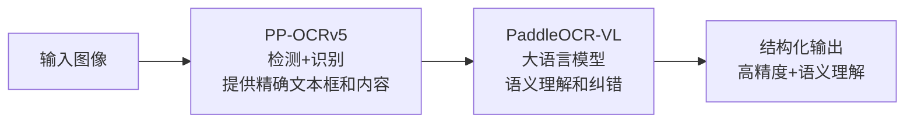

这种"专业模型做粗活，大模型做精修"的分工，兼顾了效率和质量，代表了 OCR 工程的未来方向。

---

## 九、全流程实战：从零到部署

### 9.1 快速上手

PaddleOCR 的使用非常简洁。最基础的三行代码即可完成文字识别：

```python
from paddleocr import PaddleOCR

ocr = PaddleOCR(use_angle_cls=True, lang='ch')
result = ocr.ocr('invoice.jpg', cls=True)

for line in result:
    print(line)
```

输出包含每个文字区域的位置坐标、方向分类和识别文字：

```
[[[24.0, 36.0], [302.0, 34.0], [303.0, 62.0], [25.0, 64.0]], ('增值税电子普通发票', 0.987)]
```

### 9.2 自定义训练

当预训练模型无法满足特定场景需求时，可以基于自有数据微调：

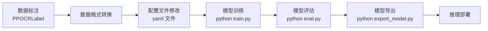

**PPOCRLabel** 是 PaddleOCR 提供的半自动标注工具，支持矩形框、多边形框和表格标注，大幅降低了数据标注成本。

### 9.3 模型压缩与量化

为了在移动端或边缘设备上部署，PaddleOCR 提供了完整的模型压缩工具链：

- **量化训练（QAT）**：将模型权重从 FP32 量化为 INT8，模型体积减小约 4 倍，推理速度提升 2-3 倍。
- **剪枝（Pruning）**：移除不重要的卷积通道，减少计算量。
- **蒸馏（Distillation）**：在压缩后用教师模型恢复精度。

### 9.4 多平台部署

PaddleOCR 支持极其广泛的部署方式：

| 部署方式 | 适用场景 | 推理框架 |
|---------|---------|---------|
| Python 推理 | 快速验证、研究 | PaddlePaddle |
| C++ 推理 | 高性能服务端 | Paddle Inference |
| ONNX 导出 | 跨框架部署 | ONNX Runtime |
| TensorRT | GPU 极致加速 | TensorRT |
| Paddle Lite | 移动端（Android/iOS） | Paddle Lite |
| Paddle.js | 浏览器端 | WebAssembly |
| FastDeploy | 一键多平台部署 | FastDeploy |
| 服务化部署 | 微服务架构 | Paddle Serving / Triton |

---

## 十、PaddleOCR 全景架构图

将前面所有内容整合，我们可以得到 PaddleOCR 的全景技术架构：

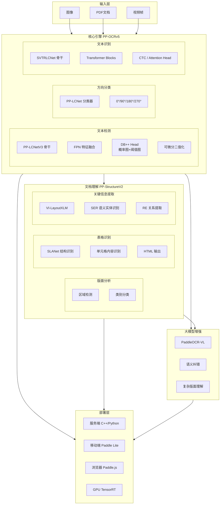

---

### 11.1 PaddleOCR 的成功密码

回望 PaddleOCR 的迭代历程，其成功可以归结为三个核心原则：

**极致的工程思维**：每一个版本的升级都不是"换个新模型"那么简单，而是在精度、速度、模型大小三个维度上同时优化。RFB 模块、Lite-Neck 压缩、DSR 动态收缩……每一处改进都是针对具体瓶颈的精准手术。

**数据驱动的务实路线**：PP-OCRv5 论文将数据工程（而非模型架构）列为核心贡献，这在学术界是罕见的。DF 数据挖掘、三维度分析、自监督预训练——这些"脏活累活"往往是真正拉开差距的关键。

**生态建设的长远视野**：PPOCRLabel 标注工具、FastDeploy 部署框架、PP-Structure 文档理解、PaddleOCR-VL 大模型增强……PaddleOCR 不是在做"一个 OCR 模型"，而是在构建"OCR 的基础设施"。

### 11.2 OCR 的未来方向

**端到端一体化**：从"检测→分类→识别"的分步流水线，走向统一的端到端模型。PP-OCRv5 已经在检测-识别联合优化上迈出了一步，未来更彻底的端到端方案将简化系统复杂度、消除模块间的误差累积。

**多模态融合**：视觉信息不再是唯一的输入信号。语音（朗读内容辅助识别）、触控（用户标注辅助定位）、文档元数据（PDF 内嵌信息）等多模态信号的融合将进一步提升 OCR 的精度和鲁棒性。

**从识别到理解**：OCR 的终极目标不是"把图像变成文字"，而是"理解文档的语义结构"。PP-Structure 和 PaddleOCR-VL 已经在这个方向上布局，未来的 OCR 系统将越来越像"文档 AI 助手"——不仅能读出文字，还能理解含义、回答问题、执行操作。

**端侧智能**：随着移动端芯片算力提升和模型压缩技术进步，完整的 OCR 能力（包括文档理解）将逐步从云端下沉到端侧。5M 参数的 PP-OCRv5 已经证明了轻量化的可行性，未来的端侧 OCR 将更加强大。

---
