# 深入理解大模型RAG：从原理到实践的完整指南

> 本文将从零开始，由浅入深地介绍检索增强生成（RAG）技术的核心原理、架构演进、关键技术细节以及最新发展趋势。无论您是刚接触RAG的新手，还是希望深入理解其技术细节的从业者，都能从中获得有价值的内容。

---

## 一、引言：为什么我们需要RAG？

大语言模型（LLM）在自然语言处理领域取得了革命性的突破，能够生成流畅、连贯的文本。然而，在实际应用中，我们发现LLM存在几个关键问题：

### 1.1 大模型的局限性

**知识截止问题**

大模型的知识来源于训练数据，存在明确的时间边界。GPT-4的训练数据截止到2023年，对于之后发生的事件一无所知。这意味着：

- 无法回答最新的事实性问题
- 无法处理实时变化的业务数据
- 对新出现的概念、产品、政策缺乏认知

**幻觉问题（Hallucination）**

模型在不确定时会"一本正经地胡说八道"，生成看似合理但实际错误的信息。这在医疗、法律、金融等严肃场景中是不可接受的。

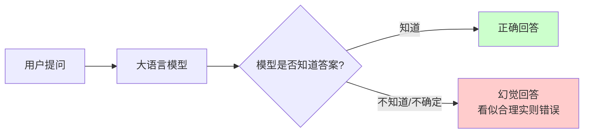

**领域知识不足**

通用大模型虽然知识面广，但在特定垂直领域（如企业内部知识库、专业医疗诊断、法律条文解读）往往缺乏足够的专业知识。

**上下文窗口限制**

即使是GPT-4 Turbo的128K上下文窗口，也无法容纳企业的全部知识库。我们不可能把所有参考资料都塞进Prompt中。

### 1.2 现有解决方案的局限

面对这些问题，业内主要有两种解决思路：

| 方案 | 优势 | 劣势 |
|------|------|------|
| **模型微调（Fine-tuning）** | 可以注入领域知识 | 成本高、知识仍有时效性、无法动态更新 |
| **上下文学习（ICL）** | 无需训练、灵活 | 受窗口限制、长文本性能下降 |
| **RAG** | 可动态更新、成本可控、可追溯来源 | 需要额外检索系统、可能检索不精准 |

RAG（Retrieval-Augmented Generation，检索增强生成）正是为解决这些问题而生的技术方案。它巧妙地将**信息检索**与**文本生成**相结合，让大模型能够"开卷考试"——在回答问题时参考外部知识库。

---

## 二、RAG的核心概念

### 2.1 什么是RAG？

RAG是一种将信息检索系统与大语言模型生成能力相结合的技术架构。其核心思想是：

> **在生成回答之前，先从外部知识库中检索相关信息，将这些信息作为上下文提供给大模型，从而增强模型的回答质量和准确性。**

用一个简单的类比来理解：

- **纯LLM**：闭卷考试，只能依赖记忆（训练数据）
- **RAG**：开卷考试，可以查阅参考资料后再作答

### 2.2 RAG的基本架构

RAG系统由三个核心组件构成：

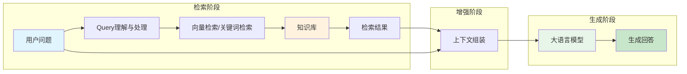

**检索器（Retriever）**

负责从知识库中找到与用户问题相关的文档片段。核心挑战是如何准确理解问题意图，并召回最相关的内容。

**增强器（Augmentor）**

将检索到的内容与用户问题组合，构建适合模型理解的Prompt。这涉及到上下文窗口管理、信息去重、格式化等技术。

**生成器（Generator）**

即大语言模型，基于增强后的上下文生成最终回答。优秀的生成器需要能够：
- 准确理解检索内容
- 忠实于检索事实
- 自然流畅地组织答案

### 2.3 RAG与微调的对比

这是很多人关心的问题：**什么时候用RAG，什么时候用微调？**

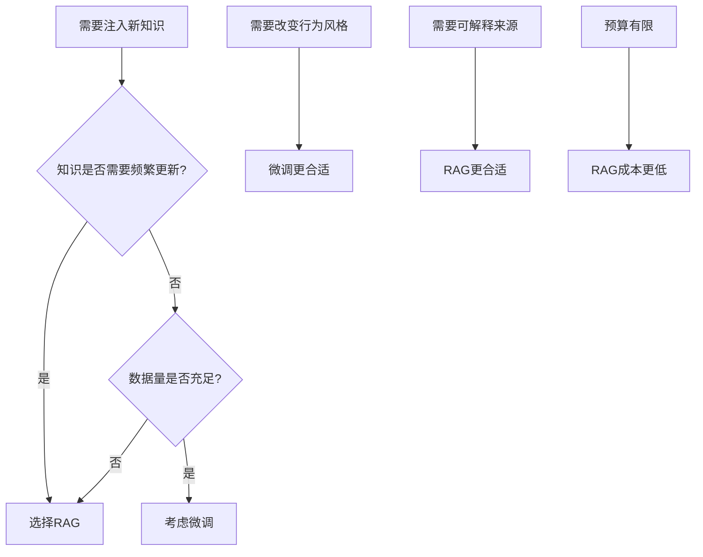

更详细的对比：

| 维度 | RAG | 微调 |
|------|-----|------|
| **知识更新** | 即时更新，修改知识库即可 | 需重新训练，周期长 |
| **成本** | 较低，主要是向量检索成本 | 较高，需要GPU训练资源 |
| **可解释性** | 高，可追溯答案来源 | 低，黑盒模型 |
| **适用场景** | 事实性问答、知识密集型任务 | 风格迁移、行为模式调整 |
| **数据隐私** | 知识可存储在本地，安全性高 | 训练数据可能泄露 |
| **推理延迟** | 多了检索步骤，略慢 | 直接推理，较快 |
| **效果上限** | 受检索质量制约 | 受训练数据和模型能力制约 |

**最佳实践：混合使用**

在很多实际场景中，RAG与微调并非互斥，而是互补：

1. **先微调**：让模型学习领域术语、回答风格、特定任务格式
2. **再加RAG**：注入具体的、需要动态更新的知识

---

## 三、RAG的工作原理：由浅入深

理解了基本概念后，让我们深入RAG的技术细节。

### 3.1 向量检索：RAG的基石

现代RAG系统大多基于**向量检索**（也称语义检索）。要理解它，需要先理解几个关键概念。

#### 3.1.1 文本嵌入（Text Embedding）

文本嵌入是将离散的文本转换为连续的向量表示。其核心思想是：

> **语义相似的文本，其向量表示在空间中距离相近。**

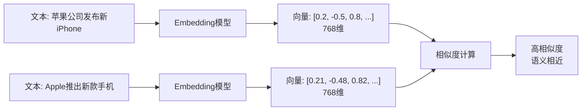

主流的Embedding模型：

| 模型 | 维度 | 特点 |
|------|------|------|
| OpenAI text-embedding-3-small | 1536 | 高性能，API调用 |
| OpenAI text-embedding-3-large | 3072 | 更高精度 |
| BGE-large-zh | 1024 | 中文效果好，开源 |
| M3E | 768/1024 | 多语言支持好 |
| Cohere Embed | 1024 | 商业API，多语言 |

#### 3.1.2 相似度计算

常用的向量相似度计算方法：

**余弦相似度（Cosine Similarity）**

最常用的方法，计算两个向量夹角的余弦值：

```
similarity = (A · B) / (||A|| × ||B||)
```

取值范围 [-1, 1]，值越大表示越相似。

**欧氏距离（Euclidean Distance）**

计算两个向量之间的直线距离：

```
distance = sqrt(Σ(ai - bi)²)
```

距离越小越相似。

**点积（Dot Product）**

直接计算向量点积：

```
dot_product = A · B = Σ(ai × bi)
```

#### 3.1.3 向量数据库

向量数据库专门用于存储和检索高维向量，核心能力是**近似最近邻搜索（ANN）**。

为什么需要ANN？精确搜索需要计算查询向量与库中所有向量的相似度，时间复杂度O(n)，当数据量达到百万、千万级时无法接受。ANN通过牺牲少量精度换取大幅性能提升。

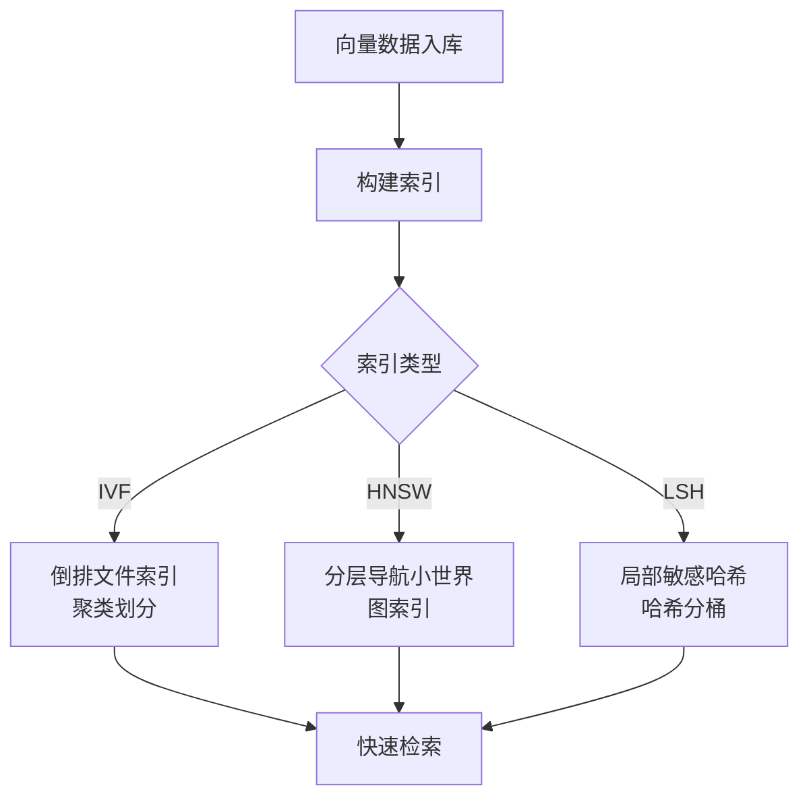

主流向量数据库对比：

| 数据库 | 类型 | 特点 | 适用场景 |
|--------|------|------|----------|
| **Pinecone** | 云原生 | 托管服务，免运维 | 快速原型、小团队 |
| **Milvus** | 开源分布式 | 高性能、可扩展 | 大规模生产环境 |
| **Weaviate** | 开源 | 内置向量化，GraphQL | 需要灵活查询 |
| **Qdrant** | 开源 | Rust实现，性能好 | 自部署，资源敏感 |
| **Chroma** | 开源轻量 | 简单易用 | 开发测试、小规模 |
| **PGVector** | PostgreSQL扩展 | 利用现有PG | 已有PG基础设施 |

### 3.2 RAG的完整流程

让我们看一个完整的RAG处理流程，分为**离线索引**和**在线查询**两个阶段。

#### 3.2.1 离线索引阶段

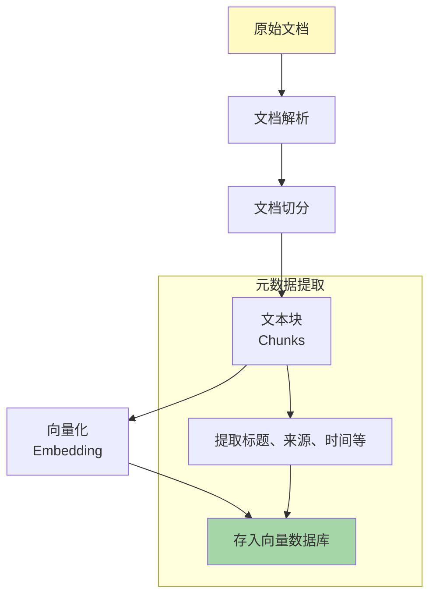

**文档解析**

支持多种格式：PDF、Word、HTML、Markdown等。关键点：
- 保留文档结构（标题、段落、列表）
- 提取表格、图片中的文本
- 处理多语言、编码问题

**文档切分**

这是影响RAG效果的关键步骤。常见策略：

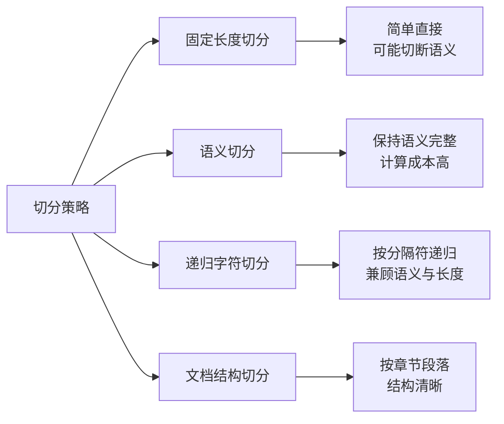

具体来说：

**固定长度切分**

```
chunk_size = 500字符
chunk_overlap = 50字符
```

简单但可能打断句子。

**递归字符切分**（LangChain默认）

按优先级使用分隔符：
1. 双换行符（段落）
2. 单换行符（句子）
3. 句号
4. 空格
5. 字符

**语义切分**

计算相邻句子的向量相似度，在语义边界处切分：

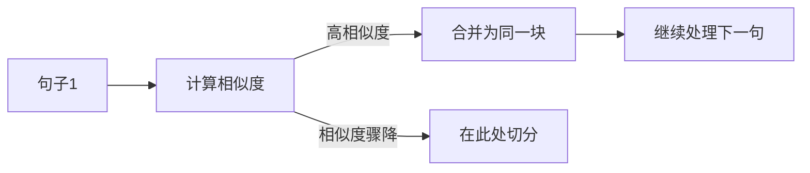

#### 3.2.2 在线查询阶段

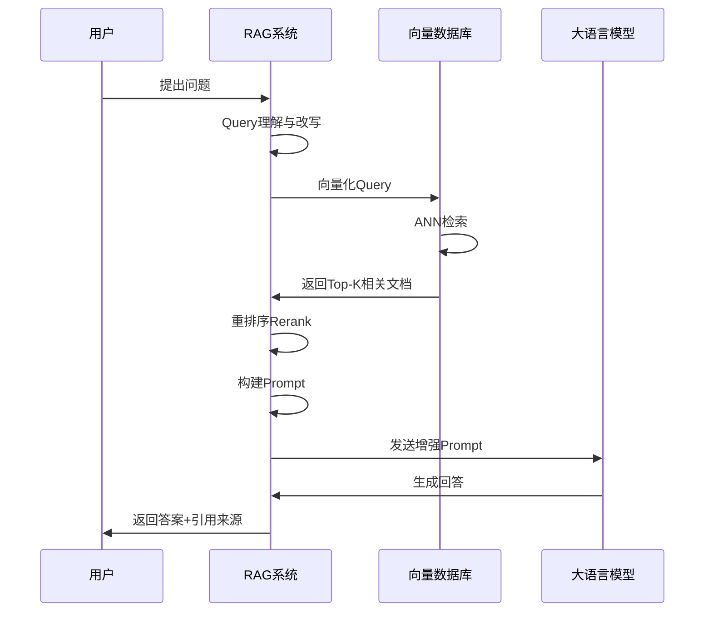

**Query理解与处理**

原始用户问题可能表述不清，需要优化：

- **Query改写**：将口语化问题转为标准查询
- **Query扩展**：生成多个相关查询，提高召回
- **Query分解**：复杂问题拆分为子问题

例子：
```
原始问题：那个新政策怎么样？
↓ Query改写
改写后：2024年最新的XX政策有哪些内容和影响？

↓ Query扩展
扩展查询：
1. 2024年XX政策内容解读
2. XX政策与旧政策对比
3. XX政策实施影响分析
```

**检索与召回**

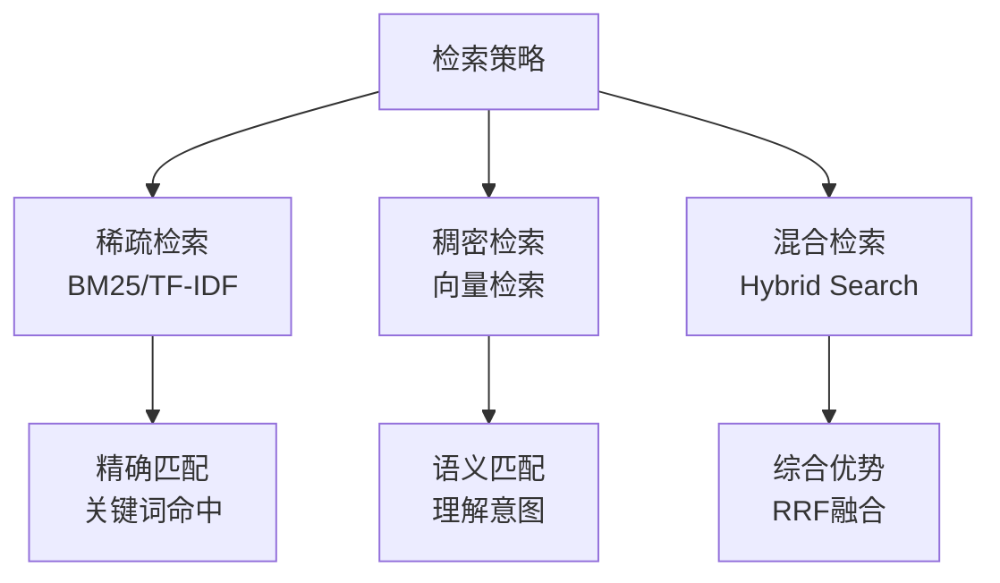

**混合检索（Hybrid Search）** 是当前的最佳实践：

1. 同时进行关键词检索和向量检索
2. 分别获得Top-K结果
3. 使用**倒数排名融合（RRF）**合并结果

RRF公式：
```
RRF_score(d) = Σ 1 / (k + rank(d))
```

其中k通常取60。

**重排序（Rerank）**

检索回来的文档可能相关性不够精准，需要二次排序：

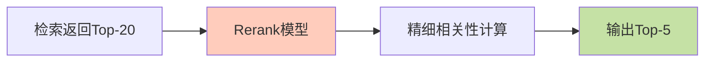

Rerank模型不同于检索模型：
- 检索模型：单塔，独立编码Query和Doc，快速但粗略
- Rerank模型：双塔交叉编码，Query-Doc联合编码，精准但慢

主流Rerank模型：
- **BGE-reranker**：开源，中文效果好
- **Cohere Rerank**：商业API，多语言支持
- **BCE Rerank**：开源，多语言

---

## 四、RAG架构演进：从Naive到Modular

RAG技术在快速发展中经历了几个阶段的演进。

### 4.1 Naive RAG（朴素RAG）

最基础的RAG架构，"检索-读取"两步走：

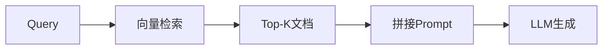

**存在的问题**：

1. **检索质量低**：
   - Query与文档语义gap
   - 向量模型能力有限
   - 召回不全面或噪音太多

2. **生成质量差**：
   - 检索内容与问题不相关
   - 模型被无关信息干扰
   - 无法处理需要多跳推理的问题

3. **增强不足**：
   - 简单拼接，信息冗余
   - 上下文窗口浪费

### 4.2 Advanced RAG（进阶RAG）

在Naive RAG基础上增加优化措施：

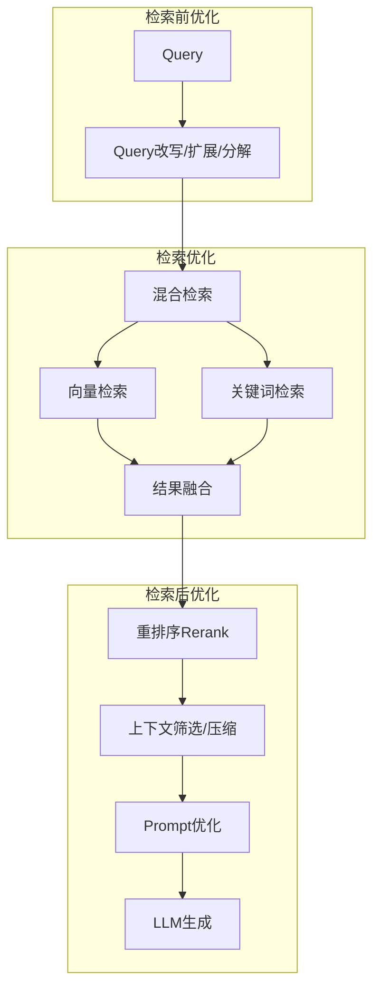

**关键优化技术**：

**检索前优化**

| 技术 | 说明 |
|------|------|
| Query改写 | 将模糊问题转为清晰查询 |
| Query扩展 | 生成多个相关查询提高召回 |
| Query路由 | 判断问题类型，路由到不同处理流程 |
| 假设性回答 | 先生成假设答案，用答案检索文档 |

**检索后优化**

| 技术 | 说明 |
|------|------|
| 重排序 | 用精细模型对检索结果排序 |
| 上下文压缩 | 过滤无关内容，保留核心信息 |
| 提示词工程 | 设计更好的Prompt模板 |
| 引用标注 | 让模型标注信息来源 |

### 4.3 Modular RAG（模块化RAG）

更进一步，将RAG系统模块化，支持灵活组合：

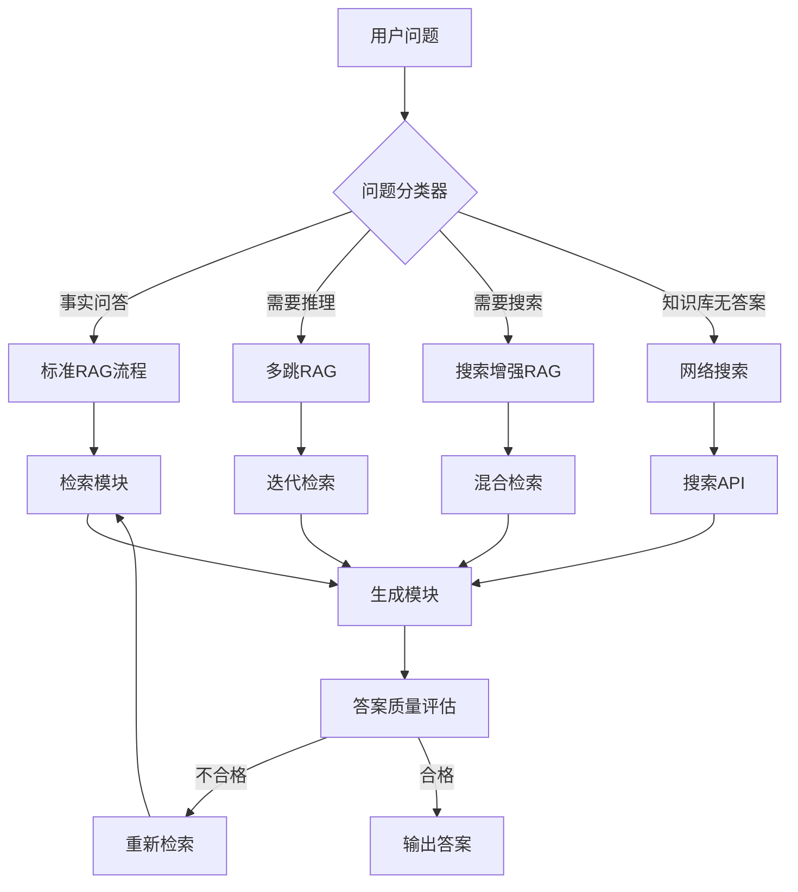

**模块化组件**：

1. **检索模块**：支持多种检索方式可插拔
2. **路由模块**：根据问题类型选择处理流程
3. **生成模块**：可切换不同LLM
4. **评估模块**：评估答案质量，决定是否需要重新检索
5. **记忆模块**：存储对话历史，支持多轮对话

### 4.4 Graph RAG：知识图谱增强

将知识图谱与RAG结合，提供结构化的知识关联：

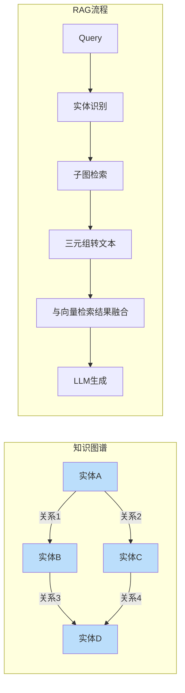

**优势**：
- 提供实体间的结构化关系
- 支持多跳推理
- 减少幻觉，答案更准确

**挑战**：
- 知识图谱构建成本高
- 需要实体识别、关系抽取等技术
- 图谱覆盖率有限

---

## 五、关键技术与最佳实践

### 5.1 文档切分的艺术

切分策略直接影响检索效果，需要权衡多个因素：

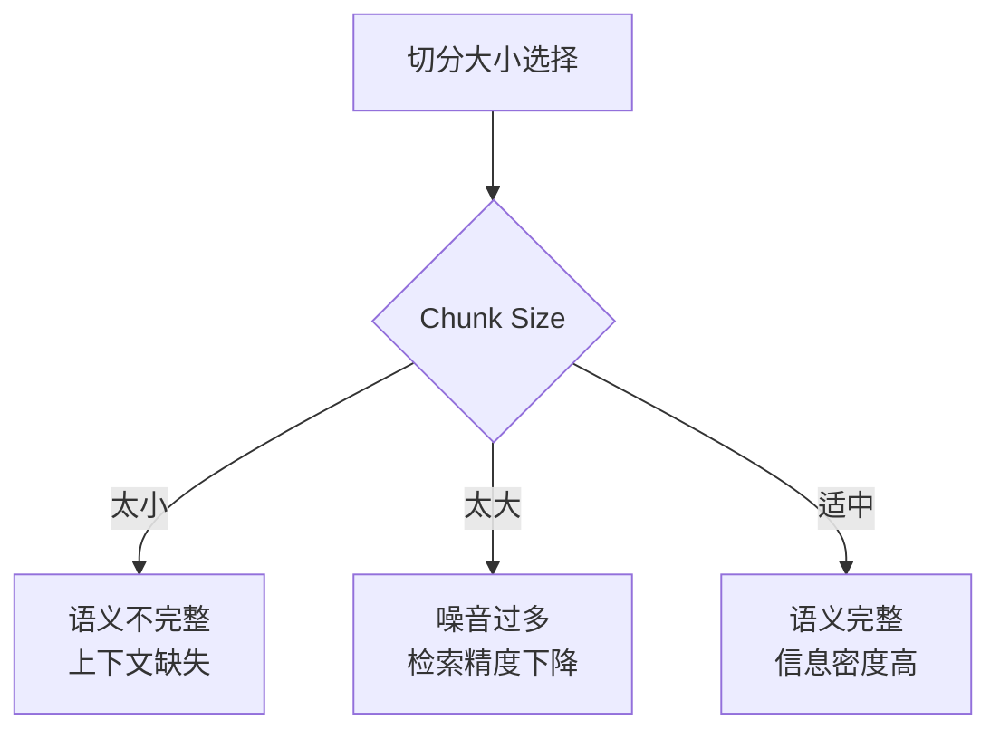

**推荐的切分策略**：

| 文档类型 | 推荐策略 | Chunk Size | Overlap |
|----------|----------|------------|---------|
| 技术文档 | 按章节段落 | 1000-1500字符 | 200字符 |
| 问答对 | 按QA对完整切分 | 保持QA完整 | 0 |
| 长文章 | 语义切分 | 500-800字符 | 100字符 |
| 代码 | 按函数/类 | 保持逻辑完整 | 0 |
| 法律条文 | 按条/款 | 保持条文完整 | 0 |

**高级切分技术**：

**父文档检索**

存储小切片用于精准检索，但返回包含它的更大上下文：

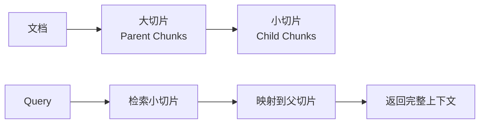

**滑动窗口**

对于长文档，使用滑动窗口确保信息不遗漏：

```
Window 1: [Doc[0:500]]
Window 2: [Doc[400:900]]  # 100字符overlap
Window 3: [Doc[800:1300]]
...
```

### 5.2 检索优化策略

**多查询检索**

一个问题生成多个相关查询，扩大召回：

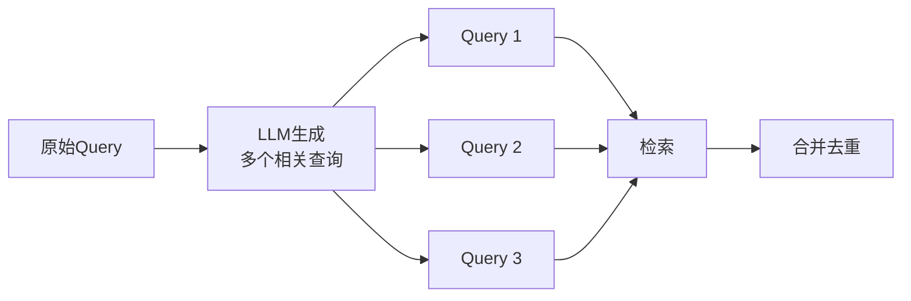

**假设性文档嵌入**

先让LLM生成一个假设性的答案，用这个答案去检索：

```
原始问题：如何优化Python代码性能？
↓ LLM生成假设答案
假设答案：可以通过以下方式优化Python代码性能：
1. 使用内置函数代替循环
2. 使用生成器减少内存
3. 使用NumPy进行数值计算
...
↓ 用假设答案检索
找到真正的相关文档
```

**自我查询**

从问题中提取元数据过滤条件：

```
问题：2023年发布的关于人工智能的政策文件有哪些？

提取信息：
- 时间：2023年
- 主题：人工智能
- 类型：政策文件

执行过滤检索：
filter = {"year": 2023, "topic": "AI", "type": "policy"}
```

### 5.3 上下文管理

**上下文压缩**

检索回的内容可能冗长，需要压缩：

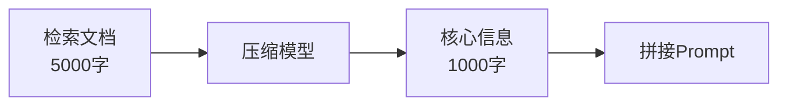

压缩方法：
- **提取式**：选择关键句子
- **生成式**：用LLM总结要点
- **过滤式**：基于相似度过滤

**上下文排序**

把最相关的内容放在Prompt中间靠前的位置：

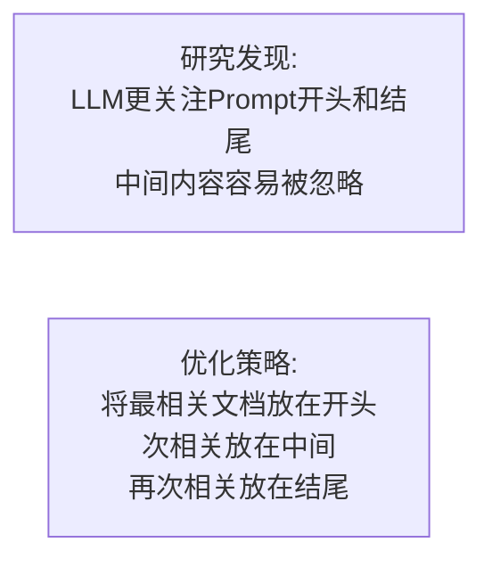

### 5.4 生成优化

**提示词工程**

一个优秀的RAG Prompt模板：

```
你是一个专业的问答助手。请基于提供的参考文档回答用户问题。

【重要规则】
1. 只使用参考文档中的信息回答
2. 如果文档中没有相关信息，明确告知用户
3. 回答时标注信息来源，格式为[来源1]
4. 不要编造或推测信息

【参考文档】
{documents}

【用户问题】
{query}

【回答】
```

**引用标注**

让模型在回答时标注引用来源：

```mermaid
graph LR
    A[检索文档] --> B[编号<br/>Doc1, Doc2, Doc3]
    B --> C[Prompt中标注]
    C --> D[模型生成时引用]
    D --> E["答案: XXX [Doc1][Doc2]"]
```

### 5.5 评估与优化

**评估指标**

| 指标 | 说明 | 评估方法 |
|------|------|----------|
| **检索召回率** | 相关文档是否被召回 | 人工标注+计算 |
| **检索精确率** | 召回文档中有多少相关 | 人工评估 |
| **答案相关性** | 答案是否回答了问题 | GPT-4评估 |
| **答案忠实度** | 答案是否基于检索内容 | 与原文对比 |
| **答案完整性** | 答案是否全面 | 人工评估 |

**RAGAS评估框架**

自动化评估RAG系统的主流方案：

```mermaid
flowchart LR
    A[问题] --> B[RAG系统]
    B --> C[答案]
    
    A --> D[RAGAS评估]
    C --> D
    E[检索文档] --> D
    
    D --> F[Faithfulness<br/>忠实度]
    D --> G[Answer Relevancy<br/>答案相关性]
    D --> H[Context Precision<br/>上下文精确度]
    D --> I[Context Recall<br/>上下文召回率]
```

---

## 六、高级RAG架构

### 6.1 Self-RAG：自我反思的RAG

让模型自己判断是否需要检索、检索结果是否相关：

```mermaid
flowchart TB
    A[问题] --> B{是否需要检索?}
    B -->|是| C[执行检索]
    B -->|否| D[直接生成]
    
    C --> E{检索结果相关?}
    E -->|相关| F[基于检索生成]
    E -->|不相关| G[重新检索/直接生成]
    
    F --> H{答案有依据?}
    H -->|是| I[输出答案]
    H -->|否| J[重新检索/标注不确定]
    
    style B fill:#fff9c4
    style E fill:#fff9c4
    style H fill:#fff9c4
```

**关键创新**：

- 引入特殊的反思token
- 模型自主学习何时检索、何时生成
- 减少无效检索，提高效率

### 6.2 Corrective RAG（CRAG）

在检索后评估质量，纠正问题：

```mermaid
flowchart TB
    A[检索文档] --> B{相关性评估}
    B -->|正确| C[正常生成]
    B -->|模糊| D[知识精炼<br/>提取关键信息]
    B -->|错误| E[网络搜索/知识图谱]
    
    D --> F[生成答案]
    E --> F
    C --> F
```

### 6.3 Adaptive RAG

根据问题复杂度自适应选择策略：

```mermaid
flowchart TB
    A[问题] --> B{问题复杂度判断}
    B -->|简单| C[无需检索<br/>直接回答]
    B -->|中等| D[单次检索RAG]
    B -->|复杂| E[多次迭代检索]
    
    E --> F[多跳推理]
    F --> G[生成答案]
```

问题复杂度判断可以训练一个分类器：

```
类别A：简单问题（如"1+1=?"）→ 直接生成
类别B：单跳问题（如"北京人口多少?"）→ 单次检索
类别C：多跳问题（如"诺贝尔物理学奖得主最多的国家是哪里?"）→ 多次检索
```

### 6.4 多模态RAG

处理文本、图片、表格等多模态数据：

```mermaid
flowchart LR
    subgraph 多模态知识库
        A[文本] --> D[向量数据库]
        B[图片] --> E[图片Embedding]
        C[表格] --> F[表格转文本/结构化存储]
        E --> D
        F --> D
    end
    
    G[多模态Query] --> H{Query类型判断}
    H -->|文本| I[文本检索]
    H -->|图片| J[图片检索]
    H -->|混合| K[多模态检索]
    
    I --> L[多模态生成]
    J --> L
    K --> L
```

**技术要点**：

- 图片：使用CLIP等模型编码
- 表格：可转Markdown或保持结构化
- 视频：抽取关键帧+字幕

---

## 七、RAG面临的挑战与解决方案

### 7.1 检索质量问题

**问题1：语义鸿沟**

用户提问的表述方式与文档中的表述差异大，导致召回不精准。

解决方案：
- Query改写与扩展
- 假设性文档嵌入
- 多查询召回

**问题2：长尾知识**

冷门、专业的知识可能检索不到。

解决方案：
- 扩充知识库覆盖
- 多知识源融合
- 必要时转网络搜索

**问题3：多跳推理**

需要综合多个文档才能回答的问题，单次检索难以解决。

解决方案：
- 迭代检索
- 知识图谱增强
- Chain-of-Thought提示

### 7.2 生成质量问题

**问题1：幻觉与事实冲突**

模型可能忽略检索内容，产生幻觉。

解决方案：
- 强化提示词约束
- 调低Temperature
- 使用更强的模型
- 后处理事实核查

**问题2：信息整合困难**

多个文档信息冲突或不一致。

解决方案：
- 按权威性/时效性排序
- 明确标注信息来源
- 让模型说明存在争议

**问题3：答案冗长或过于简略**

模型生成风格不稳定。

解决方案：
- 在Prompt中明确长度要求
- 给出示例（Few-shot）
- 后处理截断或扩写

### 7.3 系统性能问题

**问题1：检索延迟**

向量检索在高并发下可能成为瓶颈。

解决方案：
- 向量数据库索引优化
- 检索结果缓存
- 异步预加载

**问题2：Token消耗大**

大量检索内容导致Prompt过长。

解决方案：
- 上下文压缩
- 智能截断
- 选择性检索

**问题3：成本控制**

向量数据库、LLM API调用都有成本。

解决方案：
- 混合检索（关键词优先）
- 本地模型替代API
- 结果缓存复用

---

## 八、实战建议与最佳实践

### 8.1 如何构建高质量知识库

```mermaid
flowchart TB
    A[原始数据收集] --> B[数据清洗]
    B --> C[数据结构化]
    C --> D[元数据标注]
    D --> E[版本管理]
    
    subgraph 持续优化
        E --> F[用户反馈收集]
        F --> G[问题案例分析]
        G --> H[知识库更新]
        H --> E
    end
```

**关键步骤**：

1. **数据清洗**：去噪、去重、格式统一
2. **结构化处理**：保留文档结构信息
3. **元数据标注**：来源、时间、权限等
4. **版本管理**：支持知识库回滚、增量更新
5. **持续迭代**：基于用户反馈优化

### 8.2 技术选型建议

**初创阶段（快速验证）**

| 组件 | 推荐 | 理由 |
|------|------|------|
| Embedding | OpenAI text-embedding-3-small | 开箱即用，效果好 |
| 向量数据库 | Pinecone / Chroma | 托管/轻量，免运维 |
| LLM | GPT-3.5-turbo / GPT-4o | 能力强，生态完善 |
| 框架 | LangChain / LlamaIndex | 封装完善，快速上手 |

**生产阶段（稳定可控）**

| 组件 | 推荐 | 理由 |
|------|------|------|
| Embedding | BGE-large-zh（自部署） | 私有化，成本可控 |
| 向量数据库 | Milvus / Qdrant | 高性能，可扩展 |
| LLM | 私有化部署模型 | 数据安全，成本固定 |
| Rerank | BGE-reranker | 提升精度 |

### 8.3 性能优化清单

```mermaid
mindmap
  root((RAG优化))
    检索优化
      混合检索
      Query扩展
      重排序
      多级缓存
    生成优化
      Prompt工程
      上下文压缩
      引用标注
      答案后处理
    架构优化
      异步处理
      结果缓存
      负载均衡
      监控告警
    数据优化
      知识库更新
      元数据完善
      去重去噪
      切分优化
```

---

## 九、未来发展趋势

### 9.1 长上下文时代的RAG

随着模型上下文窗口不断增大（Claude支持200K、Gemini支持1M+），RAG是否还有价值？

答案是肯定的。RAG的价值不仅在于突破窗口限制，更在于：

- **实时性**：随时更新知识库
- **可解释性**：追溯答案来源
- **成本控制**：减少无效Token消耗
- **专业领域**：企业私有知识

趋势：**长上下文 + RAG 混合架构**

```mermaid
graph LR
    A[Query] --> B{问题类型}
    B -->|需要大量文档| C[长上下文处理<br/>直接放入完整文档]
    B -->|精准问答| D[RAG检索<br/>精准召回]
```

### 9.2 端到端训练

未来的RAG可能不再是无检索和生成的简单组合，而是端到端训练的统一模型：

- 模型学会自己检索
- 检索与生成联合优化
- 减少信息损失

代表性工作：RETRO、Atlas、REPLUG等。

### 9.3 多模态统一

RAG将扩展到多模态领域：

- 视频检索增强：检索相关视频片段
- 音频检索增强：检索相关音频内容
- 跨模态检索：文字检索图片，图片检索文字

### 9.4 Agent与RAG融合

RAG成为AI Agent的核心能力之一：

```mermaid
flowchart TB
    A[用户任务] --> B[Agent规划]
    B --> C{需要什么能力?}
    
    C -->|知识查询| D[RAG工具]
    C -->|计算| E[代码执行]
    C -->|搜索| F[搜索引擎]
    
    D --> G[整合结果]
    E --> G
    F --> G
    
    G --> H[Agent决策下一步]
    H --> C
```

---