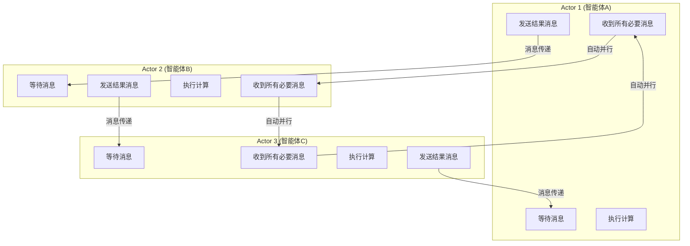
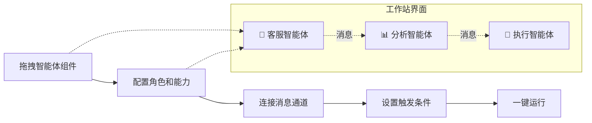
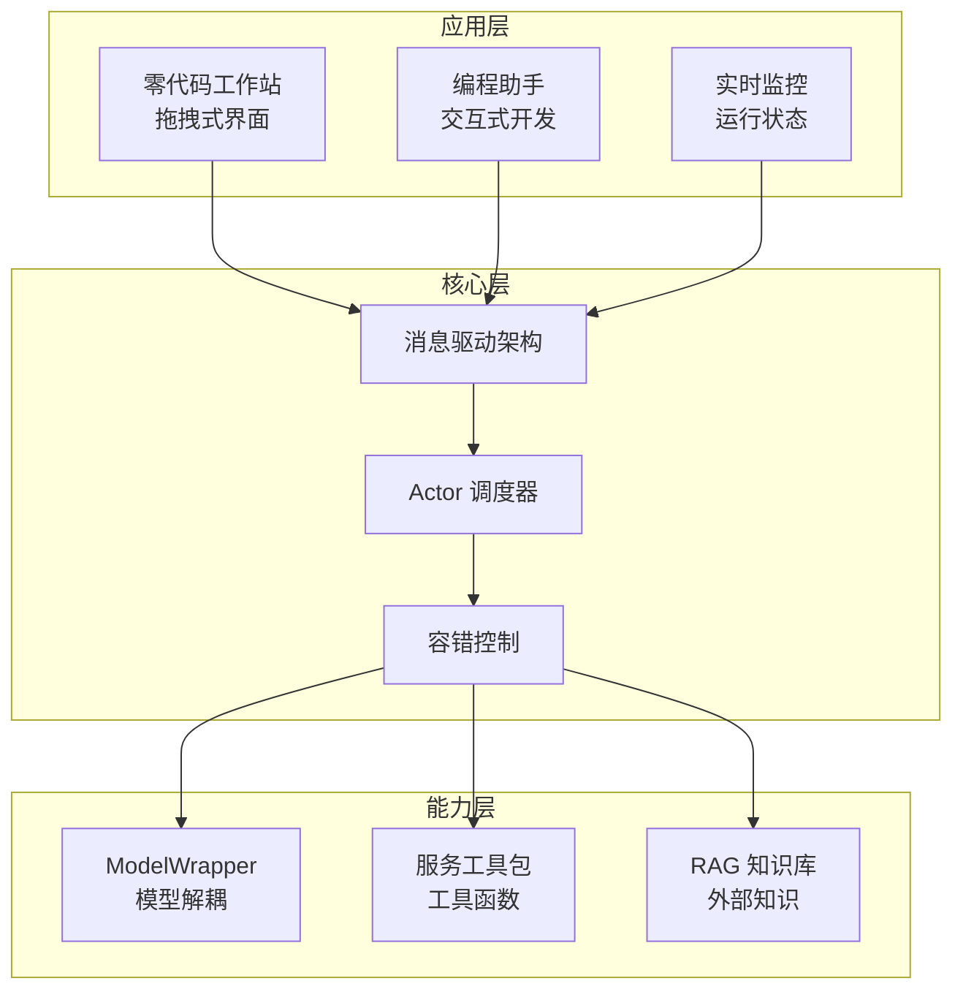

# AgentScope 是什么？阿里开源的多智能体开发平台一篇搞定

> MetaGPT 模拟软件公司，OpenAgents 强调易用性，那 AgentScope 又有什么独特之处？

今天给大家介绍另一个重磅的多智能体框架——**AgentScope**。这是阿里巴巴通义实验室开源的框架，专注于让多智能体开发变得更简单、更高效。

---

## 一、先说说背景

这两年，多智能体（Multi-Agent）火得不行。

但很多开发者在实际使用时，发现了一个问题：

> 市面上的框架要么太复杂，门槛太高；要么就是扩展性差，稍微换个场景就不太好用了。

阿里通义实验室发现了这个痛点，于是在 2024 年推出了 **AgentScope**，口号很直接：

> **"让多智能体开发变得简单、高效、可扩展"**

---

## 二、AgentScope 到底是什么？

AgentScope 是阿里巴巴开源的**多智能体低代码开发平台**。

用大白话说就是：**一个让你用拖拽方式就能搭建多智能体应用的工具，同时支持代码开发，灵活度也很高。**：零代码拖放式工作站，不会编程也能玩
- ⚡ **高效**：基于 Actor 模型，自动并行优化
- 🔧 **可扩展**：模块化设计，想怎么改都行

---

## 三、核心概念：先搞懂这些词

AgentScope 有几个核心概念，提前了解一下，后面看代码不懵。

### 1. 消息驱动架构

智能体之间怎么交流？**靠发消息**。

在 AgentScope 里，消息是这样定义的：

```python
from agentscope.message import Msg

# 基本消息
x = Msg(name="Alice", content="Hi!")

# 还能带图片、链接
x = Msg("Bob", "看看这张图", url="/path/to/picture.jpg")
```

每条消息包含：

| 字段 | 说明 |
|------|------|
| `name` | 发送者名字 |
| `content` | 消息内容 |
| `url`（可选） | 附件链接（图片、音视频等） |

智能体 A 给智能体 B 发消息，就像发微信一样简单。

### 2. Actor 模型

这是 AgentScope 能够在分布式环境下高效运行的关键。

**什么是 Actor 模型？**

你可以把它理解为一种"收到消息才行动"的模式：

- 每个智能体是一个独立的"Actor"
- 只有收到**所有必要消息**后，才开始计算
- 多个智能体之间**自动并行执行**，互不干扰

这样设计的好处是：系统会自动优化性能，不需要你手动调参。



### 3. RAG（检索增强生成）

AgentScope 内置了 **RAG** 功能，让智能体能够：

- 📚 查询外部知识库
- 📝 引用真实文档
- 🎯 减少"胡说八道"（幻觉）

简单理解就是：智能体不仅靠记忆，还能查资料。

---

## 四、AgentScope 有哪些核心功能？

### 1. 多智能体协调

这是最基础的功能：**多个智能体协同工作，共同完成复杂任务。**

你可以设置：

- 哪些智能体负责做什么
- 智能体之间怎么传递消息
- 何时需要等待、何时可以并行

### 2. 零代码工作站

这是 AgentScope 的大亮点！

它提供了一个**拖拽式的可视化工作站**，像搭积木一样配置智能体：

- 拖一个智能体进来
- 设置它的角色和能力
- 连上线，加上逻辑
- 运行！

不会编程？没关系，拖拖拽拽就能搭建一个多智能体系统。



### 3. 容错机制

企业级应用必须考虑一个问题：**如果某个智能体出错了怎么办？**

AgentScope 内置了**多级容错机制**：

| 错误类型 | 处理方式 |
|----------|----------|
| 可访问性错误 | 网络不通？重试几次 |
| 规则可解析错误 | 按预设规则降级处理 |
| 模型可解析错误 | 让 LLM 自己修复 |
| 不可解析错误 | 记录日志，优雅退出 |

简单说就是：**尽量不出错，出了错也不至于整个系统崩掉。**

### 4. 多模态支持

现在的 AI 不只是处理文字，AgentScope 支持：

- 📝 文本
- 🖼️ 图片
- 🎵 音频
- 🎬 视频

每种模态都有对应的处理模块，生成、存储、传输完全解耦。

### 5. 服务工具包

AgentScope 提供了一套完整的**工具函数系统**：

- 🔧 工具函数管理
- 📝 提示词工程
- 🎯 响应解析
- ⚡ 函数执行

你可以把任何外部 API 封装成工具，让智能体调用。

---

## 五、技术架构是怎样的？

看完了功能，我们来看看 AgentScope 的"内功"。

### 整体架构图



### 各层职责

| 层级 | 负责什么 |
|------|----------|
| **应用层** | 用户交互，零代码工作站、编程界面、监控面板 |
| **核心层** | 消息传递、Actor 调度、容错处理 |
| **能力层** | 模型调用、工具函数、知识库检索 |

### 模型解耦设计

AgentScope 还有一个很巧妙的设计：**ModelWrapper**。

这个组件的作用是：**把模型（GPT-4、Claude、阿里通义千问等）和业务逻辑分开。**

```python
model_config = {
    "config_name": "my_config",
    "model_type": "openai_chat",  # 换这里就能换模型
    "model_name": "gpt-4",
    "api_key": "xxx"
}
```

今天用 GPT-4，明天想换通义千问？改个配置就行，不用改业务代码。

---

## 六、快速上手体验

### 安装

```bash
# 方式一：pip 安装
pip install agentscope

# 方式二：源码安装（推荐）
git clone https://github.com/modelscope/agentscope.git
cd agentscope
pip install -e .
```

### 快速运行一个例子

```python
from agentscope import ms
from agentscope.agents import DialogAgent, UserAgent

# 初始化（配置模型）
ms.init(model_config_name="your_model_config")

# 创建智能体
dialog_agent = DialogAgent(
    name="小助手",
    sys_prompt="你是一个热情的助手，擅长回答各种问题。"
)

user_agent = UserAgent(name="用户")

# 开始对话
user_agent("你好！")  # 用户说话
dialog_agent()        # 小助手回复
```

### 使用零代码工作站

如果你不想写代码：

1. 访问 AgentScope 工作站
2. 拖拽智能体组件到画布
3. 配置每个智能体的角色
4. 连接消息通道
5. 点击运行

就像画流程图一样简单。

---

## 七、AgentScope vs 其他框架对比

| 特性 | AgentScope | MetaGPT | OpenAgents |
|------|------------|---------|------------|
| **开发方式** | 零代码 + 代码 | 代码为主 | 代码为主 |
| **架构特点** | Actor 模型 | SOP 流程 | 插件集成 |
| **容错机制** | ✅ 多级容错 | ❌ | ❌ |
| **多模态** | ✅ 支持 | ❌ | ❌ |
| **易用性** | ⭐⭐⭐⭐⭐ | ⭐⭐⭐ | ⭐⭐⭐⭐ |
| **开源方** | 阿里巴巴 | DeepWisdom | XLang-AI |
| **零代码工作站** | ✅ 有 | ❌ | ❌ |

- **AgentScope**：最适合想快速上手、有零代码需求的企业和个人
- **MetaGPT**：适合想做软件开发的团队
- **OpenAgents**：适合需要丰富插件生态的用户

---

## 八、适用场景

AgentScope 适合哪些场景？

| 场景 | 说明 |
|------|------|
| 🏢 企业客服 | 多智能体协同处理不同类型问题 |
| 📊 数据分析 | 多个分析智能体分工合作 |
| 🎮 游戏 NPC | 多个角色智能体互动 |
| 📱 自动化流程 | 复杂业务流程的自动化编排 |
| 🎓 教育培训 | 模拟不同角色的教学场景 |

---

## 九、相关资源

| 资源 | 链接 |
|------|------|
| 🌐 官网 | modelscope.github.io/agentscope/ |
| 💻 GitHub | github.com/modelscope/agentscope |
| 📄 论文 | arxiv.org/pdf/2402.14034 |
| 💬 社区 | GitHub Discussions |

---

今天我们详细介绍了 AgentScope，核心要点就这些：

1. **是谁**：阿里巴巴开源的多智能体开发平台
2. **特点**：简单（零代码工作站）、高效（Actor 模型自动并行）、可扩展（模块化设计）
3. **核心概念**：消息驱动架构、Actor 模型、RAG
4. **功能**：多智能体协调、容错机制、多模态支持、服务工具包
5. **适合谁**：想快速搭建多智能体应用的企业、个人开发者

---