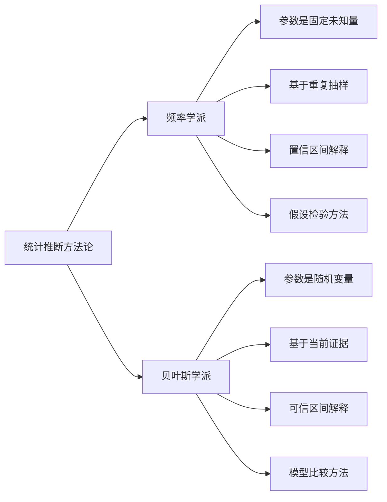
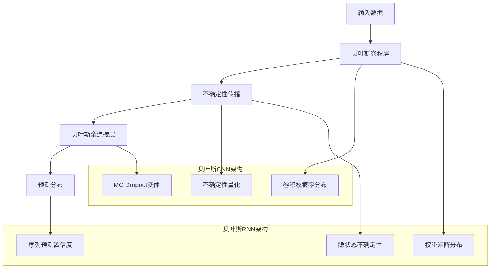
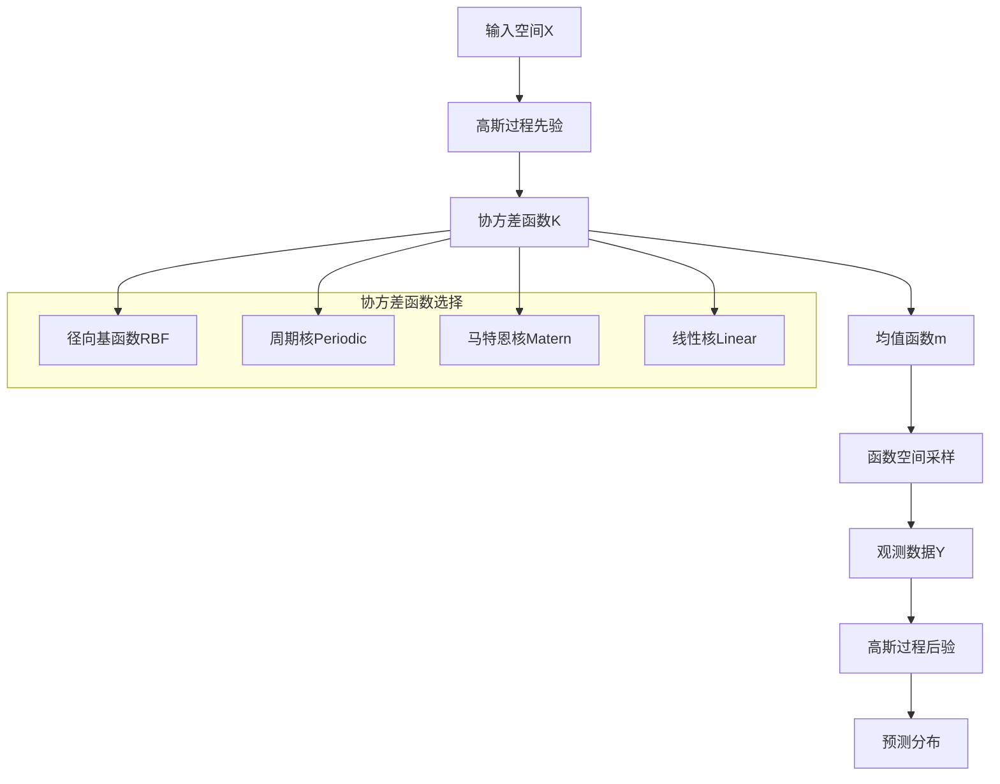
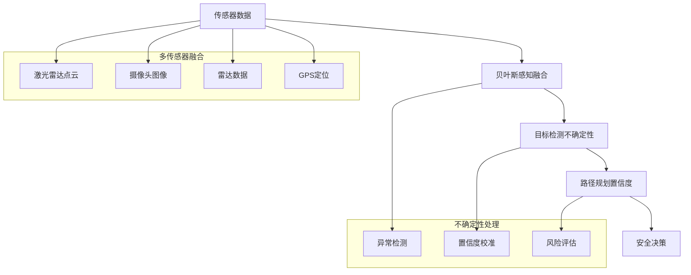
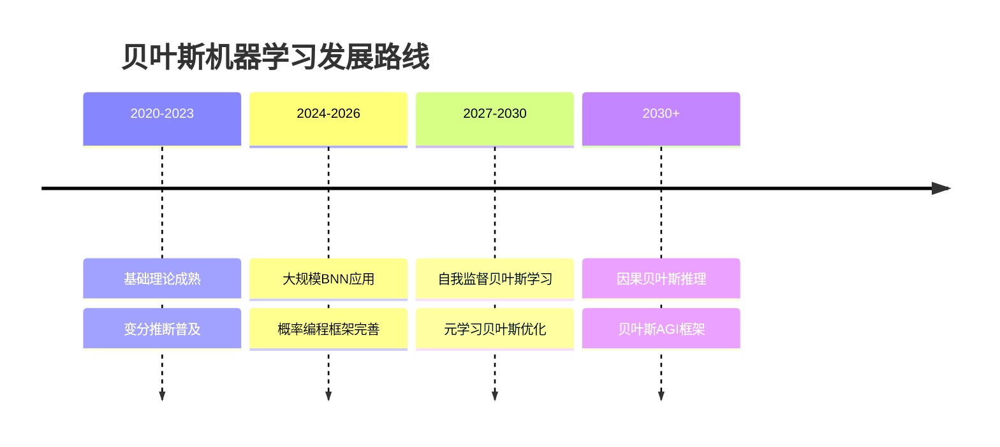
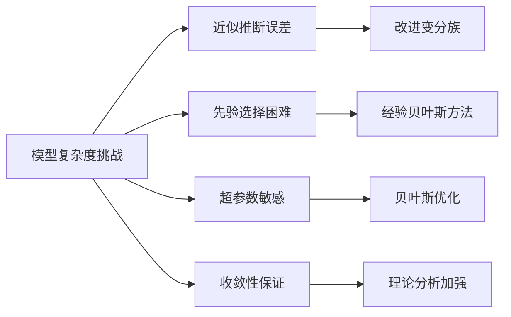

# 贝叶斯机器学习深度解析：从基础理论到现代应用

## 引言：概率思维的革命性力量

在2026年的机器学习领域，贝叶斯方法已经从统计学的一个分支发展成为处理不确定性的核心工具。传统的点估计方法在面临复杂、噪声数据时往往力不从心，而贝叶斯机器学习通过概率分布为模型预测提供了完整的置信度描述。本文将从贝叶斯定理出发，深入探讨这一方法论的理论基础、核心算法和前沿应用。

## 第一章：贝叶斯理论基础与数学原理

### 1.1 贝叶斯定理：概率思维的基石

贝叶斯定理的数学表达式：

```latex
P(θ|D) = \frac{P(D|θ)P(θ)}{P(D)}
```

其中：
- $P(θ|D)$：后验概率（数据观测后的参数分布）
- $P(D|θ)$：似然函数（给定参数下数据的概率）
- $P(θ)$：先验概率（参数的先验信念）
- $P(D)$：证据（数据的边际概率）

```mermaid
graph TB
    A[先验信念 P(θ)] --> C[贝叶斯更新]
    B[观测数据 D] --> C
    C --> D[后验分布 P(θ|D)]
    D --> E[预测分布 P(y|x,D)]
    
    subgraph "贝叶斯推理循环"
        F[新数据 D'] --> G[更新为新的先验]
        G --> C
    end
    
    E --> H[不确定性量化]
    E --> I[决策支持]
    E --> J[模型解释]
```

### 1.2 贝叶斯 vs 频率学派：根本性分歧



### 1.3 共轭先验：解析解的关键

共轭先验使得后验分布与先验分布属于同一分布族，便于解析计算：

```python
import numpy as np
from scipy import stats

class ConjugatePriors:
    """共轭先验分布示例"""
    
    @staticmethod
    def normal_normal_conjugate(mu_0, sigma_0_sq, data, sigma_sq):
        """正态-正态共轭：已知方差的正态分布"""
        n = len(data)
        x_bar = np.mean(data)
        
        # 后验参数计算
        mu_n = (sigma_0_sq * x_bar + sigma_sq * mu_0 / n) / (sigma_0_sq + sigma_sq / n)
        sigma_n_sq = 1 / (1/sigma_0_sq + n/sigma_sq)
        
        return mu_n, sigma_n_sq
    
    @staticmethod
    def beta_binomial_conjugate(alpha_prior, beta_prior, successes, trials):
        """Beta-Binomial共轭：二项分布"""
        alpha_posterior = alpha_prior + successes
        beta_posterior = beta_prior + (trials - successes)
        
        return alpha_posterior, beta_posterior
    
    @staticmethod
    def gamma_poisson_conjugate(alpha_prior, beta_prior, data):
        """Gamma-Poisson共轭：泊松分布"""
        n = len(data)
        sum_data = np.sum(data)
        
        alpha_posterior = alpha_prior + sum_data
        beta_posterior = beta_prior + n
        
        return alpha_posterior, beta_posterior

# 示例：正态-正态共轭更新
prior_mu, prior_sigma_sq = 0, 1  # 先验 N(0,1)
data = np.random.normal(2, 1, 100)  # 从N(2,1)生成数据
known_variance = 1

posterior_mu, posterior_sigma_sq = ConjugatePriors.normal_normal_conjugate(
    prior_mu, prior_sigma_sq, data, known_variance
)

print(f"先验: N({prior_mu}, {prior_sigma_sq})")
print(f"后验: N({posterior_mu:.3f}, {posterior_sigma_sq:.3f})")
```

## 第二章：贝叶斯推断的核心方法

### 2.1 马尔可夫链蒙特卡洛（MCMC）方法

MCMC方法通过构建马尔可夫链来从复杂后验分布中采样：

```mermaid
graph TB
    A[目标分布 π(θ)] --> B[构建马尔可夫链]
    B --> C[转移核设计]
    C --> D[收敛性判断]
    D --> E[采样收敛样本]
    E --> F[后验分布估计]
    
    subgraph "MCMC变体"
        G[Metropolis-Hastings]
        H[Gibbs Sampling]
        I[Hamiltonian MC]
        J[No-U-Turn Sampler]
    end
    
    C --> G
    C --> H
    C --> I
    C --> J
```

#### 2.1.1 Metropolis-Hastings算法实现

```python
import numpy as np
from scipy.stats import norm

class MetropolisHastings:
    """Metropolis-Hastings MCMC采样器"""
    
    def __init__(self, target_dist, proposal_dist, initial_state):
        self.target_dist = target_dist  # 目标分布函数
        self.proposal_dist = proposal_dist  # 提议分布函数
        self.current_state = initial_state
        self.samples = [initial_state]
    
    def step(self):
        """单步MCMC采样"""
        # 从提议分布生成候选点
        candidate = self.proposal_dist(self.current_state)
        
        # 计算接受率
        acceptance_ratio = min(1, 
            self.target_dist(candidate) / self.target_dist(self.current_state))
        
        # 决定是否接受候选点
        if np.random.rand() < acceptance_ratio:
            self.current_state = candidate
        
        self.samples.append(self.current_state)
        return self.current_state
    
    def run(self, n_steps, burn_in=1000):
        """运行MCMC采样"""
        for i in range(n_steps + burn_in):
            self.step()
        
        # 去除burn-in期样本
        return self.samples[burn_in:]

# 示例：采样正态分布的后验
def target_normal(x, mu=2, sigma=1):
    """目标分布：正态分布"""
    return np.exp(-0.5 * ((x - mu) / sigma) ** 2) / (sigma * np.sqrt(2 * np.pi))

def proposal_normal(x, sigma_proposal=0.5):
    """提议分布：以当前点为中心的正态分布"""
    return np.random.normal(x, sigma_proposal)

# 运行MCMC采样
mh_sampler = MetropolisHastings(target_normal, proposal_normal, initial_state=0)
samples = mh_sampler.run(10000, burn_in=1000)

print(f"采样均值: {np.mean(samples):.3f}")
print(f"采样标准差: {np.std(samples):.3f}")
```

### 2.2 变分推断（Variational Inference）

变分推断将采样问题转化为优化问题：

```mermaid
flowchart TD
    A[复杂后验p(z|x)] --> B[选择变分族q(z;λ)]
    B --> C[定义KL散度目标]
    C --> D[优化变分参数λ]
    D --> E[得到近似后验q*(z)]
    
    subgraph "变分族选择"
        F[平均场近似]
        G[正态分布族]
        H[流模型]
        I[自回归网络]
    end
    
    B --> F
    B --> G
    B --> H
    B --> I
```

#### 2.2.1 证据下界（ELBO）优化

```python
import torch
import torch.nn as nn
import torch.distributions as dist

class VariationalInference:
    """变分推断实现"""
    
    def __init__(self, model, guide, optimizer):
        self.model = model  # 概率模型
        self.guide = guide  # 变分分布（指导分布）
        self.optimizer = optimizer
    
    def elbo_loss(self, data):
        """计算证据下界损失"""
        
        # 从指导分布采样
        guide_trace = self.guide(data)
        
        # 计算模型的对数概率
        model_trace = self.model(data, guide_trace)
        
        # ELBO = E_q[log p(x,z)] - E_q[log q(z)]
        log_p = model_trace['log_prob']
        log_q = guide_trace['log_prob']
        
        elbo = (log_p - log_q).mean()
        return -elbo  # 最小化负ELBO
    
    def train_step(self, data):
        """单步训练"""
        self.optimizer.zero_grad()
        loss = self.elbo_loss(data)
        loss.backward()
        self.optimizer.step()
        return loss.item()
    
    def infer(self, data, n_samples=1000):
        """后验推断"""
        samples = []
        for _ in range(n_samples):
            guide_trace = self.guide(data)
            samples.append(guide_trace['latent'])
        return torch.stack(samples)

# 示例：贝叶斯线性回归的变分推断
class BayesianLinearRegressionVI(nn.Module):
    """贝叶斯线性回归的变分实现"""
    
    def __init__(self, input_dim):
        super().__init__()
        self.input_dim = input_dim
        
        # 变分参数：权重和后验分布参数
        self.w_mu = nn.Parameter(torch.randn(input_dim))
        self.w_rho = nn.Parameter(torch.randn(input_dim))
        
        # 先验分布参数
        self.prior_mu = 0.0
        self.prior_sigma = 1.0
    
    def reparameterize(self, mu, rho):
        """重参数化技巧"""
        sigma = torch.log(1 + torch.exp(rho))
        eps = torch.randn_like(mu)
        return mu + eps * sigma
    
    def forward(self, x):
        """前向传播"""
        # 采样权重
        w = self.reparameterize(self.w_mu, self.w_rho)
        
        # 预测
        y_pred = x @ w
        
        # 计算KL散度（变分分布与先验分布）
        posterior = dist.Normal(self.w_mu, torch.log(1 + torch.exp(self.w_rho)))
        prior = dist.Normal(self.prior_mu, self.prior_sigma)
        kl_div = dist.kl_divergence(posterior, prior).sum()
        
        return y_pred, kl_div
```

## 第三章：贝叶斯线性模型

### 3.1 贝叶斯线性回归

贝叶斯线性回归为权重引入概率分布，提供预测不确定性：

```python
import numpy as np
import matplotlib.pyplot as plt

class BayesianLinearRegression:
    """贝叶斯线性回归实现"""
    
    def __init__(self, alpha=1.0, beta=1.0):
        """
        alpha: 权重先验精度
        beta: 噪声精度
        """
        self.alpha = alpha
        self.beta = beta
        self.w_mean = None
        self.w_cov = None
    
    def fit(self, X, y):
        """贝叶斯更新：计算后验分布"""
        n_samples, n_features = X.shape
        
        # 后验协方差矩阵
        self.w_cov = np.linalg.inv(
            self.alpha * np.eye(n_features) + self.beta * X.T @ X
        )
        
        # 后验均值
        self.w_mean = self.beta * self.w_cov @ X.T @ y
        
        return self
    
    def predict(self, X, return_std=True):
        """预测分布"""
        if self.w_mean is None:
            raise ValueError("模型尚未训练")
        
        # 预测均值
        y_pred = X @ self.w_mean
        
        if return_std:
            # 预测方差
            y_var = 1/self.beta + np.sum(X @ self.w_cov * X, axis=1)
            y_std = np.sqrt(y_var)
            return y_pred, y_std
        
        return y_pred
    
    def sample_posterior(self, X, n_samples=100):
        """从后验分布采样预测"""
        if self.w_mean is None:
            raise ValueError("模型尚未训练")
        
        # 从权重后验采样
        w_samples = np.random.multivariate_normal(
            self.w_mean, self.w_cov, n_samples
        )
        
        # 生成预测样本
        y_samples = X @ w_samples.T
        
        # 添加观测噪声
        noise_samples = np.random.normal(0, 1/np.sqrt(self.beta), 
                                       (X.shape[0], n_samples))
        
        return y_samples + noise_samples

# 示例：贝叶斯线性回归演示
np.random.seed(42)
n_samples = 100
X = np.random.randn(n_samples, 1) * 2
true_w = 1.5
y = true_w * X.flatten() + np.random.randn(n_samples) * 0.5

# 拟合贝叶斯线性回归
blr = BayesianLinearRegression(alpha=1.0, beta=1.0/(0.5**2))
blr.fit(X, y)

# 生成测试数据
X_test = np.linspace(-3, 3, 100).reshape(-1, 1)
y_pred, y_std = blr.predict(X_test)

# 可视化结果
plt.figure(figsize=(10, 6))
plt.scatter(X, y, alpha=0.7, label='训练数据')
plt.plot(X_test, y_pred, 'r-', label='预测均值')
plt.fill_between(X_test.flatten(), y_pred - 2*y_std, y_pred + 2*y_std, 
                alpha=0.3, label='95%置信区间')
plt.xlabel('X')
plt.ylabel('y')
plt.legend()
plt.title('贝叶斯线性回归的不确定性量化')
plt.show()
```

### 3.2 贝叶斯逻辑回归

```mermaid
graph TB
    A[输入特征x] --> B[线性组合wᵀx]
    B --> C[Sigmoid函数]
    C --> D[预测概率p(y=1|x)]
    D --> E[伯努利分布采样]
    E --> F[二分类输出]
    
    G[权重先验N(0,σ²I)] --> H[后验推断]
    H --> I[权重后验分布]
    I --> B
    
    subgraph "推断方法"
        J[拉普拉斯近似]
        K[MCMC采样]
        L[变分推断]
    end
    
    H --> J
    H --> K
    H --> L
```

## 第四章：贝叶斯神经网络（BNN）

### 4.1 BNN的基本架构

贝叶斯神经网络将权重参数化为概率分布：

```python
import torch
import torch.nn as nn
import torch.nn.functional as F

class BayesianLinear(nn.Module):
    """贝叶斯线性层"""
    
    def __init__(self, in_features, out_features):
        super().__init__()
        self.in_features = in_features
        self.out_features = out_features
        
        # 权重变分参数
        self.weight_mu = nn.Parameter(torch.Tensor(out_features, in_features))
        self.weight_rho = nn.Parameter(torch.Tensor(out_features, in_features))
        
        # 偏置变分参数
        self.bias_mu = nn.Parameter(torch.Tensor(out_features))
        self.bias_rho = nn.Parameter(torch.Tensor(out_features))
        
        # 初始化
        nn.init.normal_(self.weight_mu, 0, 0.1)
        nn.init.normal_(self.weight_rho, -3, 0.1)
        nn.init.normal_(self.bias_mu, 0, 0.1)
        nn.init.normal_(self.bias_rho, -3, 0.1)
        
        # 先验分布
        self.weight_prior = torch.distributions.Normal(0, 1)
        self.bias_prior = torch.distributions.Normal(0, 1)
        
        self.kl = 0
    
    def reparameterize(self, mu, rho):
        """重参数化技巧"""
        sigma = torch.log1p(torch.exp(rho))
        eps = torch.randn_like(mu)
        return mu + eps * sigma
    
    def forward(self, x, sample=True, calculate_kl=True):
        """前向传播"""
        if sample:
            # 采样权重和偏置
            w = self.reparameterize(self.weight_mu, self.weight_rho)
            b = self.reparameterize(self.bias_mu, self.bias_rho)
        else:
            # 使用均值（预测时）
            w = self.weight_mu
            b = self.bias_mu
        
        if calculate_kl:
            # 计算KL散度
            w_sigma = torch.log1p(torch.exp(self.weight_rho))
            b_sigma = torch.log1p(torch.exp(self.bias_rho))
            
            w_prior_log_prob = self.weight_prior.log_prob(w).sum()
            w_post = torch.distributions.Normal(self.weight_mu, w_sigma)
            w_log_prob = w_post.log_prob(w).sum()
            
            b_prior_log_prob = self.bias_prior.log_prob(b).sum()
            b_post = torch.distributions.Normal(self.bias_mu, b_sigma)
            b_log_prob = b_post.log_prob(b).sum()
            
            self.kl = (w_log_prob - w_prior_log_prob) + (b_log_prob - b_prior_log_prob)
        
        return F.linear(x, w, b)

class BayesianNeuralNetwork(nn.Module):
    """贝叶斯神经网络"""
    
    def __init__(self, input_dim, hidden_dims, output_dim):
        super().__init__()
        
        layers = []
        prev_dim = input_dim
        
        # 构建隐藏层
        for hidden_dim in hidden_dims:
            layers.append(BayesianLinear(prev_dim, hidden_dim))
            layers.append(nn.ReLU())
            prev_dim = hidden_dim
        
        # 输出层
        layers.append(BayesianLinear(prev_dim, output_dim))
        
        self.network = nn.Sequential(*layers)
    
    def forward(self, x, sample=True, calculate_kl=True):
        kl_total = 0
        
        for layer in self.network:
            if isinstance(layer, BayesianLinear):
                x = layer(x, sample, calculate_kl)
                if calculate_kl:
                    kl_total += layer.kl
            else:
                x = layer(x)
        
        return x, kl_total
    
    def elbo_loss(self, x, y, criterion, n_samples=1):
        """证据下界损失"""
        total_loss = 0
        total_kl = 0
        
        for _ in range(n_samples):
            output, kl = self.forward(x, sample=True, calculate_kl=True)
            nll = criterion(output, y)
            total_loss += nll
            total_kl += kl
        
        # 平均损失和KL散度
        avg_loss = total_loss / n_samples
        avg_kl = total_kl / n_samples
        
        # ELBO损失 = 负对数似然 + KL散度
        elbo = avg_loss + avg_kl
        
        return elbo, avg_loss, avg_kl
```

### 4.2 贝叶斯CNN和RNN



## 第五章：概率编程与高级应用

### 5.1 Pyro概率编程框架

Pyro是Uber开发的概率编程库，支持灵活的贝叶斯建模：

```python
import pyro
import pyro.distributions as dist
from pyro.infer import MCMC, NUTS, Predictive
from pyro.infer import SVI, Trace_ELBO
from pyro.optim import Adam

# 示例：Pyro中的贝叶斯线性回归
pyro.set_rng_seed(42)

def bayesian_linear_regression_model(x, y=None):
    """贝叶斯线性回归的Pyro模型"""
    
    # 先验分布
    w_prior = dist.Normal(0., 1.).expand([2]).to_event(1)
    b_prior = dist.Normal(0., 1.)
    noise_prior = dist.Gamma(1., 1.)
    
    # 采样参数
    w = pyro.sample("weights", w_prior)
    b = pyro.sample("bias", b_prior)
    noise = pyro.sample("noise", noise_prior)
    
    # 线性预测
    mean = x @ w + b
    
    # 观测模型
    with pyro.plate("data", x.shape[0]):
        pyro.sample("obs", dist.Normal(mean, noise), obs=y)

def guide(x, y=None):
    """变分指导分布"""
    
    # 变分参数
    w_loc = pyro.param("w_loc", torch.zeros(2))
    w_scale = pyro.param("w_scale", torch.ones(2), constraint=dist.constraints.positive)
    
    b_loc = pyro.param("b_loc", torch.tensor(0.))
    b_scale = pyro.param("b_scale", torch.tensor(1.), constraint=dist.constraints.positive)
    
    noise_concentration = pyro.param("noise_conc", torch.tensor(1.), constraint=dist.constraints.positive)
    noise_rate = pyro.param("noise_rate", torch.tensor(1.), constraint=dist.constraints.positive)
    
    # 变分分布
    pyro.sample("weights", dist.Normal(w_loc, w_scale))
    pyro.sample("bias", dist.Normal(b_loc, b_scale))
    pyro.sample("noise", dist.Gamma(noise_concentration, noise_rate))

# 训练变分推断
def train_svi(model, guide, x, y, num_epochs=1000):
    """随机变分推断训练"""
    
    # 清空参数缓存
    pyro.clear_param_store()
    
    # 设置优化器和推断算法
    optimizer = Adam({"lr": 0.01})
    svi = SVI(model, guide, optimizer, loss=Trace_ELBO())
    
    # 训练循环
    losses = []
    for epoch in range(num_epochs):
        loss = svi.step(x, y)
        losses.append(loss)
        
        if epoch % 100 == 0:
            print(f"Epoch {epoch}: ELBO loss = {loss:.4f}")
    
    return losses

# MCMC采样推断
def run_mcmc(model, x, y, num_samples=1000, warmup_steps=200):
    """运行MCMC采样"""
    
    nuts_kernel = NUTS(model)
    mcmc = MCMC(nuts_kernel, num_samples=num_samples, warmup_steps=warmup_steps)
    mcmc.run(x, y)
    
    return mcmc
```

### 5.2 高斯过程回归



## 第六章：实际应用案例研究

### 6.1 医疗诊断中的不确定性量化

```python
class MedicalDiagnosisBNN:
    """医疗诊断的贝叶斯神经网络"""
    
    def __init__(self, input_dim, hidden_dims):
        self.model = BayesianNeuralNetwork(input_dim, hidden_dims, 2)  # 二分类
        self.optimizer = torch.optim.Adam(self.model.parameters(), lr=0.001)
    
    def train(self, X_train, y_train, epochs=1000, n_mc_samples=5):
        """训练模型"""
        criterion = nn.CrossEntropyLoss()
        
        for epoch in range(epochs):
            self.optimizer.zero_grad()
            
            # 计算ELBO损失
            elbo, nll, kl = self.model.elbo_loss(X_train, y_train, criterion, n_mc_samples)
            elbo.backward()
            self.optimizer.step()
            
            if epoch % 100 == 0:
                print(f"Epoch {epoch}: ELBO={elbo.item():.4f}, NLL={nll.item():.4f}, KL={kl.item():.4f}")
    
    def predict_uncertainty(self, X_test, n_samples=100):
        """预测并量化不确定性"""
        predictions = []
        
        with torch.no_grad():
            for _ in range(n_samples):
                output, _ = self.model(X_test, sample=True, calculate_kl=False)
                prob = torch.softmax(output, dim=1)
                predictions.append(prob.cpu().numpy())
        
        predictions = np.array(predictions)  # [n_samples, n_test, n_classes]
        
        # 计算统计量
        mean_pred = predictions.mean(axis=0)
        std_pred = predictions.std(axis=0)
        entropy = -np.sum(mean_pred * np.log(mean_pred + 1e-8), axis=1)
        
        return {
            'mean_probability': mean_pred,
            'std_probability': std_pred,
            'predictive_entropy': entropy,
            'samples': predictions
        }
    
    def clinical_decision_support(self, patient_data, threshold=0.05):
        """临床决策支持"""
        results = self.predict_uncertainty(patient_data)
        
        mean_prob = results['mean_probability']
        uncertainty = results['predictive_entropy']
        
        diagnosis = np.argmax(mean_prob, axis=1)
        confidence = np.max(mean_prob, axis=1)
        
        # 基于不确定性做出决策
        recommendations = []
        for i in range(len(diagnosis)):
            if uncertainty[i] > threshold:
                recommendations.append("建议进一步检查，预测不确定性较高")
            elif confidence[i] > 0.8:
                recommendations.append(f"高置信度诊断: 类别{diagnosis[i]}")
            else:
                recommendations.append("中等置信度，建议临床验证")
        
        return recommendations, results
```

### 6.2 自动驾驶中的贝叶斯感知



## 第七章：未来发展趋势与挑战

### 7.1 贝叶斯深度学习的前沿方向



### 7.2 技术挑战与解决方案

#### 7.2.1 计算效率挑战

```python
class ScalableBayesianInference:
    """可扩展贝叶斯推断方法"""
    
    @staticmethod
    def stochastic_gradient_mcmc(model, data_loader, num_samples):
        """随机梯度MCMC"""
        # 实现SG-MCMC算法
        pass
    
    @staticmethod
    def distributed_vi(models, data_shards):
        """分布式变分推断"""
        # 实现分布式VI算法
        pass
    
    @staticmethod
    def amortized_inference(inference_network, generative_model):
        """摊销推断"""
        # 实现摊销变分推断
        pass
```

#### 7.2.2 模型复杂度挑战


