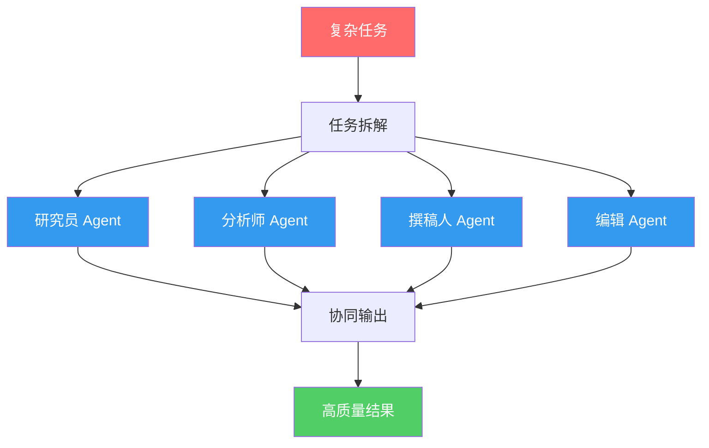
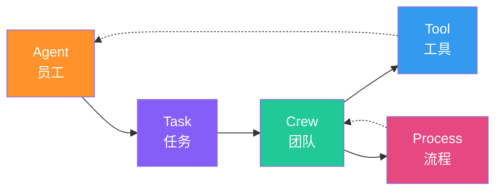
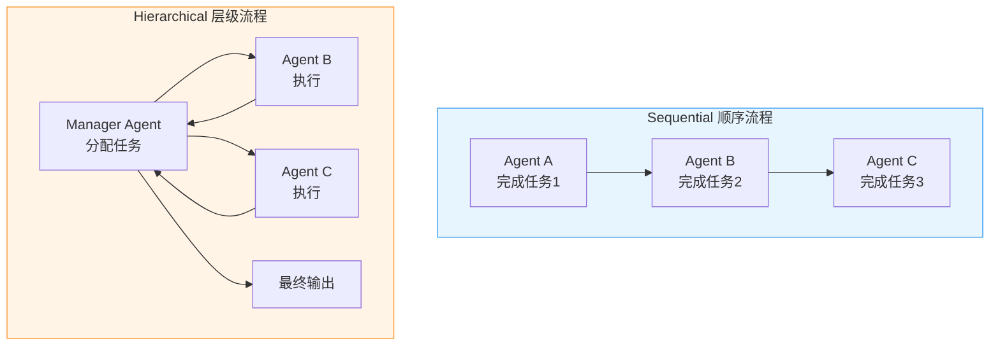
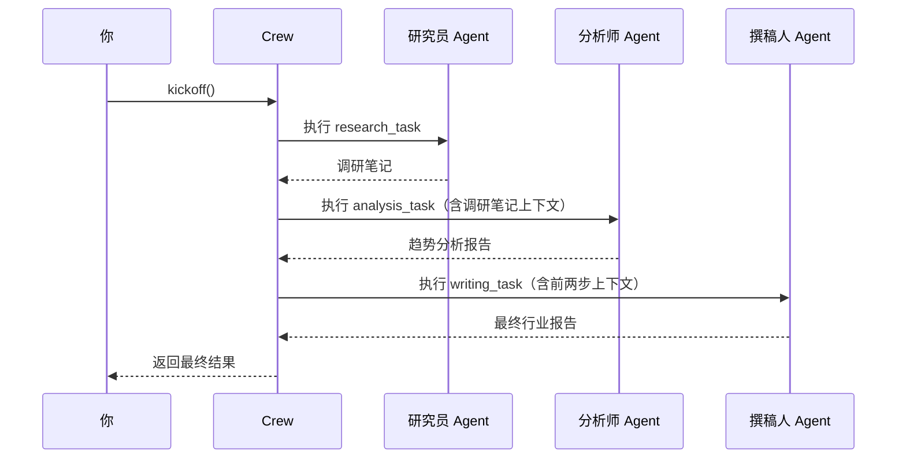
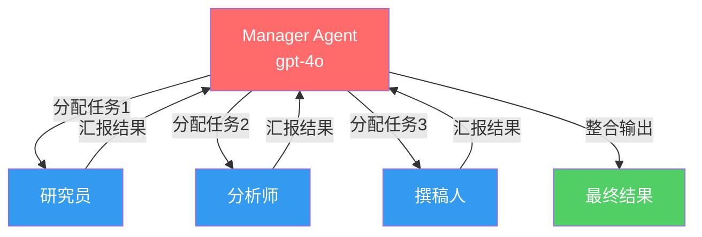
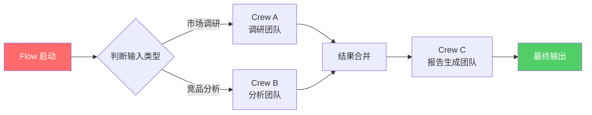
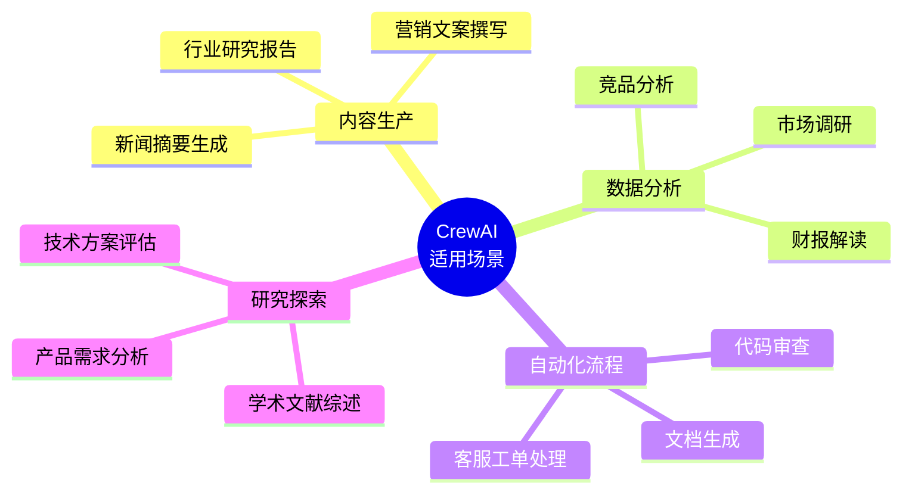

# 从零开始理解 CrewAI：让 AI 组团干活的开源框架

> 一个人干不过一个团队，一个 AI 也一样。CrewAI 就是让多个 AI Agent 像公司团队一样协作的开源框架。本文从零讲起，一步步带你搞懂它。

---

## 一、先聊一个场景

假设你现在要写一份行业研究报告，传统方式是这样的：

1. 你自己上网搜资料
2. 你自己整理要点
3. 你自己写初稿
4. 你自己校对润色

一个人干完所有事，累不说，质量还参差不齐。

但如果是一个**团队**呢？

- **研究员**负责搜资料
- **分析师**负责提炼要点
- **撰稿人**负责写初稿
- **编辑**负责润色定稿

每个人专注自己擅长的事，效率和质量都上来了。

**CrewAI 做的就是这件事——但把"人"换成了 AI Agent。**

---

## 二、CrewAI 到底是什么？

一句话概括：

> **CrewAI 是一个开源的 Python 框架，用于编排多个 AI Agent 协同完成复杂任务。**

它由 CrewAI Inc. 开发维护，是目前最流行的多 Agent 框架之一。GitHub 上 Star 数已经超过 25k，生态活跃。

### 它的核心思想

把复杂任务拆解成多个子任务，分配给不同角色的 AI Agent，让它们像团队一样协作完成。



### 和其他框架的区别

市面上还有 AutoGen、LangGraph 等多 Agent 框架，CrewAI 的差异化在于：

| 特性 | CrewAI | AutoGen | LangGraph |
|------|--------|---------|-----------|
| 核心理念 | 角色扮演 + 团队协作 | 对话式多 Agent | 状态图工作流 |
| 上手难度 | 低 | 中 | 高 |
| 适合场景 | 流程化的团队任务 | 多轮对话 | 复杂状态流转 |
| 设计风格 | 声明式，像写剧本 | 编程式，像写聊天 | 图式，像画流程图 |

**CrewAI 最大的优势：你不需要画复杂的状态图，也不需要处理繁琐的对话逻辑，你只需要定义"谁"做"什么"，剩下的交给框架。**

---

## 三、五个核心概念——CrewAI 的骨架

理解 CrewAI，只需要搞懂五个概念。它们的关系就像一家公司：



### 1. Agent（智能体 / 员工）

Agent 是 CrewAI 的核心执行单元。你可以把它理解为一个"有角色设定的 AI 员工"。

每个 Agent 有三个关键属性：

- **Role（角色）**：它是谁？比如"资深行业研究员"
- **Goal（目标）**：它要达成什么？比如"挖掘最深度的行业信息"
- **Backstory（背景故事）**：它的经历和性格？比如"曾在麦肯锡工作 10 年，擅长从海量信息中提炼关键洞察"

这三者共同塑造了 Agent 的"人格"，让大模型在执行任务时有更明确的行为边界和风格倾向。

```python
from crewai import Agent

researcher = Agent(
    role="资深行业研究员",
    goal="挖掘最深度的行业信息和趋势洞察",
    backstory="你曾在顶级咨询公司工作10年，擅长从海量信息中提炼关键洞察。你对数据极其敏感，从不满足于表面信息。",
    verbose=True,
    allow_delegation=False,
)
```

**为什么需要 Role + Goal + Backstory？**

因为你直接跟大模型说"帮我研究一下 AI 行业"，它可能给你一个泛泛而谈的回答。但如果你告诉它"你是一个在麦肯锡干了 10 年的资深研究员"，它就会以更专业、更深入的方式去思考和输出。

这就是 CrewAI 的巧妙之处——**用角色设定来引导大模型的行为**。

### 2. Task（任务）

Task 是你交给 Agent 的具体工作。每个 Task 包含：

- **description（描述）**：任务的具体内容
- **expected_output（期望输出）**：你想要什么样的结果
- **agent（执行者）**：由哪个 Agent 来完成

```python
from crewai import Task

research_task = Task(
    description="""
    研究2024-2025年AI行业的关键趋势，包括：
    1. 大模型技术的最新进展
    2. AI Agent赛道的格局变化
    3. 值得关注的创业方向
    """,
    expected_output="一份结构化的研究报告，包含数据支撑和趋势分析，至少3个核心洞察",
    agent=researcher,
)
```

**注意**：Task 的描述越具体，Agent 的输出质量越高。这是使用 CrewAI 的第一法则——**把话说清楚**。

### 3. Crew（团队 / 机组）

Crew 是把 Agent 和 Task 组装在一起的容器。就像组建一个项目团队：

- 谁在团队里？（Agents）
- 他们要完成哪些任务？（Tasks）
- 他们按什么流程协作？（Process）

```python
from crewai import Crew, Process

crew = Crew(
    agents=[researcher, analyst, writer, editor],
    tasks=[research_task, analysis_task, writing_task, editing_task],
    process=Process.sequential,  # 顺序执行
    verbose=True,
)
```

### 4. Tool（工具）

Agent 光有"脑子"不行，还得有"手"。Tool 就是 Agent 的手——让它能上网搜索、读文件、查数据库、调 API。

CrewAI 内置了丰富的工具，也支持自定义：

```python
from crewai_tools import SerperDevTool, ScrapeWebsiteTool

# 搜索引擎工具
search_tool = SerperDevTool()
# 网页抓取工具
scrape_tool = ScrapeWebsiteTool()

researcher = Agent(
    role="资深行业研究员",
    goal="挖掘最深度的行业信息",
    backstory="你是一位经验丰富的研究员...",
    tools=[search_tool, scrape_tool],  # 给研究员配上工具
    verbose=True,
)
```

**Agent + Tool = 一个能真正干活的 AI 员工**。

没有 Tool 的 Agent 只能基于自身知识回答，有了 Tool 才能接入真实世界的数据。

### 5. Process（流程）

Process 决定了 Agent 之间的协作方式。CrewAI 目前支持两种：



**Sequential（顺序执行）**：任务按列表顺序一个接一个完成，前一个任务的输出会作为下一个任务的上下文。简单直接，适合流水线式的任务。

**Hierarchical（层级执行）**。

### Step 1：安装

```bash
pip install crewai crewai-tools
```

### Step 2：设置 API Key

CrewAI 默认使用 OpenAI，你也可以用其他模型：

```bash
export OPENAI_API_KEY="sk-your-key-here"
```

如果想用国产模型（比如 DeepSeek）：

```python
import os
os.environ["OPENAI_API_KEY"] = "your-deepseek-key"
os.environ["OPENAI_API_BASE"] = "https://api.deepseek.com"
os.environ["OPENAI_MODEL_NAME"] = "deepseek-chat"
```

### Step 3：定义 Agent

创建 4 个"员工"：

```python
from crewai import Agent

# 研究员：负责信息收集
researcher = Agent(
    role="资深行业研究员",
    goal="通过深度搜索和调研，获取AI行业最新、最权威的信息",
    backstory="""你是一位在科技行业深耕15年的资深研究员。
    你曾在Gartner担任高级分析师，对AI领域的技术趋势和商业动态有深刻理解。
    你擅长从海量信息中筛选出真正有价值的洞察，从不满足于表面信息。
    你的研究方法严谨，总是追求数据支撑和一手资料。""",
    verbose=True,
    allow_delegation=False,
)

# 分析师：负责数据分析
analyst = Agent(
    role="数据分析师",
    goal="对收集到的信息进行深度分析，提炼关键趋势和洞察",
    backstory="""你是一位经验丰富的数据分析师，曾在多家顶级VC担任分析顾问。
    你擅长从复杂数据中发现模式，对市场格局有敏锐的判断力。
    你总是用数据说话，避免空泛的结论。你的分析逻辑清晰、论证严密。""",
    verbose=True,
    allow_delegation=False,
)

# 撰稿人：负责撰写报告
writer = Agent(
    role="技术撰稿人",
    goal="将分析结果转化为一篇结构清晰、语言精炼的行业报告",
    backstory="""你是一位专注科技领域的技术撰稿人，曾为《36氪》《极客公园》等媒体供稿。
    你擅长将复杂的技术概念用清晰的语言表达出来，让专业人士和普通读者都能理解。
    你的文章逻辑严密、数据翔实、观点鲜明。""",
    verbose=True,
    allow_delegation=False,
)
```

### Step 4：定义 Task

给每个"员工"分配任务：

```python
from crewai import Task

research_task = Task(
    description="""
    对AI行业进行深度调研，重点关注以下方面：
    1. 大模型技术的最新突破（GPT系列、开源模型、多模态等）
    2. AI Agent赛道的发展现状和代表产品
    3. AI在各行业的落地应用案例
    4. 全球AI监管政策的最新动态
    5. 值得关注的新兴创业方向

    要求：提供具体的产品名称、公司名称和关键数据，不要泛泛而谈。
    """,
    expected_output="一份详细的调研笔记，包含5个维度的信息，每个维度至少3个具体案例或数据点",
    agent=researcher,
)

analysis_task = Task(
    description="""
    基于调研结果进行深度分析：
    1. 识别3-5个最重要的行业趋势
    2. 分析各趋势背后的驱动力
    3. 评估各趋势的成熟度和潜力
    4. 找出被低估的机会和潜在风险

    要求：每个趋势都要有数据支撑，分析要深入不要浮于表面。
    """,
    expected_output="一份趋势分析报告，包含3-5个核心趋势，每个趋势有数据支撑和深度分析",
    agent=analyst,
)

writing_task = Task(
    description="""
    将调研和分析结果整合为一份完整的行业分析报告，要求：
    1. 标题吸引人，准确反映核心洞察
    2. 开头用一段话概括全文核心观点
    3. 主体部分按趋势分章节，每章包含现状、分析和判断
    4. 结尾给出明确的行动建议
    5. 语言专业但易懂，避免术语堆砌

    格式要求：Markdown格式，使用二级标题分隔章节。
    """,
    expected_output="一份2000字左右的Markdown格式行业分析报告",
    agent=writer,
)
```

### Step 5：组建 Crew 并运行

```python
from crewai import Crew, Process

# 组建团队
ai_research_crew = Crew(
    agents=[researcher, analyst, writer],
    tasks=[research_task, analysis_task, writing_task],
    process=Process.sequential,  # 按顺序执行：研究 → 分析 → 撰写
    verbose=True,
)

# 启动！
result = ai_research_crew.kickoff()

# 输出结果
print("==== 最终报告 ====")
print(result)
```

整个流程如下：



**就这样！** 大约 80 行代码，你就有了一个能自动产出行业报告的 AI 团队。

---

## 五、进阶：让 Agent 更强大

### 5.1 给 Agent 配工具

没有工具的 Agent 只能"空想"，配上工具才能"实干"：

```python
from crewai_tools import (
    SerperDevTool,        # Google搜索
    ScrapeWebsiteTool,    # 网页抓取
    PDFSearchTool,        # PDF搜索
    CSVSearchTool,        # CSV搜索
    JSONSearchTool,       # JSON搜索
    DirectoryReadTool,    # 目录读取
    FileReadTool,         # 文件读取
)

# 给研究员配上搜索和抓取工具
researcher = Agent(
    role="资深行业研究员",
    goal="挖掘最深度的行业信息",
    backstory="你是一位经验丰富的研究员...",
    tools=[SerperDevTool(), ScrapeWebsiteTool()],
    verbose=True,
)
```

你还可以自定义工具：

```python
from crewai_tools import tool

@tool("股票查询工具")
def stock_price_tool(ticker: str) -> str:
    """查询指定股票的实时价格"""
    # 这里调用真实的股票API
    import requests
    url = f"https://api.example.com/stock/{ticker}"
    response = requests.get(url)
    return response.json()

# 使用自定义工具
analyst = Agent(
    role="数据分析师",
    goal="进行精准的股票分析",
    backstory="你是一位华尔街分析师...",
    tools=[stock_price_tool],
    verbose=True,
)
```

### 5.2 层级流程——让 AI 自己管理团队

当任务复杂时，你可以启用层级流程，让一个"经理 Agent"来分配和协调：

```python
from crewai import Crew, Process

crew = Crew(
    agents=[researcher, analyst, writer],
    tasks=[research_task, analysis_task, writing_task],
    process=Process.hierarchical,  # 改为层级流程
    manager_llm="gpt-4o",          # 指定经理使用的模型
    verbose=True,
)
```

层级流程的执行方式：



**经理 Agent 会根据实际情况动态决定** 功能。

### 什么是 Flow？

Flow 是一种事件驱动的工作流编排机制，可以让你像搭积木一样组合多个 Crew，实现复杂业务逻辑。



### Flows 代码示例

```python
from crewai.flow.flow import Flow, listen, start

class ResearchFlow(Flow):
    @start()
    def generate_research_topics(self):
        # 第一步：生成研究主题
        topics = ["AI Agent", "RAG技术", "多模态模型"]
        return topics

    @listen(generate_research_topics)
    def run_research_crew(self, topics):
        # 第二步：运行调研团队
        result = research_crew.kickoff()
        return result

    @listen(run_research_crew)
    def run_analysis_crew(self, research_result):
        # 第三步：运行分析团队
        result = analysis_crew.kickoff()
        return result

    @listen(run_analysis_crew)
    def generate_final_report(self, analysis_result):
        # 第四步：生成最终报告
        report = f"# 行业分析报告\n\n{analysis_result}"
        return report

# 运行 Flow
flow = ResearchFlow()
final_result = flow.kickoff()
```

Flows 的核心装饰器：

| 装饰器 | 作用 |
|--------|------|
| `@start()` | 标记 Flow 的入口方法 |
| `@listen(method)` | 监听某个方法完成后执行 |
| `@router(method)` | 根据结果做条件路由 |

Flows 让你能构建真正复杂的 AI 工作流——多个 Crew 串联、条件分支、并行执行，都可以优雅地实现。

---

## 七、实战建议：避坑指南

### 1. Agent 数量不是越多越好

3-5 个 Agent 通常效果最好。太多会导致上下文信息在传递中衰减，结果反而变差。

### 2. Task 描述要具体

❌ "研究一下 AI"

✅ "研究 2024-2025 年大模型领域的技术突破，重点关注 GPT 系列、开源模型和推理模型三个方向，每个方向至少提供 2 个具体案例"

### 3. 选对模型

- **简单任务**：用 GPT-4o-mini 或 DeepSeek 等经济型模型
- **复杂推理**：用 GPT-4o 或 Claude 3.5 Sonnet
- **经理 Agent**：务必用强模型，它需要理解全局

### 4. 善用 verbose=True

开发阶段一定要开启 verbose，这样你能看到每个 Agent 的思考过程，方便调试。

### 5. 成本控制

多 Agent 意味着多次 API 调用。一个 3-Agent Crew 跑一次可能消耗数千 Token。建议：

- 开发时用便宜模型
- 调试好后再换强模型
- 关注 token 使用量

### 6. 输出质量不稳定？

这是 LLM 本身的特性。可以尝试：

- 更详细的 Role/Goal/Backstory
- 更具体的 Task 描述和 expected_output
- 使用更强的模型
- 调整 temperature 参数

---

## 八、一个完整的可运行示例

把前面所有内容整合，给你一份可以直接跑的代码：

```python
"""
CrewAI 入门示例：AI 行业研究团队
运行前请设置：export OPENAI_API_KEY="your-key"
"""
import os
from crewai import Agent, Task, Crew, Process
from crewai_tools import SerperDevTool, ScrapeWebsiteTool

# ============================================
# Step 1: 定义 Agent（团队成员）
# ============================================

researcher = Agent(
    role="资深科技行业研究员",
    goal="通过深度搜索，获取AI行业最新、最有价值的信息",
    backstory="""你是一位在科技行业深耕15年的资深研究员。
    你曾在Gartner担任高级分析师，对AI技术趋势和商业动态有深刻理解。
    你擅长从海量信息中筛选出真正有价值的洞察，从不满足于表面信息。
    你总是追求数据支撑和一手资料。""",
    tools=[SerperDevTool(), ScrapeWebsiteTool()],
    verbose=True,
    allow_delegation=False,
)

writer = Agent(
    role="技术内容撰稿人",
    goal="将研究结果转化为一篇高质量、易读的行业洞察文章",
    backstory="""你是一位专注AI领域的技术撰稿人。
    你擅长将复杂的技术概念用清晰的语言表达出来。
    你的文章逻辑严密、数据翔实、观点鲜明，深受读者喜爱。""",
    verbose=True,
    allow_delegation=False,
)

# ============================================
# Step 2: 定义 Task（任务）
# ============================================

research_task = Task(
    description="""
    研究当前AI领域最重要的3个趋势，每个趋势需要：
    - 趋势的核心特征是什么
    - 代表性的公司/产品有哪些
    - 目前的发展阶段如何
    重点关注：AI Agent、RAG技术、多模态模型等方向。
    """,
    expected_output="一份结构化的调研笔记，包含3个趋势的详细信息",
    agent=researcher,
)

writing_task = Task(
    description="""
    基于调研结果，撰写一篇面向技术从业者的AI趋势洞察文章，要求：
    1. 标题吸引人
    2. 开头用一段话概括核心观点
    3. 每个趋势独立成章，包含现状分析和未来判断
    4. 结尾给出行动建议
    使用Markdown格式，总字数1500-2000字。
    """,
    expected_output="一篇Markdown格式的AI趋势洞察文章",
    agent=writer,
)

# ============================================
# Step 3: 组建 Crew 并运行
# ============================================

crew = Crew(
    agents=[researcher, writer],
    tasks=[research_task, writing_task],
    process=Process.sequential,
    verbose=True,
)

# 启动！
result = crew.kickoff()
print("\n" + "=" * 50)
print("最终输出：")
print("=" * 50)
print(result)
```

---

## 九、CrewAI 的适用场景

CrewAI 不是万能的，但在以下场景表现优秀：



**不太适合的场景**：

- 需要实时交互的场景（用 AutoGen 更好）
- 需要复杂状态流转的场景（用 LangGraph 更好）
- 单一简单任务（直接调 LLM API 就行，不需要多 Agent）

---

CrewAI 的设计哲学可以归纳为一句话：**像管理团队一样管理 AI**。

它的五个核心概念构成了完整的协作体系：

| 概念 | 类比 | 作用 |
|------|------|------|
| Agent | 员工 | 执行具体工作 |
| Task | 工单 | 定义要做什么 |
| Crew | 团队 | 组织协作方式 |
| Tool | 工具 | 扩展能力边界 |
| Process | 流程 | 协调执行顺序 |

再加上 **Flows** 做高级编排，CrewAI 已经能覆盖从简单到复杂的大部分多 Agent 应用场景。
