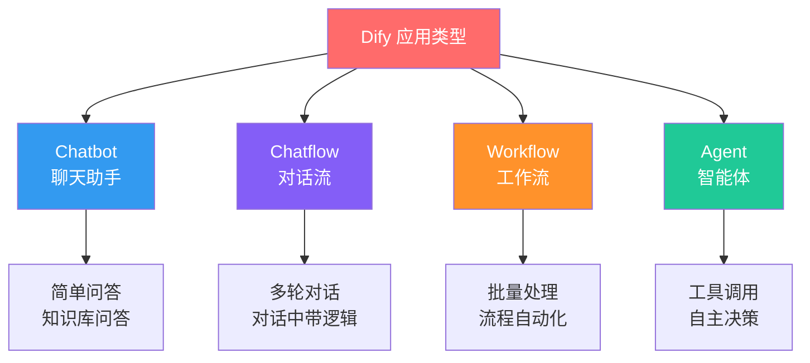
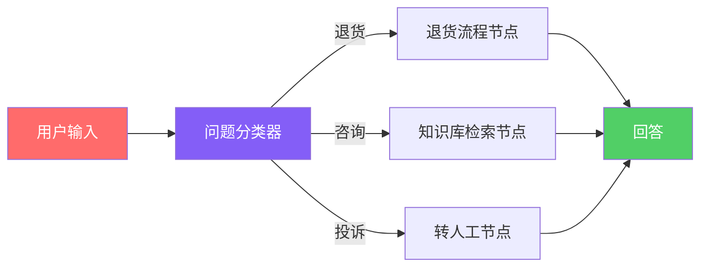
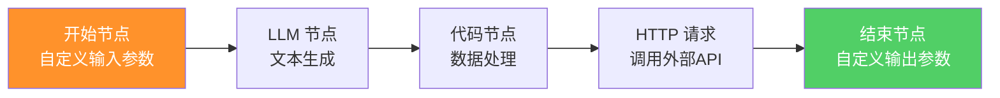
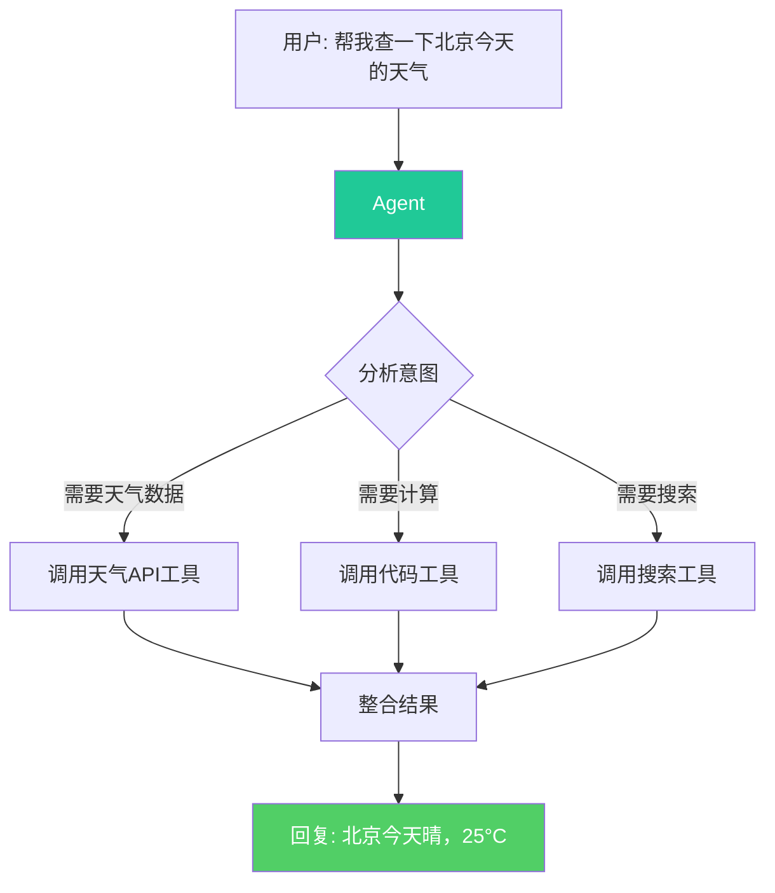
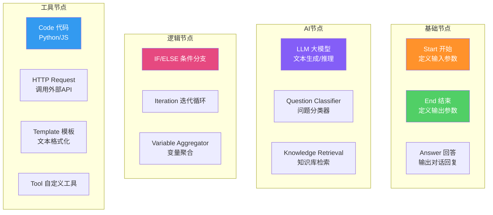
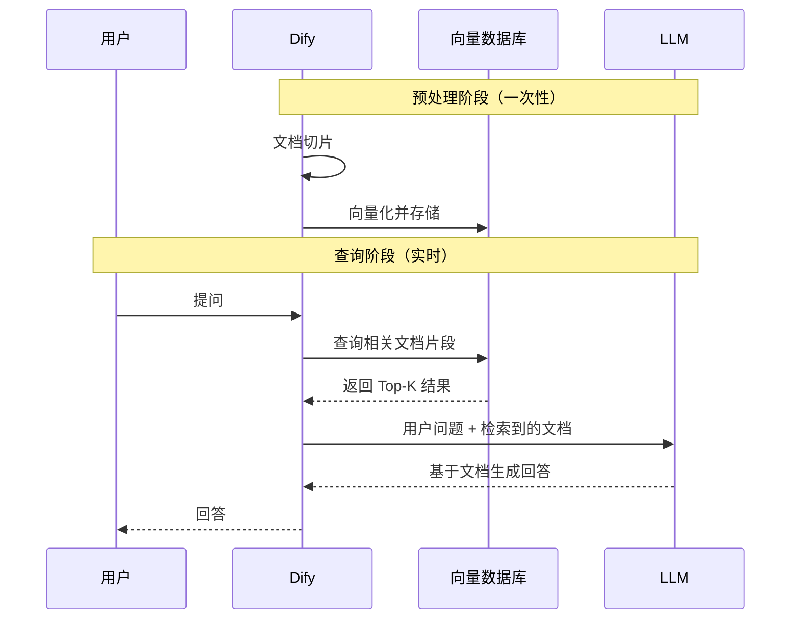
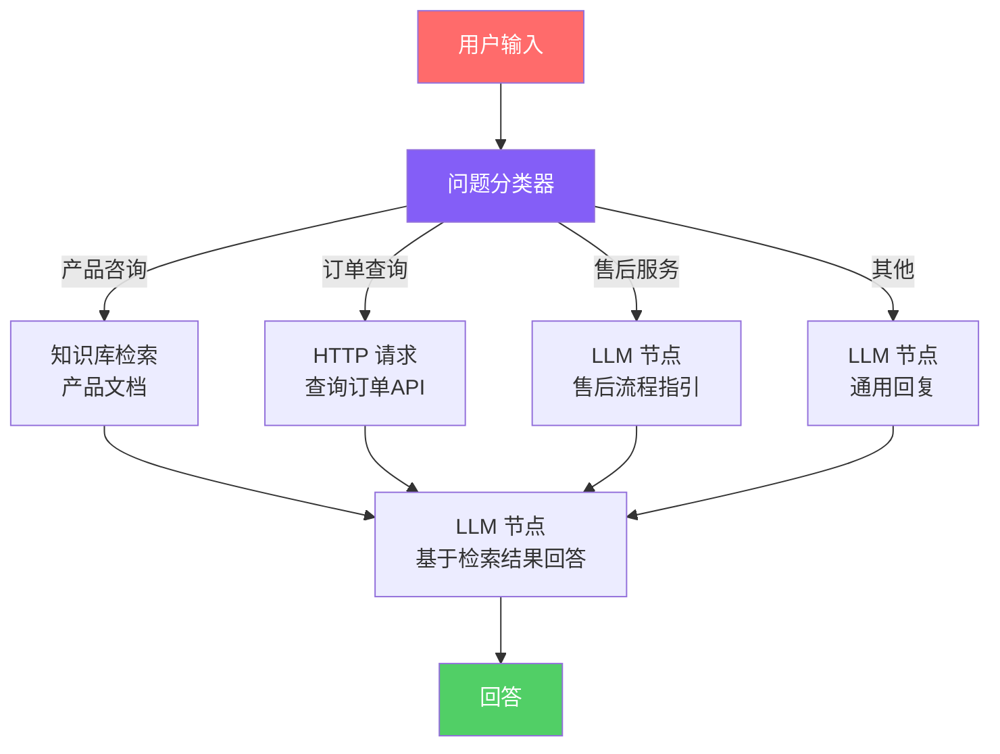
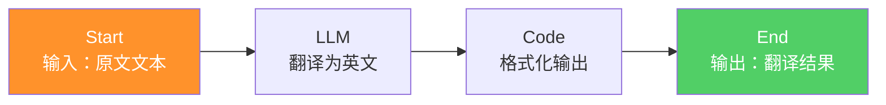
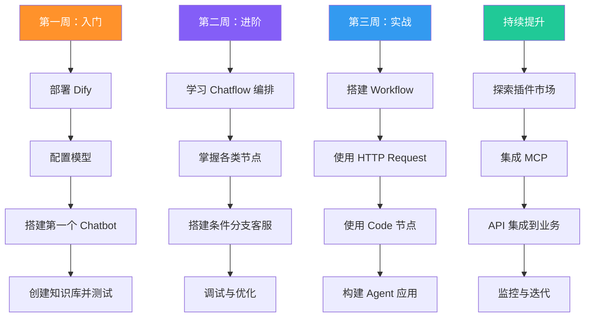

# 从零开始搞懂 Dify：让普通人也能搭建 AI 应用的开源平台

> 你有想法，但不会写代码？你有需求，但调 API 太麻烦？Dify 就是为你准备的——一个拖拖拽拽就能搭建 AI 应用的开源平台。本文从零讲起，一步步带你玩转它。

---

## 一、先想一个问题

你是一个产品经理，老板说："搞一个 AI 客服，能回答我们产品的问题。"

你的第一反应可能是：

1. 找开发写代码调 OpenAI API
2. 搭建向量数据库做知识库
3. 写提示词、调试对话逻辑
4. 部署上线、做监控

一套下来，少则一两周，多则一个月。

**但如果我告诉你，这件事可以在 30 分钟内完成呢？**

不需要写代码，不需要懂向量数据库，不需要自己搭后端——只需要在一个网页上拖拖拽拽、填填表单，一个可用的 AI 应用就跑起来了。

这就是 Dify 要做的事。

---

## 二、Dify 到底是什么？

一句话概括：

> **Dify 是一个开源的 LLM（大语言模型）应用开发平台，让你通过低代码甚至零代码的方式，快速搭建和运营 AI 应用。**

它的名字来自 "Do It For You" 的缩写——帮你把事干了。

### 它解决什么问题？

大模型能力很强，但把大模型变成一个**真正可用的产品**，中间有大量工程问题：


传统方式：你自己一步步搞定这些。  
Dify 方式：**平台帮你搞定这些，你只管设计业务逻辑。**

### 核心数字

- GitHub Star：70k+（开源 AI 项目中的顶流）
- 支持模型：200+（OpenAI、Claude、DeepSeek、通义千问、Gemini……）
- 开源协议：Apache 2.0（商用无忧）
- 部署方式：云端版 / 本地 Docker 部署

---

## 三、和同类平台有什么不同？

市面上类似的平台不少，Dify 的定位和优势需要看对比才清楚：

| 特性 | Dify | Coze（扣子） | FastGPT | RAGFlow |
|------|------|-------------|---------|---------|
| 开源 | ✅ Apache 2.0 | ❌ 闭源 | ✅ Apache 2.0 | ✅ Apache 2.0 |
| 自托管 | ✅ Docker 部署 | ❌ 仅云端 | ✅ Docker 部署 | ✅ Docker 部署 |
| 工作流编排 | ✅ 可视化拖拽 | ✅ 可视化拖拽 | ❌ 较弱 | ❌ 无 |
| Agent 能力 | ✅ 工具调用+MCP | ✅ 插件生态 | ⚠️ 基础 | ❌ 无 |
| RAG / 知识库 | ✅ 强 | ✅ 强 | ✅ 核心优势 | ✅ 核心优势 |
| 模型支持 | 200+ 模型 | 字节系为主 | 有限 | 有限 |
| 数据主权 | ✅ 完全自主 | ❌ 平台持有 | ✅ 自主 | ✅ 自主 |
| 适合人群 | 开发者+产品人员 | 零基础小白 | 知识库优先 | 文档解析优先 |

**Dify 的核心优势**：开源可控 + 工作流编排 + 全能型（不局限于某个单一场景）。如果你想要一个"什么都能做、数据还自己掌控"的平台，Dify 是目前综合能力最强的选择。

---

## 四、Dify 的四种应用类型——搞懂这个就入门了

Dify 提供四种应用类型，每种对应不同的场景。**这是理解 Dify 最重要的概念。**



### 4.1 Chatbot（聊天助手）——最简单的入门

**一句话**：一个带知识库的 ChatGPT。

你只需要：
1. 写一段系统提示词（告诉它扮演什么角色）
2. 挂载一个知识库（可选）
3. 选一个模型

搞定。它就是一个能回答问题的 AI 助手。

**适合场景**：FAQ 客服、产品问答、知识查询、简单聊天机器人。

**特点**：
- 最简单，上手即用
- 支持知识库增强（RAG）
- 不支持复杂逻辑（比如条件判断、循环）
- 多轮对话有记忆

### 4.2 Chatflow（对话流）——带逻辑的多轮对话

**一句话**：可以画流程图的聊天助手。

Chatflow 是 Chatbot 的升级版。它把对话拆成一个个"节点"，你可以画流程图来控制对话走向。

比如用户问"我要退货"，你可以先让 AI 分类意图，再根据分类走不同的处理分支：



**和 Chatbot 的关键区别**：

| | Chatbot | Chatflow |
|--|---------|----------|
| 对话逻辑 | 线性，一问一答 | 可分支、可循环 |
| 输入输出 | 固定：query → answer | 固定：query → answer |
| 节点编排 | 不支持 | 支持 |
| 适合 | 简单问答 | 需要条件判断的对话 |

**注意**：Chatflow 的输入输出是预设好的——输入就是 `query`（用户消息），输出就是 `answer`（AI 回复），你不需要自己定义。

### 4.3 Workflow（工作流）——批量处理的流水线

**一句话**：不聊天，只干活。

Workflow 和 Chatflow 最大的区别：**它不是为对话设计的，而是为批量任务设计的。**

- Chatflow：用户发消息 → AI 回消息（交互式）
- Workflow：输入一批数据 → 处理完输出结果（批处理式）



**关键区别**：

| | Chatflow | Workflow |
|--|----------|----------|
| 交互方式 | 多轮对话 | 单次输入输出 |
| 输入参数 | 固定：query | 自定义：任意字段 |
| 输出参数 | 固定：answer | 自定义：任意字段 |
| 有记忆 | ✅ 会话记忆 | ❌ 无记忆 |
| 适合 | 客服、对话 | 数据处理、内容生成 |

**典型场景**：
- 批量翻译文章
- 自动生成营销文案
- 从网页抓取信息并整理
- 数据 ETL 处理

### 4.4 Agent（智能体）——会自己决策的 AI

**一句话**：你给它目标，它自己想办法完成。

Agent 和前三种最大的区别：**它不是按你预设的流程走，而是根据用户意图自主决定调用什么工具、走什么路径。**



Agent 背后的机制：
1. 用户提出请求
2. LLM 分析意图，决定需要调用什么工具
3. 执行工具调用
4. 根据工具返回结果，继续推理或生成回复
5. 如此循环，直到任务完成

**Dify Agent 支持的工具类型**：
- 内置工具：网页搜索、代码执行、数学计算
- 自定义工具：通过 OpenAPI Schema 导入任意 API
- MCP 工具：通过 MCP 协议连接外部工具服务器
- 知识库：把知识库检索作为工具使用

**适合场景**：复杂任务、需要自主决策的场景、工具调用密集型场景。

### 四种类型速查表

| 类型 | 核心能力 | 有记忆 | 输入输出 | 复杂度 | 典型场景 |
|------|---------|--------|---------|--------|---------|
| Chatbot | 简单问答 | ✅ | 固定 | ⭐ | FAQ 客服 |
| Chatflow | 对话+流程 | ✅ | 固定 | ⭐⭐ | 智能客服 |
| Workflow | 批量处理 | ❌ | 自定义 | ⭐⭐⭐ | 数据流水线 |
| Agent | 自主决策 | ✅ | 固定 | ⭐⭐⭐⭐ | 复杂任务 |

**选择建议**：先从 Chatbot 入手，觉得不够用就升级到 Chatflow；需要批量处理用 Workflow；需要 AI 自主决策用 Agent。

---

## 五、Dify 的核心能力——不止是"聊天"

Dify 不仅仅是一个聊天机器人搭建工具，它是一个完整的 AI 应用开发平台。以下四个能力是它的核心：

### 5.1 可视化工作流编排

这是 Dify 最强大的能力。你可以在画布上拖拽节点、连线，构建复杂 AI 逻辑，一行代码都不用写。

**Workflow/Chatflow 支持的节点类型**：



**重点节点解读**：

**LLM 节点**：最核心的节点。选择模型、写提示词、配置参数。每个 LLM 节点就像"雇佣了一个 AI 员工"。

**Question Classifier 节点**：自动将用户问题分类到不同分支。比如把"退货""咨询""投诉"分别路由到不同处理流程。

**Knowledge Retrieval 节点**：从知识库中检索与用户问题最相关的内容，作为 LLM 的上下文。

**Code 节点**：写 Python 或 JavaScript 代码做数据处理。比如格式转换、数据清洗、简单计算。

**HTTP Request 节点**：调用外部 API。比如查天气、发邮件、调用内部系统。

**IF/ELSE 节点**：条件判断。根据上游节点的输出决定走哪个分支。

**Iteration 节点**：循环处理列表数据。比如对一组文章逐篇生成摘要。

### 5.2 知识库（RAG）

知识库是 Dify 的另一大核心能力，它让你可以把私有数据"喂"给 AI，让 AI 基于你的数据来回答问题。

**RAG 的基本原理**：



**Dify 知识库支持的文件格式**：
- TXT、Markdown、PDF、DOCX
- CSV、Excel
- 网页（通过 URL 抓取）
- Notion 同步
- 飞书文档同步

**关键配置项**：

| 配置 | 说明 | 建议 |
|------|------|------|
| 切片方式 | 自动 / 自定义 | 短文档用自动，长文档用自定义 |
| 切片长度 | 每个文本块的 Token 数 | 500-1000 较合适 |
| 重叠长度 | 相邻块之间的重叠 | 切片长度的 10%-20% |
| 检索模式 | 向量检索 / 全文检索 / 混合检索 | 混合检索效果最好 |
| Top K | 检索返回的文档片段数 | 3-5 为宜 |
| Score 阈值 | 相似度最低门槛 | 0.5-0.7 之间 |

**一个小技巧**：知识库效果不好时，先检查切片质量。切片太大，检索不精准；切片太小，上下文丢失。

### 5.3 模型管理

Dify 最大的便利之一：**一个平台管理所有模型**。

你不需要在 OpenAI、Anthropic、DeepSeek 之间反复切换，只需要在 Dify 的"设置-模型供应商"中配置好 API Key，之后在应用中直接选择模型即可。

**支持的模型供应商（部分）**：

| 供应商 | 代表模型 | 特点 |
|--------|---------|------|
| OpenAI | GPT-4o、GPT-4o-mini | 综合最强 |
| Anthropic | Claude 3.5 Sonnet | 长文本、推理优 |
| DeepSeek | DeepSeek-V3、DeepSeek-R1 | 性价比极高 |
| 阿里云 | 通义千问-Max | 中文能力强 |
| Google | Gemini 2.0 Pro | 多模态强 |
| Ollama | 本地模型 | 数据不出本机 |

**配置方法**：进入"设置" → "模型供应商" → 找到对应供应商 → 填入 API Key → 保存。之后在应用的 LLM 节点中就能选择该供应商的模型了。

### 5.4 API 即服务

你在 Dify 上搭建的应用，会自动获得一个 REST API。这意味着：

- 前端页面可以直接调用
- 其他系统可以集成
- 可以作为微服务使用

**调用示例**：

```bash
curl -X POST 'https://api.dify.ai/v1/chat-messages' \
  -H 'Authorization: Bearer {api_key}' \
  -H 'Content-Type: application/json' \
  -d '{
    "inputs": {},
    "query": "你好，请介绍一下你们的产品",
    "response_mode": "blocking",
    "conversation_id": "",
    "user": "user-123"
  }'
```

Dify 还提供多种 SDK：

```python
# Python SDK
from dify_client import DifyClient

client = DifyClient(api_key="your-api-key")
result = client.chat(query="你好", user="user-123")
print(result)
```

---

## 六、动手实操——从部署到搭建第一个应用

### 6.1 部署 Dify

你有两种选择：

**方案 A：使用 Dify 云端版（最快上手）**

直接访问 https://cloud.dify.ai ，注册即可使用。免费额度足够学习和测试。

**方案 B：本地 Docker 部署（数据完全自主）**

```bash
# 1. 克隆仓库
git clone https://github.com/langgenius/dify.git

# 2. 进入 docker 目录
cd dify/docker

# 3. 复制环境变量配置
cp .env.example .env

# 4. 启动服务
docker compose up -d

# 5. 查看服务状态
docker compose ps
```

启动成功后，访问 http://localhost/install 进行初始化设置，创建管理员账号。

**最低配置要求**：

| 项目 | 最低要求 | 推荐配置 |
|------|---------|---------|
| CPU | 2 核 | 4 核+ |
| 内存 | 4 GB | 8 GB+ |
| 磁盘 | 20 GB | 50 GB+ |
| Docker | 20.10+ | 最新版 |
| Docker Compose | 2.0+ | 最新版 |

### 6.2 配置模型

部署完成后，第一件事是配置模型：

1. 点击右上角头像 → "设置"
2. 选择 "模型供应商"
3. 找到你想用的供应商（比如 OpenAI）
4. 填入 API Key
5. 保存

**推荐入门组合**：
- 对话：GPT-4o-mini 或 DeepSeek-V3（便宜好用）
- 推理：GPT-4o 或 DeepSeek-R1
- 嵌入（知识库用）：text-embedding-3-small

### 6.3 搭建第一个应用：AI 客服助手

我们来搭一个最实用的场景——**基于产品文档的 AI 客服**。

**第一步：创建应用**

1. 点击"创建应用"
2. 选择"聊天助手"
3. 填写应用名称："智能客服助手"

**第二步：编写提示词**

在"编排"页面的"提示词"区域写入：

```
你是「极客商城」的智能客服，负责回答用户关于产品、订单、售后的问题。

## 你的工作原则
1. 只回答与极客商城相关的问题，不回答无关问题
2. 优先基于知识库中的信息回答
3. 如果知识库中没有相关信息，诚实告知用户，不要编造
4. 回答简洁明了，不要啰嗦
5. 如果用户情绪激动，先安抚再解答

## 回答格式
- 产品问题：给出产品名称、价格、核心特点
- 订单问题：先确认订单号，再查询
- 售后问题：说明退货/换货流程和时效
```

**第三步：创建知识库**

1. 进入"知识库"页面
2. 点击"创建知识库"
3. 上传你的产品文档（PDF、TXT、Markdown 都行）
4. 选择分段设置：
   - 分段方式：自动
   - 索引方式：高质量
   - 检索模式：混合检索
5. 等待索引完成

**第四步：关联知识库**

回到应用编排页面：
1. 在"上下文"区域点击"添加"
2. 选择刚创建的知识库
3. 保存

**第五步：测试**

在右侧的"预览"区域输入问题测试：
- "你们有什么手机推荐？"
- "怎么退货？"
- "订单怎么查？"

如果回答正确，恭喜你，第一个 AI 应用就完成了！

**第六步：发布**

点击右上角"发布"，你的应用就可以通过以下方式使用：
- Web 应用链接（直接分享给用户）
- API 接口（集成到你的系统）
- 嵌入式聊天组件（嵌入到网页）

整个过程，**不超过 30 分钟**。

---

## 七、进阶实操——搭一个带条件分支的 Chatflow

简单聊天助手不够用？我们来做一个更复杂的——**智能客服 Chatflow**，能根据用户意图走不同处理分支。

### 整体流程



### 逐步搭建

**第一步：创建 Chatflow 应用**

1. 点击"创建应用"
2. 选择"Chatflow"
3. 进入编排画布

**第二步：添加问题分类器节点**

1. 从左侧节点面板拖入"问题分类器"节点
2. 连线：Start → Question Classifier
3. 配置分类：
   - 类别 1：产品咨询 → 描述："用户询问产品功能、价格、对比等"
   - 类别 2：订单查询 → 描述："用户查询订单状态、物流信息"
   - 类别 3：售后服务 → 描述："用户提出退货、换货、维修等需求"
   - 类别 4：其他 → 描述："不属于以上类别的对话"

**第三步：为每个分类添加处理节点**

**产品咨询分支**：
- 拖入"知识检索"节点 → 连接"产品咨询"分类输出
- 拖入"LLM"节点 → 连接知识检索节点
- LLM 提示词：`基于以下检索到的产品信息回答用户问题：{{context}}\n\n用户问题：{{query}}`

**订单查询分支**：
- 拖入"HTTP 请求"节点 → 连接"订单查询"分类输出
- 配置：GET 请求，URL 为你的订单查询 API
- 拖入"LLM"节点 → 连接 HTTP 请求节点
- LLM 提示词：`根据查询到的订单信息回答用户：{{http_result}}`

**售后服务分支**：
- 拖入"LLM"节点 → 连接"售后服务"分类输出
- 提示词：详细描述售后流程和话术

**第四步：汇聚到回答节点**

所有分支最终连到"Answer"节点，输出给用户。

**第五步：测试并调试**

在预览区输入不同类型的问题，观察分类是否准确、各分支是否正常工作。

---

## 八、进阶实操——搭一个 Workflow 自动翻译流水线

这次我们来做一个 **Workflow**——批量翻译文章并输出 Markdown 文件。

### 流程设计



### 逐步搭建

**第一步：创建 Workflow 应用**

1. 创建应用 → 选择"Workflow"
2. 进入编排画布

**第二步：配置 Start 节点**

添加输入变量：
- 变量名：`source_text`
- 类型：段落文本
- 标签：原文

**第三步：添加 LLM 翻译节点**

- 拖入 LLM 节点
- 选择模型：GPT-4o-mini
- 提示词：

```
你是一位专业的英中翻译。请将以下文本翻译为中文，保持原文的语气和格式。

原文：
{{#start.source_text#}}

要求：
1. 准确翻译，不遗漏内容
2. 保持专业术语的准确性
3. 保留原文的 Markdown 格式
```

**第四步：添加 Code 格式化节点**

- 拖入 Code 节点
- 语言选择 Python
- 代码：

```python
def main(translation: str) -> dict:
    formatted = f"## 翻译结果\n\n{translation}\n\n---\n*由 AI 自动翻译*"
    return {"result": formatted}
```

**第五步：配置 End 节点**

添加输出变量：
- 变量名：`result`
- 值：引用 Code 节点的输出 `{{#code.result#}}`

**第六步：测试并发布**

输入一段英文文本测试翻译效果，满意后发布。

---

## 九、Dify 的生态与扩展

Dify 不仅仅是一个工具，它还在构建一个生态。

### 9.1 插件市场

Dify 在 2025 年推出了插件市场（Marketplace），社区开发者可以贡献和安装插件：

- **模型插件**：接入更多模型供应商
- **工具插件**：扩展 Agent 的工具能力
- **Agent 策略插件**：自定义 Agent 的推理策略
- **扩展插件**：检索不精准，噪音多 → 缩小切片长度
- **切片太小**：上下文缺失，答案不完整 → 增大切片长度或重叠
- **文档质量差**：表格、图片没处理好 → 预处理文档，转成 Markdown
- **检索模式不对**：纯向量检索不够 → 试试混合检索

### 2. 模型选择别贪贵

不是所有场景都需要 GPT-4o：

- **简单问答**：GPT-4o-mini 或 DeepSeek-V3 就够
- **知识库问答**：中等模型 + 好的知识库 > 强模型 + 差的知识库
- **复杂推理**：才需要 GPT-4o 或 DeepSeek-R1

### 3. 提示词要结构化

写提示词不是写散文，要像写需求文档一样结构化：

```
❌ 帮我回答用户的问题

✅ 你是XX公司的客服。
    ## 工作原则
    1. ...
    2. ...
    ## 回答格式
    - 场景A：...
    - 场景B：...
    ## 禁止事项
    1. ...
```

### 4. Workflow vs Chatflow 别选错

一个简单判断：
- **需要跟用户多轮对话** → Chatflow
- **输入数据、输出结果，中间不需要人参与** → Workflow

选错了会很难受：Workflow 没有会话记忆，Chatflow 输入输出不能自定义。

### 5. 注意 Token 消耗

工作流中的每个 LLM 节点都会消耗 Token。一个 5 节点的 Workflow，跑一次可能是 5 次 API 调用。调试时建议用便宜模型，上线后再切强模型。

### 6. 善用"变量引用"

Dify 节点之间通过变量传递数据。引用格式是 `{{#节点名.变量名#}}`，比如：

- `{{#start.query#}}` — 用户输入
- `{{#llm_1.text#}}` — LLM 节点的输出
- `{{#code_1.result#}}` — Code 节点的输出

理解变量引用是编排复杂工作流的关键。

---

## 十一、一个完整的学习路径



---

Dify 的设计哲学可以概括为一句话：**让 AI 应用开发从"写代码"变成"拼积木"。**

它的四大应用类型覆盖了从简单到复杂的所有场景：

| 类型 | 一句话 | 你要做的事 |
|------|--------|-----------|
| Chatbot | 带知识库的 ChatGPT | 写提示词 + 挂知识库 |
| Chatflow | 能画流程图的聊天助手 | 画节点 + 连线 + 填配置 |
| Workflow | AI 批处理流水线 | 设计数据流 + 编排节点 |
| Agent | 会自己找工具的 AI | 配工具 + 写提示词 |

Dify 不是万能的，但它是目前**综合能力最强、最适合快速落地**的 AI 应用开发平台。