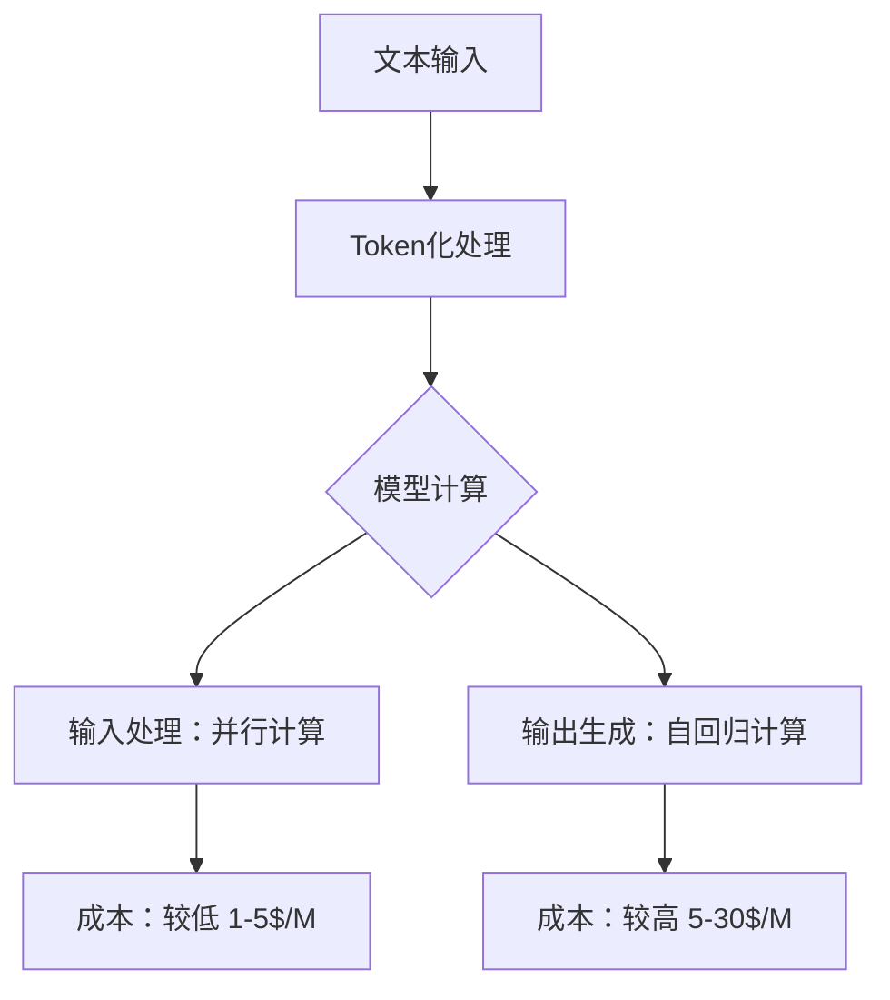
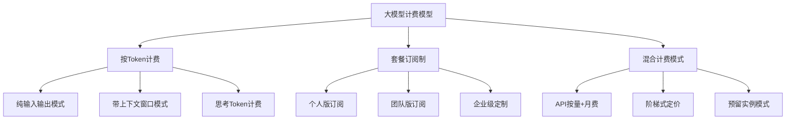
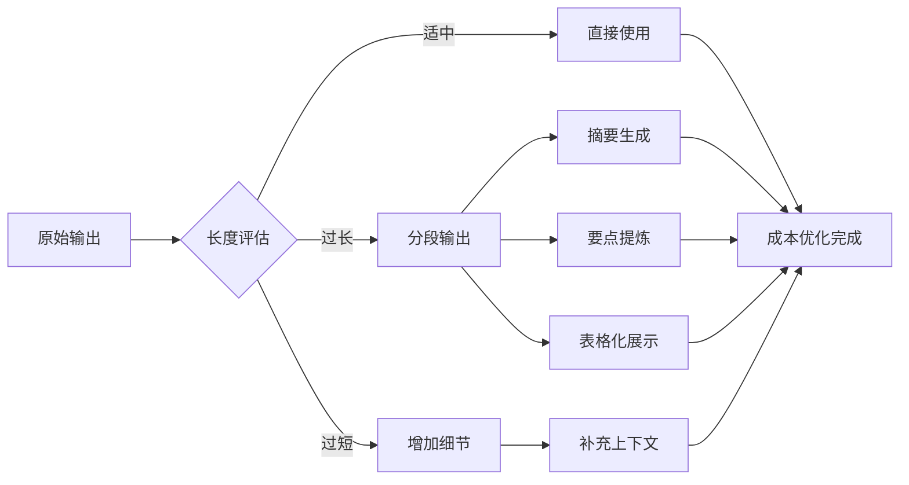
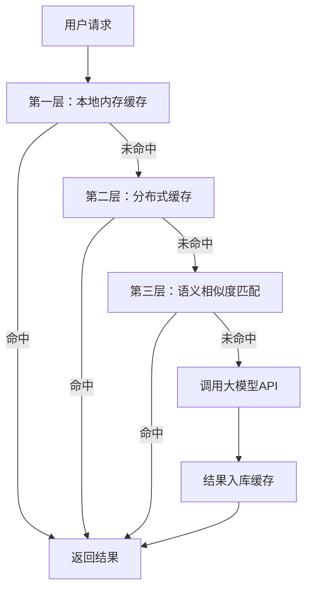
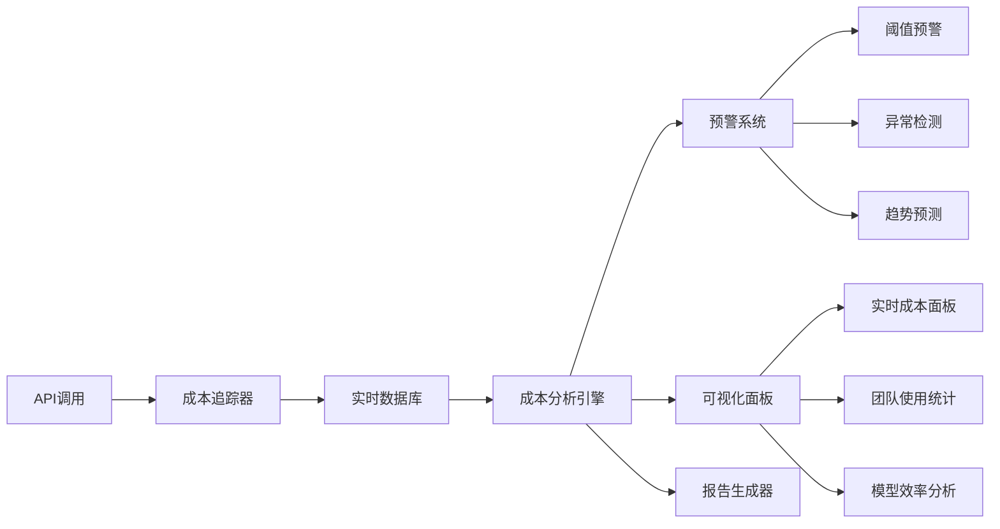
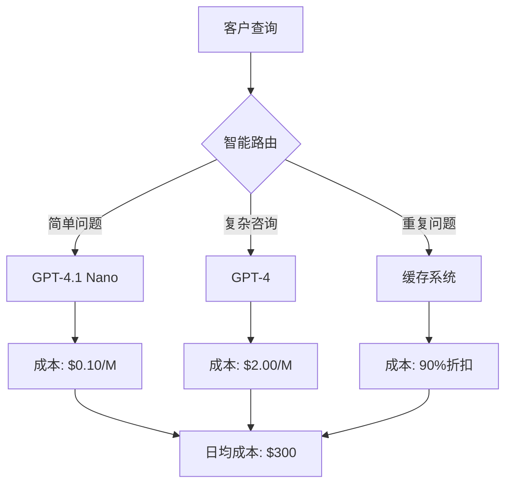
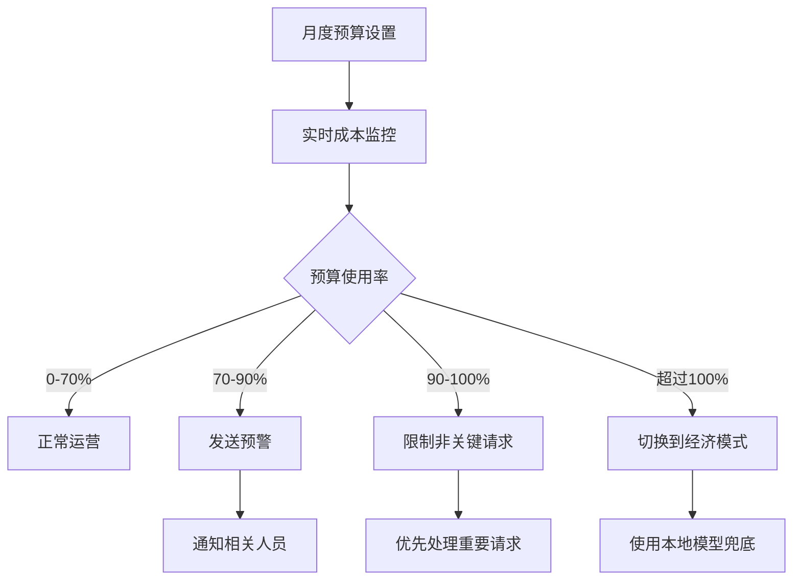
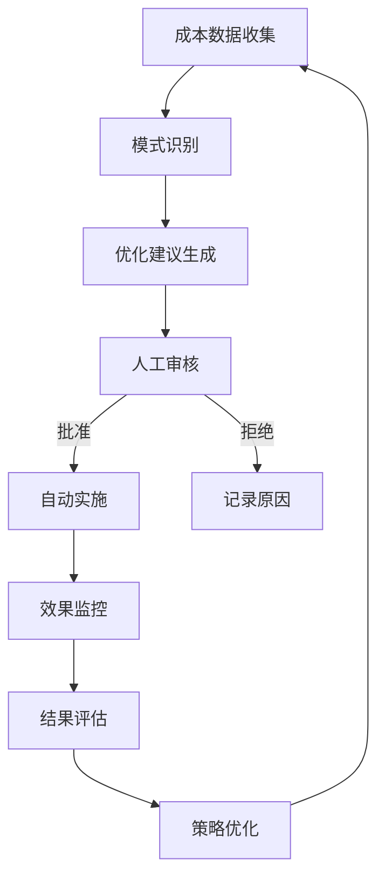

# 大模型计费深度解析：从基础理解到企业级优化策略

## 引言：为什么理解大模型计费如此重要？

在人工智能快速发展的2026年，大型语言模型已成为企业数字化转型的核心基础设施。然而，随着应用规模的扩大，成本控制成为决定项目成败的关键因素。本文将从零开始，深入剖析大模型的各种计费模式，帮助您建立完整的成本管理框架。

## 第一章：基础概念：理解计费的核心要素

### 1.1 什么是Token？为何它是计费的基础单元？

Token是语言模型处理的基本单位，通常不是简单的英文单词或中文字符。一个Token可能是：

- 完整的英文单词（例如："the"）
- 单词的一部分（例如："un" + "believable"）
- 标点符号（例如："!"、"?"）
- 单个中文字符通常对应1-2个Token

**为什么输出Token比输入Token昂贵？**

- **输入处理**：并行计算，一次性处理全部Token
- **输出生成**：自回归方式，逐个预测Token，计算复杂度更高
- **典型价格比**：输出Token通常是输入Token价格的3-8倍



### 1.2 主要计费模型分类



## 第二章：主要服务商定价深度分析

### 2.1 顶级模型价格对比（2026年4月）

| 模型名称 | 供应商 | 输入 (每百万Token) | 输出 (每百万Token) | 上下文窗口 | 性价比指数 |
|---------|--------|-------------------|-------------------|------------|------------|
| GPT-5 | OpenAI | $1.25 | $10.00 | 400K | 8.2 |
| Gemini 2.5 Pro | Google | $1.25 | $10.00 | 1M | 10.1 |
| Claude Opus 4.6 | Anthropic | $5.00 | $25.00 | 1M | 7.5 |
| GPT-4.1 | OpenAI | $2.00 | $8.00 | 1M | 9.3 |
| Claude Sonnet 4.5 | Anthropic | $3.00 | $15.00 | 200K | 6.8 |

### 2.2 经济型模型对比

```mermaid
gantt
    title 经济型模型性价比对比
    dateFormat X
    axisFormat %s
    
    section 输入成本 ($/M Token)
    Gemini 2.5 Flash Lite : 0, 10
    GPT-4.1 Nano : 10, 20
    Gemini 2.5 Flash : 20, 30
    Claude Haiku 4.5 : 30, 80
    
    section 综合性价比 (1-10分)
    Gemini 2.5 Flash Lite : 0, 95
    GPT-4.1 Nano : 0, 90
    Gemini 2.5 Flash : 0, 88
    Claude Haiku 4.5 : 0, 75
```



### 2.3 各服务商定价策略分析

**OpenAI定价特点：**
- 分层覆盖：从旗舰模型到经济型版本完整覆盖
- 批量API支持：提供50%折扣的批量处理模式
- 自动缓存：对超过1024Token的提示自动缓存

**Anthropic定价特点：**
- 强调上下文能力：大上下文窗口是核心优势
- 手动缓存控制：需要显式设置缓存策略
- 长期记忆：支持跨会话的知识保持

**Google Gemini定价特点：**
- 与云服务深度整合：AI Pro套餐包含云存储价值
- 超大上下文窗口：支持1M Token的长文档处理
- 推理Token计入成本：思考过程需付费

## 第三章：成本优化核心技术策略

### 3.1 Token优化技术

```go
// Token优化策略代码示例
type TokenOptimizer struct {
    maxTokens        int
    cacheManager     *CacheManager
    compressionLevel int
}

func (to *TokenOptimizer) OptimizePrompt(prompt string) (string, int) {
    // 1. 去除重复内容
    optimized := to.removeDuplicates(prompt)
    
    // 2. 压缩冗余描述
    optimized = to.compressVerbiage(optimized)
    
    // 3. 使用缩写和术语
    optimized = to.useAbbreviations(optimized)
    
    // 4. 结构化内容
    optimized = to.structureContent(optimized)
    
    estimatedTokens := to.estimateTokenCount(optimized)
    return optimized, estimatedTokens
}

// 具体实现方法
func (to *TokenOptimizer) estimateTokenCount(text string) int {
    // 使用近似算法快速估算
    chineseChars := countChineseCharacters(text)
    englishWords := countEnglishWords(text)
    
    // 中文字符通常1-2个Token，英文单词1-3个Token
    return chineseChars*2 + englishWords*2
}
```

#### 3.1.2 输出长度控制



### 3.2 缓存策略深度分析

#### 3.2.1 语义缓存 vs 精确缓存

**精确缓存的问题：**
- 完全相同的查询才能命中
- 错失大量语义相似的查询
- 在对话场景中效果不佳

**语义缓存的优势：**
```go
type SemanticCache struct {
    embeddingModel *EmbeddingModel
    similarityThreshold float64
    cacheStore map[string]CacheEntry
}

func (sc *SemanticCache) GetSimilarResponse(query string) *CacheEntry {
    queryEmbedding := sc.embeddingModel.Encode(query)
    
    for cachedQuery, entry := range sc.cacheStore {
        cachedEmbedding := sc.embeddingModel.Encode(cachedQuery)
        similarity := cosineSimilarity(queryEmbedding, cachedEmbedding)
        
        if similarity >= sc.similarityThreshold {
            return &entry
        }
    }
    return nil
}
```

#### 3.2.2 多级缓存架构



### 3.3 批量处理和异步优化

#### 3.3.1 批量API的底层原理

```go
type BatchProcessor struct {
    batchSize    int
    maxWaitTime  time.Duration
    requests     chan *Request
    results      chan *Result
}

func (bp *BatchProcessor) ProcessBatch() {
    ticker := time.NewTicker(bp.maxWaitTime)
    defer ticker.Stop()
    
    var batch []*Request
    
    for {
        select {
        case req := <-bp.requests:
            batch = append(batch, req)
            if len(batch) >= bp.batchSize {
                bp.processImmediate(batch)
                batch = nil
            }
        case <-ticker.C:
            if len(batch) > 0 {
                bp.processImmediate(batch)
                batch = nil
            }
        }
    }
}

func (bp *BatchProcessor) processImmediate(batch []*Request) {
    // 批量API调用，获得50%折扣
    batchResponse := callBatchAPI(batch)
    for i, result := range batchResponse {
        bp.results <- result
    }
}
```

## 第四章：企业级成本管理实战

### 4.1 成本监控与预警系统

#### 4.1.1 实时成本监控架构



#### 4.1.2 预警规则配置

```go
type CostAlertRule struct {
    ID           string
    Name         string
    Metric       string // "daily_cost", "request_rate", etc.
    Operator     string // ">", "<", "=="
    Threshold    float64
    TimeWindow   time.Duration
    Action       string // "email", "slack", "webhook"
    Recipients   []string
}

func (car *CostAlertRule) Evaluate(currentValue float64) bool {
    switch car.Operator {
    case ">":
        return currentValue > car.Threshold
    case "<":
        return currentValue < car.Threshold
    case "==":
        return currentValue == car.Threshold
    default:
        return false
    }
}
```

### 4.2 团队成本分摊策略

#### 4.2.1 基于项目的成本分配

```go
type CostAllocator struct {
    projects map[string]*Project
    teams    map[string]*Team
    users    map[string]*User
}

func (ca *CostAllocator) AllocateCost(usage *APIUsage) {
    // 根据项目标签分配成本
    if usage.ProjectID != "" {
        project := ca.projects[usage.ProjectID]
        project.TotalCost += usage.Cost
        
        // 进一步分配到团队和用户
        if usage.TeamID != "" {
            team := ca.teams[usage.TeamID]
            team.Cost += usage.Cost
        }
        
        if usage.UserID != "" {
            user := ca.users[usage.UserID]
            user.Cost += usage.Cost
        }
    }
}
```

#### 4.2.2 成本效益分析报表

```go
type CostBenefitReport struct {
    Period         time.Time
    TotalCost      float64
    BusinessValue  float64
    ROI            float64
    CostPerRequest float64
    Efficiency     map[string]float64 // 各模型效率
}

func GenerateMonthlyReport() *CostBenefitReport {
    report := &CostBenefitReport{
        Period: time.Now().AddDate(0, -1, 0),
    }
    
    // 成本数据聚合
    report.TotalCost = aggregateCostData()
    report.BusinessValue = calculateBusinessValue()
    report.ROI = report.BusinessValue / report.TotalCost
    
    return report
}
```

## 第五章：实际案例分析与最佳实践

### 5.1 电商客户服务案例

**场景：** 日均处理10万次客户咨询

**优化前成本结构：**
- 使用GPT-4处理所有咨询：$1500/天
- 无缓存策略：重复问题重复计算
- 统一模型：简单查询使用高成本模型

**优化策略实施：**



**优化后效果：**
- 日均成本：$300（下降80%）
- 响应时间：平均减少40%
- 客户满意度：提升15%

### 5.2 技术文档生成案例

**场景：** 为1000个API生成技术文档

**成本优化技术：**

```go
// 文档生成成本优化器
type DocGenOptimizer struct {
    templateCache map[string]string
    patternMatcher *PatternMatcher
    batchProcessor *BatchProcessor
}

func (dgo *DocGenOptimizer) GenerateDocs(apis []API) []Documentation {
    var docs []Documentation
    
    // 1. 批量处理相似API
    batches := dgo.groupSimilarAPIs(apis)
    
    for _, batch := range batches {
        // 2. 使用模板减少Token使用
        template := dgo.getBestTemplate(batch)
        
        // 3. 批量生成获得折扣
        batchDocs := dgo.batchProcessor.GenerateBatch(batch, template)
        docs = append(docs, batchDocs...)
    }
    
    return docs
}
```

## 第六章：未来趋势与风险管理

### 6.1 价格趋势预测

基于历史数据分析的价格变化规律：

```mermaid
xychart-beta
    title "大模型价格变化趋势 (2023-2026)"
    x-axis [2023-Q4, 2024-Q1, 2024-Q2, 2024-Q3, 2024-Q4, 2025-Q1, 2025-Q2, 2025-Q3, 2025-Q4, 2026-Q1]
    y-axis "价格 ($/M Token)" 0 --> 30
    line [15, 12, 10, 8, 6, 4, 3, 2.5, 2, 1.25] GPT-4系列
    line [25, 20, 18, 16, 12, 10, 8, 6, 5, 3] Claude系列
    line [20, 15, 12, 10, 8, 5, 3, 2, 1.5, 1.25] Gemini系列
```

### 6.2 风险管理策略

#### 6.2.1 多供应商策略

```go
type MultiVendorStrategy struct {
    primaryVendor   *Vendor
    secondaryVendor *Vendor
    fallbackVendor  *Vendor
    costThresholds  map[string]float64
}

func (mvs *MultiVendorStrategy) SelectVendor(request *Request) *Vendor {
    // 基于成本优化选择供应商
    currentMonthCost := mvs.getCurrentMonthCost()
    
    if currentMonthCost > mvs.costThresholds["primary"] {
        return mvs.secondaryVendor
    }
    
    // 基于模型能力选择
    if request.Complexity > 0.8 {
        return mvs.primaryVendor
    }
    
    return mvs.selectCheapestVendor(request)
}
```

#### 6.2.2 成本预算控制



## 第七章：实用工具与自动化方案

### 7.1 成本监控仪表板

构建完整的成本监控系统：

```go
type CostDashboard struct {
    realTimeData   *RealTimeDataStream
    historicalData *HistoricalDatabase
    alertEngine    *AlertEngine
    visualization  *VisualizationEngine
}

func (cd *CostDashboard) StartMonitoring() {
    // 实时数据流处理
    go cd.realTimeData.ProcessStream()
    
    // 定时生成报告
    ticker := time.NewTicker(1 * time.Hour)
    for range ticker.C {
        cd.generateHourlyReport()
    }
}

func (cd *CostDashboard) generateHourlyReport() {
    report := &HourlyReport{
        TotalCost:      cd.calculateHourlyCost(),
        TopModels:      cd.getTopUsedModels(),
        CostTrend:      cd.analyzeCostTrend(),
        Anomalies:      cd.detectAnomalies(),
    }
    
    cd.visualization.UpdateDashboard(report)
    cd.alertEngine.CheckAlerts(report)
}
```

### 7.2 自动化成本优化流程

