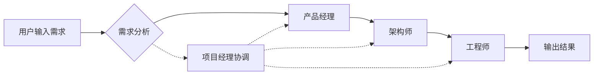
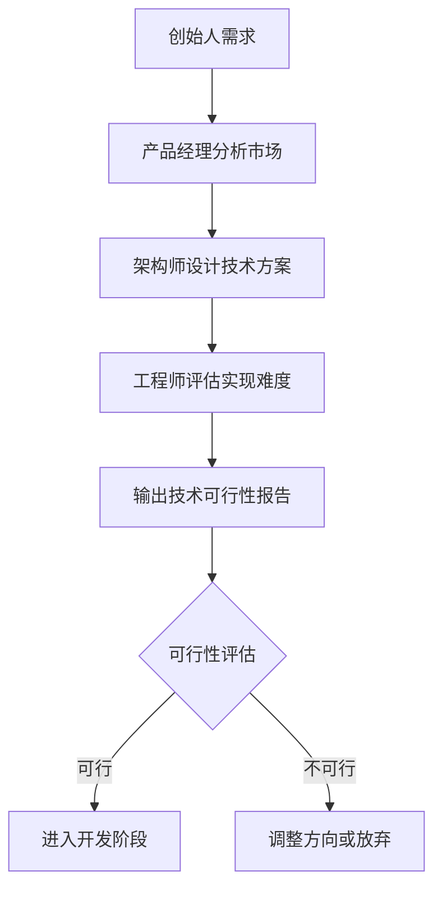

# MetaGPT 是什么？一篇通俗易懂的入门指南

> 如果你听过大模型、ChatGPT，但还不知道 MetaGPT，这篇文章就是为你写的。

---

## 一、从一个有趣的比喻说起

想象一下，你是一家软件公司的老板。

某天，你对产品经理说：“我想做一个像今日头条那样的推荐系统。”

然后，你只需要喝杯咖啡等待——

- 产品经理会写出用户故事和需求文档
- 架构师会画出系统设计图
- 工程师会写出代码

一支完整的团队帮你把想法变成了现实。

现在，有这样一个框架，它不需要招聘任何人，就能模拟这样一个软件公司团队来完成复杂任务。

**这就是 MetaGPT。**

---

## 二、MetaGPT 到底是什么？

MetaGPT 是一个**多智能体协作框架**（Multi-Agent Framework）。

用人话说就是：**让多个 AI 智能体像公司员工一样分工合作，共同完成复杂任务。**

它的核心口号非常有意思：

> **Code = SOP(Team)**

意思是：**代码 = 标准操作程序 × 团队**

MetaGPT 把人类社会的**标准工作流程（SOP）**引入到 AI 团队中，让不同角色的 AI 各司其职，协作解决问题。

---

## 三、MetaGPT 是怎么工作的？

### 输入输出一句话

你只需要输入一句话需求，MetaGPT 就能给你完整的软件设计和代码。

```bash
metagpt "Design a RecSys like Toutiao"
```

输出可能是：

- 用户故事
- 竞品分析
- 需求文档
- 数据结构设计
- API 接口设计
- 完整代码

### 内部是怎么协作的？

MetaGPT 模拟了一个完整的软件公司团队，包含以下角色：

| 角色 | 职责 |
|------|------|
| **产品经理（Product Manager）** | 分析需求，写用户故事 |
| **架构师（Architect）** | 设计系统架构和技术方案 |
| **项目经理（Project Manager）** | 协调进度，管理任务 |
| **工程师（Engineer）** | 编写具体代码 |

你可以这样理解它的协作流程：



每个角色只做自己擅长的事，通过**标准化的协作流程**串联在一起，这就是 MetaGPT 的核心秘诀。

---

## 四、为什么 MetaGPT 值得关注？

### 1. 解决复杂任务的“幻觉”问题

单个大模型有时会“胡说八道”（AI 业界称为“幻觉”）。当多个 AI 协作时，这种问题会被放大，导致复杂任务失败。

MetaGPT 引入 SOP 流程，让每个环节有检查、有反馈，大大降低了错误率。

### 2. 成本低到惊人

根据官方数据：

| 产出类型 | 预估成本（GPT-4） |
|----------|-------------------|
| 包含分析和设计的样例 | **约 $0.2** |
| 完整项目 | **约 $2.0** |

一杯咖啡的钱，就能让一个“AI 团队”帮你干活。

### 3. 不只是做软件

虽然 MetaGPT 从软件公司场景起步，但它的**多智能体框架是通用的**。

你可以用它搭建：

- 📊 **数据分析智能体**
- 🔍 **调研智能体**
- 🎮 **游戏智能体**（比如狼人杀、Minecraft）
- 📱 **安卓助手**
- 💬 **辩论系统**

---

## 五、快速上手体验

### 第一步：安装

```bash
pip install metagpt
```

### 第二步：配置

需要设置你的大模型 API（支持 OpenAI、Claude 等多种模型）。

### 第三步：运行

```bash
metagpt "做一个简易的待办事项应用"
```

然后你会看到 AI 团队开始分工协作，输出完整的设计和代码。

---

## 六、适合谁学习？

- **AI 初学者**：想了解多智能体是什么
- **开发者**：想用 MetaGPT 搭建自己的 AI 应用
- **产品经理**：想了解 AI 能帮你做什么
- **技术爱好者**：对大模型最新技术感兴趣

---

MetaGPT 做的事情其实很朴素但很有效：

> **把人类社会的协作智慧，教会 AI 团队。**

它让 AI 不再是一个人在战斗，而是变成了一支有组织、有流程的团队。

这就是为什么很多人说：**“MetaGPT 可能是目前最接近'AI 程序员'愿景的框架。”**

---

## 八、相关资源

- 📖 官方文档：https://docs.deepwisdom.ai/
- 💻 GitHub：https://github.com/FoundationAgents/MetaGPT
- 📄 论文：https://arxiv.org/abs/2308.00352

## 九、实战代码示例：构建一个完整的项目

### 示例1：简易待办事项应用

让我们看一个完整的 MetaGPT 使用示例：

```python
from metagpt.software_company import SoftwareCompany
from metagpt.roles import ProductManager, Architect, ProjectManager, Engineer

# 创建软件公司实例
company = SoftwareCompany()

# 招聘团队成员
company.hire([
    ProductManager(),
    Architect(), 
    ProjectManager(),
    Engineer()
])

# 启动项目
company.start_project(
    idea="开发一个简易的待办事项Web应用",
    investment=3.0  # 预算3美元
)

# 查看输出结果
print("=== 项目输出 ===")
for role_name, artifacts in company.get_artifacts().items():
    print(f"\n{role_name} 的产出：")
    for artifact in artifacts:
        print(f"- {artifact.name}: {artifact.content[:100]}...")
```

**预期输出示例：**
```
产品经理的产出：
- 用户故事：作为用户，我希望能够添加、删除和标记任务完成
- 竞品分析：对比分析Trello、Asana等竞品特性

架构师的产出：
- 系统架构图：前端React + 后端FastAPI + 数据库SQLite
- API设计：/tasks GET/POST/PUT/DELETE 接口

工程师的产出：
- 前端代码：React组件和样式
- 后端代码：FastAPI路由和数据库操作
- 部署脚本：Docker配置
```

### 示例2：数据可视化分析工具

```python
import asyncio
from metagpt.roles import DataAnalyst, DataScientist, DataEngineer

async def create_data_analysis_tool():
    """创建数据分析工具的完整流程"""
    
    # 创建数据团队
    data_team = DataTeam()
    
    # 招聘数据专家
    data_team.hire([
        DataAnalyst(),
        DataScientist(),
        DataEngineer()
    ])
    
    # 启动数据分析项目
    await data_team.run(
        requirements="构建一个销售数据可视化分析工具，支持月度报表和趋势分析"
    )
    
    # 获取分析结果
    reports = data_team.get_reports()
    for report in reports:
        print(f"📊 {report.title}")
        print(report.content)

# 运行
asyncio.run(create_data_analysis_tool())
```

### 示例3：自定义角色和工作流

```python
from metagpt.roles import Role
from metagpt.actions import Action
from metagpt.schema import Message

# 自定义一个安全专家角色
class SecurityExpert(Role):
    """安全专家角色"""
    
    def __init__(self):
        super().__init__(
            name="SecurityExpert",
            profile="网络安全专家",
            goal="识别和修复安全漏洞"
        )
    
    async def _act(self) -> Message:
        # 实现安全检查逻辑
        code = self.rc.memory.get_by_action(CodeReview)
        security_report = await self._security_scan(code)
        return Message(content=security_report, role=self.profile)

# 自定义代码审查动作
class CodeReview(Action):
    """代码审查动作"""
    
    async def run(self, code: str) -> str:
        prompt = f"""请审查以下代码的安全性：
        {code}
        
        重点检查：
        1. SQL注入漏洞
        2. XSS攻击风险  
        3. 敏感信息泄露
        4. 权限控制问题
        """
        
        review_result = await self.llm.aask(prompt)
        return review_result

# 使用自定义角色
security_team = SoftwareCompany()
security_team.hire([
    ProductManager(),
    Architect(),
    SecurityExpert(),  # 使用自定义的安全专家
    Engineer()
])
```

## 十、真实应用场景案例

### 场景1：初创公司技术方案评估

**需求**：作为初创公司创始人，需要快速评估一个AI聊天机器人的技术可行性。

**MetaGPT工作流**：


**实际输出**：
- 市场分析：聊天机器人市场规模、竞品分析
- 技术方案：推荐使用LangChain + ChatGPT API
- 成本估算：开发成本约$5000，月运营成本$200
- 风险提示：数据隐私合规性要求

### 场景2：企业内部工具开发

**需求**：HR部门需要一个员工满意度调查分析工具。

**MetaGPT解决方案**：
```python
# 内部工具开发配置
hr_tool_config = {
    "requirements": "开发员工满意度调查分析Web应用",
    "features": [
        "问卷设计功能",
        "自动数据收集", 
        "可视化分析报表",
        "权限管理系统"
    ],
    "constraints": [
        "预算限制：$1000以内",
        "时间限制：2周内完成",
        "技术要求：支持单点登录"
    ]
}

# MetaGPT自动生成解决方案
solution = company.generate_solution(hr_tool_config)
```

### 场景3：教育领域应用

**需求**：为学校开发一个AI助教系统。

**MetaGPT实现**：
```python
# 教育领域的多Agent协作
education_agents = [
    CurriculumDesigner(),    # 课程设计师
    TeachingAssistant(),     # 教学助理
    AssessmentExpert(),      # 评估专家
    StudentSupport()         # 学生支持
]

# 协作设计在线课程
course_design = await education_team.design_course(
    subject="人工智能入门",
    level="大学本科",
    duration="12周"
)
```

## 十一、性能优化和最佳实践

### 1. 成本控制策略

```python
# 优化API调用成本
cost_optimized_config = {
    "max_tokens": 2000,           # 限制每次调用的token数量
    "temperature": 0.3,           # 降低随机性，提高一致性
    "cache_responses": True,      # 启用响应缓存
    "batch_processing": True      # 批量处理任务
}

# 监控成本使用
cost_tracker = CostTracker()
company.set_cost_tracker(cost_tracker)
```

### 2. 质量保证机制

```python
# 添加质量检查环节
quality_agents = [
    CodeReviewer(),        # 代码审查员
    TestEngineer(),        # 测试工程师
    UXDesigner()          # 用户体验设计师
]

# 质量检查流程
quality_check_flow = [
    "需求分析 → 设计评审 → 代码审查 → 测试验证 → 部署检查"
]
```

### 3. 错误处理和重试机制

```python
from metagpt.utils import retry_with_backoff

@retry_with_backoff(max_retries=3)
async def robust_task_execution(task):
    """带重试机制的任务执行"""
    try:
        result = await task.execute()
        return result
    except Exception as e:
        logger.error(f"任务执行失败: {e}")
        raise

# 配置团队的错误处理
team.error_handling_strategy = "continue_on_error"  # 出错时继续其他任务
```

## 十二、与其他框架的对比

### MetaGPT vs LangGraph vs AutoGen

| 特性 | MetaGPT | LangGraph | AutoGen |
|------|---------|-----------|---------|
| **核心理念** | 软件公司模式 | 状态图工作流 | 对话式多Agent |
| **适用场景** | 软件开发生命周期 | 复杂业务流程 | 动态问题求解 |
| **角色定义** | 预定义标准角色 | 自定义节点 | 灵活Agent配置 |
| **协作方式** | SOP标准流程 | 状态转移控制 | 消息传递对话 |
| **学习曲线** | 中等 | 较高 | 中等 |

### 选择指南

**选择MetaGPT当：**
- 需要完整的软件开发生命周期
- 希望遵循标准化的开发流程  
- 项目有明确的需求和交付物
- 需要多个专业角色的协作

**选择其他框架当：**
- 需要更灵活的自定义工作流（LangGraph）
- 重视Agent间的对话交互（AutoGen）
- 有特定的业务流程需求

## 十三、常见问题解答（FAQ）

### Q1: MetaGPT真的能写出可运行的代码吗？

**A:** 是的！MetaGPT不仅能生成代码，还能生成完整的项目结构、文档和部署脚本。不过生成的代码通常需要人工review和微调。

### Q2: MetaGPT的费用如何计算？

**A:** 费用主要由使用的LLM API调用决定。一个中等复杂度项目大约需要$2-5美元。可以通过限制token数量和使用缓存来优化成本。

### Q3: 如何保证生成代码的质量？

**A:** MetaGPT内置了代码审查和质量检查环节。建议：
1. 设置详细的需求描述
2. 使用质量检查Agent
3. 人工review关键代码
4. 编写单元测试验证

### Q4: 可以自定义角色和工作流吗？

**A:** 完全可以！MetaGPT提供了灵活的扩展机制：
- 继承Role类创建自定义角色
- 定义自己的Action类
- 配置SOP工作流程
- 集成外部工具和API
