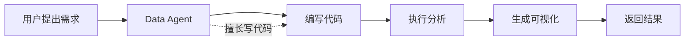
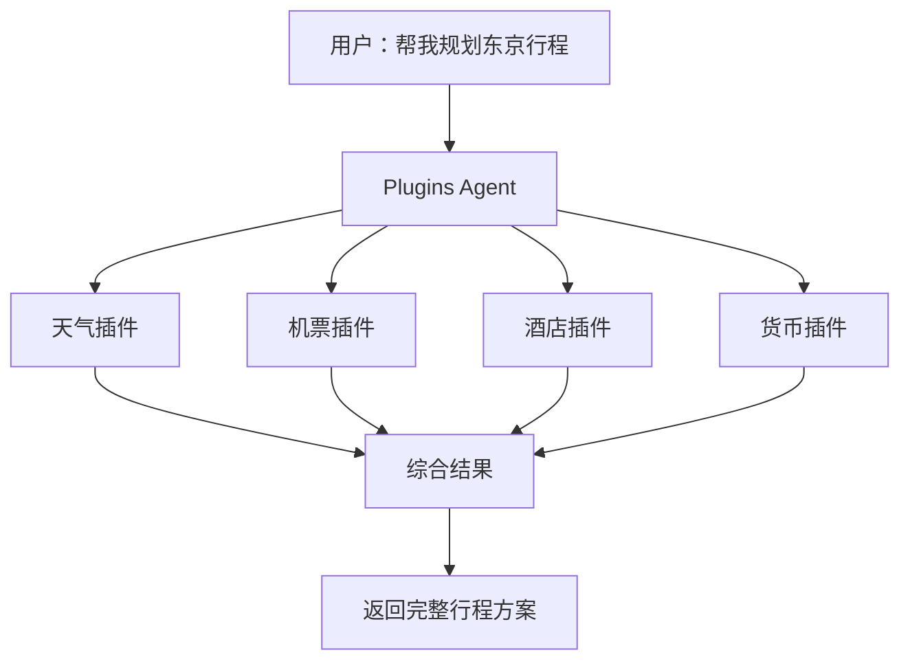
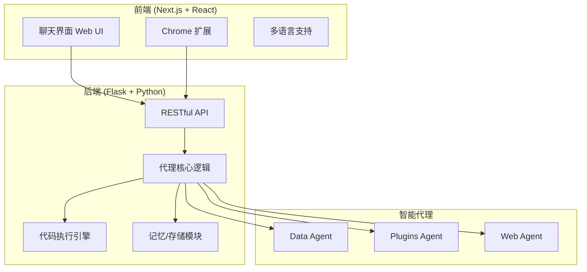

# OpenAgents 是什么？一篇通俗易懂的入门指南

> 如果你听说过 AutoGPT、ChatGPT，也了解了 MetaGPT，那这个同样带"GPT"的名字可能会让你有点混淆——OpenAgents 到底是个啥？

别急，这篇文章就带你彻底搞明白。

---

## 一、从一个痛点说起

现在市面上有大把的 AI 代理（Agent）框架，动不动就能帮你写代码、查资料、自动化办公。

但你有没有发现一个怪现象：

> **这些框架都是给程序员用的。**

普通人想用个 AI 代理来帮忙处理点工作流，点开界面一看——满屏的代码配置、API 密钥、命令行操作……瞬间劝退。

**OpenAgents 就是为了解决这个问题而生的。**

它要做的只有一件事：**让 AI 代理不再是程序员的专属，普通用户也能用得得心应手。**

---

## 二、OpenAgents 到底是什么？

OpenAgents 是一个**开源的语言代理平台**（Open Platform for Language Agents）。

用大白话说就是：**一个让 AI 帮你干活的工具，但界面友好，普通人也能上手。**

它获得了学术界的认可——相关论文发表在 **COLM 2024**（计算语言学顶级会议），目前在 GitHub 上已经收获了 **4.8k Stars**，可见其受欢迎程度。

### 它的核心理念

OpenAgents 的作者们发现了一个行业痛点：

> 现有的语言代理框架，都在追求怎么"构建"代理，却很少关注：
>
> - 普通用户怎么"使用"代理
> - 代理在实际应用中好不好用

所以 OpenAgents 有两个特别的目标：

1. **降低使用门槛**：非技术人员也能轻松使用
2. **注重应用体验**：不仅仅是概念验证，而是真正能用到实际场景中

---

## 三、OpenAgents 能帮你干什么？

这是大家最关心的问题。OpenAgents 里面内置了**三大核心代理**，每个都是干活小能手。

### 1. Data Agent（数据代理）—— 你的数据分析助手

如果你需要处理数据、分析表格、画图表，Data Agent 就是为你准备的。

**它能做什么？**

| 功能 | 描述 |
|------|------|
| 🔍 搜索 | 快速从大量数据中找到你需要的内容 |
| 🛠️ 处理 | 简化数据获取与清洗的流程 |
| 🔄 操控 | 按你的需求修改、整合数据 |
| 📊 可视化 | 直接画出漂亮的图表 |

**使用场景举例**：

- "帮我分析一下这份销售数据，找出增长最快的月份"
- "把这两个表格按姓名合并，然后算一下平均分"
- "画一个折线图展示过去一年的月度收入"



---

### 2. Plugins Agent（插件代理）—— 集成 200+ 工具的智能助手

这是我觉得最酷的功能——**Plugins Agent 内置了 200 多个第三方插件**，相当于一个有超能力的"万能助手"。

**代表性插件：**

| 类别 | 插件例子 | 用途 |
|------|----------|------|
| 🛍️ 购物 | Klarna Shopping | 比价、找商品 |
| ☁️ 天气 | XWeather | 查询天气、预报 |
| 🔬 科学 | Wolfram Alpha | 数学计算、知识问答 |
| ✈️ 旅行 | Klook | 订票、酒店预订 |

**特别之处：组合技！**

Plugins Agent 可以**同时调用多个插件**，就像一个超级助理：

比如你说："帮我规划一下去东京的行程"

它会同时：

- 查天气 🌤️
- 看机票 ✈️
- 搜酒店 🏨
- 换算货币 💰

一次提问，全部搞定。



---

### 3. Web Agent（网页代理）—— 你的私人浏览器助手

这个功能太强大了——**它是一个基于 Chrome 扩展的自动化网页操作代理**。

你可以让它帮你操作网页，就像有一个隐形的人在替你点点点。

**能做什么？**

| 场景 | 示例 |
|------|------|
| 📍 导航 | 告诉它起点和终点，自动帮你规划 Google Maps 路线 |
| 🐦 发推 | 描述内容，自动帮你发 Twitter |
| 📝 填表 | 给它一个 Google Form 链接和要填的信息，自动帮你填写提交 |
| 🛒 网购 | 描述要买的东西，自动帮你搜索、下单 |

**使用方式**：安装 Chrome 扩展，然后用自然语言描述你要做什么，剩下的它来搞定。

---

## 四、技术上是怎么实现的？

如果你对技术感兴趣，可以看看 OpenAgents 的架构设计。

### 整体架构



### 技术栈

| 层级 | 技术 |
|------|------|
| 前端 | Next.js + React + TypeScript |
| 后端 | Flask + Python |
| 部署 | Docker |

### 代码结构

```
OpenAgents/
├── backend/              # Flask 后端
│   ├── api/             # RESTful API 接口
│   ├── app.py           # 主应用
│   ├── memory.py        # 记忆存储
│   └── utils/           # 工具函数
│
├── frontend/            # Next.js 前端
│   ├── components/     # React 组件
│   ├── pages/          # 页面
│   └── webot_extension.zip  # Chrome 扩展
│
└── real_agents/         # 三大代理实现
    ├── data_agent/     # 数据代理
    ├── plugins_agent/  # 插件代理
    └── web_agent/      # 网页代理
```

---

## 五、快速上手体验

### 在线体验

最简单的方式是直接去官方演示网站：**chat.xlang.ai**

不用安装，打开网页就能用。

### 本地部署

如果你想自己部署，Docker 是最简单的方式：

```bash
# 1. 克隆项目
git clone https://github.com/xlang-ai/OpenAgents.git

# 2. 进入目录
cd OpenAgents

# 3. 使用 Docker 启动
docker compose up -d
```

**注意**：如果你想用 GPU 加速，需要安装 Nvidia Container Toolkit。

---

## 六、OpenAgents 适合谁用？

| 人群 | 为什么适合 |
|------|-------------|
| 📊 数据分析师 | Data Agent 帮你写代码、做分析、出图表 |
| 📈 产品经理 | Plugins Agent 帮你查数据、做调研 |
| 🔄 运营人员 | Web Agent 帮你自动化处理重复性网页操作 |
| 🧑‍💻 开发者 | 可以基于 OpenAgents 二次开发自己的代理 |
| 👨‍🏫 AI 爱好者 | 学习多代理系统的最佳开源项目 |

---

## 七、OpenAgents vs 其他框架对比

很多同学会问：OpenAgents、MetaGPT、AutoGPT……到底有什么区别？

一张图告诉你：

| 特性 | OpenAgents | MetaGPT | AutoGPT |
|------|------------|---------|---------|
| **核心理念** | 降低使用门槛，注重应用体验 | 模拟软件公司 SOP 流程 | 自动化问题解决 |
| **代理数量** | 3 个（数据、插件、网页） | 多个（产品经理、架构师等） | 单个通用代理 |
| **易用性** | ⭐⭐⭐⭐⭐ 面向普通用户 | ⭐⭐⭐ 面向开发者 | ⭐⭐ 命令行操作 |
| **插件生态** | 200+ 内置插件 | 无 | 无 |
| **Web 操作** | ✅ 有 Chrome 扩展 | ❌ 无 | ❌ 无 |
| **专注场景** | 日常办公、数据分析 | 软件开发 | 通用任务 |

**简单来说**：

- **MetaGPT**：像一个 AI 软件开发团队，帮你写代码做项目
- **OpenAgents**：像三个 AI 小助手，帮你处理日常工作和生活中的各种任务
- **AutoGPT**：像一个实验性的 AI 探索者，适合极客玩家

---