# OpenAI SDK 深度指南：从第一行代码到生产级应用，全面掌握 AI 开发核心能力

> 大模型时代，会用 OpenAI SDK 几乎已经成了 AI 开发者的基本功。
>
> 但很多人只会最基础的 `chat.completions.create()`，对 Streaming、Function Calling、Structured Outputs、Vision、Embeddings、Responses API 这些高级能力知之甚少，更别提在生产环境中处理超时、限速、重试等工程问题了。
>
> 这篇文章，我们从零开始，把 OpenAI SDK 的核心能力一网打尽，深入但不失实用。

---

## 一、整体架构：OpenAI SDK 能做什么？

在写第一行代码之前，先来看清楚 OpenAI SDK 的整体版图。

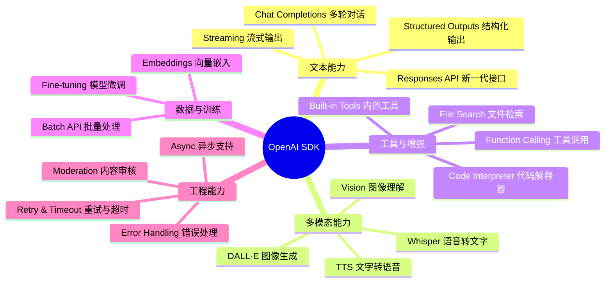

这张图覆盖了 OpenAI SDK 的全部核心能力。本文会逐一拆解，从最基础的对话开始，一直到生产级的工程实践。

---

## 二、安装与初始化：5 分钟跑起来

### 2.1 安装

```bash
pip install openai
```

当前最新版本已是 v1.x，与早期的 v0.x 接口有根本性的不同——v1 引入了同步/异步双客户端，所有 API 都挂载在客户端实例上。

> **注意**：如果你还在用旧的 `openai.ChatCompletion.create()` 写法，是时候升级了。

### 2.2 客户端初始化

```python
from openai import OpenAI

# 方式一：从环境变量自动读取（推荐，避免 key 泄露）
# export OPENAI_API_KEY="sk-xxxx"
client = OpenAI()

# 方式二：显式传入（仅限本地调试）
client = OpenAI(api_key="sk-xxxx")

# 方式三：完整配置（生产环境）
client = OpenAI(
    api_key="sk-xxxx",
    timeout=30.0,           # 请求超时（秒）
    max_retries=3,          # 失败自动重试次数
    base_url="https://api.openai.com/v1",  # 自定义 base URL（可接国内中转）
)
```

**环境变量配置**（推荐写入 `.env` 文件，配合 `python-dotenv` 加载）：

```bash
OPENAI_API_KEY=sk-xxxx
OPENAI_BASE_URL=https://api.openai.com/v1  # 可选
OPENAI_TIMEOUT=30
```

SDK 会自动检测 `OPENAI_API_KEY`、`OPENAI_BASE_URL`、`OPENAI_TIMEOUT` 等环境变量，无需手动传参。

---

## 三、模型速查：2025 年该选哪个？

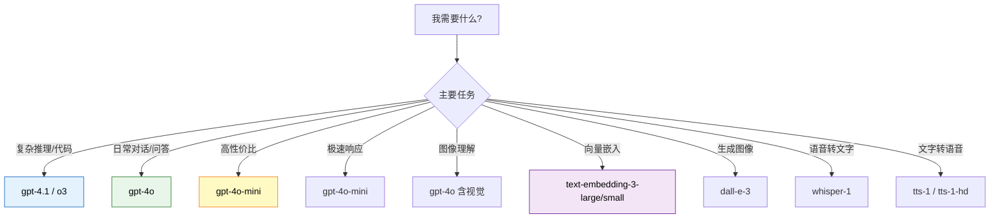

| 模型 | 特点 | 适用场景 |
|------|------|----------|
| `gpt-4.1` | 最强代码和指令跟随 | 复杂任务、代码生成 |
| `gpt-4o` | 速度与质量平衡 | 日常生产级应用 |
| `gpt-4o-mini` | 极低成本 | 高并发、简单任务 |
| `o3` / `o4-mini` | 深度推理 | 数学、逻辑、科学 |
| `text-embedding-3-large` | 高维度嵌入 | 语义搜索、RAG |
| `text-embedding-3-small` | 低成本嵌入 | 轻量语义任务 |
| `dall-e-3` | 高质量图像生成 | 创意设计、内容生成 |
| `whisper-1` | 多语言语音识别 | 语音转文字 |
| `tts-1` / `tts-1-hd` | 语音合成 | 文字转语音 |

---

## 四、Chat Completions：对话能力全解析

Chat Completions 是 OpenAI SDK 最基础、最常用的接口，也是所有上层能力的基础。

### 4.1 基础对话

```python
from openai import OpenAI

client = OpenAI()

response = client.chat.completions.create(
    model="gpt-4o",
    messages=[
        {"role": "system", "content": "你是一个专业的 Python 开发者，回答简洁明了。"},
        {"role": "user", "content": "请解释什么是生成器（Generator）？"},
    ]
)

# 获取回答
print(response.choices[0].message.content)

# 查看 token 用量
print(f"输入 tokens: {response.usage.prompt_tokens}")
print(f"输出 tokens: {response.usage.completion_tokens}")
print(f"总计 tokens: {response.usage.total_tokens}")
```

### 4.2 角色体系：system / user / assistant

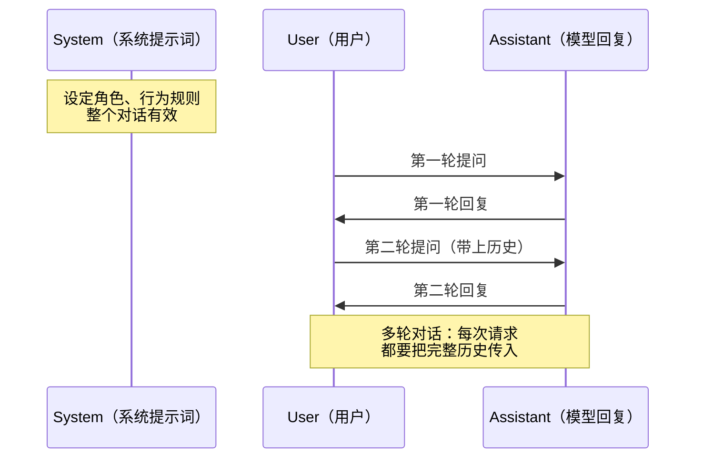

多轮对话的关键：**每次请求都要把完整的对话历史传给 API**。SDK 本身不保存状态（除非用 Responses API）。

```python
# 多轮对话示例
messages = [
    {"role": "system", "content": "你是一个资深技术面试官。"},
]

while True:
    user_input = input("你: ")
    if user_input.lower() in ("退出", "exit", "quit"):
        break

    messages.append({"role": "user", "content": user_input})

    response = client.chat.completions.create(
        model="gpt-4o",
        messages=messages,
    )

    reply = response.choices[0].message.content
    print(f"面试官: {reply}\n")

    # 将模型回复加入历史，供下一轮使用
    messages.append({"role": "assistant", "content": reply})
```

### 4.3 关键参数调优

```python
response = client.chat.completions.create(
    model="gpt-4o",
    messages=[...],

    # 控制随机性：0 最确定，2 最随机（默认 1）
    temperature=0.7,

    # 最大输出 token 数
    max_tokens=2048,

    # 控制重复性：正值惩罚重复 token
    frequency_penalty=0.3,

    # 控制话题多样性：正值鼓励新话题
    presence_penalty=0.1,

    # 核采样（与 temperature 二选一）
    top_p=0.9,

    # 可以让模型在特定 token 处停止
    stop=["###", "END"],

    # 返回多个候选回复
    n=1,
)
```

**参数选择经验**：

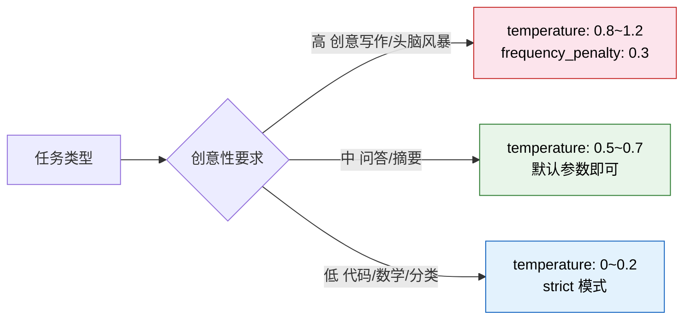

---

## 五、Streaming：让输出像打字机一样流出来

默认情况下，API 会等模型生成完整回复后一次性返回，这会让用户等待很久。Streaming 让内容像打字机一样逐字显示，大幅提升体验。

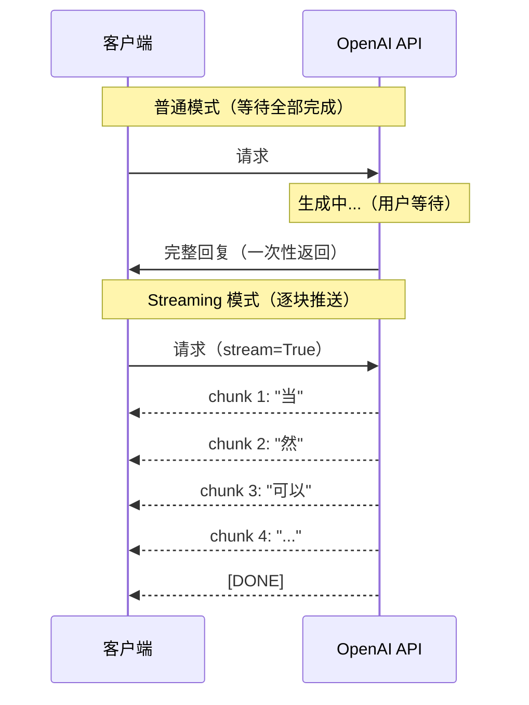

### 5.1 基础 Streaming

```python
stream = client.chat.completions.create(
    model="gpt-4o",
    messages=[{"role": "user", "content": "写一首关于秋天的诗"}],
    stream=True,
)

for chunk in stream:
    delta = chunk.choices[0].delta
    if delta.content:
        print(delta.content, end="", flush=True)

print()  # 换行
```

### 5.2 Streaming 工具方法：stream_to_runner

SDK 提供了更优雅的 `stream` 上下文管理器：

```python
with client.chat.completions.stream(
    model="gpt-4o",
    messages=[{"role": "user", "content": "分析一下 Python 和 Go 的优缺点"}],
) as stream:
    for text in stream.text_stream:
        print(text, end="", flush=True)

    # 流结束后，可获取完整响应
    final_response = stream.get_final_completion()
    print(f"\n\n总 tokens: {final_response.usage.total_tokens}")
```

### 5.3 Streaming + Function Calling

这是进阶用法，边流式输出文字，边接收工具调用结果：

```python
with client.chat.completions.stream(
    model="gpt-4o",
    messages=[{"role": "user", "content": "北京今天天气怎么样？"}],
    tools=[...],  # 工具定义见第七章
) as stream:
    for event in stream:
        if event.type == "content.delta":
            print(event.delta, end="", flush=True)
        elif event.type == "tool_calls.function.arguments.delta":
            # 工具调用参数流式累积
            print(f"[调用工具参数]: {event.arguments_delta}", end="")
```

---

## 六、Structured Outputs：让模型只输出你要的格式

JSON 输出一直是 AI 应用的痛点——模型可能在 JSON 里加注释、漏掉字段、类型不匹配。Structured Outputs 从根本上解决了这个问题。

### 6.1 原理


**约束解码（Constrained Decoding）**：API 在生成每个 token 时，过滤掉所有不符合 Schema 的 token。这是结构级别的保证，不依赖提示词。

### 6.2 使用 Pydantic 的 parse 方法（推荐）

```python
from pydantic import BaseModel
from typing import List, Optional

class Step(BaseModel):
    explanation: str
    expression: str

class MathSolution(BaseModel):
    problem: str
    steps: List[Step]
    final_answer: str
    confidence: float  # 0.0 ~ 1.0

response = client.beta.chat.completions.parse(
    model="gpt-4o",
    messages=[
        {"role": "system", "content": "你是一个数学老师，请分步解答问题。"},
        {"role": "user", "content": "解方程：2x² + 5x - 3 = 0"},
    ],
    response_format=MathSolution,  # 直接传 Pydantic 类
)

# 直接得到类型安全的 Python 对象
solution = response.choices[0].message.parsed
print(f"问题: {solution.problem}")
for i, step in enumerate(solution.steps, 1):
    print(f"步骤 {i}: {step.explanation}")
    print(f"       {step.expression}")
print(f"答案: {solution.final_answer}")
print(f"置信度: {solution.confidence:.0%}")
```

### 6.3 实战：信息抽取

```python
from pydantic import BaseModel, Field
from typing import List, Optional
from enum import Enum

class Sentiment(str, Enum):
    POSITIVE = "positive"
    NEGATIVE = "negative"
    NEUTRAL = "neutral"

class ReviewAnalysis(BaseModel):
    product_name: str = Field(description="产品名称")
    sentiment: Sentiment = Field(description="整体情感倾向")
    pros: List[str] = Field(description="产品优点列表")
    cons: List[str] = Field(description="产品缺点列表")
    rating_out_of_5: int = Field(description="预测评分 1-5", ge=1, le=5)
    summary: str = Field(description="一句话总结")

review_text = """
刚用了两周这款蓝牙耳机，音质确实很棒，低音浑厚有力，
佩戴也很舒适。但续航只有4小时，而且配对有时候不太稳定，
价格倒是合理，整体还是值得购买的。
"""

response = client.beta.chat.completions.parse(
    model="gpt-4o",
    messages=[
        {"role": "system", "content": "你是专业的商品评论分析师，请分析以下评论。"},
        {"role": "user", "content": review_text},
    ],
    response_format=ReviewAnalysis,
)

result = response.choices[0].message.parsed
print(f"产品: {result.product_name}")
print(f"情感: {result.sentiment.value}")
print(f"优点: {', '.join(result.pros)}")
print(f"缺点: {', '.join(result.cons)}")
print(f"评分: {'⭐' * result.rating_out_of_5}")
print(f"总结: {result.summary}")
```

### 6.4 低级接口：手动传 JSON Schema

如果不想依赖 Pydantic，可以手动传 JSON Schema：

```python
response = client.chat.completions.create(
    model="gpt-4o",
    messages=[...],
    response_format={
        "type": "json_schema",
        "json_schema": {
            "name": "review_analysis",
            "strict": True,
            "schema": {
                "type": "object",
                "properties": {
                    "sentiment": {"type": "string", "enum": ["positive", "negative", "neutral"]},
                    "rating": {"type": "integer", "minimum": 1, "maximum": 5},
                },
                "required": ["sentiment", "rating"],
                "additionalProperties": False,
            }
        }
    }
)
```

**结论**：能用 Pydantic 就用 `parse()`，省去手写 Schema 和手动 JSON 解析的麻烦。

---

## 七、Function Calling：让模型调用真实世界

Function Calling（现在官方叫 Tool Calling）是 OpenAI SDK 最强大的能力之一。它允许模型在回答时"决定"调用你提供的函数，获取实时数据或执行操作。

### 7.1 工作原理

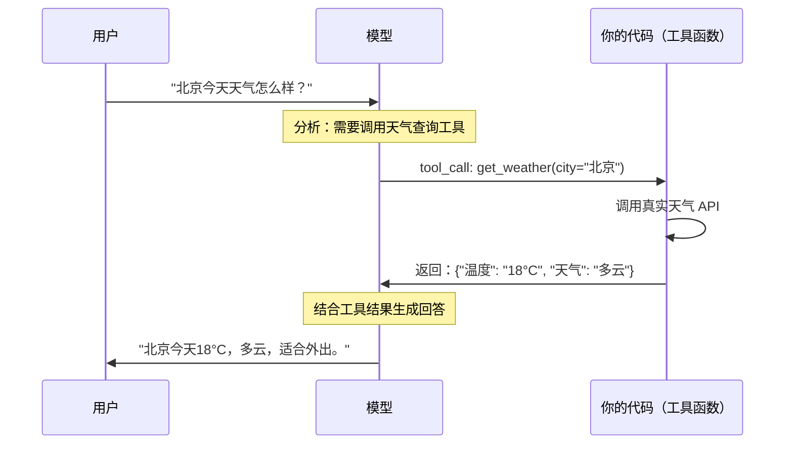

### 7.2 定义工具

```python
tools = [
    {
        "type": "function",
        "function": {
            "name": "get_weather",
            "description": "查询指定城市的实时天气。返回温度、天气状况、湿度等信息。",
            "parameters": {
                "type": "object",
                "properties": {
                    "city": {
                        "type": "string",
                        "description": "城市名称，如'北京'、'上海'",
                    },
                    "unit": {
                        "type": "string",
                        "enum": ["celsius", "fahrenheit"],
                        "description": "温度单位，默认摄氏度",
                    },
                },
                "required": ["city"],
                "additionalProperties": False,
            },
            "strict": True,  # 开启严格模式，保证参数结构
        },
    },
    {
        "type": "function",
        "function": {
            "name": "search_database",
            "description": "在公司数据库中搜索订单信息",
            "parameters": {
                "type": "object",
                "properties": {
                    "order_id": {"type": "string", "description": "订单号"},
                    "customer_name": {"type": "string", "description": "客户姓名"},
                },
                "required": [],
                "additionalProperties": False,
            },
        },
    },
]
```

### 7.3 完整的工具调用循环

```python
import json

# 模拟工具函数
def get_weather(city: str, unit: str = "celsius") -> dict:
    # 实际中调用真实天气 API
    return {"city": city, "temperature": "18°C", "condition": "多云", "humidity": "65%"}

def search_database(order_id: str = None, customer_name: str = None) -> dict:
    # 实际中查询数据库
    return {"order_id": "ORD-001", "status": "已发货", "estimated_delivery": "明天"}

# 工具映射表
TOOL_MAP = {
    "get_weather": get_weather,
    "search_database": search_database,
}

def run_conversation(user_message: str) -> str:
    messages = [{"role": "user", "content": user_message}]

    while True:
        response = client.chat.completions.create(
            model="gpt-4o",
            messages=messages,
            tools=tools,
            tool_choice="auto",  # auto: 模型自己决定是否调用工具
        )

        message = response.choices[0].message

        # 如果模型直接回答，不需要工具调用
        if response.choices[0].finish_reason == "stop":
            return message.content

        # 如果需要工具调用
        if response.choices[0].finish_reason == "tool_calls":
            # 把模型消息加入历史
            messages.append(message)

            # 执行每一个工具调用
            for tool_call in message.tool_calls:
                func_name = tool_call.function.name
                func_args = json.loads(tool_call.function.arguments)

                print(f"[调用工具] {func_name}({func_args})")

                # 执行工具
                result = TOOL_MAP[func_name](**func_args)

                # 把工具结果加入历史
                messages.append({
                    "role": "tool",
                    "tool_call_id": tool_call.id,
                    "content": json.dumps(result, ensure_ascii=False),
                })

            # 继续循环，让模型基于工具结果生成最终回答

# 测试
answer = run_conversation("北京今天天气怎么样？顺便帮我查一下订单 ORD-001")
print(f"最终回答: {answer}")
```

### 7.4 并行工具调用

当用户问题需要调用多个工具时，模型会同时发出多个 tool_calls，你可以并行执行，效率更高：

```python
import asyncio
import json

async def execute_tool_async(tool_call) -> dict:
    func_name = tool_call.function.name
    func_args = json.loads(tool_call.function.arguments)
    # 实际中可以是异步的 HTTP 请求、DB 查询等
    result = TOOL_MAP[func_name](**func_args)
    return {"tool_call_id": tool_call.id, "result": result}

async def run_with_parallel_tools(user_message: str) -> str:
    messages = [{"role": "user", "content": user_message}]

    response = client.chat.completions.create(
        model="gpt-4o",
        messages=messages,
        tools=tools,
        parallel_tool_calls=True,  # 允许并行调用（默认开启）
    )

    message = response.choices[0].message
    if not message.tool_calls:
        return message.content

    messages.append(message)

    # 并行执行所有工具调用
    tasks = [execute_tool_async(tc) for tc in message.tool_calls]
    results = await asyncio.gather(*tasks)

    for r in results:
        messages.append({
            "role": "tool",
            "tool_call_id": r["tool_call_id"],
            "content": json.dumps(r["result"], ensure_ascii=False),
        })

    # 获取最终回答
    final = client.chat.completions.create(
        model="gpt-4o",
        messages=messages,
    )
    return final.choices[0].message.content
```

---

## 八、Vision：让模型看懂图片

GPT-4o 原生支持图像输入，你可以传入 URL 或 base64 编码的图片。

### 8.1 图片 URL 输入

```python
response = client.chat.completions.create(
    model="gpt-4o",
    messages=[
        {
            "role": "user",
            "content": [
                {
                    "type": "text",
                    "text": "请详细描述这张图片中的内容，并指出图中的文字。",
                },
                {
                    "type": "image_url",
                    "image_url": {
                        "url": "https://example.com/diagram.png",
                        "detail": "high",  # low/high/auto
                    },
                },
            ],
        }
    ],
)

print(response.choices[0].message.content)
```

### 8.2 本地图片（base64 编码）

```python
import base64
from pathlib import Path

def encode_image(image_path: str) -> str:
    return base64.standard_b64encode(Path(image_path).read_bytes()).decode("utf-8")

image_base64 = encode_image("./screenshot.png")

response = client.chat.completions.create(
    model="gpt-4o",
    messages=[
        {
            "role": "user",
            "content": [
                {"type": "text", "text": "这张截图里有什么错误信息？请分析原因。"},
                {
                    "type": "image_url",
                    "image_url": {
                        "url": f"data:image/png;base64,{image_base64}",
                    },
                },
            ],
        }
    ],
)
```

### 8.3 多图片对比分析

```python
response = client.chat.completions.create(
    model="gpt-4o",
    messages=[
        {
            "role": "user",
            "content": [
                {"type": "text", "text": "对比这两张 UI 设计图，找出它们的差异："},
                {"type": "image_url", "image_url": {"url": "https://example.com/design_v1.png"}},
                {"type": "image_url", "image_url": {"url": "https://example.com/design_v2.png"}},
            ],
        }
    ],
)
```

**detail 参数说明**：

| 值 | 说明 | token 消耗 |
|----|------|------------|
| `low` | 低分辨率，快速处理 | ~85 tokens |
| `high` | 高分辨率，精细分析 | 随图片大小增加 |
| `auto` | SDK 自动决定（默认） | 动态调整 |

---

## 九、Embeddings：向量化文本，构建语义搜索

Embeddings 是将文本转化为高维向量的能力，是构建 RAG（检索增强生成）、语义搜索、推荐系统的基础。

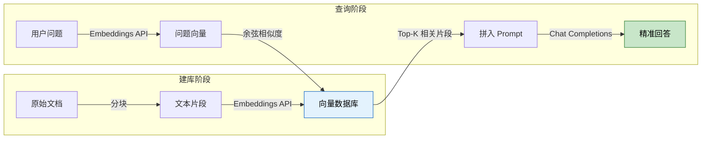

### 9.1 基础用法

```python
# 单文本向量化
response = client.embeddings.create(
    model="text-embedding-3-small",  # 或 text-embedding-3-large
    input="Python 是一种解释型高级编程语言",
)

vector = response.data[0].embedding
print(f"向量维度: {len(vector)}")  # text-embedding-3-small: 1536 维
```

### 9.2 批量向量化

```python
texts = [
    "Python 是一种解释型高级编程语言",
    "Go 是谷歌开发的静态类型编译语言",
    "Rust 强调内存安全和高性能",
    "JavaScript 是 Web 前端的核心语言",
]

response = client.embeddings.create(
    model="text-embedding-3-small",
    input=texts,  # 直接传列表，批量处理
    encoding_format="float",  # 或 "base64"（节省带宽）
)

vectors = [item.embedding for item in response.data]
print(f"生成了 {len(vectors)} 个向量，每个 {len(vectors[0])} 维")
```

### 9.3 简单语义搜索实现

```python
import numpy as np
from typing import List, Tuple

def cosine_similarity(a: List[float], b: List[float]) -> float:
    a, b = np.array(a), np.array(b)
    return float(np.dot(a, b) / (np.linalg.norm(a) * np.linalg.norm(b)))

def semantic_search(
    query: str,
    documents: List[str],
    top_k: int = 3
) -> List[Tuple[str, float]]:
    # 向量化查询和所有文档
    all_texts = [query] + documents
    response = client.embeddings.create(
        model="text-embedding-3-small",
        input=all_texts,
    )

    query_vec = response.data[0].embedding
    doc_vecs = [item.embedding for item in response.data[1:]]

    # 计算相似度并排序
    scored = [
        (doc, cosine_similarity(query_vec, vec))
        for doc, vec in zip(documents, doc_vecs)
    ]
    return sorted(scored, key=lambda x: x[1], reverse=True)[:top_k]

# 测试
docs = [
    "Python 是一种解释型高级编程语言，强调代码可读性",
    "机器学习是人工智能的一个子领域",
    "深度学习使用神经网络处理复杂任务",
    "向量数据库用于存储和检索高维向量",
    "RAG 结合了检索和生成的优势",
]

results = semantic_search("什么是机器学习？", docs, top_k=2)
for text, score in results:
    print(f"相似度 {score:.4f}: {text}")
```

### 9.4 降维：节省存储

`text-embedding-3-*` 支持输出指定维度（通过截断降维，同时保持大部分语义信息）：

```python
# 从 1536 维降到 256 维，节省 6x 存储空间
response = client.embeddings.create(
    model="text-embedding-3-small",
    input="这是一段文本",
    dimensions=256,  # 指定输出维度
)
print(len(response.data[0].embedding))  # 256
```

---

## 十、语音能力：TTS 与 Whisper

### 10.1 文字转语音（TTS）

```python
from pathlib import Path

# 生成语音文件
response = client.audio.speech.create(
    model="tts-1",           # tts-1（标准）或 tts-1-hd（高清）
    voice="alloy",           # alloy/echo/fable/onyx/nova/shimmer
    input="欢迎使用 OpenAI 文字转语音服务，这是一段示例音频。",
    response_format="mp3",   # mp3/opus/aac/flac/wav/pcm
    speed=1.0,               # 语速，0.25 ~ 4.0
)

# 保存到文件
Path("output.mp3").write_bytes(response.content)
print("音频已保存到 output.mp3")
```

六种声音对比：

| 声音 | 风格 | 适合场景 |
|------|------|----------|
| `alloy` | 中性，平衡 | 通用场景 |
| `echo` | 男声，沉稳 | 新闻播报 |
| `fable` | 英式，表现力强 | 故事朗读 |
| `onyx` | 男声，深沉 | 正式场合 |
| `nova` | 女声，活泼 | 助手/客服 |
| `shimmer` | 女声，温柔 | 教育/引导 |

### 10.2 流式 TTS（降低首字节延迟）

```python
import io

with client.audio.speech.with_streaming_response.create(
    model="tts-1",
    voice="nova",
    input="这段文字会被流式地转换为语音。",
) as response:
    # 可以边接收边播放，而不是等全部下载完
    audio_data = io.BytesIO()
    for chunk in response.iter_bytes(chunk_size=4096):
        audio_data.write(chunk)
```

### 10.3 语音转文字（Whisper）

```python
from pathlib import Path

# 从文件转录
with open("interview.mp3", "rb") as audio_file:
    transcription = client.audio.transcriptions.create(
        model="whisper-1",
        file=audio_file,
        language="zh",              # 指定语言，提高准确率
        response_format="verbose_json",  # 获取时间戳等详细信息
    )

print(transcription.text)

# 翻译成英文（自动识别源语言）
with open("chinese_speech.mp3", "rb") as audio_file:
    translation = client.audio.translations.create(
        model="whisper-1",
        file=audio_file,
    )
print(translation.text)  # 英文翻译
```

**Whisper 支持的音频格式**：mp3、mp4、mpeg、mpga、m4a、wav、webm

---

## 十一、图像生成：DALL·E 3

```python
# 生成图像
response = client.images.generate(
    model="dall-e-3",
    prompt="一只穿着宇航服的橘猫，漂浮在星空中，写实风格，4K 高清",
    size="1024x1024",       # 1024x1024 / 1792x1024 / 1024x1792
    quality="hd",           # standard / hd
    n=1,                    # DALL·E 3 只支持 n=1
    style="vivid",          # vivid（生动）/ natural（自然）
)

image_url = response.data[0].url
revised_prompt = response.data[0].revised_prompt  # 模型修改后的提示词
print(f"图片 URL: {image_url}")
print(f"修订后的提示词: {revised_prompt}")

# 下载并保存图片
import httpx
from pathlib import Path

image_data = httpx.get(image_url).content
Path("generated.png").write_bytes(image_data)
```

```python
# 图片变体（基于已有图片生成变体）
with open("original.png", "rb") as img:
    response = client.images.create_variation(
        model="dall-e-2",   # 变体功能仅 DALL·E 2 支持
        image=img,
        n=2,
        size="1024x1024",
    )

for i, img_data in enumerate(response.data):
    print(f"变体 {i+1}: {img_data.url}")
```

---

## 十二、Responses API：新一代接口（2025 新增）

2025 年初，OpenAI 推出了 **Responses API**，定位为 Chat Completions API 的升级版。它的核心优势是：

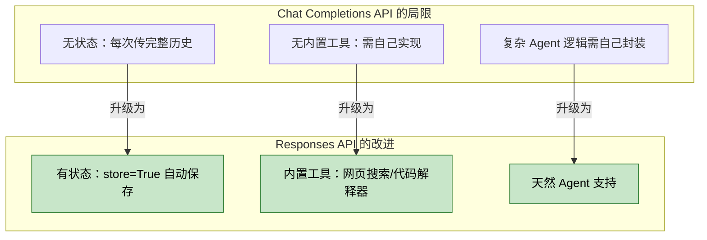

### 12.1 基础使用

```python
# Responses API 的调用方式
response = client.responses.create(
    model="gpt-4o",
    input="请介绍一下量子计算的基本原理",
    # store=True  # 服务端保存此次对话（默认 False）
)

print(response.output_text)
print(f"Response ID: {response.id}")  # 用于多轮对话
```

### 12.2 有状态多轮对话（无需传历史）

```python
# 第一轮
r1 = client.responses.create(
    model="gpt-4o",
    input="我叫小明，今年 25 岁。",
    store=True,
)
print(r1.output_text)
print(f"r1.id = {r1.id}")

# 第二轮：只需传 previous_response_id，无需传完整历史
r2 = client.responses.create(
    model="gpt-4o",
    input="我的名字和年龄是什么？",
    previous_response_id=r1.id,   # 引用上一轮
    store=True,
)
print(r2.output_text)
# 输出：你的名字是小明，今年 25 岁。
```

这样，历史记录由 OpenAI 服务端管理，你的应用不用再维护消息列表。

### 12.3 内置工具：网页搜索

```python
# 让模型实时搜索互联网
response = client.responses.create(
    model="gpt-4o",
    input="2025 年 4 月最新的 AI 大模型排行榜是什么？",
    tools=[{"type": "web_search_preview"}],  # 内置网页搜索工具
)

print(response.output_text)
# 模型会自动搜索并整合最新信息
```

### 12.4 内置工具：代码解释器

```python
response = client.responses.create(
    model="gpt-4o",
    input="帮我分析这段数据的统计特征：[1, 2, 3, 4, 5, 100, 2, 3, 4, 5]",
    tools=[{"type": "code_interpreter", "container": {"type": "auto"}}],
)

print(response.output_text)
# 模型会运行 Python 代码计算均值、中位数、标准差等
```

### 12.5 Chat Completions vs Responses API 对比

| 特性 | Chat Completions | Responses API |
|------|-----------------|---------------|
| 状态管理 | 客户端负责 | 服务端可选（store=True） |
| 内置工具 | 无 | 网页搜索、代码解释器、文件检索 |
| 消息格式 | `messages` 列表 | `input` 字符串或列表 |
| 多轮关联 | 每次传完整历史 | `previous_response_id` |
| 成熟度 | 稳定，生产推荐 | 较新，持续迭代 |
| 适合场景 | 大多数场景 | Agent、工具调用密集型场景 |

---

## 十三、Batch API：大批量任务省 50% 费用

当你需要处理大量独立任务（不需要实时响应）时，Batch API 提供 **50% 折扣**，代价是最长 24 小时处理时间。

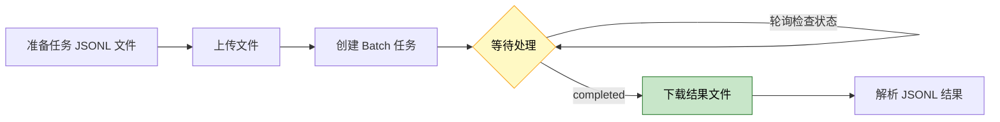

```python
import json
from pathlib import Path

# 第一步：准备任务文件（JSONL 格式，每行一个任务）
tasks = []
texts_to_analyze = [
    "这个产品非常好用！",
    "质量太差了，非常失望。",
    "一般般，没什么特别的。",
    # ... 可以是成千上万条
]

for i, text in enumerate(texts_to_analyze):
    tasks.append({
        "custom_id": f"task-{i}",
        "method": "POST",
        "url": "/v1/chat/completions",
        "body": {
            "model": "gpt-4o-mini",
            "messages": [
                {"role": "system", "content": "判断评论的情感：positive/negative/neutral"},
                {"role": "user", "content": text},
            ],
            "max_tokens": 10,
        }
    })

# 写入 JSONL 文件
with open("batch_tasks.jsonl", "w", encoding="utf-8") as f:
    for task in tasks:
        f.write(json.dumps(task, ensure_ascii=False) + "\n")

# 第二步：上传文件
with open("batch_tasks.jsonl", "rb") as f:
    uploaded = client.files.create(file=f, purpose="batch")
print(f"文件上传成功: {uploaded.id}")

# 第三步：创建 Batch 任务
batch = client.batches.create(
    input_file_id=uploaded.id,
    endpoint="/v1/chat/completions",
    completion_window="24h",
)
print(f"Batch 任务创建: {batch.id}，状态: {batch.status}")

# 第四步：轮询检查状态
import time

while True:
    batch = client.batches.retrieve(batch.id)
    print(f"状态: {batch.status} | 完成: {batch.request_counts.completed}/{batch.request_counts.total}")
    if batch.status in ("completed", "failed", "cancelled"):
        break
    time.sleep(60)  # 每分钟检查一次

# 第五步：下载结果
if batch.status == "completed":
    result_content = client.files.content(batch.output_file_id)
    for line in result_content.text.strip().split("\n"):
        result = json.loads(line)
        task_id = result["custom_id"]
        reply = result["response"]["body"]["choices"][0]["message"]["content"]
        print(f"{task_id}: {reply}")
```

---

## 十四、异步客户端：高并发场景必备

生产环境中，你的服务可能同时处理数百个请求。同步客户端会阻塞事件循环，异步客户端才是正解。

```python
import asyncio
from openai import AsyncOpenAI

async_client = AsyncOpenAI()

async def analyze_text(text: str, task_id: int) -> dict:
    response = await async_client.chat.completions.create(
        model="gpt-4o-mini",
        messages=[
            {"role": "system", "content": "判断文本情感，回复 positive/negative/neutral"},
            {"role": "user", "content": text},
        ],
        max_tokens=10,
    )
    return {
        "task_id": task_id,
        "text": text,
        "sentiment": response.choices[0].message.content.strip(),
    }

async def main():
    texts = [
        "今天天气真好！",
        "这道题太难了。",
        "随便，都行。",
        "新版本功能太棒了！",
        "服务太慢，等了好久。",
    ]

    # 并发执行所有任务
    tasks = [analyze_text(text, i) for i, text in enumerate(texts)]
    results = await asyncio.gather(*tasks)

    for r in results:
        print(f"[{r['task_id']}] {r['sentiment']}: {r['text']}")

asyncio.run(main())
```

**同步 vs 异步性能对比（5 个请求，每个约 1 秒）**：

```mermaid
gantt
    title 同步 vs 异步执行时间
    dateFormat  ss
    axisFormat  %Ss

    section 同步（串行）
    请求1 :a1, 00, 1s
    请求2 :a2, after a1, 1s
    请求3 :a3, after a2, 1s
    请求4 :a4, after a3, 1s
    请求5 :a5, after a4, 1s

    section 异步（并发）
    请求1 :b1, 00, 1s
    请求2 :b2, 00, 1s
    请求3 :b3, 00, 1s
    请求4 :b4, 00, 1s
    请求5 :b5, 00, 1s
```

同步：约 5 秒。异步：约 1 秒。并发量越大，差距越显著。

---

## 十五、错误处理与生产级健壮性

### 15.1 异常类型

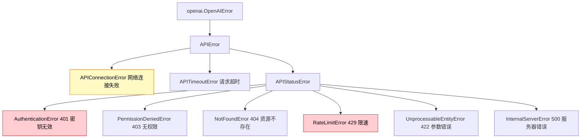

### 15.2 完整错误处理

```python
import openai
import time
import logging

logger = logging.getLogger(__name__)

def call_with_retry(
    func,
    *args,
    max_retries: int = 3,
    base_delay: float = 1.0,
    **kwargs,
):
    """带指数退避重试的 OpenAI API 调用封装"""
    last_error = None

    for attempt in range(max_retries + 1):
        try:
            return func(*args, **kwargs)

        except openai.RateLimitError as e:
            # 429 限速：指数退避重试
            wait_time = base_delay * (2 ** attempt)
            logger.warning(f"触发限速，{wait_time:.1f}s 后重试 (尝试 {attempt+1}/{max_retries})")
            last_error = e
            if attempt < max_retries:
                time.sleep(wait_time)

        except openai.APIConnectionError as e:
            # 网络问题：重试
            logger.warning(f"网络连接失败，重试中 ({attempt+1}/{max_retries}): {e}")
            last_error = e
            if attempt < max_retries:
                time.sleep(base_delay)

        except openai.APITimeoutError as e:
            # 超时：重试
            logger.warning(f"请求超时，重试中 ({attempt+1}/{max_retries})")
            last_error = e
            if attempt < max_retries:
                time.sleep(base_delay)

        except openai.InternalServerError as e:
            # 500 服务器错误：重试
            logger.error(f"OpenAI 服务器错误 ({attempt+1}/{max_retries}): {e}")
            last_error = e
            if attempt < max_retries:
                time.sleep(base_delay * 2)

        except openai.AuthenticationError as e:
            # 认证失败：不重试，直接抛出
            logger.error("API Key 无效或已过期，请检查配置")
            raise

        except openai.BadRequestError as e:
            # 请求参数错误：不重试，直接抛出
            logger.error(f"请求参数错误: {e}")
            raise

    raise last_error

# 使用示例
try:
    response = call_with_retry(
        client.chat.completions.create,
        model="gpt-4o",
        messages=[{"role": "user", "content": "Hello"}],
    )
    print(response.choices[0].message.content)
except openai.RateLimitError:
    print("达到速率限制，请稍后再试")
except openai.OpenAIError as e:
    print(f"API 调用失败: {e}")
```

### 15.3 SDK 内置重试（推荐）

其实 SDK 自己也支持自动重试，在初始化时配置即可：

```python
# SDK 内置重试：自动处理 429、500、503、504
client = OpenAI(
    max_retries=3,    # 最多重试 3 次
    timeout=30.0,     # 单次请求超时 30 秒
)

# 也可以用 httpx.Timeout 精细控制
import httpx
client = OpenAI(
    timeout=httpx.Timeout(
        connect=5.0,    # 建立连接超时
        read=30.0,      # 读取数据超时
        write=10.0,     # 写入数据超时
        pool=5.0,       # 连接池等待超时
    )
)
```

### 15.4 内容审核（Moderation）

发给模型之前，先审核用户输入，过滤违规内容：

```python
def check_content(text: str) -> bool:
    """返回 True 表示内容安全，False 表示需要拦截"""
    response = client.moderations.create(
        input=text,
        model="omni-moderation-latest",
    )
    result = response.results[0]

    if result.flagged:
        categories = {k: v for k, v in result.categories.__dict__.items() if v}
        print(f"⚠️  内容违规，触发类别: {list(categories.keys())}")
        return False

    return True

# 使用
user_input = "用户输入的内容..."
if check_content(user_input):
    # 正常处理
    response = client.chat.completions.create(...)
else:
    # 拒绝响应
    print("您的输入包含不当内容，请重新输入。")
```

---

## 十六、完整项目示例：智能客服机器人

把前面所有知识整合成一个完整的项目：一个支持流式输出、工具调用、多轮对话的智能客服机器人。

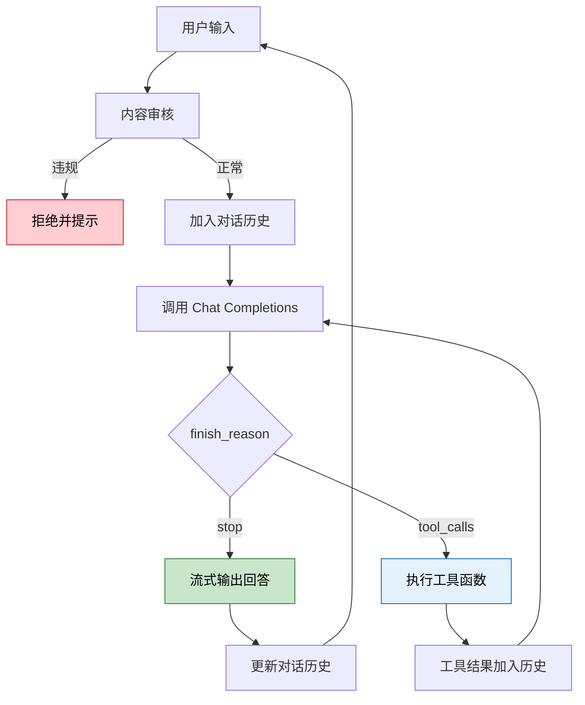

```python
import json
from typing import List, Dict

class CustomerServiceBot:
    def __init__(self):
        self.client = OpenAI(max_retries=3, timeout=30.0)
        self.history: List[Dict] = []
        self.system_prompt = """你是一家科技公司的智能客服助手，名叫小智。
你会：
1. 热情礼貌地回答用户问题
2. 查询订单信息（使用 check_order 工具）
3. 检查产品库存（使用 check_stock 工具）
4. 对复杂问题升级给人工客服
遇到不确定的问题，诚实告知并提供人工客服选项。"""
        self.tools = [
            {
                "type": "function",
                "function": {
                    "name": "check_order",
                    "description": "查询订单状态和物流信息",
                    "parameters": {
                        "type": "object",
                        "properties": {
                            "order_id": {"type": "string", "description": "订单号"},
                        },
                        "required": ["order_id"],
                        "additionalProperties": False,
                    },
                    "strict": True,
                },
            },
            {
                "type": "function",
                "function": {
                    "name": "check_stock",
                    "description": "查询商品库存",
                    "parameters": {
                        "type": "object",
                        "properties": {
                            "product_name": {"type": "string", "description": "商品名称"},
                        },
                        "required": ["product_name"],
                        "additionalProperties": False,
                    },
                    "strict": True,
                },
            },
        ]

    def _check_order(self, order_id: str) -> dict:
        # 模拟数据库查询
        orders = {
            "ORD-001": {"status": "已发货", "tracking": "SF1234567890", "eta": "明天到达"},
            "ORD-002": {"status": "处理中", "tracking": None, "eta": "预计2天后发货"},
        }
        return orders.get(order_id, {"error": f"未找到订单 {order_id}"})

    def _check_stock(self, product_name: str) -> dict:
        # 模拟库存查询
        stocks = {
            "蓝牙耳机": {"available": True, "quantity": 128, "price": "¥299"},
            "充电宝": {"available": False, "quantity": 0, "price": "¥99"},
        }
        for name, info in stocks.items():
            if name in product_name or product_name in name:
                return info
        return {"available": False, "quantity": 0, "note": "商品未找到"}

    def _execute_tool(self, tool_call) -> str:
        name = tool_call.function.name
        args = json.loads(tool_call.function.arguments)

        if name == "check_order":
            result = self._check_order(**args)
        elif name == "check_stock":
            result = self._check_stock(**

```python
# ❌ 忘记关闭，可能泄露资源
client = OpenAI()

# ✅ 用上下文管理器（尤其在短生命周期脚本中）
with OpenAI() as client:
    response = client.chat.completions.create(...)
```

**坑 2：Streaming 时不检查 `delta.content` 是否为 None**

```python
# ❌ 可能报 AttributeError
for chunk in stream:
    print(chunk.choices[0].delta.content, end="")

# ✅ 先检查
for chunk in stream:
    content = chunk.choices[0].delta.content
    if content:
        print(content, end="")
```

**坑 3：多轮对话忘记把 assistant 回复加入历史**

```python
# ❌ 每次对话都相互独立
response = client.chat.completions.create(model="gpt-4o", messages=messages)
# 忘记把回复加入 messages！

# ✅ 正确做法
response = client.chat.completions.create(model="gpt-4o", messages=messages)
messages.append(response.choices[0].message)
```

**坑 4：Structured Outputs 的模型限制**

```python
# ❌ 旧模型不支持 Structured Outputs
client.beta.chat.completions.parse(model="gpt-3.5-turbo", ...)

# ✅ 必须用支持的模型
client.beta.chat.completions.parse(model="gpt-4o", ...)  # gpt-4o-2024-08-06 及以后
```

**坑 5：Function Calling 忘记处理 tool_calls 为 None 的情况**

```python
# ❌ 如果模型决定不调用工具，message.tool_calls 为 None，会崩溃
for tc in message.tool_calls:
    ...

# ✅ 先判断
if message.tool_calls:
    for tc in message.tool_calls:
        ...
```

---

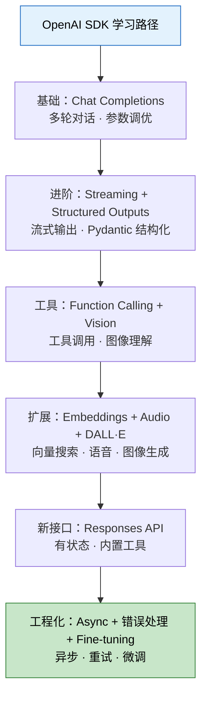

OpenAI SDK 是一套精心设计的工具集。掌握它不只是会调用 API，更是要理解每个能力的适用场景：

- **Chat Completions** — 99% 场景的首选，成熟稳定
- **Streaming** — 凡是面向用户的场景都应该用
- **Structured Outputs** — 需要 JSON 输出时的唯一正解
- **Function Calling** — 连接 AI 与真实世界的桥梁
- **Embeddings** — 语义搜索和 RAG 的基石
- **Responses API** — Agent 和工具密集型场景的新选择
- **Batch API** — 离线大批量任务，省钱利器
- **AsyncOpenAI** — 高并发服务必须使用

AI 应用开发的时代已经来临，掌握这些工具，就是掌握了下一个十年的核心生产力。

---