# 压缩算法全景指南：从ZIP到AI，万字读懂数据压缩的现状与未来

> **导语**：你手机里的照片为什么能存几千张？你看的4K视频为什么能流畅播放？你微信聊天为什么能秒发图片？这一切的背后，都有一个共同的技术在支撑——**压缩算法**。本文将从最基础的概念开始，带你全面看懂压缩算法的现在与未来。

---

## 一、什么是压缩？为什么我们需要压缩？

### 1.1 一个直观的例子

假设你要给朋友发一段文字：

```
原文：AAAAAAAAAABBBBBCCCCCDDDD
长度：26个字符
```

如果每个字符占1字节，这段文字需要**26字节**。但仔细观察你会发现，里面有很多**重复内容**。我们能不能用更短的方式表达同样的信息？

**压缩后的表达**：

```
压缩：10A5B5C4D
长度：8个字符（约10字节）
```

压缩率：**26 → 10，节省了约60%的空间！**

这就是压缩的本质：**用更少的比特，表达同样的信息。**

### 1.2 压缩的数学本质

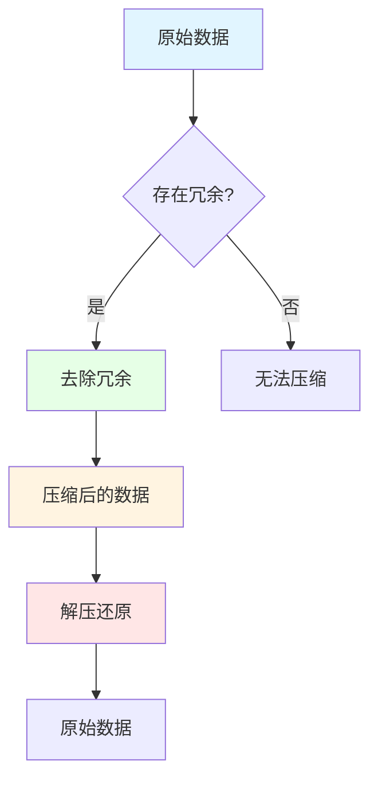

**信息论之父香农**在1948年提出了**信息熵**的概念，从数学上证明了：

> **任何数据都存在一个理论上的最小压缩极限，这个极限由数据的信息熵决定。**

简单说：数据越有规律、越重复，压缩率越高；数据越随机、越混乱，压缩率越低。

### 1.3 我们每天在用压缩，你知道吗？

| 场景 | 使用的压缩技术 | 压缩率 |
|------|--------------|--------|
| **微信发图片** | JPEG/HEIC | 原图的5%-20% |
| **在线听音乐** | MP3/AAC | 原音频的10%-15% |
| **看B站视频** | H.264/H.265/AV1 | 原视频的1%-5% |
| **下载ZIP文件** | DEFLATE（LZ77+霍夫曼） | 30%-70% |
| **手机拍照存储** | HEIF/HEIC | 比JPEG节省50% |
| **浏览网页** | GZIP/Brotli压缩 | 60%-80% |
| **玩云游戏** | 实时视频编码 | 原画面的2%-5% |

**没有压缩，现代数字生活将不复存在。**

---

## 二、压缩算法的分类体系

### 2.1 两大基本类型

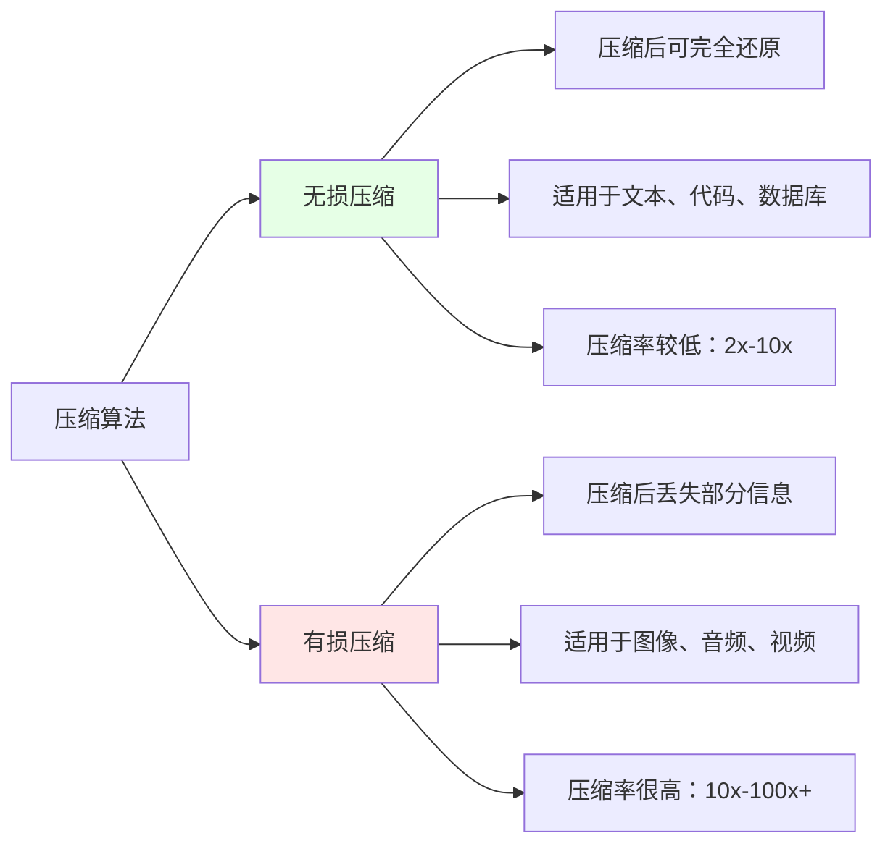

#### 无损压缩（Lossless Compression）

**核心原则**：压缩后再解压，必须和原始数据**完全一致**，一个比特都不能错。

**适用场景**：
- 文本文件（文档、代码）
- 可执行程序
- 数据库文件
- 医学影像（DICOM格式需要无损）
- 法律、财务数据

**典型算法**：ZIP、GZIP、PNG、FLAC、Brotli、LZMA

#### 有损压缩（Lossy Compression）

**核心原则**：压缩时**丢弃人眼/人耳不敏感的信息**，解压后无法完全还原，但在可接受的范围内。

**适用场景**：
- 照片和图片
- 音乐和音频
- 电影和视频
- 语音通话
- 游戏贴图

**典型算法**：JPEG、MP3、H.264、AAC、WebP、AV1

### 2.2 完整分类体系

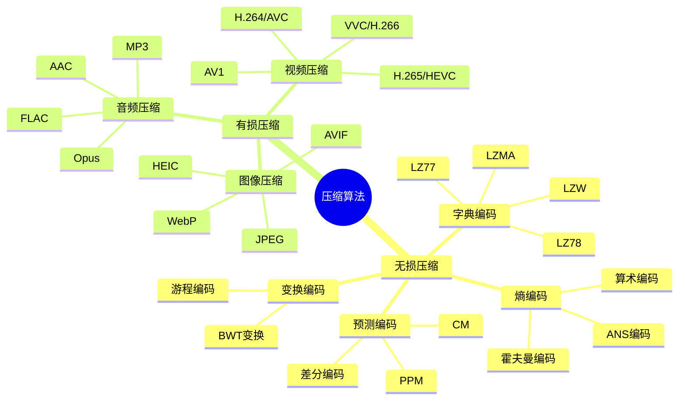

---

## 三、经典算法解析：压缩算法的"四大名著"

### 3.1 LZ77：字典压缩的鼻祖（1977年）

**核心思想**：用"指针"代替"重复内容"。

**举例说明**：

```
原文：The quick brown fox jumps over the lazy dog. The quick brown fox is fast.

处理过程：
位置0-43: "The quick brown fox jumps over the lazy dog. "
位置44-49: "The qu" ← 这部分在前面出现过！

压缩表示：
[The quick brown fox jumps over the lazy dog. ]<44,9>ick brown fox is fast.

<44,9> 表示：从当前位置向前44个字符开始，复制9个字符
即："The quick"
```

**数据结构**：滑动窗口

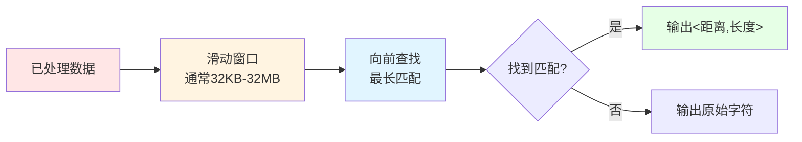

**现实影响**：
- ZIP、GZIP、PNG、HTTP压缩都用到了LZ77的思想
- 几乎所有现代压缩算法都有LZ77的影子
- Jacob Ziv和Abraham Lempel因此成为压缩算法领域的泰斗

### 3.2 霍夫曼编码：让常用的变短（1952年）

**核心思想**：出现频率高的字符用短编码，出现频率低的字符用长编码。

**经典案例**：莫尔斯电码

莫尔斯电码其实就是霍夫曼编码的前身：
- 英文中最常用的字母是`E`，莫尔斯码是`.`（最短）
- 最不常用的字母是`Z`，莫尔斯码是`--..`（较长）

**算法步骤**：

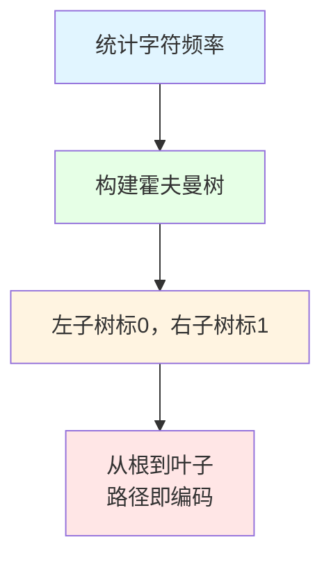

**实际例子**：

假设一段文字中字符频率为：
- A: 50次
- B: 25次
- C: 15次
- D: 10次

**构建霍夫曼树**：

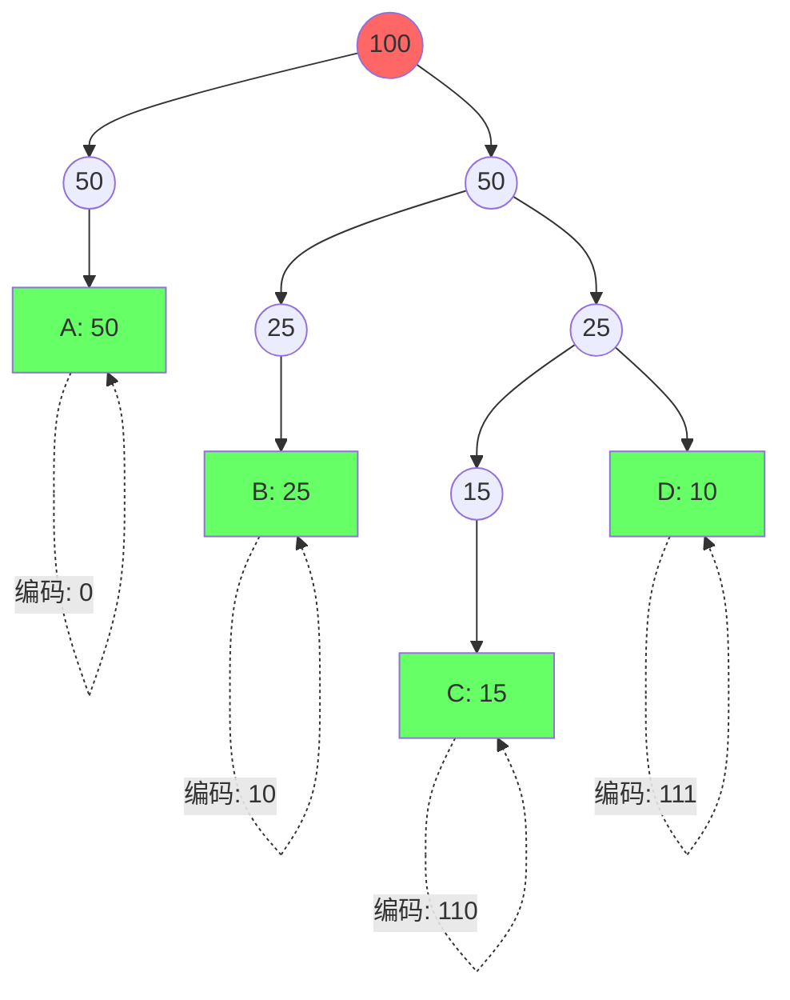

**编码结果**：

| 字符 | 频率 | 原始（8bit） | 霍夫曼编码 | 编码长度 | 总比特数 |
|------|------|------------|-----------|---------|---------|
| A | 50 | 8 bit | 0 | 1 bit | 50 bit |
| B | 25 | 8 bit | 10 | 2 bit | 50 bit |
| C | 15 | 8 bit | 110 | 3 bit | 45 bit |
| D | 10 | 8 bit | 111 | 3 bit | 30 bit |
| **合计** | 100 | **800 bit** | - | - | **175 bit** |

**压缩率：800 → 175，节省了约78%的空间！**

### 3.3 DEFLATE：ZIP的核心算法（1993年）

**DEFLATE = LZ77 + 霍夫曼编码**

这是目前应用最广泛的无损压缩算法之一：

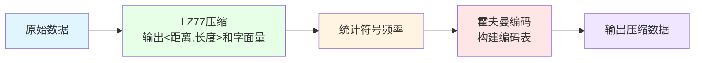

**应用场景**：
- ZIP文件压缩
- GZIP网络传输压缩
- PNG图片格式
- HTTP/HTTPS传输压缩
- Git对象存储

### 3.4 JPEG：有损压缩的里程碑（1992年）

JPEG压缩分为多个步骤，每一步都在"去除人眼不敏感的信息"：

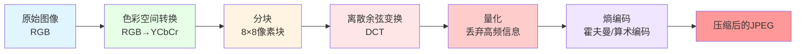

**关键步骤解析**：

1. **色彩空间转换**（RGB → YCbCr）
   - Y：亮度（人眼敏感）
   - Cb/Cr：色度（人眼不敏感）
   - 色度可以降低分辨率存储

2. **离散余弦变换**（DCT）
   - 将像素信息转换为频率信息
   - 低频（大面积颜色变化）→ 重要
   - 高频（细节纹理）→ 可以丢弃

3. **量化**（核心有损步骤）
   - 用量化表除以DCT系数
   - 高频系数被除后接近0，直接舍入为0
   - **质量参数就是控制这一步的激进程度**

4. **熵编码**（无损压缩）
   - 对量化后的数据进行霍夫曼编码

**JPEG压缩效果**：

| 质量参数 | 文件大小 | 视觉差异 | 适用场景 |
|---------|---------|---------|---------|
| 100%（无损） | 最大 | 无差异 | 专业摄影 |
| 90% | 约为原图20% | 几乎看不出 | 高质量存储 |
| 75% | 约为原图10% | 仔细看有差异 | 网络传输 |
| 50% | 约为原图5% | 明显有损 | 缩略图 |
| 25% | 约为原图2% | 严重失真 | 预览图 |

---

## 四、现代压缩算法：群雄逐鹿的时代

### 4.1 图像压缩：从JPEG到AI时代

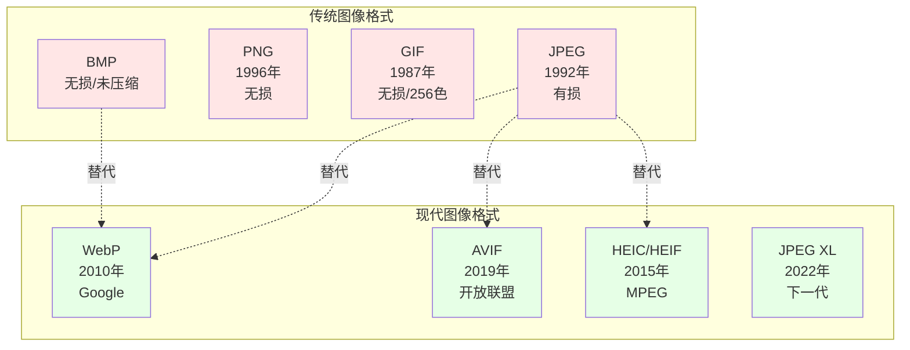

#### WebP：Google的杰作（2010年）

**特点**：
- 同时支持有损和无损压缩
- 支持透明通道（Alpha Channel）
- 支持动画
- 比JPEG小25%-34%，质量相当

**压缩原理**：
- 有损：基于VP8视频编码的关键帧
- 无损：使用预测编码、变换编码、熵编码

**应用现状**：
- 微信表情包使用WebP
- 淘宝、京东商品图大量使用
- Chrome、Firefox、Edge、Safari全支持
- **目前Web上最普及的现代图片格式**

#### AVIF：开放标准的未来（2019年）

**特点**：
- 基于AV1视频编码
- 比WebP再小30%-50%
- 支持HDR、广色域、12bit深度
- 完全免费、开源、无专利限制

**压缩率对比**（相对于JPEG）：

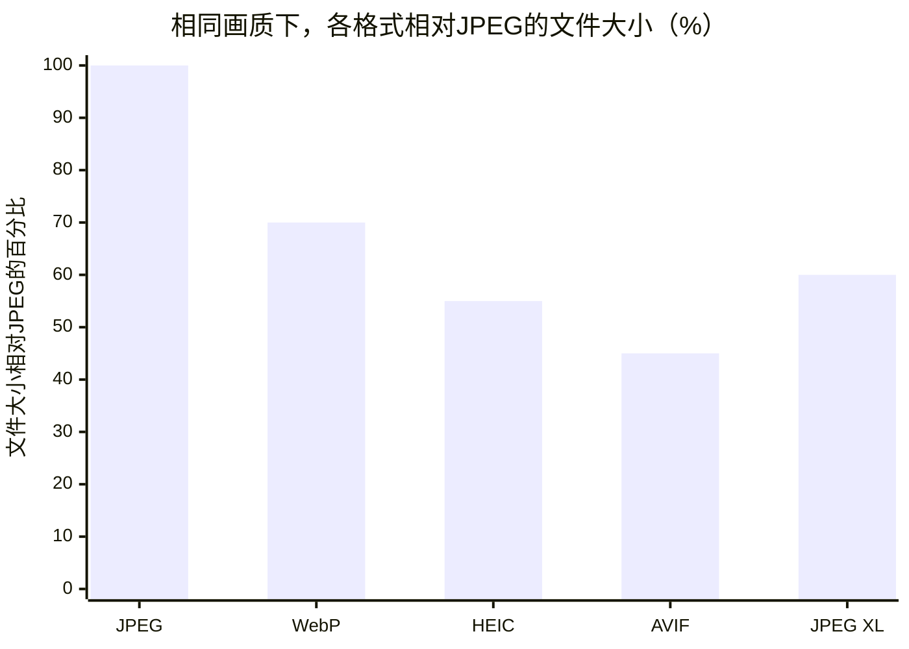

**劣势**：
- 编码速度慢（AV1编码本身复杂）
- 解码需要硬件支持（否则耗电）
- 部分旧设备不支持

#### JPEG XL：遗憾的下一代（2022年）

**特点**：
- 完美兼容JPEG（可无损转换JPEG到JXL）
- 比JPEG小约35%
- 编码/解码速度极快
- 支持无损JPEG回溯（可以还原原始JPEG）

**为什么没有普及？**

2023年，Google宣布Chrome将**放弃对JPEG XL的支持**，原因是：
- WebP已经够用
- AVIF更有前景
- JXL缺乏杀手级特性

**教训**：**技术优势不等于市场成功。**

### 4.2 视频压缩：从H.264到VVC

视频压缩是所有压缩领域**最复杂、最赚钱**的赛道。

**为什么视频压缩最难？**

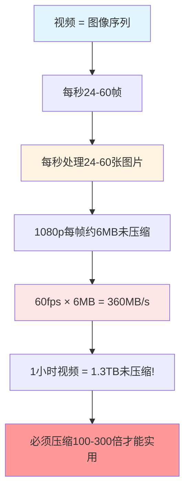

#### 主流视频编码对比

| 编码标准 | 发布年份 | 压缩效率 | 专利政策 | 硬件支持 | 当前地位 |
|---------|---------|---------|---------|---------|---------|
| **H.264/AVC** | 2003 | 基准 | 收费 | 全面支持 | 仍广泛使用 |
| **H.265/HEVC** | 2013 | 比H.264高50% | 收费（复杂） | 大部分支持 | 4K主流 |
| **VP9** | 2013 | 接近H.265 | 免费（Google） | 部分支持 | YouTube主力 |
| **AV1** | 2018 | 比VP9高30% | 免费（开放） | 新款支持 | 快速普及中 |
| **VVC/H.266** | 2020 | 比H.265高50% | 收费 | 刚起步 | 8K预备 |

#### H.264：最成功的视频编码

H.264是**有史以来最成功的视频编码标准**，原因：

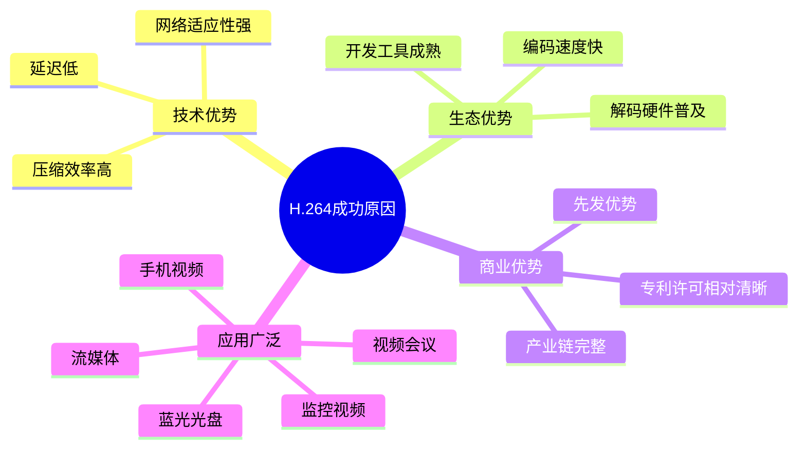

**核心技术**：

1. **帧内预测**（Intra Prediction）
   - 利用同一帧内相邻块的相似性
   - 9种预测模式（4×4块）

2. **帧间预测**（Inter Prediction）
   - 利用相邻帧的相似性
   - 运动估计 + 运动补偿
   - **这是视频压缩效率高的关键！**

3. **变换与量化**
   - 4×4整数DCT变换
   - 自适应量化

4. **熵编码**
   - CAVLC（低复杂度）
   - CABAC（高效率）

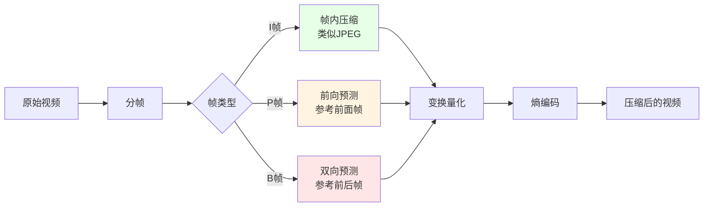

**I帧、P帧、B帧的区别**：

| 帧类型 | 全称 | 参考方式 | 压缩率 | 大小 |
|-------|------|---------|--------|------|
| I帧 | Intra Frame | 不参考其他帧 | 低 | 最大 |
| P帧 | Predicted Frame | 参考前面的I/P帧 | 中 | 中等 |
| B帧 | Bi-directional Frame | 参考前后帧 | 高 | 最小 |

**GOP（Group of Pictures）结构**：

```
I B B P B B P B B I B B P B B ...
↑____________GOP____________↑

通常GOP长度：1-2秒（24-60帧）
I帧间隔越长，压缩率越高，但容错性越差
```

#### AV1：开放标准的胜利

**AV1**由开放媒体联盟（AOMedia）开发，成员包括：
- Google、Netflix、Amazon
- Microsoft、Apple、Mozilla
- Intel、AMD、NVIDIA、ARM

**为什么AV1重要？**

- **完全免费**：不需要支付任何专利费
- **压缩效率高**：比VP9提升30%，接近VVC
- **互联网公司的选择**：Netflix、YouTube、B站都在用
- **硬件加速普及**：Intel 11代、AMD 7000系、Apple M3都支持AV1硬解

**AV1 vs H.265 流媒体成本**：

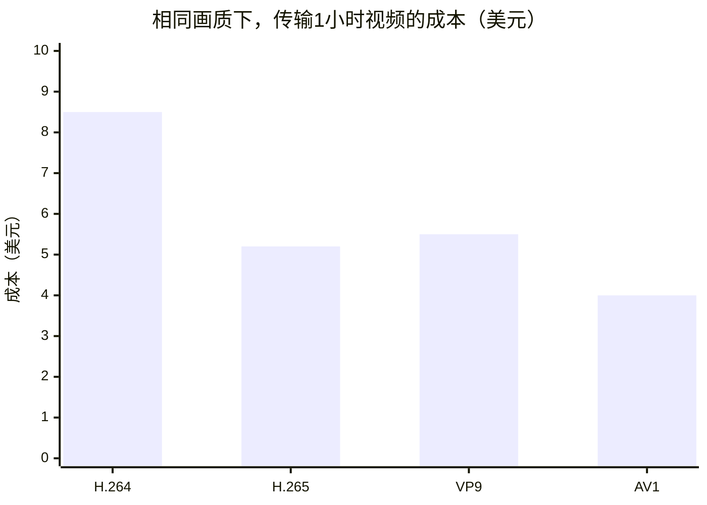

**对于Netflix这样的流媒体**：
- 每年全球带宽成本超过10亿美元
- 从H.264切换到AV1，可以节省超过50%的带宽
- **这意味着每年节省数亿美元**

### 4.3 音频压缩：从MP3到空间音频

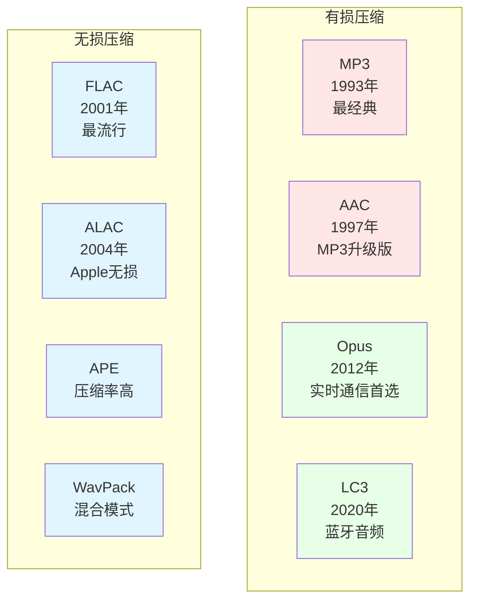

#### MP3：改变音乐产业的技术

**MP3的核心技术**：

**心理声学模型**——利用人耳的听觉特性：

1. **频域掩蔽**
   - 强音会掩盖附近的弱音
   - 弱音可以直接丢弃

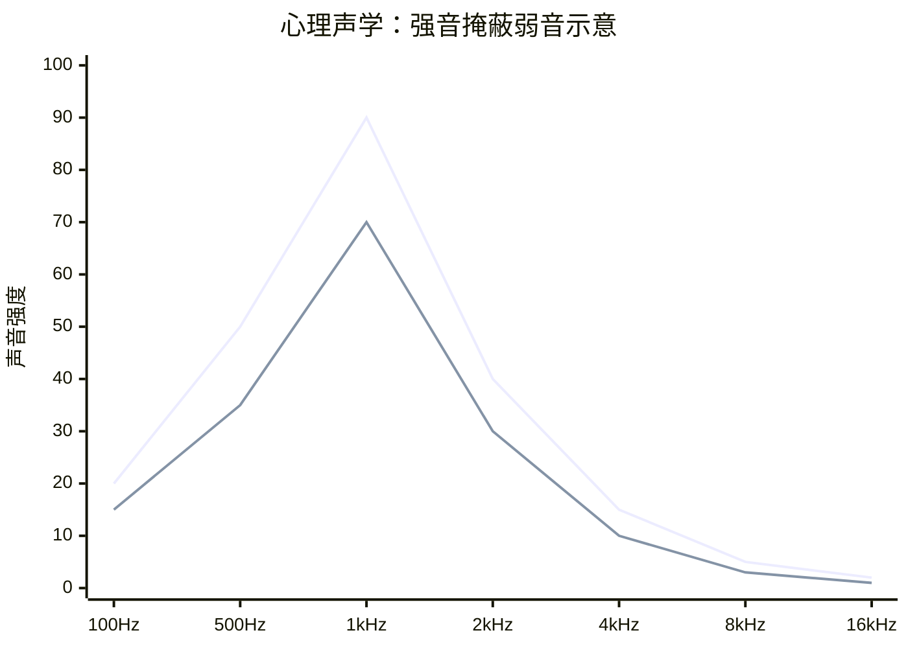

2. **时域掩蔽**
   - 强音出现前后，人耳灵敏度下降
   - 这段时间内的弱音可以丢弃

3. **听觉范围限制**
   - 人耳只能听到20Hz-20kHz
   - 超出范围的信息直接丢弃

**MP3压缩效果**：

| 比特率 | 文件大小（3分钟歌曲） | 音质 | 适用场景 |
|-------|-------------------|------|---------|
| 320 kbps | 约7MB | 接近CD | 高质量音乐 |
| 192 kbps | 约4.5MB | 很好 | 主流选择 |
| 128 kbps | 约3MB | 良好 | 网络传输 |
| 64 kbps | 约1.5MB | 一般 | 语音/低带宽 |

#### Opus：实时通信的王者

**Opus**是2012年IETF标准化的音频编码：

**为什么Opus是最佳选择？**

- **超低延迟**：最低2.5ms（视频会议刚需）
- **全场景覆盖**：从语音到全频带音乐
- **自适应比特率**：6 kbps - 510 kbps
- **抗丢包**：内置FEC（前向纠错）
- **完全免费**：开源、无专利费

**应用场景**：
- 微信语音/视频通话
- Zoom、腾讯会议
- Discord语音
- WhatsApp语音消息
- WebRTC默认音频编码

---

## 五、通用压缩算法：谁是最强压缩王？

### 5.1 主流无损压缩算法对比

| 算法 | 发布年份 | 压缩率 | 压缩速度 | 解压速度 | 主要应用 |
|------|---------|--------|---------|---------|---------|
| **DEFLATE** | 1993 | ★★★ | ★★★★★ | ★★★★★ | ZIP、GZIP、PNG |
| **LZMA** | 2001 | ★★★★★ | ★★ | ★★★★ | 7-Zip、XZ |
| **Brotli** | 2015 | ★★★★ | ★★★★ | ★★★★★ | Web压缩 |
| **Zstandard** | 2016 | ★★★★ | ★★★★★ | ★★★★★ | Facebook、Linux |
| **LZ4** | 2011 | ★★ | ★★★★★ | ★★★★★ | 实时系统、数据库 |
| **Snappy** | 2011 | ★★ | ★★★★★ | ★★★★★ | BigTable、LevelDB |

### 5.2 压缩三剑客：速度vs压缩率的权衡

```mermaid
xychart-beta
    title "压缩算法：速度与压缩率的权衡"
    x-axis ["LZ4", "Snappy", "DEFLATE<br/>(GZIP)", "Brotli", "Zstandard<br/>(快速)", "Zstandard<br/>(高压缩)", "LZMA2<br/>(7-Zip)"]
    y-axis "压缩速度 (MB/s)" 0 --> 2000
    bar [1800, 1500, 300, 200, 750, 150, 80]
    y-axis "压缩率 (越小越好)" 0 --> 100
    bar [55, 58, 40, 35, 38, 25, 22]
```

#### 极致速度：LZ4

```
特点：解压速度可达4GB/s以上
场景：实时系统、数据库日志压缩、内存压缩
哲学：压缩率可以低，但速度必须快
```

**LZ4的设计哲学**：

> 在现代计算机上，CPU通常比存储和带宽更便宜。与其花时间压缩到最小，不如快速压缩，用空间换时间。

#### 平衡之选：Zstandard（zstd）

```
特点：可以在速度和压缩率之间灵活调节
场景：Facebook全线产品、Linux内核、RPM包
哲学：一个算法，满足所有场景
```

**Zstd的多级别压缩**：

| 压缩级别 | 压缩率 | 压缩速度 | 解压速度 | 适用场景 |
|---------|--------|---------|---------|---------|
| 1（最快） | 中等 | 500 MB/s | 1500 MB/s | 实时压缩 |
| 3（默认） | 良好 | 300 MB/s | 1000 MB/s | 通用场景 |
| 10（高压缩） | 很好 | 100 MB/s | 800 MB/s | 存储优化 |
| 19（极限） | 极致 | 30 MB/s | 600 MB/s | 冷数据归档 |
| 22（最大） | 极致 | 10 MB/s | 400 MB/s | 极致压缩需求 |

#### 极致压缩率：LZMA2（7-Zip）

```
特点：压缩率最高，但速度慢
场景：软件发布、长期归档、带宽极度受限
哲学：能压多小压多小，时间不是问题
```

### 5.3 Web压缩：从GZIP到Brotli

**为什么Web需要压缩？**


**Web压缩算法演进**：

| 算法 | 发布年份 | 相对于GZIP | 浏览器支持 | 当前状态 |
|------|---------|-----------|-----------|---------|
| **GZIP** | 1992 | 基准 | 全部 | 仍然广泛使用 |
| **Brotli** | 2015 | 再小15%-25% | 全部 | 快速普及中 |
| **Zstandard** | 2016 | 接近Brotli | 部分 | 尚未普及 |

**Brotli为什么比GZIP好？**

1. **更大的字典**：GZIP是32KB，Brotli是16MB
   - 可以更好地利用跨文件的重复内容
   - 例如：多个JS文件都包含相同的jQuery

2. **预定义字典**：Brotli内置了常用词和HTML/CSS/JS模式
   - 对Web内容特别友好

3. **上下文建模**：根据上下文动态选择最优编码

**实际效果**：

| 文件类型 | GZIP压缩后 | Brotli压缩后 | Brotli节省 |
|---------|-----------|-------------|-----------|
| HTML | 35% | 25% | 额外29% |
| CSS | 30% | 20% | 额外33% |
| JavaScript | 35% | 25% | 额外29% |
| JSON | 35% | 22% | 额外37% |

### 5.4 数据库压缩：速度与空间的平衡

数据库是压缩算法的重要应用场景，但要求特殊：

**数据库压缩的特殊要求**：

1. **必须快速解压**：数据查询时不能等太久
2. **随机访问**：不能解压整个文件才能访问一部分
3. **压缩率适中**：不需要极致压缩，但必须节省空间

**主流选择**：

| 数据库 | 压缩算法 | 原因 |
|-------|---------|------|
| **MySQL InnoDB** | LZ4、Zstd | 快速解压 |
| **PostgreSQL** | LZ4、Zstd、Snappy | 灵活性 |
| **MongoDB** | Snappy、Zstd | 平衡 |
| **ClickHouse** | LZ4、Zstd、LZMA | 分析型场景 |
| **RocksDB** | LZ4、Zstd、Snappy | LSM-Tree特性 |

---

## 六、前沿技术：压缩算法的未来在哪里？

### 6.1 AI压缩：机器学习重塑压缩

**传统压缩 vs AI压缩**：

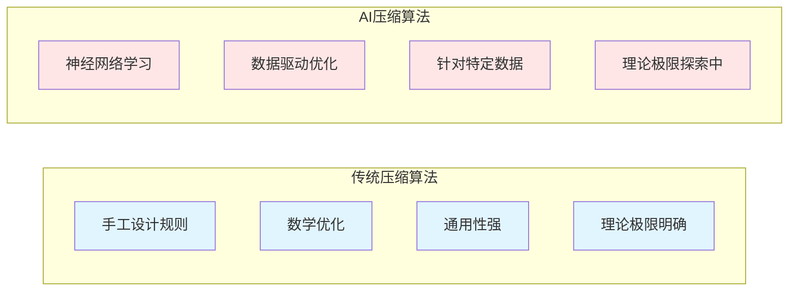

#### 神经图像压缩：突破JPEG/AVIF的理论极限

**核心思想**：用神经网络代替传统变换编码


**当前研究现状**：

| 模型 | 压缩率vs传统 | 编码速度 | 解码速度 | 状态 |
|------|------------|---------|---------|------|
| **Balle等（2018）** | 接近BPG | 慢 | 慢 | 学术验证 |
| **Minnen等（2018）** | 优于BPG | 慢 | 慢 | 学术验证 |
| **Cheng等（2020）** | 接近AVIF | 中等 | 中等 | 学术验证 |
| **JPEG AI** | 优于AVIF | 慢 | 中等 | 标准化中 |

**JPEG AI标准**：

- 2024年正式发布
- 使用端到端神经网络压缩
- 比传统JPEG节省约50%空间（相同画质）
- **问题**：需要AI加速硬件，目前编码/解码速度较慢

#### AI视频压缩：Netflix的实验

**Netflix的AI视频编码优化**：

```mermaid
flowchart TB
    A[原始视频] --> B[AI内容分析]
    B --> C{内容类型识别}
    C -->|动画/卡通| D[使用动画优化编码]
    C -->|真人视频| E[使用真人优化编码]
    C -->|体育/动作| F[使用高帧率优化]
    C -->|静态/对话| G[使用低码率优化]
    D --> H[输出压缩视频]
    E --> H
    F --> H
    G --> H
    
    style B fill:#e6ffe6
    style C fill:#fff4e1
    style D fill:#e1f5ff
    style E fill:#e1f5ff
    style F fill:#e1f5ff
    style G fill:#e1f5ff
```

**Netflix的Per-Shot Encoding**：

- 对视频的每一段（Shot）单独分析
- 根据内容复杂度动态调整编码参数
- **效果**：比统一编码节省20%-30%带宽

### 6.2 语义压缩：只传"意义"不传"像素"

**传统压缩**：尽可能保留所有像素信息

**语义压缩**：只保留语义信息，重建时AI补全

```mermaid
graph LR
    A[发送端] --> B[AI提取语义<br/>物体、场景、关系]
    B --> C[传输语义数据<br/>极小]
    C --> D[接收端AI<br/>根据语义重建]
    D --> E[重建的图像/视频]
    
    style A fill:#e1f5ff
    style B fill:#ffe6e6
    style C fill:#fff4e1
    style D fill:#ffe6e6
    style E fill:#e6ffe6
```

**应用场景**：

- **自动驾驶**：只传输路况语义，不需要传输每个像素
- **远程会议**：传输表情、动作参数，本地渲染3D模型
- **元宇宙**：传输场景描述，客户端生成画面

**当前挑战**：

- 语义提取和重建需要强大的AI
- 重建结果可能与原图有差异
- 标准化困难

### 6.3 量子压缩：未来的可能性

**量子信息论**：利用量子叠加态压缩信息

**理论进展**：

- 量子数据可以突破经典信息论的压缩极限
- 量子纠缠可以用于更高效的信息传输
- **当前状态**：纯理论研究，距离实用至少10-20年

---

## 七、压缩算法的选择指南

### 7.1 场景驱动选择

```mermaid
flowchart TB
    A[需要压缩数据] --> B{什么类型的数据?}
    
    B -->|文本/代码| C{用途?}
    C -->|归档存储| D[使用LZMA/7-Zip<br/>追求极致压缩率]
    C -->|网络传输| E[使用Brotli/GZIP<br/>平衡压缩率和兼容性]
    C -->|实时通信| F[使用LZ4/Zstd<br/>速度优先]
    
    B -->|图片| G{用途?}
    G -->|照片| H[使用AVIF/HEIC<br/>有损高压缩率]
    G -->|网页图片| I[使用WebP<br/>兼容性好]
    G -->|图标/截图| J[使用PNG/WebP<br/>无损或高质量有损]
    
    B -->|视频| K{用途?}
    K -->|流媒体| L[使用H.264/H.265<br/>兼容性优先]
    K -->|存储| M[使用AV1/H.265<br/>压缩率优先]
    K -->|实时通话| N[使用VP8/H.264<br/>延迟优先]
    
    B -->|音频| O{用途?}
    O -->|音乐存储| P[使用FLAC<br/>无损]
    O -->|在线播放| Q[使用AAC/Opus<br/>有损]
    O -->|语音通话| R[使用Opus<br/>超低延迟]
    
    style A fill:#ffcc00
    style B fill:#e1f5ff
    style D fill:#e6ffe6
    style E fill:#e6ffe6
    style F fill:#e6ffe6
    style H fill:#e6ffe6
    style I fill:#e6ffe6
    style J fill:#e6ffe6
    style L fill:#e6ffe6
    style M fill:#e6ffe6
    style N fill:#e6ffe6
    style P fill:#e6ffe6
    style Q fill:#e6ffe6
    style R fill:#e6ffe6
```

### 7.2 2025年推荐方案

| 场景 | 推荐方案 | 备选方案 | 说明 |
|------|---------|---------|------|
| **文件压缩归档** | 7-Zip（LZMA2） | Zstd（高压缩） | 追求最小体积 |
| **Web文本传输** | Brotli | GZIP（兼容旧浏览器） | 主流选择 |
| **数据库压缩** | Zstd/LZ4 | Snappy | 快速解压 |
| **图片存储** | WebP/AVIF | JPEG（兼容） | 视设备支持 |
| **视频流媒体** | H.265/AV1 | H.264（兼容） | 视CDN支持 |
| **音乐存储** | FLAC | ALAC（Apple生态） | 无损 |
| **语音通话** | Opus | - | 没有更好选择 |
| **实时系统** | LZ4 | - | 速度最快 |
| **大文件传输** | Zstd | - | 平衡 |

---

## 八、压缩算法的哲学思考

### 8.1 压缩的本质：信息与冗余

```mermaid
mindmap
  root((信息论视角))
    信息熵
      随机性越高熵越大
      熵越大越难压缩
      完全随机数据不可压缩
    冗余类型
      统计冗余
        字符频率不均
        LZ77可去除
      结构冗余
        图片空间相关
        视频时间相关
        变换编码可去除
      感知冗余
        人眼不敏感的高频
        人耳掩蔽效应
        有损压缩可利用
      语义冗余
        同一语义多种表达
        AI压缩的突破口
```

### 8.2 压缩算法的三大定律

**定律一：没有免费的午餐**

> 没有任何压缩算法对所有数据都是最优的。对某些数据压缩效果好的算法，对其他数据可能效果很差。

**定律二：压缩的极限是熵**

> 无损压缩的极限由数据的信息熵决定。不可能无限压缩。

**定律三：速度与压缩率的权衡**

> 压缩率越高，通常需要的计算时间越长。你必须根据场景做选择。

### 8.3 压缩行业的启示

```mermaid
graph TB
    A[压缩算法的启示] --> B[技术层面]
    A --> C[商业层面]
    A --> D[哲学层面]
    
    B --> B1[数学基础决定上限]
    B --> B2[工程实现决定下限]
    B --> B3[场景驱动创新]
    
    C --> C1[开放标准战胜封闭]
    C --> C2[生态比技术更重要]
    C --> C3[专利可以阻碍创新]
    
    D --> D1[效率是永恒的命题]
    D --> D2[有损是世界的本质]
    D --> D3[信息即价值]
    
    style A fill:#ffcc00
    style B fill:#e1f5ff
    style C fill:#e6ffe6
    style D fill:#ffe6e6
```

---

### 9.1 压缩算法发展里程碑

```mermaid
timeline
    title 压缩算法发展史
    1948 : 香农提出信息论<br/>奠定压缩数学基础
    1952 : 霍夫曼编码发明<br/>熵编码的里程碑
    1977 : LZ77算法发表<br/>字典压缩的开端
    1992 : JPEG标准发布<br/>有损图像压缩普及
    1993 : MP3标准发布/DEFLATE发明<br/>音频/文件压缩革命
    2003 : H.264标准发布<br/>视频流媒体爆发
    2013 : H.265标准发布<br/>4K视频成为可能
    2015 : WebP/Brotli发布<br/>Web压缩升级
    2016 : Zstandard开源<br/>通用压缩新标杆
    2018 : AV1标准发布<br/>开放视频编码
    2022 : JPEG XL标准发布<br/>下一代图像格式
    2024 : JPEG AI标准发布<br/>AI压缩标准化
```

### 9.2 当前格局一图看懂

```mermaid
graph TB
    subgraph 图像[图像压缩格局]
        A1[JPEG: 仍占60%+<br/>但逐年下降]
        A2[WebP: 快速增长<br/>已成为Web主流]
        A3[AVIF: 未来趋势<br/>生态建设中]
        A4[JPEG XL: 技术优秀<br/>但市场存疑]
    end
    
    subgraph 视频[视频压缩格局]
        B1[H.264: 仍占50%+<br/>短期不可替代]
        B2[H.265: 4K主力<br/>专利问题仍在]
        B3[AV1: 快速增长<br/>互联网巨头推动]
        B4[VVC: 8K预备<br/>重蹈H.265覆辙?]
    end
    
    subgraph 通用[通用压缩格局]
        C1[GZIP: Web标配<br/>缓慢退出舞台]
        C2[Brotli: Web新宠<br/>持续替代GZIP]
        C3[Zstd: 系统级压缩<br/>快速增长中]
        C4[LZ4: 速度之王<br/>实时场景标配]
    end
    
    style A1 fill:#ffcc99
    style A2 fill:#99ff99
    style A3 fill:#9999ff
    style B1 fill:#ffcc99
    style B2 fill:#ff9999
    style B3 fill:#99ff99
    style C1 fill:#ffcc99
    style C2 fill:#99ff99
    style C3 fill:#99ff99
```

### 9.3 未来趋势预测

#### 趋势1：AI压缩将成为主流（5-10年）

- JPEG AI标准将逐渐普及
- 端到端神经编解码器将超越传统算法
- **前提条件**：AI硬件加速普及

#### 趋势2：AV1将成为视频主流（3-5年）

- 开放标准是最大优势
- 硬件解码支持将快速普及
- H.265将逐渐被边缘化

#### 趋势3：语义压缩将出现杀手应用（5-10年）

- 元宇宙、自动驾驶等场景驱动
- 不是替代传统压缩，而是补充
- **可能改变信息传输的范式**

#### 趋势4：压缩与加密融合（3-5年）

- 压缩数据后再加密是常见模式
- 未来可能出现压缩加密一体化的算法
- 隐私保护与存储效率的平衡

#### 趋势5：绿色压缩成为新指标（持续）

- 数据中心耗电量巨大，压缩可以节能
- 未来压缩算法将考虑"能耗效率"
- **压缩1TB数据消耗多少电**可能成为新指标

---

## 十、附录：学习压缩算法的完整指南

### 10.1 推荐书籍

| 书名 | 作者 | 难度 | 说明 |
|------|------|------|------|
| 《数据压缩导论》 | Khalid Sayood | 入门 | 经典教材，理论扎实 |
| 《信息论基础》 | Cover & Thomas | 进阶 | 信息论圣经 |
| 《视频编码技术》 | 毕厚杰 | 入门 | H.264/H.265详解 |
| 《图像与视频压缩》 | 数字视频处理 | 进阶 | 实用技术指南 |

### 10.2 在线资源

- **压缩算法库**：https://github.com/inikep/lzbench（压缩算法基准测试）
- **Brotli**：https://github.com/google/brotli
- **Zstandard**：https://github.com/facebook/zstd
- **LZ4**：https://github.com/lz4/lz4
- **WebP**：https://github.com/webmproject/libwebp
- **AV1**：https://aomedia.org/av1/

### 10.3 动手实验

**实验1：对比不同压缩算法**

```bash
# 安装压缩工具
sudo apt install brotli zstd lz4

# 创建测试文件
dd if=/dev/urandom of=random.bin bs=1M count=100
dd if=/dev/zero of=zeros.bin bs=1M count=100
echo "重复内容" > repeat.txt
for i in {1..10000}; do echo "重复内容" >> repeat.txt; done

# 测试不同算法
time gzip -c repeat.txt > repeat.gz
time brotli -c repeat.txt > repeat.br
time zstd -c repeat.txt > repeat.zst
time lz4 -c repeat.txt > repeat.lz4

# 比较结果
ls -lh repeat.*
```

**实验2：查看压缩效果**

```python
# Python测试图像压缩
from PIL import Image
import os

img = Image.open('photo.jpg')

# 保存为不同格式和画质
for quality in [20, 40, 60, 80, 100]:
    img.save(f'photo_q{quality}.jpg', quality=quality)
    size = os.path.getsize(f'photo_q{quality}.jpg')
    print(f'JPEG Quality {quality}: {size/1024:.1f} KB')

# 保存为WebP
img.save('photo.webp', 'WEBP', quality=80)
size = os.path.getsize('photo.webp')
print(f'WebP Quality 80: {size/1024:.1f} KB')
```

### 10.4 压缩算法面试常见问题

**Q1：什么是信息熵？**
A：信息熵是信息论的基本概念，表示数据的平均信息量。熵越大，数据越随机，越难压缩。

**Q2：LZ77和LZ78的区别？**
A：LZ77使用滑动窗口查找历史匹配，LZ78维护一个字典记录出现过的字符串。LZ77更适合流式数据，LZ78压缩率可能更高。

**Q3：有损压缩为什么能压得更小？**
A：有损压缩利用了人类感知的局限性，丢弃人眼/人耳不敏感的信息，因此可以在保持可接受质量的同时大幅减小体积。

**Q4：如何评价一个压缩算法的好坏？**
A：三个维度：压缩率（压得多小）、压缩速度（压得多快）、解压速度（还原得多快）。不同场景侧重点不同。

**Q5：Zstd为什么比GZIP好？**
A：Zstd在相同压缩率下速度更快，在相同速度下压缩率更高，且可以灵活调节级别。唯一劣势是兼容性不如GZIP。

---

## 十一、写在最后：压缩算法的启示

压缩算法告诉我们几个深刻的道理：

### 1. 世界充满冗余，但关键信息很少

**就像我们的生活**：每天接收大量信息，真正重要的没几个。学会"压缩"生活，保留真正有价值的东西。

### 2. 有损是一种智慧

**有损压缩不是偷懒，而是取舍**。知道什么可以丢弃，什么必须保留，这是人生的课题。

### 3. 速度与质量的平衡

**没有完美，只有最合适**。压缩算法需要在压缩率和速度之间做权衡，人生也需要在各种目标之间找到平衡点。

### 4. 开放标准的力量

**AV1的成功不是因为技术最好，而是因为开放**。在技术领域，生态和开放往往比技术本身更重要。

---

**压缩算法的故事还在继续。**

从ZIP到AI，从H.264到AV1，从MP3到空间音频，每一次技术变革，都让我们的数字生活更加美好。

下一个突破会是什么？**语义压缩？量子压缩？还是我们还没想到的全新范式？**

时间会给出答案。

但有一件事是确定的：**只要数据还在增长，压缩算法就永远不会停止进化。**

---