# 大模型入门深度解析：从原理到实践的完全指南

## 引言

在人工智能发展的漫长历程中，2022年11月ChatGPT的发布是一个里程碑式的事件。它不仅让全世界见识到了大语言模型的威力，更开启了人工智能应用的新纪元。从那一刻起，“大模型”从一个学术术语变成了街头巷尾热议的话题。

然而，面对“大模型”这个概念，很多人感到既熟悉又陌生。熟悉的是，它已经成为我们日常工作和生活中不可或缺的工具——写文章、编代码、回答问题、生成图片，似乎没有什么是它做不到的。陌生的是，大模型究竟是什么？它是如何“学会”如此多样的技能的？它的能力有没有边界？未来的发展方向又是什么？

要真正理解大模型，我们不能仅仅停留在表面的使用层面，而需要深入到它的技术内核。只有理解了“为什么”，才能更好地驾驭这个工具，在AI时代占据先机。

本文将带领读者从零开始，一步步深入理解大模型的方方面面。我们会从最基础的概念出发，逐步深入到技术原理、训练方法、应用场景，直到最后的实践指南。无论你是刚刚接触AI的新手，还是有一定基础的开发者，这篇文章都能帮助你建立起对大模型全面而深入的认识。

---

## 第一章：大模型基础概念

### 1.1 什么是大模型？

大模型，全称为“大语言模型”（Large Language Model，简称LLM），是指具有海量参数规模、能够处理海量自然语言任务的人工智能模型。从本质上来说，大模型是一个经过大规模数据训练，能够根据输入预测输出的概率模型。

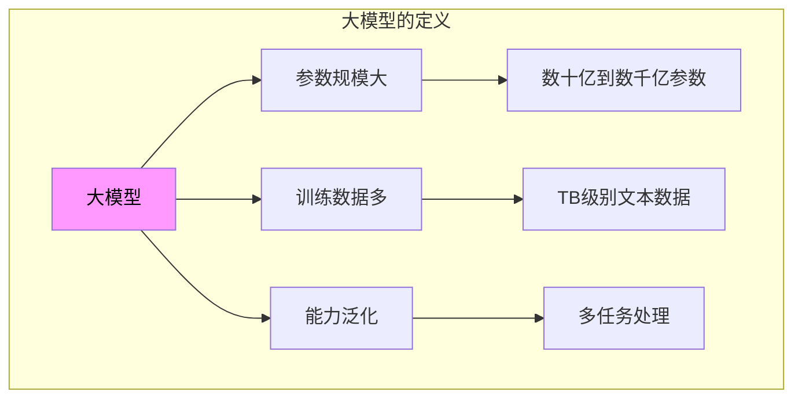

我们可以把大模型理解为一个超级庞大的“概率机器”。当你输入一段文字时，它会计算出下一个最可能出现的字词，然后继续生成，直到完成整个回答。这种能力来自于它在训练过程中学习到的海量语言模式。

**根本原因分析**：为什么“大”如此重要？

这涉及到深度学习的核心原理——“规模法则”（Scaling Law）。研究表明，模型的性能与其参数规模、训练数据量和计算量之间存在确定性的正相关关系。简单来说：

1. **参数规模**：更多的参数意味着更强的表达能力，能够捕捉更复杂的语言模式
2. **训练数据**：更多的训练数据意味着更全面的知识覆盖，减少“知识盲区”
3. **计算量**：更多的训练计算意味着更好的优化，能够充分发挥参数潜力

这就像学生学习一样：学的知识越多（训练数据），记忆能力越强（参数规模），练习越充分（计算量），考试成绩就越好。

### 1.2 大模型的核心特征

理解大模型的关键特征，有助于我们更好地理解它的能力和局限性：

**1. 涌现能力（Emergent Abilities）**

所谓涌现能力，是指模型在达到一定规模后，突然展现出在小模型上不存在的能力。典型例子包括：

- 思维链推理（Chain-of-Thought）：模型能够逐步推理，而非直接给出答案
- 零样本学习（Zero-shot Learning）：无需特定训练就能完成新任务
- 指令遵循（Instruction Following）：能够理解并执行复杂指令

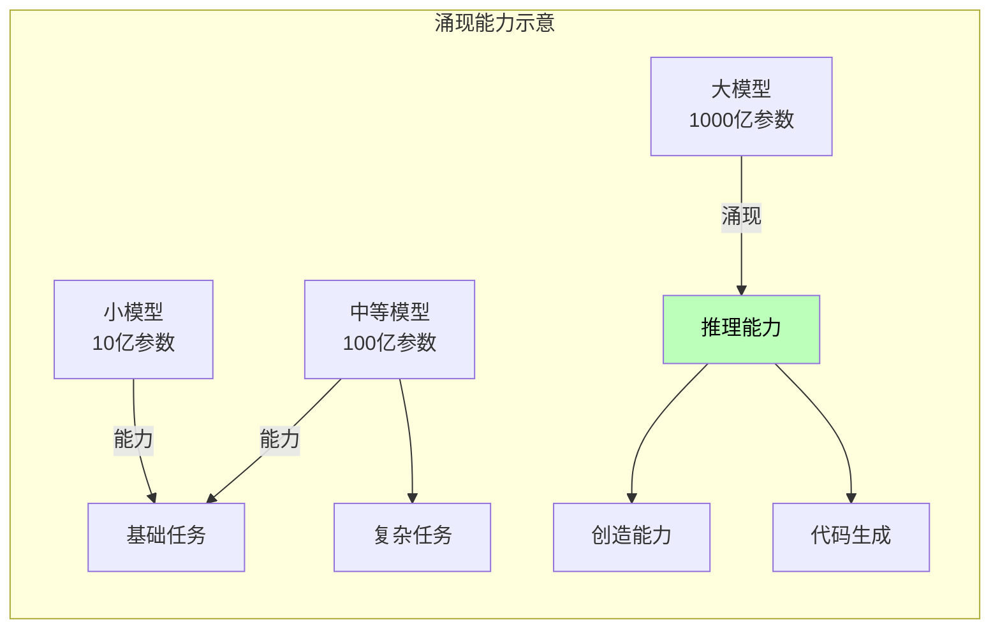

**2. 通用性（Generalization）**

大模型不像传统AI那样针对单一任务训练，而是采用“预训练+微调”的范式。一个基础模型可以适配各种下游任务：

- 文本生成
- 机器翻译
- 情感分析
- 代码编写
- 数学推理
- 等等

**3. 基于Transformer架构**

Transformer是当前大模型的主流架构，它完全改变了自然语言处理的范式：

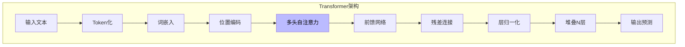

### 1.3 大模型与传统AI的区别

理解大模型与之前AI技术的区别，有助于我们把握这次技术变革的本质：

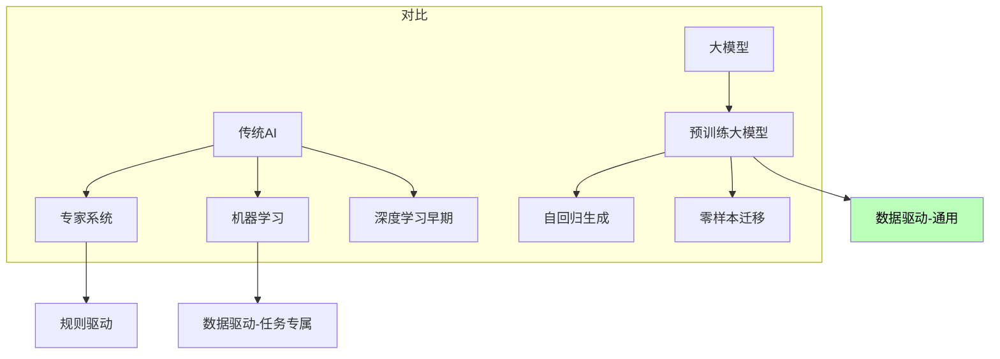

| 特征 | 传统AI | 大模型 |
|------|--------|--------|
| 训练方式 | 任务专属训练 | 预训练+微调 |
| 模型规模 | 百万级参数 | 十亿/万亿参数 |
| 数据需求 | 标注数据 | 海量无标注数据 |
| 泛化能力 | 单一任务 | 多任务通用 |
| 部署方式 | 每个任务单独部署 | 一个模型服务多种任务 |

---

## 第二章：大模型的技术原理

### 2.1 Transformer原理深度解析

Transformer是当前所有大模型的核心架构，理解它是理解大模型的关键。

**核心组件：自注意力机制（Self-Attention）**

自注意力机制让模型能够理解句子中每个词与其他词之间的关系：

```go
// 自注意力的数学表达（简化）
/*
Attention(Q, K, V) = softmax(QK^T / √d_k)V

其中：
- Q (Query): 查询向量，代表当前位置想要什么
- K (Key): 键向量，代表每个位置能提供什么
- V (Value): 值向量，代表实际的内容
- d_k: 缩放因子，防止梯度消失
*/
```

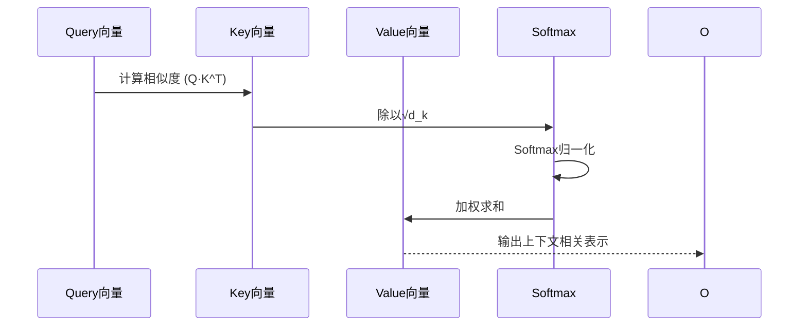

**多头注意力（Multi-Head Attention）**

多头注意力并行运行多个注意力机制，让模型同时关注不同类型的关系：

```go
// 多头注意力
/*
MultiHead(Q, K, V) = Concat(head_1, ..., head_h)W^O

其中每个head_i = Attention(QW_i^Q, KW_i^K, VW_i^V)

典型配置：
- 头数：32-64
- 每个头的维度：64-128
*/
```

**位置编码（Positional Encoding）**

由于Transformer没有循环结构，需要显式添加位置信息：

```go
// 两种主要的位置编码方式
/*
1. 绝对位置编码（Sinusoidal）:
   PE(pos,2i) = sin(pos/10000^(2i/d))
   PE(pos,2i+1) = cos(pos/10000^(2i/d))

2. 相对位置编码:
   关注词与词之间的相对距离，而非绝对位置
*/
```

**根本原因分析**：为什么Transformer成为NLP的主流架构？

1. **并行计算**：不像RNN需要按顺序处理，Transformer可以并行处理所有词，大幅提升训练效率

2. **长距离依赖**：自注意力机制可以直接建立任意两个词之间的联系，解决了RNN的长距离依赖问题

3. **可扩展性**：Transformer的各组件可以灵活扩展，为模型变大提供了基础

4. **迁移学习**：预训练的Transformer可以在各种下游任务中取得优异效果

### 2.2 大模型是如何“训练”出来的？

大模型的训练通常分为两个阶段：预训练（Pre-training）和微调（Fine-tuning）。

**预训练阶段**

预训练的目标是让模型学习语言的通用知识。训练数据通常是海量的互联网文本，训练任务是“下一个词预测”（Next Token Prediction）：

```mermaid
flowchart TB
    subgraph 预训练流程
        A[海量文本数据<br/>TB级别] --> B[Tokenizer分词]
        B --> C[构建训练样本<br/>"我 爱 北京" → "爱 北京 ?"]
        C --> D[Transformer前向传播]
        D --> E[计算损失函数<br/>预测下一个词]
        E --> F[反向传播更新参数]
        F --> G[重复数十亿次]
        G --> H[基础模型<br/>GPT/LLaMA等]
    end
    
    style H fill:#bfb,color:#000
```

预训练的成本极高：
- 训练数据：数万亿tokens
- GPU集群：数千至数万块GPU
- 训练时间：数周至数月
- 电力消耗：数千兆瓦时

**微调阶段**

预训练得到的模型虽然理解了语言，但可能不够“听话”。微调阶段让模型学会理解人类指令：

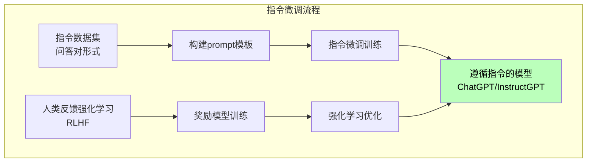

指令微调的关键是构建高质量的指令数据集。这些数据集通常包含：
- 各种类型的问答对
- 思维链推理示例
- 多语言对照数据
- 代码和数学问题

**人类反馈强化学习（RLHF）**

RLHF是让模型输出更加有用和无害的关键技术：

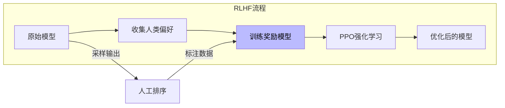

### 2.3 模型推理是如何工作的？

训练好的大模型在推理时遵循自回归生成的方式：

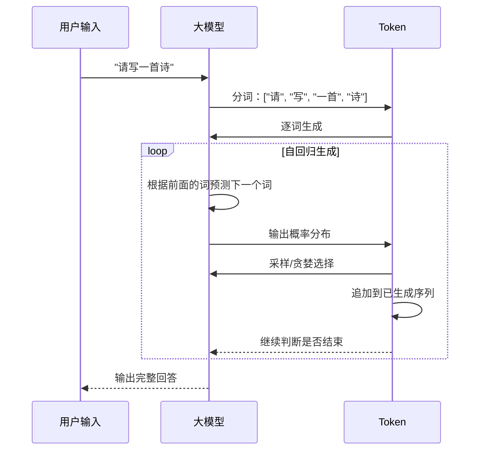

**推理过程的优化**：

1. **KV Cache**：缓存已计算的Key和Value，避免重复计算
2. **量化**：使用低精度表示（如INT8）减少内存和计算
3. **连续批处理**：动态调整批量大小提高吞吐量
4. **投机解码**：使用小模型加速大模型推理

---

## 第三章：大模型的发展历程

### 3.1 从GPT到GPT-4的演进

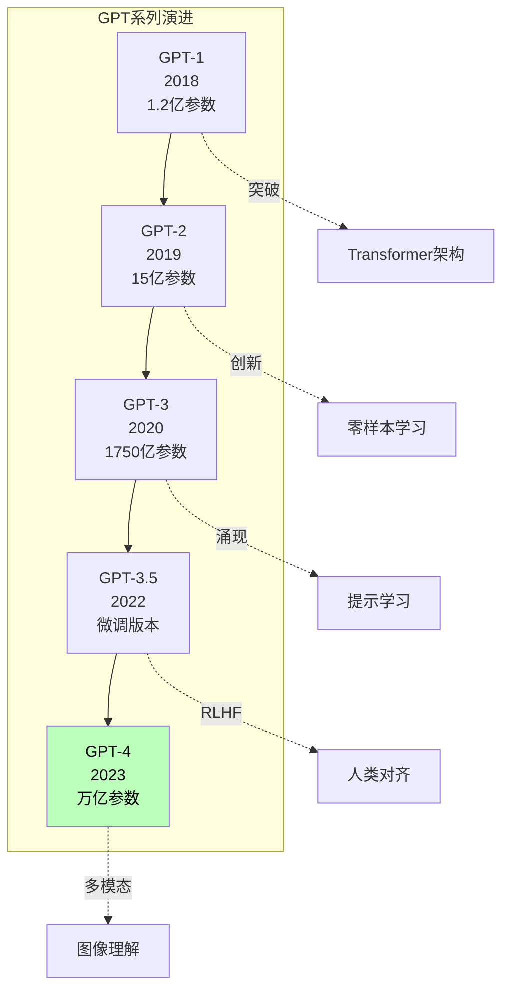

**关键里程碑**：

- **2018年GPT-1**：首次验证Transformer在语言模型上的潜力
- **2019年GPT-2**：展示零样本学习能力，引发关于模型泛化的讨论
- **2020年GPT-3**：涌现能力首次出现，模型规模突破千亿参数
- **2022年InstructGPT**：引入RLHF，让模型更好地遵循人类指令
- **2022年11月ChatGPT**：引爆AI应用热潮
- **2023年GPT-4**：多模态能力，理解图像和文本

### 3.2 开源大模型生态

除了闭源的GPT系列，开源社区也贡献了大量优秀的大模型：

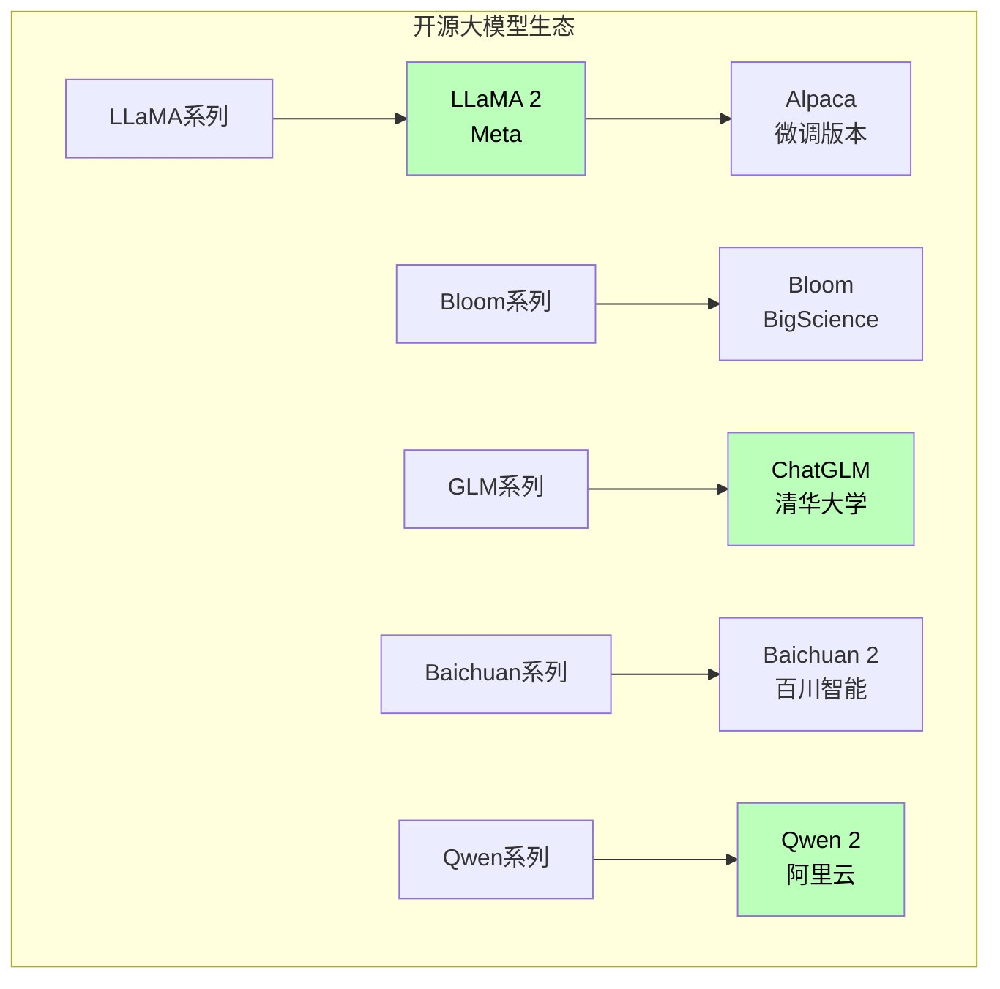

开源模型的优势：
- **可私有化部署**：数据不出本地
- **可自由微调**：根据业务需求调整
- **可成本优化**：推理成本可控

### 3.3 多模态大模型的发展

从纯文本到多模态，大模型的能力边界不断扩展：

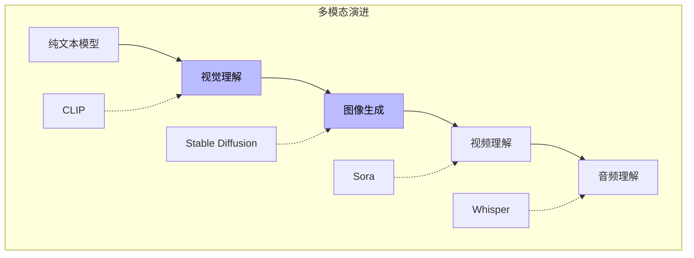

典型多模态模型：
- **GPT-4V**：理解图像输入
- **DALL-E 3**：根据描述生成图像
- **Sora**：根据文本生成视频
- **Gemini**：原生多模态模型

---

## 第四章：大模型的应用场景

### 4.1 文本生成与创作

大模型最直接的应用是各种文本生成任务：

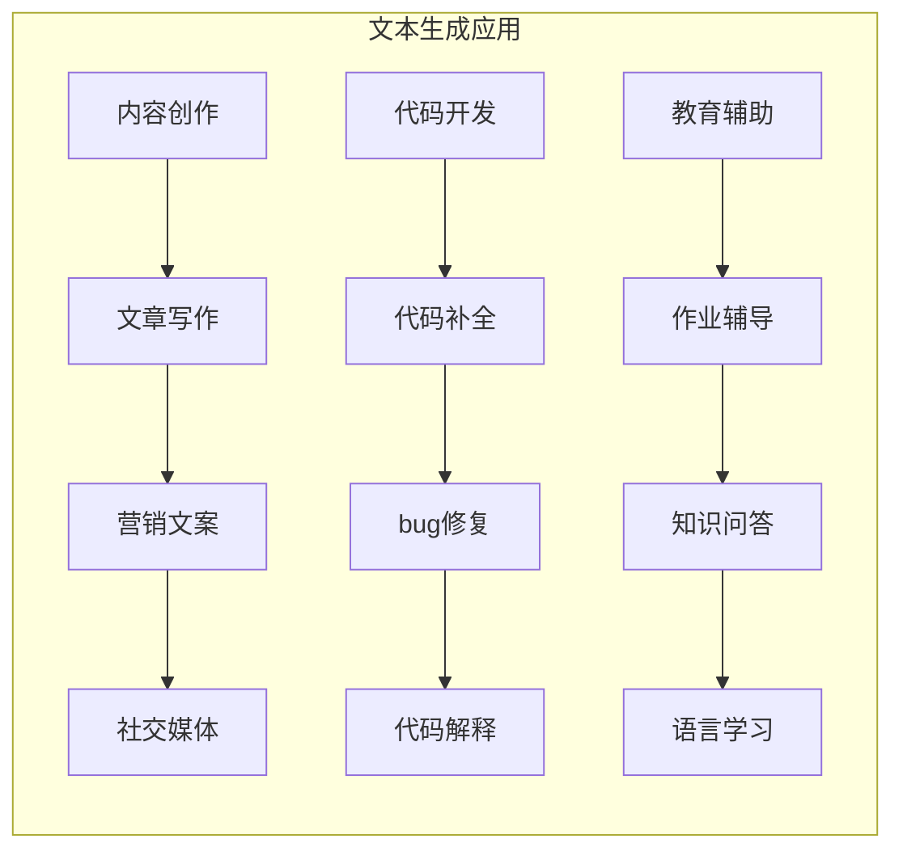

**代码示例：使用大模型API进行代码补全**

```python
import openai

# 配置API
client = openai.OpenAI(api_key="your-api-key")

def complete_code(prompt: str, language: str = "python") -> str:
    """使用大模型补全代码"""
    response = client.chat.completions.create(
        model="gpt-4",
        messages=[
            {
                "role": "system", 
                "content": f"你是一个专业的{language}程序员，专注于代码补全和优化"
            },
            {
                "role": "user", 
                "content": f"请补全以下代码：\n\n{prompt}"
            }
        ],
        temperature=0.5,
        max_tokens=500
    )
    return response.choices[0].message.content

# 使用示例
code_snippet = """
def quicksort(arr):
    if len(arr) <= 1:
        return arr
"""

completed = complete_code(code_snippet, "python")
print(completed)
```

### 4.2 智能对话与客服

大模型正在彻底改变人机交互的方式：

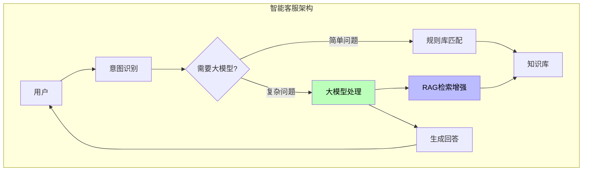

**RAG（检索增强生成）**是解决知识时效性问题的主流方案：

```python
from langchain.llms import OpenAI
from langchain.chains import RetrievalQA
from langchain.vectorstores import FAISS
from langchain.embeddings import OpenAIEmbeddings

# 构建RAG系统
def build_rag_system(docs):
    # 1. 文档分块
    text_splitter = RecursiveCharacterTextSplitter()
    chunks = text_splitter.split_documents(docs)
    
    # 2. 向量化存储
    embeddings = OpenAIEmbeddings()
    vectorstore = FAISS.from_documents(chunks, embeddings)
    
    # 3. 构建问答链
    qa = RetrievalQA.from_chain_type(
        llm=OpenAI(),
        chain_type="stuff",
        retriever=vectorstore.as_retriever()
    )
    
    return qa

# 使用
qa = build_rag_system(documents)
answer = qa.run("公司年假政策是什么？")
```

### 4.3 数据分析与辅助决策

大模型在数据分析领域的应用越来越广泛：

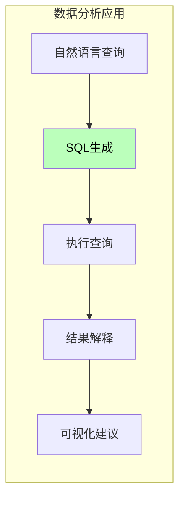

**Text-to-SQL示例**：

```python
# 自然语言转SQL查询
def text_to_sql(question: str, schema: str) -> str:
    """将自然语言转换为SQL"""
    prompt = f"""
给定数据库表结构：
{schema}

请生成对应的SQL查询。

问题：{question}

要求：
1. 只返回SQL语句，不要其他解释
2. 使用标准的ANSI SQL语法
"""
    response = client.chat.completions.create(
        model="gpt-4",
        messages=[{"role": "user", "content": prompt}]
    )
    return response.choices[0].message.content

# 示例表结构
schema = """
users表：
- id (INT, 主键)
- name (VARCHAR)
- email (VARCHAR)
- created_at (DATETIME)

orders表：
- id (INT, 主键)
- user_id (INT, 外键)
- amount (DECIMAL)
- created_at (DATETIME)
"""

# 查询
sql = text_to_sql("统计每个用户的订单总金额", schema)
print(sql)
# SELECT u.name, SUM(o.amount) as total_amount
# FROM users u
# JOIN orders o ON u.id = o.user_id
# GROUP BY u.id
```

---

## 第五章：大模型使用实践指南

### 5.1 Prompt工程基础

Prompt是与大模型交互的核心，掌握prompt技巧能大幅提升效果：

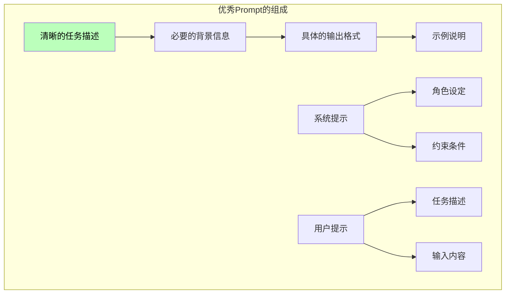

**Prompt设计原则**：

1. **具体明确**：避免模糊的描述，使用具体例子
2. **结构化**：使用分隔符清晰区分各部分
3. **角色扮演**：设定明确的角色身份
4. **few-shot示例**：提供示例帮助模型理解

```python
# 好的Prompt示例

# ❌ 差的Prompt
"""写一首关于春天的诗"""

# ✅ 好的Prompt
"""请以唐代诗人的风格，写一首七言绝句咏颂春天。

要求：
1. 押平声韵
2. 包含"柳"、"花"、"燕"三个意象
3. 表达对春天生机勃勃的赞美

示例：
《咏柳》- 贺知章
碧玉妆成一树高，万条垂下绿丝绦。
不知细叶谁裁出，二月春风似剪刀。

请开始创作："""

# 实际输出可能：
"""
《春日即事》- AI创作
春风拂面柳丝长，桃李花开映日光。
燕子归来寻旧垒，蜂蝶飞舞戏花香。
"""
```

### 5.2 高级Prompt技巧

**1. 思维链（Chain-of-Thought）**

通过引导模型逐步思考，提升推理能力：

```python
# 思维链Prompt
cot_prompt = """
请逐步推理以下数学问题：

问题：小明有15个苹果，给了小红三分之一，又把剩下的苹果分给小明自己和小华各一半，请问小明还有几个苹果？

请按以下格式逐步推理：
1. 第一步：...
2. 第二步：...
...

最终答案："""

# 模型会输出详细的推理过程，而非直接给出答案
```

**2. 角色扮演（Role Playing）**

设定特定角色获得更专业的回答：

```python
# 角色扮演Prompt
role_prompt = """
你是一位经验丰富的软件架构师，拥有15年以上的大型系统设计经验。

你的专长包括：
- 微服务架构设计
- 高性能系统优化
- 云原生技术应用
- 团队技术培训

请以架构师的身份，回答以下问题：

{用户问题}

回答要求：
1. 从架构层面分析问题
2. 提供具体可落地的解决方案
3. 考虑团队技术栈和现有系统
4. 给出实施建议和潜在风险
"""
```

**3. 结构化输出（Structured Output）

client = LLMClient(api_key="your-api-key")

# 单次调用
response = client.chat(
    message="请用Python实现快速排序算法",
    system_prompt="你是一位专业的Python开发者，擅长编写简洁高效的代码。",
    temperature=0.5
)
print(response)

# 批量调用
prompts = [
    "什么是Python的装饰器？",
    "如何优化SQL查询性能？",
    "解释一下RESTful API"
]
results = client.batch_chat(prompts)
for q, a in zip(prompts, results):
    print(f"Q: {q}\nA: {a}\n")
```

### 5.4 本地部署实践

对于数据安全敏感的场景，可以选择本地部署开源大模型：

```python
# 使用llama.cpp进行本地推理
"""
# 安装llama.cpp
git clone https://github.com/ggerganov/llama.cpp.git
cd llama.cpp
make

# 下载模型（如LLaMA 2 7B GGUF格式）
# 量化后约4GB，可直接在消费级GPU运行

# 运行
./main -m models/llama-2-7b-chat-q4_0.gguf -n 256 -t 8 -p "请介绍一下Python的装饰器"
"""

# Python接口（使用llama-cpp-python）
from llama_cpp import Llama

def local_inference():
    """本地大模型推理"""
    
    # 加载模型
    llm = Llama(
        model_path="./models/llama-2-7b-chat-q4_0.gguf",
        n_ctx=2048,  # 上下文长度
        n_threads=8,  # CPU线程数
        n_gpu_layers=0  # GPU层数，0表示只用CPU
    )
    
    # 生成
    output = llm(
        "请解释一下什么是Python的装饰器",
        max_tokens=500,
        temperature=0.7,
        stop=["</s>"]
    )
    
    print(output['choices'][0]['text'])

# 使用Ollama简化部署（推荐）
"""
# 安装Ollama
curl -fsSL https://ollama.com/install.sh | sh

# 运行模型
ollama run llama2

# 或使用Python API
# pip install ollama
import ollama

response = ollama.chat(model='llama2', messages=[
    {'role': 'user', 'content': '为什么天空是蓝色的？'}
])
print(response['message']['content'])
"""
```

---

## 第六章：大模型进阶应用

### 6.1 Agent与工具使用

大模型可以“使用”外部工具来完成更复杂的任务：

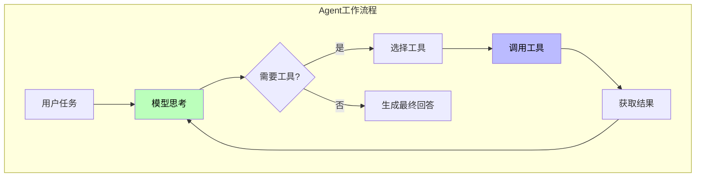

```python
# 简单的Agent实现
from typing import Callable, List, Dict, Any
import json

class SimpleAgent:
    """简单的Agent实现"""
    
    def __init__(self, llm: LLMClient, tools: List[Callable]):
        self.llm = llm
        self.tools = {tool.__name__: tool for tool in tools}
        
        # 构建工具描述
        self.tool_descriptions = "\n".join([
            f"- {name}: {tool.__doc__ or '无描述'}"
            for name, tool in self.tools.items()
        ])
    
    def run(self, task: str) -> str:
        """运行Agent处理任务"""
        
        system_prompt = f"""你是一个智能助手，可以使用以下工具完成任务：

工具列表：
{self.tool_descriptions}

当需要使用工具时，请按照以下JSON格式输出：
{{
    "action": "工具名",
    "input": "工具输入"
}}

不需要工具时，直接回答问题。
"""
        
        # 首次调用
        response = self.llm.chat(task, system_prompt)
        
        # 循环处理直到完成
        while True:
            try:
                # 尝试解析工具调用
                tool_call = json.loads(response.strip())
                
                if "action" in tool_call and "input" in tool_call:
                    # 执行工具
                    tool_name = tool_call["action"]
                    tool_input = tool_call["input"]
                    
                    if tool_name in self.tools:
                        result = self.tools[tool_name](tool_input)
                        
                        # 将工具结果反馈给模型
                        response = self.llm.chat(
                            f"工具'{tool_name}'的执行结果：{result}\n\n请继续处理任务：{task}",
                            system_prompt
                        )
                    else:
                        response = f"未找到工具：{tool_name}"
                else:
                    break  # 没有工具调用，返回结果
                    
            except json.JSONDecodeError:
                # 不是JSON，直接返回
                break
        
        return response

# 定义工具
def search_wikipedia(query: str) -> str:
    """搜索维基百科"""
    # 实际实现需要调用Wikipedia API
    return f"关于'{query}'的搜索结果..."

def calculator(expression: str) -> str:
    """计算数学表达式"""
    try:
        result = eval(expression)
        return str(result)
    except Exception as e:
        return f"计算错误：{e}"

# 使用Agent
agent = SimpleAgent(client, [search_wikipedia, calculator])
result = agent.run("计算 123 * 456 的结果，然后搜索这个数字的历史意义")
print(result)
```

### 6.2 RAG系统构建

RAG（检索增强生成）是当前解决大模型知识时效性的主流方案：

```python
from langchain.text_splitter import RecursiveCharacterTextSplitter
from langchain.embeddings import OpenAIEmbeddings
from langchain.vectorstores import Chroma
from langchain.chains import RetrievalQA
from langchain.llms import OpenAI

class RAGSystem:
    """RAG系统实现"""
    
    def __init__(self, documents: List[str]):
        # 1. 文档分块
        self.splitter = RecursiveCharacterTextSplitter(
            chunk_size=500,
            chunk_overlap=50
        )
        texts = self.splitter.split_text("\n".join(documents))
        
        # 2. 向量化
        self.embeddings = OpenAIEmbeddings()
        self.vectorstore = Chroma.from_texts(texts, self.embeddings)
        
        # 3. 构建问答链
        self.qa = RetrievalQA.from_chain_type(
            llm=OpenAI(temperature=0),
            chain_type="stuff",
            retriever=self.vectorstore.as_retriever(
                search_kwargs={"k": 5}
            )
        )
    
    def query(self, question: str) -> str:
        """问答"""
        return self.qa.run(question)
    
    def add_documents(self, new_documents: List[str]):
        """添加新文档"""
        texts = self.splitter.split_text("\n".join(new_documents))
        self.vectorstore.add_texts(texts)

docs = [
    "Python是一种高级编程语言，由Guido van Rossum于1991年首次发布。",
    "Python的设计哲学强调代码的可读性和简洁的语法。",
    "Python支持多种编程范式，包括结构化、过程式、反射式、面向对象和函数式编程。",
    "拥有丰富而强大的标准库，Python常被称为\"电池包含\"的语言。",
    "Python在数据分析、机器学习、Web开发等领域应用广泛。"
]

rag = RAGSystem(docs)

# 问答
questions = [
    "Python是哪一年发布的？",
    "Python的设计哲学是什么？",
    "Python支持哪些编程范式？"
]

for q in questions:
    print(f"Q: {q}")
    print(f"A: {rag.query(q)}\n")
```

### 6.3 微调实践

对于特定领域，可以对大模型进行微调：

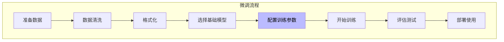

```python
# 使用LoRA进行高效微调
"""
# 安装peft
pip install peft transformers datasets

# LoRA微调脚本
"""

from transformers import AutoModelForCausalLM, AutoTokenizer
from peft import LoraConfig, get_peft_model, TaskType
import torch

def lora_finetune():
    """LoRA微调示例"""
    
    # 1. 加载基础模型
    model_name = "meta-llama/Llama-2-7b-hf"
    model = AutoModelForCausalLM.from_pretrained(
        model_name,
        load_in_8bit=True,
        device_map="auto"
    )
    tokenizer = AutoTokenizer.from_pretrained(model_name)
    
    # 2. 配置LoRA
    lora_config = LoraConfig(
        task_type=TaskType.CAUSAL_LM,
        r=8,  # LoRA rank
        lora_alpha=16,
        lora_dropout=0.05,
        target_modules=["q_proj", "v_proj"],
        bias="none",
        inference_mode=False
    )
    
    # 3. 应用LoRA
    model = get_peft_model(model, lora_config)
    model.print_trainable_parameters()
    # 输出: trainable params: 4,194,304 || all params: 6,742,609,280 || trainable%: 0.062
    
    # 4. 准备数据（示例）
    # 实际需要准备指令微调数据集
    training_data = [
        {
            "instruction": "解释Python中的装饰器",
            "input": "",
            "output": "装饰器是Python中一种强大的语法..."
        },
        # ... 更多数据
    ]
    
    # 5. 开始训练（使用Trainer）
    # from transformers import Trainer, TrainingArguments
    # training_args = TrainingArguments(
    #     output_dir="./output",
    #     num_train_epochs=3,
    #     per_device_train_batch_size=4,
    #     learning_rate=2e-4,
    #     save_steps=100,
    # )
    # trainer = Trainer(
    #     model=model,
    #     args=training_args,
    #     train_dataset=train_dataset,
    # )
    # trainer.train()
    
    # 6. 保存和加载
    # model.save_pretrained("./lora_weights")
    # model = PeftModel.from_pretrained(model, "./lora_weights")
    
    print("LoRA微调配置完成")

# QLoRA - 更高效的微调
"""
# QLoRA使用4-bit量化，进一步降低显存需求
from peft import LoraConfig, get_peft_model, QuantizationConfig

quantization_config = BitsAndBytesConfig(
    load_in_4bit=True,
    bnb_4bit_compute_dtype=torch.float16,
    bnb_4bit_use_double_quant=True,
    bnb_4bit_quant_type="nf4"
)
"""
```

---

## 第七章：大模型的局限性与挑战

### 7.1 当前大模型的主要局限

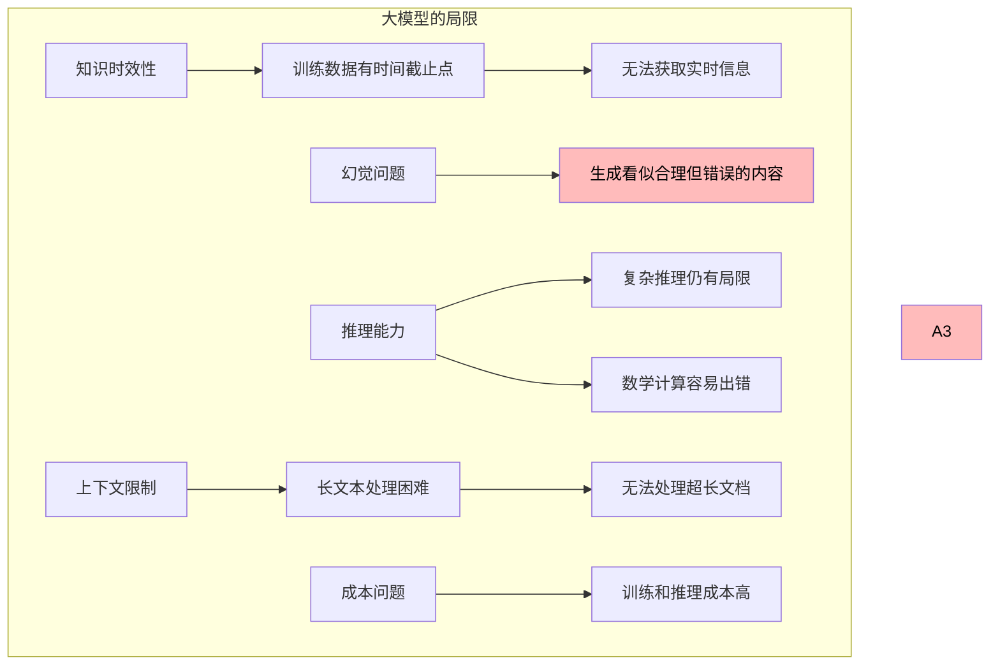

**根本原因分析**：为什么大模型会产生“幻觉”？

大模型本质上是“概率机器”，它的目标是生成“可能正确”的内容，而非“真正正确”的内容。这导致：

1. **训练目标**：模型被训练预测下一个词的概率，而非验证事实
2. **知识边界**：模型的知识边界不清晰，可能混淆相似概念
3. **推理缺陷**：缺乏真正的逻辑推理能力，依赖模式匹配
4. **数据偏差**：训练数据中的噪声会被模型学习

### 7.2 安全与伦理挑战

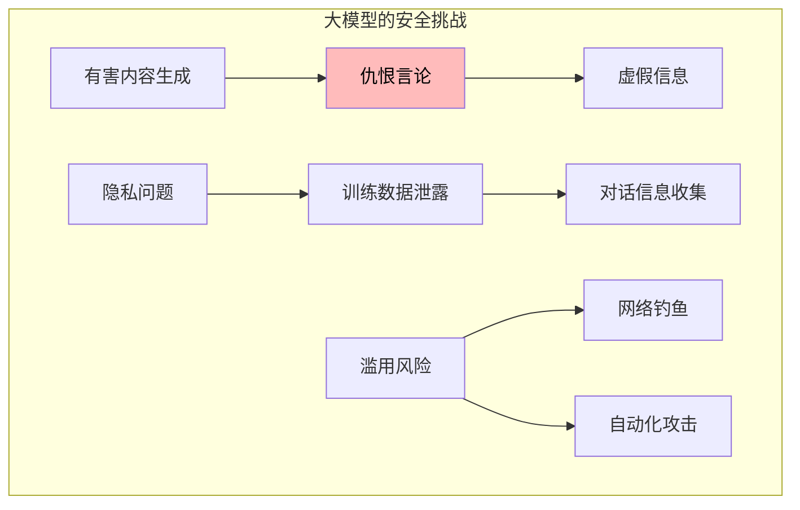

应对措施：
- 内容过滤与安全对齐
- 用户隐私保护机制
- 使用限制与监管

---

## 第八章：大模型的未来展望

### 8.1 技术发展方向

```mermaid
flowchart TB
    subgraph 未来发展方向
        A[模型架构] --> A1[更高效的Transformer变体]
        A1 --> A2[SSM状态空间模型]
        
        B[训练方式] --> B3[自我改进学习]
        B3 --> B4[持续学习]
        
        C[多模态] --> C5[原生多模态]
        C5 --> C6[具身智能]
        
        D[应用形态] --> D1[AI Agent]
        D1 --> D2[个人AI助手]
    end
    
    style A2 fill:#bfb,color:#000
    style D2 fill:#bfb,color:#000
```

**关键技术趋势**：

1. **状态空间模型（SSM）**：如Mamba，可能替代Transformer
2. **长上下文**：处理百万级token的上下文
3. **自主Agent**：能够自主规划和执行复杂任务
4. **个性化**：根据用户习惯定制化服务

### 8.2 行业应用展望

```mermaid
flowchart LR
    subgraph 行业应用
        A[教育] --> A1[个性化学习]
        A1 --> A2[智能辅导]
        
        B[医疗] --> B3[辅助诊断]
        B3 --> B4[药物研发]
        
        C[金融] --> C5[风控分析]
        C5 --> C6[智能投顾]
        
        D[制造] --> D7[智能设计]
        D7 --> D8[预测维护]
    end
    
    style A1 fill:#bfb,color:#000
    style B3 fill:#bfb,color:#000
```

---

大模型代表了人工智能发展的重要里程碑。从2018年GPT-1的诞生到如今ChatGPT、Claude、Gemini等产品的百花齐放，大模型用短短几年时间完成了从实验室到千家万户的跨越。

本文从基础概念出发，深入探讨了大模型的技术原理、发展历程、应用场景和实践指南。我们理解了：

**技术层面**：
- Transformer架构是现代大模型的基础
- 预训练+微调是标准训练范式
- RLHF让模型更好地对齐人类意图

**应用层面**：
- Prompt工程是高效使用大模型的关键
- RAG技术解决了知识时效性问题
- Agent架构让大模型能够使用工具

**局限性**：
- 幻觉问题是当前最大的技术挑战
- 知识时效性受限于训练数据
- 安全与伦理需要持续关注

**未来方向**：
- 模型架构会继续演进
- 多模态能力不断增强
- Agent将成为主流应用形态

大模型不仅仅是一个工具，更是一个新时代的开始。作为这个时代的见证者和参与者，我们既要拥抱这项技术带来的便利，也要清醒地认识到它的局限。只有这样，才能在这个AI时代找到属于自己的位置。

---

# 通俗易懂！一篇文章带你彻底搞懂大模型
> 从原理到应用，手把手教你了解AI最前沿
## 📱 写在前面
你有没有想过，为什么ChatGPT能和你流畅地聊天？为什么它能写诗、写代码、解答各种问题？
这一切的背后，都源于一个神奇的技术——**大语言模型**（Large Language Model，简称LLM）。
今天，我用最通俗的语言，从零开始，带你彻底搞懂大模型到底是什么、它是怎么工作的、以及我们普通人该如何使用它。
## 第一章：什么是大模型？
### 1.1 简单来说，大模型就是一个"超级大脑"
想象一下，你有一个朋友，他读过了互联网上几乎所有的文章、书籍、对话。这个朋友的大脑里存储了海量的知识，当你问他任何问题，他都能从这些知识中找到答案，并用自己的话回答你。
**大模型就是这样一位"超级阅读者"。**
它通过海量的文本数据训练，学会了对语言的"理解"和"生成"。它不真正"懂"什么是爱情、什么是数学，但它学会了如何模仿人类的语言来回答问题。
### 1.2 大模型与传统程序的区别
为了更好地理解，我们来看看传统程序和大模型有什么不同：
flowchart TD
    subgraph 传统程序
        A[输入] --> B{预设规则}
        B -->|如果...则...| C[输出]
        D[输入] --> E[神经网络]
        E --> F[概率计算]
        F --> G[输出]
    style A fill:#e1f5fe
    style D fill:#fff3e0
    style G fill:#e8f5e9
**传统程序**：靠人工写的规则（if-else）来处理问题
**大模型**：靠"暴力美学"——吃了足够多的数据，自己学会处理各种情况
## 第二章：大模型是怎么训练的？
### 2.1 训练的三阶段
大模型的训练过程，像极了你上学读书的过程：
    A[预训练<br/>海量阅读] --> B[微调<br/>专门训练] --> C[人类对齐<br/>价值观教育]
    style A fill:#ffcdd2
    style B fill:#fff9c4
    style C fill:#c8e6c9
**第一阶段：预训练（Pre-training）—— 海量阅读**
这个阶段，模型就像一个孩子，从互联网上海量的文本中学习。它做的事情很简单：**预测下一个词**。
举个例子，当模型看到"太阳从东边___"这句话时，它需要猜出最后一个词是什么。它猜"升起"的次数多了，就知道这个词最可能出现在这个位置。
这个过程听起来简单，但**数据量巨大**——可能要用到数万亿个词（Token），训练一次需要几个月时间和数百万美元。
> 💡 **小知识**：GPT-3的训练数据大约包含了3000亿个Token，相当于一个人日夜不停阅读几万年。
**第二阶段：微调（Fine-tuning）—— 专门训练**
预训练后，模型已经"博览群书"，但它不知道如何"好好说话"。
微调阶段，开发者会用**高质量的问答数据**来训练模型，让它学会：
- 如何更好地回答问题
- 如何遵循指令
- 如何生成更有用的内容
**第三阶段：人类对齐（RLHF）—— 价值观教育**
这是让ChatGPT变得"有用且安全"的关键步骤。通过人类反馈，让模型学会：
- 拒绝回答有害问题
- 给出更符合人类价值观的回答
- 保持回答的一致性
### 2.2 训练数据从哪里来？
pie title 大模型训练数据来源
    "网页内容" : 60
    "书籍" : 15
    "对话/论坛" : 10
    "代码" : 10
    "其他" : 5
大模型的训练数据主要来自互联网，包括：
- **网页内容**：维基百科、新闻文章、博客等
- **书籍**：各种领域的书籍
- **对话数据**：Reddit、论坛讨论等
- **代码**：GitHub上的开源代码
## 第三章：核心技术原理
### 3.1 Transformer：改变一切的核心架构
2017年，Google发表了一篇划时代的论文《Attention Is All You Need》，提出了**Transformer架构**。这个架构是大模型能够"理解"语言的关键。
Transformer的核心是**注意力机制（Attention）**。
### 3.2 注意力机制：像人一样抓住重点
当你读一段话时，你会自动"关注"重要的词，忽略不重要的词。
比如这句话：
> "小明把**苹果**给了小红，因为**它**想吃"
这里的"它"指的是什么？是"苹果"还是"小红"？
作为人类，你很容易理解"它"指的是"小红"（因为小红想吃苹果）。但对计算机来说，这很难理解。
**注意力机制就是让模型学会"抓住重点"的技术：**
flowchart TD
    A[小明把苹果给了小红] --> B[因为它想吃]
    B --> C{计算"它"与哪些词相关}
    C -->|苹果| D[相关性: 20%]
    C -->|小红| E[相关性: 80%]
    C -->|给了| F[相关性: 10%]
    E --> G["所以'它' = 小红"]
    style E fill:#c8e6c9
    style G fill:#81c784
通过计算每个词与其他词之间的"注意力分数"，模型就能理解词与词之间的关系。
### 3.3 Token：模型是如何"读"字的？
你可能听说过"Token"这个词。在大模型世界里，它是最基础的单位。
    subgraph 输入文本
        A["今天天气很好"]
    subgraph Tokenize
        B["今"] --> C["天"] --> D["天"] --> E["气"] --> F["很"] --> G["好"]
    subgraph 模型处理
        H[向量表示] --> I[计算概率] --> J[预测下一个Token]
    A --> B
> 💡 **注意**：Token不一定是完整的词，也可能是：
> - 一个字（如"今"）
> - 一个词（如"今天"）
> - 一个子词（如"un"+"happy"）
这就是为什么有时候你发现，GPT对**中文**的处理似乎比对英文更"精准"一些——因为中文每个字本身就是有意义的Token。
### 3.4 模型的"思维方式"：概率与采样
你可能会好奇：模型是如何决定输出什么内容的？
答案是——**概率**。
当模型要生成下一个词时，它会计算所有可能词的概率，然后根据概率进行"抽样"：
flowchart TD
    A[当前文本:<br/>今天天气] --> B[计算下一个词的概率分布]
    B --> C{温度参数}
    C -->|温度低(0.1)| D[总是选最高概率]
    C -->|温度高(1.0)| E[按概率随机选择]
    D --> F[输出:<br/>很好]
    E --> G[输出:<br/>不错/晴朗/适合出门...]
    style C fill:#fff9c4
**温度（Temperature）**
- 流畅的语言生成
- 知识整合与问答
- 文字润色与改写
- 代码编写与解释
- 多语言翻译
**❌ 不擅长的事情：**
- 实时信息查询（不知道最新新闻）
- 精确数学计算（可能算错）
- 事实性知识（有幻觉、会胡编）
- 理解图片/音频（需要多模态模型）
- 长篇内容一致性（可能前后矛盾）
### 4.3 什么是"幻觉"？
"幻觉"（Hallucination）是 大模型最大的问题之一，指模型会**一本正经地胡说八道**。
flowchart TD
    A[用户提问] --> B{模型知道答案吗?}
    B -->|知道| C[给出正确答案]
    B -->|不确定| D[开始"编造"]
    B -->|不知道| E[也"编造"]
    D --> F[幻觉回答]
    style F fill:#ffcdd2
比如你问模型："秦始皇是什么时候发明飞机的？"
模型可能会回答："秦始皇在公元前220年发明了热气球..." —— 这显然是错误的，但因为模型说话太像真的一样，很多人会信以为真。
> 💡 **提醒**：使用大模型时，对于重要信息一定要自己核实！
## 第五章：如何更好地使用大模型？
### 5.1 提示词（Prompt）的艺术
同样的模型，不同的提问方式，效果天差地别。这就是所谓的"提示词工程"。
**❌ 错误示范：**
> "给我写点关于Python的东西"
**✅ 正确示范：**
> "我是一个Python初学者，请用通俗易懂的语言解释什么是列表（List），请举例说明列表的创建、增删改查操作，并给出实际代码示例。"
### 5.2 提示词的万能公式
这里有一个经过验证的提示词框架：
flowchart TD
    A[提示词] --> B[角色设定]
    A --> C[任务说明]
    A --> D[背景信息]
    A --> E[输出格式]
    A --> F[约束条件]
    B --> G[你是一个专业的...]
    C --> H[请帮我完成...]
    D --> I[在...背景下]
    E --> J[请用...格式输出]
    K[请注意...]
    style A fill:#e3f2fd
    style G fill:#bbdefb
    style H fill:#bbdefb
    style I fill:#bbdefb
    style J fill:#bbdefb
    style K fill:#ffcdd2
### 5.3 进阶技巧
**技巧一：Few-shot Learning（少样本学习）**
直接给模型举例子，让它模仿：
请判断以下评论的情感是正面还是负面。
评论："这个产品太棒了，非常满意！"
情感：正面
评论："体验很差，不会再买"
情感：负面
评论："还可以，一般般吧"
情感：
**技巧二：思维链（Chain of Thought）**
让模型"一步步思考"：
> "请一步步计算：25 × 4 + 17 = ?，展示你的计算过程。"
**技巧三：分步处理复杂任务**
未来的大模型将不只是"听说读写"，还能**看图、看视频、听声音**，成为真正的多模态助手。
**2. 长上下文**
上下文窗口将越来越长，模型能够处理整本书、整部电影的内容。
**3. 自主Agent**
从"回答问题"到"自主执行"，AI Agent将能够帮你自动完成复杂任务。
**4. 个性化定制**
每个人都可以拥有自己的"AI助手"，它了解你的习惯和偏好。
### 7.2 我们应该如何应对？
flowchart TD
    A[面对AI浪潮] --> B[不必焦虑]
    A --> C[但要行动]
    B --> B1[AI不会取代人<br/>但会用AI的人<br/>会取代不用AI的人]
    C --> C1[学会使用AI工具<br/>培养AI思维<br/>持续学习]
    style B1 fill:#e8f5e9
    style C1 fill:#e3f2fd