# 大模型 Agent 深度解析：从单智能体到多智能体协作的架构演进

> 当 ChatGPT 第一次展示出生成代码、解答数学问题的能力时，人们惊叹于大模型的"智能"。但很快，一个更本质的问题浮现出来：如何让大模型不只是"回答问题"，而是"完成任务"？从查询今天的天气，到规划一次跨国旅行；从写一段代码，到维护一个完整的软件项目——这些任务需要规划、记忆、工具使用，甚至多个智能体的协作。这就是 Agent（智能体）技术的核心命题。本文将从 Agent 的基本概念出发，一步步深入到 Multi-Agent 架构、记忆机制、工具调用，帮你构建一套完整的 Agent 技术认知体系。

---

## 一、为什么需要 Agent？——从 LLM 到 Agent 的跃迁

### 1.1 LLM 的局限：知识的囚徒

大语言模型（LLM）如 GPT-4、Claude 等，本质上是**基于训练数据的概率生成器**。它们拥有惊人的语言理解和生成能力，但存在三个根本局限：

**1. 知识截止**

LLM 的训练数据有截止时间，无法获取实时信息。它不知道今天的股价、现在的天气、最新的新闻。

**2. 无法行动**

LLM 只能生成文本，不能直接操作外部世界。它不能发送邮件、不能查询数据库、不能调用 API。

**3. 推理深度有限**

复杂任务需要多步骤规划、试错、调整，但 LLM 的单次生成是"一次性的"，难以进行深度推理。

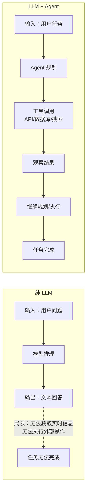

### 1.2 Agent 的定义：LLM 的"手脚"和"大脑"

Agent（智能体）的核心思想是：**以 LLM 为"大脑"，赋予其规划、记忆、工具使用的能力，使其能够自主完成复杂任务**。

一个完整的 Agent 系统通常包含四个核心组件：

| 组件 | 功能 | 类比 |
|------|------|------|
| **规划（Planning）** | 将复杂任务分解为可执行的子任务 | 大脑的前额叶皮层 |
| **记忆（Memory）** | 存储和检索信息，维持上下文 | 大脑的海马体 |
| **工具使用（Tool Use）** | 调用外部 API、执行代码、查询数据库 | 手脚 |
| **行动（Action）** | 执行具体操作，与外部环境交互 | 效应器 |

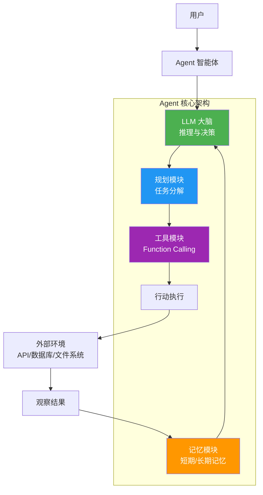

---

## 二、规划：让 LLM 学会"思考"

### 2.1 Chain-of-Thought：思维链

Chain-of-Thought（CoT，思维链）是提升 LLM 推理能力的基础技术。核心思想是：**让模型在给出答案之前，先展示推理过程**。

```
用户：一个农场有鸡和兔子，共 35 个头，94 只脚。鸡和兔子各有多少只？

LLM（直接回答）：鸡 23 只，兔子 12 只。

LLM（CoT）：
设鸡有 x 只，兔子有 y 只。
根据题意：
x + y = 35  （头的数量）
2x + 4y = 94  （脚的数量）

从第一式得：x = 35 - y
代入第二式：2(35 - y) + 4y = 94
70 - 2y + 4y = 94
2y = 24
y = 12

所以兔子 12 只，鸡 35 - 12 = 23 只。
```

CoT 通过显式展示推理步骤，显著提升了 LLM 在数学、逻辑推理任务上的表现。但 CoT 是"一次性"的——模型生成完推理过程就结束了，没有与外部环境的交互。

### 2.2 ReAct：推理与行动的循环

ReAct（Reasoning + Acting）是当前最流行的 Agent 范式。它将 CoT 扩展为一个**循环**：思考（Thought）→ 行动（Action）→ 观察（Observation）→ 再思考……

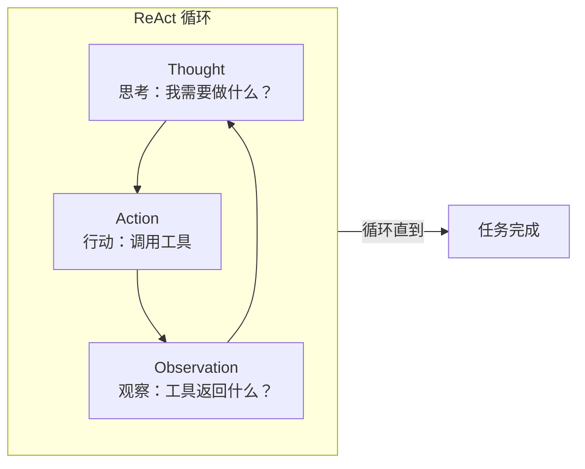

**ReAct 的完整示例**：

```
用户：2024 年诺贝尔文学奖得主是谁？他的代表作有哪些？

Agent:
Thought 1: 用户询问 2024 年诺贝尔文学奖得主。我需要搜索这个信息。
Action 1: search("2024 年诺贝尔文学奖得主")
Observation 1: 2024 年诺贝尔文学奖授予韩国作家韩江（Han Kang）。

Thought 2: 已经知道得主是韩江。现在需要查询她的代表作。
Action 2: search("韩江 代表作")
Observation 2: 韩江的代表作包括《素食者》《少年来了》《白》等。

Thought 3: 已经收集到足够信息，可以回答用户了。
Final Answer: 2024 年诺贝尔文学奖得主是韩国作家韩江，她的代表作包括《素食者》《少年来了》《白》等。
```

**根本矛盾之一：LLM 的推理能力与行动能力的割裂。**

纯 LLM 只能"想"不能"做"，纯工具只能"做"不能"想"。ReAct 通过将两者编织成循环，实现了"边想边做"——这是 Agent 范式的核心突破。

### 2.3 Plan-and-Execute：先规划后执行

ReAct 是"边想边做"，适合探索性任务。但对于结构化任务，"先规划后执行"更高效：

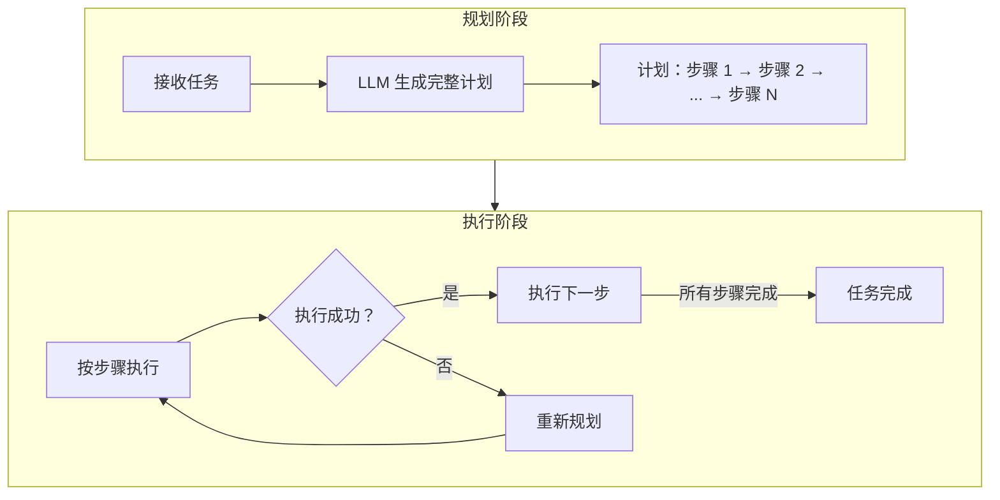

**Plan-and-Execute 的适用场景**：

- 软件开发：需求分析 → 设计 → 编码 → 测试 → 部署
- 数据分析：数据获取 → 清洗 → 分析 → 可视化 → 报告
- 旅行规划：目的地选择 → 机票预订 → 酒店预订 → 行程规划

### 2.4 反思与自我纠错

人类在完成任务时会不断反思、调整策略。Agent 也需要这种能力：

```
Agent 执行计划：
步骤 1: 查询数据库 → 成功
步骤 2: 分析数据 → 失败（数据格式错误）

反思：数据格式不符合预期，需要先进行数据清洗。
调整计划：
步骤 2（新）: 清洗数据
步骤 3: 分析数据
...
```

**Self-Refine** 和 **Reflexion** 是两种典型的反思机制：

- **Self-Refine**：模型对自己的输出进行评分，如果不满意则重新生成。
- **Reflexion**：将失败经验存储到记忆中，避免未来犯同样的错误。

---

## 三、记忆：突破上下文窗口的限制

### 3.1 为什么需要记忆？

LLM 的上下文窗口（Context Window）是有限的——即使 GPT-4 支持 128k token，也无法容纳无限的历史信息。更重要的是，**模型无法在不同会话之间保持记忆**。

Agent 的记忆系统解决两个问题：

1. **短期记忆**：在单次任务中维持上下文，突破上下文窗口限制。
2. **长期记忆**：跨会话保持信息，让 Agent 能够"学习"和"成长"。

### 3.2 记忆的分类体系

```mermaid
flowchart TD
    Memory["Agent 记忆系统"] --> STM["短期记忆<br/>Short-Term Memory"]
    Memory --> LTM["长期记忆<br/>Long-Term Memory"]
    
    STM --> WM["工作记忆<br/>当前对话上下文"]
    STM --> CM["缓存记忆<br/>最近 N 轮对话"]
    
    LTM --> EM["情景记忆<br/>Episodic<br/>过去的经历/对话"]
    LTM --> SM["语义记忆<br/>Semantic<br/>知识/事实"]
    LTM --> PM["程序记忆<br/>Procedural<br">技能/工作流"]
    
    EM --> VecDB["向量数据库存储<br/>RAG 检索"]
    SM --> KG["知识图谱<br/>结构化知识"]
    PM --> Workflow["工作流模板<br/>可复用技能"]
```

### 3.3 短期记忆：滑动窗口与摘要

最简单的短期记忆实现是**滑动窗口**——只保留最近的 N 轮对话：

```python
class ShortTermMemory:
    def __init__(self, max_turns=10):
        self.history = []
        self.max_turns = max_turns
    
    def add(self, role, content):
        self.history.append({"role": role, "content": content})
        # 保持最近 N 轮
        if len(self.history) > self.max_turns * 2:  # *2 因为每轮有 user + assistant
            self.history = self.history[-self.max_turns * 2:]
    
    def get_context(self):
        return self.history
```

当对话很长时，可以使用**摘要机制**——让 LLM 对历史对话进行压缩：

```
原始对话（100 轮）→ LLM 摘要 → 关键信息（10 条）

摘要内容：
- 用户是软件工程师，主要使用 Go 和 Python
- 用户正在开发一个微服务项目
- 用户关心性能优化和可观测性
- ...
```

### 3.4 长期记忆：RAG 与向量数据库

长期记忆的核心技术是 **RAG（Retrieval-Augmented Generation，检索增强生成）**：

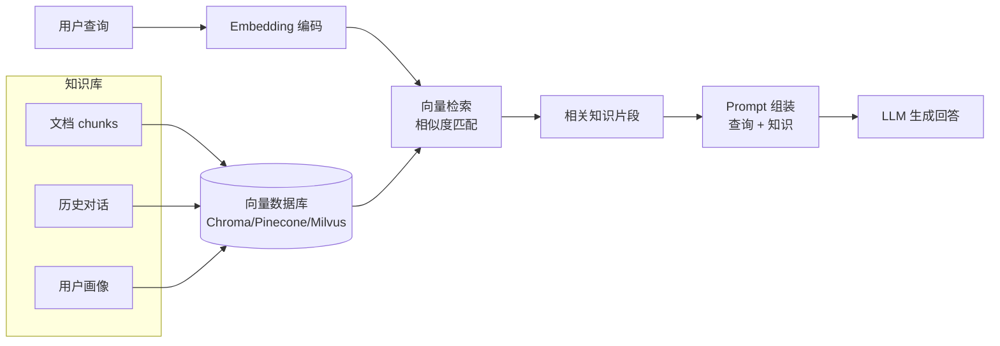

**RAG 的工作流程**：

1. **知识入库**：将文档分割成 chunks，用 Embedding 模型编码为向量，存入向量数据库。
2. **检索**：用户查询时，将查询编码为向量，检索最相似的 chunks。
3. **增强生成**：将检索到的知识片段组装到 Prompt 中，让 LLM 基于这些知识生成回答。

**根本矛盾之二：记忆容量与检索精度的权衡。**

- 记忆容量越大，检索时噪声越多，精度下降。
- 记忆粒度越细（小 chunks），检索精度高，但丢失上下文。
- 记忆粒度越粗（大 chunks），保留上下文，但检索精度低。

---

## 四、工具使用：Function Calling 的技术本质

### 4.1 从文本生成到结构化输出

Function Calling（函数调用/工具调用）是 Agent 与外部世界交互的核心机制。它的技术本质是：**让 LLM 生成结构化的工具调用请求，而非自由文本**。

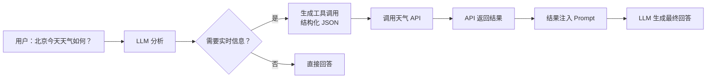

### 4.2 Function Calling 的协议

以 OpenAI 的 Function Calling 为例：

```json
{
  "model": "gpt-4",
  "messages": [
    {"role": "user", "content": "北京今天天气如何？"}
  ],
  "tools": [
    {
      "type": "function",
      "function": {
        "name": "get_weather",
        "description": "获取指定城市的天气信息",
        "parameters": {
          "type": "object",
          "properties": {
            "location": {
              "type": "string",
              "description": "城市名称"
            },
            "unit": {
              "type": "string",
              "enum": ["celsius", "fahrenheit"]
            }
          },
          "required": ["location"]
        }
      }
    }
  ]
}
```

LLM 的响应：

```json
{
  "role": "assistant",
  "content": null,
  "tool_calls": [
    {
      "id": "call_xxx",
      "type": "function",
      "function": {
        "name": "get_weather",
        "arguments": "{\"location\": \"北京\", \"unit\": \"celsius\"}"
      }
    }
  ]
}
```

**关键洞察**：LLM 并没有真正"调用"函数，它只是生成了一个**结构化的调用请求**。实际的函数调用由应用程序执行，结果再返回给 LLM。

### 4.3 工具调用的执行循环

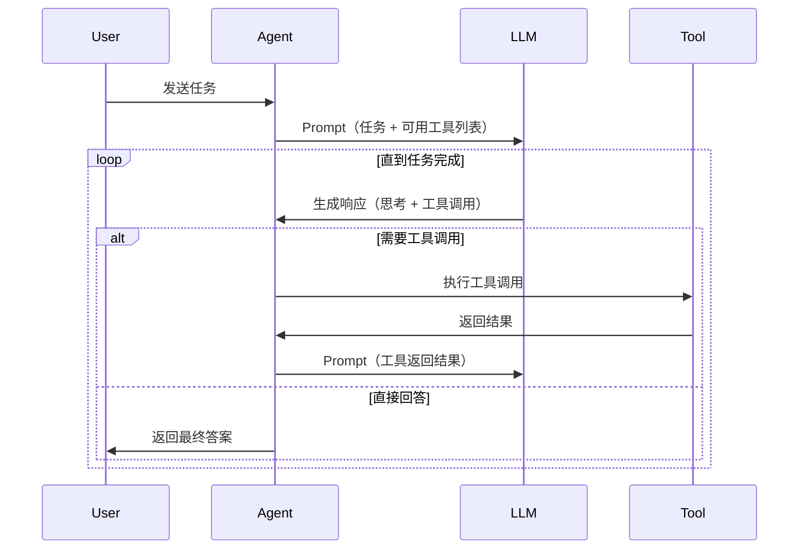

### 4.4 工具设计的最佳实践

**1. 工具描述要清晰**

LLM 根据工具描述决定调用哪个工具。描述不清会导致错误选择：

```python
# 不好的描述
{"name": "search", "description": "搜索"}

# 好的描述
{"name": "web_search", 
 "description": "使用 Google 搜索网络信息。适用于查询实时新闻、天气、股价等时效性信息。"}
```

**2. 参数设计要精确**

```python
# 不好的参数设计
{"parameters": {"query": "string"}}

# 好的参数设计
{
  "parameters": {
    "query": {
      "type": "string",
      "description": "搜索关键词，建议使用英文以获得更好结果"
    },
    "num_results": {
      "type": "integer",
      "description": "返回结果数量，默认 5，最大 10",
      "default": 5
    }
  }
}
```

**3. 错误处理要完善**

工具调用可能失败（网络错误、API 限制、参数错误），Agent 需要能够处理这些错误并尝试恢复。

---

## 五、Multi-Agent：从单打独斗到团队协作

### 5.1 为什么需要多 Agent？

单个 Agent 的能力是有限的：

- **专业分工**：软件开发需要产品经理、架构师、程序员、测试员等不同角色。
- **并行处理**：多个 Agent 可以同时处理不同子任务，提高效率。
- **互相验证**：多个 Agent 可以交叉验证结果，减少错误。

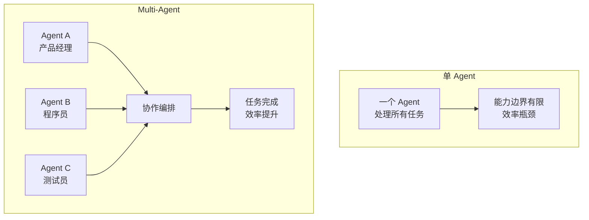

### 5.2 Multi-Agent 的架构模式

**1. 层级式（Hierarchical）**

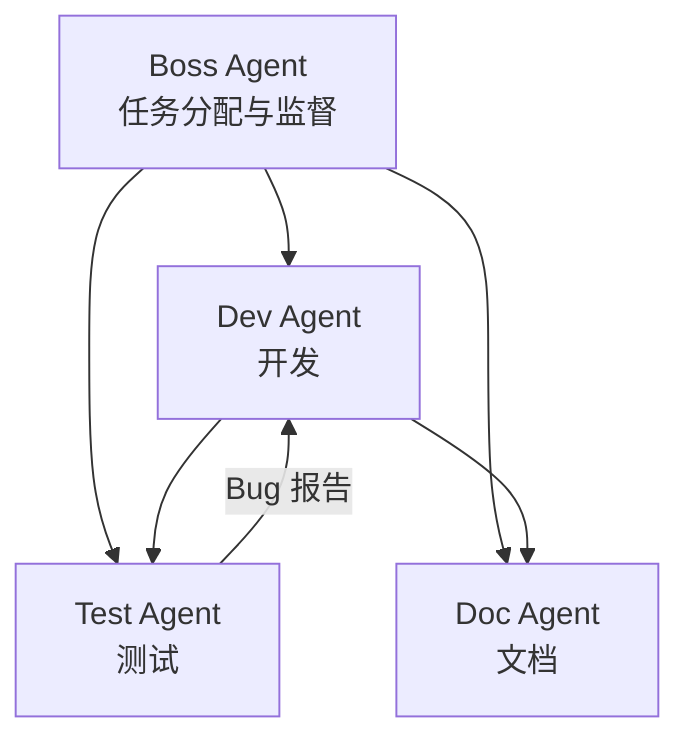

一个中央 Agent 负责任务分配和协调，其他 Agent 执行具体任务。适合有明确层级关系的场景。

**2. 对等式（Peer-to-Peer）**

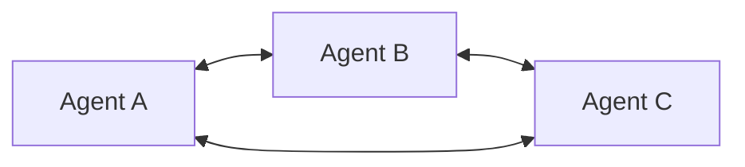

Agent 之间平等协作，没有中央控制。适合需要高度协作、创意碰撞的场景。

**3. 流水线式（Pipeline）**

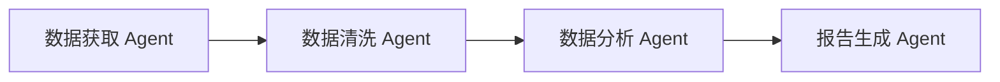

每个 Agent 负责流程中的一个环节，数据像流水线一样传递。适合标准化的数据处理流程。

### 5.3 主流 Multi-Agent 框架对比

| 框架 | 开发者 | 架构特点 | 适用场景 |
|------|--------|---------|---------|
| **AutoGen** | 微软 | 对话式多 Agent，支持人机协作 | 复杂任务分解、代码生成 |
| **CrewAI** | 社区 | 角色扮演，任务委派 | 业务流程自动化 |
| **MetaGPT** | 社区 | 模拟软件公司组织架构 | 软件开发全流程 |
| **LangGraph** | LangChain | 基于图的状态机 | 复杂工作流编排 |

**AutoGen 的核心概念**：

```python
from autogen import AssistantAgent, UserProxyAgent

# 创建 Agent
assistant = AssistantAgent(
    name="assistant",
    llm_config={"model": "gpt-4", "api_key": "..."}
)

user_proxy = UserProxyAgent(
    name="user_proxy",
    human_input_mode="NEVER",
    max_consecutive_auto_reply=10
)

# 启动对话
user_proxy.initiate_chat(
    assistant,
    message="帮我写一个 Python 函数，计算斐波那契数列"
)
```

**MetaGPT 的软件公司模拟**：

```mermaid
flowchart TD
    subgraph MetaGPT["MetaGPT 软件公司"]
        PM["产品经理<br/>写 PRD"]
        Arch["架构师<br/>设计技术方案"]
        Dev["工程师<br/>写代码"]
        QA["测试员<br">写测试用例"]
    end
    
    PM --> Arch --> Dev --> QA
    QA -->|"Bug 报告"| Dev
```

MetaGPT 让不同角色的 Agent 按照软件开发的 SOP（标准操作流程）协作，从需求文档到可运行代码。

### 5.4 根本矛盾之三：协作效率与通信开销的权衡

Multi-Agent 的优势是专业分工，但代价是：

- **通信开销**：Agent 之间需要频繁通信，协调成本增加。
- **一致性维护**：多个 Agent 可能产生冲突的决策，需要仲裁机制。
- **调试困难**：问题可能出现在任何 Agent 或协作环节，定位困难。

**设计原则**：

- Agent 数量不是越多越好，够用即可。
- 明确每个 Agent 的职责边界，避免重叠。
- 设计清晰的通信协议和状态管理机制。

---

## 六、幻觉与可靠性：Agent 的命门

### 6.1 LLM 幻觉的本质

幻觉（Hallucination）是指 LLM 生成看似合理但实际错误的内容。在 Agent 场景中，幻觉会导致：

- 调用错误的工具
- 生成错误的参数
- 做出错误的规划

**根本矛盾之四：LLM 的概率生成本质与确定性任务要求的冲突。**

LLM 被训练成"生成合理的文本"，而非"生成正确的答案"。合理 ≠ 正确。

### 6.2 幻觉缓解策略

**1. 检索增强（RAG）**

将 LLM 的生成约束在检索到的知识范围内，减少自由发挥的空间。

**2. 自我验证（Self-Verification）**

让 LLM 对自己的输出进行验证：

```
Agent 生成答案后：
Thought: 我需要验证这个答案是否正确。
Action: 搜索相关信息验证答案
Observation: 验证结果
Final Answer: 根据验证调整后的答案
```

**3. 多 Agent 交叉验证**

多个 Agent 独立生成答案，通过投票或讨论达成共识。

**4. 工具验证**

对于可验证的事实（如数学计算、代码执行），使用工具验证而非依赖 LLM：

```python
# 让 LLM 生成代码，但用 Python 解释器执行验证
result = execute_code(llm_generated_code)
if result.error:
    # 让 LLM 修正代码
```

### 6.3 确定性保障：从 LLM 到程序

对于关键任务，完全依赖 LLM 是不可接受的。更可靠的做法是：

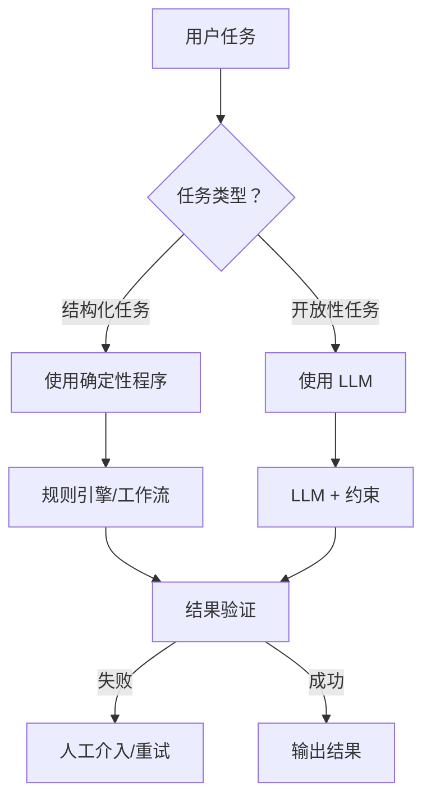

**核心原则**：

- 能用规则解决的，不用 LLM。
- LLM 负责"理解意图"和"生成草案"。
- 程序负责"执行"和"验证"。

---

## 七、Agent 的工程实践

### 7.1 Prompt 工程：Agent 的"编程"

Agent 的行为很大程度上由 Prompt 决定。一个好的 Agent Prompt 通常包含：

```markdown
# 角色定义
你是 {角色名称}，{角色描述}。

# 任务描述
你的任务是 {任务目标}。

# 可用工具
{工具列表，每个工具包含名称、描述、参数}

# 工作流
1. 分析用户需求
2. 规划执行步骤
3. 调用必要工具
4. 整合结果输出

# 输出格式
Thought: [你的思考过程]
Action: [工具名称]
Action Input: [工具参数 JSON]
Observation: [工具返回结果]
...
Final Answer: [最终答案]

# 约束条件
- 不要编造信息
- 不确定时承认不确定
- 优先使用工具获取实时信息
```

### 7.2 状态管理

Agent 需要维护状态，包括：

- 当前任务进度
- 已执行的工具调用历史
- 中间结果
- 错误信息

```python
class AgentState:
    def __init__(self):
        self.task_id: str = generate_id()
        self.status: str = "pending"  # pending, running, completed, failed
        self.history: List[Step] = []
        self.current_step: int = 0
        self.context: Dict = {}
    
    def add_step(self, step: Step):
        self.history.append(step)
        self.current_step += 1
    
    def to_dict(self) -> Dict:
        return {
            "task_id": self.task_id,
            "status": self.status,
            "history": [s.to_dict() for s in self.history],
            "current_step": self.current_step,
            "context": self.context
        }
```

### 7.3 错误处理与重试

Agent 执行过程中可能遇到各种错误：

- LLM API 错误（速率限制、超时）
- 工具调用错误（网络错误、参数错误）
- 规划错误（步骤不可执行）

```python
class AgentExecutor:
    def execute_with_retry(self, max_retries=3):
        for attempt in range(max_retries):
            try:
                return self.execute()
            except LLMError as e:
                if e.is_rate_limit:
                    time.sleep(2 ** attempt)  # 指数退避
                    continue
                raise
            except ToolError as e:
                # 让 LLM 修正工具调用
                self.state.add_error(e)
                self.replan()
                continue
        raise MaxRetriesExceeded()
```

### 7.4 可观测性

生产环境的 Agent 需要完善的可观测性：

- **日志**：记录每次 LLM 调用、工具调用的输入输出
- **追踪**：追踪任务执行的完整链路
- **指标**：成功率、延迟、token 消耗
- **回放**：能够回放任务执行过程，便于调试

```python
@traceable(run_type="llm")
def call_llm(messages, **kwargs):
    response = openai.chat.completions.create(
        model="gpt-4",
        messages=messages,
        **kwargs
    )
    return response

@traceable(run_type="tool")
def call_tool(tool_name, params):
    result = tool_registry[tool_name](**params)
    return result
```

---

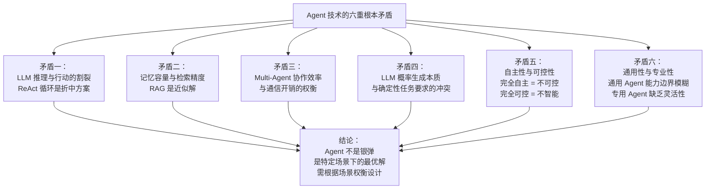

---

## 九、未来展望：Agent 技术的演进方向

### 9.1 从 ReAct 到更高效的规划

当前 ReAct 的"一步一步想"效率较低。未来的方向：

- **树状搜索（Tree of Thoughts）**：同时探索多条推理路径，选择最优解。
- **程序合成**：让 LLM 直接生成可执行程序，而非逐步推理。
- **学习规划**：从人类示范中学习规划策略，而非每次都从零推理。

### 9.2 从工具调用到统一接口

当前每个工具都需要单独定义 schema。未来的方向是统一接口：

- **MCP（Model Context Protocol）**：Anthropic 提出的开放标准，统一 LLM 与外部系统的交互。
- **操作系统化**：Agent 作为操作系统，工具作为应用程序，通过标准 API 交互。

### 9.3 从文本到多模态

未来的 Agent 将不仅处理文本，还能：

- 看懂图片、视频
- 操作 GUI（点击、输入）
- 控制物理设备（机器人、智能家居）

### 9.4 从辅助到自主

当前的 Agent 主要是人类辅助工具。未来的方向是：

- **自主研究 Agent**：能够自主提出假设、设计实验、分析结果。
- **自主编程 Agent**：能够维护大型代码库，自主修复 bug、添加功能。
- **自主决策 Agent**：在明确目标下，自主做出商业决策。

---
