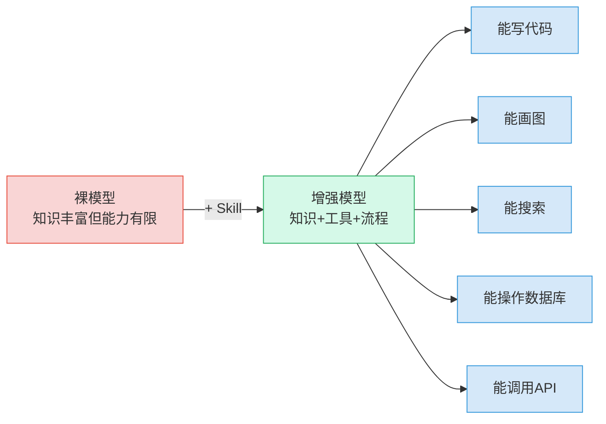
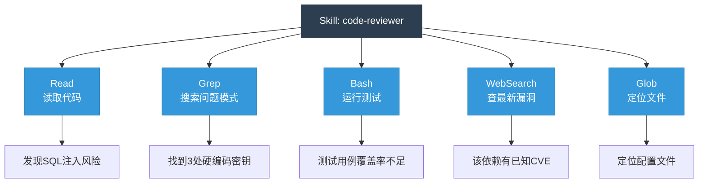
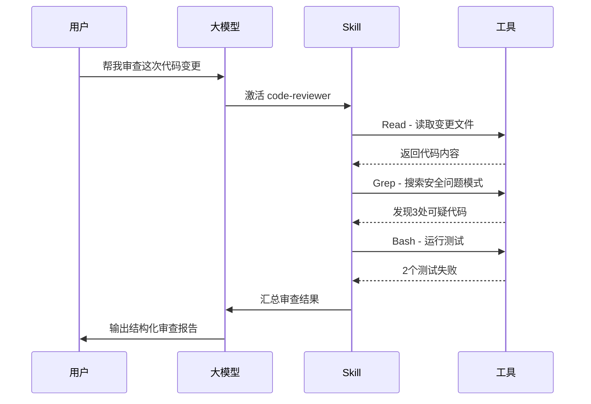
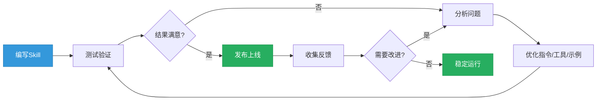
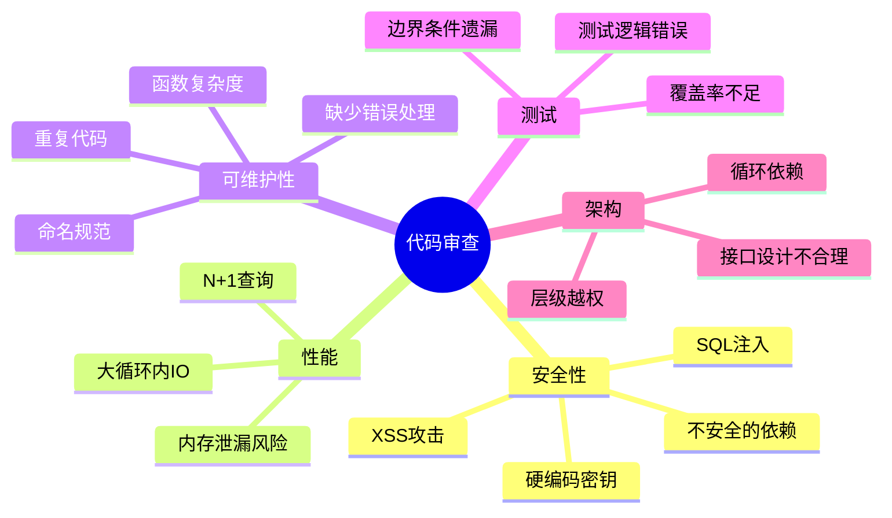
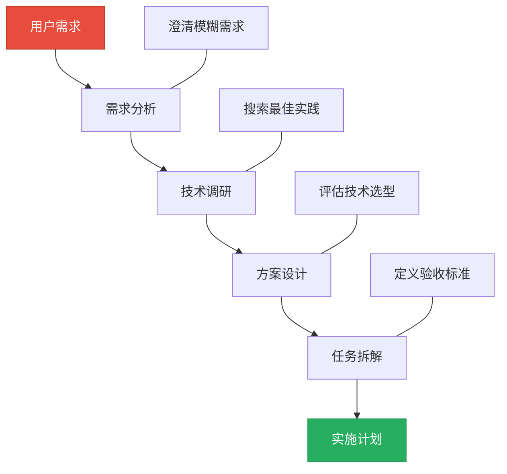
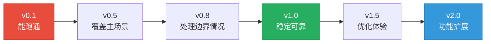

# 大模型的 Skill：让 AI 从"什么都会一点"到"样样精通"的秘密武器

> 你有没有这样的体验：让大模型帮你写段代码，它写得挺溜；但让它帮你画个架构图，它就一脸无辜地说"抱歉，我做不到"。
>
> 明明是同一个模型，为什么有时候像天才，有时候像菜鸟？
>
> 答案就藏在今天的主角——**Skill** 身上。

---

## 一、先搞清楚：Skill 到底是什么？

打个比方。

你招了一个应届生，脑子聪明、学习能力强，但他刚来公司，不会用你们的内部系统，不懂业务流程，连报销单怎么填都不知道。

这时候你怎么办？**给他一本操作手册，再安排一次培训。**

大模型的 Skill，本质上就是这本"操作手册"。

它告诉模型：**在什么场景下、用什么工具、按什么步骤、输出什么格式的结果。**

没有 Skill 的大模型，就像一个什么书都读过但没有任何实操经验的百科全书——知识丰富，但动手能力有限。

有了 Skill 的大模型，就像同一个百科全书，但现在它学会了用 Excel、会操作数据库、会调用 API——它从"知道"变成了"做到"。



---

## 二、Skill 和 Prompt 有什么区别？

这是很多人会混淆的地方。

我经常听到有人说："我写个 Prompt 不就行了，干嘛还要 Skill？"

好问题。我们来看一个对比：

| 维度 | Prompt | Skill |
|------|--------|-------|
| **本质** | 一次性的指令 | 可复用的能力包 |
| **范围** | 通常解决一个具体问题 | 覆盖一整类任务 |
| **工具** | 不能调用外部工具 | 可以绑定工具和 API |
| **流程** | 单轮对话为主 | 支持多步骤、多轮交互 |
| **复用性** | 用完即弃 | 随时调用，跨会话复用 |
| **维护性** | 改了就没了 | 版本管理、迭代升级 |

再打个比方：**Prompt 像是临时工的口头指令**，"小王，帮我把这份表格整理一下"。而 **Skill 像是正式员工的标准作业流程（SOP）**

---

## 三、Skill 的内部结构长什么样？

一个完整的 Skill，通常包含以下几个核心部分。我们逐个拆解。

### 3.1 元信息（Metadata）

就像身份证上的基本信息，它告诉系统这个 Skill 叫什么、能干什么、什么时候该用它。

```
名称：code-reviewer
描述：审查代码中的潜在问题，包括安全性、性能和可维护性
触发条件：当用户提交代码变更或请求代码审查时
```

这部分看似简单，但它非常关键——**模型就是靠这些信息来决定"什么时候该激活哪个 Skill"的。** 描述写得越精准，模型调用的准确率就越高。

### 3.2 指令（Instructions）

这是 Skill 的核心大脑，它定义了模型在执行这个 Skill 时应该遵循的行为准则。

比如一个"代码审查"Skill 的指令可能是：

- 审查代码变更时，重点关注安全性、性能和可测试性
- 每个问题必须给出具体的文件路径和行号
- 严重程度分为：Critical / Warning / Info 三级
- 不要对未修改的代码提出建议

**好的指令，是具体而非笼统的。** "注意安全"不如"检查是否存在 SQL 注入风险"。

### 3.3 工具（Tools）

这是 Skill 的手脚。没有工具的 Skill，就像没有武器的战士——有想法但执行不了。

一个 Skill 可以绑定多种工具：

| 工具类型 | 作用 | 例子 |
|----------|------|------|
| **文件读取** | 读取代码和文档 | Read、Glob |
| **文件搜索** | 在代码库中查找内容 | Grep |
| **文件编辑** | 修改代码 | Edit |
| **命令执行** | 运行终端命令 | Bash |
| **网络搜索** | 获取最新信息 | WebSearch |
| **网页抓取** | 读取网页内容 | WebFetch |



### 3.4 示例（Examples）

好的 Skill 通常会包含几个示例，告诉模型"理想的输入和输出长什么样"。这就像给新员工看几个优秀案例，让他知道标准是什么。

示例的数量不需要太多，3-5 个覆盖典型场景就够了。但质量要高——**模型会从示例中学习风格和标准**，垃圾示例教出垃圾结果。

---

## 四、Skill 的工作流程：从激活到完成

了解了结构，我们再来看 Skill 在实际运行时是怎么工作的。

整个流程可以分成五个阶段：


### 阶段一：感知——模型读懂你的意图

你输入了一句话："帮我审查一下这次 PR 的代码变更。"

模型不只是理解字面意思，它还要判断：**这是不是一个需要 Skill 来处理的任务？** 如果只是闲聊，就不需要激活 Skill；如果是专业任务，就要进入匹配阶段。

### 阶段二：匹配——找到最合适的 Skill

模型会根据你的意图，和所有可用 Skill 的描述进行匹配。

这一步的关键是**描述的质量**。如果 Skill 的描述写得太模糊，模型可能选错；如果描述写得太窄，模型可能在需要的时候想不到用它。

**实操建议：** Skill 的描述要用"用户视角"来写，而不是"开发者视角"。

❌ 差的描述：`基于AST分析实现代码静态检查`

✅ 好的描述：`审查代码中的潜在问题，包括安全漏洞、性能瓶颈和代码规范违反`

### 阶段三：执行——调用工具、多步推理

这是 Skill 最有价值的部分。它不是一步到位地给出答案，而是像一个有经验的工程师一样，**一步一步地分析和解决问题**。

以代码审查为例：

1. **先读取变更** → 知道改了什么
2. **搜索上下文** → 理解为什么要改
3. **检查安全风险** → 是否有注入、泄露
4. **检查性能影响** → 是否引入了瓶颈
5. **运行测试** → 验证改动是否正确
6. 



注意看，整个过程模型**不是靠猜**，而是**靠工具去验证**。这就是 Skill 比 Prompt 强大的根本原因——它有"手"有"脚"，能真正去验证和执行。

### 阶段四：验证——确保结果靠谱

执行完了不等于做对了。好的 Skill 会有自检环节：

- 代码改动后能不能编译通过？
- 测试用例有没有失败？
- 输出格式是否符合预期？

**没有验证的输出，就是没有质检的产品。**

### 阶段五：输出——结构化交付

最后，Skill 会把结果以结构化的方式交付给你。而不是给你一坨文字让你自己去整理。

比如代码审查的结果可能是：

```
🔍 审查结果摘要
├── 🔴 Critical (1): SQL注入风险 - src/api/user.py:42
├── 🟡 Warning (2): 性能问题 - 大循环内查询数据库
└── 🟢 Info (1): 建议补充单元测试
```

---

## 五、从零开始：手把手教你创建一个 Skill

理论说了这么多，该动手了。

我们来创建一个实战 Skill：**Git 提交助手**——帮你自动分析代码变更、生成规范的 commit message、并完成提交。

### Step 1：想清楚这个 Skill 要干什么

在动手写之前，先回答三个问题：

1. **触发场景**：什么时候需要这个 Skill？ → 用户想提交代码时
2. **可用工具**：需要什么能力？ → 读代码（Read）、看变更（Bash/git）、写文件（Edit）
3. **输出标准**：最终交付什么？ → 规范的 commit message + 成功的 git commit

### Step 2：编写 Skill 文件

一个 Skill 文件通常是 Markdown 格式（比如 `SKILL.md`），结构如下：

```markdown
---
name: git-committer
description: 分析代码变更并生成规范的 Git 提交
tools:
  - Bash
  - Read
  - Glob
  - Grep
---

# Git 提交助手

## 指令

当用户请求提交代码时，按以下步骤执行：

1. 运行 `git status` 查看未跟踪和已修改的文件
2. 运行 `git diff` 查看暂存和未暂存的变更内容
3. 运行 `git log --oneline -5` 查看最近的提交记录，了解项目的提交风格
4. 分析所有变更，归纳变更的类型（新功能/修复/重构/文档/测试等）
5. 起草一条 commit message，遵循以下规范：
   - 使用祈使句（如 "add feature" 而非 "added feature"）
   - 第一行不超过 50 个字符
   - 如需详细说明，空一行后补充正文
6. 将相关文件添加到暂存区
7. 执行 git commit

## 规则

- 不要提交可能包含密钥的文件（.env、credentials.json 等）
- commit message 要关注"为什么"而非"做了什么"
- 如果没有实际变更，不要创建空提交
```

### Step 3：测试和调优

Skill 写完之后，一定要测试。测试不是随便试试，而是要**覆盖关键场景**：

| 测试场景 | 验证要点 |
|----------|----------|
| 有多个文件变更 | commit message 是否准确概括了所有变更 |
| 只修改了文档 | 是否识别为 docs 类型 |
| 包含敏感文件 | 是否正确拒绝提交 .env 等文件 |
| 没有变更 | 是否正确提示"没有可提交的变更" |

### Step 4：迭代优化

根据测试结果，逐步优化 Skill 的指令。常见的优化方向：

- **更具体的规则**：把"分析变更"细化为"按文件类型分组分析变更"
- **更多的边界条件**：增加"如果暂存区为空，先提示用户选择文件"
- **更好的输出格式**：增加"提交成功后显示 git log 确认"



---

## 六、Skill 的常见分类和实战案例

掌握了创建方法之后，我们来看看业界常见的 Skill 类型。每一种都有它独特的价值。

### 6.1 代码审查 Skill

**这是最经典、最实用的 Skill 类型之一。**

它不只是"看看代码有没有 bug"这么简单。一个好的代码审查 Skill，会从多个维度全面审视：



### 6.2 任务执行 Skill

这种 Skill 的核心是**按步骤完成复杂任务**，像项目管理一样把大任务拆成小任务，逐一执行。

它的特点是有一个"任务清单"（Todo List），每完成一项就打钩，确保不遗漏：

```
☐ 分析现有代码结构
☐ 设计新的缓存层
☐ 实现缓存逻辑
☐ 编写单元测试
☐ 更新相关文档
☑ 运行测试确保通过
```

### 6.3 搜索研究 Skill

当你需要深入研究一个技术问题、查找某个 API 的用法、或者调研一个新框架时，这种 Skill 就派上用场了。

它会：
1. 把你的问题拆解成多个搜索关键词
2. 并行搜索多个来源
3. 抓取和阅读搜索结果
4. 综合分析后给出答案

**关键在于"综合"——** 不是简单地把搜索结果丢给你，而是经过理解、对比、提炼后的输出。

### 6.4 文档生成 Skill

这种 Skill 可以自动读取代码、理解逻辑，然后生成文档。但好的文档 Skill 不会逐行翻译代码，而是：

- **先理解架构**：这个模块在整体中的位置和作用
- **再提炼接口**：对外暴露了什么能力
- **最后补充细节**：关键逻辑的说明

### 6.5 设计规划 Skill

这是一种"思考型"Skill，它不直接写代码，而是帮你理清思路、制定方案。



---

## 七、高级玩法：Skill 的组合与编排

单个 Skill 已经很强了，但真正的威力在于**组合使用** "审查代码质量"

✅ **正确做法：** "审查代码变更中的安全漏洞（SQL注入、XSS、硬编码密钥）和性能问题（N+1查询、大循环IO），每个问题需标注文件路径、行号和严重程度"

**原则：具体到让模型不需要"猜"你的意思。**

### 误区二：给了太多工具

工具不是越多越好。给模型 10 个工具，它可能在选择工具时犹豫不决；给 3 个精准的工具，它反而执行得更利落。

**原则：只给 Skill 真正需要的工具，就像厨师不需要电焊机。**

### 误区三：忽略边界条件

很多人写 Skill 只考虑"正常路径"，忘了异常情况：

- 用户输入为空怎么办？
- 工具调用失败怎么办？
- 结果不符合预期怎么办？

**原则：每一步都想想"如果出错了怎么办"。**

### 误区四：没有示例

纯靠文字描述，模型可能理解偏差。加几个示例，准确率会显著提升。

**原则：3-5 个高质量示例，胜过 500 行指令说明。**

### 误区五：一次想做到完美

好的 Skill 是迭代出来的，不是一次写出来的。先跑通核心流程，再逐步优化。

**原则：先让 Skill 能跑起来，再让它跑得好。**



---

## 九、Skill 的未来：从"工具"到"同事"

Skill 的演进方向，其实很清晰：


**第一代**，就是我们现在最常见的——写好固定指令，模型按部就班执行。像一个听话的实习生。

**第二代**，模型开始能根据任务动态规划执行路径，灵活组合工具。像一个能独立思考的专员。

**第三代**，模型能从执行结果和用户反馈中学习，自动优化自己的 Skill。像一个会复盘、会成长的骨干。

**第四代**，模型能自主判断该做什么、怎么做，甚至主动发现问题和机会。像一个值得信赖的同事。

我们现在正处于从第一代迈向第二代的关键节点。

---