# 大模型主动创造算法完全指南：从思维链到智能体

## 前言

当我们谈论大语言模型时，往往会惊叹于它们流畅的语言表达能力、丰富的知识储备，以及在各种考试和任务中展现出的惊人能力。然而，这些能力大多属于“被动响应”的范畴——用户给出提示，模型生成回答。但你有没有想过：大模型能否像人类一样，主动规划、主动探索、主动创造？

答案是肯定的。近年来，研究者们开发了一系列让大模型具备“主动创造”能力的算法和技术，从最初的思维链（Chain-of-Thought），到推理与行动结合的ReAct，再到能够自主规划和工具使用的AI Agent，这些技术正在逐步解锁大模型的创造潜力。

本文将带您深入了解大模型主动创造算法的完整知识体系，从基础概念到高级应用，从理论原理到实践技巧，层层递进，循序渐进。无论您是AI领域的新手，还是有一定经验的技术爱好者，相信都能从中获得新的收获。

---

## 第一章：重新理解大模型的“创造”

### 1.1 什么是主动创造

在深入算法之前，我们需要先理解一个根本性问题：什么是大模型的“主动创造”？

传统上，大模型的工作模式是“输入-输出”的单向过程：

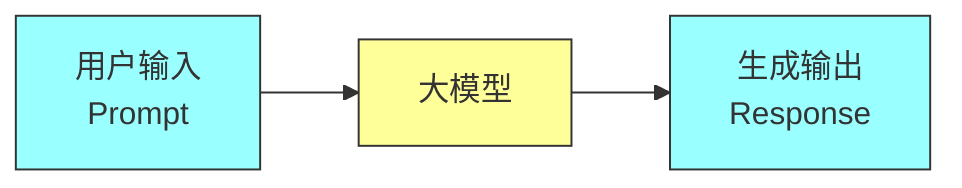

用户给出一个问题或指令，大模型经过推理后生成回答。这种模式下，大模型就像一个被动的应答者，需要等待用户的输入才能行动。

而“主动创造”则是指大模型能够：

- **自主规划**：面对复杂任务时，能够分解任务、制定步骤
- **主动探索**：能够主动搜索信息、调用工具、验证假设
- **自我反思**：能够评估自身输出的质量并进行改进
- **持续行动**：能够在一个循环中不断采取行动直到达成目标

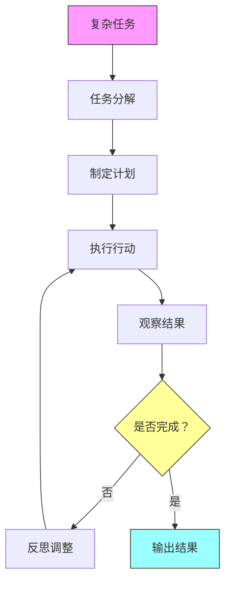

### 1.2 从被动到主动的演进

大模型实现主动创造的能力并非一蹴而就，而是经历了漫长的技术演进：

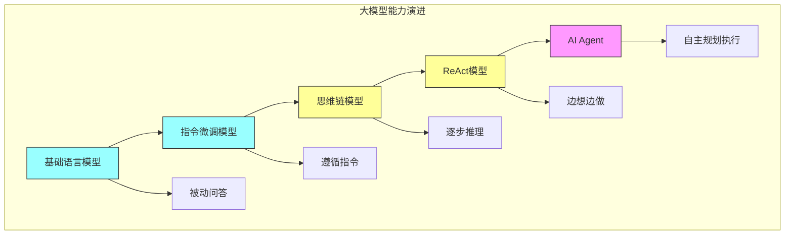

**第一阶段：基础语言模型**
早期的语言模型只能进行简单的续写，无法理解用户意图，输出质量也不稳定。

**第二阶段：指令微调（Instruction Tuning）**
通过对模型进行指令微调，使其能够理解用户意图并生成符合要求的回答。这是ChatGPT等聊天机器人的基础。

**第三阶段：思维链（Chain-of-Thought）**
引入中间推理步骤，让模型“学会思考”，显著提升了复杂推理能力。

**第四阶段：ReAct（Reasoning + Acting）**
将推理与行动结合，让模型能够调用工具、获取外部信息。

**第五阶段：AI Agent**
具备完整的规划、执行、反思能力，能够自主完成复杂任务。

---

## 第二章：思维链（Chain-of-Thought）——让模型学会思考

### 2.1 思维链的诞生

在思维链出现之前，大模型面临一个困境：对于复杂问题，如数学应用题、多步推理题，模型往往会给 出错误的答案，即便模型本身具备相关知识。

例如，面对这样的问题：

> 小明有10个苹果，给了小红3个，又买了5个，现在小明有多少个苹果？

直接让模型回答，模型可能会因为“粗心”而算错。但如果我们引导模型“一步步思考”，结果往往会准确得多。

思维链（Chain-of-Thought，简称CoT）正是基于这一洞察而产生的技术。它的核心思想是：**引导模型生成中间的推理步骤，而不是直接给出答案**。

### 2.2 思维链的原理

思维链的工作原理可以通过以下对比来说明：

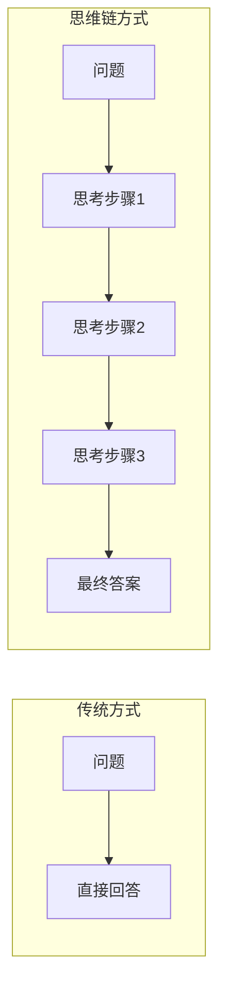

**传统提示（Standard Prompt）：**
```
问题：小明有10个苹果，给了小红3个，又买了5个，现在小明有多少个苹果？
答案：12个
```

**思维链提示（CoT Prompt）：**
```
问题：小明有10个苹果，给了小红3个，又买了5个，现在小明有多少个苹果？
让我们一步步思考：
1. 小明原来有10个苹果
2. 给小红3个后，还剩10-3=7个
3. 又买了5个，现在有7+5=12个
答案：12个
```

### 2.3 思维链的实现方式

#### 方式一：Few-shot 示例引导

在提示中提供几个包含推理过程的示例，让模型学习这种“逐步思考”的模式：

```
示例1：
问题：一个水池有200升水，每小时注入15升，同时每小时流出8升，6小时后水池有多少水？
思考：
1. 每小时净注入量 = 15 - 8 = 7升
2. 6小时净注入量 = 7 × 6 = 42升
3. 最终水量 = 200 + 42 = 242升
答案：242升

示例2：
[继续提供更多示例...]

问题：[你的问题]
```

#### 方式二：Zero-shot 触发

研究表明，只需在问题后加上一句“让我们一步步思考”（Let's think step by step），就能显著提升模型的推理能力：

```
问题：[复杂问题]
让我们一步步思考。
```

这种简单却有效的方法利用了模型在预训练阶段学到的知识，激发了模型的推理潜能。

### 2.4 思维链的关键要素

思维链的有效性依赖于以下几个关键要素：

#### 1. 中间步骤的完整性

每个推理步骤应该是一个完整的逻辑单元，不应跳跃或省略：

```mermaid
graph TB
    A["完整推理"] --> B["步骤1：理解问题"]
    B --> C["步骤2：提取关键信息"]
    C --> D["步骤3：应用公式/规则"]
    D --> E["步骤4：计算"]
    E --> F["步骤5：验证结果"]
    
    A2["不完整推理"] --> B2["步骤1：..."
    B2 --> C2["直接跳到结果"]
    
    style A fill:#9ff,stroke:#333
    style A2 fill:#f99,stroke:#333
```

#### 2. 逻辑链的一致性

各步骤之间应该有清晰的逻辑关系，形成一条完整的推理链：

```
正确：第一步 → 因为第一步 → 所以第二步 → 因为第二步 → 所以第三步 → 最终答案
错误：第一步...第二步...第三步（各步骤之间没有逻辑关联）
```

#### 3. 结果的可验证性

推理的最终结果应该是可验证的，这样模型可以自我检查：

- 数学问题可以验算
- 事实性问题可以查证
- 逻辑问题可以推敲

### 2.5 思维链的变体

研究者们基于基础思维链，开发了多种变体：

#### 1. 自洽性思维链（Self-Consistency）

核心思想是“集思广益”——生成多条推理路径，然后通过投票选择最一致的答案：

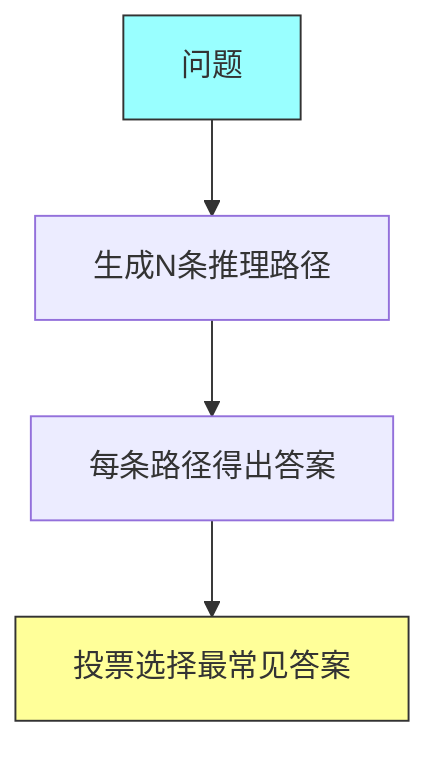

**实现方式：**
```
问题：[复杂问题]
请生成多个不同的解题思路，然后综合分析给出最终答案。
```

#### 2. 思维链+工具（CoT + Tools）

在推理过程中调用外部工具进行计算或查证：

```
问题：2024年北京马拉松冠军的成绩是多少？
思考：
1. 我需要查找2024年北京马拉松的比赛数据
2. 调用搜索工具...
3. 根据搜索结果...
4. 得出结论
```

#### 3. 思维树（Tree of Thoughts）

将思维链扩展为树状结构，同时探索多个推理方向：

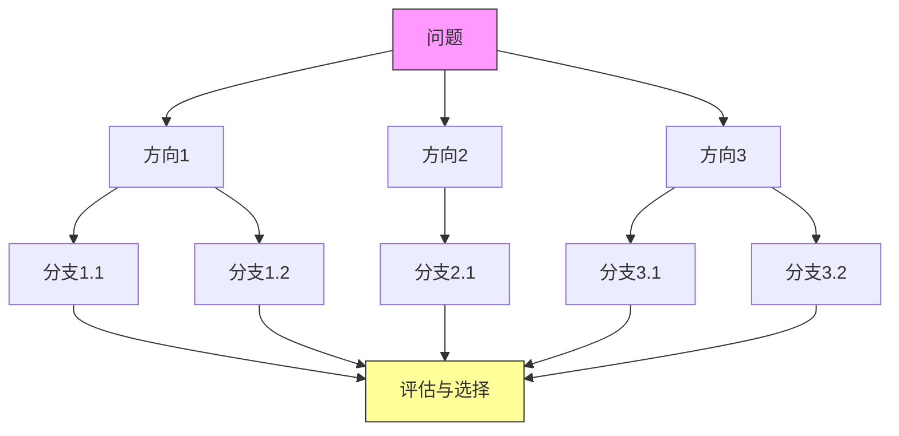

---

## 第三章：ReAct——让模型边想边做

### 3.1 从思维到行动

思维链让模型学会了“思考”，但它仍然停留在“纸上谈兵”的阶段——模型可以在脑海中推理，却无法与外部世界交互，无法获取新信息，无法执行具体行动。

现实世界中，很多问题光靠“想”是无法解决的：

- 查资料需要搜索
- 计算需要工具
- 验证假设需要实验
- 执行任务需要操作

ReAct（Reasoning and Acting）正是为了解决这一问题而诞生的。它的核心思想是：**让模型的推理过程与外部行动交织进行，形成“思考-行动-观察”的闭环**。

### 3.2 ReAct的工作原理

ReAct的工作流程可以概括为以下几个步骤：

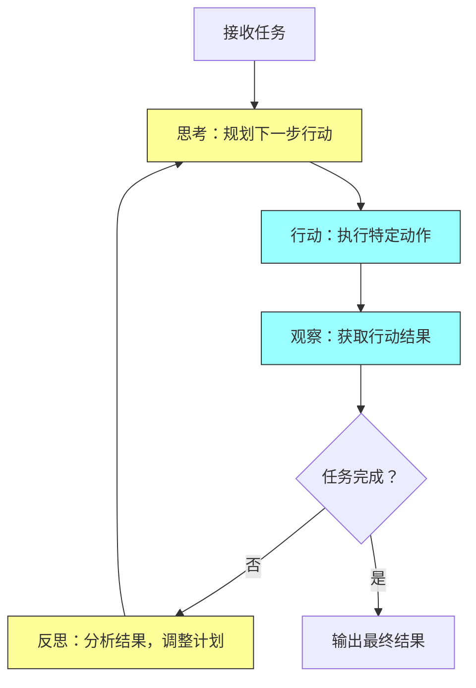

**与传统方式的区别：**

| 对比维度 | 传统方式 | ReAct |
|----------|----------|-------|
| 信息来源 | 仅依赖训练知识 | 可以获取实时信息 |
| 行动能力 | 无 | 可以调用工具 |
| 反馈机制 | 无 | 基于行动结果调整 |
| 任务复杂度 | 有限 | 可以处理复杂任务 |

### 3.3 ReAct的具体实现

在实际应用中，ReAct通过以下几个关键组件实现：

#### 1. 动作空间（Action Space）

定义模型可以执行的各种动作：

```go
// 动作空间示例
ActionSpace = {
    "search": "搜索相关信息",
    "calculate": "执行数学计算",
    "lookup": "查询特定信息",
    "execute": "执行代码",
    "finish": "完成任务并输出结果"
}
```

#### 2. 观察空间（Observation Space）

定义模型可以获取的各种信息：

```
观察结果示例：
- 搜索结果：关于[主题]的百科介绍...
- 计算结果：125 + 87 = 212
- 代码输出：程序执行成功，输出为...
```

#### 3. 推理与行动的交织

ReAct的提示通常包含以下结构：

```
任务：[用户问题]

请按照以下格式思考和行动：
思考：分析当前情况，规划下一步行动
行动：[选择动作和参数]
观察：[获取行动结果]
...（重复上述循环直到任务完成）

开始：
思考：...
```

### 3.4 ReAct的实际案例

让我们通过一个具体例子来理解ReAct的工作方式：

**任务：** 查找2024年诺贝尔物理学奖获得者的主要贡献

```
思考：我需要搜索2024年诺贝尔物理学奖的相关信息。
行动：search 2024年诺贝尔物理学奖
观察：2024年诺贝尔物理学奖授予了Pierre Agostini、Ferenc Krausz和Anne L'Huillier，以表彰他们在产生阿秒光脉冲方面的实验方法。
思考：三位获奖者的主要贡献是产生阿秒光脉冲，这是非常短的光脉冲，可以用于研究电子运动。
行动：finish 三位科学家因在产生阿秒光脉冲方面的开创性贡献获奖，这项技术让我们能够观察电子的快速运动。
```

### 3.5 ReAct vs 思维链

ReAct与思维链有本质的区别：

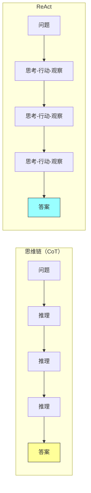

**思维链特点：**
- 推理过程在“脑海”中进行
- 依赖模型内部知识
- 可能产生“幻觉”（一本正经地错误）
- 适合有确定答案的推理问题

**ReAct特点：**
- 推理与外部世界交互
- 可以验证信息准确性
- 行动成本较高（API调用等）
- 适合需要获取外部信息的任务

### 3.6 ReAct的局限性

尽管ReAct比思维链更“有用”，但它也有自己的局限：

#### 1. 错误传播

推理中的错误可能导致错误的行动，进而导致错误的观察结果，形成恶性循环：

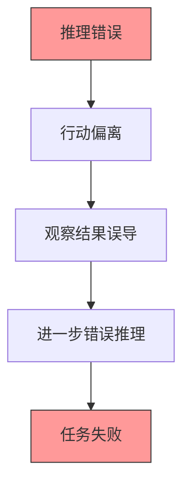

#### 2. 动作空间受限

模型只能执行预设的动作，对于未定义的动作无能为力。

#### 3. 观察噪声

外部返回的信息可能包含噪声或无关内容，模型需要具备过滤能力。

---

## 第四章：思维树（Tree of Thoughts）——探索更多可能性

### 4.1 从线性到分支

思维链和ReAct都采用“线性”推理方式——一条道走到黑。但在现实问题中，正确的答案往往不是唯一的，错误的尝试也可能是必要的探索。

思维树（Tree of Thoughts，简称ToT）正是为了解决这一问题而设计的。它的核心思想是：**允许模型同时探索多条推理路径，就像人类思考时会考虑多种可能性一样**。

### 4.2 思维树的结构

思维树将推理过程组织为树状结构：

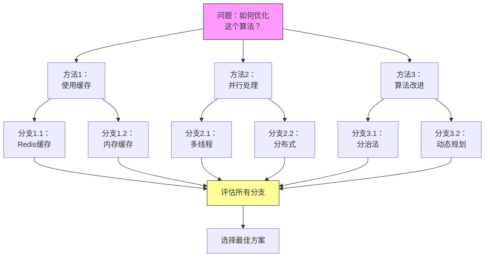

### 4.3 思维树的工作流程

思维树通常包含以下步骤：

#### 1. 思想生成（Thought Generation）

对于每个节点，生成多个可能的“想法”或“方向”：

```
当前状态：需要优化查询性能
可能的方向：
- 方向1：增加缓存层
- 方向2：优化数据库索引
- 方向3：使用CDN加速
- 方向4：读写分离
```

#### 2. 状态评估（State Evaluation）

对每个分支进行评估，判断其潜力：

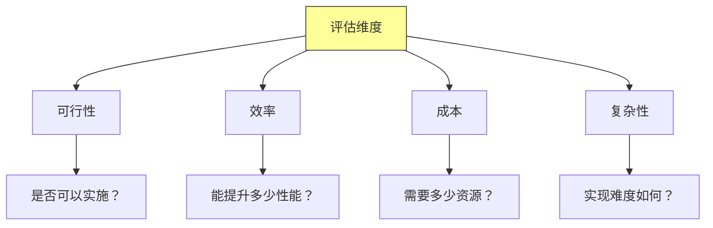

#### 3. 剪枝与选择（Pruning and Selection）

基于评估结果，剪掉明显不佳的分支，选择最有潜力的分支继续探索：

| 分支 | 可行性 | 效率提升 | 成本 | 复杂性 | 决策 |
|------|--------|----------|------|--------|------|
| 缓存层 | 高 | 中 | 低 | 低 | ✓ 保留 |
| 数据库索引 | 高 | 高 | 中 | 中 | ✓ 保留 |
| CDN | 低 | 低 | 高 | 中 | ✗ 剪掉 |
| 读写分离 | 中 | 高 | 高 | 高 | ? 待定 |

#### 4. 回溯与恢复

当某个分支遇到死胡同时，可以回溯到之前的节点，尝试其他方向：

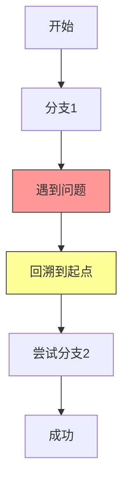

### 4.4 思维树的优势

与思维链相比，思维树具有以下优势：

| 优势 | 说明 |
|------|------|
| **全局视角** | 同时考虑多个方向，不执于一端 |
| **错误恢复** | 某条路走不通时可以换条路 |
| **创造性** | 更有可能发现非传统的解决方案 |
| **适应性** | 可以根据实际情况动态调整策略 |

### 4.5 思维树的应用场景

思维树特别适合以下类型的任务：

1. **复杂问题求解**：多步操作、多条件判断的问题
2. **创意生成**：需要多个想法、多种可能性的任务
3. **战略规划**：需要考虑多种方案并做出选择的场景
4. **代码调试**：尝试多种可能的问题原因并逐一排查

---

## 第五章：AI Agent——自主行动的智能体

### 5.1 什么是AI Agent

如果说思维链让模型“学会思考”，ReAct让模型“边想边做”，那么AI Agent则让模型成为真正“自主行动”的智能体。

AI Agent（人工智能代理）是一种能够自主感知环境、规划行动、执行任务并反思改进的系统。它不仅具备推理能力，还能将推理转化为实际行动，完成从简单到复杂的各种任务。

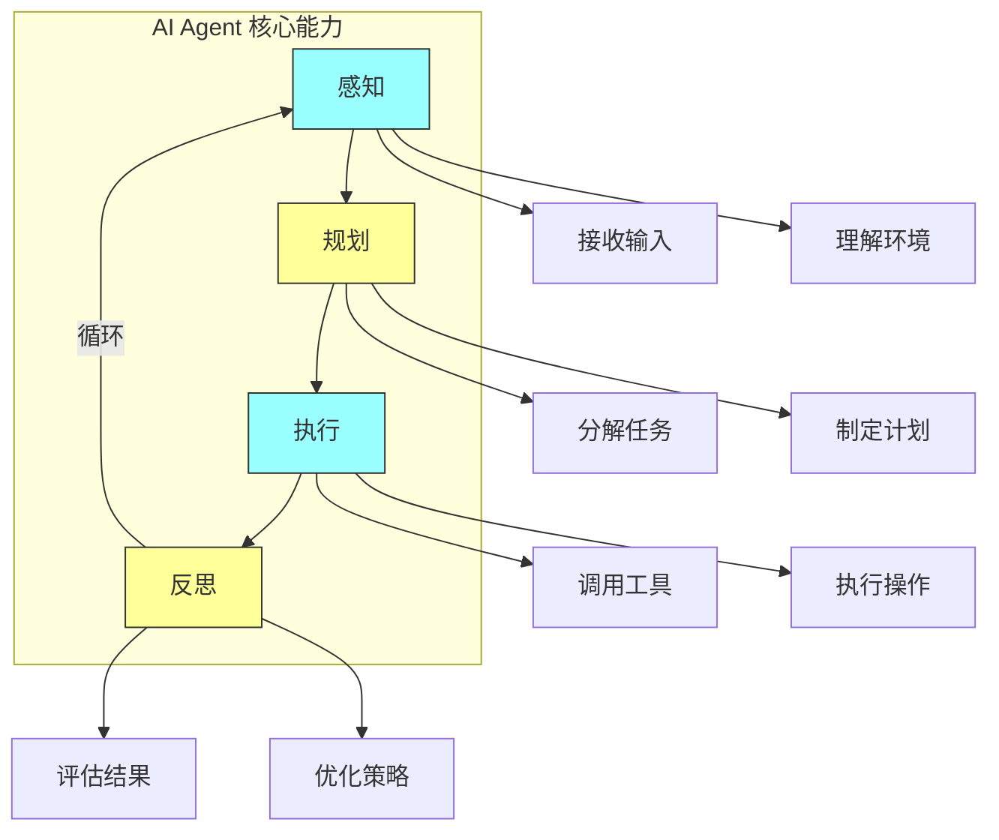

### 5.2 AI Agent的架构

一个完整的AI Agent通常包含以下组件：

#### 1. 记忆系统（Memory）

Agent需要记住两类信息：

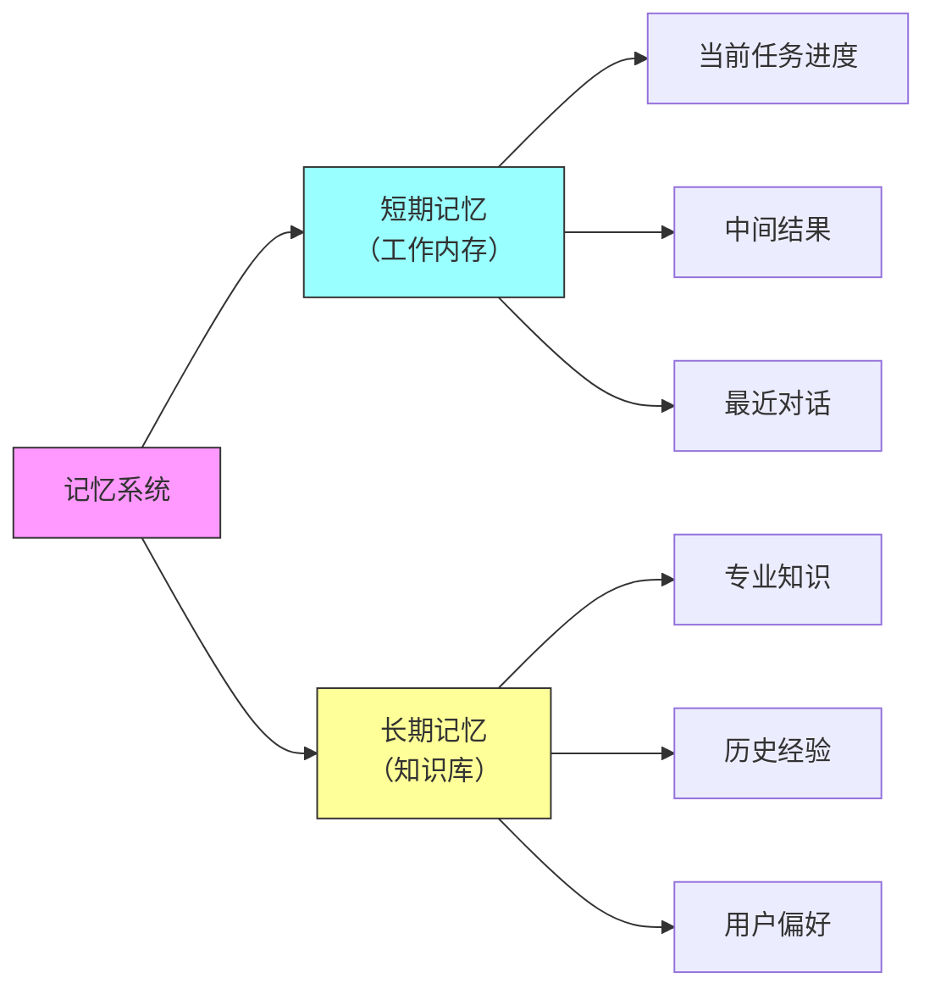

**短期记忆**：类似人类的工作记忆，存储当前任务的相关信息
**长期记忆**：存储Agent的专业知识和历史经验，可在多轮对话中使用

#### 2. 工具箱（Toolbox）

Agent能够调用各种工具来扩展能力：

| 工具类型 | 功能 | 示例 |
|----------|------|------|
| 搜索工具 | 获取外部信息 | Google搜索、维基百科 |
| 计算工具 | 执行精确计算 | 数学计算器、代码执行器 |
| API工具 | 与外部系统交互 | 发送邮件、调用第三方API |
| 文件工具 | 处理文件和多媒体 | 读取PDF、生成图片 |

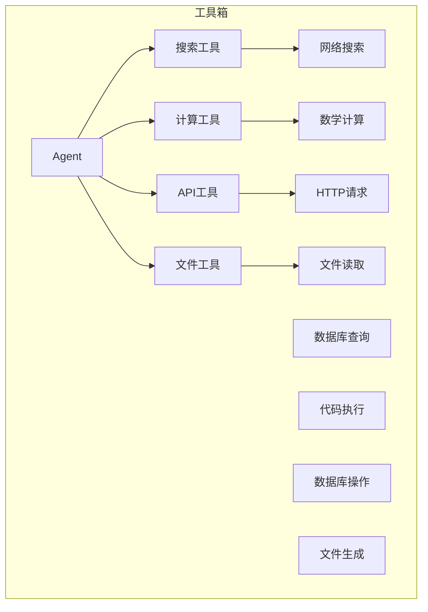

#### 3. 规划器（Planner）

负责将复杂任务分解为可执行的步骤：

```mermaid
flowchart TD
    A["复杂任务"] --> B["任务分解"]
    B --> C["步骤1：...]
    B --> D["步骤2：..."]
    B --> E["步骤3：..."]
    C --> F["依赖分析"]
    D --> F
    E --> F
    F --> G["执行顺序"]
    
    style A fill:#f9f,stroke:#333
    style G fill:#ff9,stroke:#333
```

#### 4. 执行器（Executor）

负责按照计划执行具体操作：

- 调用工具
- 处理异常
- 记录日志

#### 5. 评估器（Evaluator）

负责评估执行结果并决定后续行动：

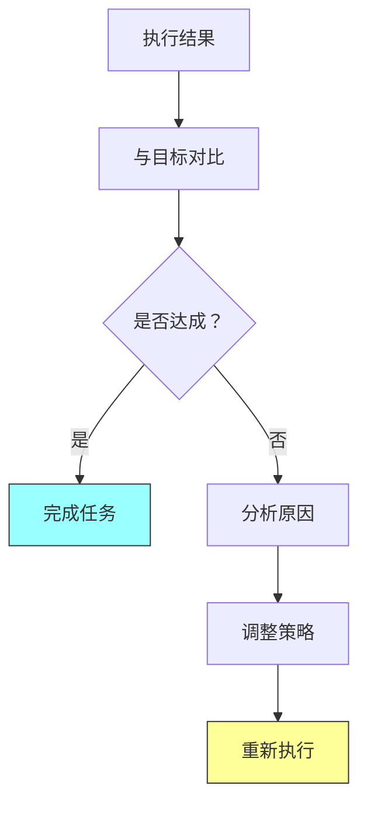

### 5.3 Agent的实现模式

#### 1. ReAct模式

最基本的Agent模式，核心是“思考-行动-观察”的循环：

```
while not task_complete:
    thought = think(current_state)
    action = select_action(thought)
    observation = execute(action)
    update_state(observation)
```

#### 2. Plan-and-Execute模式

先制定完整计划，再逐步执行：

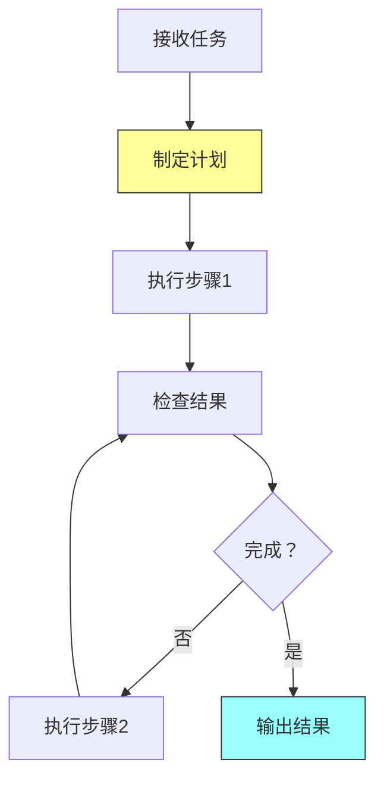

#### 3. Self-Critic模式

引入自我批评机制，在执行过程中不断反思：

```
Execute step → Evaluate result → 
If good: continue
If bad: criticize → revise plan → retry
```

### 5.4 主流Agent框架

#### 1. LangChain

LangChain是最流行的LLM应用开发框架之一，提供了丰富的Agent组件：

```go
// LangChain Agent 示例结构
from langchain.agents import AgentExecutor, create_openai_functions_agent
from langchain import hub

# 加载提示模板
prompt = hub.pull("hwchase17/openai-functions-agent")

# 创建Agent
agent = create_openai_functions_agent(llm, tools, prompt)

# 执行Agent
agent_executor = AgentExecutor(agent=agent, tools=tools)
result = agent_executor.invoke({"input": "帮我查一下明天北京的天气"})
```

**LangChain Agent 核心组件：**：训练数据有截止日期，无法获取最新信息
2. **计算精确性**：大模型做数学计算容易出错
3. **行动能力**：无法执行实际操作，如发邮件、订票
4. **幻觉风险**：可能生成看似合理但实际错误的信息

工具调用（Tool Calling）正是为了解决这些问题而设计的。

### 6.2 Function Calling机制

Function Calling是大语言模型调用外部函数/工具的能力：

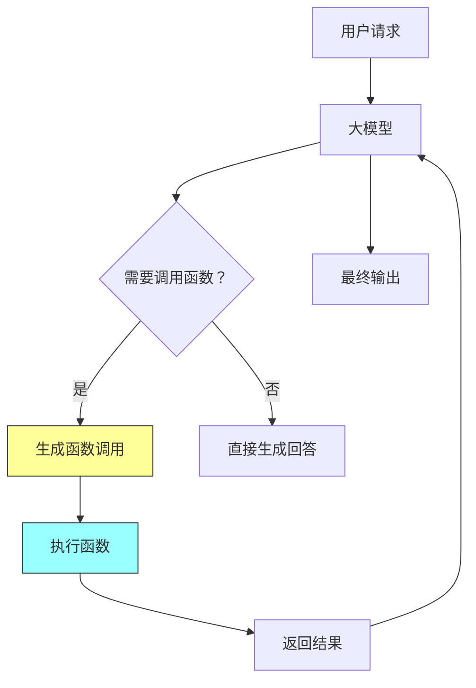

**Function Calling的工作流程：**

1. **模型识别**：模型判断是否需要调用外部函数
2. **生成调用**：模型生成函数名和参数
3. **执行函数**：外部系统执行函数并返回结果
4. **整合结果**：模型将函数结果整合到最终回答中

### 6.3 工具定义规范

通常，工具通过JSON Schema定义：

```json
{
  "name": "search_wikipedia",
  "description": "搜索维基百科获取信息",
  "parameters": {
    "type": "object",
    "properties": {
      "query": {
        "type": "string",
        "description": "搜索关键词"
      },
      "limit": {
        "type": "integer",
        "description": "返回结果数量限制",
        "default": 5
      }
    },
    "required": ["query"]
  }
}
```

### 6.4 常用工具类型

#### 1. 搜索工具

```go
// 搜索工具示例
Tool search = {
    name: "web_search",
    description: "搜索互联网获取信息",
    parameters: {
        query: "搜索内容",
        max_results: "最多返回结果数"
    }
}
```

#### 2. 计算工具

```go
Tool calculator = {
    name: "calculate",
    description: "执行数学计算",
    parameters: {
        expression: "数学表达式"
    }
}
```

#### 3. 代码执行工具

```go
Tool code_executor = {
    name: "execute_code",
    description: "执行代码并返回结果",
    parameters: {
        language: "编程语言",
        code: "要执行的代码"
    }
}
```

#### 4. API调用工具

```go
Tool http_request = {
    name: "http_request",
    description: "发送HTTP请求",
    parameters: {
        method: "GET/POST/PUT/DELETE",
        url: "请求URL",
        headers: "请求头",
        body: "请求体"
    }
}
```

### 6.5 工具选择策略

当有多个工具可用时，模型需要决定使用哪个工具：

```mermaid
flowchart TD
    A["任务需求"] --> B["匹配工具"]
    B --> C["评估工具适用性"]
    C --> D["选择最佳工具"]
    D --> E["生成调用参数"]
    
    style A fill:#9ff,stroke:#333
    style D fill:#ff9,stroke:#333
```

**选择策略：**
1. **功能匹配**：工具功能是否满足任务需求
2. **效率优先**：哪个工具能更快获得结果
3. **准确性**：哪个工具的结果更可靠
4. **成本考虑**：调用不同工具的成本差异

---

## 第七章：提示工程——激活主动创造能力

### 7.1 提示工程的重要性

无论算法多么先进，最终都需要通过提示（Prompt）来激活模型的能力。好的提示可以充分激发模型的“主动创造”潜力，而糟糕的提示则可能让模型“迷失方向”。

### 7.2 核心提示策略

#### 1. 角色扮演（Role Prompting）

通过设定角色来引导模型的思考方式：

```
你是一位经验丰富的软件架构师，专门负责设计高性能、可扩展的系统。请分析以下需求并提供架构建议：
[需求描述]
```

#### 2. 分步引导（Step-by-Step）

将复杂任务分解为多个步骤，引导模型逐步完成：

```
分析这个问题需要以下步骤：
1. 首先，识别问题的核心要素
2. 然后，列出所有可能的解决方案
3. 接着，评估每个方案的优缺点
4. 最后，选择最佳方案并详细说明理由

问题：[你的问题]
```

#### 3. 示例注入（Few-shot Learning）

通过示例展示期望的输出格式和推理过程：

```
示例1：
输入：分析这家公司的财务状况
输出：分析将包括：1) 营收增长趋势 2) 利润率变化 3) 现金流状况 4) 债务水平 5) 综合评估

示例2：
输入：评估这个产品的市场表现
输出：评估将包括：1) 市场份额变化 2) 用户增长率 3) 竞品对比 4) 用户评价 5) 发展建议

请分析：[你的输入]
```

#### 4. 思维链激活

明确要求模型展示推理过程：

```
请在回答时：
1. 先分析问题
2. 列出关键因素
3. 进行逻辑推导
4. 得出结论
5. 验证答案合理性

问题：[你的问题]
```

#### 5. 约束设置

通过约束条件引导模型的输出方向：

```
请在回答时遵循以下约束：
- 保持客观中立
- 数据必须来自可靠来源
- 结论需要有充分论据支撑
- 避免过度推测

问题：[你的问题]
```

### 7.3 高级提示模式

#### 1. ReAct提示模板

```
你是一个智能助手，可以通过搜索、计算和执行操作来完成任务。

可用工具：
- search: 搜索互联网信息
- calculate: 执行数学计算
- finish: 完成任务并输出结果

任务：[用户任务]

请按照以下格式思考和行动：
思考：[分析当前情况]
行动：[选择工具和参数]
观察：[工具返回的结果]
...（重复直到任务完成）
```

#### 2. Agent提示模板

```
你是一个专业的AI助手，名字叫[名字]。

你的工作流程：
1. 理解用户需求
2. 制定执行计划
3. 逐步执行任务
4. 检查完成质量
5. 优化和完善结果

可用能力：
- [能力1描述]
- [能力2描述]
- [能力3描述]

请开始帮助用户：[任务描述]
```

#### 3. 反思提示模板

```
回答这个问题后，请进行自我检查：
1. 答案是否完整？
2. 推理过程是否正确？
3. 是否有遗漏的重要因素？
4. 结论是否有充分的依据？

如有不足，请修正后再输出最终答案。

问题：[你的问题]
```

### 7.4 提示优化技巧

#### 1. 迭代优化

```mermaid
flowchart TD
    A["初始提示"] --> B["测试效果"]
    B --> C{"效果如何？"}
    C -->|"不足"| D["分析问题"]
    D --> E["修改提示"]
    E --> B
    C -->|"良好"| F["确定最终版本"]
    
    style F fill:#9ff,stroke:#333
```

#### 2. 元素组合

- 角色 + 任务 + 格式 + 约束
- 示例 + 要求 + 验证

#### 3. 避免常见错误

| 错误 | 后果 | 修正 |
|------|------|------|
| 指令过于模糊 | 模型“自由发挥” | 具体明确 |
| 约束过多 | 模型“畏手畏脚” | 抓大放小 |
| 逻辑矛盾 | 模型“无所适从” | 前后一致 |
| 示例错误 | 模型“学坏” | 示例需正确 |

---

## 第八章：实战案例

### 8.1 案例一：旅行规划Agent

**任务**：为用户规划一次7天的云南旅行

```mermaid
flowchart TD
    A["用户：帮我规划云南7日游"] --> B["理解需求"]
    B --> C["搜索云南旅游信息"]
    C --> D["分析热门目的地"]
    D --> E["制定行程"]
    E --> F["输出详细计划"]
    
    style A fill:#9ff,stroke:#333
    style F fill:#9ff,stroke:#333
```

**Agent执行过程：**

```
思考：用户想要规划云南7日游。我需要了解云南的主要旅游目的地、景点、美食等信息，然后制定一个合理的行程。
行动：search 云南旅游必去景点 7天行程推荐
观察：搜索结果显示云南热门目的地包括昆明、大理、丽江、香格里拉等。主要景点有石林、玉龙雪山、洱海、泸沽湖等。
思考：云南地域广阔，7天时间需要合理规划路线。昆明-大理-丽江是比较经典的线路。
行动：search 昆明大理丽江7日游最佳路线
观察：建议行程为：昆明1天（石林、滇池）-大理2天（洱海、古城）-丽江2天（古城、玉龙雪山）-泸沽湖2天。
思考：根据用户偏好（可能是首次去云南），我制定了以下行程。需要注意季节因素和天气情况。
行动：finish [生成详细行程计划，包含每日安排、住宿建议、美食推荐、注意事项等]
```

### 8.2 案例二：代码调试助手

**任务**：帮助用户修复一个Python程序的bug

**用户输入**：我的Python程序运行出错，显示"IndexError: list index out of range"，但我不知道问题在哪里

```
代码：
def find_max(numbers):
    max_num = 0
    for num in numbers:
        if num > max_num:
            max_num = num
    return max_num

print(find_max([-1, -2, -3]))
```

**Agent执行过程：**

```
思考：用户遇到了IndexError，但提供的代码看起来没有明显的越界问题。我需要仔细分析这段代码。
分析代码：
1. 初始化 max_num = 0
2. 遍历列表找最大值
3. 返回最大值

问题发现：
当输入是 [-1, -2, -3] 这种全为负数的列表时，max_num 初始化为0会导致错误结果，因为所有负数都小于0，所以会返回0而不是真正的最大值-1。

但是这不会导致IndexError...让我重新分析用户提供的信息。用户说报错是"list index out of range"，这可能是简化后的代码，实际情况可能不同。
思考：需要更多信息来定位问题。用户可能提供了简化版本或有其他代码问题。
行动：finish 

分析结果：
这段代码本身不会导致 IndexError。但存在逻辑问题：
- 如果列表全为负数，会返回0而不是真正的最大值

如需解决真正的 IndexError，请提供：
1. 完整的报错信息
2. 完整的代码
3. 调用的输入示例
```

### 8.3 案例三：数据分析报告

**任务**：分析一家电商公司的销售数据并生成报告

**输入**：一个包含销售记录的CSV文件

**Agent执行过程：

**核心要点回顾：**

1. **思维链（CoT）**：通过引导模型展示中间推理步骤，显著提升复杂任务表现

2. **ReAct**：将推理与外部行动结合，形成“思考-行动-观察”的闭环

3. **思维树（ToT）**：同时探索多条推理路径，增强问题解决的全面性

4. **AI Agent**：具备感知、规划、执行、反思的完整能力，是主动创造的终极形态

5. **工具调用**：通过调用外部工具，弥补大模型的知识和行动局限

6. **提示工程**：好的提示是激活模型能力的关键

技术的进步永无止境。随着更多研究的深入和应用的拓展，大模型的“主动创造”能力将会越来越强大。也许在不久的将来，我们每个人都将拥有一个真正的“数字助手”，它不仅能回答问题，更能帮助我们解决问题、创造价值。

这就是大模型主动创造算法的世界——一个充满可能性的前沿领域。

---