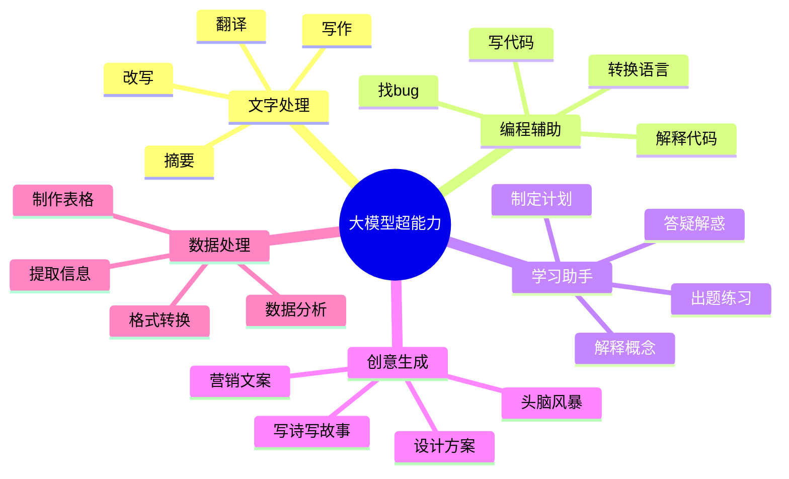

# 大模型使用指南：小白也能成为AI高手的实用技巧

> 你用ChatGPT时是不是也这样？问个问题，得到一堆废话；想让它写篇文章，写出来的东西像机器人；让它写代码，报错一堆；让它做表格，格式乱七八糟……

---

## 引子：你的AI，是不是也这样"难用"？

- 第一次用大模型，兴奋地问"你好"，它回"你好！有什么可以帮助你的吗？"然后你就不知道该问什么了
- 让它写个工作报告，它写的洋洋洒洒，但老板说"这不是我想要的"
- 让它翻译一段英文，结果翻出来的中文自己都看不懂
- 听说大模型能写代码，试着让它写个简单的程序，结果运行不了

**如果你中了以上任何一条，这篇文章就是为你写的。**

今天，我们不聊什么"Transformer架构""注意力机制""预训练微调"那些听不懂的技术名词。

我们要做的是：**用最简单的话，告诉你大模型到底该怎么用，怎么用好。**

文章不长，但看完之后，你也能成为朋友圈里的"AI高手"。

---

## 第一章 入门篇：大模型到底能帮你做什么？

### 1.1 先搞懂：大模型不是搜索引擎

很多人把大模型当成"高级百度"，这是错误的。

| 搜索引擎 | 大模型 |
|---------|-------|
| 给你一堆链接，你自己读 | 直接给你答案 |
| 信息可能过时 | 知识有截止日期 |
| 你需要自己判断对错 | 它可能一本正经地胡说 |
| 适合"找信息" | 适合"处理信息" |

**记住：大模型不是搜索引擎，它是你的"智能助手"。**

### 1.2 大模型的"五大超能力"

**这五大能力，覆盖了你日常工作和学习的80%需求。**

接下来，我们一个一个拆解，告诉你具体怎么用。

---

## 第二章 文字处理篇：让写作效率翻倍

### 2.1 写作：不是让它"写"，而是要"告诉它怎么写"

**错误示范：**
> "帮我写一篇关于人工智能的文章"

**问题：**
- 太笼统，不知道写什么风格
- 不知道写给谁看
- 不知道多长
- 不知道重点是什么

**正确示范：**
> "帮我写一篇800字左右的文章，主题是'人工智能对普通人的影响'，目标读者是职场白领，风格要轻松活泼一点，像朋友聊天，不要太学术化。结构上：先说说现在AI有多火，然后讲讲它对日常工作的影响（好的和坏的），最后给点建议。"

**看，差距就在这里。**

### 2.2 改写：让它"变身"的魔法

你写了一段话，但觉得不够好？让大模型帮你改：

**场景1：改风格**
> "把下面这段话改得正式一点，像公文风格：[你的原文]"

**场景2：改长度**
> "把下面这段话缩写到200字以内，保留核心意思：[你的原文]"

**场景3：改受众**
> 原文："It's raining cats and dogs."
> 机器翻译："正在下猫和狗。"

**大模型翻译：**
> 原文："It's raining cats and dogs."
> 大模型翻译："雨下得很大。"

**技巧：告诉它用途**
> "把下面这段英文翻译成中文，这是产品说明书，用词要专业一点：[英文内容]"

---

## 第三章 编程辅助篇：程序员的好帮手

### 3.1 写代码：从需求到代码

**错误示范：**
> "帮我写个爬虫"

**正确示范：**
> "我用Python，想写一个爬虫，从某个新闻网站抓取今天的头条新闻标题和链接，保存到CSV文件里。如果网站有反爬机制，要用随机User-Agent。请给我完整的代码，加上注释。"

**关键要素：**
- 编程语言
- 具体功能
- 输入输出
- 特殊要求
- 是否需要注释

### 3.2 找bug：你的代码调试神器

代码报错了？把错误信息直接扔给它：

> "我的Python代码报错了，错误信息如下：[粘贴错误信息]，代码如下：[粘贴代码]，请帮我分析问题在哪，如何修复。"

### 3.3 解释代码：看不懂别人的代码？

> "请帮我解释下面这段代码在做什么，按行说明：[粘贴代码]"

### 3.4 转换语言：Python转JavaScript

> "把下面这段Python代码改写成JavaScript：[粘贴Python代码]"

---

## 第四章 学习助手篇：你的私人私教

### 4.1 解释概念：用大白话讲专业知识

**错误示范：**
> "什么是区块链？"

它可能会给你一篇1000字的专业解释，你看完还是不懂。

**正确示范：**
> "用小学生能听懂的话，给我解释一下什么是区块链，最好打个比方。"

**关键：告诉它你的知识水平**

- "用小白能听懂的话"
- "像给10岁孩子讲故事一样"
- "用生活中的例子"

### 4.2 出题练习：学完知识点，巩固一下

> "我刚学了Python的列表和字典，请出5道练习题，从易到难，每道题都有标准答案，最后还要告诉我每个考点是什么。"

### 4.3 制定计划：从目标到行动

> "我想在3个月内学会Python编程，能写出简单的爬虫和数据可视化程序。我每天可以投入2小时学习，请帮我制定一个详细的学习计划，分阶段，每个阶段要学什么、做什么练习。"

### 4.4 答疑解惑：卡住了？问它

> "我在学JavaScript的闭包概念，书上这样说：[粘贴书上的解释]，但我还是不太理解，请用更简单的方式解释一下，最好给几个例子。"

---

## 第五章 创意生成篇：告别"脑子空空"

### 5.1 头脑风暴：让AI帮你发散思维

> "我想做一个关于'宠物狗'的短视频账号，请帮我 brainstorm 10个内容方向，每个方向给我3-5个具体的视频标题。"

### 5.2 写诗写故事：它比你想象的有才华

> "帮我写一首关于春天的现代诗，风格要像海子的诗，要有画面感。"

> "帮我写一个科幻微小说，500字左右，主题是'人类第一次遇到外星人'，结局要出人意料。"

### 5.3 设计方案：从想法到框架

> "我要做一个关于'职场新人'的线上课程，目标用户是刚毕业的大学生。请帮我设计课程大纲，包括课程名称、每节课的主题、内容要点、练习作业。"

### 5.4 营销文案：它比你更懂怎么卖东西

> "我们要卖一款'智能咖啡机'，主打特点是：一键制作、手机控制、自动清洗、颜值高。请帮我写3条不同风格的广告文案，分别针对：1. 上班族 2. 咖啡爱好者 3. 送礼人群。"

---

## 第六章 数据处理篇：Excel高手的新武器

### 6.1 提取信息：从文本到结构化数据

你有一堆客户留言，想提取其中的信息？

> "从下面的客户留言中，提取：客户姓名、联系电话、产品型号、问题描述，整理成表格：[粘贴留言内容]"

### 6.2 格式转换：JSON转Excel、CSV转SQL

> "把下面这段JSON数据转换成Excel表格格式，列名要清楚：[粘贴JSON]"

> "帮我写一个SQL语句，创建一个用户表，包含字段：id（主键）、username（唯一）、password、email、created_time。"

### 6.3 数据分析：它也能当数据分析师

> "我有下面这些销售数据，帮我分析：1. 哪个月份销售额最高 2. 哪个产品卖得最好 3. 找出销售额增长的趋势，用简单的话描述：[粘贴数据]"

### 6.4 制作表格：从无到有

> "帮我做一个'项目进度管理表'，包含这些字段：项目名称、负责人、开始日期、结束日期、进度、状态（进行中/已完成/延期），请给我Markdown格式的表格，还要加5行示例数据。"

---

## 第七章 实战技巧篇：高手都在用的5个秘诀

### 7.1 秘诀1：角色扮演

给大模型一个"身份"，它会表现得更专业。

**普通提问：**
> "怎么写好一封邮件？"

**角色扮演提问：**
> "你现在是一位资深的商务沟通专家，有20年的企业培训经验。请告诉我，如何写一封专业的商务邮件，从结构、用词、注意事项等方面给出一套完整的指南。"

**常用角色：**
- 产品经理
- 律师
- 医生
- 教师
- 营销专家
- 程序员
- 数据分析师

### 7.2 秘诀2：提供示例

给它一个例子，它会学得更像。

**无示例：**
> "帮我写一个产品介绍"

**有示例：**
> "帮我写一个产品介绍，风格要像下面这个例子：[粘贴一个你喜欢的产品介绍文案]。我要介绍的产品是：[你的产品信息]。"

### 7.3 秘诀3：分步提问

复杂任务，拆成几步问。

**一次性问：**
> "帮我做一个从网站爬取数据、分析数据、生成报告、发邮件的全流程方案"

**分步问：**
> 第一步："我想做一个数据分析项目，从某个网站爬取数据。请告诉我，爬取这个网站的数据需要考虑哪些技术问题？"
> 第二步："基于上面的回答，请帮我设计数据存储的方案。"
> 第三步："现在有了数据，请告诉我如何进行数据分析，可以生成哪些类型的报告。"
> 第四步："最后，请告诉我如何自动发送邮件报告。"

### 7.4 秘诀4：指定格式

告诉它你想要什么样的输出。

**无格式要求：**
- 表格
- 要点列表
- JSON格式
- Markdown格式
- 思维导图描述

### 7.5 秘诀5：追问和优化

第一次得到的答案不满意？继续问。

> "上面的回答不够详细，请给我更深入的解释。"

> "这个方案太复杂了，有没有更简单的方法？"

> "请举一个具体的例子说明。"

> "如果我想应用到我的具体场景[描述场景]，应该怎么做？"

**记住：大模型是"对话式"的，多聊几句，效果会越来越好。**

---

## 第八章 避坑指南篇：这些事千万别做

### 8.1 坑1：相信大模型说的每句话

**大模型会"一本正经地胡说八道"，这就是"幻觉"。**

比如你问：
> "李白写过哪首诗是描写2024年奥运会开幕式的？"

它可能真的编一首出来，看起来像模像样，但完全是假的。

**怎么避免？**
- 重要信息，一定要交叉验证
- 让它给出信息来源（虽然它可能编来源）
- 对于不确定的事情，多问几次
- 用搜索引擎验证关键事实

### 8.2 坑2：问过于笼统的问题

**"笼统"换不来"精准"。**

错误示范：
- "怎么赚钱？"
- "如何成功？"
- "怎么学习？"

正确示范：
- "我想做自媒体，目前是上班族，每天只有晚上2小时，请问如何从零开始做一个美食类的抖音账号？"
- "我刚毕业，想做产品经理，但专业不对口，请给我一个6个月的学习和求职计划。"

### 8.3 坑3：指望大模型替你思考

**大模型是工具，不是替身。**

它可以：
- 帮你整理思路
- 给你提供选项
- 帮你优化表达
- 节省你的时间

但它不能：
- 替你做决定
- 替你承担责任
- 替你判断对错
- 替你积累经验

**记住：最后拍板的，永远是你自己。** | 百度 | 中文能力强，有绘图功能 | 日常问答、文案写作、绘图 |
| **通义千问** | 阿里 | 理解能力强，适合办公场景 | 文档处理、表格分析、代码编写 |
| **智谱清言** | 智谱AI | 学术和科研场景强 | 论文写作、文献综述、学术问答 |
| **Kimi** | 字节跳动 | 轻量，免费，易用 | 日常对话、简单任务 |

### 11.2 选择建议

- **日常使用**：豆包（免费、简单）
- **办公场景**：通义千问
- **学术研究**：智谱清言
- **处理长文档**：Kimi
- **综合能力强**：文心一言

### 11.3 使用成本

好消息：国内主流大模型都有免费版！

- **完全免费**：豆包、通义千问（部分功能）
- **每日免费额度**：文心一言、智谱清言、Kimi
- **付费版**：更高额度、更快速度、更多功能（普通用户不需要）

**对于90%的普通人，免费版完全够用。**

---