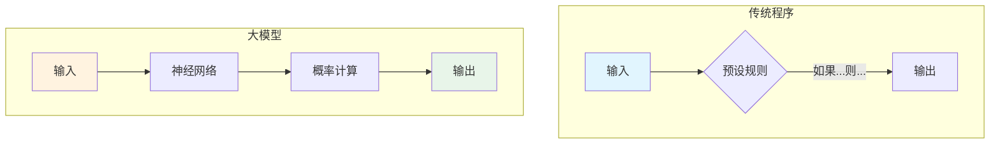
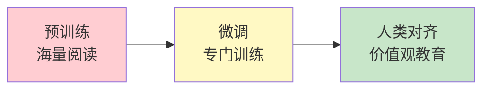
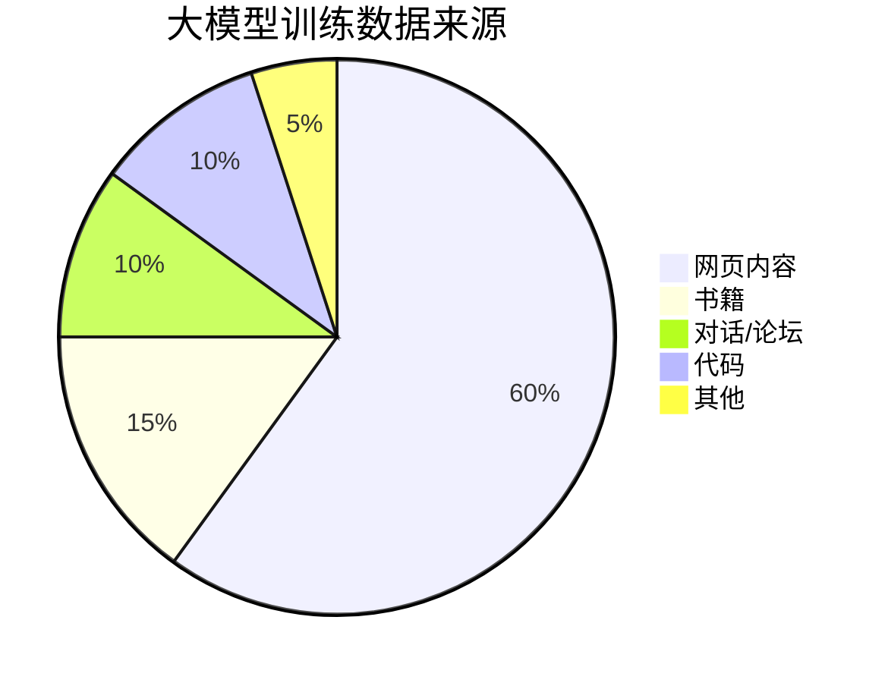
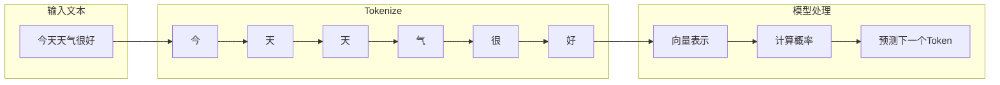
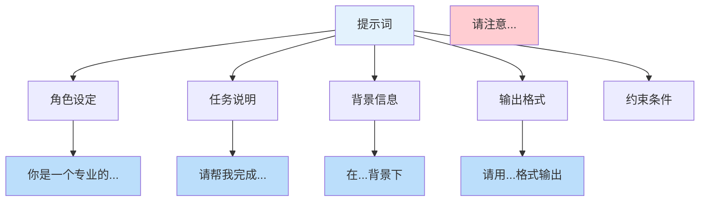
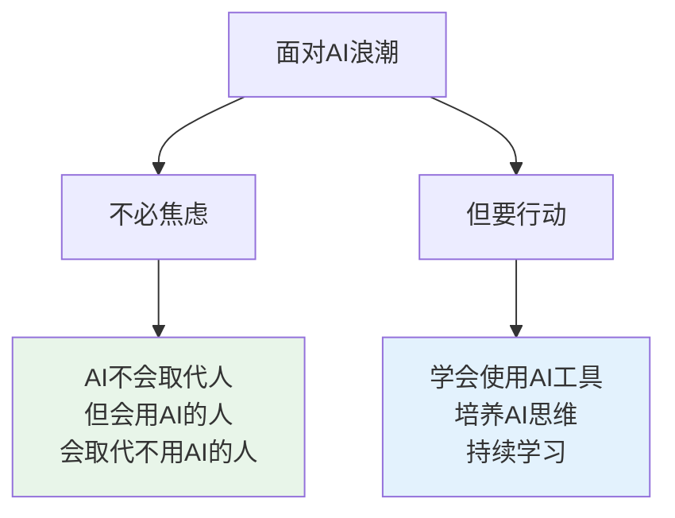

# 通俗易懂！一篇文章带你彻底搞懂大模型

> 从原理到应用，手把手教你了解AI最前沿

---

## 📱 写在前面

你有没有想过，为什么ChatGPT能和你流畅地聊天？为什么它能写诗、写代码、解答各种问题？

这一切的背后，都源于一个神奇的技术——**大语言模型**（Large Language Model，简称LLM）。

今天，我用最通俗的语言，从零开始，带你彻底搞懂大模型到底是什么、它是怎么工作的、以及我们普通人该如何使用它。

---

## 第一章：什么是大模型？

### 1.1 简单来说，大模型就是一个"超级大脑"

想象一下，你有一个朋友，他读过了互联网上几乎所有的文章、书籍、对话。这个朋友的大脑里存储了海量的知识，当你问他任何问题，他都能从这些知识中找到答案，并用自己的话回答你。

**大模型就是这样一位"超级阅读者"。**

它通过海量的文本数据训练，学会了对语言的"理解"和"生成"。它不真正"懂"什么是爱情、什么是数学，但它学会了如何模仿人类的语言来回答问题。

### 1.2 大模型与传统程序的区别

为了更好地理解，我们来看看传统程序和大模型有什么不同：



**传统程序**：靠人工写的规则（if-else）来处理问题
**大模型**：靠"暴力美学"——吃了足够多的数据，自己学会处理各种情况

---

## 第二章：大模型是怎么训练的？

### 2.1 训练的三阶段

大模型的训练过程，像极了你上学读书的过程：



**第一阶段：预训练（Pre-training）—— 海量阅读**

这个阶段，模型就像一个孩子，从互联网上海量的文本中学习。它做的事情很简单：**预测下一个词**。

举个例子，当模型看到"太阳从东边___"这句话时，它需要猜出最后一个词是什么。它猜"升起"的次数多了，就知道这个词最可能出现在这个位置。

这个过程听起来简单，但**数据量巨大**——可能要用到数万亿个词（Token），训练一次需要几个月时间和数百万美元。

> 💡 **小知识**：GPT-3的训练数据大约包含了3000亿个Token，相当于一个人日夜不停阅读几万年。

**第二阶段：微调（Fine-tuning）—— 专门训练**

预训练后，模型已经"博览群书"，但它不知道如何"好好说话"。

微调阶段，开发者会用**高质量的问答数据**来训练模型，让它学会：
- 如何更好地回答问题
- 如何遵循指令
- 如何生成更有用的内容

**第三阶段：人类对齐（RLHF）—— 价值观教育**

这是让ChatGPT变得"有用且安全"的关键步骤。通过人类反馈，让模型学会：
- 拒绝回答有害问题
- 给出更符合人类价值观的回答
- 保持回答的一致性

### 2.2 训练数据从哪里来？



大模型的训练数据主要来自互联网，包括：
- **网页内容**：维基百科、新闻文章、博客等
- **书籍**：各种领域的书籍
- **对话数据**：Reddit、论坛讨论等
- **代码**：GitHub上的开源代码

---

## 第三章：核心技术原理

### 3.1 Transformer：改变一切的核心架构

2017年，Google发表了一篇划时代的论文《Attention Is All You Need》，提出了**Transformer架构**。这个架构是大模型能够"理解"语言的关键。

Transformer的核心是**注意力机制（Attention）**。

### 3.2 注意力机制：像人一样抓住重点

当你读一段话时，你会自动"关注"重要的词，忽略不重要的词。

比如这句话：
> "小明把**苹果**给了小红，因为**它**想吃"

这里的"它"指的是什么？是"苹果"还是"小红"？

作为人类，你很容易理解"它"指的是"小红"（因为小红想吃苹果）。但对计算机来说，这很难理解。

**注意力机制就是让模型学会"抓住重点"的技术：**

```mermaid
flowchart TD
    A[小明把苹果给了小红] --> B[因为它想吃]
    
    B --> C{计算"它"与哪些词相关}
    C -->|苹果| D[相关性: 20%]
    C -->|小红| E[相关性: 80%]
    C -->|给了| F[相关性: 10%]
    
    E --> G["所以'它' = 小红"]
    
    style E fill:#c8e6c9
    style G fill:#81c784
```

通过计算每个词与其他词之间的"注意力分数"，模型就能理解词与词之间的关系。

### 3.3 Token：模型是如何"读"字的？

你可能听说过"Token"这个词。在大模型世界里，它是最基础的单位。



> 💡 **注意**：Token不一定是完整的词，也可能是：
> - 一个字（如"今"）
> - 一个词（如"今天"）
> - 一个子词（如"un"+"happy"）

这就是为什么有时候你发现，GPT对**中文**的处理似乎比对英文更"精准"一些——因为中文每个字本身就是有意义的Token。

### 3.4 模型的"思维方式"：概率与采样

你可能会好奇：模型是如何决定输出什么内容的？

答案是——**概率**。

当模型要生成下一个词时，它会计算所有可能词的概率，然后根据概率进行"抽样"：

```mermaid
flowchart TD
    A[当前文本:<br/>今天天气] --> B[计算下一个词的概率分布]
    
    B --> C{温度参数}
    C -->|温度低(0.1)| D[总是选最高概率]
    C -->|温度高(1.0)| E[按概率随机选择]
    
    D --> F[输出:<br/>很好]
    E --> G[输出:<br/>不错/晴朗/适合出门...]
    
    style C fill:#fff9c4
```

**温度（Temperature）**
- 流畅的语言生成
- 知识整合与问答
- 文字润色与改写
- 代码编写与解释
- 多语言翻译

**❌ 不擅长的事情：**
- 实时信息查询（不知道最新新闻）
- 精确数学计算（可能算错）
- 事实性知识（有幻觉、会胡编）
- 理解图片/音频（需要多模态模型）
- 长篇内容一致性（可能前后矛盾）

### 4.3 什么是"幻觉"？

"幻觉"（Hallucination）是 大模型最大的问题之一，指模型会**一本正经地胡说八道**。

```mermaid
flowchart TD
    A[用户提问] --> B{模型知道答案吗?}
    B -->|知道| C[给出正确答案]
    B -->|不确定| D[开始"编造"]
    B -->|不知道| E[也"编造"]
    
    D --> F[幻觉回答]
    E --> F
    
    style F fill:#ffcdd2
```

比如你问模型："秦始皇是什么时候发明飞机的？"

模型可能会回答："秦始皇在公元前220年发明了热气球..." —— 这显然是错误的，但因为模型说话太像真的一样，很多人会信以为真。

> 💡 **提醒**：使用大模型时，对于重要信息一定要自己核实！

---

## 第五章：如何更好地使用大模型？

### 5.1 提示词（Prompt）的艺术

同样的模型，不同的提问方式，效果天差地别。这就是所谓的"提示词工程"。

**❌ 错误示范：**
> "给我写点关于Python的东西"

**✅ 正确示范：**
> "我是一个Python初学者，请用通俗易懂的语言解释什么是列表（List），请举例说明列表的创建、增删改查操作，并给出实际代码示例。"

### 5.2 提示词的万能公式

这里有一个经过验证的提示词框架：



### 5.3 进阶技巧

**技巧一：Few-shot Learning（少样本学习）**

直接给模型举例子，让它模仿：

```
请判断以下评论的情感是正面还是负面。

评论："这个产品太棒了，非常满意！"
情感：正面

评论："体验很差，不会再买"
情感：负面

评论："还可以，一般般吧"
情感：
```

**技巧二：思维链（Chain of Thought）**

让模型"一步步思考"：

> "请一步步计算：25 × 4 + 17 = ?，展示你的计算过程。"

**技巧三：分步处理复杂任务**
未来的大模型将不只是"听说读写"，还能**看图、看视频、听声音**，成为真正的多模态助手。

**2. 长上下文**
上下文窗口将越来越长，模型能够处理整本书、整部电影的内容。

**3. 自主Agent**
从"回答问题"到"自主执行"，AI Agent将能够帮你自动完成复杂任务。

**4. 个性化定制**
每个人都可以拥有自己的"AI助手"，它了解你的习惯和偏好。

### 7.2 我们应该如何应对？



---

