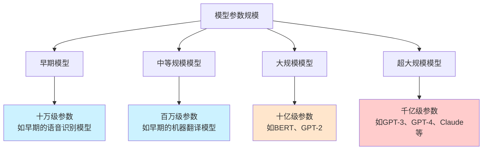
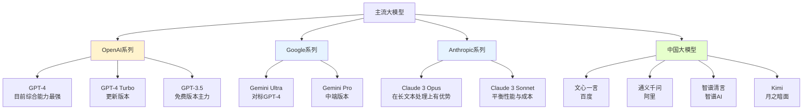
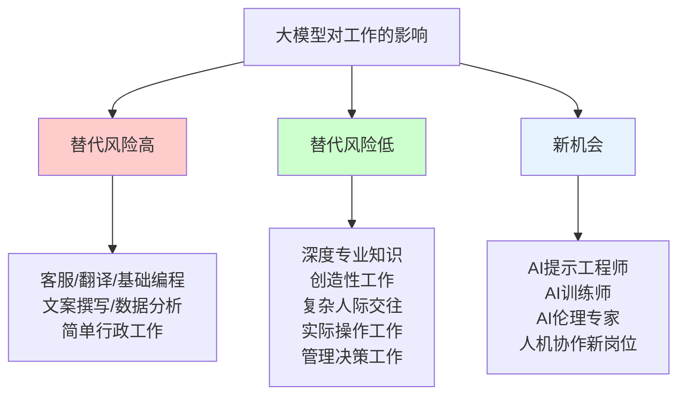

# 大模型常识深度解析：从基础原理到行业格局的完整指南

## 引言

2023年，ChatGPT的横空出世让全世界见识到了人工智能的惊人能力。从那一刻起，"大模型"这个词以前所未有的速度进入了公众的视野。

然而，对于大多数人来说，大模型仍然是一个神秘的存在。它是如何工作的？为什么它能够写出流畅的文章、回答复杂的问题、甚至编写代码？它会不会取代人类的工作？它的未来会走向何方？

本文将带领读者由浅入深，一层层揭开大模型的神秘面纱。我们不仅会讲解什么是大模型、它是如何工作的，更会深入探讨它为什么能够做到这些，以及它对人类社会可能产生的深远影响。

---

## 第一章：表象——大模型给我们的直观印象

### 1.1 惊人的能力展现

当你第一次与ChatGPT或类似的大模型对话时，你可能会感到震撼。它似乎能够理解你的问题，给出连贯、有时甚至富有洞见的回答。它可以：

- **写作文、写代码**：无论是写一篇议论文，还是编写一段程序，大模型都能胜任
- **回答问题**：从历史知识到科学原理，从生活常识到专业问题，大模型似乎无所不知
- **翻译语言**：可以流畅地进行中英日法等多种语言的互译
- **进行对话**：能够记住对话的上下文，进行多轮有意义的交流
- **创作内容**：写诗、写歌、写剧本，甚至模仿特定人物的写作风格

这些能力让很多人惊呼：人工智能已经"成精"了！

### 1.2 同样惊人的局限

然而，如果你深入使用大模型，你会发现它并非完美无缺。它有时会：

- **一本正经地胡说八道**：给出看似专业但实际上是错误的信息，这就是所谓的"幻觉"问题
- **缺乏真正的理解**：它只是根据训练数据中的模式进行预测，并不真正"理解"内容的含义
- **无法真正推理**：面对复杂的逻辑推理问题，大模型往往会犯错
- **知识有时效性**：它的知识截止到训练数据的时间点，无法获取最新信息
- **缺乏常识**：在某些简单的生活常识问题上，大模型的表现可能出人意料地糟糕

这些局限性提醒我们：大模型虽然强大，但远非完美。理解它的能力和局限，是正确使用它的前提。

---

## 第二章：入门——理解大模型的基本概念

### 2.1 什么是大模型？

"大模型"这个名称中的"大"主要指的是模型的参数数量。那么，什么是参数呢？

想象一下，如果你要让一个程序学会识别猫和狗的图片，你会给它大量的标注好的图片，让它学习从图片中提取特征。一个简单的模型可能只有几百个参数，而一个大模型可能有几千亿个参数。

参数可以被理解为模型内部的"记忆"和"理解能力"。每个参数都记录了从训练数据中学到的某种模式或知识。当参数数量达到千亿级别时，模型就具备了惊人的能力。

2020年发布的GPT-3有1750亿个参数。2023年发布的GPT-4虽然官方没有公布确切数字，但估计在万亿参数级别。当参数数量达到这个量级时，模型展现出了惊人的"涌现"能力——出现了在训练数据中并没有明确教授的能力。

### 2.2 大模型是如何训练的？

大模型的能力来自训练。那么，大模型是如何训练的呢？

**第一步：预训练**

预训练是大模型训练的第一个也是最重要的阶段。这个阶段的核心任务是让模型"学会说话"。

具体来说，研究人员会给模型海量的文本数据——可能包括整个互联网的网页、书籍、新闻、代码等各种文本。然后，模型的任务是：给定一段文字，预测下一个词应该是什么。

这个任务看似简单，但为了让预测更准确，模型必须学习：

- 语法规则
- 词汇搭配
- 语义关系
- 常识知识
- 推理能力
- 甚至是某种程度的世界知识

你可以把这个过程理解为：一个学生读完了人类有史以来几乎所有的书，然后学会了预测"下一句话应该是什么"。

**第二步：微调**

预训练让模型学会了"说话"，但这还不够。要让模型能够回答问题、遵循指令，还需要第二个阶段的训练：微调。

微调通常使用人类标注的数据。比如，告诉模型："当用户问这个问题时，应该这样回答。"通过大量的问答对训练，模型学会了"应该如何响应人类的指令"。

这个阶段还会使用"人类反馈强化学习"（RLHF）技术，让模型的输出更符合人类的期望。

**第三步：推理**

训练完成后，当用户输入一个问题时，模型会根据自己的"经验"（即训练过程中学到的参数）来预测每一个可能的回答，然后选择最可能正确的回答输出。这就是推理过程。

推理所需的计算量也相当可观，这也是为什么大模型通常需要部署在高性能服务器上，而不是普通的个人设备。

### 2.3 主流大模型概览

目前市场上主要的大模型产品包括：

这些模型各有特点：

- **OpenAI的GPT系列**：综合能力强，是目前的主流选择
- **Google的Gemini系列**：在多模态（理解图片、视频等）方面有优势
- **Anthropic的Claude系列**：在长文本处理和安全性方面有特色
- **中国大模型**：百度、阿里、智谱等，在中文场景有优势

---

## 第三章：深入——理解大模型的工作原理

### 3.1 注意力机制：核心的秘密

大模型之所以强大，很大程度上归功于一项叫做"注意力机制"（Attention Mechanism）的技术。

**什么是注意力机制？**

注意力机制的核心思想是：在处理一段信息时，模型应该"关注"最相关的部分，而不是平等地对待所有信息。

举个例子，当你在阅读"小明把苹果放进了书包，因为它的颜色很鲜艳"这句话时，你会知道"它"指的是"苹果"。这种理解就需要注意力机制。

传统的神经网络在处理长文本时，会遇到"遗忘"的问题——早期的信息在传递过程中会被逐渐稀释。但注意力机制允许模型在处理任何一个词时，都可以"回顾"文本中的任何其他位置，从而解决了长距离依赖的问题。

**Transformer架构**

注意力机制是Transformer架构的核心。Transformer于2017年由Google的研究人员提出，至今仍然是所有大模型的基础架构。

Transformer的核心组成部分包括：

- **自注意力层**（Self-Attention）：让每个词都能"看到"其他所有词
- **前馈神经网络**：对信息进行进一步处理
- **残差连接和层归一化**：帮助训练更深的网络

Transformer的出现是人工智能领域的一个里程碑，它让模型能够更好地处理长文本，并行计算效率也大大提高。

### 3.2 涌现现象：从量变到质变

大模型最神奇的现象之一是"涌现"（Emergence）。所谓涌现，是指当模型参数规模超过某个临界点时，模型会突然获得一些在训练时并没有明确教授的能力。

比如：

- **推理能力**：模型似乎具备了某种程度的推理能力，能够进行简单的数学推理和逻辑推理
- **代码编写**：模型能够编写复杂的程序，即使它的训练数据中并没有专门的编程教学
- **多语言能力**：模型能够进行不同语言之间的翻译，即使某些语言在训练数据中很少见
- **理解意图**：模型能够理解用户的真实意图，而不仅仅是字面意思

这种现象让很多研究者感到惊讶和困惑。我们仍然不完全理解为什么会出现涌现，但它确实发生了。

一种可能的解释是：当参数足够多时，模型有了足够的"容量"来存储和表达各种复杂的模式，而这些模式在某些条件下会自发地形成"能力"。

### 3.3 理解 vs 模拟：一个根本性的问题

大模型能够"理解"语言吗？这是一个哲学层面的问题，目前没有确定的答案。

**支持"理解"观点**：

- 大模型能够正确地回答问题，说明它理解了问题
- 大模型能够进行有意义的对话，说明它理解了对话的内容
- 大模型能够翻译、摘要、创作，这些都需要某种程度的"理解"

**支持"模拟"观点**：

- 大模型只是根据统计规律进行预测，并不真正理解含义
- 大模型的"幻觉"说明它并不真正理解事实
- 大模型缺乏对物理世界的 grounding（扎根）

目前主流的观点可能是：**大模型不是真正的理解，但表现得像是理解了**。它的"理解"是基于统计模式的高级模拟，而不是人类的语义理解。

这意味着，大模型的能力有明确的边界。在某些任务上它可以做得很好，但在另一些需要真正推理或常识的任务上，它可能会失败。

---

## 第四章：溯源——大模型为何强大的根本原因

### 4.1 数据的力量

大模型强大的第一个根本原因是数据。

为了训练GPT-4这样的模型，研究人员使用了可能是人类历史上最庞大的文本数据集。这个数据集可能包括：

- 整个互联网的网页
- 维基百科
- 各种书籍
- 代码仓库（GitHub）
- 新闻文章
- 论坛讨论

这些数据让模型学到了人类文明的"知识"。你可以把训练好的大模型理解为一座"数字图书馆"，它存储了训练数据中的所有知识，并在需要时能够检索和组合这些知识。

但是，数据也带来了一些问题：

**数据质量问题**：互联网上的数据并非全部准确，大模型也会学到错误的信息

**数据偏差问题**：如果训练数据中某些观点占主导，大模型可能会表现出类似的倾向

**数据版权问题**：使用大量受版权保护的内容进行训练，是否侵犯了版权？

**数据隐私问题**：训练数据可能包含个人信息，如何保护隐私？

### 4.2 算力的力量

大模型强大的第二个根本原因是算力。

训练一个大模型需要消耗巨大的计算资源。以GPT-3为例，它的训练据估计使用了约3640 PetaFLOPS-day的算力（相当于一台超级计算机运行多年的计算量）。

这种算力需求是普通人无法想象的。这也是为什么大模型只能由拥有大量GPU资源的科技公司来训练。

算力的不断提升得益于：

- **GPU的发展**：英伟达等公司生产的GPU特别适合深度学习计算
- **分布式训练技术**：将计算任务分散到成千上万个GPU上
- **新的训练技巧**：如混合精度训练、梯度累积等

但算力也带来了问题：训练大模型需要消耗大量能源，这对环境造成影响；只有大公司才有能力训练大模型，这可能加剧AI领域的不平等。

### 4.3 算法的力量

大模型强大的第三个根本原因是算法。

过去十年的算法进步是大模型成功的关键：

- **Transformer架构**（2017）：解决了长文本处理的问题
- **预训练+微调范式**：让模型能够适应各种任务
- **人类反馈强化学习（RLHF）**：让模型的输出更符合人类期望
- **提示工程（Prompt Engineering）**：通过设计好的提示来激发模型能力

算法的进步让研究者能够更高效地利用数据和算力，也让我们能够更好地控制和引导模型的行为。

### 4.4 涌现的力量

除了数据、算力、算法，还有一个因素让大模型变得强大：涌现。

如前所述，当模型规模足够大时，会出现一些没有明确教授的能力。这种涌现现象的根本原因目前还不完全清楚，但它确实是让大模型"变聪明"的关键。

一种可能的解释是：更大的模型有更多的参数，能够存储和表达更复杂的模式。这些模式在某些组合下，会自发地形成"智能"行为。

另一种解释是：涌现可能源于模型在训练过程中学习到的层级结构。底层学习简单的模式，高层组合低层的模式形成复杂的能力。

理解涌现对于我们理解大模型的潜力和局限性都很重要。

---

## 第五章：影响——大模型对社会的深层影响

### 5.1 对工作的影响

大模型对工作的影响是人们最关心的话题之一。

**可能被替代的工作**：

- 客服和聊天机器人：可以处理大量简单咨询
- 文案和内容创作：可以生成各种文案、新闻稿、广告文案
- 翻译：机器翻译的质量已经很高
- 初级程序员：可以编写简单代码
- 数据分析和报告：可以自动生成分析报告
- 行政和文书工作：可以处理各种文档

**难以被替代的工作**：

- 需要深度专业知识的领域（如医生、律师）
- 需要创造性思维的工作（如艺术家、科学家）
- 需要复杂人际交往的工作（如销售、心理咨询）
- 需要实际操作的工作（如电工、水管工）
- 需要判断和决策的管理工作

**关键点**：大模型不会完全替代人类，但会改变工作的性质。很多工作会变成"人类+AI"的协作模式，人类做决策和创意工作，AI做执行和信息处理工作。

### 5.2 对教育的影响

大模型对教育的影响是深远的。

**积极影响**：

- 个性化学习：AI可以为每个学生提供定制化的学习内容
- 辅助工具：可以帮助学生查找信息、解答问题、修改作文
- 教育资源普惠：让优质教育资源更容易获取
- 学习效率提升：自动化的练习和评估

**挑战和担忧**：

- 抄袭和作弊：学生可能用AI完成作业
- 批判性思维：如果AI能回答问题，学生还需要思考吗？
- 基础知识学习：是否还需要背诵乘法表和单词？
- 教师角色转变：教师如何适应AI时代？

教育工作者需要思考：在这个AI时代，我们应该教什么？学生应该学什么？如何培养不会被AI替代的能力？

### 5.3 对信息获取的影响

大模型正在改变我们获取信息的方式。

**传统搜索 vs AI对话**：

传统搜索引擎返回一系列网页链接，需要用户自己阅读和理解。而AI对话可以直接给出答案，更加高效。

但这也带来了问题：

- **来源模糊**：AI给出的答案不会告诉你是从哪来的
- **错误信息**：AI可能给出错误答案，但你无法验证
- **信息茧房**：AI可能强化你的偏见，而不是给你多元观点

如何在这个AI时代保持信息的可靠性，是一个重要的课题。

### 5.4 对人类认知的影响

更深层次的问题是：大模型会不会改变人类的思维方式？

一种担忧是：如果我们习惯于让AI替我们思考，我们会不会逐渐丧失独立思考的能力？

另一种担忧是：如果AI生成的内容占据了互联网的大多数，人类还有没有"干净"的数据可以用来训练下一代AI？

这些问题目前还没有答案，但它们值得我们思考。

---

## 第六章：局限——大模型的根本性短板

### 6.1 幻觉问题

大模型最著名的缺点是"幻觉"——它会一本正经地给出错误的信息。

为什么会产生幻觉？

从技术角度来说，大模型只是一个"文字预测"机器。它的训练目标是预测"下一个词最可能是什么"，而不是"什么是真的"。当它的预测与事实不符时，就产生了幻觉。

从根本上说，这是因为大模型缺乏对"真理"的追求。它的训练只是让它预测"人类会说什么"，而不是"什么是正确的"。

解决幻觉的方法：

- **RAG（检索增强生成）**：让模型在回答问题前先检索相关信息
- **更好的训练数据**：使用更高质量的数据进行训练
- **事实核查机制**：在输出后进行事实验证
- **提示工程**：设计更好的提示让模型更准确地回答

### 6.2 知识截止问题

大模型的知识有截止日期。GPT-4的知识截止到2023年4月，Claude 3的知识截止到2024年3月。这意味着：

- 大模型不知道最新发生的事件
- 大模型不知道最新的产品和技术
- 大模型不知道最新的研究成果

这是一个技术上的限制，因为训练新模型需要大量时间和成本。

解决这个问题的方向包括：

- **持续学习**：让模型能够不断更新知识
- **联网能力**：让模型能够访问互联网获取最新信息
- **RAG**：通过检索系统让模型能够使用最新的外部知识

### 6.3 推理能力有限

虽然大模型展现出一定的推理能力，但它的推理是"模拟"而不是真正的推理。

大模型的推理存在以下问题：

- **缺乏真正的逻辑**：对于需要严格逻辑推理的问题，大模型往往会出错
- **长程推理困难**：复杂的多步推理容易出错
- **数学推理薄弱**：虽然能做简单数学，但复杂的数学问题仍然困难

这是因为大模型的"推理"本质上只是模式匹配，而不是真正的思考。

### 6.4 缺乏身体和经验

大模型是纯文字的模型，它没有身体，没有感官经验。

这意味着：

- 大模型缺乏"常识"：它不知道物体有重量，不知道水会打湿衣服
- 大模型缺乏" grounding "：它的知识是空洞的，没有与现实世界连接
- 大模型缺乏"体验"：它不能真正理解情感和感受

这些问题需要多模态模型（能够处理图片、视频、声音等）来部分解决，但完全的"具身智能"还有很长的路要走。

---

## 第七章：应用——大模型的实用指南

### 7.1 适合使用大模型的场景

大模型在以下场景中表现出色：

**写作辅助**：

- 问答系统：回答各种问题
- 信息提取：从文本中提取关键信息
- 翻译：多语言互译
- 知识管理：整理和归纳知识

**编程辅助**：

- 代码编写：生成代码片段
- 代码审查：检查代码问题
- 技术解释：解释复杂的技术概念
- Debug辅助：帮助定位和解决问题

**学习辅助**：

- 概念解释：解释复杂的概念
- 练习生成：生成练习题
- 答疑解惑：回答学习中的问题

### 7.2 不适合使用大模型的场景

大模型在以下场景中需要谨慎使用：

- **需要准确事实的场景**：如医疗诊断、法律建议
- **需要最新信息的场景**：如新闻报道、市场分析
- **需要严格推理的场景**：如数学证明、逻辑分析
- **需要承担责任的场景**：如合同审核、决策制定

在这些场景中，大模型的输出应该被视为"参考"而不是"结论"，需要人类进行审核和判断。

### 7.3 使用大模型的技巧

如何更好地使用大模型？以下是一些技巧：

**1. 清晰的提示**

提示越清晰，结果越好。包括：

- 明确的任务说明
- 期望的输出格式
- 必要的背景信息
- 任何约束条件

示例对比：

差："帮我写点东西"

好："帮我写一封求职邮件，应聘产品经理岗位，我有三年互联网产品经验，擅长用户研究和产品设计，语言风格专业但不死板"

**2. 迭代优化**

不要期望一次就得到完美的答案。可以：

- 让模型先给出一个草稿
- 提出修改意见
- 多次迭代直到满意

**3. 提供参考**

如果可能，提供相关的背景资料或参考文档，让模型生成更准确的内容。

**4. 分步处理**

复杂任务可以分解为多个简单任务，让模型一步步处理。

**5. 验证重要信息**

对于重要的信息，通过其他渠道进行验证，不要完全依赖大模型的输出。

---

## 第八章：未来——大模型的发展方向

### 8.1 多模态发展

未来的大模型将不仅仅处理文字，还会处理图片、视频、声音等多种模态。

多模态能力让AI能够：

- 理解图片内容
- 生成图片和视频
- 进行语音对话
- 理解真实世界

GPT-4V、Gemini等模型已经具备了多模态能力，未来的发展将更加深入。

### 8.2 效率提升

训练和运行大模型需要巨大的算力成本。未来的发展方向包括：

- **模型蒸馏**：用大模型的知识训练小模型
- **更高效的架构**：研发更节省算力的模型结构
- **专用模型**：针对特定任务训练更高效的模型

这将让大模型更加普及，降低使用成本。

### 8.3 个性化和定制

未来的大模型将能够更好地适应个人需求：

- 学习个人偏好
- 记住个人背景
- 提供个性化服务

这将让AI成为真正的个人助理。

### 8.4 自主Agent

未来的大模型将不仅仅是回答问题，而是能够自主执行任务：

- 自动规划行动
- 调用其他工具
- 完成复杂任务

这就是所谓的"Agent"（智能体）概念。AutoGPT等项目已经在探索这个方向。

### 8.5 与机器人结合

大模型与机器人技术的结合是另一个重要方向：

- 让机器人理解自然语言指令
- 让机器人进行规划和推理
- 让机器人更加智能

这将让AI从虚拟世界走向物理世界。

---