# 大模型思维链（CoT）完全解析：让AI学会"一步步思考"的魔法

> **导语**：你有没有发现，有时候问AI一个复杂问题，它会直接给出错误答案；但如果你让它"一步步思考"，它反而能答对？这背后隐藏着一个革命性技术——思维链（Chain of Thought, CoT）。今天，我们就把这个技术掰开揉碎，从原理到实战，让你彻底搞懂！

---

## 一、从一个简单的数学题开始

### 1.1 直接提问 vs 引导思考

先来看一个实验。我问大模型一个问题：

**问题**：小明有5个苹果，吃了2个，妈妈又给了他3个，最后他有多少个苹果？

**直接提问的回答**：
```
6个
```
（有时候对，有时候错，不太稳定）

**加上"一步步思考"后的回答**：
```
让我一步步来算：
- 小明一开始有5个苹果
- 吃了2个，还剩 5-2=3个
- 妈妈又给了3个，现在有 3+3=6个
- 所以答案是6个
```
（几乎每次都对！）

发现了什么？**同样的模型，同样的问题，只是多了一句"一步步思考"，准确率就大幅提升！**

这就是思维链的魔力。

### 1.2 什么是思维链？

用一句话定义：

> **思维链（Chain of Thought, CoT）是一种提示技术，通过引导大模型展示推理的中间步骤，从而提高复杂任务的准确性和可解释性。**

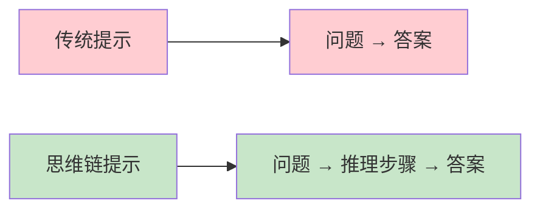

**核心思想**：让AI像人类一样，把思考过程"说出来"，而不是直接跳到结论。

---

## 二、为什么需要思维链？

### 2.1 大模型的"阿喀琉斯之踵"

大模型虽然强大，但在以下场景中容易翻车：

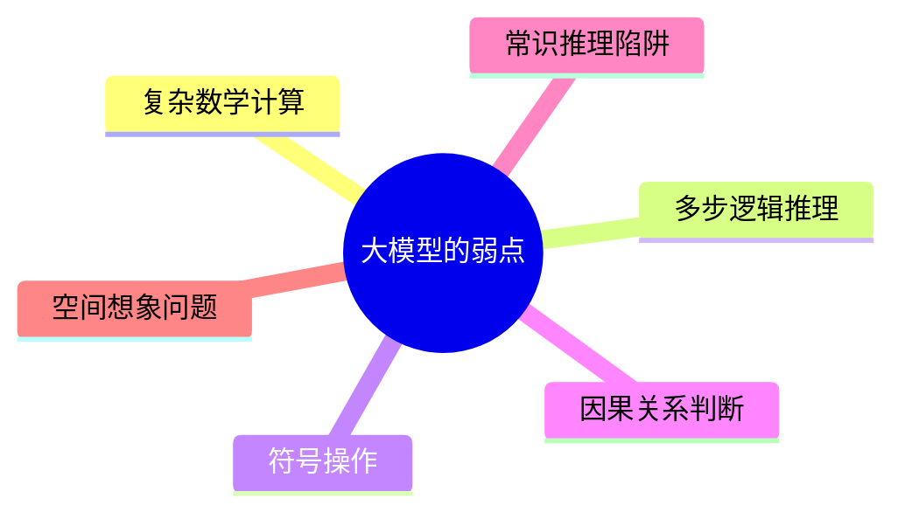

**典型案例**：

```
问题：一个房间有3盏灯，外面有3个开关。每个开关控制一盏灯。
你只能进房间一次，如何确定哪个开关控制哪盏灯？

直接回答（错误）：
一个个试就行了。

（完全没get到题目的约束条件）
```

### 2.2 人类的思考方式

我们人类遇到复杂问题时会怎么做？

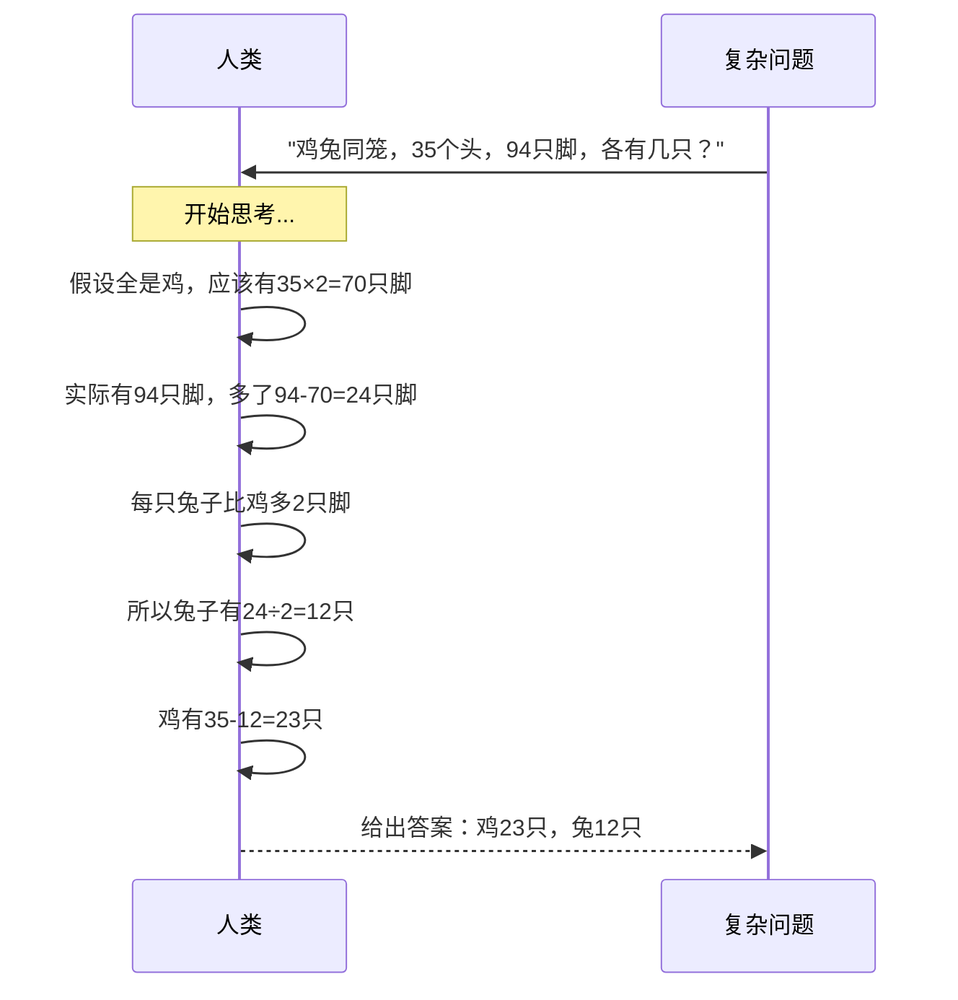

**关键洞察**：人类的优势不是知识量，而是**推理过程的结构化**。思维链就是让AI模仿这个过程的！

### 2.3 思维链的三大价值

| 价值 | 说明 | 实际效果 |
|------|------|---------|
| 🎯 **准确性提升** | 中间步骤降低出错概率 | 数学题准确率提升20-50% |
| 🔍 **可解释性增强** | 能看到推理过程 | 方便定位错误、建立信任 |
| 🧩 **泛化能力提高** | 学会推理模式，举一反三 | 遇到新题型也能应对 |

---

## 三、思维链的科学原理

### 3.1 大模型是如何"思考"的？

要理解CoT，先要了解大模型的本质：

```mermaid
graph TD
    A[大模型] --> B[本质：下一个token预测器]
    B --> C[基于上下文预测下一个字]
    C --> D[没有真正的"理解"能力]
    D --> E[只是概率计算]
    E --> F{如何让它更准确？}
    F --> G[给它更多推理线索]
    G --> H[这就是CoT的原理]
```

**核心机制**：

1. **自回归生成**：模型一个字一个字地生成文本
2. **上下文依赖**：每一步生成依赖前面所有的内容
3. **推理路径**：中间步骤为后续生成提供了更好的上下文

### 3.2 思维链为什么有效？

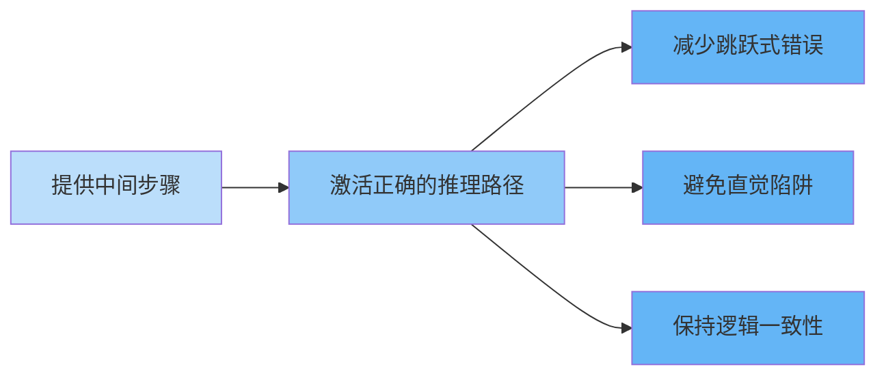

**学术解释**（来自原始论文）：

> "Chain-of-thought prompting enables large language models to perform complex reasoning by generating intermediate reasoning steps, which serves as a 'computational graph' that guides the model to the correct answer."
>
> —— Jason Wei et al., "Chain-of-Thought Prompting Elicits Reasoning in Large Language Models", NeurIPS 2022

**简单翻译**：
中间步骤就像一个"计算图"，引导模型走正确的路，而不是瞎猜。

### 3.3 涌现能力（Emergent Abilities）

思维链还有一个神奇的现象：**当模型规模超过1000亿参数时，CoT能力会突然大幅提升！**

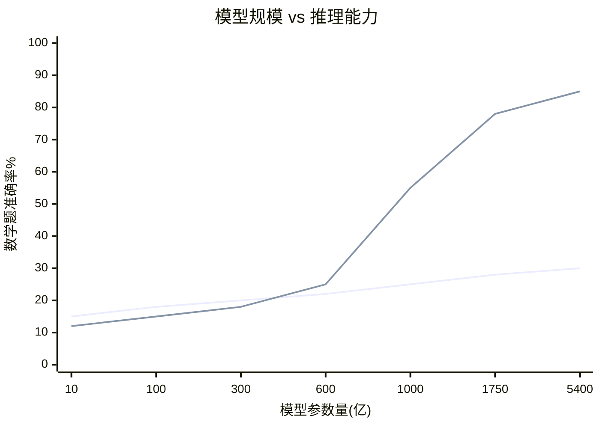

这意味着：**思维链是一种涌现能力，只有够大的模型才能被"激活"它！**

---

## 四、思维链的三种实现方式

### 4.1 方式一：零样本思维链（Zero-Shot CoT）

最简单！只需在问题后面加一句话：

```
Let's think step by step.
（让我们一步步思考。）
```

**实战示例**：

```
问题：超市苹果5元一斤，香蕉3元一斤。小明买了2斤苹果和3斤香蕉，
给了老板50元，老板应该找回多少钱？

Zero-Shot CoT提示：
超市苹果5元一斤，香蕉3元一斤。小明买了2斤苹果和3斤香蕉，
给了老板50元，老板应该找回多少钱？

让我们一步步思考。
```

**模型回答**：
```
让我们一步步思考：
1. 计算苹果的费用：2斤 × 5元/斤 = 10元
2. 计算香蕉的费用：3斤 × 3元/斤 = 9元
3. 计算总费用：10元 + 9元 = 19元
4. 计算找零：50元 - 19元 = 31元

所以，老板应该找回31元。
```

**优点**：
- ✅ 零成本，立即可用
- ✅ 适用于任何大模型
- ✅ 不需要示例

**缺点**：
- ❌ 效果不如Few-Shot稳定
- ❌ 对于特别复杂的问题可能不够用

### 4.2 方式二：少样本思维链（Few-Shot CoT）

这是原始论文提出的方法，**效果最强**！

在提示中提供几个带有完整推理过程的示例：

```
Q: 罗杰有5个网球。他又买了2罐网球，每罐3个。他现在有多少个网球？
A: 罗杰一开始有5个球。2罐网球，每罐3个，所以是2×3=6个球。
   5+6=11个球。所以答案是11。

Q: 自助餐厅每天有96个苹果。早餐用了28个，午餐又用了36个。还剩多少个？
A: 一开始有96个苹果。早餐用了28个，96-28=68个。午餐用了36个，68-36=32个。
   所以还剩32个苹果。

Q: 小明有5个苹果，吃了2个，妈妈又给了他3个，最后他有多少个苹果？
A: 
```

**模型会自动模仿这种推理模式**：
```
小明一开始有5个苹果。吃了2个，5-2=3个。妈妈又给了3个，3+3=6个。
所以答案是6个。
```

**关键要点**：

| 要素 | 要求 |
|------|------|
| 示例数量 | 3-8个最佳 |
| 示例质量 | 推理过程要清晰完整 |
| 领域匹配 | 示例和任务最好同领域 |
| 格式一致 | 保持Q/A的格式统一 |

### 4.3 方式三：自我一致性（Self-Consistency）

**升级玩法**：让模型生成多个推理路径，然后投票选出最一致的答案！

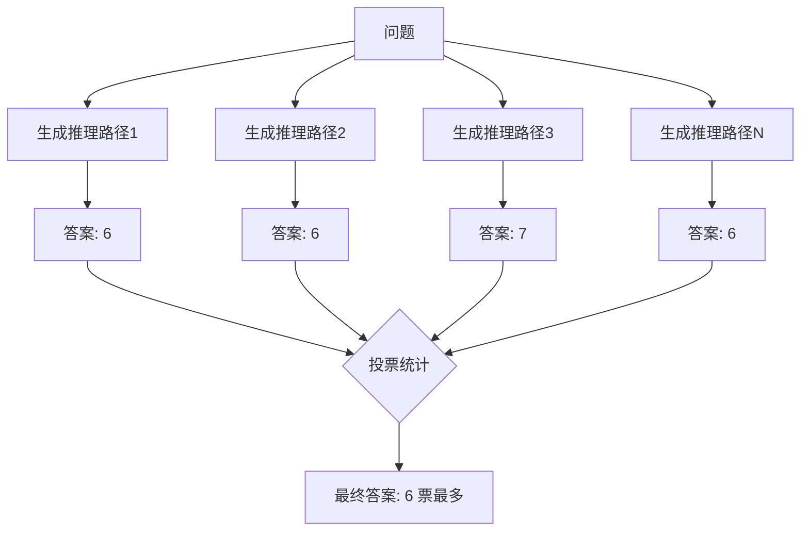

**实现代码（Python）**：

```python
import openai

def self_consistency_cot(question, num_paths=5):
    """
    自我一致性思维链
    """
    answers = []
    
    for i in range(num_paths):
        prompt = f"""
Q: {question}
A: Let's think step by step.
"""
        response = openai.ChatCompletion.create(
            model="gpt-3.5-turbo",
            messages=[{"role": "user", "content": prompt}],
            temperature=0.7,  # 增加随机性
            max_tokens=500
        )
        
        reasoning = response.choices[0].message.content
        print(f"路径{i+1}: {reasoning}")
        
        # 提取答案（这里简化处理）
        answer = extract_answer(reasoning)
        answers.append(answer)
    
    # 投票
    from collections import Counter
    most_common = Counter(answers).most_common(1)
    return most_common[0][0]

def extract_answer(reasoning):
    """从推理文本中提取最终答案"""
    # 实际应用中需要更复杂的逻辑
    if "答案是" in reasoning:
        return reasoning.split("答案是")[-1].strip()
    return reasoning

# 使用示例
question = "小明有5个苹果，吃了2个，妈妈又给了他3个，最后他有多少个苹果？"
final_answer = self_consistency_cot(question)
print(f"最终答案: {final_answer}")
```

**优势**：
- ✅ 准确率再提升5-15%
- ✅ 降低单次生成的随机性
- ✅ 适合高可靠性场景

**成本**：
- ❌ 需要多次调用API
- ❌ 响应时间更长
- ❌ 费用成倍增加

---

## 五、思维链的进阶技术

### 5.1 自动思维链（Auto-CoT）

手动写示例太麻烦？**Auto-CoT让模型自己生成示例！**

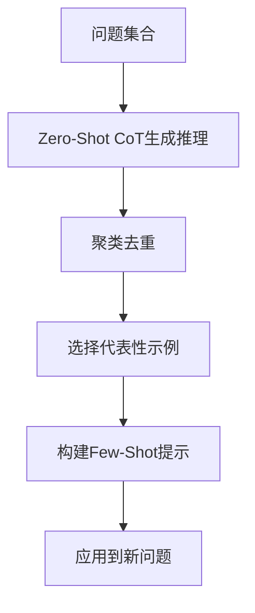

**实现步骤**：

```python
def generate_auto_cot_examples(questions, k=5):
    """
    自动生成CoT示例
    """
    examples = []
    
    # 步骤1: 用Zero-Shot CoT生成推理
    for q in questions:
        reasoning = zero_shot_cot(q)
        examples.append({"question": q, "reasoning": reasoning})
    
    # 步骤2: 根据问题复杂度聚类
    clustered = cluster_by_complexity(examples)
    
    # 步骤3: 从每个簇中选择代表性示例
    selected = select_diverse_examples(clustered, k)
    
    # 步骤4: 构建Few-Shot提示
    prompt = build_few_shot_prompt(selected)
    
    return prompt

# 使用
training_questions = [
    "鸡兔同笼问题...",
    "行程问题...",
    "工程问题..."
]
cot_prompt = generate_auto_cot_examples(training_questions)
```

### 5.2 思维树（Tree of Thoughts, ToT）

**进一步升级**：不只线性推理，而是构建"思考树"！

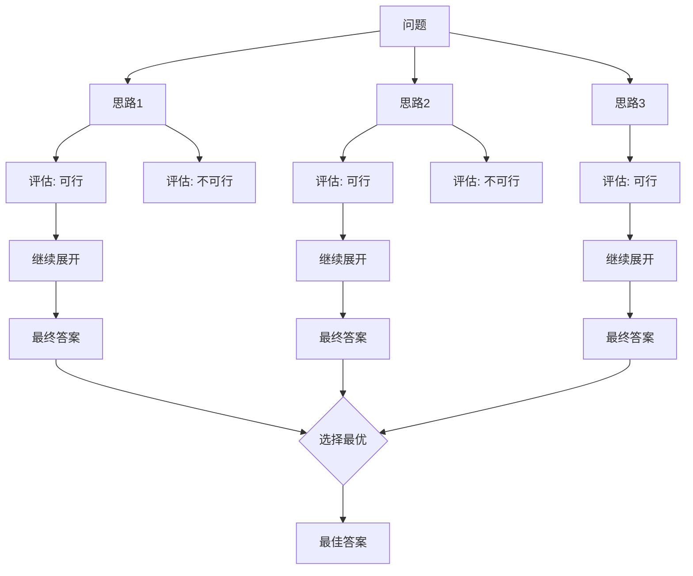

**核心思想**：
1. **分解**：把问题拆成多个思考分支
2. **生成**：每个分支产生多个思路
3. **评估**：给每个思路打分
4. **搜索**：用BFS/DFS找到最佳路径
5. **整合**：综合得出最终答案

**示例代码**：

```python
class TreeOfThoughts:
    def __init__(self, model):
        self.model = model
        self.tree = {}
    
    def decompose(self, question):
        """生成多个初始思路"""
        thoughts = []
        for _ in range(3):
            thought = self.generate_thought(question)
            thoughts.append(thought)
        return thoughts
    
    def evaluate(self, thought):
        """评估思路的质量"""
        score = self.model.evaluate(f"评估这个推理的质量：{thought}")
        return score
    
    def solve(self, question):
        """使用ToT解决问题"""
        # 第一层：生成初始思路
        thoughts = self.decompose(question)
        
        # 评估并排序
        scored_thoughts = [
            (thought, self.evaluate(thought)) 
            for thought in thoughts
        ]
        scored_thoughts.sort(key=lambda x: x[1], reverse=True)
        
        # 选择最佳思路继续展开
        best_thought = scored_thoughts[0][0]
        final_answer = self.expand(best_thought)
        
        return final_answer
```

### 5.3 思维图（Graph of Thoughts, GoT）

**终极形态**：思考不再是树，而是图！可以合并、循环、回溯。

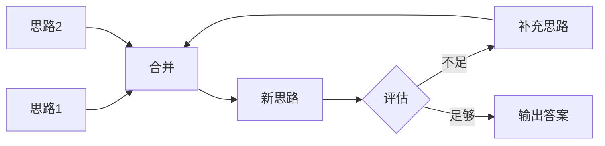

**GoT支持的操作**：

| 操作 | 说明 | 类比 |
|------|------|------|
| Generate | 生成新思路 | 头脑风暴 |
| Transform | 转换现有思路 | 换个角度想 |
| Aggregate | 合并多个思路 | 综合考量 |
| Refine | 精炼完善 | 打磨优化 |
| Select | 选择最佳 | 优胜劣汰 |

---

## 六、思维链的实际应用场景

### 6.1 数学解题

```
问题：一个水池有甲乙两个进水管。甲管单独注满需要6小时，
乙管单独注满需要8小时。如果两管同时打开，需要多久注满？

CoT推理：
让我一步步思考：
1. 甲管每小时注入 1/6 池
2. 乙管每小时注入 1/8 池
3. 两管同时开，每小时注入 1/6 + 1/8 = 4/24 + 3/24 = 7/24 池
4. 注满整池需要 24/7 小时 ≈ 3.43小时

答案：约3.43小时（或3小时26分钟）
```

### 6.2 代码生成

```
需求：写一个Python函数，判断一个数是否为质数

CoT推理：
让我一步步设计这个函数：
1. 质数定义：大于1的自然数，只能被1和自身整除
2. 边界情况：
   - 小于等于1的数不是质数
   - 2是最小的质数
3. 优化思路：
   - 不需要检查到n，只需要检查到√n
   - 可以先排除偶数
4. 算法设计：
   ```python
   def is_prime(n):
       if n <= 1:
           return False
       if n == 2:
           return True
       if n % 2 == 0:
           return False
       for i in range(3, int(n** | 推理过程看起来很完美，但答案错了 | 人工审核关键输出 |
| **循环论证** | 用结论证明前提 | 检查逻辑链条 |
| **无关推理** | 推理了很多，但和问题无关 | 添加约束提示词 |
| **格式依赖** | 模型只在特定格式下有效 | 多样化测试 |

### 8.3 最佳实践

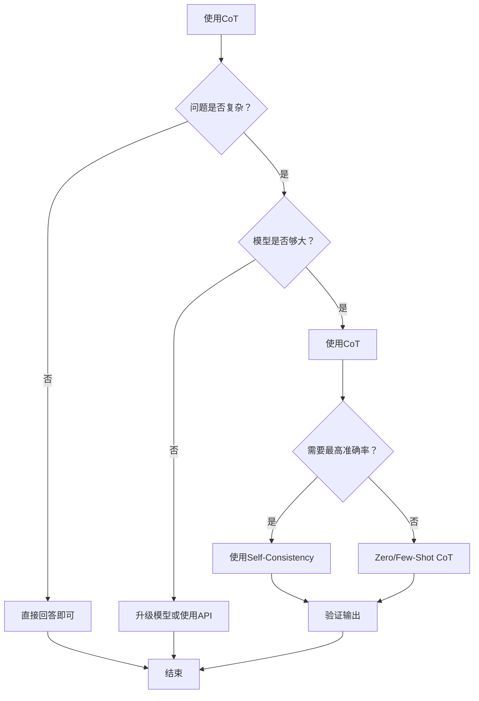

**实操建议**：

✅ **应该使用CoT的场景**：
1. 数学计算题
2. 逻辑推理题
3. 代码生成和调试
4. 复杂决策分析
5. 需要解释答案的场景

❌ **不建议使用CoT的场景**：
1. 简单事实问答（"珠穆朗玛峰多高？"）
2. 文本翻译
3. 情感分类
4. 文本摘要
5. 创意写作（可能限制想象力）

---

## 九、思维链的学术发展脉络

### 9.1 重要论文时间线

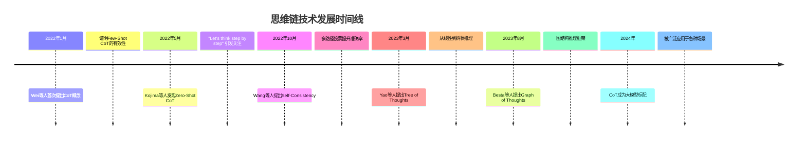

### 9.2 核心论文速览

| 论文 | 核心贡献 | 关键发现 |
|------|---------|---------|
| **Wei et al. 2022** | 首次定义CoT | Few-Shot CoT在GSM8K上提升3倍 |
| **Kojima et al. 2022** | Zero-Shot CoT | 一句话就能触发推理能力 |
| **Wang et al. 2022** | Self-Consistency | 多采样+投票，再提升5-15% |
| **Yao et al. 2023** | Tree of Thoughts | 支持回溯和全局搜索 |
| **Zhang et al. 2023** | Auto-CoT | 自动生成示例，减少人工 |

---

## 十、未来展望：CoT会如何进化？

### 10.1 技术趋势

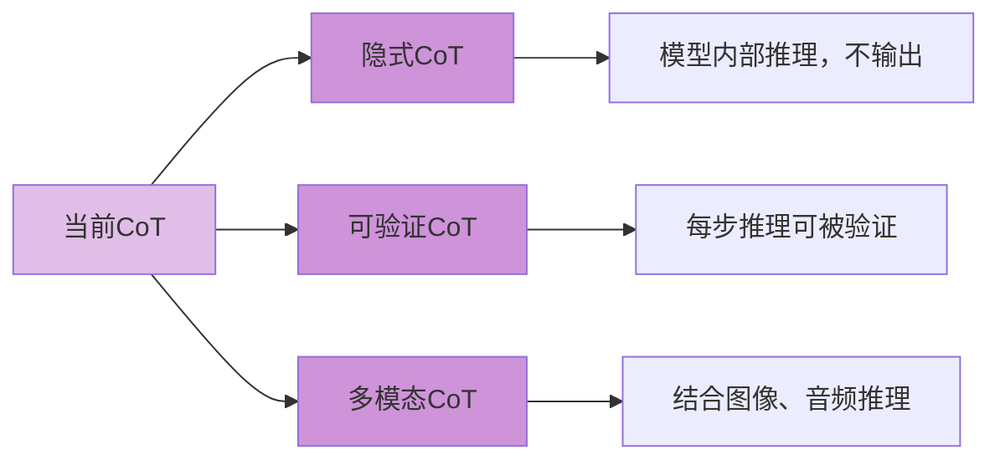

### 10.2 潜在突破方向

| 方向 | 描述 | 意义 |
|------|------|------|
| **隐式推理** | 模型在内部使用CoT，但只输出答案 | 既准确又简洁 |
| **可验证推理** | 每步推理都可被工具验证 | 消除幻觉 |
| **交互式Co T** | 人类可以介入和修正推理过程 | 人机协作 |
| **跨语言CoT** | 一种语言的推理迁移到其他语言 | 打破语言壁垒 |
| **专业化CoT** | 针对医疗、法律等领域的专用推理模板 | 行业落地 |

### 10.3 对普通用户的启示

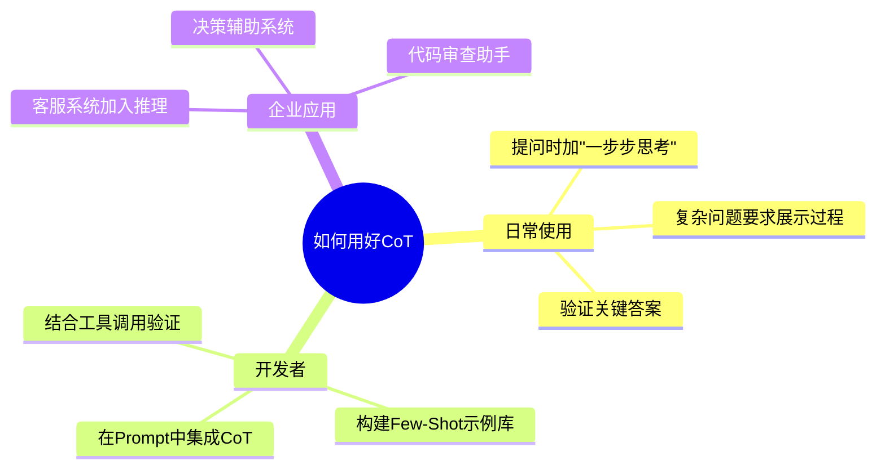

---

## 十一、实战案例完整演示

### 11.1 案例：用CoT解决高考数学题

```
题目：已知等差数列{an}的前n项和为Sn，若S3=9，S6=36，求S9。

🔴 不使用CoT（可能出错）：
答案是81。

🟢 使用CoT（正确且可验证）：
让我一步步思考：

1. 等差数列前n项和公式：Sn = n/2 × (2a₁ + (n-1)d)

2. 根据S3=9：
   S3 = 3/2 × (2a₁ + 2d) = 9
   3(a₁ + d) = 9
   a₁ + d = 3  —— ①

3. 根据S6=36：
   S6 = 6/2 × (2a₁ + 5d) = 36
   3(2a₁ + 5d) = 36
   2a₁ + 5d = 12  —— ②

4. 联立①②：
   由①得：a₁ = 3-d
   代入②：2(3-d) + 5d = 12
   6 - 2d + 5d = 12
   3d = 6
   d = 2

5. 求a₁：
   a₁ = 3 - 2 = 1

6. 求S9：
   S9 = 9/2 × (2×1 + 8×2)
   S9 = 9/2 × 18
   S9 = 81

答案：S9 = 81

验证：
- S3 = 3/2 × (2+4) = 9 ✓
- S6 = 6/2 × (2+10) = 36 ✓
- 计算过程正确！
```

### 11.2 案例：用CoT调试代码

```
问题：这段Python代码为什么会报错？

```python
def calculate_average(numbers):
    total = sum(numbers)
    average = total / len(numbers)
    return average

result = calculate_average([])
print(result)
```

🟢 CoT调试：
让我一步步分析：

1. 代码功能：计算列表平均值

2. 逐行检查：
   - 第2行：sum([]) = 0 ✓
   - 第3行：len([]) = 0
   - 第3行：0 / 0 → 除以零！

3. 错误类型：ZeroDivisionError

4. 根本原因：空列表导致除数为0

5. 修复方案：
   ```python
   def calculate_average(numbers):
       if not numbers:  # 添加边界检查
           return 0
       total = sum(numbers)
       average = total / len(numbers)
       return average
   ```

答案：空列表导致除以零，添加边界检查即可修复。
```

---

> **思维链的本质：让AI把思考过程"说出来"，通过中间步骤引导它走向正确答案。**

### 12.2 核心公式

```
传统Prompt：问题 → 答案
CoT Prompt：问题 → 推理步骤 → 答案
```

### 12.3 三种方法速查

| 方法 | 使用难度 | 效果 | 适用场景 |
|------|---------|------|---------|
| **Zero-Shot CoT** | ⭐ | ⭐⭐⭐ | 快速测试 |
| **Few-Shot CoT** | ⭐⭐⭐ | ⭐⭐⭐⭐⭐ | 生产环境 |
| **Self-Consistency** | ⭐⭐⭐⭐ | ⭐⭐⭐⭐⭐ | 高准确率需求 |

### 12.4 使用清单

**使用前检查**：
- [ ] 问题是否足够复杂？
- [ ] 模型参数是否够大（1000亿+）？
- [ ] 是否愿意接受更长的输出？
- [ ] 是否有能力验证答案正确性？

**使用时步骤**：
1. 选择CoT类型（Zero/Few/Self-Consistency）
2. 编写提示词（添加"一步步思考"）
3. 准备示例（如果是Few-Shot）
4. 生成并检查输出
5. 验证关键推理步骤

### 12.5 最终忠告

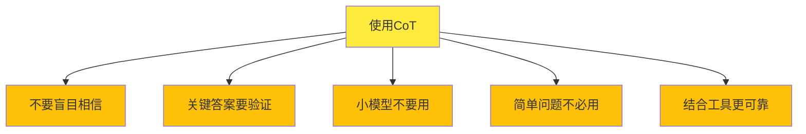

---

**写在最后**：

思维链（CoT）是近年来大模型领域最实用的技术突破之一。它不需要修改模型本身，只需要巧妙地改变我们提问的方式，就能让AI的推理能力上一个台阶。

**记住这个魔法咒语**：
```
"让我们一步步思考"
Let's think step by step.
```

下次遇到复杂问题，不妨试试这个方法。你会发现，原来AI也可以像学霸一样，把解题过程写得明明白白！

---

*如果你觉得这篇文章对你有帮助，欢迎**点赞、收藏、转发**！有问题也可以在评论区留言，我会第一时间回复。下期我们聊聊**大模型的工具调用（Function Calling）**，敬请期待！*

🔔 **关注公众号**，获取更多AI技术干货！

---

## 附录：CoT提示词模板库

### 模板1：通用推理

```
请一步步思考这个问题，展示你的推理过程：

[你的问题]
```

### 模板2：数学计算

```
解答这道数学题，要求：
1. 列出已知条件
2. 说明使用的公式或定理
3. 逐步计算
4. 验证答案

题目：[数学题]
```

### 模板3：代码生成

```
请按照以下步骤完成代码：
1. 理解需求
2. 设计算法或流程
3. 编写代码
4. 添加注释
5. 说明时间复杂度

需求：[你的需求]
```

### 模板4：逻辑分析

```
请使用假设法或排除法，一步步推理：

问题：[逻辑题]
```

### 模板5：决策分析

```
请从以下角度分析：
1. 列出所有选项
2. 分析每个选项的优缺点
3. 权衡利弊
4. 给出建议

问题：[决策问题]
```