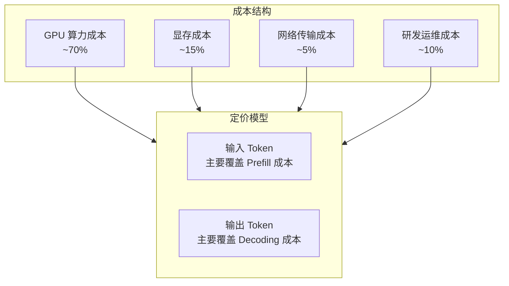
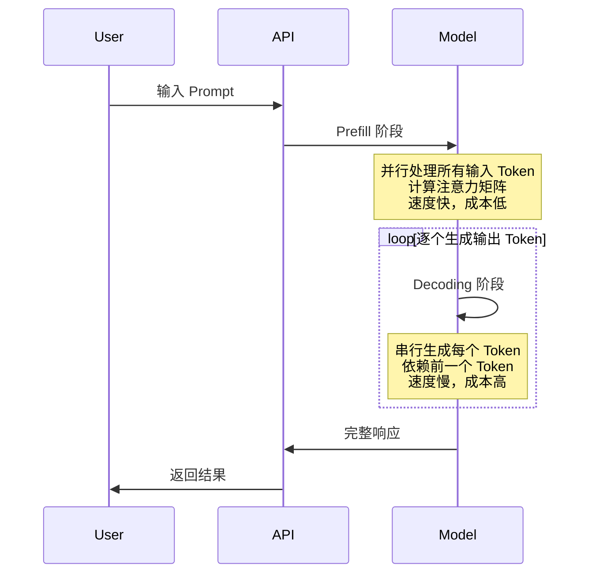
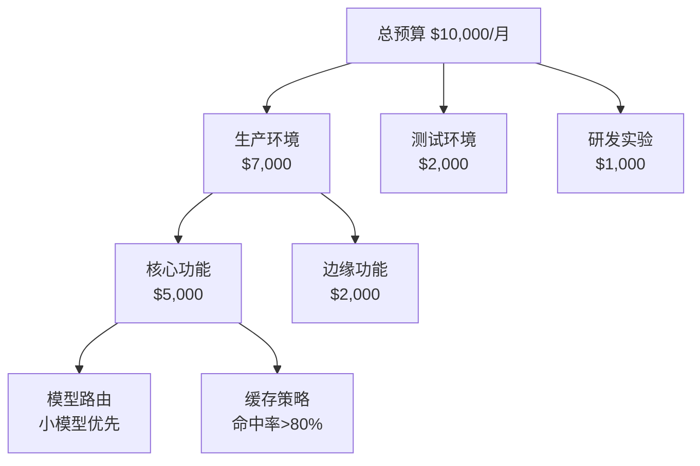
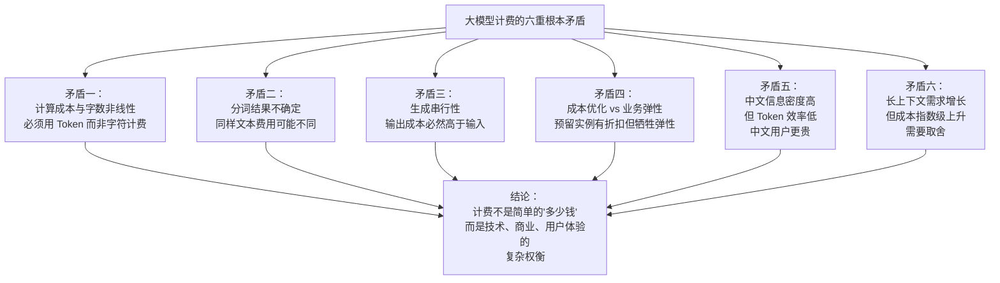

# 大模型计费深度解析：从 Token 原理到成本优化的全链路指南

> 当你调用 GPT-4 的 API 时，你有没有想过——为什么输入和输出的价格不一样？为什么中文比英文更"贵"？为什么同样的请求，有时候费用相差数倍？大模型的计费体系远比"按字数收费"复杂得多，它涉及分词算法、上下文窗口、推理成本结构、缓存机制等一系列技术细节。本文将从最基础的 Token 概念讲起，一步步拆解大模型计费的技术本质，最终给出生产环境的成本优化策略。

---

## 一、为什么大模型不按"字数"计费？

### 1.1 传统计费 vs Token 计费

在理解大模型计费之前，我们先看看传统的 AI 服务如何计费：

| 服务类型 | 计费方式 | 示例 |
|---------|---------|------|
| 语音识别 | 按音频时长 | ¥0.006/秒 |
| 图像识别 | 按调用次数 | ¥0.01/次 |
| 机器翻译 | 按字符数 | ¥50/百万字符 |
| OCR | 按页数 | ¥0.1/页 |

**大模型为什么不用这些方式？**

**根本矛盾之一：大模型的计算成本与"字数"不成线性关系。**

大模型的计算量主要取决于两个因素：

1. **输入序列长度**：需要处理的 Token 数量
2. **输出序列长度**：需要生成的 Token 数量

但同样的字数，Token 数量可能相差数倍（中文 vs 英文）。更重要的是，大模型的计算复杂度是 **O(n²)** 甚至更高——处理 1000 个 Token 的成本不是 100 个 Token 的 10 倍，而是 100 倍。

### 1.2 Token：大模型的"原子"

Token 是大模型处理文本的最小单位。它不是字符，不是单词，而是**经过分词算法处理后得到的子词单元**。

```
英文："Hello world"
→ Tokens: ["Hello", " world"] (2 tokens)

中文："你好世界"
→ Tokens: ["你", "好", "世", "界"] 或 ["你好", "世界"] (取决于分词器)

混合："Hello 你好"
→ Tokens: ["Hello", " 你", "好"] (3 tokens)
```

**关键洞察**：同样的语义内容，Token 数量可能差异巨大：

| 语言 | 文本 | 大致 Token 数 |
|------|------|-------------|
| 英文 | "Artificial Intelligence" | 2-3 |
| 中文 | "人工智能" | 2-4 |
| 日文 | "人工知能" | 3-5 |
| 代码 | `def hello(): print("world")` | 10-15 |

这意味着：**用中文对话比用英文更"贵"**——同样的信息量，中文通常需要更多的 Token。

---

## 二、Tokenization：计费的技术基础

### 2.1 什么是 Tokenization？

Tokenization（分词）是将连续文本切分为离散 Token 序列的过程。它是大模型的第一步处理，直接决定了：

- 模型能"理解"什么
- 计算成本是多少
- 计费金额是多少


### 2.2 主流分词算法对比

| 算法 | 代表模型 | 核心思想 | 特点 |
|------|---------|---------|------|
| **BPE** | GPT 系列 | 合并高频字符对 | 平衡词表大小和覆盖度 |
| **WordPiece** | BERT | 基于语言模型概率合并 | 适合多语言 |
| **Unigram** | T5、AlBERT | 从大方表逐步删减 | 更灵活 |
| **BBPE** | RoBERTa | BPE 的字节级版本 | 处理任意 Unicode |

### 2.3 BPE 算法详解

BPE（Byte Pair Encoding）是 GPT 系列使用的分词算法，理解它就能理解 Token 计费的本质：

**训练阶段**：

```
初始词汇表：所有单个字符
语料库：low lower lowest

第1轮：统计发现 "er" 出现最多，加入词汇表
词汇表：{l, o, w, e, r, s, t, er}
语料库：low low er lowest

第2轮：发现 "est" 出现最多，加入词汇表
...

最终词汇表包含：常见单词片段、高频组合
```

**推理阶段**：

```
输入："unhappiness"

最长匹配分词：
- "un" (在词汇表中) ✓
- "happiness" (在词汇表中) ✓

结果：["un", "happiness"] (2 tokens)

如果词汇表没有 "happiness"：
- "happ" ✓
- "iness" ✓
结果：["un", "happ", "iness"] (3 tokens)
```

**根本矛盾之二：分词结果的不确定性。**

同样的文本，不同的分词器、甚至同一分词器的不同版本，可能产生不同的 Token 数量。这导致计费金额存在不可预测性。

### 2.4 中文的 Token 困境

中文在 Tokenization 上面临特殊挑战：

```
英文："Internationalization"
→ ["International", "ization"] (2 tokens)
→ 词根+后缀，符合语义

中文："国际化"
→ ["国", "际", "化"] 或 ["国际", "化"] (2-3 tokens)
→ 单个汉字或简单组合，语义粒度不匹配
```

**为什么中文更"贵"？**

1. **字符集大**：中文有几万个字符，英文只有 26 个字母
2. **无空格分隔**：英文用空格天然分词，中文需要算法判断
3. **语义单元小**：中文的"词"边界模糊，常被切分为单字

**实测数据**：

| 内容 | 英文 Token 数 | 中文 Token 数 | 中文/英文比例 |
|------|-------------|-------------|-------------|
| 1000 字文章 | ~750 | ~1200-1500 | 1.6-2x |
| 技术文档 | ~800 | ~1400-1800 | 1.75-2.25x |
| 代码 | ~600 | ~1000-1300 | 1.7-2.2x |

这意味着：**同样的服务，中文用户的成本是英文用户的 1.5-2 倍**。

### 2.5 如何准确计算 Token？

各大厂商提供了 Token 计算工具：

```python
# OpenAI tiktoken
import tiktoken

encoding = tiktoken.encoding_for_model("gpt-4")
tokens = encoding.encode("你好世界")
print(len(tokens))  # 输出 Token 数量

# 查看具体 Token
for token in tokens:
    print(f"{token}: {encoding.decode([token])}")
```

**生产建议**：在发送请求前预估 Token 数量，避免超出预算。

---

## 三、大模型计费模型详解

### 3.1 计费的基本公式

大模型 API 的计费公式看似简单：

```
总费用 = 输入 Token 数 × 输入单价 + 输出 Token 数 × 输出单价
```

但背后的成本结构复杂得多：



### 3.2 为什么输出比输入贵？

观察主流大模型的定价：

| 模型 | 输入价格 | 输出价格 | 输出/输入比例 |
|------|---------|---------|-------------|
| GPT-4o | $2.5/M | $10/M | 4x |
| Claude 3.5 Sonnet | $3/M | $15/M | 5x |
| 文心一言 4.0 | ¥0.12/千 | ¥0.12/千 | 1x |
| 通义千问 Max | ¥0.04/千 | ¥0.12/千 | 3x |

**为什么输出 Token 更贵？**

大模型推理分为两个阶段：

**1. Prefill（预处理/编码）**

- 处理输入 Token
- 并行计算，速度快
- 计算量：O(n²)，但可并行

**2. Decoding（解码/生成）**

- 逐个生成输出 Token
- 串行计算，无法并行
- 计算量：O(n × m)，必须串行



**根本矛盾之三：生成过程的串行性导致输出成本远高于输入。**

生成 100 个 Token 的输出，需要调用模型 100 次（每次生成一个 Token），而处理 100 个 Token 的输入只需要一次前向传播。

### 3.3 上下文窗口与计费

上下文窗口（Context Window）是模型能处理的最大 Token 数。它直接影响计费：

```
模型：GPT-4 Turbo (128k 上下文)

场景1：短对话
输入：500 tokens
输出：200 tokens
费用：500 × $0.01 + 200 × $0.03 = $0.011

场景2：长文档分析
输入：100,000 tokens
输出：500 tokens
费用：100,000 × $0.01 + 500 × $0.03 = $1.015

场景3：超长对话（接近上限）
输入：120,000 tokens（历史对话累积）
输出：1000 tokens
费用：120,000 × $0.01 + 1000 × $0.03 = $1.23
```

**长上下文的成本陷阱**：

在多轮对话中，历史消息会累积到上下文中。第 10 轮对话的成本可能远高于第 1 轮，因为输入包含了前 9 轮的所有内容。

**优化策略**：

- 定期清理历史对话
- 使用摘要机制压缩历史
- 使用滑动窗口只保留最近 N 轮

### 3.4 主流厂商定价对比（2025-2026）

| 厂商 | 模型 | 输入价格 | 输出价格 | 上下文窗口 |
|------|------|---------|---------|-----------|
| **OpenAI** | GPT-4o | $2.5/M | $10/M | 128K |
| | GPT-4o-mini | $0.15/M | $0.6/M | 128K |
| | o1 | $15/M | $60/M | 200K |
| **Anthropic** | Claude 3.5 Sonnet | $3/M | $15/M | 200K |
| | Claude 3.5 Haiku | $0.25/M | $1.25/M | 200K |
| **Google** | Gemini 1.5 Pro | $3.5/M | $10.5/M | 2M |
| | Gemini 1.5 Flash | $0.35/M | $0.7/M | 1M |
| **阿里云** | 通义千问 Max | ¥0.04/千 | ¥0.12/千 | 128K |
| | 通义千问 Plus | ¥0.004/千 | ¥0.008/千 | 128K |
| **百度** | 文心一言 4.0 | ¥0.12/千 | ¥0.12/千 | 8K |
| | 文心一言 3.5 | ¥0.012/千 | ¥0.012/千 | 8K |
| **字节** | 豆包 Pro | ¥0.005/千 | ¥0.005/千 | 256K |
| | 豆包 Lite | ¥0.0008/千 | ¥0.0008/千 | 256K |

**价格趋势观察**：

1. **国产模型价格优势明显**：豆包 Lite 的价格是 GPT-4o-mini 的 1/10
2. **长上下文成为标配**：128K 已成基础配置，2M 上下文出现
3. **输入输出价差扩大**： reasoning 模型（o1）的输出价格是输入的 4 倍

---

## 四、计费模式：从按量到预留

### 4.1 按量计费（Pay-as-you-go）

最基础的计费模式，用多少付多少：

**优点**：
- 无 upfront 成本
- 弹性伸缩
- 适合流量波动大的场景

**缺点**：
- 单价最高
- 成本不可预测
- 高并发时可能触发限流

**适用场景**：初创公司、PoC 验证、流量不稳定的应用

### 4.2 包年包月/预留实例（Reserved Capacity）

预付费模式，承诺一定使用量换取折扣：

| 模式 | 折扣 | 适用场景 |
|------|------|---------|
| 按量计费 | 基准价 | 流量波动大 |
| 预留实例（1年） | 30-40% off | 稳定业务 |
| 预留实例（3年） | 50-60% off | 长期稳定业务 |

**根本矛盾之四：成本优化与业务弹性的权衡。**

预留实例能大幅降低成本，但牺牲了弹性——如果业务增长超预期，预留容量不够；如果业务下滑，预留容量浪费。

### 4.3 Batch 推理折扣

部分厂商提供 Batch 推理（异步处理）折扣：

```
实时推理：$10/M tokens
Batch 推理：$5/M tokens（50% off）

条件：
- 可接受延迟（24小时内返回）
- 大任务量（通常 >1000 条）
```

**适用场景**：离线数据分析、批量文档处理、非实时生成任务

### 4.4 缓存命中折扣（Prompt Caching）

OpenAI 等厂商推出了 Prompt Caching 机制：

```
首次请求：
- 输入：10000 tokens
- 费用：10000 × $0.01 = $0.10

后续请求（相同 prompt 前缀）：
- 缓存命中：9000 tokens
- 实际计算：1000 tokens
- 费用：9000 × $0.001 + 1000 × $0.01 = $0.019

节省：81%
```

**技术原理**：

大模型的 Prefill 阶段可以缓存 KV Cache。如果新请求的前缀与缓存匹配，可以直接复用，只计算新增部分。

**适用场景**：
- RAG 应用（相同的系统 prompt + 检索文档前缀）
- 多轮对话（历史消息缓存）
- 模板化生成（相同的指令模板）

### 4.5 Serverless vs 自建

| 维度 | Serverless API | 私有化部署 |
|------|---------------|-----------|
| 初始成本 | 低 | 高（GPU 采购） |
| 边际成本 | 按 Token | 电费+运维 |
| 弹性 | 自动 | 需手动扩容 |
| 延迟 | 网络延迟 | 本地延迟 |
| 数据安全 | 数据出域 | 完全可控 |
| 定制化 | 受限 | 完全自由 |

**自建的成本结构**：

```
硬件成本（A100 80G × 8）：~¥300,000
电力成本（每年）：~¥50,000
运维成本（工程师）：~¥400,000/年
折旧（3年）：~¥100,000/年

总成本：~¥550,000/年

等效 API 调用量（以 GPT-4 价格计算）：
~550,000 / 0.00003 = 18.3B tokens/年

盈亏平衡点：日均 50M tokens
```

**结论**：日均 Token 消耗低于 50M 的企业，使用 API 更划算。

---

## 五、隐藏成本：计费账单之外

### 5.1 重试与失败成本

API 调用可能失败，失败重试产生额外成本：

```python
#  naive 实现：失败就重试
for attempt in range(3):
    try:
        response = call_llm_api(prompt)
        break
    except:
        continue  # 重试，但已经计费了！
```

**问题**：某些错误（如内容过滤）在服务端已经计费，只是没有返回结果。

**优化**：
- 使用 `max_tokens` 限制输出长度
- 在 prompt 中明确要求简洁回答

### 5.3 上下文膨胀成本

多轮对话中，历史消息累积导致成本指数增长：

```
Round 1: 输入 500, 输出 200, 累计 700
Round 2: 输入 700+200=900, 输出 200, 累计 1100
Round 3: 输入 1100+200=1300, 输出 200, 累计 1500
...
Round 10: 输入 3700, 输出 200

总成本：Round 1-10 的输入总和 × 单价
```

**优化策略**：
- 定期重置对话
- 使用摘要替代完整历史
- 滑动窗口保留最近 N 轮

### 5.4 模型选择不当成本

用大模型处理简单任务：

```
任务："你好"

GPT-4: $0.00003 × 10 tokens = $0.0003
GPT-3.5: $0.0000015 × 10 tokens = $0.000015

差距：20 倍
```

**优化策略**：路由到合适的模型（Model Routing）。

---

## 六、成本优化实战策略

### 6.1 模型路由（Model Routing）

根据任务复杂度选择不同模型：

```python
class ModelRouter:
    def __init__(self):
        self.models = {
            'simple': 'gpt-3.5-turbo',      # 简单任务
            'standard': 'gpt-4o-mini',       # 标准任务
            'complex': 'gpt-4o',             # 复杂任务
            'reasoning': 'o1-preview',       # 推理任务
        }
    
    def route(self, task_complexity: str, prompt: str) -> str:
        model = self.models.get(task_complexity, 'gpt-4o-mini')
        return call_api(model, prompt)

# 使用
if is_simple_greeting(user_input):
    response = router.route('simple', prompt)
elif requires_reasoning(user_input):
    response = router.route('reasoning', prompt)
else:
    response = router.route('standard', prompt)
```

**收益**：简单任务使用小模型，成本降低 10-20 倍。

### 6.2 提示词优化

**1. 减少系统提示长度**

```python
# 不好的做法：冗长的系统提示
system_prompt = """
你是一个专业的客服助手。你需要：
1. 礼貌地回答用户问题
2. 在无法回答时转接人工
3. 记录用户反馈
4. ...（500 tokens）
"""

# 好的做法：精简核心指令
system_prompt = "专业客服助手：礼貌回答，无法解答时转人工。"
```

**2. 使用 Few-shot 而非长描述**

```python
# 不好的做法：长描述
prompt = """
请将以下文本分类为：科技、体育、娱乐、政治。
分类标准：
- 科技：涉及技术、互联网、AI 等
- 体育：涉及运动、比赛、运动员等
- ...（200 tokens）

文本：{text}
"""

# 好的做法：Few-shot 示例
prompt = """
分类示例：
文本："GPT-5 发布" → 科技
文本："世界杯决赛" → 体育
文本："明星婚礼" → 娱乐

文本：{text} →
"""
```

### 6.3 响应缓存

缓存常见查询的响应：

```python
import hashlib
from functools import lru_cache

class LLMCache:
    def __init__(self, redis_client):
        self.redis = redis_client
        self.ttl = 3600  # 1小时
    
    def get_key(self, model, prompt):
        content = f"{model}:{prompt}"
        return hashlib.md5(content.encode()).hexdigest()
    
    def get(self, model, prompt):
        key = self.get_key(model, prompt)
        return self.redis.get(key)
    
    def set(self, model, prompt, response):
        key = self.get_key(model, prompt)
        self.redis.setex(key, self.ttl, response)

# 使用
cache = LLMCache(redis)
cached = cache.get(model, prompt)
if cached:
    return cached  # 零成本

response = call_api(model, prompt)
cache.set(model, prompt, response)
return response
```

**适用场景**：FAQ、固定模板生成、重复性分析任务

### 6.4 批处理（Batching）

合并多个请求一次性处理：

```python
# 不好的做法：逐个处理
costs = []
for text in texts:
    result = extract_entities(text)  # 每次 API 调用
    costs.append(result)

# 好的做法：批处理
batch_prompt = """
请从以下文本中提取实体，每行一个文本：
1. {text1}
2. {text2}
3. {text3}
...
"""
results = extract_entities_batch(batch_prompt)  # 一次 API 调用
```

**收益**：减少 API 调用次数，降低网络开销。

### 6.5 量化与蒸馏

**模型量化**：将 FP16/FP32 模型压缩为 INT8/INT4

```
原始模型：70B 参数，FP16 → 140 GB 显存
量化模型：70B 参数，INT4 → 35 GB 显存

成本：
- 硬件：8×A100 → 4×A100（节省 50%）
- 速度：提升 2-4 倍
- 精度：下降 1-5%（可接受范围）
```

**模型蒸馏**：用大模型生成数据，训练小模型

```
教师模型：GPT-4（贵，能力强）
学生模型：Llama-3-8B（便宜，能力中等）

蒸馏过程：
1. 用 GPT-4 生成 10 万条高质量问答对
2. 用这些数据微调 Llama-3-8B
3. 学生模型达到教师模型 80% 能力，成本 1/100
```

---

## 七、成本监控与预算管理

### 7.1 实时成本追踪

```python
import time

class CostTracker:
    def __init__(self):
        self.daily_cost = 0
        self.daily_limit = 100  # $100/天
        self.call_count = 0
    
    def track(self, model, input_tokens, output_tokens):
        # 查询模型价格
        price_input, price_output = get_model_pricing(model)
        
        cost = (input_tokens * price_input + 
                output_tokens * price_output) / 1_000_000
        
        self.daily_cost += cost
        self.call_count += 1
        
        # 告警
        if self.daily_cost > self.daily_limit * 0.8:
            send_alert(f"日成本超过 80%: ${self.daily_cost:.2f}")
        
        return cost
    
    def get_stats(self):
        return {
            "daily_cost": self.daily_cost,
            "call_count": self.call_count,
            "avg_cost_per_call": self.daily_cost / max(self.call_count, 1)
        }
```

### 7.2 分层预算控制



### 7.3 成本归因分析

追踪每个功能、每个用户的成本：

```python
class AttributedCostTracker:
    def __init__(self):
        self.costs = defaultdict(lambda: defaultdict(float))
    
    def track(self, feature, user_id, model, input_tokens, output_tokens):
        cost = calculate_cost(model, input_tokens, output_tokens)
        self.costs[feature][user_id] += cost
    
    def report(self):
        # 按功能汇总
        for feature, users in self.costs.items():
            total = sum(users.values())
            print(f"{feature}: ${total:.2f}")
            
            # 按用户汇总
            top_users = sorted(users.items(), key=lambda x: x[1], reverse=True)[:10]
            for user_id, cost in top_users:
                print(f"  {user_id}: ${cost:.2f}")
```

---



---

## 九、给开发者的成本优化清单

### 9.1 设计阶段

- [ ] 预估 Token 消耗量，计算盈亏平衡点
- [ ] 设计模型路由策略，区分任务复杂度
- [ ] 规划缓存策略，识别可缓存的查询模式
- [ ] 设置预算上限和告警阈值

### 9.2 开发阶段

- [ ] 使用 tiktoken 等工具预估 Token 数量
- [ ] 优化提示词，减少不必要的 Token
- [ ] 实现响应缓存
- [ ] 添加成本追踪埋点

### 9.3 运维阶段

- [ ] 监控每日/每周成本趋势
- [ ] 分析高成本用户和功能
- [ ] 定期评估模型选择（新模型可能更便宜）
- [ ] 考虑 Batch 推理或预留实例

### 9.4 成本控制红线

| 指标 | 建议阈值 | 超过时行动 |
|------|---------|-----------|
| 单日成本 | 月预算/30 × 1.5 | 触发告警，检查异常 |
| 单次调用成本 | 平均成本 × 10 | 检查是否用了大模型 |
| 缓存命中率 | < 50% | 优化缓存策略 |
| 输出/输入比例 | > 5 | 检查是否过度生成 |

---

大模型计费不是简单的"多少钱一万字"，而是一个涉及分词算法、推理架构、成本结构、商业模式的复杂体系。理解这些技术细节，不是为了成为计费专家，而是为了在产品设计中做出更明智的权衡——在成本、性能、用户体验之间找到最优解。

随着模型效率提升（MoE、量化、投机解码）和算力成本下降，大模型的使用成本正在快速降低。但"理解成本结构"的能力永远不会过时——它帮助你在技术变革中始终做出最优决策。

---