# 一文彻底搞懂所有图片格式：从像素到算法的深度解剖

> 你以为图片格式只是后缀不同？背后的技术差异，决定了互联网的速度、清晰度和存储成本。

---

## 前言：为什么我们需要了解图片格式？

你有没有遇到过这些问题：

- 拍的照片太大，手机内存天天告急
- 设计师给的图，放到网页上模糊得看不清
- 保存个Logo，背景变成了白色，去都去不掉
- 同一个图片，有的格式100KB，有的格式10KB，差距在哪？

这些问题的根源，都在于**你不了解图片格式的本质差异**。

今天，我们用一篇超长科普文，从最基础的像素概念开始，**一步步拆解所有主流图片格式的技术原理、压缩算法、适用场景和底层逻辑**。

这篇文章可能很长，但读完你会彻底明白：

> **为什么要有这么多图片格式？它们的根本区别是什么？你应该怎么选？**

准备好了吗？我们开始。

---

## 第一章：图片的本质是什么？

### 1.1 从现实世界到数字世界

现实世界是**连续**的，而计算机是**离散**的。

要把一张照片变成计算机能存储的数据，必须经过两个关键步骤：

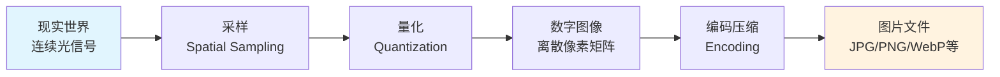

**这两个步骤决定了图片质量的上限**：

- **采样**：决定了分辨率（多少个像素）
- **量化**决定了色彩精度（每个像素用多少位存储）

---

### 1.2 像素：图片的最小单位

一张 1920×1080 的图片，意味着：

```
宽度：1920个像素点
高度：1080个像素点
总像素数：1920 × 1080 = 2,073,600 ≈ 207万像素
```

**每个像素需要记录什么信息？**

至少需要记录**颜色**。而颜色，通常用 RGB 三原色来表示：

```
每个像素 = R(红) + G(绿) + B(蓝)
```

**关键问题**：每个颜色通道用多少位（bit）来存储？

---

### 1.3 位深度：决定色彩精度的根本

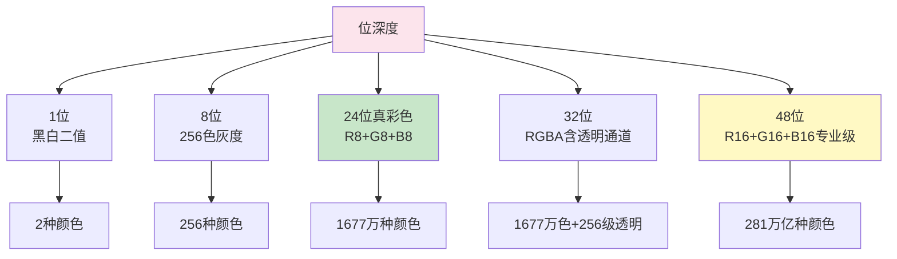

**24位真彩色的计算**：
```
R通道：8位 = 2^8 = 256级
G通道：8位 = 2^8 = 256级
B通道：8位 = 2^8 = 256级

总色彩数：256 × 256 × 256 = 16,777,216种
```

这就是为什么我们说24位是"真彩色"——因为人眼大约只能分辨1000万种颜色，1677万已经足够了。

---

### 1.4 未经压缩的图片有多大？

**计算公式**：
```
文件大小 = 宽度 × 高度 × 位深度 ÷ 8（字节）
```

**举例**：一张 1920×1080 的24位图片
```
1920 × 1080 × 24 ÷ 8 = 6,220,800 字节 ≈ 5.93 MB
```

**问题来了**：
> 一张普通的手机照片，如果未经压缩，要将近6MB。如果一天拍100张，就是600MB。视频每秒24帧，1分钟视频就是8.5GB。

**这就是为什么我们需要压缩**。

---

## 第二章：压缩的本质：为什么能变小？

### 2.1 压缩的底层逻辑

**核心思想**：找到数据中的**冗余**，用更短的方式表示它。

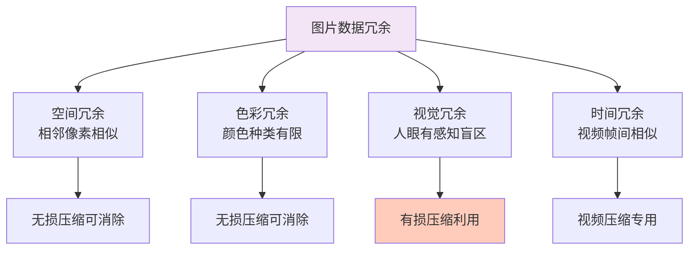

---

### 2.2 无损压缩 vs 有损压缩：根本分歧

**这是理解所有图片格式的关键分水岭**。

#### 无损压缩（Lossless）

**原理**：找到数据中的重复模式，用更短的编码替代。

**举例**：
```
原始数据：AAAAABBBBCCCDDE
压缩后：  5A4B3C2D1E
```

**特点**：
- ✅ 解压后100%还原，没有任何信息丢失
- ❌ 压缩率有限，通常只能缩小50%-70%

**算法代表**：
- RLE（Run-Length Encoding）
- Huffman编码
- LZW（Lempel-Ziv-Welch）
- Deflate（LZ77 + Huffman）

---

#### 有损压缩（Lossy）

**原理**：**主动丢弃人眼不敏感的信息**，永久删除部分数据。

**关键洞察**：
> 有损压缩的根本依据是**人类视觉系统的局限性**。

**人眼的"弱点"**：

| 特性 | 说明 | 被利用的方式 |
|------|------|------------|
| 对亮度敏感，对色度不敏感 | 能分辨细微亮度变化，但对颜色细节迟钝 | 色度二次采样（4:2:0） |
| 对高频细节不敏感 | 看不出极细密的纹理变化 | DCT变换后丢弃高频系数 |
| 有视觉掩蔽效应 | 复杂纹理区域看不出失真 | 量化时动态调整精度 |
| 对边缘敏感 | 能察觉轮廓模糊 | 边缘区域保留更多数据 |

**特点**：
- ✅ 压缩率极高，可以缩小90%以上
- ❌ 不可逆，丢失的信息永远找不回来

**算法代表**：
- JPEG（DCT变换编码）
- WebP（预测编码+变换编码）
- AVIF/HEIC（帧内预测+变换编码）

---

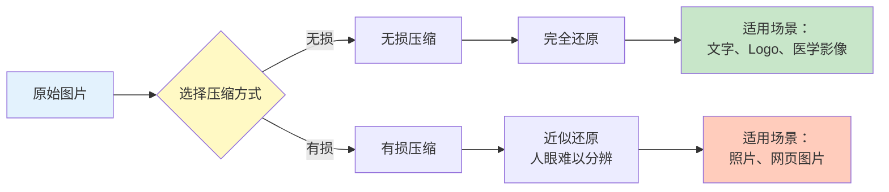

---

## 第三章：JPEG——互联网的功臣

### 3.1 基本信息

| 项目 | 内容 |
|------|------|
| 全称 | Joint Photographic Experts Group |
| 诞生时间 | 1992年 |
| 压缩类型 | **有损压缩**（也支持无损，但极少用） |
| 透明度 | ❌ 不支持 |
| 动画 | ❌ 不支持 |
| 位深度 | 8位/通道（24位真彩色） |
| 典型压缩率 | 10:1 到 20:1 |

---

### 3.2 JPEG压缩的完整流程（底层解剖）

这是理解有损压缩的**最佳案例**。

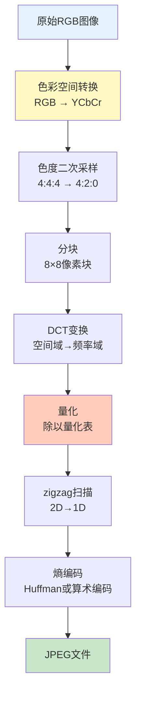

**让我们一步步拆解**：

---

#### 第1步：RGB → YCbCr 色彩空间转换

**根本原因**：人眼对亮度（Y）敏感，对色度（Cb、Cr）不敏感。

```
Y  = 0.299R + 0.587G + 0.114B  （亮度）
Cb = -0.1687R - 0.3313G + 0.5B + 128  （蓝色差）
Cr = 0.5R - 0.4187G - 0.0813B + 128  （红色差）
```

**效果**：把颜色和亮度分开，为下一步"扔掉颜色细节"做准备。

---

#### 第2步：色度二次采样（Chroma Subsampling）

**核心操作**：降低色度通道的分辨率。

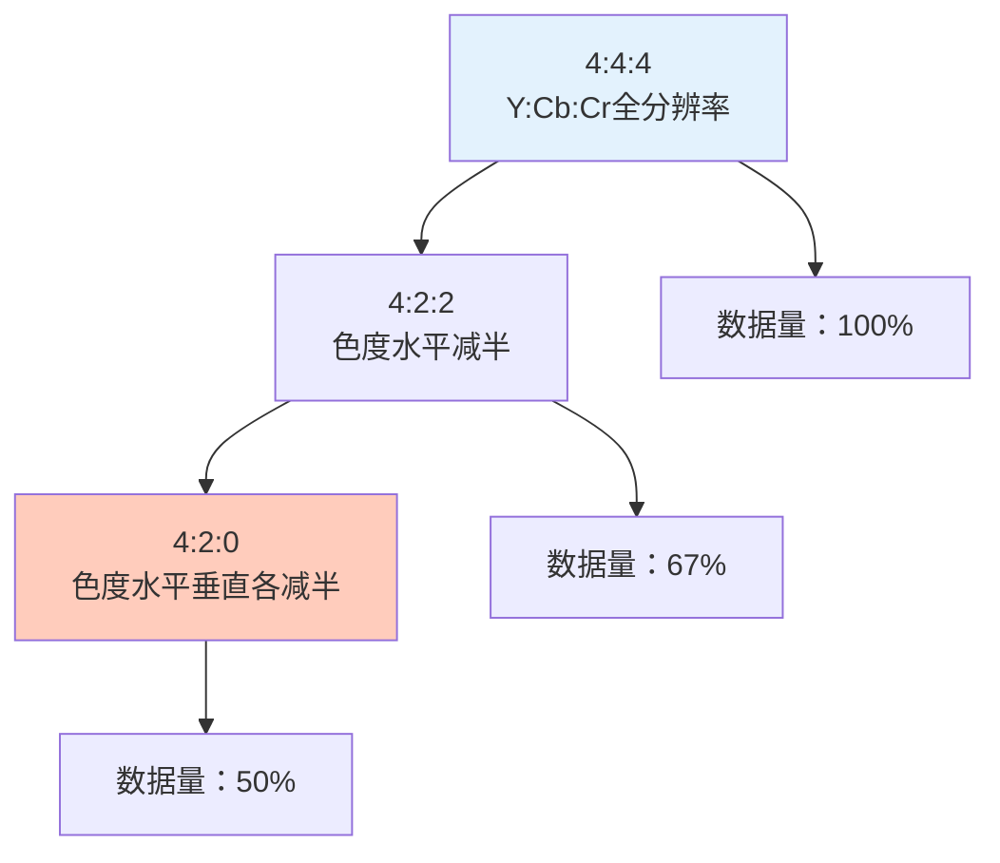

**4:2:0的含义**：
```
每4个Y（亮度）采样点，对应1个Cb和1个Cr采样点

原始：4个Y + 4个Cb + 4个Cr = 12个值
采样后：4个Y + 1个Cb + 1个Cr = 6个值

数据量直接减半！
```

**为什么人眼察觉不到？**

因为人眼视网膜中，对亮度敏感的视锥细胞密度远高于对颜色敏感的细胞。**JPEG利用了人类进化的"bug"**。

---

#### 第3步：分块（8×8）

**操作**：把每个通道分成8×8像素的小块，独立处理。

**根本原因**：
- 局部处理比全局处理更高效
- 8×8是性能和质量的平衡点（更小质量更好但计算量大）

---

#### 第4步：DCT变换（离散余弦变换）

**这是JPEG最核心的一步**。

**操作**：把8×8的像素块，从**空间域**转换到**频率域**。

```
空间域：每个位置的值 = 像素亮度
频率域：每个位置的值 = 某种频率成分的强度
```

**转换后**：
- 左上角（0,0）= DC系数 = 平均亮度
- 其他位置 = AC系数 = 各种频率成分

**关键洞察**：

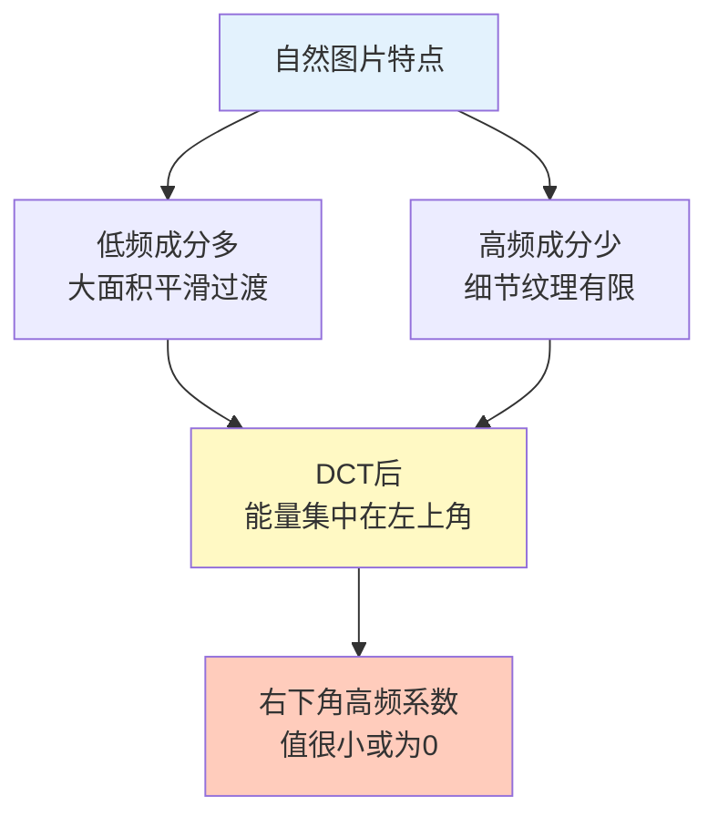

**这就是压缩的关键**：
> 高频系数很小，扔掉也不影响视觉效果。

---

#### 第5步：量化（Quantization）

**这是有损压缩真正"丢数据"的一步**。

**操作**：每个DCT系数 ÷ 量化表中对应的值，然后四舍五入取整。

```
量化后系数 = round(DCT系数 ÷ 量化表值)
```

**量化表长什么样？**

```
标准亮度量化表（部分）：
16  11  10  16  24  40  51  61
12  12  14  19  26  58  60  55
14  13  16  24  40  57  69  56
...
```

**规律**：
- 左上角（低频）量化值小 → 保留精度
- 右下角（高频）量化值大 → 大量舍入

**质量参数的本质**：
```
JPEG质量100：量化表值很小 → 几乎不丢数据 → 文件大
JPEG质量75：量化表值中等 → 平衡点
JPEG质量10：量化表值很大 → 大量数据被舍入 → 文件小但失真
```

**为什么JPEG压缩会出"方块效应"？**

因为8×8块独立量化，边缘处可能出现不连续。质量越低，越明显。

---

#### 第6步：熵编码（Huffman编码）

**这是无损压缩的一步**。

**操作**：对量化后的数据进行Huffman编码，出现频率高的值用短码，出现频率低的用长码。

**至此，JPEG压缩完成**。

---

### 3.3 JPEG的致命缺陷

| 缺陷 | 原因 | 表现 |
|------|------|------|
| 不支持透明度 | 设计之初没考虑这个需求 | 无法做半透明效果 |
| 文字/线条失真严重 | DCT对高频边缘处理差 | 文字周围出现"光晕" |
| 反复保存质量递减 | 每次压缩都丢数据 | 编辑多次后图片糊掉 |
| 不支持动画 | 单帧设计 | 无法做GIF动图 |

---

### 3.4 JPEG的适用场景

✅ **最适合**：
- 照片类图片（色彩丰富、渐变多）
- 网页banner、产品图
- 任何不需要透明度的自然图像

❌ **不适合**：
- Logo、图标（用PNG或SVG）
- 文字截图（用PNG）
- 需要透明背景的图片（用PNG或WebP）
- 需要反复编辑的中间文件（用TIFF或PSD）

---

## 第四章：PNG——无损的王者

### 4.1 基本信息

| 项目 | 内容 |
|------|------|
| 全称 | Portable Network Graphics |
| 诞生时间 | 1996年 |
| 压缩类型 | **无损压缩** |
| 透明度 | ✅ 支持（1位、8位Alpha通道） |
| 动画 | ❌ 不支持（APNG是扩展，非标准PNG） |
| 位深度 | 1/2/4/8/16位/通道 |
| 典型压缩率 | 无损，通常缩小50%-70% |

---

### 4.2 PNG的诞生背景：一段历史

PNG的诞生，根本原因是**专利问题**。

**故事**：
> 1994年，GIF格式使用的LZW压缩算法被Unisys公司申请了专利，开始收取授权费。开源社区震怒，决定开发一个**完全无专利限制**的替代格式。

**结果**：PNG诞生了，而且青出于蓝。

---

### 4.3 PNG压缩的完整流程

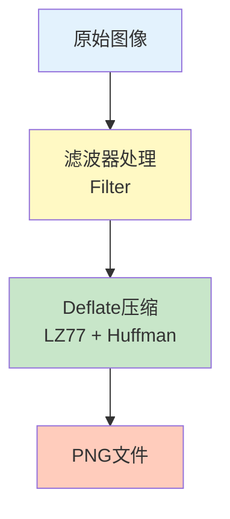

---

#### 第1步：滤波（Filtering）

**根本目的**：让数据更容易被压缩。

**核心洞察**：
> 自然图片中，相邻像素往往很相似。如果记录"与前一个像素的差值"而不是"绝对值"，会出现更多小数值和0，更容易被压缩。

**PNG的5种滤波器**：

| 类型 | 算法 | 适用场景 |
|------|------|----------|
| None | 不处理 | 颜色随机 |
| Sub | 减左边像素值 | 水平渐变 |
| Up | 减上边像素值 | 垂直渐变 |
| Average | 减左+上平均值 | 平滑过渡 |
| Paeth | 最优预测 | 复杂图像 |

**举例**：
```
原始行像素值：100  102  101  103  102

用Sub滤波（减左边）：100  2  -1  2  -1

压缩前：100, 102, 101, 103, 102（数值分散）
压缩后：100, 2, -1, 2, -1（数值集中在0附近，更容易压缩）
```

**关键点**：
> 滤波不是模糊图片，而是**可逆的数学变换**，解压时完全还原。

---

#### 第2步：Deflate压缩（LZ77 + Huffman）

**LZ77算法原理**：

找到数据中**重复出现的序列**，用"向后引用"替代。

```
原始数据：ABCDABCDABCD

LZ77编码：ABCD<向后3个位置,重复9个字符>

效果：12个字符 → 约8个字符
```

**Huffman编码原理**：

统计每个值的出现频率，频率高的用短码，频率低的用长码。

```
假设频率：0出现50次，1出现30次，2出现15次，3出现5次

Huffman编码：
0 → 0（1位）
1 → 10（2位）
2 → 110（3位）
3 → 111（3位）

平均码长缩短
```

**Deflate = LZ77 + Huffman**，先找重复，再优化编码。

---

### 4.4 PNG的两种模式

#### PNG-8（索引色）

| 项目 | 内容 |
|------|------|
| 色彩数 | 最多256色 |
| 透明度 | 支持1位（完全透明/不透明） |
| 文件大小 | 很小 |
| 适用场景 | 简单图标、Logo |

**本质**：用一个256色的调色板存储颜色，像素值只存索引。

---

#### PNG-24/PNG-32（真彩色）

| 项目 | 内容 |
|------|------|
| 色彩数 | 1677万色 |
| 透明度 | 支持8位Alpha通道（256级透明） |
| 文件大小 | 较大 |
| 适用场景 | 需要半透明的复杂图形 |

---

### 4.5 PNG的优缺点

| 优点 | 缺点 |
|------|------|
| ✅ 无损，质量完美 | ❌ 文件大，照片可达数MB |
| ✅ 支持透明度 | ❌ 不支持动画 |
| ✅ 支持伽马校正、色彩配置文件 | ❌ 不适合照片类图片 |
| ✅ 反复保存不损失 | ❌ 浏览器兼容性好但体积大影响加载 |

---

### 4.6 PNG的适用场景

✅ **最适合**：
- Logo、图标
- 文字截图
- 需要透明背景的图片
- 线条图、图表、漫画
- 需要反复编辑的中间文件

❌ **不适合**：
- 照片（用JPEG或WebP）
- 网页大图（加载太慢）

---

## 第五章：GIF——动图的鼻祖

### 5.1 基本信息

| 项目 | 内容 |
|------|------|
| 全称 | Graphics Interchange Format |
| 诞生时间 | 1987年 |
| 压缩类型 | **无损压缩**（LZW） |
| 透明度 | ✅ 支持1位（完全透明/不透明） |
| 动画 | ✅ 支持 |
| 位深度 | **8位索引色**（最多256色） |
| 典型文件大小 | 几百KB到几MB |

---

### 5.2 GIF的根本限制：256色

**这是GIF最致命的缺陷**。

**原因**：
> GIF设计于1987年，当时计算机内存极贵，显示设备只能显示少量颜色。256色已经是极限。

**后果**：

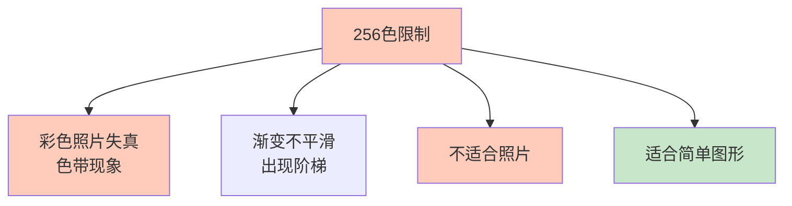

**为什么GIF照片看起来很"渣"？**

因为1677万色被压缩到256色，大量颜色信息被丢弃。渐变区域出现明显的"色带"（Color Banding）。

---

### 5.3 GIF动画的原理

**根本机制**：把多帧图片存在一个文件里，按时间播放。

**压缩技巧**：
- 帧间只存储**变化的部分**（差分帧）
- 未变化的区域不重复存储

**但GIF动画依然很大**，因为：
1. 每帧都是无损LZW压缩
2. 不支持帧间预测（现代视频格式支持）
3. 不支持有损压缩

---

### 5.4 GIF的优缺点

| 优点 | 缺点 |
|------|------|
| ✅ 支持动画 | ❌ 最多256色 |
| ✅ 兼容性极好 | ❌ 照片类图片质量差 |
| ✅ 无损压缩 | ❌ 文件大（尤其动画） |
| ✅ 支持透明（1位） | ❌ 不支持半透明 |

---

### 5.5 GIF的适用场景

✅ **最适合**：
- 简单动画、表情包
- 色彩少的动态图标
- 需要广泛兼容性的动图

❌ **不适合**：
- 照片（用JPEG）
- 复杂动画（用MP4视频）
- 需要半透明的图形（用APNG或WebP）

---

## 第六章：WebP——Google的挑战者

### 6.1 基本信息

| 项目 | 内容 |
|------|------|
| 开发者 | Google |
| 诞生时间 | 2010年 |
| 压缩类型 | **同时支持有损和无损** |
| 透明度 | ✅ 支持（有损/无损模式都支持） |
| 动画 | ✅ 支持 |
| 位深度 | 8位/通道 |
| 典型压缩率 | 有损：比JPEG小25%-34% |

---

### 6.2 WebP的底层技术

**WebP的有损压缩**：基于VP8视频编码的**帧内编码**。

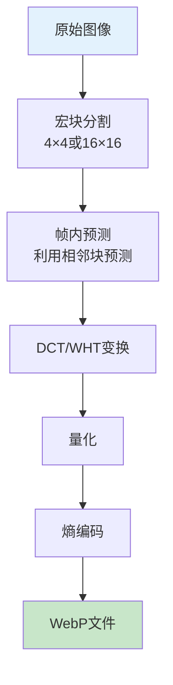

**WebP比JPEG先进的根本原因**：

| 技术 | JPEG | WebP |
|------|------|------|
| 预测编码 | ❌ 无 | ✅ 利用相邻像素预测 |
| 块大小 | 固定8×8 | 4×4到16×16自适应 |
| 色度采样 | 固定4:2:0 | 可配置 |
| 透明度 | ❌ 不支持 | ✅ 支持 |
| 动画 | ❌ 不支持 | ✅ 支持 |

**帧内预测的核心思想**：

```
对于当前像素块，用已经编码的相邻块来"猜"它的值。
只存储"猜测值"和"实际值"的差值。

因为猜得准，差值小，压缩率就高。
```

---

### 6.3 WebP的无损压缩

WebP的无损压缩也超越了PNG：

- 使用更复杂的预测变换
- 支持颜色缓存（频繁出现的颜色用短码）
- 支持多帧编码（动画）

**结果**：无损模式下，WebP比PNG小26%。

---

### 6.4 WebP的优缺点

| 优点 | 缺点 |
|------|------|
| ✅ 同时支持有损/无损/透明/动画 | ❌ 老浏览器不支持（IE全系列） |
| ✅ 体积比JPEG小25%-34% | ❌ 编码速度比JPEG慢 |
| ✅ 质量相同时文件更小 | ❌ 部分旧设备解码慢 |
| ✅ Alpha通道支持有损压缩 | ❌ 专业软件支持不足 |

---

### 6.5 WebP的适用场景

✅ **最适合**：
- 网页图片（现代浏览器全覆盖）
- 需要透明度的照片
- 需要动画但希望体积小的场景
- 移动端图片（省流量）

❌ **不适合**：
- 需要兼容IE的项目
- 专业图像处理（Photoshop支持有限）
- 打印输出

---

## 第七章：AVIF——下一代格式

### 7.1 基本信息

| 项目 | 内容 |
|------|------|
| 全称 | AV1 Image File Format |
| 开发者 | AOMedia（Google、Netflix、Amazon等） |
| 诞生时间 | 2019年 |
| 压缩类型 | **有损和无损** |
| 透明度 | ✅ 支持 |
| 动画 | ✅ 支持 |
| 位深度 | **8位/10位/12位** |
| HDR | ✅ 支持 |
| 典型压缩率 | 比JPEG小50%，比WebP小30% |

---

### 7.2 AVIF的底层技术

**AVIF本质上是AV1视频编码的单帧**。

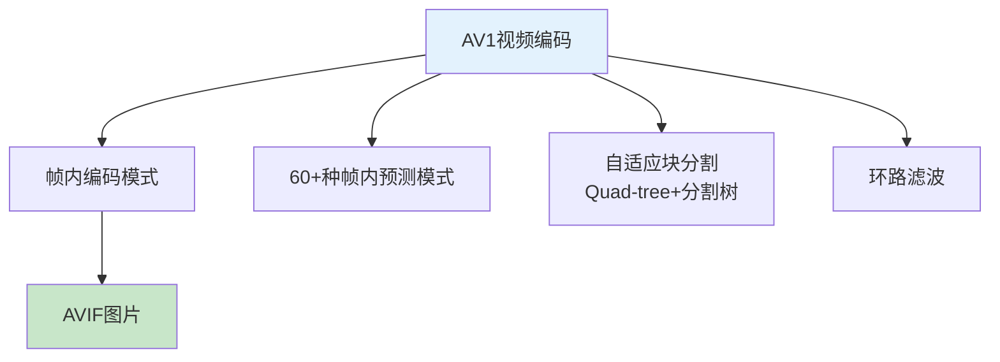

**AVIF为什么压缩率这么高？**

| 技术 | 说明 | 效果 |
|------|------|------|
| 更多预测模式 | 60+种帧内预测方向 | 预测更准，残差更小 |
| 更灵活的块分割 | 128×128到4×4 | 适应不同内容 |
| 10位/12位支持 | 色彩精度更高 | HDR、渐变平滑 |
| 先进的环路滤波 | CDEF + 去块滤波 | 减少方块效应 |
| 更好的熵编码 | 算术编码 | 压缩效率更高 |

---

### 7.3 AVIF的HDR支持：根本优势

**AVIF是首个支持HDR的主流图片格式**。

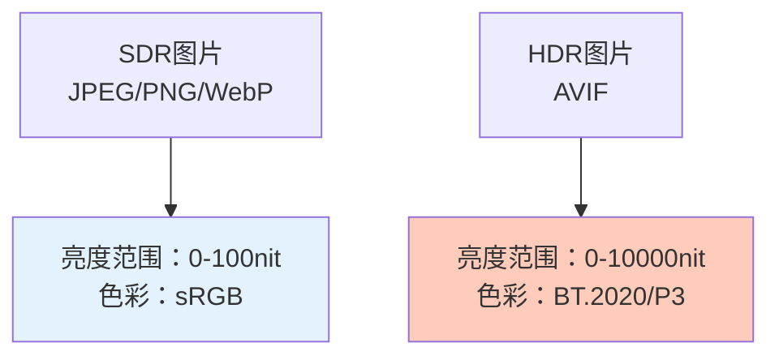

**这意味着什么？**
- 能存储真实世界的高动态范围（从星空到阳光）
- 在HDR显示器上显示效果远超JPEG
- 未来显示设备普及后，AVIF将是标配

---

### 7.4 AVIF的优缺点

| 优点 | 缺点 |
|------|------|
| ✅ 压缩率目前最高 | ❌ 编码极慢（比JPEG慢100倍） |
| ✅ 支持HDR | ❌ 浏览器覆盖率约70% |
| ✅ 支持10位/12位 | ❌ 老设备不支持 |
| ✅ 同时支持有损/无损/透明/动画 | ❌ 专利池虽然免授权费但企业有顾虑 |
| ✅ 开源免专利费 | ❌ 生态不如JPEG/WebP成熟 |

---

### 7.5 AVIF的适用场景

✅ **最适合**：
- 追求极致压缩率的场景
- HDR内容
- 移动端省流量
- 未来面向的应用

❌ **不适合**：
- 需要广泛兼容性的项目
- 实时编码场景（太慢）
- 专业印刷（生态不成熟）

---

## 第八章：SVG——矢量的世界

### 8.1 基本信息

| 项目 | 内容 |
|------|------|
| 全称 | Scalable Vector Graphics |
| 标准 | W3C |
| 诞生时间 | 1999年（1.0） |
| 类型 | **矢量图形** |
| 压缩类型 | 无损（XML文本，可用GZIP压缩） |
| 透明度 | ✅ 支持 |
| 动画 | ✅ 支持（CSS/SMIL/JS） |

---

### 8.2 矢量 vs 位图：根本区别

**这是理解SVG的关键**。

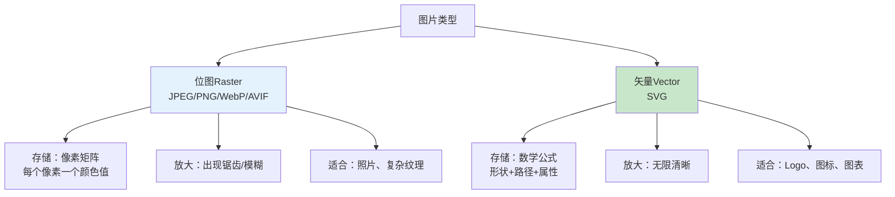

**位图的本质**：

```
一张100×100的位图 = 10000个颜色值的数组
放大2倍 = 每个像素变成4个 → 模糊/锯齿
```

**矢量的本质**：

```
SVG存储的是"指令"：
- 画一个圆，圆心(50,50)，半径30，红色填充
- 画一条线，从(0,0)到(100,100)，黑色，宽2

放大 = 重新执行指令，用更大尺寸渲染 → 永远清晰
```

---

### 8.3 SVG的本质优势

| 优势 | 根本原因 |
|------|----------|
| 无限缩放不失真 | 存储的是数学公式，不是像素 |
| 文件极小（简单图形） | 存储几个参数即可，不需要存储百万像素 |
| 可编辑、可交互 | XML格式，可用代码修改 |
| 支持CSS样式 | 可以响应式设计 |
| 支持动画 | CSS/SMIL/JS都可以 |
| 对SEO友好 | 搜索引擎可以读取内容 |

---

### 8.4 SVG的根本缺陷

| 缺陷 | 根本原因 |
|------|----------|
| 不适合照片类图片 | 照片无法用简单数学公式描述 |
| 复杂图形文件可能很大 | 路径节点太多时，XML文本量大 |
| 渲染性能问题 | 复杂SVG解码后渲染开销大 |
| 浏览器兼容性差异 | 高级特性（滤镜、混合模式）支持不一 |

---

### 8.5 SVG的适用场景

✅ **最适合**：
- Logo、品牌标识
- 图标（Icon）
- 图表、数据可视化
- 简单插画
- 需要响应式缩放的图形

❌ **不适合**：
- 照片
- 复杂纹理
- 扫描文档

---

## 第九章：其他重要格式速览

### 9.1 BMP——未压缩的原始格式

| 项目 | 内容 |
|------|------|
| 开发者 | Microsoft |
| 压缩 | 通常无压缩 |
| 特点 | Windows原生格式 |
| 缺点 | 文件极大 |

**本质**：直接存储像素矩阵，几乎不压缩。

**为什么还在用？**
- 某些老旧系统只认BMP
- 中间编辑格式（无损）
- 需要逐像素访问的场景

---

### 9.2 TIFF——专业领域的王者

| 项目 | 内容 |
|------|------|
| 全称 | Tagged Image File Format |
| 开发者 | Aldus（后被Adobe收购） |
| 压缩 | 可选无损（LZW、ZIP）或无压缩 |
| 位深度 | 最高32位/通道 |
| 特点 | 支持图层、多页、色彩配置文件 |

**适用场景**：
- 专业摄影后期
- 印刷出版
- 医学影像（DICOM基于TIFF）
- 地理信息系统（GeoTIFF）

---

### 9.3 HEIC/HEIF——苹果的尝试

| 项目 | 内容 |
|------|------|
| 全称 | High Efficiency Image File Format |
| 开发者 | MPEG |
| 压缩 | 基于HEVC（H.265）编码 |
| 特点 | 苹果iPhone默认拍照格式 |

**优缺点**：
- ✅ 压缩率接近AVIF
- ✅ 支持连拍、深度图、多图像
- ❌ 专利费高昂，非苹果生态支持差
- ❌ 浏览器兼容性差

---

### 9.4 ICO——网站图标专用

| 项目 | 内容 |
|------|------|
| 特点 | 一个文件可存多个尺寸 |
| 压缩 | 通常用BMP或PNG编码 |
| 用途 | 浏览器标签页图标（favicon） |

---

## 第十章：全景对比：一张图看懂所有格式

### 10.1 格式能力矩阵

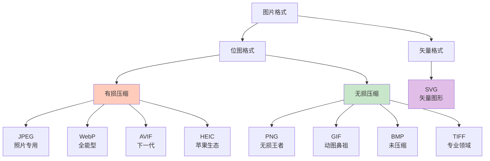

---

### 10.2 功能对比表

| 格式 | 有损 | 无损 | 透明 | 动画 | HDR | 适用场景 |
|------|------|------|------|------|-----|----------|
| JPEG | ✅ | ❌ | ❌ | ❌ | ❌ | 照片 |
| PNG | ❌ | ✅ | ✅ | ❌ | ❌ | Logo/文字/透明 |
| GIF | ❌ | ✅ | 1位 | ✅ | ❌ | 简单动画 |
| WebP | ✅ | ✅ | ✅ | ✅ | ❌ | 网页全能 |
| AVIF | ✅ | ✅ | ✅ | ✅ | ✅ | 下一代标准 |
| SVG | - | ✅ | ✅ | ✅ | - | 矢量图形 |
| HEIC | ✅ | ✅ | ✅ | ✅ | ✅ | 苹果生态 |
| BMP | ❌ | ✅ | ❌ | ❌ | ❌ | 遗留系统 |
| TIFF | ❌ | ✅ | ✅ | ✅ | ✅ | 专业印刷 |

---

### 10.3 压缩率对比（同一张1920×1080照片）

| 格式 | 质量设置 | 文件大小 | 压缩率 |
|------|---------|---------|--------|
| BMP | 无压缩 | 5.93 MB | 0% |
| PNG | 无损 | 2.8 MB | 53% |
| JPEG | 质量90 | 450 KB | 92% |
| JPEG | 质量75 | 250 KB | 96% |
| WebP | 有损80 | 180 KB | 97% |
| AVIF | 有损80 | 120 KB | 98% |

**根本洞察**：
> 有损压缩的压缩率远超无损压缩，因为**它利用了人眼的感知局限性**。

---

## 第十一章：根本问题：为什么要有这么多格式？

### 11.1 答案：因为没有银弹

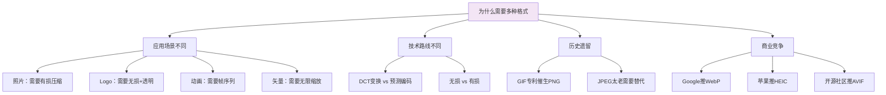

**根本原因**：

> **不同的应用场景对图片的需求是矛盾的**：
> - 照片需要高压缩率 → 需要有损
> - Logo需要完美还原 → 需要无损
> - 图标需要无限缩放 → 需要矢量
> - 动图需要帧序列 → 需要动画支持
>
> **没有任何一种格式能同时满足所有需求。**

---

### 11.2 格式演进的驱动力

| 阶段 | 驱动力 | 代表格式 |
|------|--------|----------|
| 1980s | 显示设备限制 | GIF、BMP |
| 1990s | 互联网兴起 | JPEG、PNG |
| 2010s | 移动互联网省流量 | WebP |
| 2020s | HDR/4K/8K需求 | AVIF、HEIC |

---

## 第十二章：实战指南：如何选择正确的格式？

### 12.1 决策树

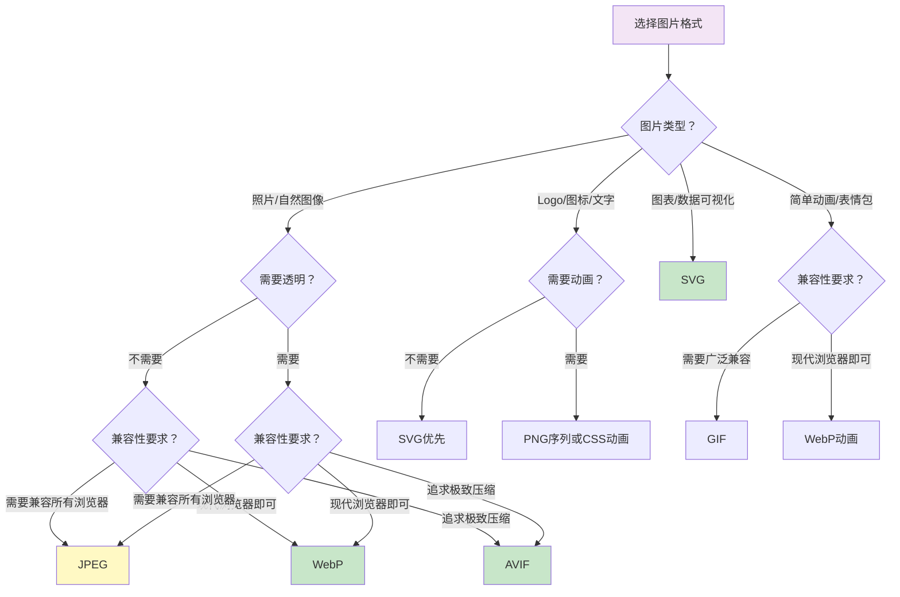

---

### 12.2 场景推荐

#### 场景1：电商网站产品图

| 需求 | 推荐格式 |
|------|----------|
| 主图 | WebP（有损） + JPEG降级 |
| 缩略图 | WebP（有损） |
| 需要透明背景 | WebP（有损+透明） |
| 兼容IE | JPEG |

---

#### 场景2：个人博客配图

| 需求 | 推荐格式 |
|------|----------|
| 文章配图 | WebP 或 AVIF |
| 代码截图 | PNG |
| 头像 | WebP 或 PNG |
| 图表/流程图 | SVG |

---

#### 场景3：App内图片

| 需求 | 推荐格式 |
|------|----------|
| iOS | HEIC 或 WebP |
| Android | WebP 或 AVIF |
| 跨平台 | WebP |
| 图标 | SVG 或 PNG |

---

#### 场景4：专业摄影后期

| 需求 | 推荐格式 |
|------|----------|
| 原始文件 | RAW（相机格式） |
| 中间编辑 | TIFF 或 PSD |
| 最终导出 | JPEG（交付） / AVIF（存档） |

---

### 12.3 终极建议

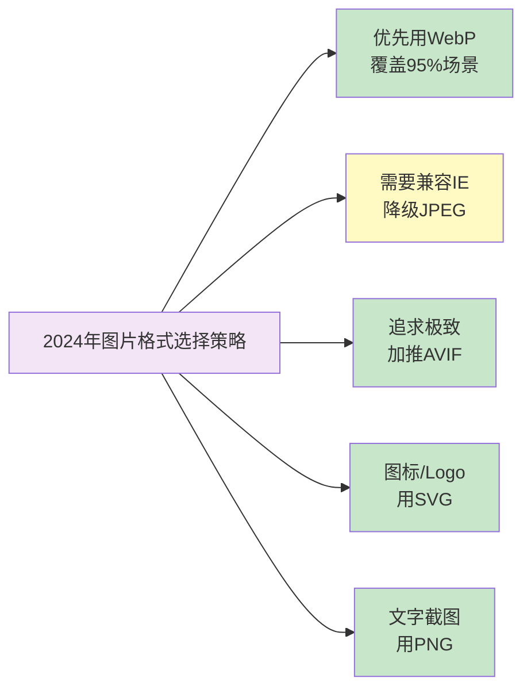

---
