# 推荐算法：从萌芽到智能的六十年进化史

> 当你打开手机，刷到一条让你会心一笑的短视频；当你打开电商App，首页恰好是你想买的东西——这不是巧合，这是推荐算法在背后默默工作。本文将从推荐算法的起源讲起，由浅入深，带你走过它六十年的进化之路。

---

## 一、缘起：信息过载时代的呼唤

### 1.1 一个古老的问题

推荐的本质，其实是一种古老的智慧：**帮你从海量选项中找到最适合你的那个。**

早在古希腊的集市上，商人就知道把"熟客喜欢的东西"放在显眼的位置。这可以说是"推荐"最原始的形态——基于经验的个性化。但真正的"推荐算法"，要等到信息爆炸的时代才会被催生。

1990年代，互联网兴起，信息量呈指数级增长。人们突然发现：**信息不再是稀缺资源，注意力才是。** 如何帮助用户在海量信息中找到所需，成为一个迫切的工程问题。搜索引擎解决了"人找信息"的问题，而推荐系统要解决的，是**"信息找人"**的问题。

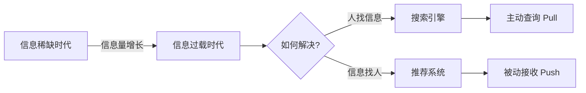

### 1.2 两个奠基性的思想

在推荐算法正式诞生之前，有两个思想奠定了它的理论基础：

**第一个思想：协同过滤（Collaborative Filtering）。**

这个概念最早可以追溯到1992年，Xerox PARC 的 David Goldberg 等人开发了 **Tapestry** 系统。这是一个邮件过滤系统，其核心理念是：**"让的人帮我过滤信息"**——即从"协同"的角度，利用群体的智慧来为个体服务。

**第二个思想：内容过滤（Content-based Filtering）。**

这一思想源于信息检索领域，核心是：**分析物品本身的特征，找到与用户历史偏好相似的物品。** 如果用户喜欢看科幻电影，那就推荐更多科幻电影。这种思路直观且易于理解。

这两种思想，如同推荐算法世界的"阴"与"阳"，此后的所有发展，几乎都可以看作是这两种思想的变体、融合与升华。

---

## 二、萌芽期（1992-2000）：从概念到系统

### 2.1 GroupLens：第一个真正的推荐系统

1994年，明尼苏达大学的 **GroupLens** 系统横空出世，这是学术界公认的第一个自动化协同过滤推荐系统。它为 Usenet 新闻组用户提供文章推荐，核心思想非常朴素：

> **和你品味相似的人，喜欢的东西你也可能喜欢。**

GroupLens 的工作流程如下：

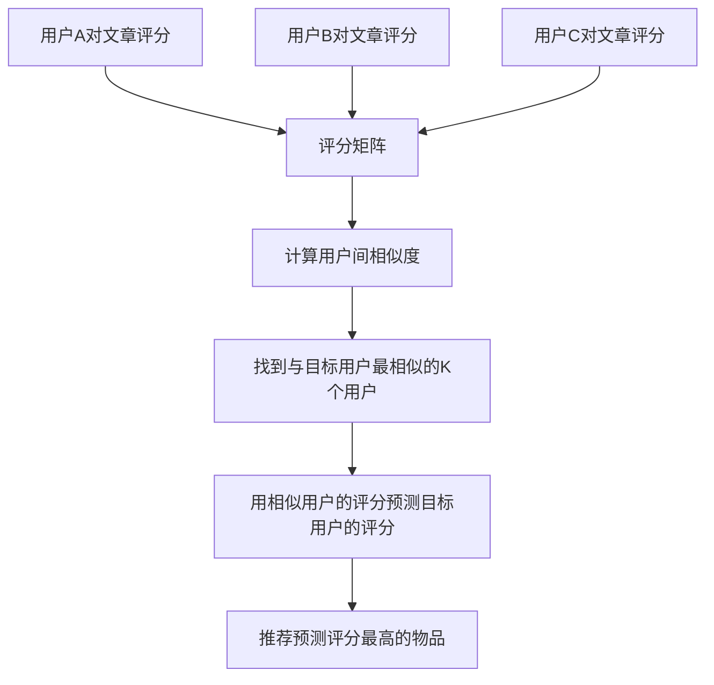

这个流程中，最关键的一步是**"相似度计算"**。GroupLens 使用了 **皮尔逊相关系数** 来衡量用户之间的相似程度：

$$sim(u, v) = \frac{\sum_{i \in I_{uv}}(r_{ui} - \bar{r}_u)(r_{vi} - \bar{r}_v)}{\sqrt{\sum_{i \in I_{uv}}(r_{ui} - \bar{r}_u)^2} \cdot \sqrt{\sum_{i \in I_{uv}}(r_{vi} - \bar{r}_v)^2}}$$

其中 $r_{ui}$ 表示用户 $u$ 对物品 $i$ 的评分，$\bar{r}_u$ 是用户 $u$ 的平均评分，$I_{uv}$ 是用户 $u$ 和 $v$ 共同评分过的物品集合。

### 2.2 Amazon 的里程碑：Item-CF

1998年，Amazon 的 Greg Linden 等人发表了著名的论文 *"Amazon.com Recommendations: Item-to-Item Collaborative Filtering"*，提出了一种改变游戏规则的思路：**不计算用户之间的相似度，而是计算物品之间的相似度。**

这就是后来被称为 **Item-based Collaborative Filtering（Item-CF）** 的方法。

为什么这一转换如此重要？

| 对比维度 | User-CF | Item-CF |
|---------|---------|---------|
| 相似度计算对象 | 用户与用户 | 物品与物品 |
| 核心逻辑 | 找到和你相似的人，推荐他们喜欢的东西 | 找到和你喜欢的东西相似的东西，推荐给你 |
| 适用场景 | 用户数少、物品数多 | 物品数少、用户数多 |
| 稳定性 | 用户兴趣变化快，需频繁更新 | 物品相似度相对稳定 |
| 可解释性 | "和你相似的人也喜欢…" | "看了这个的人还看了…" |

Amazon 选择的 Item-CF 不仅计算效率更高（物品相似度可以离线预计算），而且推荐理由更直观——"购买此商品的人也购买了…"，这句话已经成为电商推荐的标准模板。

### 2.3 这一时期的核心局限

早期的协同过滤方法虽然开创了先河，但面临几个根本性问题：

1. **数据稀疏性（Sparsity）**：用户只对极少数物品评分，评分矩阵极度稀疏（通常稀疏度在99%以上）。
2. **冷启动问题（Cold Start）**：新用户没有历史行为，新物品没有被任何人评分，系统无法做出有效推荐。
3. **可扩展性（Scalability）**：随着用户和物品规模增长，计算所有用户/物品对的相似度代价巨大。

这三个问题，将驱动推荐算法的下一次重大跃迁。

---

## 三、成熟期（2000-2010）：矩阵分解与Netflix Prize

### 3.1 Netflix Prize：一场改变历史的竞赛

2006年10月，Netflix 做了一件震动整个推荐系统社区的事：**公开了包含1亿条评分数据的数据集，并悬赏100万美元，奖励能将推荐精度提升10%的团队。**

这场竞赛持续了近三年，吸引了来自186个国家的超过4万支队伍参加。它不仅是推荐算法发展史上的里程碑事件，更直接推动了**矩阵分解方法**的崛起。

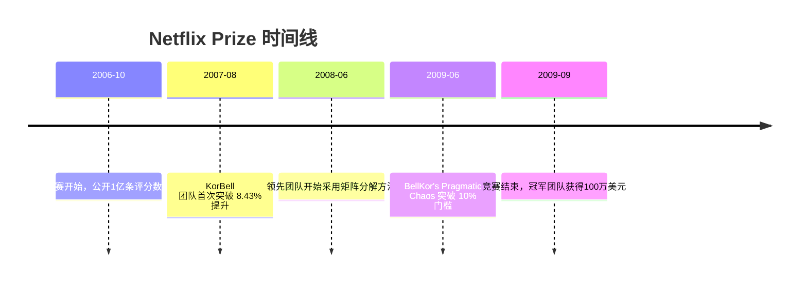

### 3.2 矩阵分解：从"表面相似"到"深层特征"

矩阵分解的核心思想可以用一句话概括：**将高维稀疏的评分矩阵，分解为两个低维稠密矩阵的乘积。**

假设我们有 $m$ 个用户和 $n$ 个物品，评分矩阵 $R \in \mathbb{R}^{m \times n}$ 极度稀疏。矩阵分解将其近似为：

$$R \approx P \times Q^T$$

其中 $P \in \mathbb{R}^{m \times k}$ 是用户隐因子矩阵，$Q \in \mathbb{R}^{n \times k}$ 是物品隐因子矩阵，$k \ll \min(m, n)$ 是隐因子维度。

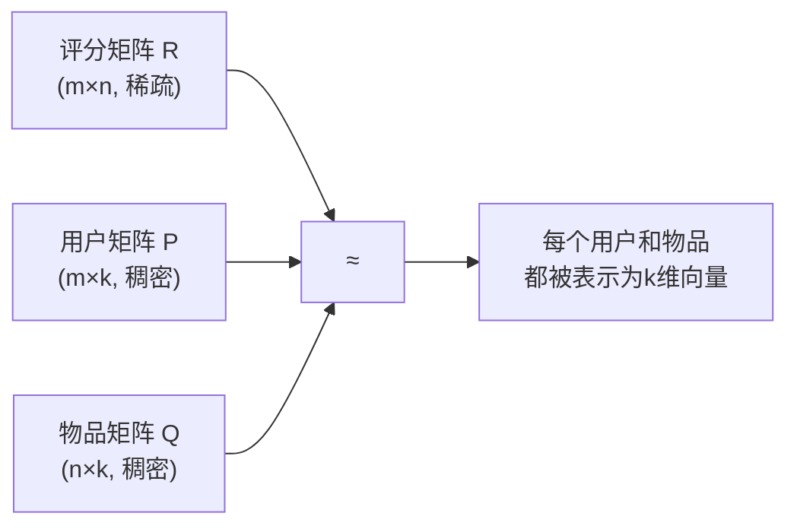

**为什么矩阵分解比近邻方法更强大？**

核心在于**隐因子（Latent Factor）**。近邻方法只能在"表面"比较用户或物品的相似度——如果两个用户评分了相同的电影且分数接近，他们就相似。但矩阵分解挖掘出了**隐藏在评分背后的潜在特征维度**，比如电影的"文艺程度"、"动作含量"、"恐怖程度"等，即使用户和物品之间没有直接交集，也可以通过隐因子空间计算它们的关系。

Simon Funk 在 Netflix Prize 中提出了一种简洁的梯度下降方法（后来被称为 **SVD** 方法），其目标函数为：

$$\min_{P, Q} \sum_{(u,i) \in \text{known}} (r_{ui} - p_u^T q_i)^2 + \lambda(\|p_u\|^2 + \|q_i\|^2)$$

其中 $\lambda$ 是正则化系数，防止过拟合。

此后，Koren 等人进一步引入了偏置项（bias），将评分拆解为：

$$\hat{r}_{ui} = \mu + b_u + b_i + p_u^T q_i$$

- $\mu$：全局平均分
- $b_u$：用户偏置（该用户打分偏高还是偏低）
- $b_i$：物品偏置（该物品本身评分偏高还是偏低）
- $p_u^T q_i$：用户与物品在隐因子空间中的交互

这看似简单的四个加项，每一项都在解决一个具体的问题。比如，即使不知道用户和物品之间的任何交互，仅凭偏置项就能给出一个合理的基准预测——这对冷启动问题是一个有意义的缓解。

### 3.3 这一时期的重要衍生方法

矩阵分解的成功催生了一系列衍生方法：

**SVD++**：在 SVD 的基础上融入了用户的隐式反馈信息（如浏览、点击等行为，即使没有显式评分），进一步提升了精度。

$$\hat{r}_{ui} = \mu + b_u + b_i + q_i^T \left(p_u + |N(u)|^{-\frac{1}{2}} \sum_{j \in N(u)} y_j\right)$$

其中 $N(u)$ 是用户 $u$ 有隐式反馈的物品集合，$y_j$ 是物品 $j$ 的隐式反馈因子向量。

**TimeSVD++**：考虑到用户偏好会随时间变化，引入了时间因子，让偏置项和隐因子都是时间的函数。这标志着推荐系统开始关注**时序动态性**。

**非负矩阵分解（NMF）**：要求分解后的矩阵元素非负，使得隐因子更具可解释性。

**概率矩阵分解（PMF）**：从概率角度建模，假设评分服从高斯分布，为矩阵分解提供了贝叶斯解释。

---

## 四、百花齐放（2010-2015）：从单一模型到生态构建

### 4.1 推荐系统的工业架构成型

2010年前后，随着互联网公司规模膨胀，推荐系统不再只是一个算法问题，而变成了一个**系统工程问题**。业界逐渐形成了经典的**"召回-排序-重排"三段式架构**：

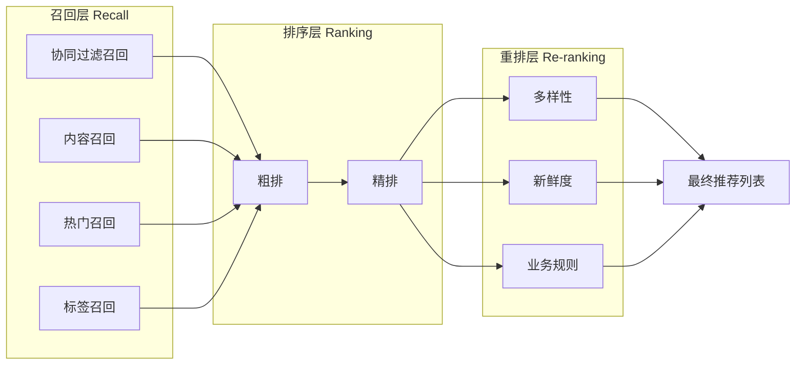

**为什么要分三层？**

- **召回层**：从百万甚至上亿物品中快速筛选出数百到数千候选物品，追求"快"和"全"。
- **排序层**：对候选物品进行精细排序，追求"准"。
- **重排层**：在精排结果基础上考虑多样性、业务规则等，追求"好"。

这种分层架构的思想源于一个朴素的工程原则：**计算资源有限，好钢要用在刀刃上。** 简单模型快速过滤大量无关物品，复杂模型在少量候选上精雕细琢。

### 4.2 特征工程的黄金时代

2012年前后，随着特征工程的发展，**逻辑回归（LR）** 及其变体成为排序阶段的主流选择。Facebook 在2014年发表了著名的 **GBDT+LR** 方案，开启了特征自动组合的先河：

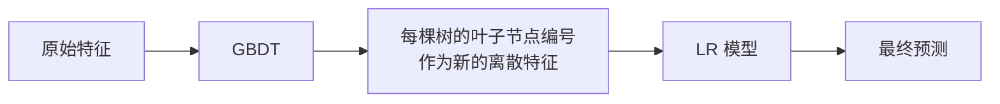

**为什么 GBDT+LR 如此有效？**

逻辑回归本质上是一个线性模型，只能捕捉特征的线性关系。而推荐场景中，大量有效信号来自**特征交叉**——比如"男性+体育"的点击率远高于单独看"男性"或"体育"。GBDT 通过决策树的路径自动生成了特征交叉组合，再交给 LR 进行线性预测，两者取长补短。

随后，**Factorization Machines（FM, 2010）** 由 Steffen Rendle 提出，将矩阵分解的思想融入特征交叉：

$$\hat{y}(x) = w_0 + \sum_{i=1}^{n} w_i x_i + \sum_{i=1}^{n}\sum_{j=i+1}^{n} \langle v_i, v_j \rangle x_i x_j$$

FM 的巧妙之处在于：它为每个特征学习一个隐向量 $v_i$，通过隐向量的内积来建模特征间的交互。这使得即使两个特征从未在训练数据中同时出现过，也能通过隐向量推断出它们的交互强度——这正是矩阵分解思想在特征层面的迁移。

**FFM（Field-aware FM, 2016）** 进一步将特征按"域"分组，每个特征对不同域的特征使用不同的隐向量，更精细地建模了特征交互。

### 4.3 知识图谱与多源信息融合

这一时期，人们开始意识到，仅靠用户行为数据是不够的。知识图谱、社交网络、文本评论等多源信息的融合成为研究热点。

**知识图谱增强推荐**的核心思路是：利用物品间的语义关系（如"导演-电影-演员"）来补充协同过滤无法捕捉的信息，特别有助于缓解冷启动和数据稀疏问题。

---

## 五、深度学习革命（2015-2020）：神经网络的全面入侵

### 5.1 为什么深度学习能改变推荐？

深度学习对推荐系统的冲击，来自三个核心能力：

1. **强大的特征表示能力**：自动从原始数据中学习高层次特征表示，减少人工特征工程。
2. **非线性建模能力**：捕捉特征之间复杂的非线性交互关系。
3. **多模态融合能力**：同时处理文本、图像、音频等不同类型的数据。

### 5.2 从 Wide & Deep 说起

2016年，Google 发表了 **Wide & Deep Learning** 模型，这是深度学习在推荐系统工业应用的标志性起点：

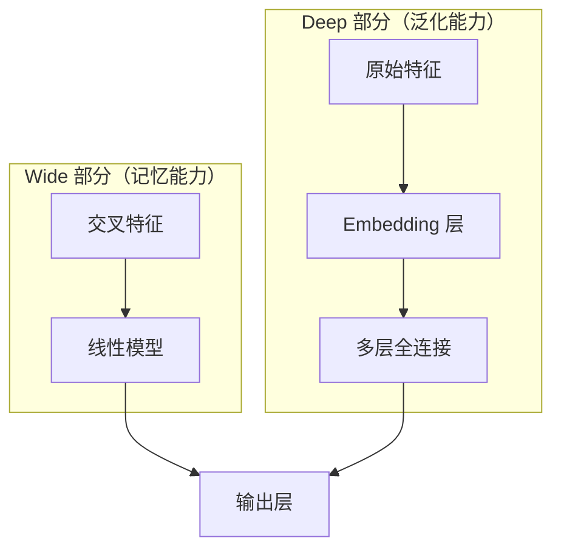

Wide 部分是传统的线性模型，负责"记忆"已知的特征交叉规则；Deep 部分是多层神经网络，负责"泛化"到未见过的特征组合。

Google Play 应用商店的实验表明，Wide & Deep 相比单独的 Wide 模型或 Deep 模型，分别带来了 3.9% 和 1.0% 的应用下载转化率提升。

### 5.3 Deep & Cross Network 与特征交叉的进化

Wide & Deep 的 Wide 部分仍需人工构造交叉特征。2017年，Stanford 和 Google 联合提出了 **Deep & Cross Network（DCN）**，用网络结构自动学习有界阶的特征交叉：

$$x_{l+1} = x_0 \odot (W_l \cdot x_l + b_l) + x_l$$

其中 $\odot$ 是逐元素乘法，$x_0$ 是原始输入。这种"十字交叉"结构使得每一层都能与原始输入进行交互，从而显式地建模有界阶的特征组合。

随后，**DCN-v2（2020）** 进一步改进，将交叉网络中的向量乘法替换为低秩矩阵分解，在保持效果的同时大幅降低了计算开销。

### 5.4 DeepFM：融合 FM 与深度学习

2017年，华为提出了 **DeepFM** 模型，将 FM 和深度神经网络无缝结合：

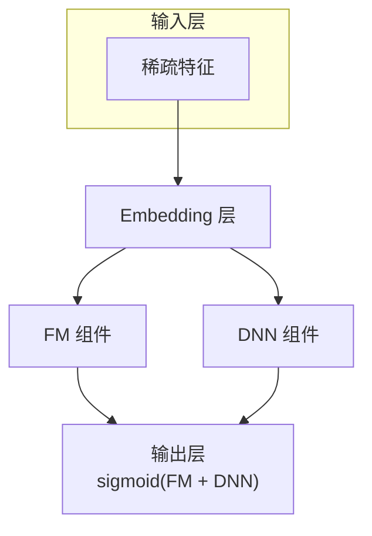

DeepFM 的关键创新在于：FM 组件和 DNN 组件**共享同一个 Embedding 层**。这避免了 Wide & Deep 中需要分别为 Wide 和 Deep 部分设计不同输入的麻烦，实现了端到端的联合训练。

### 5.5 序列推荐：捕捉用户的动态兴趣

用户兴趣不是静态的，而是随时间演变的。一个昨天还在搜索婴儿用品的新手妈妈，今天可能已经在看产后恢复课程了。

**序列推荐**应运而生，它将用户的历史行为视为一个序列，试图从中捕捉兴趣的动态变化。

早期方法如 **GRU4Rec（2016）** 使用 GRU 循环神经网络来建模用户行为序列：

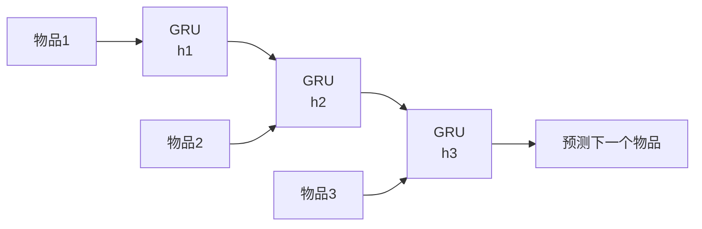

此后，**SASRec（Self-Attentive Sequential Rec, 2018）** 引入了 Transformer 中的自注意力机制，让模型能够关注序列中任意位置的历史行为，不再受限于循环神经网络的信息瓶颈。

### 5.6 Attention 机制的广泛应用

Attention 机制在推荐系统中的应用远不止序列推荐。**DIN（Deep Interest Network, 韩雅琦等, 2018）** 是阿里巴巴提出的一个重要模型，它发现用户的历史行为中，只有与当前候选物品相关的部分才对预测有意义：

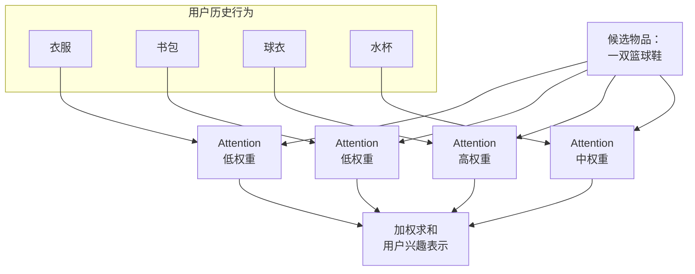

DIN 的核心观点是：**用户的兴趣是多样的，针对不同的候选物品，应该激活不同的兴趣部分。** 这种"动态兴趣表示"的思想，在后续的 **DIEN（Deep Interest Evolution Network, 2019）** 中进一步发展为兴趣的动态演化建模。

---

## 六、范式革新（2020-2023）：图网络与对比学习的崛起

### 6.1 图神经网络：建模复杂关系

推荐系统本质上处理的是用户和物品之间的二部图关系。**图神经网络（GNN）** 的引入，使得推荐系统能够自然地建模这种图结构信息。

**LightGCN（2020）** 是这一方向的代表性工作，它简化了传统 GCN 中的特征变换和非线性激活，仅保留图卷积的核心操作——邻居聚合：

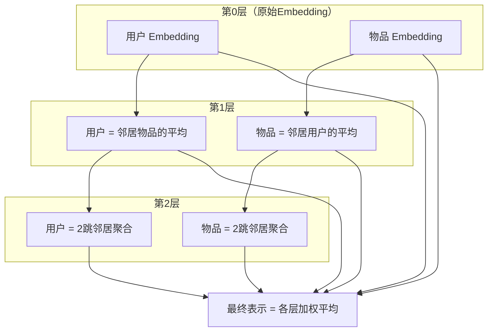

LightGCN 的设计哲学是"少即是多"——去掉了不必要的参数，反而获得了更好的效果和更高的效率。这启示我们：在推荐系统中，模型复杂度与效果之间并非单调递增关系。

**NGCF（Neural Graph Collaborative Filtering, 2019）** 则保留了更完整的 GCN 结构，通过多层图卷积来显式建模用户-物品交互图中的高阶协同信号。

### 6.2 自监督学习与对比学习

推荐系统长期面临**数据稀疏性**问题——用户的行为数据只是冰山一角，大量有价值的信息被"缺失"掩盖了。

**对比学习**的引入，为这一问题提供了新思路。核心思想是：**对同一个用户/物品构造不同的"视图"，然后让模型学习这些视图之间的一致性。**

SGL（Self-supervised Graph Learning, 2021）是这一方向的代表性工作：

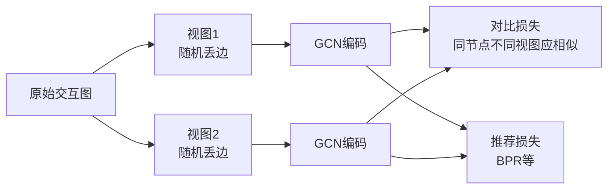

对比学习的巧妙之处在于：它不依赖额外的标注数据，而是通过数据增强自动生成监督信号，使得模型能够利用那些"没有行为"的部分来学习更好的表示。

### 6.3 多任务学习：不止于点击率

工业推荐系统的目标从来不是单一的。点击率（CTR）、转化率（CVR）、停留时长、分享率……多个目标同时需要优化。

**ESMM（Entire Space Multi-Task Model, 阿里, 2018）** 提出了一种优雅的多任务学习框架，解决了 CVR 预估中的样本选择偏差问题：

$$pCTCVR = pCTR \times pCVR$$

即：**点击且转化的概率 = 点击概率 × 点击后转化的概率**

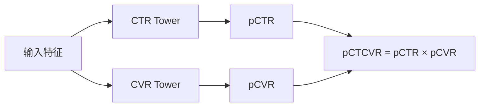

ESMM 的关键洞察是：CVR 模型只在点击样本上训练，但要在全空间上预测，存在严重的样本选择偏差。通过引入 CTR 任务和 CTCVR 任务，CVR 可以在全空间上被间接优化。

### 6.4 强化学习与推荐的长远视角

传统的推荐系统优化的是即时反馈（点击、购买），但忽略了一个重要问题：**短期最优不等于长期最优。**

反复推荐"吸睛但低质"的内容可能带来短期点击率提升，但长期会损害用户体验。**强化学习**提供了一种优化长期回报的框架。

在推荐场景中，强化学习的建模如下：

| 强化学习要素 | 推荐系统对应 |
|------------|------------|
| 环境 Environment | 用户 |
| 状态 State | 用户历史行为、上下文信息 |
| 动作 Action | 推荐的物品列表 |
| 奖励 Reward | 用户反馈（点击、购买、时长等） |
| 策略 Policy | 推荐模型 |

但由于真实环境中在线试错成本高昂（推错内容会直接伤害用户体验），**离线强化学习** 和 **模拟器** 成为这一方向的研究热点。

---

## 七、大模型时代（2023-至今）：生成式推荐的范式跃迁

### 7.1 LLM 如何改变推荐？

大语言模型（LLM）的崛起，为推荐系统带来了又一次范式级别的变革。其影响主要体现在三个层面：

**第一层：特征增强。** LLM 强大的文本理解能力，可以从物品的文本描述（标题、摘要、评论等）中提取丰富的语义特征，作为传统推荐模型的输入。这特别有助于解决冷启动问题——即使一个物品没有用户行为数据，LLM 也能理解"它是什么"。

**第二层：交互范式变革。** 传统推荐是单向的"系统推给用户"，LLM 使得**对话式推荐**成为可能。用户可以表达细粒度的需求（"我想看一部关于太空探索的科幻片，不要太恐怖的"），系统能够理解并回应。

**第三层：生成式推荐。** 这是最大的范式变革——不再是从固定物品库中"选择"推荐，而是直接"生成"推荐内容。

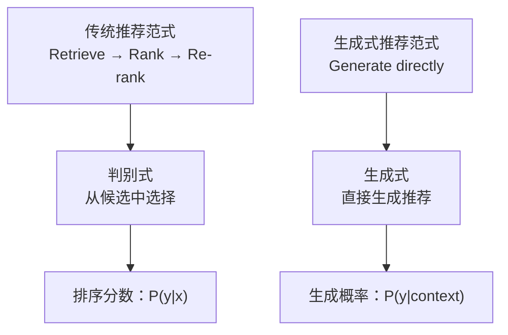

### 7.2 生成式推荐的架构演进

2024-2025年，生成式推荐经历了从"简单引入LLM"到"架构级重构"的演变：

**TIGER（2023）**：将物品的语义 ID（通过 RQ-VAE 生成的离散编码）作为 LLM 的 token，使得 LLM 可以像生成文本一样生成推荐序列。

**OneRec（2025）**：将推荐问题重构为"生成-评分"两阶段框架。生成器产出候选推荐，评分器进行细粒度判别，两者通过强化学习联合优化。

**UniSRec（2023）**：利用 LLM 的文本表示能力实现跨域推荐——将不同领域的物品映射到统一的语义空间，打破领域壁垒。

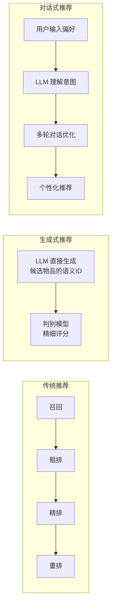

### 7.3 LLM + 推荐的关键挑战

尽管大模型带来了巨大想象空间，但落地过程中仍有关键挑战：

**效率问题**：LLM 推理延迟高，难以满足推荐系统毫秒级响应的要求。目前的主流解法是：LLM 负责离线特征生成和意图理解，在线排序仍用轻量模型。

**幻觉问题**：LLM 可能生成不存在的物品ID或推荐理由。语义ID编码和检索增强生成（RAG）是缓解手段。

**对齐问题**：LLM 的推荐行为需要与业务目标对齐。直接用 LLM 的语言建模目标训练，不一定能产出最优的推荐策略。强化学习从人类反馈（RLHF）和直接偏好优化（DPO）等方法正在被引入。

### 7.4 2025-2026 最前沿方向

根据 RecSys 2025 等顶会的最新趋势，推荐算法的前沿方向包括：

1. **端到端生成式推荐**：打通"召回-排序-重排"的传统流水线，用统一的生成式模型一体化完成。

2. **多模态推荐**：融合文本、图像、视频、音频等多模态信号进行推荐。短视频平台的推荐尤其需要同时理解视频画面、音频和文字描述。

3. **可解释推荐**：不仅给出推荐结果，还要给出人能理解的推荐理由。LLM 在这方面的天然优势使其成为关键赋能技术。

4. **隐私保护推荐**：在数据法规趋严的背景下，联邦学习、差分隐私等技术使得推荐系统可以在不收集原始用户数据的前提下进行模型训练。

5. **负反馈建模**：不只是学习用户"喜欢什么"，还要学习用户"不喜欢什么"以及"为什么不喜欢"，构建更完整的用户偏好画像。

---

## 八、全景回顾：推荐算法进化脉络图

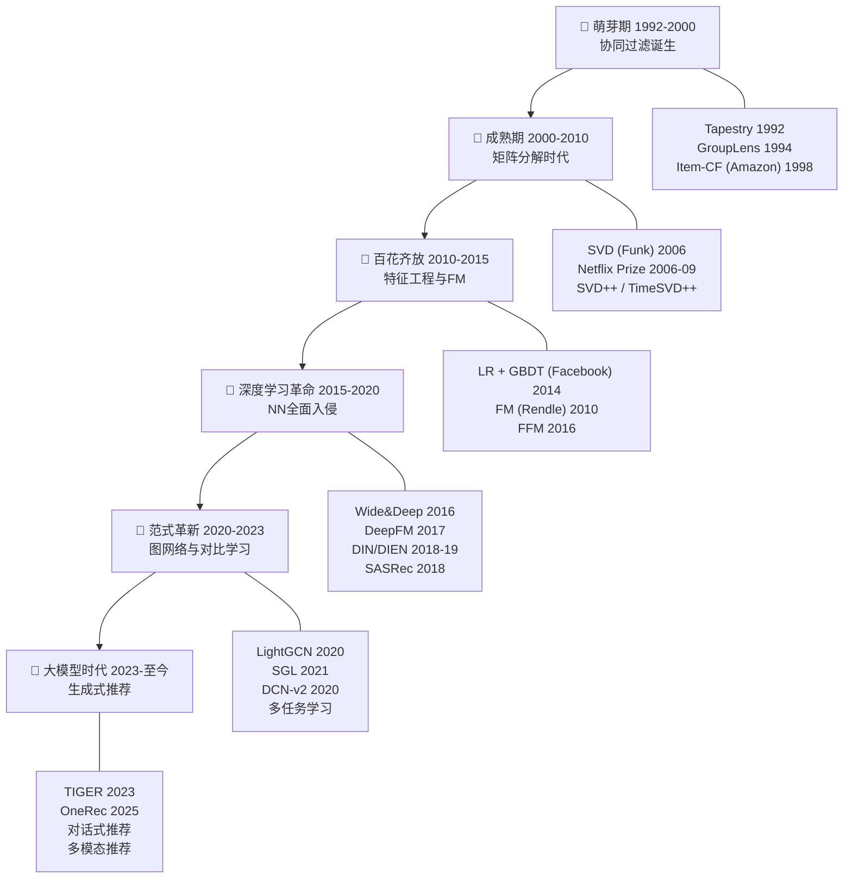

---

## 九、思考与展望

### 9.1 信息茧房问题

推荐算法在提升用户体验的同时，也带来了**信息茧房（Filter Bubble）** 问题——用户被持续推荐相似内容，视野逐渐收窄。这不只是技术问题，更是社会问题。

目前的解法包括：
- **多样性正则化**：在排序目标中加入多样性约束。
- **探索与利用（E&E）**：在推荐已知优质内容的同时，保留一定比例的探索性推荐。
- **用户控制权**：让用户可以调整推荐偏好、关闭个性化推荐。

### 9.2 从"猜你喜欢"到"懂你需要"

推荐算法的终极目标，不是精确预测用户会点击什么，而是**真正理解用户需要什么**。这两者有本质区别：

- "猜你喜欢"优化的是即时满足，可能导致上瘾和信息茧房。
- "懂你需要"关注的是长期价值，帮助用户发现他们尚未意识到但真正需要的内容。

大模型的出现，使得"理解"变得可能——理解用户意图、理解物品语义、理解上下文场景。从"预测"走向"理解"，可能是推荐算法下一个六十年的核心叙事。

### 9.3 推荐算法的本质

回望六十年，推荐算法的进化可以被概括为一个不断逼近本质的过程：

> **从表面相似到深层特征，从静态建模到动态理解，从单一目标到多维平衡，从判别选择到生成创造。**

但无论技术如何变迁，推荐系统的核心从未改变——它始终是**连接人与信息的桥梁**。最好的推荐算法，不是最复杂的那个，而是最能帮助人的那个。

---