# 摄像头算法完全解析：你的手机是如何"看懂"世界的？

> **导语**：每天你用手机拍照、扫码、刷脸解锁，但有没有想过，摄像头拍到的只是一堆像素，它是怎么自动对焦的？夜景是怎么变亮的？人像背景是怎么虚化的？扫码是怎么识别的？这背后，是一套套精密的算法在为你服务。今天，我们就来深挖摄像头中的算法世界，从原理到实现，一篇搞定！

---

## 一、从一个日常场景开始

### 1.1 你按快门的那一刻，发生了什么？

想象你用手机拍一张照片：

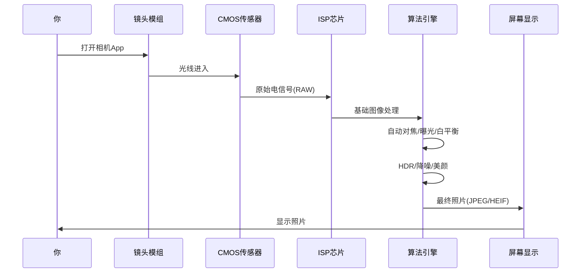

**你看到的**：一张漂亮的照片
**实际发生的**：几十种算法在几毫秒内接力工作！

### 1.2 摄像头算法到底是什么？

> **摄像头算法**：从光信号进入镜头开始，到最终图像输出的全链路计算过程，包括硬件控制、图像处理、场景理解、内容生成四大层次。

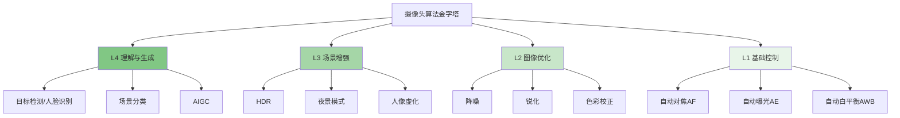

**今天我们就从底层到顶层，一层层剥开！**

---

## 二、硬件基础：算法的"舞台"

### 2.1 摄像头模组长什么样？


### 2.2 关键硬件参数

| 组件 | 参数 | 影响 |
|------|------|------|
| **镜头** | 焦距、光圈(F值)、镜片数 | 进光量、视角、虚化效果 |
| **传感器** | 像素大小、分辨率、动态范围 | 画质、噪点、低光能力 |
| **ISP** | 算力、支持的算法 | 处理速度、功能丰富度 |

**重点**：算法再好，硬件是天花板！但好算法能让普通硬件发挥120%的实力。

---

## 三、第一层：基础控制算法（3A算法）

### 3.1 什么是3A？

摄像头必须解决的三个基本问题：

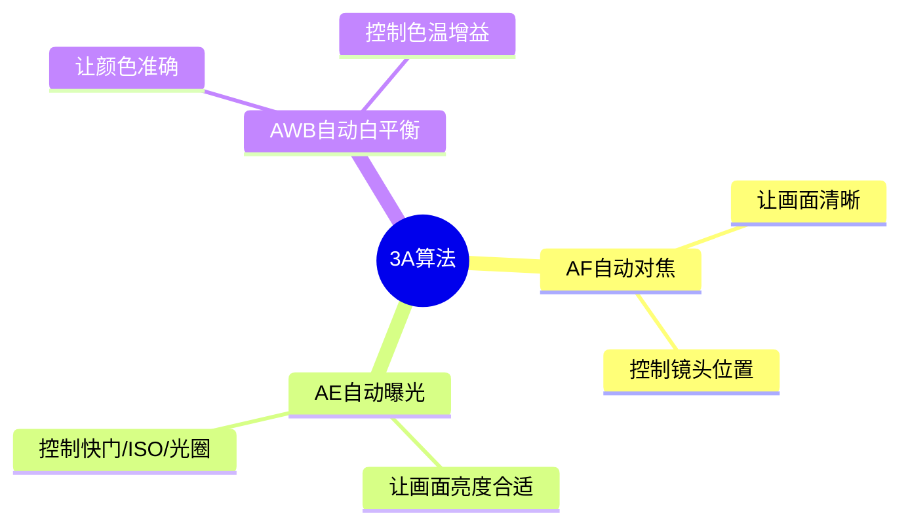

### 3.2 自动对焦算法（AF）

#### 3.2.1 为什么需要对焦？

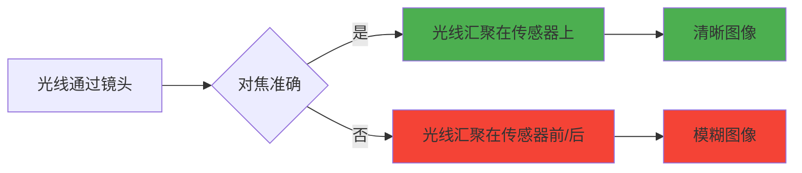

#### 3.2.2 对焦的三种技术路线

**方式一：对比度检测对焦（CDAF）**

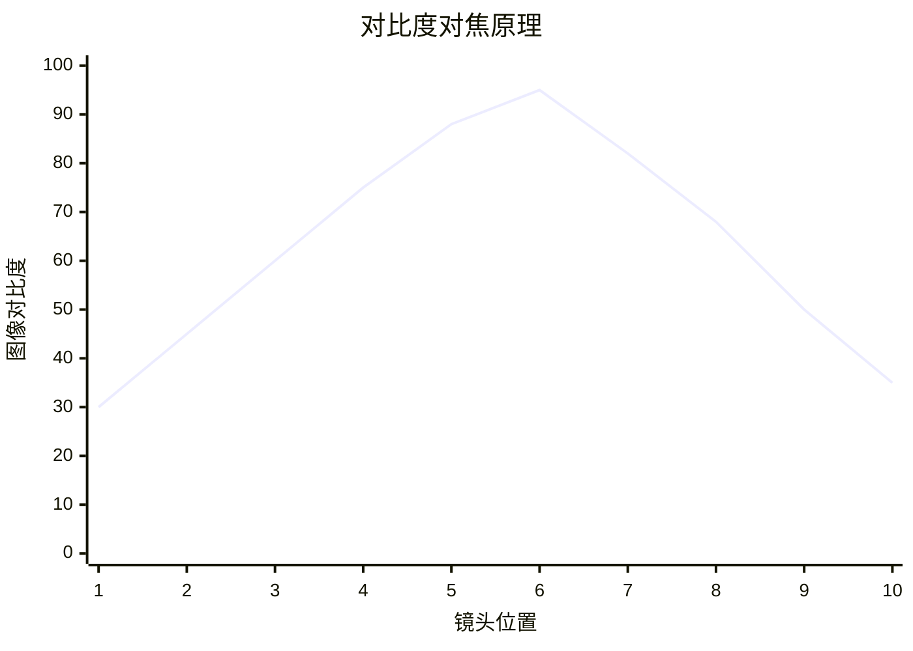

**核心思路**：清晰的图像 = 高对比度！

```python
def contrast_detection_af(image_sequence):
    """
    对比度检测对焦算法
    """
    best_position = None
    max_contrast = 0
    
    # 1. 遍历镜头可能位置
    for position in lens_positions:
        # 2. 移动镜头到该位置
        move_lens(position)
        
        # 3. 获取当前图像
        image = capture_image()
        
        # 4. 计算对比度（用拉普拉斯算子）
        import cv2
        gray = cv2.cvtColor(image, cv2.COLOR_BGR2GRAY)
        laplacian = cv2.Laplacian(gray, cv2.CV_64F)
        contrast = np.var(laplacian)
        
        # 5. 记录最佳位置
        if contrast > max_contrast:
            max_contrast = contrast
            best_position = position
    
    # 6. 移动镜头到最佳位置
    move_lens(best_position)
    return best_position
```

**优点**：简单、准确
**缺点**：需要来回扫描，速度慢，会"拉风箱"

**方式二：相位检测对焦（PDAF）**

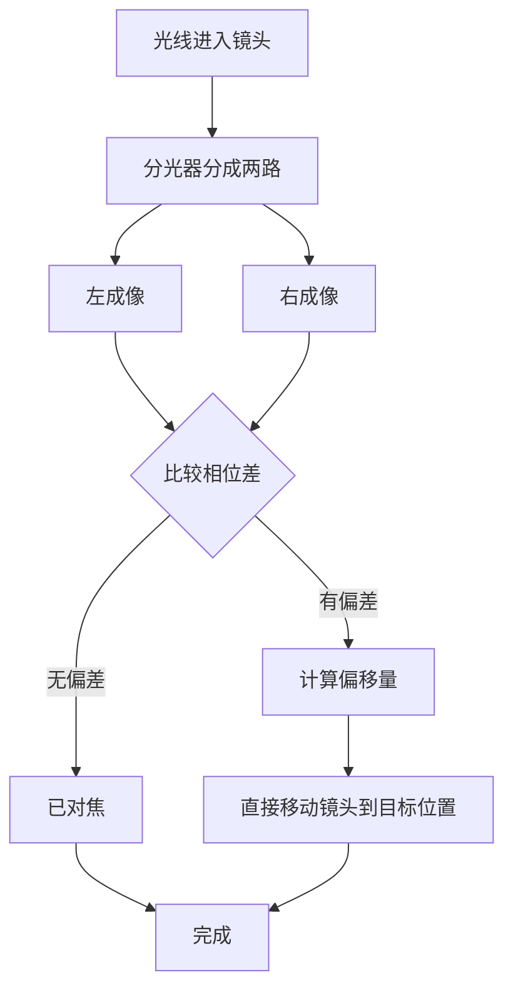

**核心思路**：通过两路图像的偏移量，**直接算出**镜头应该移动多少，一步到位！

```python
def phase_detection_af(left_image, right_image):
    """
    相位检测对焦算法（简化版）
    """
    # 1. 提取特征区域
    left_features = extract_features(left_image)
    right_features = extract_features(right_image)
    
    # 2. 计算相位差（互相关）
    from scipy.signal import correlate2d
    correlation = correlate2d(left_features, right_features, mode='full')
    
    # 3. 找到最大相关位置
    max_pos = np.unravel_index(np.argmax(correlation), correlation.shape)
    
    # 4. 计算偏移量
    center = correlation.shape[0] // 2
    phase_difference = max_pos[0] - center
    
    # 5. 转换为镜头移动量
    lens_movement = phase_difference * calibration_factor
    
    # 6. 一步移动到位
    move_lens(lens_movement)
    
    return lens_movement
```

**优点**：速度快，一秒可对焦多次
**缺点**：需要专用硬件，边缘区域精度下降

**方式三：混合对焦（现代手机主流）**

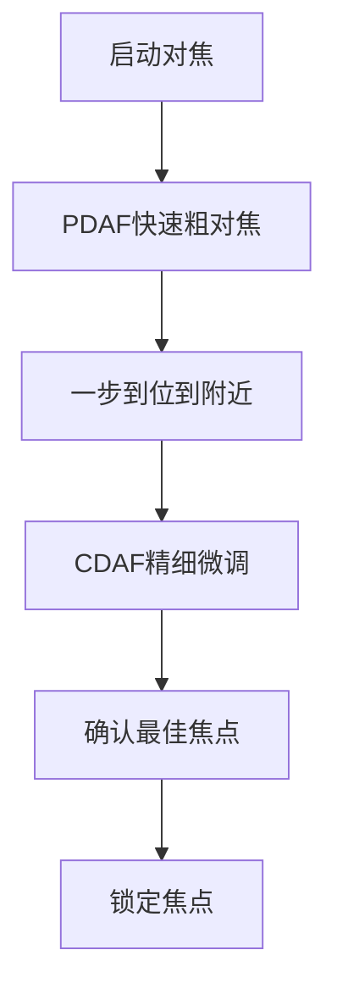

### 3.3 自动曝光算法（AE）

#### 3.3.1 曝光三要素

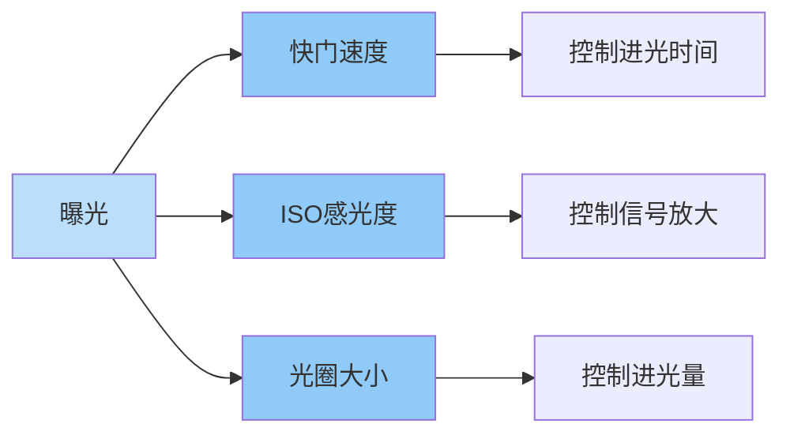

#### 3.3.2 AE算法的核心逻辑

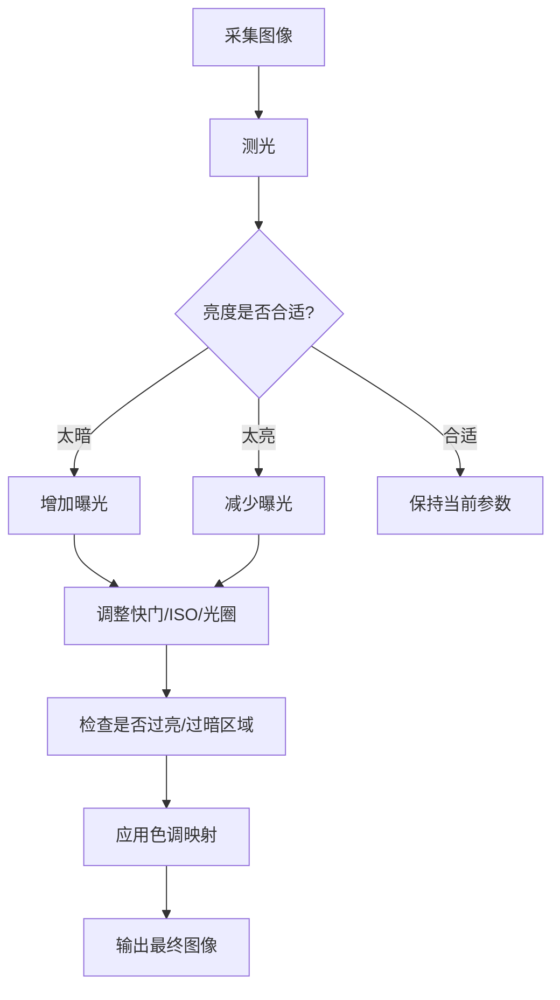

```python
def auto_exposure(image, target_brightness=128):
    """
    自动曝光算法（简化版）
    """
    # 1. 计算当前亮度（取全图平均值或分区加权）
    gray = cv2.cvtColor(image, cv2.COLOR_BGR2GRAY)
    current_brightness = np.mean(gray)
    
    # 2. 计算误差
    error = target_brightness - current_brightness
    
    # 3. PID控制器计算调整量
    exposure_adjust = pid_controller(error)
    
    # 4. 分配调整到各参数
    if exposure_adjust > 0:  # 需要增加曝光
        if shutter_speed < max_shutter:
            shutter_speed *= 1.2
        elif iso < max_iso:
            iso *= 1.2
    else:  # 需要减少曝光
        if iso > min_iso:
            iso /= 1.2
        elif shutter_speed > min_shutter:
            shutter_speed /= 1.2
    
    # 5. 应用新参数
    camera.set_exposure(shutter_speed, iso)
    
    return shutter_speed, iso

class PIDController:
    """PID控制器"""
    def __init__(self, kp=1.0, ki=0.1, kd=0.05):
        self.kp = kp
        self.ki = ki
        self.kd = kd
        self.error_sum = 0
        self.last_error = 0
    
    def update(self, error):
        self.error_sum += error
        delta = error - self.last_error
        self.last_error = error
        
        output = (self.kp * error + 
                 self.ki * self.error_sum + 
                 self.kd * delta)
        return output
```

#### 3.3.3 测光模式

| 模式 | 说明 | 适用场景 |
|------|------|---------|
| **评价测光** | 全图分区加权平均 | 日常拍摄 |
| **中央重点** | 中间区域权重高 | 人像 |
| **点测光** | 只测中心2-5% | 逆光、舞台 |

### 3.4 自动白平衡算法（AWB）

#### 3.4.1 为什么需要白平衡？

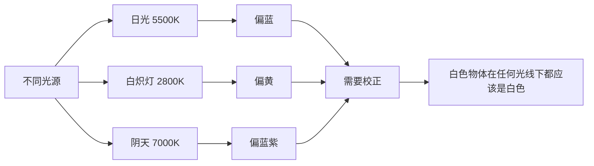

#### 3.4.2 AWB核心算法：灰度世界假设

```python
def gray_world_awb(image):
    """
    灰度世界算法
    假设：自然场景中，R/G/B平均值应该相等
    """
    # 1. 计算各通道平均值
    avg_r = np.mean(image[:, :, 0])
    avg_g = np.mean(image[:, :, 1])
    avg_b = np.mean(image[:, :, 2])
    
    # 2. 计算全局平均
    avg_all = (avg_r + avg_g + avg_b) / 3
    
    # 3. 计算各通道增益
    gain_r = avg_all / avg_r
    gain_g = avg_all / avg_g
    gain_b = avg_all / avg_b
    
    # 4. 应用增益
    corrected = image.copy().astype(float)
    corrected[:, :, 0] *= gain_r
    corrected[:, :, 1] *= gain_g
    corrected[:, :, 2] *= gain_b
    
    # 5. 裁剪到有效范围
    corrected = np.clip(corrected, 0, 255).astype(np.uint8)
    
    return corrected
```

#### 3.4.3 现代AWB：多算法融合

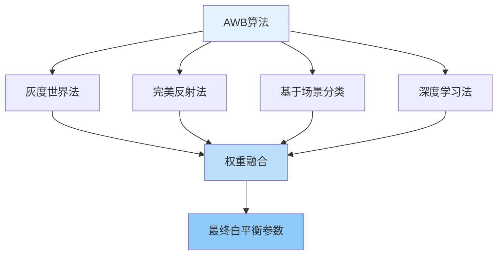

---

## 四、第二层：图像优化算法

### 4.1 降噪算法（Denoise）

#### 4.1.1 噪声从哪来？

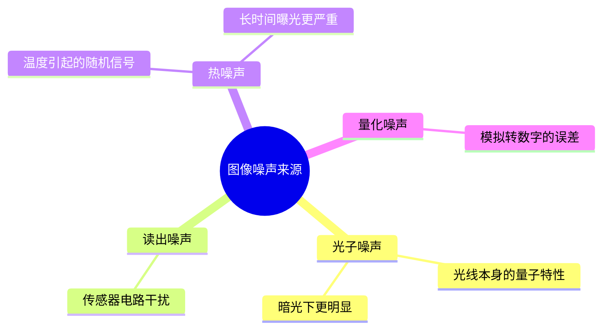

#### 4.1.2 传统降噪算法

**方法一：多帧降噪**


```python
def multi_frame_denoise(image_sequence):
    """
    多帧降噪
    """
    # 1. 对齐所有帧（用光流或特征匹配）
    aligned_frames = align_frames(image_sequence)
    
    # 2. 像素级平均
    stacked = np.stack(aligned_frames)
    denoised = np.mean(stacked, axis=0)
    
    # 3. 转换为正确格式
    denoised = np.clip(denoised, 0, 255).astype(np.uint8)
    
    return denoised
```

**方法二：BM3D算法（经典算法之王）**

```python
def bm3d_denoise(image, sigma=25):
    """
    BM3D降噪（Block-Matching and 3D filtering）
    """
    import cv2
    from cv2.xphoto import createBM3D_DCT_2D
    
    # BM3D核心思想：
    # 1. 找相似块
    # 2. 堆叠成3D数组
    # 3. 在3D域做变换和滤波
    # 4. 逆变换并聚合
    
    denoised = cv2.xphoto.bm3dDenoise(image, sigma)
    return denoised
```

#### 4.1.3 深度学习降噪


```python
import torch
import torch.nn as nn

class DenoiseCNN(nn.Module):
    """
    基于CNN的降噪网络（DnCNN简化版）
    """
    def __init__(self, num_layers=17):
        super().__init__()
        
        layers = []
        # 第一层
        layers.append(nn.Conv2d(3, 64, 3, padding=1))
        layers.append(nn.ReLU(inplace=True))
        
        # 中间层
        for _ in range(num_layers - 2):
            layers.append(nn.Conv2d(64, 64, 3, padding=1))
            layers.append(nn.BatchNorm2d(64))
            layers.append(nn.ReLU(inplace=True))
        
        # 最后一层
        layers.append(nn.Conv2d(64, 3, 3, padding=1))
        
        self.network = nn.Sequential(*layers)
    
    def forward(self, x):
        # 学习残差（噪声）
        noise = self.network(x)
        # 原图减去噪声
        clean = x - noise
        return clean

# 使用
model = DenoiseCNN()
noisy_image = load_image("night_photo.jpg")
clean_image = model(noisy_image)
```

### 4.2 HDR算法（高动态范围）

#### 4.2.1 为什么需要HDR？

```mermaid
xychart-beta
    title "场景亮度范围对比"
    x-axis "场景元素" ["阴影处", "室内", "窗外", "阳光直射"]
    y-axis "亮度(cd/m²)" 0 --> 100000
    bar "真实场景" [10, 100, 10000, 100000]
    bar "普通相机" [10, 100, 1000, 10000]
```

**问题**：相机动态范围有限，亮部过曝或暗部死黑。

#### 4.2.2 HDR算法流程

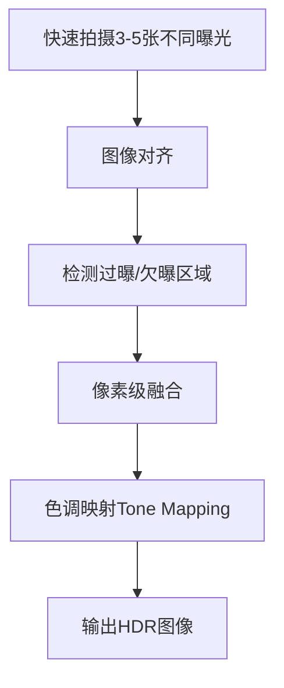

```python
def hdr_merge(images, exposures):
    """
    HDR合成算法（简化版）
    """
    # 1. 计算每张图的权重
    weights = []
    for img in images:
        # 用像素值到中间的远近作为权重
        w = np.exp(-0.5 * ((img.astype(float) - 128) / 64) ** 2)
        weights.append(w)
    
    # 2. 加权融合
    fused = np.zeros_like(images[0], dtype=float)
    weight_sum = np.zeros_like(images[0], dtype=float)
    
    for img, w, exp in zip(images, weights, exposures):
        # 补偿曝光差异
        compensated = img.astype(float) * (1.0 / exp)
        fused += compensated * w
        weight_sum += w
    
    # 3. 归一化
    fused = fused / weight_sum
    
    # 4. 色调映射
    hdr_result = tone_mapping(fused)
    
    return hdr_result

def tone_mapping(hdr_image, gamma=2.2):
    """
    色调映射：将高动态范围压缩到显示范围
    """
    # Reinhard色调映射
    L = np.mean(hdr_image, axis=2, keepdims=True)
    L_d = L / (1 + L)
    
    result = hdr_image * (L_d / L)
    result = result ** (1 / gamma)
    
    return np.clip(result * 255, 0, 255).astype(np.uint8)
```

#### 4.2.3 单帧HDR（现代手机主流）


### 4.3 锐化算法（Sharpen）

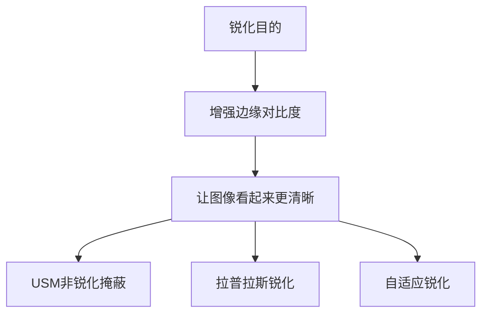

```python
def unsharp_mask(image, sigma=1.0, amount=1.5):
    """
    USM锐化（Unsharp Mask）
    """
    import cv2
    
    # 1. 高斯模糊
    blurred = cv2.GaussianBlur(image, (0, 0), sigma)
    
    # 2. 计算差值（边缘）
    diff = cv2.addWeighted(image, 1.5, blurred, -0.5, 0)
    
    # 3. 限制锐化强度
    sharpened = np.clip(diff, 0, 255).astype(np.uint8)
    
    return sharpened
```

---

## 五、第三层：场景增强算法

### 5.1 夜景模式算法

#### 5.1.1 夜景算法全链路

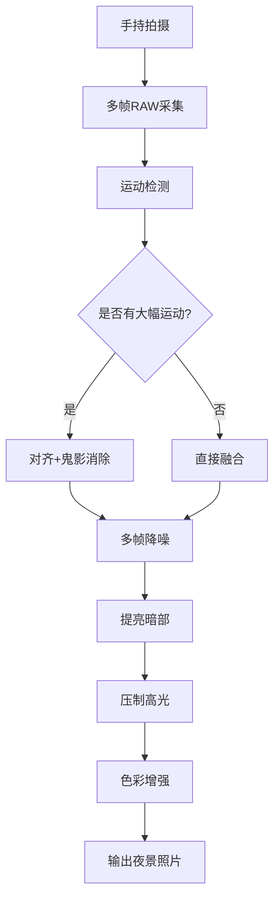

#### 5.1.2 关键算法：超级夜景

```python
def super_night_mode(image_sequence, gyroscope_data):
    """
    超级夜景算法（简化版）
    """
    # 1. 根据陀螺仪数据判断手持稳定性
    motion_level = analyze_motion(gyroscope_data)
    
    # 2. 选择融合帧数
    if motion_level < 0.1:  # 很稳定
        num_frames = 8
    elif motion_level < 0.3:  # 一般
        num_frames = 4
    else:  # 抖动严重
        num_frames = 2
    
    # 3. 选取质量最好的几帧
    selected_frames = select_best_frames(image_sequence, num_frames)
    
    # 4. 精细对齐（用光流）
    aligned = optical_flow_align(selected_frames)
    
    # 5. 多帧融合降噪
    denoised = multi_frame_merge(aligned)
    
    # 6. 提亮暗部（伽马校正）
    brightened = gamma_correction(denoised, gamma=1.8)
    
    # 7. 局部色调映射
    tone_mapped = local_tone_mapping(brightened)
    
    # 8. 降噪后处理
    final = post_denoise(tone_mapped)
    
    return final
```

### 5.2 人像模式（背景虚化）算法

#### 5.2.1 虚化的光学原理

```mermaid
graph LR
    A[大光圈镜头] --> B[浅景深]
    B --> C[主体清晰]
    B --> D[背景模糊]
    C --> E[手机模拟]
    D --> E
    E --> F[计算摄影实现]
```

#### 5.2.2 人像算法核心：深度图估计

```mermaid
graph TD
    A[双摄/多摄输入] --> B[特征提取]
    B --> C[立体匹配]
    C --> D[视差计算]
    D --> E[深度图生成]
    E --> F[深度图优化]
    F --> G[前景分割]
    G --> H[应用虚化]
    H --> I[输出人像照片]
```

```python
def portrait_mode(left_image, right_image):
    """
    双摄人像模式算法
    """
    # 1. 立体匹配计算视差
    import cv2
    stereo = cv2.StereoSGBM_create(
        minDisparity=0,
        numDisparities=64,
        blockSize=11
    )
    disparity = stereo.compute(left_image, right_image)
    
    # 2. 视差转深度
    depth = baseline * focal_length / disparity
    
    # 3. 深度图优化（滤波、填充空洞）
    depth = refine_depth_map(depth)
    
    # 4. 生成前景掩码
    foreground_mask = segment_foreground(depth, threshold=2.0)
    
    # 5. 应用虚化（高斯模糊背景）
    blurred_bg = cv2.GaussianBlur(left_image, (21, 21), 0)
    
    # 6. 融合前景和虚化背景
    result = blend_images(left_image, blurred_bg, foreground_mask)
    
    # 7. 边缘精细化（羽化）
    result = refine_edges(result, foreground_mask)
    
    return result
```

#### 5.2.3 单摄人像：AI分割

```mermaid
graph LR
    A[单张RGB图像] --> B[深度学习分割网络]
    B --> C[人像分割Mask]
    C --> D[背景虚化]
    D --> E[输出]
```

```python
def single_camera_portrait(image):
    """
    单摄人像模式（基于深度学习分割）
    """
    # 1. 加载预训练分割模型
    model = load_segmentation_model("portrait_seg.onnx")
    
    # 2. 推理得到Mask
    mask = model.predict(image)
    
    # 3. 后处理
    mask = refine_mask(mask)
    
    # 4. 应用虚化效果
    result = apply_bokeh(image, mask)
    
    return result
```

### 5.3 美颜算法

```mermaid
graph TD
    A[人脸检测] --> B[关键点定位]
    B --> C[皮肤分割]
    C --> D[磨皮降噪]
    C --> E[美白调色]
    B --> F[五官调整]
    F --> F1[大眼]
    F --> F2[瘦脸]
    F --> F3[隆鼻]
    D --> G[融合输出]
    E --> G
    F --> G
```

```python
def skin_smoothing(image, face_landmarks):
    """
    磨皮算法（简化版）
    """
    # 1. 提取皮肤区域
    skin_mask = detect_skin(image, face_landmarks)
    
    # 2. 双边滤波（保边去噪）
    import cv2
    smoothed = cv2.bilateralFilter(image, d=9, sigmaColor=75, sigmaSpace=75)
    
    # 3. 只在皮肤区域应用
    result = image.copy()
    result[skin_mask] = smoothed[skin_mask]
    
    # 4. 混合原图保留纹理
    result = cv2.addWeighted(image, 0.3, result, 0.7, 0)
    
    return result
```

---

## 六、第四层：理解与生成算法

### 6.1 场景分类算法

```mermaid
graph TD
    A[输入图像] --> B[特征提取]
    B --> C[分类网络]
    C --> D{场景类型}
    D --> D1[风景]
    D --> D2[人像]
    D --> D3[美食]
    D --> D4[夜景]
    D --> D5[微距]
    D1 --> E[自动优化参数]
    D2 --> E
    D3 --> E
    D4 --> E
    D5 --> E
```

```python
def scene_classification(image):
    """
    场景分类算法
    """
    # 1. 加载预训练分类器
    model = load_model("scene_classifier.pth")
    
    # 2. 预处理
    input_tensor = preprocess(image)
    
    # 3. 推理
    with torch.no_grad():
        output = model(input_tensor)
        probabilities = torch.softmax(output, dim=1)
    
    # 4. 获取结果
    scene_types = ['风景', '人像', '美食', '夜景', '微距', '文字']
    predicted_class = torch.argmax(probabilities, dim=1).item()
    confidence = probabilities[0, predicted_class].item()
    
    return scene_types[predicted_class], confidence

# 根据场景自动调整参数
def auto_adjust_by_scene(scene_type):
    adjustments = {
        '风景': {'saturation': 1.2, 'sharpness': 1.3},
        '人像': {'saturation': 1.0, 'skin_smooth': 0.7},
        '美食': {'saturation': 1.3, 'warmth': 1.1},
        '夜景': {'denoise': 1.5, 'brightness': 1.4}
    }
    return adjustments.get(scene_type, {})
```

### 6.2 人脸检测与识别算法

#### 6.2.1 人脸检测

```mermaid
graph LR
    A[输入图像] --> B[多尺度缩放]
    B --> C[滑动窗口/CNN检测]
    C --> D[人脸候选框]
    D --> E[NMS非极大值抑制]
    E --> F[最终人脸框]
```

#### 6.2.2 人脸关键点检测

```python
def face_landmark_detection(image):
    """
    人脸68关键点检测
    """
    import dlib
    
    # 1. 加载检测器和关键点预测器
    detector = dlib.get_frontal_face_detector()
    predictor = dlib.shape_predictor("shape_predictor_68_face_landmarks.dat")
    
    # 2. 检测人脸
    faces = detector(image, 1)
    
    landmarks_list = []
    for face in faces:
        # 3. 预测关键点
        shape = predictor(image, face)
        landmarks = [(shape.part(i).x, shape.part(i).y) 
                    for i in range(68)]
        landmarks_list.append(landmarks)
    
    return landmarks_list
```

#### 6.2.3 人脸识别

```mermaid
graph TD
    A[人脸图像] --> B[对齐和裁剪]
    B --> C[深度特征提取]
    C --> D[128维特征向量]
    D --> E[计算欧氏距离]
    E --> F{距离<阈值?}
    F -->|是| G[同一人]
    F -->|否| H[不同人]
```

```python
def face_recognition(face_image, database):
    """
    人脸识别
    """
    # 1. 提取特征向量
    model = load_face_model("facenet.onnx")
    embedding = model.extract(face_image)
    
    # 2. 与数据库比对
    min_distance = float('inf')
    matched_id = None
    
    for stored_id, stored_embedding in database.items():
        # 计算欧氏距离
        distance = np.linalg.norm(embedding - stored_embedding)
        
        if distance < min_distance:
            min_distance = distance
            matched_id = stored_id
    
    # 3. 判断是否匹配
    threshold = 0.6
    if min_distance < threshold:
        return matched_id, min_distance
    else:
        return "Unknown", min_distance
```

### 6.3 OCR文字识别算法

```mermaid
flowchart TD
    A[输入图像] --> B[文本检测DBNet]
    B --> C[文本框坐标]
    C --> D[文本矫正]
    D --> E[文本识别CRNN]
    E --> F[文字内容]
    F --> G[后处理]
    G --> H[输出结果]
```

```python
def ocr_recognition(image):
    """
    OCR文字识别
    """
    # 1. 文本检测
    detector = load_model("dbnet_resnet50.pth")
    text_boxes = detector.detect(image)
    
    # 2. 逐个识别
    results = []
    recognizer = load_model("crnn_chinese.pth")
    
    for box in text_boxes:
        # 裁剪文本区域
        text_crop = crop_image(image, box)
        
        # 识别
        text = recognizer.recognize(text_crop)
        
        results.append({
            'text': text,
            'box': box,
            'confidence': recognizer.confidence
        })
    
    return results
```

---

## 七、视频处理算法

### 7.1 视频防抖算法（EIS）

```mermaid
graph TD
    A[连续视频帧] --> B[运动估计]
    B --> C[全局运动 vs 局部运动]
    C --> D[区分有意运动和抖动]
    D --> E[计算补偿路径]
    E --> F[运动平滑]
    F --> G[裁剪和变形补偿]
    G --> H[稳定视频输出]
```

```python
def video_stabilization(video_frames):
    """
    电子防抖算法（简化版）
    """
    # 1. 计算帧间运动
    trajectories = []
    for i in range(len(video_frames) - 1):
        # 光流法估计运动
        flow = cv2.calcOpticalFlowFarneback(
            video_frames[i], video_frames[i+1], None, 0.5, 3, 15
        )
        avg_motion = np.mean(flow, axis=(0, 1))
        trajectories.append(avg_motion)
    
    trajectories = np.array(trajectories)
    
    # 2. 平滑运动轨迹（滑动平均）
    window_size = 15
    smoothed_trajectories = np.zeros_like(trajectories)
    for i in range(len(trajectories)):
        start = max(0, i - window_size // 2)
        end = min(len(trajectories), i + window_size // 2 + 1)
        smoothed_trajectories[i] = np.mean(trajectories[start:end], axis=0)
    
    # 3. 应用补偿
    stabilized_frames = []
    cumulative_motion = np.zeros(2)
    
    for i, frame in enumerate(video_frames):
        cumulative_motion += trajectories[i] - smoothed_trajectories[i]
        # 仿射变换补偿
        M = np.float32([[1, 0, cumulative_motion[0]],
                       [0, 1, cumulative_motion[1]]])
        stabilized = cv2.warpAffine(frame, M, (frame.shape[1], frame.shape[0]))
        stabilized_frames.append(stabilized)
    
    return stabilized_frames
```

### 7.2 视频HDR算法

```mermaid
sequenceDiagram
    participant 场景 as 真实场景
    participant 传感器 as 传感器
    participant 处理 as 帧处理
    participant 输出 as 视频流

    场景->>传感器: 高光比场景
    传感器->>处理: 交替曝光帧序列
    处理->>处理: 帧对齐
    处理->>处理: HDR融合
    处理->>处理: 色调映射
    处理->>输出: HDR视频流
```

### 7.3 慢动作算法

```mermaid
graph LR
    A[高速拍摄120/240fps] --> B[运动检测]
    B --> C{检测运动区域}
    C -->|有运动| D[插值到目标帧率]
    C -->|无运动| E[正常播放]
    D --> F[光流插帧]
    F --> G[输出慢动作视频]
```

```python
def slow_motion_interpolation(frames, target_fps):
    """
    基于光流的慢动作插帧
    """
    interpolated_frames = []
    
    for i in range(len(frames) - 1):
        # 1. 添加原帧
        interpolated_frames.append(frames[i])
        
        # 2. 计算光流
        flow = cv2.calcOpticalFlowFarneback(
            frames[i], frames[i+1], None, 0.5, 3, 15
        )
        
        # 3. 生成中间帧
        num_interps = target_fps // original_fps - 1
        for alpha in np.linspace(0, 1, num_interps + 2)[1:-1]:
            # 前向 warp
            forward_warp = cv2.remap(frames[i], flow_map(flow, alpha))
            # 后向 warp
            backward_warp = cv2.remap(frames[i+1], flow_map(-flow, 1-alpha))
            
            # 4. 融合
            interp_frame = cv2.addWeighted(
                forward_warp, 0.5, backward_warp, 0.5, 0
            )
            interpolated_frames.append(interp_frame)
    
    # 添加最后一帧
    interpolated_frames.append(frames[-1])
    
    return interpolated_frames
```

---

## 八、3D视觉与深度算法

### 8.1 深度估计的三种技术

```mermaid
mindmap
    root((深度估计技术))
        结构光
            投射已知图案
            检测图案变形
            计算深度
            代表: Face ID
        飞行时间ToF
            发射红外脉冲
            测量返回时间
            计算距离
            代表: 激光雷达
        双目立体视觉
            两个摄像头
            视差计算
            三角测量深度
            代表: 双摄手机
```

### 8.2 ToF深度算法

```mermaid
sequenceDiagram
    participant 发射器 as 红外发射器
    participant 场景 as 拍摄场景
    participant 传感器 as ToF传感器
    participant 算法 as 深度计算

    发射器->>场景: 发射调制红外光
    场景->>传感器: 反射光返回
    传感器->>算法: 测量相位差
    算法->>算法: 深度 = c × Δφ / (4πf)
    算法->>算法: 生成深度图
```

```python
def tof_depth_calculation(phase_difference, modulation_freq):
    """
    ToF深度计算
    """
    # 光速
    c = 3e8  # m/s
    
    # 深度公式
    depth = (c * phase_difference) / (4 * np.pi * modulation_freq)
    
    return depth
```

### 8.3 单目深度估计（深度学习）

```mermaid
graph LR
    A[单张RGB图像] --> B[编码器特征提取]
    B --> C[多尺度特征融合]
    C --> D[解码器]
    D --> E[深度图预测]
    E --> F[后处理优化]
    F --> G[输出深度图]
```

```python
class MonocularDepthEstimation(nn.Module):
    """
    单目深度估计网络（简化版）
    """
    def __init__(self):
        super().__init__()
        # 编码器（如ResNet）
        self.encoder = torchvision.models.resnet50(pretrained=True)
        
        # 解码器
        self.decoder = nn.Sequential(
            nn.ConvTranspose2d(2048, 512, 4, stride=2, padding=1),
            nn.ReLU(),
            nn.ConvTranspose2d(512, 128, 4, stride=2, padding=1),
            nn.ReLU(),
            nn.ConvTranspose2d(128, 32, 4, stride=2, padding=1),
            nn.ReLU(),
            nn.Conv2d(32, 1, 3, padding=1),
            nn.Sigmoid()
        )
    
    def forward(self, x):
        # 编码
        features = self.encoder(x)
        # 解码
        depth = self.decoder(features)
        return depth
```

---

## 九、AI摄像头的端到端流程

### 9.1 从按下快门到出片的完整链路

```mermaid
flowchart TD
    A[用户按下快门] --> B[3A锁定]
    B --> C[RAW数据采集]
    C --> D[ISP管线]
    D --> D1[黑电平校正]
    D --> D2[去马赛克]
    D --> D3[色彩校正]
    D --> D4[降噪]
    D --> D5[锐化]
    D --> D6[色调映射]
    D1 --> D2 --> D3 --> D4 --> D5 --> D6
    D6 --> E[AI算法介入]
    E --> E1[场景识别]
    E --> E2[人脸美化]
    E --> E3[目标增强]
    E1 --> F[后处理]
    E2 --> F
    E3 --> F
    F --> F1[压缩编码]
    F1 --> G[保存JPEG/HEIF]
    G --> H[显示在屏幕上]
```

### 9.2 ISP管线详解

```mermaid
graph LR
    A[RAW] --> B[黑电平校正]
    B --> C[镜头阴影校正]
    C --> D[坏点校正]
    D --> E[去马赛克Bayer]
    E --> F[白平衡]
    F --> G[色彩空间转换]
    G --> H[伽马校正]
    H --> I[降噪]
    I --> J[锐化]
    J --> K[输出YUV/RGB]
    
    style A fill:#FFCDD2
    style K fill:#C8E6C9
```

```python
def isp_pipeline(raw_image, camera_params):
    """
    ISP图像处理管线（简化版）
    """
    # 1. 黑电平校正
    corrected = raw_image - black_level
    
    # 2. 镜头阴影校正
    corrected = lsc_correction(corrected, lsc_table)
    
    # 3. 坏点校正
    corrected = defective_pixel_correction(corrected)
    
    # 4. 去马赛克（Bayer到RGB）
    rgb = demosaic(corrected, bayer_pattern)
    
    # 5. 白平衡
    rgb = apply_white_balance(rgb, wb_gains)
    
    # 6. 色彩校正矩阵
    rgb = apply_ccm(rgb, ccm_matrix)
    
    # 7. 伽马校正
    rgb = gamma_correction(rgb, gamma=2.2)
    
    # 8. 降噪
    rgb = denoise(rgb)
    
    # 9. 锐化
    rgb = sharpen(rgb)
    
    return rgb
```

---

## 十、算法的工程实现

### 10.1 算力与功耗的平衡

```mermaid
mindmap
    root((工程挑战))
        实时性要求
            预览30/60fps
            算法延迟<33ms
        功耗限制
            电池续航
            发热控制
        内存限制
            移动端内存有限
            需要优化缓存
        多平台适配
            iOS/Android
            不同芯片平台
```

### 10.2 算法优化策略

| 策略 | 说明 | 效果 |
|------|------|------|
| **模型量化** | FP32 → INT8 | 速度提升4倍，体积减少75% |
| **模型剪枝** | 去掉不重要的连接 | 参数量减少50-90% |
| **知识蒸馏** | 大模型教小模型 | 小模型接近大模型精度 |
| **硬件加速** | NPU/GPU/DSP | 专用硬件提速10-100倍 |
| **自适应计算** | 根据场景选择算法复杂度 | 平衡质量和速度 |

### 10.3 典型架构

```mermaid
graph TD
    A[传感器] --> B[ISP硬件]
    B --> C[基础图像处理]
    C --> D[CPU通用计算]
    C --> E[GPU并行计算]
    C --> F[NPU AI加速]
    
    D --> G[3A算法]
    D --> H[传统图像算法]
    
    E --> I[多帧融合]
    E --> J[视频处理]
    
    F --> K[场景识别]
    F --> L[人脸/AI分割]
    F --> M[深度估计]
    
    G --> N[后处理]
    H --> N
    I --> N
    J --> N
    K --> N
    L --> N
    M --> N
    
    N --> O[编码输出]
    
    style B fill:#FFE082
    style F fill:#FF8A65
    style O fill:#A5D6A7
```

---

## 十一、不同厂商的算法差异

### 11.1 主流手机厂商对比

| 厂商 | 算法特色 | 优势领域 |
|------|---------|---------|
| **苹果** | 深度融合Smart HDR | 视频、色彩准确 |
| **华为** | XMAGE影像引擎 | 夜景、长焦 |
| **小米** | 徕卡联合调校 | 色彩风格 |
| **vivo** | 自研V系列芯片 | 人像、夜景 |
| **OPPO** | 马里亚纳芯片 | HDR、AI |
| **三星** | 多帧合成AI | 高像素、夜景 |

### 11.2 为什么不同手机拍照风格不同？

```mermaid
graph LR
    A[不同风格] --> B[色彩科学]
    A --> C[HDR策略]
    A --> D[降噪强度]
    A --> E[锐化程度]
    A --> F[美颜算法]
    
    B --> B1[苹果真实]
    B --> B2[三星鲜艳]
    B --> B3[小米徕卡经典]
    
    style A fill:#BBDEFB
    style B fill:#90CAF9
    style C fill:#90CAF9
    style D fill:#90CAF9
    style E fill:#90CAF9
    style F fill:#90CAF9
```

**核心原因**：算法参数调校不同！
- 色彩矩阵（CCM）参数
- 色调映射曲线
- 降噪和锐化强度
- AI增强策略

---

## 十二、未来趋势：摄像头算法会走向哪里？

### 12.1 技术趋势

```mermaid
graph TD
    A[当前] --> B[端到端AI ISP]
    A --> C[神经渲染]
    A --> D[计算光学]
    A --> E[光场相机]
    
    B --> F[用神经网络替代传统ISP]
    C --> G[NeRF 3D重建]
    D --> H[光学+算法联合设计]
    E --> I[先拍摄后对焦]
    
    style A fill:#E1BEE7
    style B fill:#CE93D8
    style C fill:#CE93D8
    style D fill:#CE93D8
    style E fill:#CE93D8
```

### 12.2 算法趋势

| 趋势 | 说明 | 意义 |
|------|------|------|
| **端到端学习** | RAW直接到JPEG，一个网络搞定 | 减少信息损失 |
| **语义感知ISP** | 根据不同内容用不同算法 | 更智能的处理 |
| **可微分光学** | 光学设计和算法一起优化 | 突破硬件限制 |
| **多模态融合** | 可见光+红外+深度 | 超越人眼感知 |
| **实时NeRF** | 3D场景实时重建 | AR/VR应用 |

### 12.3 潜在突破方向

```mermaid
mindmap
    root((未来突破))
        超越人眼
            暗光如白昼
            超光谱成像
            穿透雾霾
        理解场景
            识别物体含义
            理解物理规律
            预测运动
        计算摄影2.0
            先拍后调参数
            重新打光
            改变视角
        隐私保护
            端侧处理
            数据脱敏
            安全加密
```

---

```mermaid
mindmap
    root((摄像头算法))
        L4 理解与生成
            场景分类
            人脸检测识别
            OCR文字识别
            AIGC
        L3 场景增强
            HDR高动态
            夜景模式
            人像虚化
            美颜
        L2 图像优化
            降噪
            锐化
            色彩校正
            畸变校正
        L1 基础控制
            AF自动对焦
            AE自动曝光
            AWB自动白平衡
```

### 13.2 核心要点

| 层次 | 核心算法 | 关键技术 |
|------|---------|---------|
| **L1** | 3A | PDAF/PID/灰度世界 |
| **L2** | 图像优化 | BM3D/USM/CCM |
| **L3** | 场景增强 | 多帧HDR/深度图/分割 |
| **L4** | 理解生成 | CNN检测/CRNN/NeRF |

### 13.3 给你的建议

```mermaid
graph TD
    A[拍照建议] --> B[保持镜头清洁]
    A --> C[稳定手持]
    A --> D[了解光线方向]
    A --> E[善用专业模式]
    
    B --> F[算法再强也怕脏镜头]
    C --> G[多帧算法需要稳定]
    D --> H[光线决定画质上限]
    E --> I[手动控制更自由]
    
    style A fill:#4CAF50
    style B fill:#81C784
    style C fill:#81C784
    style D fill:#81C784
    style E fill:#81C784
```

---

## 十四、附录：核心算法速查表

### 14.1 常用算法函数

```python
# ====== 3A算法 ======
def auto_focus(): contrast_detection() / phase_detection()
def auto_exposure(): pid_brightness_control()
def auto_whitebalance(): gray_world() / perfect_reflector()

# ====== 图像优化 ======
def denoise(): bm3d() / multi_frame_merge() / cnn_denoise()
def sharpen(): unsharp_mask() / laplacian()
def hdr(): multi_exposure_merge() / tone_mapping()

# ====== 场景增强 ======
def portrait_mode(): stereo_depth() / ai_segmentation()
def night_mode(): multi_frame_denoise() + local_tone_mapping()
def beauty_mode(): skin_smooth() + face_warp()

# ====== 理解与生成 ======
def detect_face(): haarcascade() / mtcnn() / retinaface()
def recognize_face(): facenet() / arcface()
def detect_text(): mser() / east() / dbnet()
def recognize_text(): crnn() / svtr()

# ====== 视频处理 ======
def stabilize(): motion_estimate() + trajectory_smooth()
def slow_motion(): optical_flow() + frame_interpolation()
```

### 14.2 关键参数参考

| 算法 | 关键参数 | 推荐值 |
|------|---------|--------|
| AF | 搜索步长 | 5-10个位置 |
| AE | 目标亮度 | 118-128 |
| AWB | 色温范围 | 2500-7500K |
| HDR | 曝光差 | ±2 EV |
| 降噪 | 强度 | 0.3-0.7 |
| 锐化 | 半径 | 1-3像素 |

---

**写在最后**：

摄像头算法，是**光学、电子学、信号处理、计算机视觉、深度学习**的集大成者。你每次按下快门，都是人类几十年技术积累在为你服务！

**记住这些核心要点**：
1. 3A（AF/AE/AWB）是基础，让图像清晰、明亮、色彩准确
2. 降噪、HDR、锐化是图像优化的三大件
3. 夜景、人像、美颜是计算摄影的代表
4. 人脸识别、OCR是场景理解的入门
5. AI正在改变一切，但传统算法依然重要

下次当你拍出一张好照片时，除了夸自己技术好，也记得感谢那些在你手机里默默工作的算法们！

---

---

## 附录：缩写对照表

| 缩写 | 全称 | 中文 |
|------|------|------|
| AF | Auto Focus | 自动对焦 |
| AE | Auto Exposure | 自动曝光 |
| AWB | Auto White Balance | 自动白平衡 |
| ISP | Image Signal Processor | 图像信号处理器 |
| PDAF | Phase Detection Auto Focus | 相位检测自动对焦 |
| CDAF | Contrast Detection Auto Focus | 对比度检测自动对焦 |
| HDR | High Dynamic Range | 高动态范围 |
| RAW | 原始数据 | 未处理的传感器数据 |
| CMOS | Complementary Metal-Oxide-Semiconductor | 互补金属氧化物半导体 |
| CCD | Charge-Coupled Device | 电荷耦合器件 |
| VCM | Voice Coil Motor | 音圈马达 |
| OIS | Optical Image Stabilization | 光学防抖 |
| EIS | Electronic Image Stabilization | 电子防抖 |
| ToF | Time of Flight | 飞行时间 |
| ROI | Region of Interest | 感兴趣区域 |
| PID | Proportional-Integral-Derivative | 比例-积分-微分控制器 |
| NMS | Non-Maximum Suppression | 非极大值抑制 |
| CNN | Convolutional Neural Network | 卷积神经网络 |
| RGB | Red-Green-Blue | 红绿蓝色彩空间 |
| YUV | 亮度色度色彩空间 | 视频常用格式 |
| CCM | Color Correction Matrix | 色彩校正矩阵 |
| LSC | Lens Shading Correction | 镜头阴影校正 |