# 智能手表健康算法大揭秘：你的手表是如何"懂"你身体的？

> **导语**：你手腕上那块小小的智能手表，不仅能看时间，还能测心率、血氧、睡眠，甚至预警房颤！但你有没有想过，这些健康数据到底是怎么算出来的？手表里真的藏着一个小医生吗？今天，我们就来扒一扒智能手表背后的健康算法，从原理到实现，让你彻底搞懂！

---

## 一、从一个日常场景开始

### 1.1 你的手表每天都在做什么？

想象一下你的一天：

```mermaid
timeline
    title 智能手表的一天
    07:00 : 睡眠监测唤醒
           显示：深睡2h 浅睡4h REM1.5h
    08:30 : 通勤路上
           自动记录步数 消耗卡路里
    10:00 : 工作会议中
           压力指数升高 提醒深呼吸
    12:30 : 午饭后散步
           心率120 进入燃脂区间
    15:00 : 久坐提醒
           站起来活动一下！
    19:00 : 运动模式
           实时心率配速 卡路里消耗
    23:00 : 入睡检测
           自动进入睡眠监测模式
```

**问题来了**：手表没有眼睛，怎么知道你睡着了？没有抽血，怎么知道你的心率？没有化验，怎么知道你的血氧？

答案就是：**算法**！

### 1.2 健康算法到底是什么？

用一句话定义：

> **健康算法是通过传感器采集的原始生理信号，经过数学建模和机器学习，转化为可读健康指标的计算过程。**

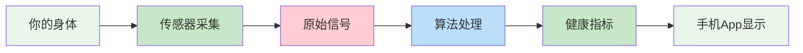

**简单理解**：传感器负责"感知"，算法负责"理解"。

---

## 二、传感器的世界：手表的"五官"

### 2.1 手表里藏着哪些传感器？

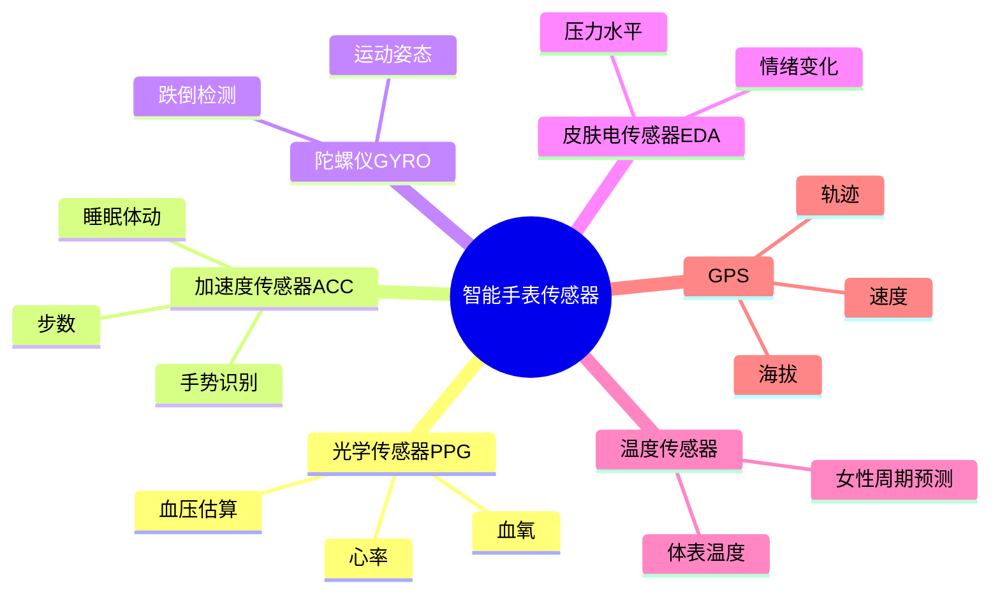

**重点**：今天我们主要讲**PPG（光电容积脉搏波）**和**加速度传感器**，因为它们是健康算法的绝对主力！

### 2.2 PPG传感器：手表的"透视眼"

#### 什么是PPG？

PPG全称**Photoplethysmography**，中文叫**光电容积脉搏波**。

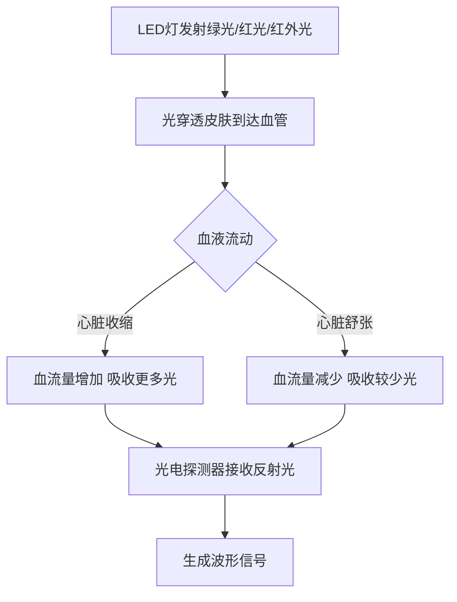

**核心原理**：
- 血液会吸收特定波长的光
- 心脏跳动时，血管里血流量变化
- 血流量多 → 吸收光多 → 反射光少
- 血流量少 → 吸收光少 → 反射光多

**结果**：反射光的强弱变化，正好对应你的心跳节律！

#### PPG传感器的硬件结构

```
┌─────────────────────────────────────┐
│          手表背面                  │
│                                     │
│    💡💡💡  LED灯组                 │
│    (绿光×2 红光×1 红外×1)          │
│                                     │
│         📷  光电探测器              │
│                                     │
└─────────────────────────────────────┘
         ↓ ↓ ↓
    你的手腕皮肤
```

**为什么有多种光？**

| 光源 | 波长 | 用途 |
|------|------|------|
| 绿光 | 525nm | 心率监测（日常） |
| 红光 | 660nm | 血氧监测 |
| 红外光 | 940nm | 血氧监测（夜间） |

---

## 三、心率算法：从光信号到心跳数

### 3.1 原始PPG信号长什么样？

当你戴上手表，传感器每秒采集几十次数据，得到的原始波形是这样的：

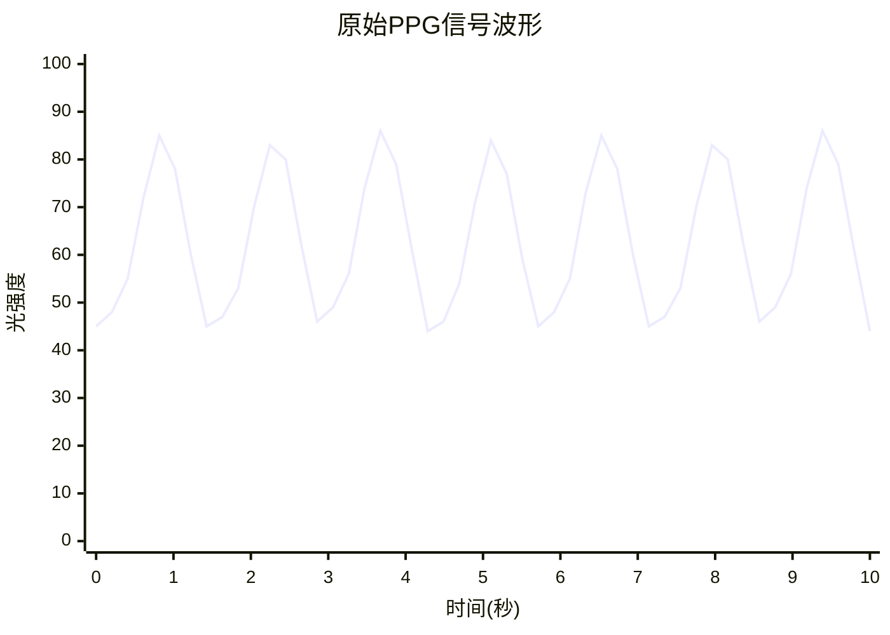

**看到了吗？** 波形有明显的周期性，每个波峰就是一次心跳！

### 3.2 心率算法的完整流程

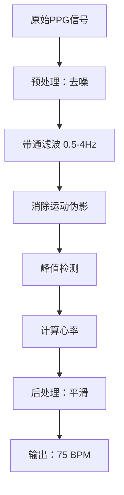

让我们一步步拆解！

### 3.3 步骤1：预处理与去噪

**问题**：原始信号中有很多噪声

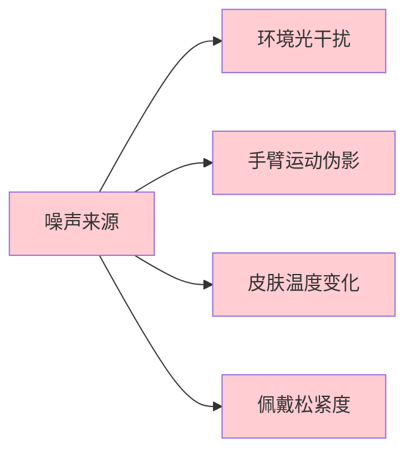

**解决方案**：

```python
import numpy as np
from scipy.signal import butter, filtfilt

def preprocess_ppg(signal, fs=25):
    """
    PPG信号预处理
    fs: 采样率（每秒25个点）
    """
    # 1. 去直流分量
    signal = signal - np.mean(signal)
    
    # 2. 带通滤波（保留0.5-4Hz，对应心率30-240 BPM）
    lowcut = 0.5
    highcut = 4.0
    b, a = butter(4, [lowcut/(fs/2), highcut/(fs/2)], btype='band')
    filtered_signal = filtfilt(b, a, signal)
    
    # 3. 归一化
    filtered_signal = filtered_signal / np.max(np.abs(filtered_signal))
    
    return filtered_signal

# 使用示例
raw_signal = [...] # 从传感器读取的数据
clean_signal = preprocess_ppg(raw_signal)
```

### 3.4 步骤2：运动伪影消除（最难的环节！）

**为什么运动时心率不准？**

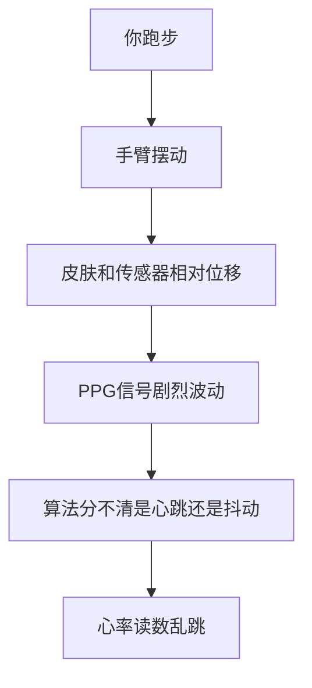

**解决方案：用加速度传感器（ACC）帮忙！**

```python
def remove_motion_artifact(ppg_signal, acc_signal, fs=25):
    """
    使用加速度计信号消除运动伪影
    """
    # 方法1：自适应滤波
    from scipy.signal import lms
    filtered_signal, error = lms(ppg_signal, acc_signal, step_size=0.01)
    
    # 方法2：频域减法
    # 1. 对PPG和ACC都做FFT
    ppg_fft = np.fft.fft(ppg_signal)
    acc_fft = np.fft.fft(acc_signal)
    
    # 2. 从PPG频谱中减去与ACC相关的成分
    clean_fft = ppg_fft - 0.5 * acc_fft
    
    # 3. 逆变换回时域
    clean_signal = np.fft.ifft(clean_fft).real
    
    return clean_signal
```

### 3.5 步骤3：峰值检测（找心跳）

**核心思路**：找到波峰，计算间隔

```python
from scipy.signal import find_peaks

def detect_heart_rate(ppg_signal, fs=25):
    """
    从PPG信号检测心率
    """
    # 1. 找峰值
    peaks, properties = find_peaks(
        ppg_signal, 
        height=0.3,        # 最小高度
        distance=fs*0.3    # 最小间距（排除过高心率）
    )
    
    # 2. 计算峰值间隔（RR间期）
    rr_intervals = np.diff(peaks) / fs  # 单位：秒
    
    # 3. 转换为心率（BPM = 60 / RR间期）
    heart_rates = 60.0 / rr_intervals
    
    # 4. 返回平均心率
    avg_hr = np.mean(heart_rates)
    return avg_hr, heart_rates

# 使用
hr, hr_series = detect_heart_rate(clean_signal, fs=25)
print(f"当前心率: {hr:.0f} BPM")
```

### 3.6 完整心率算法流程图

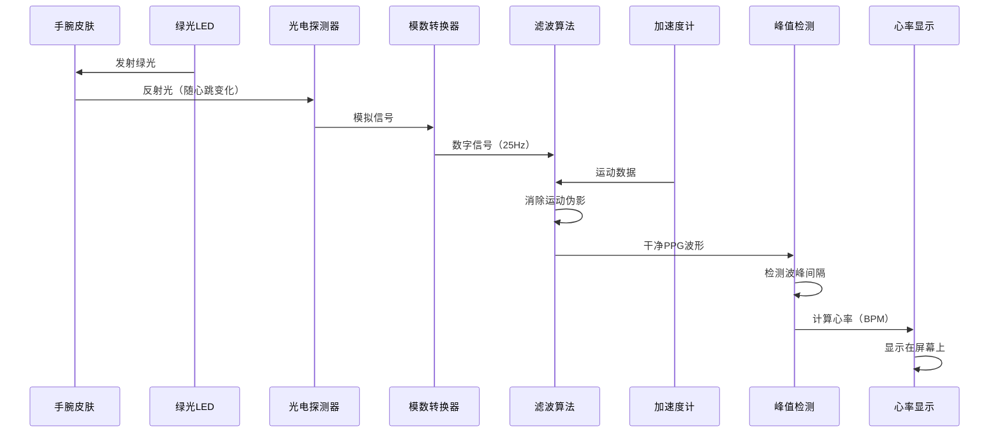

---

## 四、血氧算法：你的血液有多"红"？

### 4.1 什么是血氧饱和度（SpO2）？

> **血氧饱和度**：血液中与氧气结合的血红蛋白占总血红蛋白的百分比。

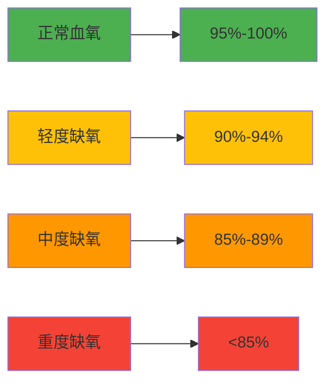

### 4.2 血氧测量的光学原理

**核心发现**：
- **含氧血红蛋白（HbO2）**和**脱氧血红蛋白（Hb）**对不同波长的光吸收率不同！

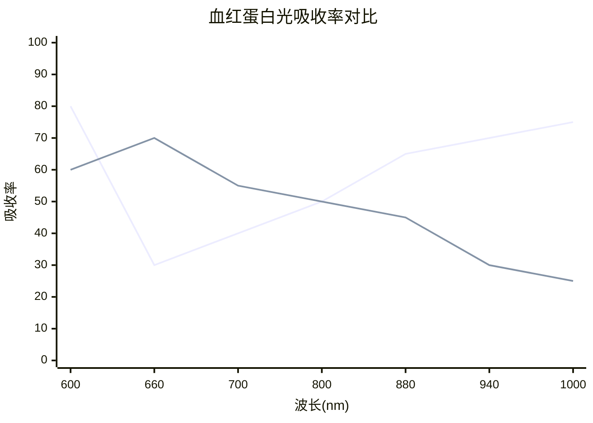

**关键波长**：
- **660nm（红光）**：脱氧血红蛋白吸收更多
- **940nm（红外光）**：含氧血红蛋白吸收更多

### 4.3 血氧算法的核心公式

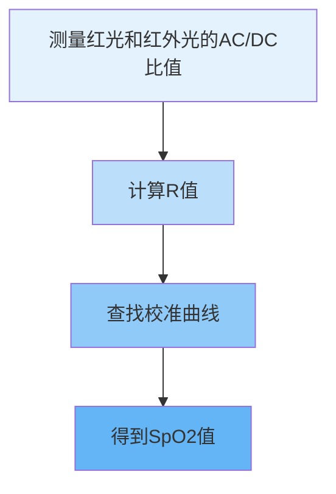

**计算步骤**：

```python
def calculate_spo2(red_signal, ir_signal):
    """
    计算血氧饱和度
    """
    # 1. 提取交流分量（AC）和直流分量（DC）
    red_ac = np.std(red_signal)
    red_dc = np.mean(red_signal)
    ir_ac = np.std(ir_signal)
    ir_dc = np.mean(ir_signal)
    
    # 2. 计算R值（Ratio of Ratios）
    r = (red_ac / red_dc) / (ir_ac / ir_dc)
    
    # 3. 使用经验公式转换为SpO2
    # 这个公式是通过大量临床数据拟合得到的
    spo2 = 110 - 25 * r
    
    # 4. 限制在合理范围
    spo2 = np.clip(spo2, 70, 100)
    
    return spo2

# 使用示例
red_data = [...]   # 660nm采集的信号
ir_data = [...]    # 940nm采集的信号
spo2 = calculate_spo2(red_data, ir_data)
print(f"血氧饱和度: {spo2:.1f}%")
```

**公式来源**：

实际产品中会使用**查找表（Look-up Table）**，这个表是通过与医用血氧仪对比大量实验数据得到的：

```python
# 简化的SpO2查找表
SPO2_LOOKUP_TABLE = {
    0.4: 100,
    0.5: 98,
    0.6: 96,
    0.7: 94,
    0.8: 92,
    0.9: 90,
    1.0: 88,
    1.1: 85,
    1.2: 82,
    1.3: 80,
    1.4: 75
}

def spo2_from_table(r_value):
    """通过查表得到SpO2"""
    # 找到最接近的R值
    closest_r = min(SPO2_LOOKUP_TABLE.keys(), key=lambda x: abs(x - r_value))
    return SPO2_LOOKUP_TABLE[closest_r]
```

### 4.4 为什么血氧监测通常在静止状态？

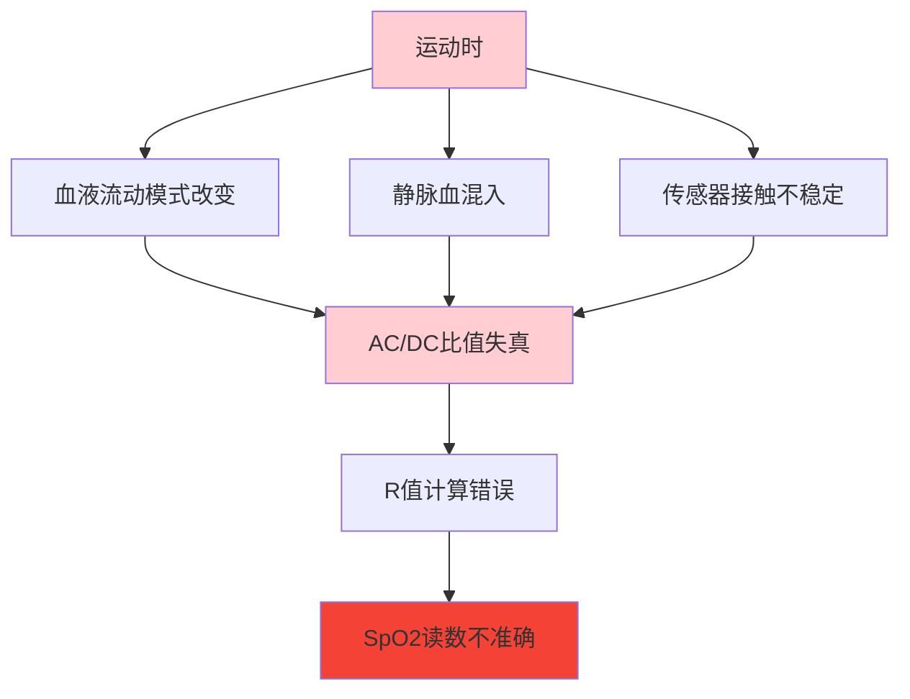

**解决方案**：
- 夜间睡眠时自动测量（身体最稳定）
- 要求用户保持静止10-15秒
- 使用多帧数据取平均

---

## 五、睡眠算法：手表怎么知道你睡着了？

### 5.1 睡眠分期：你睡得好不好？

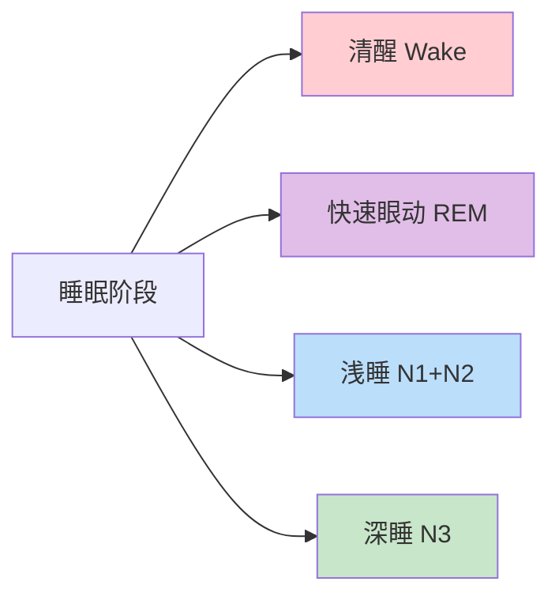

| 阶段 | 占比 | 特征 | 作用 |
|------|------|------|------|
| **清醒** | 5-10% | 翻身、短暂醒来 | 正常现象 |
| **REM** | 20-25% | 眼球快速运动、做梦 | 记忆巩固 |
| **浅睡** | 45-55% | 心率和呼吸放缓 | 过渡阶段 |
| **深睡** | 15-25% | 最难唤醒、生长激素分泌 | 身体修复 |

### 5.2 睡眠算法的多传感器融合

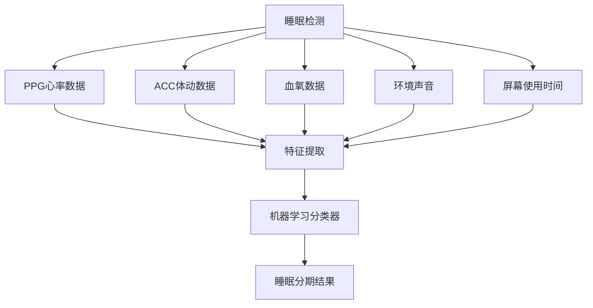

### 5.3 传统算法：基于规则的方法

```python
def classify_sleep_stage(hr, hrv, movement, spo2):
    """
    基于规则的睡眠分期（简化版）
    """
    # 规则1：体动检测
    if movement > threshold_movement:
        return "清醒"
    
    # 规则2：心率变异性（HRV）分析
    if hrv > threshold_hrv_rem:
        return "REM睡眠"
    
    # 规则3：心率和血氧
    if hr < threshold_deep_hr and spo2 > 95:
        return "深睡"
    
    # 默认浅睡
    return "浅睡"
```

### 5.4 现代算法：深度学习模型


```python
import torch
import torch.nn as nn

class SleepStagingModel(nn.Module):
    """
    睡眠分期深度学习模型
    """
    def __init__(self, num_classes=4):
        super().__init__()
        
        # 1. CNN提取空间特征
        self.cnn = nn.Sequential(
            nn.Conv1d(in_channels=3, out_channels=64, kernel_size=5),
            nn.ReLU(),
            nn.MaxPool1d(2),
            nn.Conv1d(64, 128, 5),
            nn.ReLU(),
            nn.MaxPool1d(2)
        )
        
        # 2. LSTM建模时间序列
        self.lstm = nn.LSTM(
            input_size=128,
            hidden_size=256,
            num_layers=2,
            batch_first=True,
            bidirectional=True
        )
        
        # 3. 分类头
        self.classifier = nn.Sequential(
            nn.Linear(256*2, 128),
            nn.ReLU(),
            nn.Dropout(0.5),
            nn.Linear(128, num_classes)  # 清醒/REM/浅睡/深睡
        )
    
    def forward(self, x):
        # x shape: (batch, seq_len, channels)
        # channels: [PPG, ACC, SpO2]
        
        x = x.permute(0, 2, 1)  # (batch, channels, seq_len)
        x = self.cnn(x)
        x = x.permute(0, 2, 1)  # (batch, seq_len, features)
        
        x, _ = self.lstm(x)
        x = self.classifier(x[:, -1, :])  # 取最后一个时间步
        
        return x

# 训练数据示例
# 输入：30秒窗口，3通道（PPG、ACC、SpO2），每秒25个采样点
input_data = torch.randn(32, 750, 3)  # (batch, seq_len, channels)
model = SleepStagingModel(num_classes=4)
output = model(input_data)  # (32, 4) 4个类别的概率
```

### 5.5 睡眠算法的完整流程

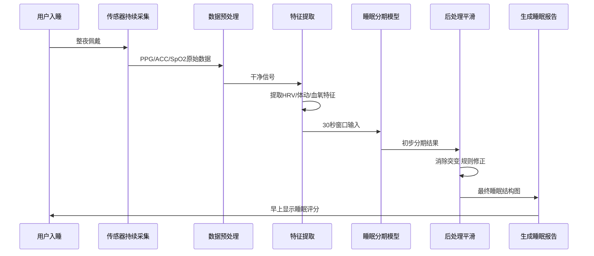

---

## 六、血压算法：无创测血压的黑科技

### 6.1 传统 vs 无创血压测量

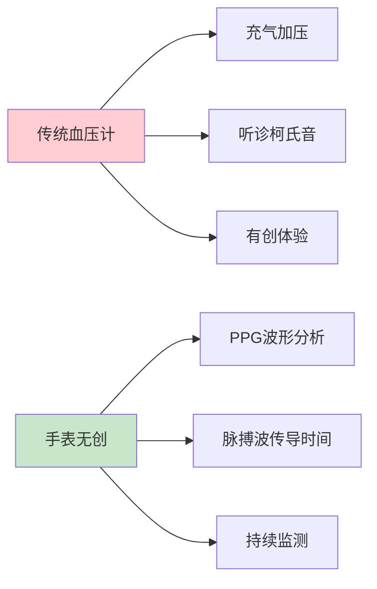

### 6.2 核心原理：脉搏波传导时间（PTT）

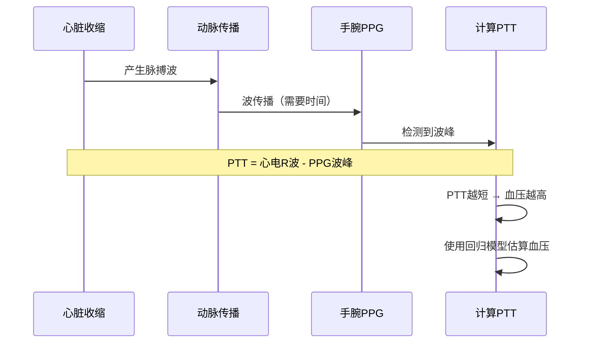

**公式**：

```
BP = a × PTT + b × HR + c
```

其中 a, b, c 是通过临床数据拟合的参数。

### 6.3 血压算法的实现

```python
def estimate_blood_pressure(ppg_signal, ecg_signal, fs=25):
    """
    基于PTT的血压估算（简化版）
    """
    # 1. 检测ECG的R波峰值
    r_peaks = detect_r_peaks(ecg_signal, fs)
    
    # 2. 检测PPG的波峰
    ppg_peaks = detect_ppg_peaks(ppg_signal, fs)
    
    # 3. 计算PTT（脉搏波传导时间）
    ptt_values = []
    for r_peak in r_peaks:
        # 找到R波之后最近的PPG峰
        next_ppg_peak = find_nearest(ppg_peaks, r_peak, direction='after')
        ptt = next_ppg_peak - r_peak
        ptt_values.append(ptt)
    
    avg_ptt = np.mean(ptt_values)
    
    # 4. 使用校准模型估算血压
    # 这些参数需要个性化校准
    systolic = 120 - 0.5 * (avg_ptt - 200)  # 收缩压
    diastolic = 80 - 0.3 * (avg_ptt - 200)  # 舒张压
    
    return systolic, diastolic

# 注意：实际产品需要定期校准（用传统血压计）
```

**重要提示**：
- ⚠️ 目前手表血压功能**仅供参考，不能作为医疗诊断依据**
- ⚠️ 需要定期用传统血压计校准
- ⚠️ 准确度不如医用设备

---

## 七、HRV算法：压力与健康的"晴雨表"

### 7.1 什么是HRV？

> **HRV（Heart Rate Variability）**：心跳间隔的变异性，不是心率本身，而是**心跳之间的时间变化**。

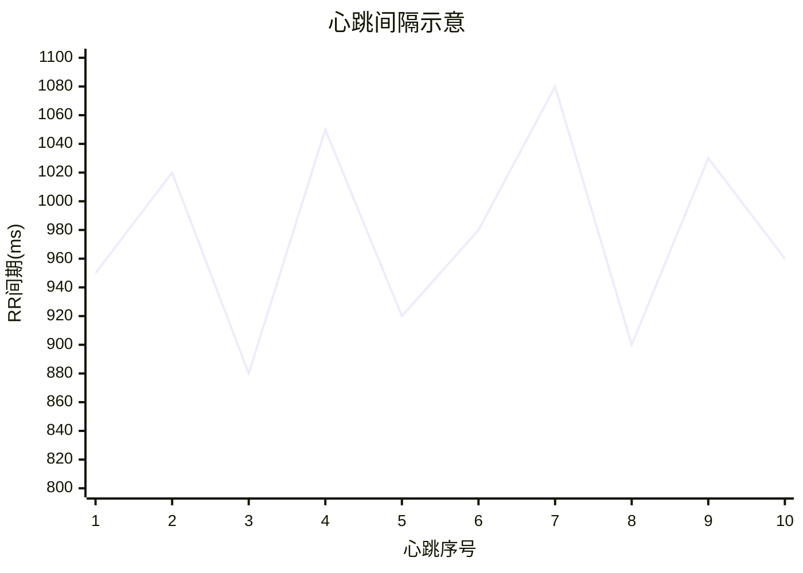

**反直觉的事实**：
- 心跳越规律，HRV越**低** → 可能压力大、疲劳
- 心跳有一定变化，HRV越**高** → 通常表示健康、放松

### 7.2 HRV的计算方法

```mermaid
graph TD
    A[PPG峰值检测] --> B[RR间期序列]
    B --> C[异常值剔除]
    C --> D[时域分析]
    C --> E[频域分析]
    C --> F[非线性分析]
    
    D --> D1[SDNN: 标准差]
    D --> D2[RMSSD: 相邻差均方根]
    
    E --> E1[LF: 低频功率]
    E --> E2[HF: 高频功率]
    
    style A fill:#E3F2FD
    style B fill:#BBDEFB
    style C fill:#90CAF9
```

```python
def calculate_hrv(rr_intervals):
    """
    计算HRV指标
    rr_intervals: 心跳间隔序列（毫秒）
    """
    # 1. 时域分析
    sdnn = np.std(rr_intervals)  # 总体变异性
    
    # 相邻RR间期的差值
    diff_rr = np.diff(rr_intervals)
    rmssd = np.sqrt(np.mean(diff_rr**2))  # 副交感神经活性
    
    # 2. 频域分析（需要插值重采样）
    from scipy.signal import welch
    
    # 重采样到4Hz
    rr_uniform = np.interp(
        np.arange(0, len(rr_intervals)/4, 0.25),
        np.cumsum(rr_intervals)/1000,
        rr_intervals
    )
    
    # 功率谱密度
    freqs, psd = welch(rr_uniform, fs=4.0)
    
    # LF (0.04-0.15Hz) 和 HF (0.15-0.4Hz)
    lf_power = np.trapz(psd[(freqs >= 0.04) & (freqs <= 0.15)])
    hf_power = np.trapz(psd[(freqs >= 0.15) & (freqs <= 0.4)])
    lf_hf_ratio = lf_power / hf_power  # 交感/副交感平衡
    
    return {
        'sdnn': sdnn,
        'rmssd': rmssd,
        'lf': lf_power,
        'hf': hf_power,
        'lf_hf_ratio': lf_hf_ratio
    }

# 使用
rr_data = [950, 1020, 880, 1050, 920, ...]
hrv_metrics = calculate_hrv(rr_data)
print(f"RMSSD: {hrv_metrics['rmssd']:.2f} ms")
```

### 7.3 HRV的实际应用

| 场景 | HRV特征 | 含义 |
|------|---------|------|
| **深度睡眠** | HRV高，HF主导 | 副交感神经活跃，恢复状态 |
| **运动时** | HRV低，LF主导 | 交感神经活跃，应激状态 |
| **压力大** | HRV持续偏低 | 身体疲劳，需要休息 |
| **生病前** | HRV突然下降 | 免疫系统可能正在战斗 |
| **冥想后** | HRV升高 | 放松效果明显 |

---

## 八、卡路里算法：你今天消耗了多少能量？

### 8.1 卡路里的两大组成部分

```mermaid
pie title 每日卡路里消耗构成
    "基础代谢(BMR)" : 65
    "活动消耗" : 25
    "食物热效应" : 10
```

### 8.2 基础代谢率（BMR）算法

**常用公式**：Mifflin-St Jeor 方程

```python
def calculate_bmr(weight_kg, height_cm, age, gender):
    """
    计算基础代谢率
    gender: 'male' or 'female'
    """
    if gender == 'male':
        bmr = 10 * weight_kg + 6.25 * height_cm - 5 * age + 5
    else:
        bmr = 10 * weight_kg + 6.25 * height_cm - 5 * age - 161
    
    return bmr

# 示例：25岁男性，75kg，180cm
bmr = calculate_bmr(75, 180, 25, 'male')
print(f"基础代谢: {bmr:.0f} kcal/天")
# 输出：约1756 kcal/天
```

### 8.3 活动消耗算法

```mermaid
graph TD
    A[ACC传感器] --> B[步态识别]
    B --> C[运动类型分类]
    C --> D[MET值查询]
    D --> E[卡路里计算]
    
    F[心率数据] --> G[心率区间]
    G --> H[运动强度估算]
    H --> E
    
    E --> I[总活动消耗]
    
    style A fill:#E8F5E9
    style B fill:#C8E6C9
    style C fill:#A5D6A7
    style D fill:#81C784
    style E fill:#66BB6A
```

**MET值表**（代谢当量）：

| 活动 | MET值 | 说明 |
|------|-------|------|
| 静坐 | 1.0 | 基础状态 |
| 散步 | 3.0 | 慢速行走 |
| 快走 | 5.0 | 6km/h |
| 慢跑 | 7.0 | 8km/h |
| 跑步 | 10.0 | 10km/h |
| HIIT | 12.0 | 高强度间歇 |

```python
def calculate_active_calories(weight_kg, duration_minutes, met_value):
    """
    计算活动消耗卡路里
    """
    # 公式：消耗 = MET × 体重(kg) × 时间(小时)
    duration_hours = duration_minutes / 60
    calories = met_value * weight_kg * duration_hours
    
    return calories

# 示例：75kg的人，跑步30分钟（MET=10）
active_cal = calculate_active_calories(75, 30, 10)
print(f"活动消耗: {active_cal:.0f} kcal")
# 输出：约375 kcal
```

### 8.4 结合心率的精准算法

```python
def calculate_calories_with_hr(weight_kg, age, gender, avg_hr, duration_min):
    """
    基于心率的卡路里计算（更准确）
    """
    # 最大心率
    max_hr = 220 - age
    
    # 心率储备百分比
    hr_reserve_pct = avg_hr / max_hr
    
    # 根据心率区间估算MET
    if hr_reserve_pct < 0.5:
        met = 3.0  # 轻度
    elif hr_reserve_pct < 0.7:
        met = 6.0  # 中度
    elif hr_reserve_pct < 0.85:
        met = 9.0  # 强度
    else:
        met = 12.0  # 极限
    
    return calculate_active_calories(weight_kg, duration_min, met)
```

---

## 九、跌倒检测与紧急求救：关键时刻能救命

### 9.1 跌倒检测的算法逻辑

```mermaid
flowchart TD
    A[实时采集ACC+GYRO] --> B{检测突然加速}
    B -->|是| C[检测失重阶段]
    B -->|否| A
    C -->|是| D[检测撞击冲击]
    C -->|否| A
    D -->|是| E[检测体位变化]
    D -->|否| A
    E -->|是| F[判定跌倒]
    E -->|否| A
    F --> G[启动倒计时]
    G --> H{用户取消?}
    H -->|是| A
    H -->|否| I[拨打紧急电话]
```

### 9.2 跌倒检测的实现

```python
def detect_fall(acc_data, gyro_data, fs=50):
    """
    跌倒检测算法（简化版）
    """
    # 1. 计算合加速度
    acc_magnitude = np.sqrt(
        acc_data[:, 0]**2 + 
        acc_data[:, 1]**2 + 
        acc_data[:, 2]**2
    )
    
    # 2. 检测失重阶段（加速度接近0）
    freefall_threshold = 0.5  # g
    freefall = acc_magnitude < freefall_threshold
    
    # 3. 检测冲击阶段（加速度突然增大）
    impact_threshold = 2.5  # g
    impact = acc_magnitude > impact_threshold
    
    # 4. 检测体位变化（使用陀螺仪）
    gyro_magnitude = np.sqrt(
        gyro_data[:, 0]**2 + 
        gyro_data[:, 1]**2 + 
        gyro_data[:, 2]**2
    )
    orientation_change = np.max(gyro_magnitude) > 200  # deg/s
    
    # 5. 综合判断
    if np.any(freefall) and np.any(impact) and orientation_change:
        return True  # 检测到跌倒
    
    return False
```

---

## 十、算法的工程实现：从实验室到手腕

### 10.1 嵌入式系统的限制

```mermaid
mindmap
    root((手表算法挑战))
        算力有限
            MCU主频低
            内存小
            不能跑大模型
        功耗限制
            电池小
            需要多天续航
            不能持续高负载
        实时性要求
            心率需要秒级更新
            跌倒检测需要即时
        传感器噪声
            佩戴位置不同
            皮肤颜色差异
            运动干扰
```

### 10.2 算法优化策略

| 策略 | 说明 | 效果 |
|------|------|------|
| **模型压缩** | 量化、剪枝 | 模型体积减少90% |
| **边缘计算** | 在手表端跑简单模型 | 降低延迟 |
| **云端协同** | 复杂分析上传手机/云端 | 节省功耗 |
| **自适应采样** | 静止时低频，运动时高频 | 平衡功耗 |
| **特征缓存** | 只传特征，不传原始数据 | 减少传输 |

### 10.3 典型架构

```mermaid
graph TD
    A[传感器] --> B[手表MCU]
    B --> C[实时简单算法]
    C --> D[心率/步数等]
    C --> E[异常检测]
    
    B --> F[蓝牙传输]
    F --> G[手机App]
    G --> H[复杂分析]
    H --> I[历史趋势]
    H --> J[AI诊断辅助]
    
    G --> K[云端]
    K --> L[模型训练]
    K --> M[个性化优化]
    L --> N[下发新手表固件]
    
    style B fill:#FFF9C4
    style C fill:#FFF59D
    style G fill:#FFECB3
    style K fill:#FFE082
```

---

## 十一、不同品牌手表的算法差异

### 11.1 主流方案对比

| 品牌 | 心率算法 | 睡眠算法 | 特色功能 |
|------|---------|---------|---------|
| **Apple Watch** | 多波长PPG+深度学习 | 基于WatchOS专有模型 | 房颤预警、ECG |
| **华为Watch** | TruSeen 5.0+ | TruSleep 3.0 | 血管硬化检测 |
| **小米手环** | 自研算法+供应链方案 | 基础分期 | 性价比 |
| **Garmin** | Elevate传感器 | Firstbeat算法 | 运动生理指标 |
| **Fitbit** | PurePulse | 业界最早睡眠分期 | 健康生态 |

### 11.2 为什么不同手表数据不一样？

```mermaid
graph LR
    A[不同手表测出不同数据] --> B[硬件差异]
    A --> C[算法差异]
    A --> D[采样率不同]
    
    B --> B1[LED波长不同]
    B --> B2[传感器数量不同]
    B --> B3[佩戴设计不同]
    
    C --> C1[滤波参数不同]
    C --> C2[峰值检测算法不同]
    C --> C3[校准数据不同]
```

**核心原因**：每家算法都是**黑盒**，训练数据和处理流程不同，导致结果有差异。

---

## 十二、未来趋势：健康算法会走向哪里？

### 12.1 技术趋势

```mermaid
graph TD
    A[当前] --> B[无创血糖]
    A --> C[连续血压]
    A --> D[体温趋势]
    A --> E[情绪识别]
    
    B --> F[红外光谱分析]
    C --> G[PTT+机器学习]
    D --> H[高精度温度传感器]
    E --> I[HRV+EDA融合]
    
    style A fill:#E1BEE7
    style B fill:#CE93D8
    style C fill:#CE93D8
    style D fill:#CE93D8
    style E fill:#CE93D8
```

### 12.2 算法趋势

| 趋势 | 说明 | 意义 |
|------|------|------|
| **端侧AI** | 手表直接跑小模型 | 降低延迟，保护隐私 |
| **联邦学习** | 多设备联合训练 | 数据不出设备 |
| **多模态融合** | PPG+ACC+EDA+温度 | 更准确的健康画像 |
| **个性化校准** | 根据个人数据微调 | 提高个体准确度 |
| **医疗级认证** | 通过FDA/NMPA认证 | 从消费品到医疗器械 |

### 12.3 监管与伦理

```mermaid
mindmap
    root((健康算法的挑战))
        准确度问题
            不能替代医疗设备
            误报漏报风险
        隐私保护
            健康数据敏感
            数据泄露风险
        算法偏见
            不同肤色准确度差异
            年龄性别差异
        责任归属
            算法出错谁负责
            监管滞后
```

---

### 13.1 健康算法全景图

```mermaid
mindmap
    root((智能手表健康算法))
        心率监测
            PPG原理
            峰值检测
            运动补偿
        血氧监测
            双波长光学
            AC/DC比值
            校准曲线
        睡眠分析
            多传感器融合
            深度学习分期
            HRV辅助
        血压估算
            PTT测量
            回归模型
            定期校准
        HRV分析
            时域频域
            压力评估
            健康预警
        卡路里计算
            BMR基础
            MET活动
            心率辅助
        跌倒检测
            ACC+GYRO
            三阶段判断
            紧急求救
```

| 算法 | 核心传感器 | 关键技术 | 准确度 |
|------|-----------|---------|--------|
| 心率 | PPG绿光 | 峰值检测+运动补偿 | ⭐⭐⭐⭐ |
| 血氧 | PPG红光+红外 | 双波长比值 | ⭐⭐⭐ |
| 睡眠 | PPG+ACC | 多模态分类 | ⭐⭐⭐⭐ |
| 血压 | PPG+ECG | PTT测量 | ⭐⭐⭐ |
| HRV | PPG | RR间期分析 | ⭐⭐⭐⭐ |
| 卡路里 | ACC+HR | MET+心率模型 | ⭐⭐⭐ |

### 13.3 给用户的建议

```mermaid
graph TD
    A[使用智能手表] --> B[正确佩戴]
    A --> C[定期校准]
    A --> D[理解局限]
    A --> E[关注趋势而非绝对值]
    
    B --> B1[紧贴皮肤但不过紧]
    B --> B2[避开纹身和毛发]
    
    C --> C1[血压需要医用设备校准]
    
    D --> D1[不是医疗器械]
    D --> D2[异常需要就医确认]
    
    E --> E1[看长期趋势]
    E --> E2[不要纠结单次数据]
    
    style A fill:#4CAF50
    style B fill:#81C784
    style C fill:#81C784
    style D fill:#81C784
    style E fill:#81C784
```

---

## 十四、附录：核心算法代码速查

### 14.1 心率检测完整版

```python
import numpy as np
from scipy.signal import butter, filtfilt, find_peaks

class HeartRateMonitor:
    """
    心率监测算法（生产级简化版）
    """
    def __init__(self, fs=25):
        self.fs = fs
        self.buffer_size = fs * 10  # 10秒窗口
        self.ppg_buffer = []
        
    def add_sample(self, ppg_value, acc_value=None):
        """添加新样本"""
        self.ppg_buffer.append(ppg_value)
        if len(self.ppg_buffer) > self.buffer_size:
            self.ppg_buffer.pop(0)
        
        # 每10秒计算一次
        if len(self.ppg_buffer) >= self.buffer_size:
            return self.calculate_hr()
        return None
    
    def calculate_hr(self):
        """计算心率"""
        signal = np.array(self.ppg_buffer)
        
        # 1. 预处理
        signal = signal - np.mean(signal)
        b, a = butter(4, [0.5/(self.fs/2), 4.0/(self.fs/2)], btype='band')
        signal = filtfilt(b, a, signal)
        
        # 2. 峰值检测
        peaks, _ = find_peaks(
            signal, 
            height=0.3,
            distance=self.fs*0.3
        )
        
        if len(peaks) < 2:
            return None
        
        # 3. 计算心率
        rr_intervals = np.diff(peaks) / self.fs
        hr = 60.0 / np.mean(rr_intervals)
        
        return hr

# 使用
monitor = HeartRateMonitor(fs=25)
for ppg_sample in sensor_data:
    hr = monitor.add_sample(ppg_sample)
    if hr:
        print(f"心率: {hr:.0f} BPM")
```

### 14.2 步数检测算法

```python
def count_steps(acc_data, fs=25):
    """
    简易步数统计算法
    """
    # 1. 计算合加速度
    acc_mag = np.sqrt(
        acc_data[:, 0]**2 + 
        acc_data[:, 1]**2 + 
        acc_data[:, 2]**2
    )
    
    # 2. 去除重力加速度
    acc_mag = acc_mag - 1.0  # 1g = 9.8m/s²
    
    # 3. 带通滤波（0.5-3Hz，对应步行频率）
    b, a = butter(4, [0.5/(fs/2), 3.0/(fs/2)], btype='band')
    filtered = filtfilt(b, a, acc_mag)
    
    # 4. 峰值检测（每一步对应一个波峰）
    peaks, _ = find_peaks(
        filtered, 
        height=0.1,
        distance=fs*0.3  # 最小间隔300ms
    )
    
    return len(peaks)
```

---

**写在最后**：

智能手表的健康算法，是**光学、信号处理、机器学习、生理学**的完美结合。你手腕上那块小小的设备，其实是一个微型的"健康实验室"。

**记住这些核心要点**：
1. PPG通过光的反射测心率和血氧
2. 加速度计负责计步、睡眠和跌倒检测
3. 算法需要消除运动干扰才能准确
4. 深度学习正在取代传统规则算法
5. 手表数据仅供参考，不能替代医疗设备

下次当你的手表提醒你"昨晚深睡只有1小时"时，你会心一笑：我知道这背后有多少算法在为你工作！

---

---

## 附录：常用缩写对照表

| 缩写 | 全称 | 中文 |
|------|------|------|
| PPG | Photoplethysmography | 光电容积脉搏波 |
| ACC | Accelerometer | 加速度计 |
| GYRO | Gyroscope | 陀螺仪 |
| SpO2 | Peripheral Oxygen Saturation | 血氧饱和度 |
| HRV | Heart Rate Variability | 心率变异性 |
| BPM | Beats Per Minute | 每分钟心跳数 |
| PTT | Pulse Transit Time | 脉搏波传导时间 |
| BMR | Basal Metabolic Rate | 基础代谢率 |
| MET | Metabolic Equivalent | 代谢当量 |
| ECG | Electrocardiogram | 心电图 |
| EDA | Electrodermal Activity | 皮肤电活动 |
| RMSSD | Root Mean Square of Successive Differences | 相邻RR间期差均方根 |
| SDNN | Standard Deviation of NN intervals | RR间期标准差 |