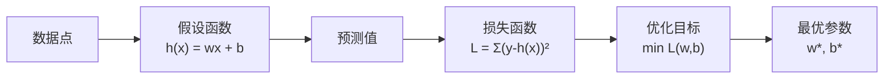
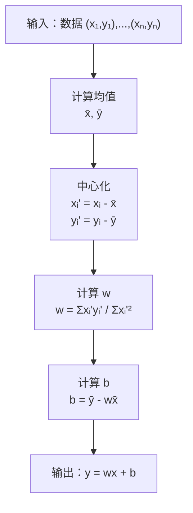
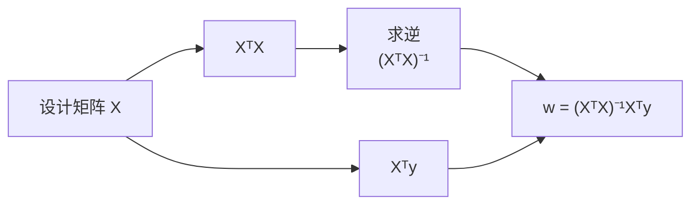
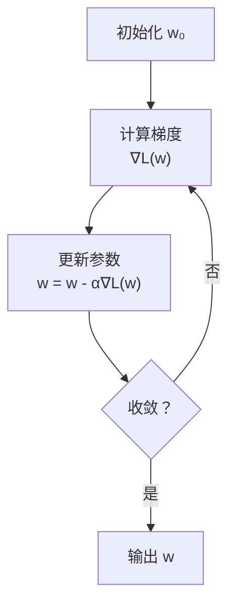
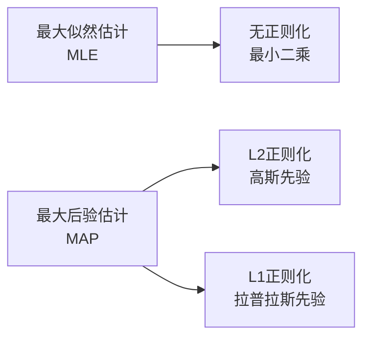
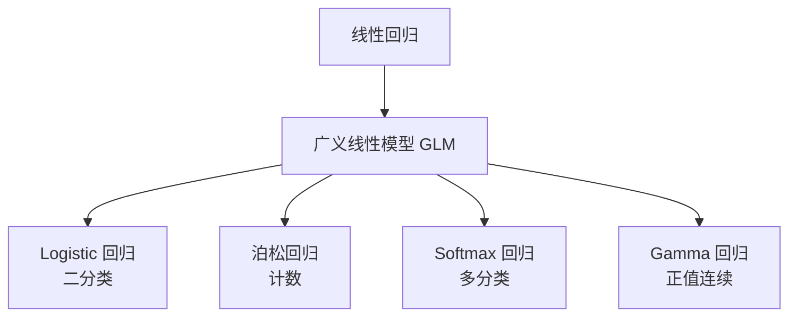
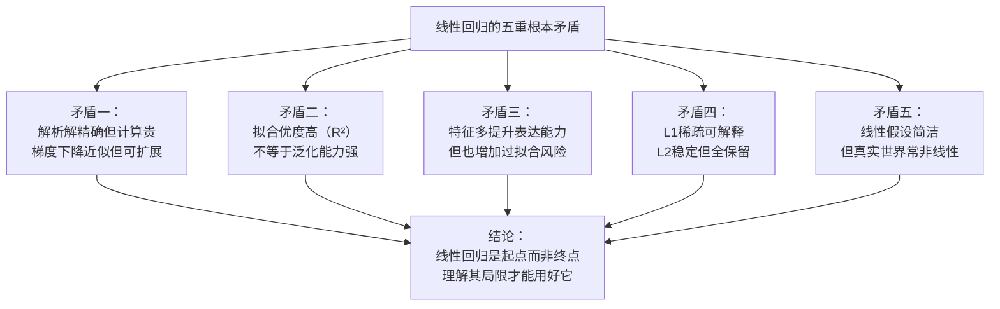

# 线性回归算法深度解析：从最小二乘到正则化的完整数学之旅

> 线性回归是机器学习中最基础、最经典的算法，也是理解更复杂模型的基石。它看似简单——不就是画一条直线拟合数据吗？但当你深入其中，会发现它涉及线性代数、概率统计、优化理论等多个数学分支的精妙融合。本文将从最基础的"用直线拟合散点"讲起，一步步推导最小二乘法的数学原理，深入梯度下降和正规方程两种求解方法，最终探讨正则化、假设检验等高级主题，帮你建立对线性回归的完整认知体系。

---

## 一、什么是线性回归？——从直觉到形式化

### 1.1 一个生活中的例子

假设你想预测房价。你收集了一些数据：

| 房屋面积 (m²) | 房价 (万元) |
|-------------|-----------|
| 50 | 120 |
| 80 | 180 |
| 100 | 220 |
| 120 | 260 |
| 150 | 310 |

把这些点画在坐标系中，你会发现它们大致呈一条直线的趋势：

```
房价
  ↑
350|                                    ●
300|                              ●
250|                        ●
200|                  ●
150|            ●
100|      ●
 50|
  0+----+----+----+----+----+----+→ 面积
    0   50  100  150  200
```

**线性回归的目标**：找到一条直线，最好地描述面积和房价之间的关系，然后用这条直线预测新房子的价格。

### 1.2 从直觉到数学模型

这条直线的方程是：

$$y = wx + b$$

其中：
- $y$：房价（因变量/目标变量）
- $x$：面积（自变量/特征）
- $w$：斜率（权重/系数）
- $b$：截距（偏置）

**核心问题**：给定一组数据点 $(x_1, y_1), (x_2, y_2), ..., (x_n, y_n)$，如何找到最优的 $w$ 和 $b$？

### 1.3 什么是"最优"？——损失函数的诞生

直觉上，"最优"的直线应该让所有数据点到直线的距离之和最小。但距离有正负，直接相加会抵消。解决方案：

**最小二乘法（Least Squares）**：最小化预测值与真实值之差的平方和

$$L(w, b) = \sum_{i=1}^{n} (y_i - (wx_i + b))^2$$

这个函数 $L(w, b)$ 称为**损失函数（Loss Function）**或**代价函数（Cost Function）**。我们的目标就是找到使 $L(w, b)$ 最小的 $w$ 和 $b$。



---

## 二、一元线性回归：最小二乘法的解析解

### 2.1 简化问题：先求 $w$，再求 $b$

为了简化，我们先对数据进行**中心化**处理——减去均值：

$$x_i' = x_i - \bar{x}, \quad y_i' = y_i - \bar{y}$$

中心化后，数据分布不变，但均值变为 0。此时最优的 $b$ 就是 0，我们只需要求 $w$：

$$L(w) = \sum_{i=1}^{n} (y_i' - wx_i')^2$$

### 2.2 求导找极值

要最小化 $L(w)$，对 $w$ 求导并令导数为 0：

$$\frac{dL}{dw} = \sum_{i=1}^{n} 2(y_i' - wx_i')(-x_i') = 0$$

展开：

$$-2\sum_{i=1}^{n} x_i'(y_i' - wx_i') = 0$$

$$\sum_{i=1}^{n} x_i'y_i' - w\sum_{i=1}^{n} x_i'^2 = 0$$

解得：

$$w = \frac{\sum_{i=1}^{n} x_i'y_i'}{\sum_{i=1}^{n} x_i'^2}$$

### 2.3 几何解释：协方差除以方差

分子 $\sum x_i'y_i'$ 是协方差的 $n$ 倍，分母 $\sum x_i'^2$ 是 $x$ 方差的 $n$ 倍：

$$w = \frac{Cov(X, Y)}{Var(X)}$$

这个公式有直观意义：
- 如果 $X$ 和 $Y$ 正相关（协方差为正），$w > 0$，直线向上倾斜
- 如果 $X$ 和 $Y$ 负相关（协方差为负），$w < 0$，直线向下倾斜
- 如果 $X$ 和 $Y$ 无关（协方差为 0），$w = 0$，直线水平

### 2.4 恢复截距 $b$

由于中心化不改变直线位置，最优直线必过数据中心点 $(\bar{x}, \bar{y})$：

$$\bar{y} = w\bar{x} + b$$

因此：

$$b = \bar{y} - w\bar{x}$$

### 2.5 完整算法流程



---

## 三、多元线性回归：向矩阵的跃迁

### 3.1 从单变量到多变量

现实中，房价不仅与面积有关，还与位置、房龄、楼层等多个因素有关：

$$y = w_1x_1 + w_2x_2 + w_3x_3 + b$$

其中：
- $x_1$：面积
- $x_2$：房龄
- $x_3$：距地铁距离
- $w_1, w_2, w_3$：各特征的权重

### 3.2 矩阵表示

为了简洁，我们引入矩阵表示。设：

$$\mathbf{X} = \begin{bmatrix} 
x_{11} & x_{12} & \cdots & x_{1m} & 1 \\
x_{21} & x_{22} & \cdots & x_{2m} & 1 \\
\vdots & \vdots & \ddots & \vdots & \vdots \\
x_{n1} & x_{n2} & \cdots & x_{nm} & 1
\end{bmatrix}, \quad
\mathbf{y} = \begin{bmatrix} y_1 \\ y_2 \\ \vdots \\ y_n \end{bmatrix}, \quad
\mathbf{w} = \begin{bmatrix} w_1 \\ w_2 \\ \vdots \\ w_m \\ b \end{bmatrix}$$

其中：
- $\mathbf{X}$ 是 $n \times (m+1)$ 的设计矩阵（$n$ 个样本，$m$ 个特征，最后一列是 1 用于偏置）
- $\mathbf{y}$ 是 $n \times 1$ 的目标向量
- $\mathbf{w}$ 是 $(m+1) \times 1$ 的参数向量

预测值可以写成：

$$\hat{\mathbf{y}} = \mathbf{X}\mathbf{w}$$

### 3.3 矩阵形式的损失函数

$$L(\mathbf{w}) = \sum_{i=1}^{n} (y_i - \hat{y}_i)^2 = (\mathbf{y} - \mathbf{X}\mathbf{w})^T(\mathbf{y} - \mathbf{X}\mathbf{w})$$

展开：

$$L(\mathbf{w}) = \mathbf{y}^T\mathbf{y} - 2\mathbf{w}^T\mathbf{X}^T\mathbf{y} + \mathbf{w}^T\mathbf{X}^T\mathbf{X}\mathbf{w}$$

### 3.4 正规方程：解析求解

对 $L(\mathbf{w})$ 关于 $\mathbf{w}$ 求梯度并令为 0：

$$\nabla_{\mathbf{w}} L = -2\mathbf{X}^T\mathbf{y} + 2\mathbf{X}^T\mathbf{X}\mathbf{w} = 0$$

解得**正规方程（Normal Equation）**：

$$\mathbf{X}^T\mathbf{X}\mathbf{w} = \mathbf{X}^T\mathbf{y}$$

$$\mathbf{w} = (\mathbf{X}^T\mathbf{X})^{-1}\mathbf{X}^T\mathbf{y}$$



### 3.5 几何解释：投影矩阵

$(\mathbf{X}^T\mathbf{X})^{-1}\mathbf{X}^T$ 称为 $\mathbf{X}$ 的**伪逆（Moore-Penrose Pseudoinverse）**，记作 $\mathbf{X}^+$。

正规方程的解可以写成：

$$\mathbf{w} = \mathbf{X}^+\mathbf{y}$$

几何意义：寻找 $\mathbf{w}$ 使得 $\mathbf{X}\mathbf{w}$ 是 $\mathbf{y}$ 在 $\mathbf{X}$ 列空间上的正交投影。

```
        y
        │
        │   ╱ 残差 ε = y - Xw（垂直于列空间）
        │  ╱
        │ ╱
        │╱_________ Xw（投影，在列空间中）
       ╱
      ╱  X的列空间
```

残差 $\mathbf{\epsilon} = \mathbf{y} - \mathbf{X}\mathbf{w}$ 与 $\mathbf{X}$ 的每一列都正交：

$$\mathbf{X}^T\mathbf{\epsilon} = \mathbf{X}^T(\mathbf{y} - \mathbf{X}\mathbf{w}) = 0$$

这正是正规方程的来源！

---

## 四、梯度下降：当解析解不可行时

### 4.1 正规方程的局限性

正规方程看似完美，但存在严重问题：

**1. 计算复杂度**

计算 $(\mathbf{X}^T\mathbf{X})^{-1}$ 需要 $O(m^3)$ 的时间复杂度。当特征数 $m$ 很大（如 10,000+）时，计算不可行。

**2. 矩阵不可逆**

当特征之间存在多重共线性（高度相关），或样本数少于特征数时，$\mathbf{X}^T\mathbf{X}$ 是奇异矩阵，不可逆。

**根本矛盾之一：解析解的精确性与计算可行性之间的冲突。**

### 4.2 梯度下降的基本思想

梯度下降是一种迭代优化算法：

1. 随机初始化参数 $\mathbf{w}$
2. 计算损失函数关于参数的梯度（导数方向）
3. 沿梯度的反方向更新参数（下降最快）
4. 重复直到收敛



### 4.3 线性回归的梯度推导

损失函数：

$$L(\mathbf{w}) = \frac{1}{2n}\sum_{i=1}^{n}(y_i - \mathbf{x}_i^T\mathbf{w})^2$$

（除以 $2n$ 是为了求导后形式简洁，不影响最优解）

对 $w_j$ 求偏导：

$$\frac{\partial L}{\partial w_j} = \frac{1}{n}\sum_{i=1}^{n}(y_i - \mathbf{x}_i^T\mathbf{w})(-x_{ij}) = -\frac{1}{n}\sum_{i=1}^{n}x_{ij}(y_i - \hat{y}_i)$$

向量形式：

$$\nabla_{\mathbf{w}} L = -\frac{1}{n}\mathbf{X}^T(\mathbf{y} - \mathbf{X}\mathbf{w})$$

### 4.4 梯度下降算法

**批量梯度下降（Batch Gradient Descent）**：

```
初始化 w
重复直到收敛：
    gradient = (1/n) * Xᵀ(Xw - y)
    w = w - α * gradient
```

**随机梯度下降（Stochastic Gradient Descent, SGD）**：

```
初始化 w
重复直到收敛：
    随机打乱数据
    for i = 1 to n:
        gradient = xᵢ(xᵢᵀw - yᵢ)
        w = w - α * gradient
```

**小批量梯度下降（Mini-batch Gradient Descent）**：

```
初始化 w
重复直到收敛：
    将数据分成大小为 b 的批次
    for each batch:
        gradient = (1/b) * X_batchᵀ(X_batchw - y_batch)
        w = w - α * gradient
```

### 4.5 三种梯度下降的对比

| 方法 | 每次更新计算量 | 收敛稳定性 | 适用场景 |
|------|-------------|-----------|---------|
| 批量梯度下降 | $O(nm)$ | 稳定，但慢 | 小数据集 |
| SGD | $O(m)$ | 波动大，可能逃离局部最优 | 大数据集 |
| 小批量梯度下降 | $O(bm)$ | 平衡 | 最常用，b=32-512 |

### 4.6 学习率的选择

学习率 $\alpha$ 是超参数，影响收敛：

```
学习率太小：收敛慢
   ↓
   ↓
   ↓  需要更多迭代

学习率太大：震荡甚至发散
   ↗ ↘
  ↗   ↘
 ↗     ↘
```

**学习率调度策略**：

- **固定学习率**：简单，但可能不是最优
- **衰减学习率**：$\alpha_t = \alpha_0 / (1 + \gamma t)$，逐渐减小
- **自适应学习率**：AdaGrad、RMSprop、Adam 等优化器自动调整

---

## 五、正则化：对抗过拟合的武器

### 5.1 什么是过拟合？

当模型过于复杂，它会"记住"训练数据中的噪声，而不是学习真正的规律：

```
欠拟合              正常拟合              过拟合
   ↓                  ↓                  ↓
  ╱╲                ╱╲                ╱╲╱╲
 ╱  ╲              ╱  ╲              ╱╲╱╲╱╲
╱    ╲            ╱    ╲            ╱╲╱╲╱╲╱╲
   ●●●               ●●●               ●●●
```

在线性回归中，过拟合表现为某些权重 $w_j$ 的绝对值非常大。

### 5.2 L2 正则化（Ridge 回归）

在损失函数中加入 L2 惩罚项：

$$L_{Ridge}(\mathbf{w}) = \sum_{i=1}^{n}(y_i - \mathbf{x}_i^T\mathbf{w})^2 + \lambda\sum_{j=1}^{m}w_j^2$$

其中 $\lambda > 0$ 是正则化强度。$\lambda$ 越大，惩罚越重。

**几何解释**：

无约束最优解可能在椭圆的中心，但 L2 约束要求解在圆内。两者的交点就是有约束的最优解。

```
        w₂
        ↑
   ╱╲   │    ╱╲
  ╱  ╲  │   ╱  ╲  ← 损失函数等高线（椭圆）
 ╱    ╲ │  ╱    ╲
│   ●   │●        │
│       ◯─────────┼──→ w₁
│           ╲    ╱
│            ╲  ╱   ← L2 约束（圆）
│             ╲╱
```

### 5.3 L1 正则化（Lasso 回归）

L1 正则化使用绝对值：

$$L_{Lasso}(\mathbf{w}) = \sum_{i=1}^{n}(y_i - \mathbf{x}_i^T\mathbf{w})^2 + \lambda\sum_{j=1}^{m}|w_j|$$

**L1 vs L2 的关键区别**：

| 特性 | L2 (Ridge) | L1 (Lasso) |
|------|-----------|-----------|
| 惩罚形式 | $w_j^2$ | $\|w_j\|$ |
| 解的性质 | 权重趋近于小值，但不为 0 | 部分权重精确为 0 |
| 效果 | 收缩所有特征 | 特征选择（稀疏性） |
| 计算 | 有解析解 | 需要迭代优化 |

```
L2 约束（圆）        L1 约束（菱形）
    ╱╲                ╱│╲
   ╱  ╲              ╱ │ ╲
  │ ●  │            │  ●  │
  ╲  ╱              ╲ │ ╱
   ╲╱                ╲│╱
                    
最优解在圆内任意点   最优解常在顶点（某些 w=0）
```

### 5.4 弹性网络（Elastic Net）

结合 L1 和 L2：

$$L_{Elastic}(\mathbf{w}) = \sum_{i=1}^{n}(y_i - \mathbf{x}_i^T\mathbf{w})^2 + \lambda_1\sum_{j=1}^{m}|w_j| + \lambda_2\sum_{j=1}^{m}w_j^2$$

兼具 Ridge 的稳定性（处理多重共线性）和 Lasso 的特征选择能力。

### 5.5 正则化的概率解释

正则化等价于**最大后验估计（MAP）**：

- L2 正则化 $\Leftrightarrow$ 权重服从高斯先验 $w_j \sim N(0, \sigma^2)$
- L1 正则化 $\Leftrightarrow$ 权重服从拉普拉斯先验



---

## 六、模型评估：如何判断拟合好坏？

### 6.1 均方误差（MSE）

$$MSE = \frac{1}{n}\sum_{i=1}^{n}(y_i - \hat{y}_i)^2$$

单位是目标变量的平方，不易解释。

### 6.2 均方根误差（RMSE）

$$RMSE = \sqrt{MSE} = \sqrt{\frac{1}{n}\sum_{i=1}^{n}(y_i - \hat{y}_i)^2}$$

与目标变量同单位，直观表示平均预测误差。

### 6.3 平均绝对误差（MAE）

$$MAE = \frac{1}{n}\sum_{i=1}^{n}|y_i - \hat{y}_i|$$

对异常值不敏感，更稳健。

### 6.4 决定系数 R²

$$R^2 = 1 - \frac{SS_{res}}{SS_{tot}} = 1 - \frac{\sum(y_i - \hat{y}_i)^2}{\sum(y_i - \bar{y})^2}$$

- $R^2 = 1$：完美拟合
- $R^2 = 0$：模型不比简单预测均值好
- $R^2 < 0$：模型比预测均值还差

**根本矛盾之二：$R^2$ 高不等于模型好。**

$R^2$ 随特征增加而增加（或不变），可能过拟合。需要调整 $R^2$：

$$R^2_{adj} = 1 - \frac{(1-R^2)(n-1)}{n-m-1}$$

### 6.5 假设检验：系数是否显著？

检验某个特征是否对预测有贡献：

$$H_0: w_j = 0 \quad vs \quad H_1: w_j \neq 0$$

计算 t 统计量：

$$t = \frac{\hat{w}_j}{SE(\hat{w}_j)}$$

其中 $SE(\hat{w}_j)$ 是标准误。如果 $|t| > t_{\alpha/2, n-m-1}$，拒绝原假设，认为该特征显著。

---

## 七、线性回归的假设与诊断

### 7.1 高斯-马尔可夫假设

线性回归的最优性（BLUE：Best Linear Unbiased Estimator）依赖于：

1. **线性关系**：$y$ 与 $X$ 之间是线性关系
2. **随机抽样**：样本是随机抽取的
3. **无完全多重共线性**：$X$ 的列满秩
4. **零条件均值**：$E[\epsilon|X] = 0$（外生性）
5. **同方差性**：$Var(\epsilon_i|X) = \sigma^2$（常数）
6. **无自相关**：$Cov(\epsilon_i, \epsilon_j) = 0$（$i \neq j$）

### 7.2 残差分析

**1. 残差图**：检查同方差性

```
残差
  ↑
  │    ●  ●
  │  ●      ●
  │●          ●      ← 漏斗形：异方差
  │  ●      ●
  │    ●  ●
  └──────────────→ 预测值
```

**2. Q-Q 图**：检查正态性

**3. 影响点检测**：Cook's Distance

### 7.3 多重共线性检测

**方差膨胀因子（VIF）**：

$$VIF_j = \frac{1}{1 - R_j^2}$$

其中 $R_j^2$ 是用其他特征预测第 $j$ 个特征的 $R^2$。

- $VIF < 5$：无多重共线性
- $5 \leq VIF < 10$：中度多重共线性
- $VIF \geq 10$：严重多重共线性

**解决方案**：删除特征、PCA 降维、正则化。

---

## 八、从线性回归到广义线性模型

### 8.1 线性回归的局限

线性回归假设：
- 目标变量 $y$ 是连续的
- $y$ 的取值范围是 $(-\infty, +\infty)$
- 误差服从正态分布

但很多场景不满足这些假设：
- 二分类问题（是否点击、是否违约）
- 计数问题（网站访问量、交通事故数）
- 正值约束问题（房价、收入）

### 8.2 广义线性模型（GLM）

GLM 通过**联系函数（Link Function）**扩展线性回归：

$$g(E[y|X]) = X^Tw$$

其中 $g(\cdot)$ 是联系函数。

**Logistic 回归**（二分类）：

$$g(p) = \log\frac{p}{1-p}, \quad p = \frac{1}{1 + e^{-X^Tw}}$$

**泊松回归**（计数）：

$$g(\lambda) = \log\lambda, \quad \lambda = e^{X^Tw}$$



---



---

## 十、实践建议与代码示例

### 10.1 Python 实现（NumPy）

```python
import numpy as np

class LinearRegression:
    def __init__(self, method='normal', alpha=0.01, 
                 n_iter=1000, lambda_reg=0):
        self.method = method
        self.alpha = alpha
        self.n_iter = n_iter
        self.lambda_reg = lambda_reg
        self.w = None
    
    def fit(self, X, y):
        n, m = X.shape
        # 添加偏置列
        X_b = np.c_[np.ones((n, 1)), X]
        
        if self.method == 'normal':
            # 正规方程
            self.w = np.linalg.inv(X_b.T @ X_b + 
                                   self.lambda_reg * np.eye(m+1)) @ X_b.T @ y
        else:
            # 梯度下降
            self.w = np.zeros(m + 1)
            for _ in range(self.n_iter):
                gradient = (2/n) * X_b.T @ (X_b @ self.w - y)
                # L2 正则化梯度
                reg_gradient = (2 * self.lambda_reg / n) * self.w
                reg_gradient[0] = 0  # 不惩罚偏置
                self.w -= self.alpha * (gradient + reg_gradient)
        
        return self
    
    def predict(self, X):
        n = X.shape[0]
        X_b = np.c_[np.ones((n, 1)), X]
        return X_b @ self.w
    
    def score(self, X, y):
        y_pred = self.predict(X)
        ss_res = np.sum((y - y_pred) ** 2)
        ss_tot = np.sum((y - np.mean(y)) ** 2)
        return 1 - ss_res / ss_tot
```

### 10.2 使用 Scikit-learn

```python
from sklearn.linear_model import LinearRegression, Ridge, Lasso
from sklearn.model_selection import train_test_split
from sklearn.preprocessing import StandardScaler
from sklearn.metrics import mean_squared_error, r2_score

# 数据准备
X_train, X_test, y_train, y_test = train_test_split(X, y, test_size=0.2)

# 特征缩放
scaler = StandardScaler()
X_train_scaled = scaler.fit_transform(X_train)
X_test_scaled = scaler.transform(X_test)

# 普通线性回归
model = LinearRegression()
model.fit(X_train_scaled, y_train)

# Ridge 回归
ridge = Ridge(alpha=1.0)
ridge.fit(X_train_scaled, y_train)

# Lasso 回归
lasso = Lasso(alpha=0.1)
lasso.fit(X_train_scaled, y_train)

# 评估
print(f"R²: {r2_score(y_test, model.predict(X_test_scaled))}")
print(f"RMSE: {np.sqrt(mean_squared_error(y_test, model.predict(X_test_scaled)))}")
```

### 10.3 实践检查清单

- [ ] 检查线性关系（散点图、残差图）
- [ ] 特征缩放（标准化或归一化）
- [ ] 检查多重共线性（VIF）
- [ ] 处理异常值
- [ ] 划分训练集/验证集/测试集
- [ ] 交叉验证选择正则化强度
- [ ] 残差分析验证假设
- [ ] 检查过拟合/欠拟合

---

线性回归是机器学习的基础，也是理解更复杂模型的起点。它的简洁性使其成为首选的基线模型，但也正是这种简洁性限制了它的表达能力。理解线性回归的数学原理、求解方法、正则化技术，不仅能帮助你更好地使用这个算法，更能为学习神经网络、支持向量机等高级模型打下坚实基础。

---