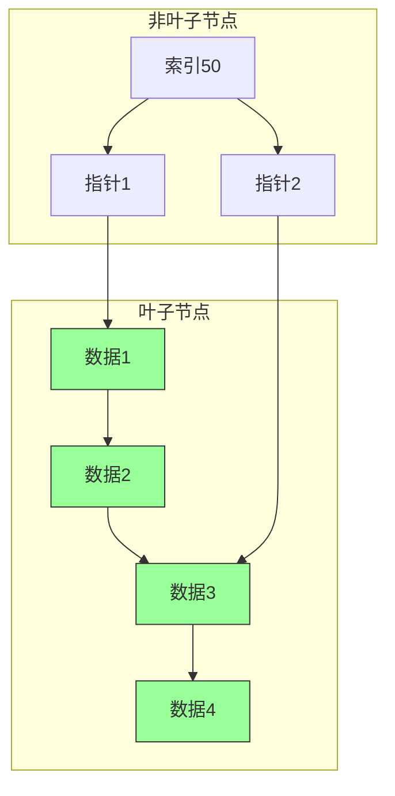
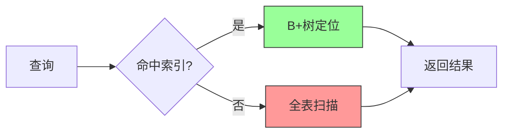

# MySQL B+树

## 一、核心概念

### 1.1 什么是B+树？

B+树是MySQL InnoDB引擎的索引结构，核心目标是「减少磁盘IO次数」。

**通俗类比**：把B+树想象成「图书馆的分类目录+书架」：

- **非叶子节点** = 目录册（只存索引键+指向子节点的指针，不存实际数据）
- **叶子节点** = 书架上的正文书（存实际数据，且所有叶子节点通过双向链表连接）

### 1.2 B+树的核心结构

## 二、影响B+树性能的核心因素

### 2.1 基础硬件因素

| 硬件 | 影响 |
|------|------|
| SSD vs HDD | NVMe SSD下单点查询仅需1-2次磁盘IO |
| 内存大小 | Buffer Pool越大，缓存越多，查询越快 |

### 2.2 数据结构设计因素

#### 行数据大小

| 行大小 | 每页行数 | 1000万行叶子页数 |
|--------|----------|------------------|
| 1KB | 16行 | 62.5万个 |
| 8KB | 2行 | 500万个 |

**优化建议**：

- 避免表中存放超大字段（如TEXT）
- 利用InnoDB溢出页特性
- MySQL 8.4+支持动态页大小

#### 索引设计

- 过度建索引会导致性能下降30%以上
- 索引选择性差会导致扫描效率低
- 分区表的主键必须包含分区键

#### 数据碎片化

- 碎片化率≥30%时，查询效率下降50%以上
- 定期使用OPTIMIZE TABLE重建表

### 2.3 业务操作因素

- **读写并发**：高并发写会触发B+树页分裂/合并，导致锁竞争
- **查询类型**：B+树对「单点查询、范围查询」友好，对「模糊查询」低效

## 三、B+树性能与数据量的关系

| 数据量 | B+树高度 | 磁盘IO次数 |
|--------|----------|------------|
| 100万行 | 2-3层 | 2-3次 |
| 1000万行 | 3层 | 3次 |
| 1亿行 | 3-4层 | 3-4次 |

## 四、优化方案：分区表

### 分区表核心逻辑

把一张大表的B+树拆成多个独立的「子B+树」，每个子B+树数据量控制在百万级。

### 常见分区类型

| 类型 | 说明 |
|------|------|
| RANGE | 按数值/时间范围划分 |
| LIST | 按离散值划分 |
| HASH | 均匀分散数据 |

>