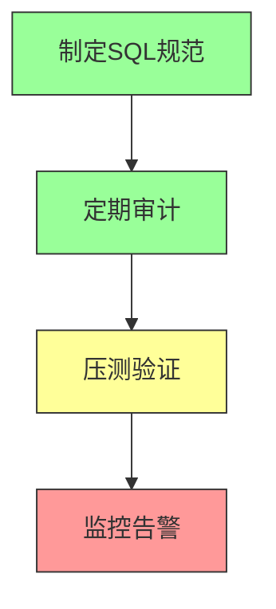

# MySQL慢SQL优化全攻略

## 一、精准定位慢SQL

### 1. 开启慢查询日志

```sql
-- 临时开启
SET GLOBAL slow_query_log = 1;
SET GLOBAL long_query_time = 1;
SET GLOBAL log_queries_not_using_indexes = 1;
```

### 2. 分析慢查询日志

```bash
# 按执行时间排序，取前10条
mysqldumpslow -s t -t 10 /var/lib/mysql/slow.log

# 按查询次数排序，取前10条
mysqldumpslow -s c -t 10 /var/lib/mysql/slow.log
```

## 二、分析慢SQL根因

### EXPLAIN核心字段

| 字段 | 说明 | 优化目标 |
|------|------|----------|
| type | 访问类型 | 至少range，避免ALL |
| key | 实际索引 | 非NULL |
| rows | 扫描行数 | 越小越好 |
| Extra | 额外信息 | 避免Using filesort/temporary |

### 常见问题

```sql
-- 全表扫描
EXPLAIN SELECT * FROM user WHERE name = 'tom';
-- type=ALL, key=NULL

-- 排序未走索引
EXPLAIN SELECT * FROM user ORDER BY name;
-- Extra=Using filesort
```

## 三、针对性优化

### 1. SQL写法优化

```sql
-- ❌ 错误：SELECT *
SELECT * FROM user WHERE id IN (1,2,3)

-- ✅ 正确：只查需要的字段
SELECT id, name FROM user WHERE id IN (1,2,3)

-- ❌ 错误：索引字段做函数操作
SELECT * FROM orders WHERE DATE(create_time) = '2026-01-01'

-- ✅ 正确：直接比较
SELECT * FROM orders WHERE create_time >= '2026-01-01' AND create_time < '2026-01-02'

-- ❌ 错误：子查询
SELECT * FROM order WHERE user_id IN (SELECT id FROM user WHERE age>18)

-- ✅ 正确：JOIN
SELECT o.* FROM order o JOIN user u ON o.user_id = u.id WHERE u.age>18
```

### 2. 索引优化

```sql
-- 最左前缀原则
-- 查询 WHERE a=1 AND b=2 AND c=3
-- 建索引 (a,b,c)，而非单独的a/b/c

-- 覆盖索引
-- 查询 id, name FROM user WHERE code='123456'
-- 建索引 (code, name)
```

### 3. 表结构优化

| 优化方式 | 说明 |
|----------|------|
| 反范式设计 | 订单表存用户名，减少JOIN |
| 水平分表 | 按时间/用户ID拆分 |
| 垂直分表 | 拆分大字段 |

## 四、验证优化效果

```sql
SET profiling = 1;
SELECT id, name FROM user WHERE code='123456';
SHOW PROFILES;
```

## 五、长期预防



1. 禁止SELECT *
2. 禁止大表全表扫描
3. 禁止索引字段做函数操作

> 


---

# MySQL慢SQL全流程优化

## 一、定位慢SQL

### 1. 开启慢查询日志

```sql
SET GLOBAL slow_query_log = 1;
SET GLOBAL long_query_time = 1;
```

### 2. 分析日志

```bash
mysqldumpslow -s t -t 10 /var/lib/mysql/slow.log
```

## 二、分析执行计划

### EXPLAIN用法

```sql
EXPLAIN SELECT * FROM orders WHERE user_id = 123;
```

### 核心字段

- **type**：访问类型
- **key**：使用的索引
- **rows**：扫描行数
- **Extra**：额外信息

## 三、优化策略

### 1. 优化SQL写法

- 避免SELECT *
- 避免索引字段做函数操作
- 用JOIN替代子查询

### 2. 优化索引

- 遵循最左前缀原则
- 使用覆盖索引

### 3. 调整表结构

- 垂直分表
- 水平分表

## 四、验证优化

```sql
SET profiling = 1;
SHOW PROFILES;
```

>