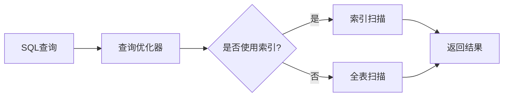

# 数据库

> MySQL 性能优化与数据库原理

---

## 🗄️ MySQL优化

| 主题 | 说明 | 链接 |
|------|------|------|
| 慢SQL优化全攻略 | 定位到预防的完整流程 | [查看 →](MySQLB+树.md) |
| 慢SQL全流程优化 | 从定位到验证 | [查看 →](MySQLB+树.md) |
| B+树索引原理 | 数据结构深度解析 | [查看 →](MySQLB+树.md) |

---

## 📊 核心概念

