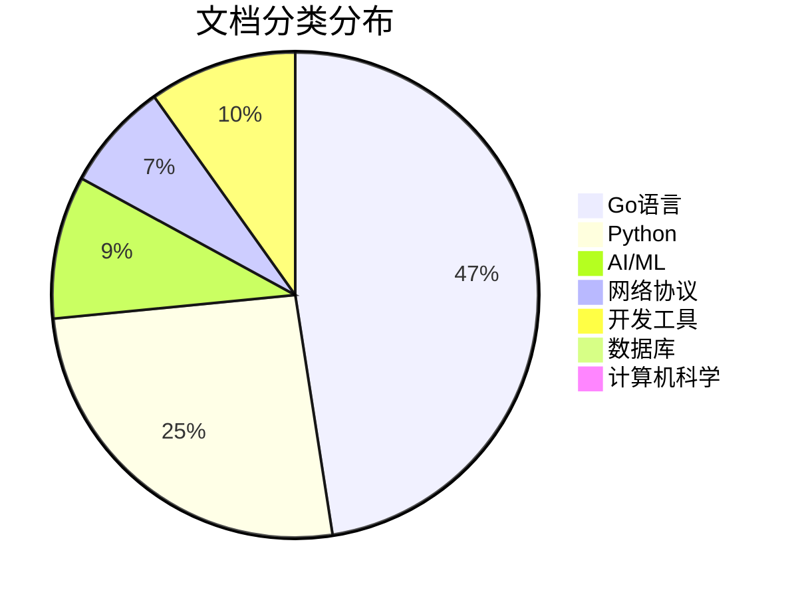
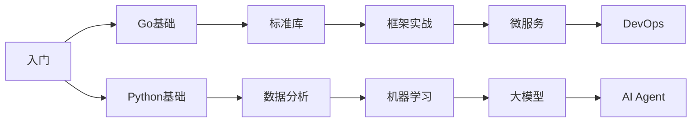

# 个人知识库   

> 🎯 20年资深程序员的技术知识库

---

## 📖 内容概览

### 一、编程语言

#### Go语言

| 分类 | 主要内容 |
|------|----------|
| **标准库** | fmt、errors、strings、bytes、strconv、context、sync、io、os等核心模块 |
| **框架实战** | Gin、GORM、gRPC、Echo、go-zero等主流框架 |
| **进阶专题** | Map、Struct、并发编程、性能优化、编译原理 |

**🌟 重点推荐**

| 图标 | 文档 | 简介 |
|:---:|------|------|
| 📚 | [Go标准库完全索引](lang/go/index.md) | Go语言标准库总览 |
| 🗺️ | [Go语言Map深度解析](lang/go/Go语言Map.md) | 底层原理与最佳实践 |
| 📦 | [Go语言Struct深度解析](lang/go/Go语言Struct.md) | 结构体设计与使用 |
| 🔒 | [sync同步原语完全指南](lang/go/07-sync-同步原语.md) | 并发控制核心技术 |

#### Python

| 分类 | 主要内容 |
|------|----------|
| **标准库** | collections、datetime、json、os、pathlib等 |
| **数据分析** | Pandas、NumPy数据处理 |
| **Web框架** | Django、Flask开发实战 |
| **工具库** | Requests、各种实用工具 |

**🌟 重点推荐**

| 图标 | 文档 | 简介 |
|:---:|------|------|
| 🐍 | [Requests库完全指南](lang/python/01_Requests库.md) | HTTP客户端实战 |
| 📊 | [Pandas数据分析完全指南](lang/python/02_Pandas数据.md) | 数据处理利器 |
| 🌶️ | [Flask微框架完全指南](lang/python/05_Flask微框架.md) | 轻量级Web开发 |

---

### 二、AI与机器学习

| 专题 | 说明 |
|------|------|
| **大模型基础** | LLM原理、Transformer架构、行业格局 |
| **AI Agent** | 智能代理系统设计、Skill系统、CoT思维链 |
| **机器学习算法** | 线性回归、推荐算法等经典算法 |
| **工程实践** | AutoGen、大模型应用开发 |

**🌟 重点推荐**

| 图标 | 文档 | 简介 |
|:---:|------|------|
| 🤖 | [大模型入门指南](AI/大模型入门指南.md) | LLM零基础入门 |
| 🧠 | [AI Agent深度解析](AI/大模型Agent.md) | 智能代理系统设计 |
| 🔗 | [CoT思维链完全解析](AI/大模型思维链CoT.md) | 链式推理方法 |
| 🔄 | [AutoGen完全指南](AI/AutoGen.md) | 多Agent对话系统 |

---

### 三、网络协议

| 协议类型 | 内容 |
|----------|------|
| **HTTP系列** | HTTP/2、HTTP/3、HTTPS |
| **RPC框架** | gRPC原理与实践 |
| **流媒体** | RTSP协议详解 |
| **前沿技术** | IPv8、区块链、WebSocket等 |

**🌟 重点推荐**

| 图标 | 文档 | 简介 |
|:---:|------|------|
| 🌐 | [HTTP/2协议深度解析](protocols/HTTP2协议.md) | 多路复用与头部压缩 |
| ⚡ | [HTTP/3协议深度解析](protocols/HTTP-3协议.md) | QUIC协议与UDP传输 |
| 🔗 | [gRPC深度解析](protocols/gRPC.md) | 高性能RPC框架 |
| 🌍 | [IPv8深度解析](protocols/IPv8.md) | 去中心化网络技术 |

---

### 四、开发工具

| 分类 | 内容 |
|------|------|
| **DevOps** | Docker、Kubernetes、Linux |
| **版本控制** | Git完全指南 |
| **调试工具** | Wireshark抓包分析 |
| **文档工具** | Mermaid、PlantUML |
| **其他工具** | Jenkins、日志库等 |

**🌟 重点推荐**

| 图标 | 文档 | 简介 |
|:---:|------|------|
| 🐳 | [Docker入门完全指南](tools/Docker.md) | 容器化部署基础 |
| ☸️ | [Kubernetes入门](tools/Kubernetes.md) | 容器编排实战 |
| 🐧 | [Linux入门完全指南](tools/Linux.md) | 系统管理技能 |
| 📤 | [Git入门完全指南](tools/GitHub入门版本控制.md) | 版本控制核心 |

---

### 五、数据库与计算机科学

| 分类 | 内容 |
|------|------|
| **数据库** | MySQL慢SQL优化、B+树索引原理 |
| **计算机科学** | 计算机组成原理、数学基础、声音原理 |

**🌟 重点推荐**

| 图标 | 文档 | 简介 |
|:---:|------|------|
| 🗄️ | [MySQL慢SQL优化全攻略](database/MySQLB+树.md) | 性能调优实战 |
| 🌲 | [MySQL B+树索引原理](database/MySQLB+树.md) | 索引结构深度解析 |
| 💻 | [计算机组成完全指南](science/computer-components-complete.md) | 硬件原理基础 |

---

### 📊 统计概览

---

## 🔥 热门专题

### 🐹 Go语言标准库详解

深入剖析Go语言标准库的核心模块，从基础到高级。

| 系列 | 文档 | 简介 |
|------|------|------|
| **并发编程** | [context-上下文管理完全指南](lang/go/06-context-上下文管理.md) | 理解context的作用与最佳实践 |
| | [sync-同步原语完全指南](lang/go/07-sync-同步原语.md) | Mutex、RWMutex、WaitGroup等 |
| | [sync-atomic-原子操作完全指南](lang/go/08-sync-atomic-原子操作.md) | 无锁编程技术 |
| **网络编程** | [net-http.md](lang/go/net-http.md) | HTTP客户端与服务端实现 |
| | [net-url.md](lang/go/net-url.md) | URL解析与处理 |
| | [net-rpc.md](lang/go/net-rpc.md) | 原生RPC实现 |
| **数据处理** | [encoding-json-package.md](lang/go/go-encoding-json-package.md) | JSON编解码深度解析 |
| | [反射机制详解](lang/go/golang-reflection.md) | 反射机制详解 |
| | [maps-package.md](lang/go/go-maps-package.md) | Map操作技巧 |

---

### 🤖 AI与大模型实战

探索人工智能前沿技术，从LLM基础到Agent系统设计。

| 系列 | 文档 | 简介 |
|------|------|------|
| **大模型入门** | [大模型入门指南](AI/大模型入门指南.md) | 零基础入门LLM |
| | [大模型入门深度解析](AI/大模型.md) | 原理与实践结合 |
| | [大模型常识深度解析](AI/大模型常识.md) | 行业格局分析 |
| **进阶应用** | [大模型Agent](AI/大模型Agent.md) | Agent系统架构设计 |
| | [大模型Skill](AI/大模型Skill.md) | 技能系统构建 |
| | [大模型思维链CoT完全解析](AI/大模型思维链CoT.md) | 链式推理方法 |

---

### 🌐 网络协议深度解析

从HTTP/1到HTTP/3，深入理解网络协议原理。

| 系列 | 文档 | 简介 |
|------|------|------|
| **HTTP协议族** | [HTTP2协议](protocols/HTTP2协议.md) | 多路复用、头部压缩、服务器推送 |
| | [HTTP-3协议深度解析](protocols/HTTP-3协议.md) | QUIC协议、UDP传输、0-RTT连接 |
| | [HTTPS](protocols/HTTPS.md) | TLS握手、证书验证、加密套件 |
| **前沿技术** | [IPv8深度解析](protocols/IPv8.md) | 去中心化网络、Kademlia算法 |
| | [区块链技术全景](protocols/HTTP2协议.md) | 分布式账本、共识机制 |

---

### 🐳 DevOps实战指南

掌握现代运维技术，提升工程效率。

| 系列 | 文档 | 简介 |
|------|------|------|
| **容器技术** | [Docker入门完全指南](tools/Docker.md) | 镜像构建、容器编排、网络配置 |
| | [Kubernetes入门](tools/Kubernetes.md) | Pod、Service、Deployment、Ingress |
| **系统管理** | [Linux入门完全指南](tools/Linux.md) | 文件系统、进程管理、权限控制 |

---

## 📊 学习路径

