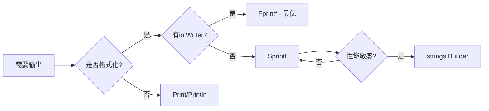

# fmt完全指南

## 📖 包简介

如果说Go语言有一个包是你从"Hello World"第一天就开始用的，那绝对是`fmt`包。作为Go标准库中最基础、最高频的I/O格式化包，`fmt`承担了格式化输出、解析输入、错误构造等核心职责。

无论你是打印调试信息、构造日志输出，还是格式化文件内容，`fmt`包都是你的不二之选。它基于`io`接口构建，提供了一套统一的格式化API，支持各种占位符和格式化选项。

但你可能不知道，`fmt`包里藏着不少"黑科技"。比如Go 1.26对`fmt.Errorf`做了重大优化，让纯字符串调用的内存分配行为与`errors.New`一致——这意味着什么？我们后面细说！

## 🎯 核心功能概览

`fmt`包主要提供三大类功能：

| 功能类别 | 核心函数 | 说明 |
|:---|:---|:---|
| **格式化输出** | `Printf`, `Sprintf`, `Fprintf` | 格式化到stdout/字符串/io.Writer |
| **格式化输入** | `Scanf`, `Sscanf`, `Fscanf` | 从stdin/字符串/io.Reader解析 |
| **便捷打印** | `Print`, `Println`, `Fprint` | 不带格式化的快速输出 |
| **错误构造** | `Errorf` | 格式化生成error类型 |

### 常用占位符速查

```
%v    值的默认格式
%+v   结构体字段名+值
%#v   Go语法表示
%T    类型
%d    十进制整数
%s    字符串
%f    浮点数
%p    指针
%%    字面量%
```

## 💻 实战示例

### 示例1：基础用法

```go
package main

import "fmt"

type User struct {
	Name string
	Age  int
}

func main() {
	// 基础打印
	name := "Gopher"
	age := 15

	fmt.Printf("Hello, %s! You are %d years old.\n", name, age)

	// Sprintf 返回字符串
	msg := fmt.Sprintf("User: %s, Age: %d", name, age)
	fmt.Println(msg)

	// 结构体格式化
	user := User{Name: "Alice", Age: 28}
	fmt.Printf("默认: %v\n", user)       // {Alice 28}
	fmt.Printf("详细: %+v\n", user)      // {Name:Alice Age:28}
	fmt.Printf("Go语法: %#v\n", user)    // main.User{Name:"Alice", Age:28}
	fmt.Printf("类型: %T\n", user)       // main.User

	// 数字格式化
	pi := 3.1415926
	fmt.Printf("保留2位: %.2f\n", pi)    // 3.14
	fmt.Printf("科学计数: %e\n", pi)     // 3.141593e+00
	fmt.Printf("宽度8右对齐: %8.2f\n", pi) //     3.14
}
```

### 示例2：进阶用法——自定义格式化

```go
package main

import (
	"fmt"
	"strings"
)

// 实现 fmt.Formatter 接口自定义输出
type Money struct {
	Amount float64
	Currency string
}

// Format 实现 fmt.Formatter 接口
func (m Money) Format(f fmt.State, verb rune) {
	switch verb {
	case 'v':
		// 检查是否使用 %+v
		if f.Flag('+') {
			fmt.Fprintf(f, "%s%.2f (%s)", currencySymbol(m.Currency), m.Amount, m.Currency)
		} else {
			fmt.Fprintf(f, "%s%.2f", currencySymbol(m.Currency), m.Amount)
		}
	case 's':
		fmt.Fprintf(f, "%s%.2f", currencySymbol(m.Currency), m.Amount)
	case 'f':
		// 支持精度控制
		prec, ok := f.Precision()
		if !ok {
			prec = 2
		}
		fmt.Fprintf(f, "%s%.*f", currencySymbol(m.Currency), prec, m.Amount)
	default:
		fmt.Fprintf(f, "%%!%c(%s=%s)", verb, "Money", m.Currency)
	}
}

func currencySymbol(currency string) string {
	symbols := map[string]string{
		"USD": "$", "CNY": "¥", "EUR": "€", "JPY": "¥",
	}
	if sym, ok := symbols[currency]; ok {
		return sym
	}
	return currency + " "
}

func main() {
	salary := Money{Amount: 15000.50, Currency: "CNY"}
	
	fmt.Printf("%v\n", salary)      // ¥15000.50
	fmt.Printf("%+v\n", salary)     // ¥15000.50 (CNY)
	fmt.Printf("%.3f\n", salary)    // ¥15000.500
}

// Go 1.26新增：实现 fmt.Stringer 的更高效写法
type Config struct {
	settings map[string]string
}

// String 实现 fmt.Stringer 接口
// Go 1.26优化：使用 strings.Builder 而非字符串拼接
func (c *Config) String() string {
	var sb strings.Builder
	sb.WriteString("Config{")
	first := true
	for k, v := range c.settings {
		if !first {
			sb.WriteString(", ")
		}
		fmt.Fprintf(&sb, "%s=%q", k, v)
		first = false
	}
	sb.WriteString("}")
	return sb.String()
}
```

### 示例3：最佳实践——高性能日志构造

```go
package main

import (
	"fmt"
	"io"
	"os"
	"sync"
)

// SafeLogger 线程安全的高性能日志记录器
type SafeLogger struct {
	mu sync.Mutex
	w  io.Writer
}

func NewLogger(w io.Writer) *SafeLogger {
	return &SafeLogger{w: w}
}

// Log 线程安全的日志写入
func (l *SafeLogger) Log(level, msg string, args ...any) {
	l.mu.Lock()
	defer l.mu.Unlock()
	
	// 使用 Fprintf 直接写入 io.Writer，避免中间字符串分配
	fmt.Fprintf(l.w, "[%-5s] ", level)
	if len(args) > 0 {
		fmt.Fprintf(l.w, msg, args...)
	} else {
		fmt.Fprint(l.w, msg)
	}
	fmt.Fprintln(l.w)
}

// Go 1.26优化示范
func go126OptimizationDemo() {
	// 在Go 1.26之前:
	// fmt.Errorf("something went wrong") 
	// 总是会分配内存存储格式化字符串
	
	// Go 1.26之后:
	// fmt.Errorf("something went wrong")
	// 当没有格式化参数时，行为等同于 errors.New()
	// 不逃逸时: 0 次堆分配
	// 逃逸时: 1 次堆分配 (与 errors.New 一致)
	
	err1 := fmt.Errorf("connection failed") // Go 1.26: 零开销！
	
	// 带参数的仍然正常分配
	host := "db.example.com"
	err2 := fmt.Errorf("failed to connect to %s", host)
	
	fmt.Println(err1)
	fmt.Println(err2)
}

func main() {
	// 使用示例
	logger := NewLogger(os.Stdout)
	logger.Log("INFO", "Server started on port %d", 8080)
	logger.Log("ERROR", "Database connection timeout")
	
	go126OptimizationDemo()
}
```

## ⚠️ 常见陷阱与注意事项

### 1. `%v` vs `%+v` vs `%#v` 混用
```go
// ❌ 调试时用%v看不到字段名
fmt.Printf("%v\n", user)  // {Alice 28} — 字段多了根本分不清

// ✅ 调试时用%+v
fmt.Printf("%+v\n", user) // {Name:Alice Age:28} — 一目了然
```

### 2. Printf参数数量不匹配
```go
// ❌ 编译不报错，运行时输出%!v(MISSING)
fmt.Printf("Hello %s %s", name) 

// ✅ 使用 go vet 检查
// go vet 会捕获此类错误
```

### 3. Sprintf vs Fprintf 的性能陷阱
```go
// ❌ 先Sprintf再写入，多一次字符串分配
w.WriteString(fmt.Sprintf("value: %d\n", x))

// ✅ 直接Fprintf，零中间分配
fmt.Fprintf(w, "value: %d\n", x)
```

### 4. 忘记处理Scan的错误
```go
// ❌ 不检查返回值
fmt.Scanf("%d", &n)

// ✅ 始终检查
n, err := fmt.Scanf("%d", &value)
if err != nil {
    // 处理解析错误
}
```

### 5. Println的自动换行坑
```go
// ❌ Println自动加换行，可能重复
fmt.Println("Hello\n") // 输出: Hello + 两个换行

// ✅ 用Print手动控制
fmt.Print("Hello\n")
```

## 🚀 Go 1.26新特性

### fmt.Errorf 零分配优化

这是Go 1.26中`fmt`包最重要的改进：

```go
// Go 1.25及之前
err := fmt.Errorf("timeout")
// 总是分配内存存储错误字符串

// Go 1.26
err := fmt.Errorf("timeout")
// 当没有格式化参数时，行为与 errors.New("timeout") 一致
// 不逃逸: 0次堆分配
// 逃逸: 1次堆分配
```

**性能对比**：

| 场景 | Go 1.25 | Go 1.26 | 提升 |
|:---|:---|:---|:---|
| `fmt.Errorf("msg")` | 1 alloc | 0 alloc | **∞** |
| `fmt.Errorf("msg %s", v)` | 1 alloc | 1 alloc | 持平 |

这个优化由编译器自动完成，无需修改代码，升级Go版本即可享受性能提升！

## 📊 性能优化建议

### 输出方式性能对比

```
Fprintf(直接写入)  ████████████████████  最快，0中间分配
Print/Fprintln      ████████████████    快，少量分配  
Sprintf+Write       ██████████          中等，额外字符串分配
fmt.Println         ████████            较慢，类型反射
```

1. **优先使用`Fprintf`**：直接写入`io.Writer`，避免中间字符串
2. **大量拼接用`strings.Builder`**：比`fmt.Sprintf`快3-5倍
3. **Go 1.26用户放心用`Errorf`**：纯字符串调用已优化
4. **禁用反射场景用`%d/%s`**：比`%v`快约20%



## 🔗 相关包推荐

| 包 | 说明 |
|:---|:---|
| `errors` | 错误处理，配合`fmt.Errorf`使用`%w`包装错误 |
| `log` | 日志包，内部使用`fmt`进行格式化 |
| `log/slog` | Go 1.21+结构化日志，更现代的日志方案 |
| `io` | I/O接口，`fmt.Fprintf`的目标类型 |
| `strings` | 字符串操作，高性能字符串拼接 |

---