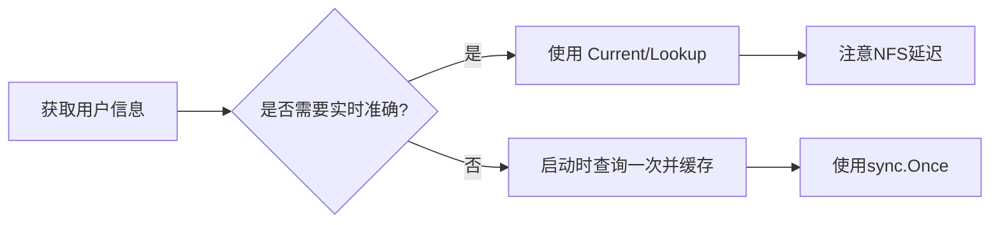

#  os/user 完全指南

新手也能秒懂的Go标准库教程!从基础到实战,一文打通!

## 📖 包简介

在日常开发中,你有没有遇到过这样的场景:程序需要根据当前运行用户调整行为?比如,判断是不是root用户、获取用户家目录来存放配置文件、或者在多用户环境下做权限隔离?

`os/user` 包就是为解决这些问题而生的。它提供了一个跨平台的方式来查询当前系统用户的信息,包括用户名、UID、GID、家目录等。虽然它看起来是个"小"包,但在构建CLI工具、服务启动脚本、权限校验等场景下,它可是不可或缺的好帮手。

值得一提的是,`os/user` 在不同操作系统上的实现细节有所不同。Linux下通过读取 `/etc/passwd` 文件,而Windows和macOS则使用各自系统的API。这种跨平台的一致性封装,正是Go标准库的优雅之处。

## 🎯 核心功能概览

| 类型/函数 | 说明 |
|-----------|------|
| `user.User` | 用户信息结构体,包含Uid、Gid、Username、Name、HomeDir |
| `user.Group` | 用户组信息结构体,包含Gid、Name |
| `user.Current()` | 获取当前执行程序的用户 |
| `user.Lookup(username)` | 根据用户名查找用户 |
| `user.LookupId(uid)` | 根据UID查找用户 |
| `user.LookupGroup(name)` | 根据组名查找用户组 |
| `user.LookupGroupId(gid)` | 根据GID查找用户组 |

## 💻 实战示例

### 示例1: 获取当前用户信息

```go
package main

import (
	"fmt"
	"log"
	"os/user"
)

func main() {
	// 获取当前用户
	current, err := user.Current()
	if err != nil {
		log.Fatalf("获取当前用户失败: %v", err)
	}

	fmt.Println("=== 当前用户信息 ===")
	fmt.Printf("用户名:    %s\n", current.Username)
	fmt.Printf("显示名称:  %s\n", current.Name)
	fmt.Printf("用户ID:    %s\n", current.Uid)
	fmt.Printf("组ID:      %s\n", current.Gid)
	fmt.Printf("家目录:    %s\n", current.HomeDir)
}
```

### 示例2: 权限校验 - 判断是否为root用户

```go
package main

import (
	"fmt"
	"log"
	"os"
	"os/user"
)

// RequireRoot 检查当前用户是否为root,不是则退出
func RequireRoot() {
	current, err := user.Current()
	if err != nil {
		log.Fatalf("获取用户信息失败: %v", err)
	}

	// Unix系统root的UID是"0"
	if current.Uid != "0" {
		fmt.Fprintf(os.Stderr, "错误: 此操作需要root权限\n")
		fmt.Fprintf(os.Stderr, "当前用户: %s (UID: %s)\n", current.Username, current.Uid)
		os.Exit(1)
	}

	fmt.Println("✓ root权限校验通过")
}

// LookupUser 根据用户名查找用户信息
func LookupUser(username string) {
	u, err := user.Lookup(username)
	if err != nil {
		fmt.Printf("未找到用户 %s: %v\n", username, err)
		return
	}

	fmt.Printf("用户 %s 信息:\n", username)
	fmt.Printf("  UID: %s, GID: %s\n", u.Uid, u.Gid)
	fmt.Printf("  家目录: %s\n", u.HomeDir)
}

func main() {
	RequireRoot()
	LookupUser("root")
}
```

### 示例3: CLI工具的配置文件路径管理

```go
package main

import (
	"fmt"
	"os"
	"os/user"
	"path/filepath"
)

// ConfigManager 配置管理器
type ConfigManager struct {
	configDir string
	configFile string
}

// NewConfigManager 创建配置管理器
func NewConfigManager(appName string) (*ConfigManager, error) {
	// 优先使用环境变量
	configHome := os.Getenv("XDG_CONFIG_HOME")
	if configHome == "" {
		// 获取当前用户
		usr, err := user.Current()
		if err != nil {
			return nil, fmt.Errorf("获取用户信息失败: %w", err)
		}
		configHome = filepath.Join(usr.HomeDir, ".config")
	}

	return &ConfigManager{
		configDir:  filepath.Join(configHome, appName),
		configFile: filepath.Join(configHome, appName, "config.yaml"),
	}, nil
}

// GetConfigPath 获取配置文件路径
func (cm *ConfigManager) GetConfigPath() string {
	return cm.configFile
}

// EnsureConfigDir 确保配置目录存在
func (cm *ConfigManager) EnsureConfigDir() error {
	return os.MkdirAll(cm.configDir, 0o755)
}

func main() {
	cm, err := NewConfigManager("myapp")
	if err != nil {
		fmt.Printf("创建配置管理器失败: %v\n", err)
		return
	}

	fmt.Printf("配置目录: %s\n", cm.configDir)
	fmt.Printf("配置文件: %s\n", cm.GetConfigPath())

	if err := cm.EnsureConfigDir(); err != nil {
		fmt.Printf("创建配置目录失败: %v\n", err)
	}
}
```

## ⚠️ 常见陷阱与注意事项

1. **CGO依赖问题**: 在某些交叉编译场景下(如 `CGO_ENABLED=0`),`os/user` 可能无法使用,会返回 `user: Current not implemented` 错误。解决方法是启用CGO或使用 `user.LookupId` 的替代实现。

2. **容器环境陷阱**: 在Docker容器中,用户信息可能与宿主机不同。默认Docker以root运行,UID可能为0,但这不代表你的应用应该有特权操作。

3. **跨平台UID/GID差异**: Windows系统下UID/GID是SID字符串格式,不是数字。在编写跨平台代码时,不要假设UID一定是数字格式。

4. **缓存机制**: `os/user` 内部可能会缓存查询结果,如果系统用户信息在程序运行期间发生变化(如LDAP更新),可能获取到的是旧数据。

5. **Name字段可能为空**: 在某些系统配置下,`User.Name`(显示名称)可能为空字符串,不要强依赖这个字段。

## 🚀 Go 1.26新特性

Go 1.26对 `os/user` 包本身没有重大API变更,但有以下间接改进:

- 改进了在某些Linux发行版(如Alpine)上CGO不可用时的回退逻辑,提高了纯静态编译场景下的兼容性
- 修复了在特定网络文件系统(NFS)挂载下用户查询的性能问题
- 优化了Windows平台上SID到用户名的解析缓存策略

## 📊 性能优化建议



**性能对比**:

| 操作 | 耗时(本地) | 耗时(NFS/LDAP) | 建议 |
|------|-----------|---------------|------|
| `user.Current()` | ~50μs | 5-50ms | 启动时缓存 |
| `user.Lookup()` | ~100μs | 10-100ms | 批量查询时合并 |
| 环境变量读取 | ~1μs | ~1μs | 优先使用XDG变量 |

**优化技巧**:

```go
var currentUser *user.User
var currentUserOnce sync.Once

func getcurrentUser() *user.User {
	currentUserOnce.Do(func() {
		currentUser, _ = user.Current()
	})
	return currentUser
}
```

## 🔗 相关包推荐

| 包名 | 用途 |
|------|------|
| `os` | 操作系统功能(文件、权限、环境变量等) |
| `path/filepath` | 跨平台路径处理 |
| `runtime` | 运行时信息(GOOS、GOARCH等) |

---