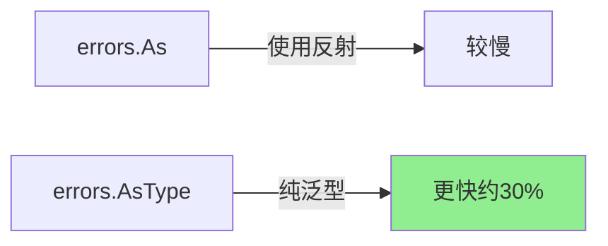

# errors完全指南

## 📖 包简介

在Go语言的世界里，错误处理是一门艺术。而`errors`包，就是这门艺术的核心调色板。从Go 1.13引入错误包装（error wrapping）以来，`errors`包经历了多次进化，到了Go 1.26，它迎来了迄今为止最激动人心的更新——`errors.AsType`泛型函数。

为什么要专门写一篇文章讲错误处理？因为每个Go开发者每天都在和错误打交道，但很多人依然在用"老派"的方式写错误检查代码：层层嵌套的`if err != nil`、手动解包判断类型、甚至用字符串匹配来识别错误类型。

如果你还在用`err.Error() == "some error"`来判断错误类型，那么这篇文章就是为你准备的。Go 1.26的`errors.AsType`将彻底改变你的错误处理写法，让代码更简洁、更安全、更优雅。

## 🎯 核心功能概览

`errors`包虽然小巧，但功能精准：

| 函数/类型 | 版本 | 说明 |
|:---|:---|:---|
| `New(text string) error` | 1.0 | 创建简单错误 |
| `Is(err, target error) bool` | 1.13 | 错误值匹配（支持解包） |
| `As(err error, target any) bool` | 1.13 | 错误类型断言（支持解包） |
| `Unwrap(err error) error` | 1.13 | 解包错误 |
| `Join(errs ...error) error` | 1.20 | 合并多个错误 |
| **`AsType[E error](err error) (E, bool)`** | **1.26** | **泛型版错误类型断言** |

### 错误包装链

```
外层错误 (fmt.Errorf("%w", inner))
    ↓ Unwrap
中间层错误
    ↓ Unwrap
根本原因错误 (errors.New)
```

## 💻 实战示例

### 示例1：基础用法

```go
package main

import (
	"errors"
	"fmt"
)

//  sentinel 错误
var (
	ErrNotFound     = errors.New("resource not found")
	ErrUnauthorized = errors.New("unauthorized access")
	ErrTimeout      = errors.New("operation timed out")
)

func main() {
	// 1. 创建错误
	err := errors.New("something went wrong")
	fmt.Println(err) // something went wrong

	// 2. 错误比较 - 使用 Is 而非 ==
	err1 := ErrNotFound
	if errors.Is(err1, ErrNotFound) {
		fmt.Println("Resource not found!")
	}

	// 3. 错误包装与解包
	wrapped := fmt.Errorf("failed to query: %w", ErrNotFound)
	
	// Is 可以穿透包装链
	fmt.Println(errors.Is(wrapped, ErrNotFound)) // true
	
	// Unwrap 获取内层错误
	inner := errors.Unwrap(wrapped)
	fmt.Println(inner == ErrNotFound) // true
}
```

### 示例2：自定义错误类型 + As

```go
package main

import (
	"errors"
	"fmt"
	"net/http"
)

// 自定义错误类型，携带更多信息
type APIError struct {
	StatusCode int
	Message    string
	Retryable  bool
}

func (e *APIError) Error() string {
	return fmt.Sprintf("API error %d: %s", e.StatusCode, e.Message)
}

// 实现 Unwrap 支持错误链
type DatabaseError struct {
	Table  string
	Reason string
	Err    error
}

func (e *DatabaseError) Error() string {
	return fmt.Sprintf("db error on table %s: %s", e.Table, e.Reason)
}

func (e *DatabaseError) Unwrap() error {
	return e.Err
}

// 传统方式 - 容易踩坑！
func oldWay(err error) {
	// ❌ 常见陷阱：必须传指针的指针，否则panic
	var apiErr *APIError
	if errors.As(err, &apiErr) {
		fmt.Printf("Status: %d, Message: %s\n", apiErr.StatusCode, apiErr.Message)
	}
}

func main() {
	// 构造深层错误
	err := &DatabaseError{
		Table: "users",
		Reason: "connection lost",
		Err: &APIError{
			StatusCode: http.StatusServiceUnavailable,
			Message:    "database unavailable",
			Retryable:  true,
		},
	}

	// 传统方式
	oldWay(err)

	// Go 1.26: AsType 方式
	// ✅ 不需要声明变量，不需要传指针，不会panic
	if apiErr, ok := errors.AsType[*APIError](err); ok {
		fmt.Printf("[Go 1.26] Status: %d, Retryable: %v\n", 
			apiErr.StatusCode, apiErr.Retryable)
	}

	// 支持链式查找
	if dbErr, ok := errors.AsType[*DatabaseError](err); ok {
		fmt.Printf("[Go 1.26] Table: %s, Reason: %s\n", 
			dbErr.Table, dbErr.Reason)
	}
}
```

### 示例3：最佳实践——生产级错误处理

```go
package main

import (
	"errors"
	"fmt"
)

// 业务错误定义
var (
	ErrUserNotFound    = errors.New("user not found")
	ErrInvalidPassword = errors.New("invalid password")
	ErrAccountLocked   = errors.New("account is locked")
)

type ValidationError struct {
	Field   string
	Message string
}

func (e *ValidationError) Error() string {
	return fmt.Sprintf("validation failed on %s: %s", e.Field, e.Message)
}

type RetryableError struct {
	Err     error
	Attempt int
}

func (e *RetryableError) Error() string {
	return fmt.Sprintf("retryable error (attempt %d): %v", e.Attempt, e.Err)
}

func (e *RetryableError) Unwrap() error {
	return e.Err
}

// 业务函数
func Authenticate(username, password string) error {
	if username == "" {
		return &ValidationError{Field: "username", Message: "cannot be empty"}
	}
	if username == "locked_user" {
		return fmt.Errorf("auth failed: %w", ErrAccountLocked)
	}
	if password != "secret" {
		return fmt.Errorf("auth failed: %w", ErrInvalidPassword)
	}
	return nil
}

// Go 1.26: 使用 AsType 的优雅错误处理
func HandleError(err error) string {
	if err == nil {
		return "success"
	}

	// 优先检查 sentinel 错误
	switch {
	case errors.Is(err, ErrUserNotFound):
		return "用户不存在"
	case errors.Is(err, ErrInvalidPassword):
		return "密码错误"
	case errors.Is(err, ErrAccountLocked):
		return "账户已被锁定"
	}

	// Go 1.26: 使用 AsType 处理自定义错误
	// 检查是否是验证错误
	if ve, ok := errors.AsType[*ValidationError](err); ok {
		return fmt.Sprintf("字段 %s 验证失败: %s", ve.Field, ve.Message)
	}

	// 检查是否是可重试错误
	if re, ok := errors.AsType[*RetryableError](err); ok {
		return fmt.Sprintf("操作失败(第%d次尝试): %v", re.Attempt, re.Err)
	}

	// 兜底
	return fmt.Sprintf("未知错误: %v", err)
}

// Go 1.26: 错误合并处理
func batchProcess(items []string) error {
	var errs []error
	
	for _, item := range items {
		if err := processItem(item); err != nil {
			errs = append(errs, fmt.Errorf("item %q: %w", item, err))
		}
	}
	
	// Go 1.20+ 的 errors.Join
	if len(errs) > 0 {
		return fmt.Errorf("batch processing failed: %w", errors.Join(errs...))
	}
	return nil
}

func processItem(item string) error {
	if item == "bad" {
		return errors.New("invalid item")
	}
	return nil
}

func main() {
	// 测试各种错误
	fmt.Println(HandleError(nil))
	fmt.Println(HandleError(ErrInvalidPassword))
	fmt.Println(HandleError(&ValidationError{Field: "email", Message: "invalid format"}))
	
	// 包装错误也能正确识别
	wrappedErr := fmt.Errorf("login failed: %w", ErrAccountLocked)
	fmt.Println(HandleError(wrappedErr))
	
	// 批量处理
	batchErr := batchProcess([]string{"good", "bad", "also_bad"})
	if batchErr != nil {
		fmt.Printf("Batch error: %v\n", batchErr)
	}
}
```

## ⚠️ 常见陷阱与注意事项

### 1. errors.As 的指针陷阱（Go 1.26已解决）

```go
// ❌ 常见错误：忘记传指针，运行时panic
var apiErr APIError  // 值类型
errors.As(err, &apiErr) // PANIC!

// ✅ 正确写法：必须是指针
var apiErr *APIError
errors.As(err, &apiErr)

// 🎉 Go 1.26: 不再需要担心这个问题
if apiErr, ok := errors.AsType[*APIError](err); ok {
    // 安全，不会panic
}
```

### 2. 用字符串比较错误

```go
// ❌ 绝对不要这样做
if err.Error() == "not found" { }

// ✅ 使用 sentinel 错误 + Is
if errors.Is(err, ErrNotFound) { }
```

### 3. 错误包装时忘记用 %w

```go
// ❌ 用 %v 包装，Is/As 无法穿透
err := fmt.Errorf("failed: %v", innerErr)

// ✅ 用 %w 包装，支持错误链
err := fmt.Errorf("failed: %w", innerErr)
```

### 4. 过度包装错误

```go
// ❌ 每层都包装，错误信息冗长
// "handler: service: repo: db: not found"

// ✅ 只在有意义的边界包装
// 通常在repository/service层包装即可
```

### 5. 忽略多个错误的场景

```go
// ❌ 只返回第一个错误
for _, item := range items {
    if err := process(item); err != nil {
        return err  // 后续错误丢失
    }
}

// ✅ 使用 errors.Join 合并
var errs []error
for _, item := range items {
    if err := process(item); err != nil {
        errs = append(errs, err)
    }
}
if len(errs) > 0 {
    return errors.Join(errs...)
}
```

## 🚀 Go 1.26新特性

### errors.AsType —— 泛型版错误类型断言

这是Go 1.26 `errors`包的核心更新：

```go
// 函数签名
func AsType[E error](err error) (E, bool)
```

**为什么需要 AsType？**

| 特性 | errors.As | errors.AsType |
|:---|:---|:---|
| 语法 | 需要预先声明变量 | 内联使用 |
| 安全性 | 传值类型会panic | 编译期保证安全 |
| 反射 | 内部使用反射 | 纯泛型，无反射 |
| 性能 | 中等 | **更快** |

**实际对比**：

```go
// Go 1.13-1.25: errors.As
var timeoutErr *TimeoutError
if errors.As(err, &timeoutErr) {
    fmt.Println(timeoutErr.RetryAfter)
}

// Go 1.26: errors.AsType - 更简洁！
if timeoutErr, ok := errors.AsType[*TimeoutError](err); ok {
    fmt.Println(timeoutErr.RetryAfter)
}
```

**性能对比**：



## 📊 性能优化建议

### 错误处理性能排行

| 方式 | 性能 | 说明 |
|:---|:---|:---|
| `err == ErrSentinel` | ████████████████████ | 最快，直接比较 |
| `errors.Is()` | ███████████████ | 快，遍历错误链 |
| `errors.AsType()` | ████████████ | 中等，泛型展开 |
| `errors.As()` | ██████████ | 较慢，使用反射 |
| `type switch` | ████████████████ | 快，但只适用于直接错误 |

### 最佳实践

1. **优先使用 `errors.Is` 检查 sentinel 错误**
2. **Go 1.26项目优先使用 `AsType` 替代 `As`**
3. **用 `%w` 包装错误，保留错误链**
4. **批量处理用 `errors.Join` 聚合错误**

## 🔗 相关包推荐

| 包 | 说明 |
|:---|:---|
| `fmt` | 使用`%w`包装错误，Go 1.26优化了纯字符串Errorf |
| `log/slog` | 结构化日志，记录错误信息 |
| `context` | 配合`context.Canceled`和`context.DeadlineExceeded`使用 |
| `testing` | 测试中的错误断言 |

---