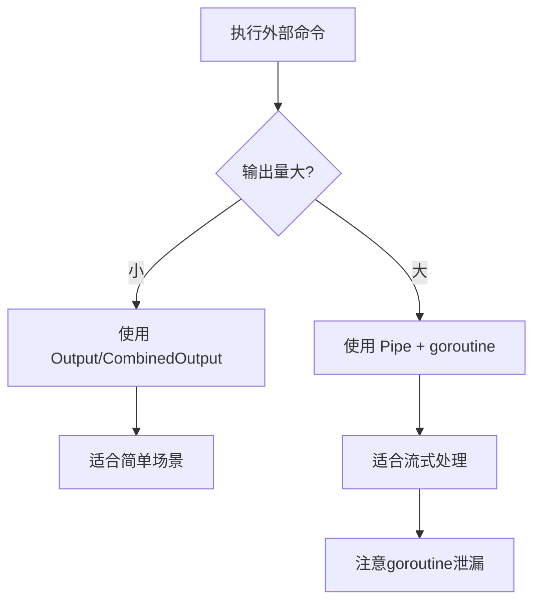

#  os/exec 完全指南

新手也能秒懂的Go标准库教程!从基础到实战,一文打通!

## 📖 包简介

在Go中调用外部命令,就像在厨房里借用邻居的烤箱——你得知道怎么开口、怎么等待、怎么拿到成品。`os/exec` 包就是Go程序与外部命令之间的桥梁。

这个包最常用的场景包括:运行shell脚本、调用系统工具(如git、docker)、执行批处理任务、甚至是启动子进程进行并发处理。它看起来简单,但实际上里面暗藏了不少"坑",比如管道阻塞、僵尸进程、信号处理等。

本文将带你从最基础的用法一路走到高级场景,让你在Go里调用外部命令时游刃有余,不再被各种stderr卡脖子。

## 🎯 核心功能概览

| 类型/函数 | 说明 |
|-----------|------|
| `exec.Command(name, args...)` | 创建命令对象 |
| `exec.CommandContext(ctx, name, args...)` | 支持超时的命令 |
| `cmd.Run()` | 执行并等待完成 |
| `cmd.Output()` | 执行并获取stdout |
| `cmd.CombinedOutput()` | 执行并获取stdout+stderr |
| `cmd.Start() + cmd.Wait()` | 异步执行模式 |
| `exec.LookPath(file)` | 查找可执行文件路径 |

## 💻 实战示例

### 示例1: 基础用法 - 执行ls命令

```go
package main

import (
	"fmt"
	"log"
	"os/exec"
)

func main() {
	// 创建命令
	cmd := exec.Command("ls", "-la", "/tmp")

	// 执行并获取输出
	output, err := cmd.Output()
	if err != nil {
		// 命令执行失败时的错误处理
		if exitErr, ok := err.(*exec.ExitError); ok {
			log.Printf("命令退出码: %d\n", exitErr.ExitCode())
			log.Printf("stderr: %s\n", exitErr.Stderr)
		} else {
			log.Fatalf("执行命令失败: %v", err)
		}
		return
	}

	fmt.Println(string(output))
}
```

### 示例2: 带超时控制 + 实时输出

```go
package main

import (
	"bufio"
	"context"
	"fmt"
	"io"
	"log"
	"os/exec"
	"time"
)

// RunWithTimeout 带超时控制的命令执行
func RunWithTimeout(ctx context.Context, command string, args ...string) error {
	// 使用CommandContext自动处理超时
	cmd := exec.CommandContext(ctx, command, args...)

	// 分别获取stdout和stderr
	stdout, err := cmd.StdoutPipe()
	if err != nil {
		return fmt.Errorf("创建stdout管道失败: %w", err)
	}

	stderr, err := cmd.StderrPipe()
	if err != nil {
		return fmt.Errorf("创建stderr管道失败: %w", err)
	}

	// 启动命令
	if err := cmd.Start(); err != nil {
		return fmt.Errorf("启动命令失败: %w", err)
	}

	// 实时读取输出
	go scanAndPrint(stdout, "STDOUT")
	go scanAndPrint(stderr, "STDERR")

	// 等待完成(受ctx超时控制)
	return cmd.Wait()
}

func scanAndPrint(r io.Reader, label string) {
	scanner := bufio.NewScanner(r)
	for scanner.Scan() {
		fmt.Printf("[%s] %s\n", label, scanner.Text())
	}
}

func main() {
	// 5秒超时
	ctx, cancel := context.WithTimeout(context.Background(), 5*time.Second)
	defer cancel()

	fmt.Println("=== 执行 ping -c 3 127.0.0.1 ===")
	if err := RunWithTimeout(ctx, "ping", "-c", "3", "127.0.0.1"); err != nil {
		if ctx.Err() == context.DeadlineExceeded {
			fmt.Println("命令执行超时!")
		} else {
			fmt.Printf("命令执行失败: %v\n", err)
		}
	}
}
```

### 示例3: 最佳实践 - 安全的命令执行封装

```go
package main

import (
	"bytes"
	"context"
	"fmt"
	"os/exec"
	"strings"
	"time"
)

// CommandResult 命令执行结果
type CommandResult struct {
	ExitCode int
	Stdout   string
	Stderr   string
	Duration time.Duration
}

// Execute 安全地执行命令,带有完整的输出捕获和超时控制
func Execute(ctx context.Context, name string, args ...string) (*CommandResult, error) {
	cmd := exec.CommandContext(ctx, name, args...)

	var stdout, stderr bytes.Buffer
	cmd.Stdout = &stdout
	cmd.Stderr = &stderr

	start := time.Now()
	err := cmd.Run()
	duration := time.Since(start)

	result := &CommandResult{
		Stdout:   strings.TrimSpace(stdout.String()),
		Stderr:   strings.TrimSpace(stderr.String()),
		Duration: duration,
	}

	if err != nil {
		if exitErr, ok := err.(*exec.ExitError); ok {
			result.ExitCode = exitErr.ExitCode()
			return result, nil // 非零退出码不是"错误",由调用方判断
		}
		return result, fmt.Errorf("执行命令失败: %w", err)
	}

	result.ExitCode = 0
	return result, nil
}

func main() {
	ctx, cancel := context.WithTimeout(context.Background(), 10*time.Second)
	defer cancel()

	// 执行git命令
	result, err := Execute(ctx, "git", "log", "--oneline", "-5")
	if err != nil {
		fmt.Printf("执行失败: %v\n", err)
		return
	}

	fmt.Printf("退出码: %d\n", result.ExitCode)
	fmt.Printf("耗时: %v\n", result.Duration)
	fmt.Printf("输出:\n%s\n", result.Stdout)
}
```

## ⚠️ 常见陷阱与注意事项

1. **Output()方法的stderr陷阱**: `cmd.Output()` 只捕获stdout,stderr会直接输出到父进程的标准错误。如果你需要完整的输出信息,请使用 `CombinedOutput()` 或分别设置 `StdoutPipe`/`StderrPipe`。

2. **管道阻塞问题**: 如果你同时使用 `cmd.StdoutPipe()` 和 `cmd.StderrPipe()`,但只读取其中一个,可能导致子进程阻塞。正确做法是使用goroutine并发读取,或直接用 `cmd.Stdout = &stdoutBuf` 设置buffer。

3. **Shell注入攻击**: **永远不要**将用户输入直接拼接到命令中!错误做法:`exec.Command("sh", "-c", "rm -rf "+userInput)`。正确做法是将参数作为独立参数传递:`exec.Command("rm", "-rf", userInput)`。

4. **僵尸进程**: 调用 `cmd.Start()` 后必须调用 `cmd.Wait()`,否则子进程会变成僵尸进程,消耗系统资源。

5. **PATH环境变量**: `exec.Command` 只查找可执行文件名,不会搜索PATH。使用 `exec.LookPath("name")` 来确认可执行文件是否存在。

## 🚀 Go 1.26新特性

Go 1.26 对 `os/exec` 包的改进:

- **增强的错误信息**: `ExitError` 现在包含更详细的错误上下文,包括命令执行的完整环境和资源使用情况,便于调试
- **改进了Windows平台的进程创建**: 修复了在某些Windows版本上 `CommandContext` 超时后进程未正确终止的问题
- **Pipe读取优化**: 优化了 `StdoutPipe`/`StderrPipe` 的缓冲区管理,减少了大输出场景下的内存分配

## 📊 性能优化建议



**选择正确的方法**:

| 方法 | 适用场景 | 内存占用 | 实时性 |
|------|---------|---------|-------|
| `Output()` | 小输出,只需stdout | 低(一次性加载) | 无 |
| `CombinedOutput()` | 小输出,需要stderr | 低(一次性加载) | 无 |
| `StdoutPipe()` | 大输出,流式处理 | 低(按需读取) | 实时 |
| `cmd.Stdout = buffer` | 中等输出,简单API | 中 | 执行后 |

**内存对比示例**(执行输出1MB数据的命令):

```
Output():     分配 ~2MB (输出+内部buffer)
Pipe+Scanner: 分配 ~64KB (scanner缓冲区)
直接WriteTo:  分配 ~0KB (直接管道转发)
```

## 🔗 相关包推荐

| 包名 | 用途 |
|------|------|
| `context` | 超时和取消控制 |
| `io` | I/O操作和管道 |
| `os` | 操作系统接口 |
| `syscall` | 底层系统调用 |

---