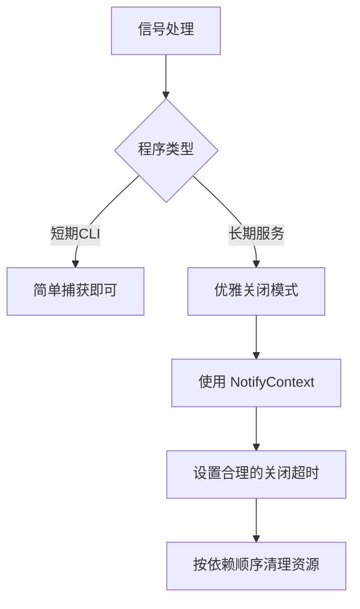

#  os/signal 完全指南

新手也能秒懂的Go标准库教程!从基础到实战,一文打通!

## 📖 包简介

想象一下,你的Go程序正在愉快地运行,突然用户按下了Ctrl+C,或者系统发送了终止信号。如果没有妥善处理,程序可能直接"猝死"——连接没关闭、数据没保存、资源没释放,留下一地鸡毛。

`os/signal` 包就是用来优雅处理这些"意外中断"的。它让你能够监听系统信号(如SIGINT、SIGTERM、SIGHUP等),并在收到信号时执行清理逻辑,实现所谓的"优雅退出"(Graceful Shutdown)。

这个包在编写服务器、长时间运行的后台服务、CLI工具时几乎是必备技能。毕竟,谁也不想自己的程序被一个Ctrl+C就"秒杀"得数据全丢吧?

## 🎯 核心功能概览

| 函数/类型 | 说明 |
|-----------|------|
| `signal.Notify(c, sigs...)` | 将信号转发到channel |
| `signal.Stop(c)` | 停止向channel转发信号 |
| `signal.Ignore(sigs...)` | 忽略指定信号 |
| `signal.Reset(sigs...)` | 恢复信号的默认行为 |
| `signal.NotifyContext(ctx, sigs...)` | 🔥 Go 1.23+引入,1.26优化:返回带信号信息的context |

## 💻 实战示例

### 示例1: 基础用法 - 捕获Ctrl+C

```go
package main

import (
	"fmt"
	"os"
	"os/signal"
	"syscall"
	"time"
)

func main() {
	// 创建接收信号的channel
	sigChan := make(chan os.Signal, 1)

	// 注册需要监听的信号
	signal.Notify(sigChan, syscall.SIGINT, syscall.SIGTERM)

	fmt.Println("程序正在运行... 按 Ctrl+C 退出")

	// 阻塞等待信号
	sig := <-sigChan
	fmt.Printf("\n收到信号: %v\n", sig)
	fmt.Println("正在清理资源...")

	// 执行清理操作
	time.Sleep(500 * time.Millisecond) // 模拟清理
	fmt.Println("清理完成,程序退出")

	// 停止监听(好习惯)
	signal.Stop(sigChan)
}
```

### 示例2: 优雅关闭HTTP服务器

```go
package main

import (
	"context"
	"fmt"
	"log"
	"net/http"
	"os"
	"os/signal"
	"syscall"
	"time"
)

func main() {
	// 创建HTTP服务器
	mux := http.NewServeMux()
	mux.HandleFunc("/", func(w http.ResponseWriter, r *http.Request) {
		fmt.Fprintf(w, "Hello, World!\n")
	})

	srv := &http.Server{
		Addr:    ":8080",
		Handler: mux,
	}

	// 在goroutine中启动服务器
	go func() {
		fmt.Println("服务器启动在 :8080")
		if err := srv.ListenAndServe(); err != nil && err != http.ErrServerClosed {
			log.Fatalf("服务器启动失败: %v", err)
		}
	}()

	// 等待中断信号
	quit := make(chan os.Signal, 1)
	signal.Notify(quit, syscall.SIGINT, syscall.SIGTERM)
	<-quit

	fmt.Println("\n正在关闭服务器...")

	// 创建5秒超时的context用于优雅关闭
	ctx, cancel := context.WithTimeout(context.Background(), 5*time.Second)
	defer cancel()

	// 优雅关闭:等待现有请求处理完成
	if err := srv.Shutdown(ctx); err != nil {
		log.Printf("服务器强制关闭: %v", err)
	} else {
		fmt.Println("服务器已优雅关闭")
	}
}
```

### 示例3: 最佳实践 - 使用 NotifyContext (Go 1.26推荐)

```go
package main

import (
	"context"
	"fmt"
	"log"
	"os"
	"os/signal"
	"syscall"
	"time"
)

// GracefulRunner 优雅关闭的运行器
type GracefulRunner struct {
	ctx    context.Context
	cancel context.CancelFunc
}

// NewGracefulRunner 创建优雅运行器
func NewGracefulRunner() *GracefulRunner {
	// 使用 NotifyContext 监听信号
	ctx, cancel := signal.NotifyContext(
		context.Background(),
		syscall.SIGINT,
		syscall.SIGTERM,
	)

	return &GracefulRunner{
		ctx:    ctx,
		cancel: cancel,
	}
}

// Done 返回完成信号
func (r *GracefulRunner) Done() <-chan struct{} {
	return r.ctx.Done()
}

// Cleanup 清理资源
func (r *GracefulRunner) Cleanup() {
	r.cancel() // 取消信号监听,避免goroutine泄漏
}

// Run 运行主逻辑
func (r *GracefulRunner) Run(task func(ctx context.Context) error) error {
	// 启动任务
	errCh := make(chan error, 1)
	go func() {
		errCh <- task(r.ctx)
	}()

	select {
	case err := <-errCh:
		// 任务完成
		return err
	case <-r.ctx.Done():
		// 收到信号
		err := r.ctx.Err()
		cause := context.Cause(r.ctx)
		if cause != nil {
			log.Printf("关闭原因: %v (包含信号信息)", cause)
		}
		return fmt.Errorf("收到关闭信号: %w", err)
	}
}

func main() {
	runner := NewGracefulRunner()
	defer runner.Cleanup()

	fmt.Println("服务启动中... 按 Ctrl+C 优雅关闭")

	err := runner.Run(func(ctx context.Context) error {
		ticker := time.NewTicker(1 * time.Second)
		defer ticker.Stop()

		for {
			select {
			case <-ctx.Done():
				fmt.Println("\n收到退出信号,保存数据中...")
				// 模拟保存数据
				time.Sleep(500 * time.Millisecond)
				fmt.Println("数据已保存")
				return ctx.Err()
			case <-ticker.C:
				fmt.Println("任务执行中...")
			}
		}
	})

	if err != nil {
		log.Printf("程序退出: %v", err)
	}
	os.Exit(0)
}
```

## ⚠️ 常见陷阱与注意事项

1. **goroutine泄漏**: 调用 `signal.Notify()` 后,如果不调用 `signal.Stop()`,即使不再需要监听信号,内部goroutine也不会释放。使用 `signal.NotifyContext()` 后,记得调用 `cancel()`。

2. **信号重复发送**: 如果你注册了多个channel监听同一个信号,每个channel都会收到该信号。确保在不需要时调用 `signal.Stop()`。

3. **阻塞在信号channel上**: `signal.Notify()` 不会阻塞,但如果你用无缓冲channel且没读取信号,后续信号会被丢弃。**总是使用缓冲至少为1的channel**。

4. **SIGKILL无法捕获**: `syscall.SIGKILL`(kill -9)和`syscall.SIGSTOP`是操作系统级别的强制信号,Go程序无法捕获或忽略。所以别指望用信号处理来对抗 `kill -9`。

5. **Windows信号限制**: Windows不支持Unix信号。在Windows上只能处理 `os.Interrupt`(Ctrl+C)和 `syscall.SIGTERM`,`SIGHUP` 等信号不可用。

## 🚀 Go 1.26新特性

**🔥 NotifyContext重要更新**: Go 1.26 对 `signal.NotifyContext` 进行了重要优化:

- **CancelCauseFunc附带信号信息**: 现在当通过信号触发取消时,`context.Cause()` 会返回包含具体信号类型的详细信息,而不仅仅是 `context canceled`。这使得日志和监控能够精确记录是哪个信号导致了程序关闭。

```go
// Go 1.26 行为示例
ctx, cancel := signal.NotifyContext(ctx, syscall.SIGTERM)
// 收到SIGTERM后:
cause := context.Cause(ctx)
// cause 现在包含: "terminated: signal terminated"
// 而不仅仅是: "context canceled"
```

- **改进了多信号处理**: 修复了在短时间内收到多个信号时,可能导致 `NotifyContext` 取消行为不一致的竞态条件
- **更好的错误诊断**: 增强了内部取消函数的错误消息,帮助开发者更快定位信号处理问题

## 📊 性能优化建议



**优雅关闭超时设置建议**:

| 场景 | 建议超时 | 原因 |
|------|---------|------|
| 无状态HTTP服务 | 3-5秒 | 请求通常很快 |
| 数据库连接池 | 10-15秒 | 需要刷新连接 |
| 消息队列消费者 | 30-60秒 | 等待消息确认 |
| 文件/流处理 | 按业务逻辑 | 可能需要更长时间 |

## 🔗 相关包推荐

| 包名 | 用途 |
|------|------|
| `context` | 超时、取消传播 |
| `net/http` | HTTP服务器优雅关闭 |
| `os` | 退出码控制 |
| `syscall` | 信号常量定义 |

---