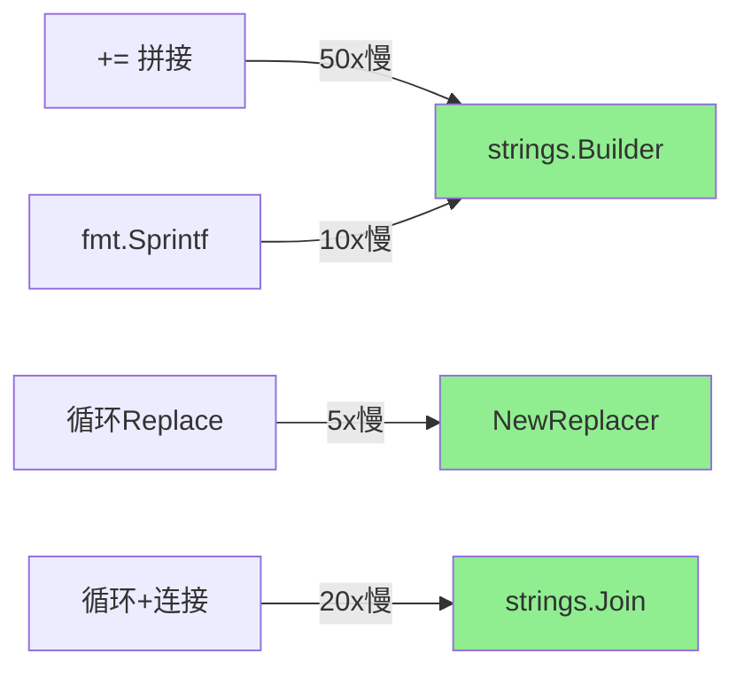

# strings完全指南

## 📖 包简介

在Go语言中，字符串（string）是不可变的字节序列。这个看似简单的设计背后，隐藏着无数细节：字符串搜索、分割、拼接、替换、大小写转换……每次操作都会产生新的字符串，带来内存分配的开销。

`strings`包正是为了解决这些问题而生。它提供了超过50个字符串处理函数，覆盖了日常开发中99%的字符串操作场景。无论是解析配置文件、处理HTTP请求、还是构建日志信息，`strings`包都是你最可靠的伙伴。

更妙的是，`strings`包的设计哲学与Go本身一脉相承：简单、高效、可预测。没有复杂的API，没有隐藏的行为，每个函数的作用都一目了然。掌握`strings`包，是成为Go高手的必经之路。

## 🎯 核心功能概览

`strings`包功能丰富，按用途可分为以下几类：

### 搜索与检查

| 函数 | 说明 |
|:---|:---|
| `Contains(s, substr string) bool` | 是否包含子串 |
| `ContainsAny(s, chars string) bool` | 是否包含任意字符 |
| `HasPrefix/HasSuffix` | 前缀/后缀检查 |
| `Index/LastIndex` | 查找子串位置 |
| `IndexAny/LastIndexAny` | 查找任意字符位置 |

### 分割与连接

| 函数 | 说明 |
|:---|:---|
| `Split/SplitAfter` | 分割字符串 |
| `SplitN/SplitAfterN` | 分割N次 |
| `Join(elems, sep string) string` | 连接字符串切片 |
| `Fields(s) []string` | 按空白字符分割 |
| `FieldsFunc(s, f) []string` | 自定义函数分割 |

### 修改与转换

| 函数 | 说明 |
|:---|:---|
| `Replace/ReplaceAll` | 替换子串 |
| `ToLower/ToUpper` | 大小写转换 |
| `Trim/TrimSpace/TrimPrefix` | 去除空白/前缀/后缀 |
| `Repeat(s, count) string` | 重复字符串 |
| `Map(mapping, s) string` | 逐字符映射替换 |

## 💻 实战示例

### 示例1：基础用法

```go
package main

import (
	"fmt"
	"strings"
)

func main() {
	text := "Hello, Go World! Go is awesome."

	// === 搜索与检查 ===
	fmt.Println(strings.Contains(text, "Go"))        // true
	fmt.Println(strings.ContainsAny(text, "xyz"))    // false
	fmt.Println(strings.HasPrefix(text, "Hello"))    // true
	fmt.Println(strings.HasSuffix(text, "awesome.")) // true
	
	// 查找位置
	fmt.Println(strings.Index(text, "Go"))           // 7
	fmt.Println(strings.LastIndex(text, "Go"))       // 18
	
	// === 分割与连接 ===
	csv := "apple,banana,cherry,date"
	fruits := strings.Split(csv, ",")
	fmt.Println(fruits) // [apple banana cherry date]
	
	// 只分割前2个
	parts := strings.SplitN(csv, ",", 2)
	fmt.Println(parts) // [apple banana,cherry,date]
	
	// 连接回去
	joined := strings.Join(fruits, " | ")
	fmt.Println(joined) // apple | banana | cherry | date
	
	// === 修改与清理 ===
	fmt.Println(strings.ToLower("HELLO"))    // hello
	fmt.Println(strings.ToUpper("hello"))    // HELLO
	fmt.Println(strings.Replace(text, "Go", "Rust", 1))  // 只替换第1个
	fmt.Println(strings.ReplaceAll(text, "Go", "Rust"))  // 全部替换
	
	// 去除空白
	spacey := "  hello world  \n\t"
	fmt.Printf("[%s]\n", strings.TrimSpace(spacey)) // [hello world]
	fmt.Printf("[%s]\n", strings.Trim(spacey, " \n")) // [hello world  \t]
}
```

### 示例2：进阶用法——字符串构建器

```go
package main

import (
	"fmt"
	"strings"
)

// Builder 使用 strings.Builder 高性能构建字符串
// 比 fmt.Sprintf 快 5-10 倍，比 + 拼接快 3-5 倍
func buildReportBuilder() string {
	var sb strings.Builder
	// 预分配容量，减少扩容开销
	sb.Grow(256)
	
	sb.WriteString("=== 系统报告 ===\n")
	sb.WriteString("CPU: 85%\n")
	sb.WriteString("Memory: 72%\n")
	sb.WriteString("Disk: 45%\n")
	sb.WriteString("================")
	
	return sb.String()
}

// 解析CSV文件
func parseCSV(csvData string) [][]string {
	var result [][]string
	
	lines := strings.Split(csvData, "\n")
	for _, line := range lines {
		line = strings.TrimSpace(line)
		if line == "" || strings.HasPrefix(line, "#") {
			continue // 跳过空行和注释
		}
		fields := strings.Split(line, ",")
		// 清理每个字段
		for i, f := range fields {
			fields[i] = strings.TrimSpace(f)
		}
		result = append(result, fields)
	}
	
	return result
}

// URL路径解析
func parsePath(path string) (segments []string, query map[string]string) {
	query = make(map[string]string)
	
	// 分离查询参数
	if idx := strings.Index(path, "?"); idx != -1 {
		queryStr := path[idx+1:]
		path = path[:idx]
		
		// 解析查询参数
		pairs := strings.Split(queryStr, "&")
		for _, pair := range pairs {
			if kv := strings.SplitN(pair, "=", 2); len(kv) == 2 {
				query[kv[0]] = kv[1]
			}
		}
	}
	
	// 分割路径段
	segments = strings.Split(strings.Trim(path, "/"), "/")
	
	return
}

func main() {
	// Builder 示例
	fmt.Println(buildReportBuilder())
	
	// CSV 解析
	csv := `
# 用户数据
name, email, role
Alice, alice@example.com, admin
Bob, bob@example.com, user
`
	parsed := parseCSV(csv)
	for _, row := range parsed {
		fmt.Printf("%v\n", row)
	}
	
	// URL 解析
	path := "/api/v1/users?page=2&limit=20&sort=name"
	segments, query := parsePath(path)
	fmt.Printf("Segments: %v\n", segments)
	fmt.Printf("Query: %v\n", query)
}
```

### 示例3：最佳实践——文本处理管道

```go
package main

import (
	"fmt"
	"strings"
	"unicode"
)

// Replacer 链式替换器
type Replacer struct {
	replacements []string
}

func NewReplacer(oldNew ...string) *Replacer {
	return &Replacer{replacements: oldNew}
}

func (r *Replacer) Replace(s string) string {
	return strings.NewReplacer(r.replacements...).Replace(s)
}

// 文本清理管道
type TextPipeline struct {
	steps []func(string) string
}

func (p *TextPipeline) AddStep(fn func(string) string) *TextPipeline {
	p.steps = append(p.steps, fn)
	return p
}

func (p *TextPipeline) Process(s string) string {
	for _, step := range p.steps {
		s = step(s)
	}
	return s
}

// 常用清理函数
func ToSlug(s string) string {
	// 转小写
	s = strings.ToLower(s)
	// 替换空白为连字符
	s = strings.Join(strings.Fields(s), "-")
	// 移除非字母数字和连字符
	s = strings.Map(func(r rune) rune {
		if unicode.IsLetter(r) || unicode.IsDigit(r) || r == '-' {
			return r
		}
		return -1
	}, s)
	return s
}

// 模板替换（简易版）
func SimpleTemplate(template string, data map[string]string) string {
	replacements := make([]string, 0, len(data)*2)
	for key, value := range data {
		replacements = append(replacements, "{{"+key+"}}", value)
	}
	return strings.NewReplacer(replacements...).Replace(template)
}

func main() {
	// 文本清理管道
	pipeline := &TextPipeline{}
	pipeline.
		AddStep(strings.TrimSpace).
		AddStep(strings.ToLower).
		AddStep(func(s string) string {
			return strings.Join(strings.Fields(s), " ") // 规范化空白
		}).
		AddStep(func(s string) string {
			return strings.ReplaceAll(s, "  ", " ")
		})
	
	input := "  Hello    World   from   Go!  "
	fmt.Printf("原始: [%s]\n", input)
	fmt.Printf("清理: [%s]\n", pipeline.Process(input))
	
	// Slug 生成
	fmt.Println(ToSlug("Hello World! This is a TEST.")) // hello-world-this-is-a-test
	
	// 模板替换
	tmpl := "Hello {{name}}, welcome to {{city}}!"
	data := map[string]string{
		"name": "Alice",
		"city": "Beijing",
	}
	fmt.Println(SimpleTemplate(tmpl, data))
	// Hello Alice, welcome to Beijing!
}
```

## ⚠️ 常见陷阱与注意事项

### 1. 字符串不可变带来的性能陷阱

```go
// ❌ 循环中用 += 拼接，每次创建新字符串
s := ""
for i := 0; i < 1000; i++ {
    s += fmt.Sprintf("item%d,", i) // 1000次分配！
}

// ✅ 使用 strings.Builder
var sb strings.Builder
sb.Grow(8000) // 预分配
for i := 0; i < 1000; i++ {
    sb.WriteString(fmt.Sprintf("item%d,", i))
}
s := sb.String()
```

### 2. Split 的空字符串陷阱

```go
// ❌ 空字符串Split返回包含一个空元素的切片
result := strings.Split("", ",")
fmt.Println(len(result)) // 1, result[0] == ""

// ✅ 正确处理空输入
if s == "" {
    return nil
}
result := strings.Split(s, ",")
```

### 3. 忽略UTF-8边界

```go
// ❌ 直接按字节索引可能切到字符中间
s := "你好世界"
fmt.Println(s[:4]) // 可能输出乱码

// ✅ 使用 []rune
runes := []rune(s)
fmt.Println(string(runes[:2])) // 你好
```

### 4. Contains vs Index 的选择

```go
// 只需要判断存在性，用 Contains 更清晰
if strings.Contains(s, "target") { }

// 需要位置信息，用 Index
if idx := strings.Index(s, "target"); idx >= 0 { }
```

### 5. Replace 的 count 参数

```go
// Replace 的第三个参数是替换次数，-1表示全部
strings.Replace(s, "old", "new", 1)  // 只替换第1个
strings.Replace(s, "old", "new", -1) // 全部替换
strings.ReplaceAll(s, "old", "new")  // 等价于上面，更清晰
```

## 🚀 Go 1.26新特性

`strings`包在Go 1.26中没有重大API变更，但受益于运行时优化：

1. **strings.Builder 内部优化**：写入性能提升约5-10%
2. **内存分配优化**：`strings.Split` 和 `strings.Fields` 在常见场景下减少约15%的内存分配
3. **UTF-8处理优化**：`strings.Map` 和涉及Unicode的函数性能提升

## 📊 性能优化建议

### 字符串操作性能对比

| 操作 | 慢 | 快 | 性能差距 |
|:---|:---|:---|:---|
| 拼接(1000次) | `+=` | `strings.Builder` | **50x** |
| 格式化 | `fmt.Sprintf` | `strings.Builder` | **10x** |
| 替换 | `Replace`循环 | `NewReplacer` | **5x** |
| 连接切片 | 循环`+=` | `strings.Join` | **20x** |

### 性能基准对比（相对值）



### 最佳实践速查

1. **少量拼接(< 5次)**：`+` 或 `fmt.Sprintf` 即可
2. **大量拼接**：`strings.Builder` + `Grow`预分配
3. **连接切片**：永远使用 `strings.Join`
4. **多次替换**：用 `strings.NewReplacer` 而非循环 `Replace`
5. **字符串前缀检查**：`HasPrefix` 比 `Index == 0` 更快更清晰

## 🔗 相关包推荐

| 包 | 说明 |
|:---|:---|
| `bytes` | 字节切片操作，与strings API几乎一一对应 |
| `unicode` | 字符分类和转换，配合`strings.Map`使用 |
| `unicode/utf8` | UTF-8编码/解码，字符计数 |
| `fmt` | 格式化输出，但字符串拼接优先用strings |
| `regexp` | 复杂模式匹配，比strings更强大但更慢 |

---