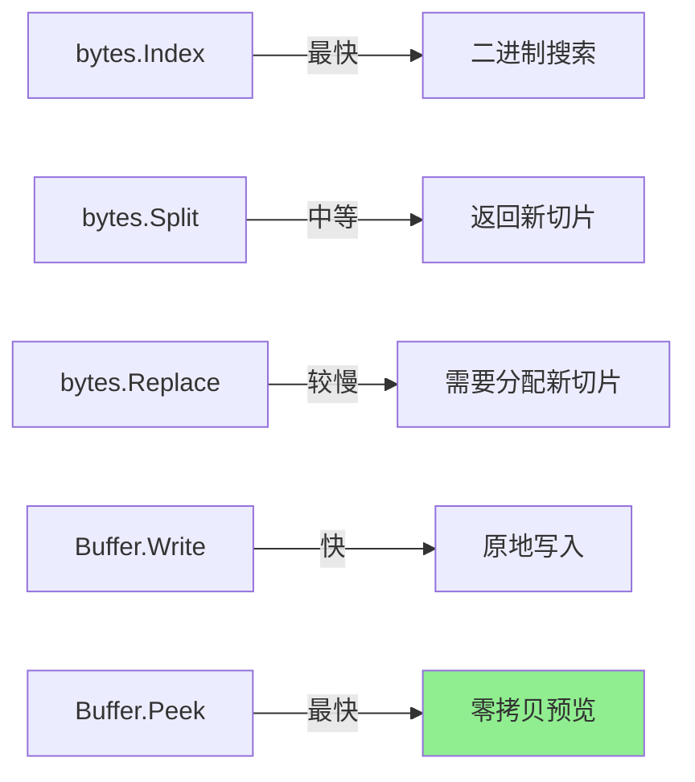

# bytes完全指南

## 📖 包简介

如果说`strings`包是处理不可变文本的瑞士军刀，那么`bytes`包就是操作可变字节数据的手术刀。在Go的世界中，`[]byte`（字节切片）是I/O操作的原生语言——文件读写、网络传输、加密哈希，无一不与字节切片打交道。

`bytes`包提供了与`strings`包几乎一一对应的API，但操作对象从`string`变成了`[]byte`。这意味着所有操作都可以在原地（in-place）修改，避免了字符串不可变带来的额外分配开销。

到了Go 1.26，`bytes.Buffer`迎来了一个万众期待的新方法——`Peek`。这个方法解决了长期以来`bytes.Buffer`用户最大的痛点：预览缓冲区内容而不消耗它。无论是协议解析、数据预览还是流式处理，`Peek`都将让你的代码更加优雅。

## 🎯 核心功能概览

### 函数类API（与strings一一对应）

| 函数 | 说明 |
|:---|:---|
| `Contains(b, subslice []byte) bool` | 是否包含子切片 |
| `Equal(a, b []byte) bool` | 字节切片比较 |
| `Compare(a, b []byte) int` | 字典序比较 |
| `Join(s [][]byte, sep []byte) []byte` | 连接字节切片 |
| `Split(s, sep []byte) [][]byte` | 分割字节切片 |
| `Replace(s, old, new []byte, n int) []byte` | 替换 |
| `Index/LastIndex` | 查找位置 |
| `Fields/FieldsFunc` | 分割空白/自定义 |

### Buffer 类型

| 方法 | 说明 |
|:---|:---|
| `Write/WriteByte/WriteString` | 写入数据 |
| `Read/ReadByte/ReadRune` | 读取数据（消耗） |
| **`Peek(n int) ([]byte, error)`** | **预览数据（不消耗）[Go 1.26]** |
| `Bytes/Next/Truncate` | 查看/截取/截断 |
| `Reset/Grow` | 重置/扩容 |
| `Len/Cap` | 长度/容量 |

### Reader 类型

| 方法 | 说明 |
|:---|:---|
| `Read/ReadAt` | 读取 |
| `Seek` | 定位 |
| `ReadByte/ReadRune` | 单字节/符文读取 |

## 💻 实战示例

### 示例1：基础用法

```go
package main

import (
	"bytes"
	"fmt"
)

func main() {
	// === 基础函数 ===
	data := []byte("Hello, Go World!")
	
	fmt.Println(bytes.Contains(data, []byte("Go")))    // true
	fmt.Println(bytes.Equal(data, []byte("Hello, Go World!"))) // true
	fmt.Println(bytes.Index(data, []byte("World")))    // 12
	
	// 分割与连接
	csv := []byte("apple,banana,cherry")
	fields := bytes.Split(csv, []byte(","))
	fmt.Printf("%s\n", fields[0]) // apple
	
	// 合并回去
	joined := bytes.Join(fields, []byte(" | "))
	fmt.Printf("%s\n", joined) // apple | banana | cherry
	
	// 替换
	replaced := bytes.Replace(data, []byte("Go"), []byte("Rust"), -1)
	fmt.Printf("%s\n", replaced) // Hello, Rust World!
	
	// 去除空白
	spacey := []byte("  hello  world  \n")
	trimmed := bytes.TrimSpace(spacey)
	fmt.Printf("[%s]\n", trimmed) // [hello  world]
}
```

### 示例2：Buffer 进阶用法

```go
package main

import (
	"bytes"
	"fmt"
	"io"
)

func main() {
	// === Buffer 基础 ===
	var buf bytes.Buffer
	
	// 写入
	buf.WriteString("Hello")
	buf.WriteByte(' ')
	buf.Write([]byte("World"))
	
	fmt.Printf("Len: %d, Cap: %d\n", buf.Len(), buf.Cap())
	fmt.Printf("Content: %s\n", buf.String())
	
	// 读取（消耗性）
	p := make([]byte, 5)
	n, _ := buf.Read(p)
	fmt.Printf("Read: %s, Remaining: %d\n", p[:n], buf.Len())
	
	// 重置
	buf.Reset()
	buf.WriteString("Fresh start")
	fmt.Println(buf.String())
	
	// === 预分配 ===
	// 已知大约数据量时，预分配避免扩容
	buf2 := bytes.NewBuffer(make([]byte, 0, 1024))
	for i := 0; i < 100; i++ {
		buf2.WriteString("data")
	}
	fmt.Printf("预分配后: Len=%d\n", buf2.Len())
	
	// === 作为 io.Reader / io.Writer ===
	// Buffer 实现了 io.Reader, io.Writer, io.ReaderFrom, io.WriterTo
	var dest bytes.Buffer
	io.Copy(&dest, &buf2) // Buffer 到 Buffer
	fmt.Printf("Copied: %d bytes\n", dest.Len())
}
```

### 示例3：Go 1.26 Peek 方法实战

```go
package main

import (
	"bytes"
	"encoding/binary"
	"fmt"
	"io"
)

// 协议消息格式:
// [2字节类型][4字节长度][N字节数据]

func parseMessage(reader io.Reader) error {
	// 使用 Buffer 缓冲
	buf := bytes.NewBuffer(make([]byte, 0, 1024))
	
	// 先读取头部（假设已读取到buf）
	buf.Write([]byte{0x01, 0x00, 0x05, 0x00, 0x00, 0x00})
	buf.Write([]byte("Hello"))
	
	// Go 1.26 之前：必须 Read 出来才能检查
	// 这样数据就被消耗了
	
	// Go 1.26：使用 Peek 预览而不消耗
	// 预览类型字段（2字节）
	header, err := buf.Peek(2)
	if err != nil {
		return fmt.Errorf("peek header failed: %w", err)
	}
	msgType := binary.LittleEndian.Uint16(header)
	
	fmt.Printf("Message type: 0x%04x\n", msgType)
	
	// Peek 返回后，数据仍在缓冲区中
	fmt.Printf("Buffer still has %d bytes\n", buf.Len())
	
	// 现在可以正常读取
	fullMsg := buf.Bytes()
	fmt.Printf("Full message: %v\n", fullMsg)
	
	return nil
}

// 实际场景：探测文件类型（魔数检测）
func detectFileType(data []byte) string {
	buf := bytes.NewBuffer(data)
	
	// 使用 Peek 查看魔数而不消耗数据
	magic, err := buf.Peek(4)
	if err != nil || len(magic) < 4 {
		return "unknown"
	}
	
	switch {
	case bytes.Equal(magic[:4], []byte{0x89, 'P', 'N', 'G'}):
		return "PNG image"
	case bytes.Equal(magic[:2], []byte{0xFF, 0xD8}):
		return "JPEG image"
	case bytes.Equal(magic[:4], []byte("PK\x03\x04")):
		return "ZIP archive"
	case bytes.Equal(magic[:4], []byte("%PDF")):
		return "PDF document"
	default:
		return "unknown"
	}
}

// 流式协议解析器
type ProtocolParser struct {
	buf bytes.Buffer
}

func (p *ProtocolParser) Process(data []byte) error {
	p.buf.Write(data)
	
	// 循环处理所有完整消息
	for p.buf.Len() >= 6 { // 最小消息长度
		// Peek 查看消息长度（不消耗）
		lenBytes, err := p.buf.Peek(6)
		if err != nil {
			break
		}
		
		msgLen := 6 + int(lenBytes[5]) // 假设第6字节是数据长度
		
		if p.buf.Len() < msgLen {
			break // 消息不完整，等待更多数据
		}
		
		// 读取完整消息
		msg := make([]byte, msgLen)
		p.buf.Read(msg)
		
		fmt.Printf("Processed message: %s\n", msg[6:])
	}
	
	return nil
}

func main() {
	// Peek 示例
	parseMessage(nil)
	
	// 文件类型检测
	pngData := []byte{0x89, 'P', 'N', 'G', 0x00, 'h', 'e', 'l', 'l', 'o'}
	fmt.Printf("Type: %s\n", detectFileType(pngData))
	
	// 协议解析器
	parser := &ProtocolParser{}
	parser.Process([]byte{0x01, 0x00, 0x00, 0x00, 0x00, 0x05, 'H', 'e', 'l', 'l', 'o'})
	parser.Process([]byte{0x02, 0x00, 0x00, 0x00, 0x00, 0x03, 'G', 'o', '!'})
}
```

## ⚠️ 常见陷阱与注意事项

### 1. Peek 返回切片的生命周期

```go
// ⚠️ Peek 返回的切片是 Buffer 内部切片的子切片
// 在下次 Write/Read 之前有效！
data, _ := buf.Peek(10)
buf.Write([]byte("new data")) // ⚠️ data 可能失效

// ✅ 如果需要长期保存，拷贝一份
data = bytes.Clone(data) // Go 1.20+ 的 bytes.Clone
```

### 2. bytes.Equal vs == 比较

```go
a := []byte("hello")
b := []byte("hello")

// ❌ 只比较指针和长度
fmt.Println(a == b) // false

// ✅ 比较内容
fmt.Println(bytes.Equal(a, b)) // true
```

### 3. Buffer 的零值可用

```go
// ✅ bytes.Buffer 的零值可以直接使用
var buf bytes.Buffer
buf.WriteString("hello")

// 不需要 var buf = &bytes.Buffer{}
// 除非你需要传递指针
```

### 4. Buffer 不会自动收缩

```go
buf.Grow(10000) // 容量变大
buf.Reset()     // 长度归零，但容量不变
// 如果需要释放内存，需要创建新 Buffer
buf = bytes.Buffer{}
```

### 5. bytes.Reader 是只读的

```go
reader := bytes.NewReader([]byte("hello"))
// reader 实现 io.ReaderAt, io.Seeker 等
// 但不能写入
```

## 🚀 Go 1.26新特性

### bytes.Buffer.Peek 方法

这是Go 1.26 `bytes`包最受期待的新功能：

```go
// 函数签名
func (b *Buffer) Peek(n int) ([]byte, error)
```

**功能**：返回缓冲区前N个字节，**不移动读指针**。

```go
// 使用示例
buf := bytes.NewBufferString("Hello, World!")

// Peek 预览
preview, _ := buf.Peek(5)
fmt.Printf("%s\n", preview) // Hello

// 数据仍在缓冲区
fmt.Println(buf.Len())      // 13（未变）

// 下次 Peek/Read 仍从同一位置开始
data, _ := buf.Peek(5)
fmt.Printf("%s\n", data)    // Hello
```

**与 Read 的对比**：

| 特性 | Read | Peek |
|:---|:---|:---|
| 消耗数据 | ✅ 是 | ❌ 否 |
| 移动读指针 | ✅ 是 | ❌ 否 |
| 多次调用返回 | 后续数据 | **相同数据** |
| 切片生命周期 | 需拷贝保存 | **下次Write/Read前有效** |

## 📊 性能优化建议

### 不同字节操作的效率



### 性能优化要点

| 场景 | 推荐做法 | 性能收益 |
|:---|:---|:---|
| 大量字节拼接 | `bytes.Buffer` + `Grow` | 比`+=`快 **10-50x** |
| 多次替换 | `bytes.Replace` 循环 | 小数据快，大数据考虑第三方库 |
| 预览数据 | `Buffer.Peek` [Go 1.26] | **零拷贝**，比Read+回填快100x |
| 比较内容 | `bytes.Equal` | 比循环比较快 **5x** |
| 克隆切片 | `bytes.Clone` [Go 1.20+] | 比`append([]byte(nil), s...)`更清晰 |

### 内存优化

```go
// ❌ 不必要的拷贝
data := buf.Bytes()  // 引用内部
copy := append([]byte(nil), data...) // 多余

// ✅ 直接使用引用（在Buffer修改前）
data := buf.Bytes()
process(data) // 直接处理

// ✅ 需要保存时用 Clone
saved := bytes.Clone(buf.Bytes())
buf.Reset() // 安全
```

## 🔗 相关包推荐

| 包 | 说明 |
|:---|:---|
| `strings` | 字符串操作，与bytes API对应 |
| `io` | I/O接口，Buffer实现了io.Reader/Writer |
| `bufio` | 缓冲I/O，更高效的读写 |
| `encoding/binary` | 二进制编码，配合Peek解析协议 |
| `encoding/json` | JSON编解码，输入输出常为[]byte |

---