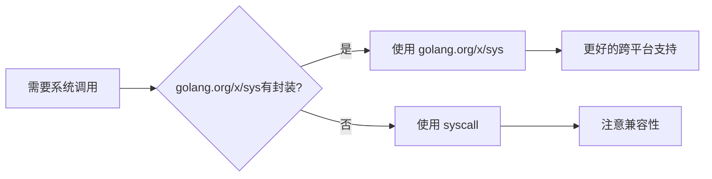

#  syscall 完全指南

新手也能秒懂的Go标准库教程!从基础到实战,一文打通!

## 📖 包简介

如果说Go标准库是一栋大楼,那么 `syscall` 包就是这栋大楼的地基——你可能平时看不到它,但几乎所有底层操作都建立在它之上。

`syscall` 包提供了对操作系统底层系统调用的直接访问。当你需要操作文件描述符、创建进程、管理内存映射、处理网络socket、甚至是与内核模块通信时,你最终都会触及这个包。它是 `os`、`net` 等包的底层实现基础。

但要注意:**这是一个"危险"的包**。直接使用系统调用意味着你要处理不同操作系统的差异,还要小心跨平台兼容性问题。通常情况下,你应该优先使用 `os` 或 `net` 等高层封装,只有在这些包无法满足需求时,才应该考虑直接使用 `syscall`。

## 🎯 核心功能概览

| 类型/函数 | 说明 |
|-----------|------|
| `Syscall/Syscall6` | 执行系统调用 |
| `ForkExec` | 创建子进程 |
| `Wait4` | 等待子进程 |
| `Kill(pid, sig)` | 发送信号给进程 |
| `Getpid()/Getppid()` | 获取进程ID |
| `Mmap/Munmap` | 内存映射 |
| `Socket/Bind/Listen` | 底层网络操作 |
| `Stat/Fstat` | 文件状态 |

## 💻 实战示例

### 示例1: 获取进程信息

```go
package main

import (
	"fmt"
	"syscall"
)

func main() {
	// 获取当前进程ID
	pid := syscall.Getpid()
	ppid := syscall.Getppid()

	fmt.Printf("进程ID: %d\n", pid)
	fmt.Printf("父进程ID: %d\n", ppid)

	// 获取用户/组ID
	uid := syscall.Getuid()
	gid := syscall.Getgid()
	euid := syscall.Geteuid()
	egid := syscall.Getegid()

	fmt.Printf("用户ID: %d (有效: %d)\n", uid, euid)
	fmt.Printf("组ID: %d (有效: %d)\n", gid, egid)
}
```

### 示例2: 发送信号给进程

```go
package main

import (
	"fmt"
	"os"
	"strconv"
	"syscall"
)

// SendSignal 向指定进程发送信号
func SendSignal(pid int, sig syscall.Signal) error {
	process, err := os.FindProcess(pid)
	if err != nil {
		return fmt.Errorf("查找进程失败: %w", err)
	}

	// Unix系统下FindProcess总是成功,需要实际发送信号来验证
	err = process.Signal(sig)
	if err != nil {
		return fmt.Errorf("发送信号失败: %w", err)
	}

	return nil
}

// IsProcessRunning 检查进程是否在运行
func IsProcessRunning(pid int) bool {
	// 发送信号0来检查进程是否存在
	err := syscall.Kill(pid, 0)
	return err == nil
}

func main() {
	// 检查常见PID
	checkPids := []int{1, os.Getpid(), 99999}

	for _, pid := range checkPids {
		if IsProcessRunning(pid) {
			fmt.Printf("PID %d: 运行中\n", pid)
		} else {
			fmt.Printf("PID %d: 不存在\n", pid)
		}
	}
}
```

### 示例3: 最佳实践 - 内存映射文件

```go
package main

import (
	"fmt"
	"os"
	"syscall"
	"unsafe"
)

// MmapFile 内存映射文件
type MmapFile struct {
	data []byte
	fd   int
}

// OpenMmap 打开并映射文件到内存
func OpenMmap(path string) (*MmapFile, error) {
	fd, err := syscall.Open(path, syscall.O_RDONLY, 0)
	if err != nil {
		return nil, fmt.Errorf("打开文件失败: %w", err)
	}

	// 获取文件大小
	var stat syscall.Stat_t
	if err := syscall.Fstat(fd, &stat); err != nil {
		syscall.Close(fd)
		return nil, fmt.Errorf("获取文件状态失败: %w", err)
	}

	size := stat.Size
	if size == 0 {
		syscall.Close(fd)
		return &MmapFile{fd: fd}, nil
	}

	// 映射文件到内存
	data, err := syscall.Mmap(
		fd,
		0,
		int(size),
		syscall.PROT_READ,
		syscall.MAP_SHARED,
	)
	if err != nil {
		syscall.Close(fd)
		return nil, fmt.Errorf("内存映射失败: %w", err)
	}

	return &MmapFile{data: data, fd: fd}, nil
}

// Data 获取映射数据
func (m *MmapFile) Data() []byte {
	return m.data
}

// Close 关闭并解除映射
func (m *MmapFile) Close() error {
	if m.data != nil {
		if err := syscall.Munmap(m.data); err != nil {
			return fmt.Errorf("解除映射失败: %w", err)
		}
		m.data = nil
	}
	if m.fd >= 0 {
		if err := syscall.Close(m.fd); err != nil {
			return fmt.Errorf("关闭文件失败: %w", err)
		}
		m.fd = -1
	}
	return nil
}

func main() {
	// 创建测试文件
	testFile := "/tmp/mmap_test.txt"
	os.WriteFile(testFile, []byte("Hello, Mmap!"), 0o644)

	mf, err := OpenMmap(testFile)
	if err != nil {
		fmt.Printf("错误: %v\n", err)
		return
	}
	defer mf.Close()

	fmt.Printf("文件内容: %s\n", mf.Data())
}
```

## ⚠️ 常见陷阱与注意事项

1. **跨平台兼容性**: `syscall` 包的API在不同操作系统上差异巨大。Linux上的系统调用在Windows上可能根本不存在。如果你的代码需要跨平台,请务必使用 `//go:build` 约束分离不同平台的实现。

2. **不稳定性保证**: Go官方明确表示 `syscall` 包的API**不遵循Go 1兼容性承诺**。未来版本可能会变更。这意味着依赖 `syscall` 的代码在未来Go升级时可能需要修改。

3. **文件描述符泄漏**: 直接使用 `syscall.Open()` 后必须手动 `syscall.Close()`,不像 `os.Open()` 可以配合 `defer file.Close()` 使用。忘记关闭会导致文件描述符泄漏。

4. **信号安全**: 在信号处理函数中调用非异步信号安全的函数(如malloc、printf)可能导致死锁或未定义行为。Go的runtime在信号处理方面做了大量工作,但直接使用 `syscall` 时仍需小心。

5. **权限问题**: 许多系统调用需要特定权限(如 `CAP_NET_ADMIN`、`CAP_SYS_PTRACE`)。在容器化环境中,即使你是root用户,也可能因为capability限制而失败。

## 🚀 Go 1.26新特性

Go 1.26 对 `syscall` 包的调整:

- **Linux平台**: 增加了对新内核特性的支持,包括更新的 `io_uring` 相关系统调用常量
- **Darwin平台**: 更新了macOS/iOS的系统调用号映射,适配最新的内核版本
- **错误处理改进**: 优化了某些系统调用失败时的错误码转换,使 `Errno` 到 `error` 的映射更准确
- **内部重构**: 继续推进将部分 `syscall` 功能迁移到 `golang.org/x/sys` 的策略,建议新代码优先使用 `golang.org/x/sys/unix` 或 `golang.org/x/sys/windows`

## 📊 性能优化建议



**系统调用 vs 高层API 性能对比**(以文件读取为例):

| 方法 | 延迟 | 内存分配 | 安全性 | 推荐度 |
|------|------|---------|-------|-------|
| `os.ReadFile` | 高 | 中 | 高 | 日常使用 |
| `syscall.Read` | 低 | 低 | 低 | 性能敏感 |
| `syscall.Mmap` | 极低 | 无 | 低 | 大文件访问 |
| `io_uring`(Linux) | 极低 | 低 | 中 | 高并发I/O |

**何时考虑直接使用syscall**:

1. 需要 `mmap` 进行大文件随机访问
2. 高性能网络编程(如 `epoll`、`kqueue`)
3. 自定义进程管理需求
4. 与操作系统内核模块交互
5. 实现新的标准库封装

## 🔗 相关包推荐

| 包名 | 用途 |
|------|------|
| `golang.org/x/sys/unix` | 推荐的Unix系统调用替代包 |
| `golang.org/x/sys/windows` | 推荐的Windows系统调用替代包 |
| `os` | 高层操作系统接口 |
| `net` | 网络操作 |

---