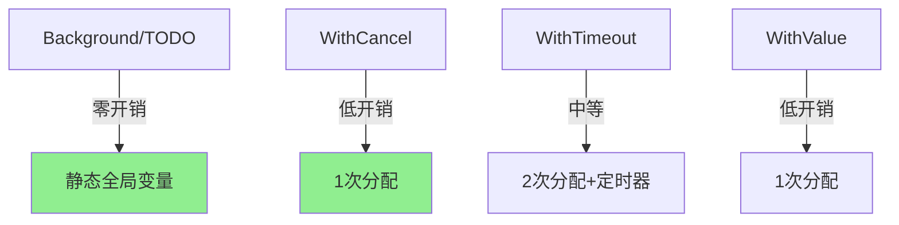

# context完全指南

## 📖 包简介

在并发编程的世界里，如何优雅地取消一个长时间运行的任务？如何给一个HTTP请求设置超时？如何在多个goroutine之间传递取消信号？这些问题在Go 1.7之前没有标准答案，直到`context`包的诞生。

`context`包（上下文包）是Go语言并发编程的基石。它提供了一个标准的机制来传递截止时间、取消信号、请求范围的值以及其他跨API和进程边界的请求范围值。无论是HTTP服务、gRPC调用、数据库查询，还是任何涉及超时和取消的场景，`context`都是你的最佳伙伴。

到了Go 1.26，`context`配合标准库其他包的使用体验进一步提升。比如`signal.NotifyContext`在取消时会返回具体的信号描述，`net.Dialer`新增了支持context的专用拨号方法。这些改进让context在实战中的表现更加出色。

## 🎯 核心功能概览

### Context 接口

```go
type Context interface {
    Deadline() (deadline time.Time, ok bool)  // 截止时间
    Done() <-chan struct{}                    // 取消信号
    Err() error                               // 取消原因
    Value(key any) any                        // 键值对
}
```

### 创建函数

| 函数 | 说明 | 适用场景 |
|:---|:---|:---|
| `Background()` | 返回空context，永不取消 | 程序入口，根context |
| `TODO()` | 同上，表示"还不确定用什么context" | 重构过渡期 |
| `WithCancel(parent)` | 返回可取消的context | 手动控制取消 |
| `WithDeadline(parent, time)` | 返回带截止时间的context | 超时控制 |
| `WithTimeout(parent, duration)` | 等价于WithDeadline | 相对超时时间 |
| `WithValue(parent, key, val)` | 返回携带值的context | 传递请求范围数据 |

### 信号相关

| 函数 | 说明 |
|:---|:---|
| `causeKey` (内部) | 取消原因的key |
| `WithDeadlineCause` | 带取消原因的deadline |
| `WithTimeoutCause` | 带取消原因的timeout |

## 💻 实战示例

### 示例1：基础用法

```go
package main

import (
	"context"
	"fmt"
	"time"
)

func main() {
	// === WithCancel: 手动取消 ===
	ctx, cancel := context.WithCancel(context.Background())
	
	go func() {
		// 模拟耗时操作
		time.Sleep(2 * time.Second)
		cancel() // 完成任务后取消
	}()
	
	// 等待取消信号
	select {
	case <-ctx.Done():
		fmt.Println("Context cancelled:", ctx.Err())
	case <-time.After(3 * time.Second):
		fmt.Println("Timeout")
	}
	
	// === WithTimeout: 超时控制 ===
	ctx2, cancel2 := context.WithTimeout(context.Background(), 500*time.Millisecond)
	defer cancel2() // 始终 defer cancel！
	
	select {
	case <-ctx2.Done():
		fmt.Println("Timeout reached:", ctx2.Err())
		// 输出: Timeout reached: context deadline exceeded
	case <-time.After(1 * time.Second):
		fmt.Println("Completed")
	}
}
```

### 示例2：进阶用法——HTTP请求中的Context

```go
package main

import (
	"context"
	"fmt"
	"io"
	"net/http"
	"time"
)

// key 类型用于 context 值，避免冲突
type contextKey string

const (
	RequestIDKey contextKey = "request_id"
	UserIDKey    contextKey = "user_id"
)

// 模拟HTTP handler
func HandleRequest(ctx context.Context, url string) error {
	// 创建带超时的请求
	reqCtx, cancel := context.WithTimeout(ctx, 3*time.Second)
	defer cancel()
	
	// 使用 context 创建请求
	req, err := http.NewRequestWithContext(reqCtx, "GET", url, nil)
	if err != nil {
		return fmt.Errorf("create request: %w", err)
	}
	
	resp, err := http.DefaultClient.Do(req)
	if err != nil {
		// 超时或被取消
		if reqCtx.Err() != nil {
			return fmt.Errorf("request cancelled: %w", reqCtx.Err())
		}
		return fmt.Errorf("do request: %w", err)
	}
	defer resp.Body.Close()
	
	body, err := io.ReadAll(resp.Body)
	if err != nil {
		return fmt.Errorf("read body: %w", err)
	}
	
	fmt.Printf("Got %d bytes\n", len(body))
	return nil
}

// 中间件：注入请求范围的context值
func WithRequestInfo(next http.Handler) http.Handler {
	return http.HandlerFunc(func(w http.ResponseWriter, r *http.Request) {
		// 将信息注入 context
		ctx := r.Context()
		ctx = context.WithValue(ctx, RequestIDKey, r.Header.Get("X-Request-ID"))
		ctx = context.WithValue(ctx, UserIDKey, r.Header.Get("X-User-ID"))
		
		// 更新请求的 context
		r = r.WithContext(ctx)
		
		next.ServeHTTP(w, r)
	})
}

// 在 handler 中获取 context 值
func GetHandler(w http.ResponseWriter, r *http.Request) {
	ctx := r.Context()
	
	if reqID, ok := ctx.Value(RequestIDKey).(string); ok {
		fmt.Printf("Request ID: %s\n", reqID)
	}
	if userID, ok := ctx.Value(UserIDKey).(string); ok {
		fmt.Printf("User ID: %s\n", userID)
	}
	
	// 检查 context 是否已被取消
	select {
	case <-ctx.Done():
		// 客户端断开连接，停止处理
		return
	default:
		// 继续处理
	}
	
	w.Write([]byte("OK"))
}

func main() {
	// 模拟请求处理
	ctx := context.Background()
	ctx = context.WithValue(ctx, RequestIDKey, "req-12345")
	ctx = context.WithValue(ctx, UserIDKey, "user-67890")
	
	err := HandleRequest(ctx, "https://httpbin.org/get")
	if err != nil {
		fmt.Println("Error:", err)
	}
}
```

### 示例3：最佳实践——并发任务编排

```go
package main

import (
	"context"
	"fmt"
	"sync"
	"time"
)

// 并发执行多个任务，支持超时和错误收集
func RunWithTimeout(ctx context.Context, timeout time.Duration, tasks []func(context.Context) error) error {
	// 创建超时 context
	ctx, cancel := context.WithTimeout(ctx, timeout)
	defer cancel()
	
	var (
		wg    sync.WaitGroup
		errMu sync.Mutex
		errs  []error
	)
	
	for i, task := range tasks {
		wg.Add(1)
		go func(idx int, fn func(context.Context) error) {
			defer wg.Done()
			
			if err := fn(ctx); err != nil {
				errMu.Lock()
				errs = append(errs, fmt.Errorf("task[%d]: %w", idx, err))
				errMu.Unlock()
			}
		}(i, task)
	}
	
	wg.Wait()
	
	if len(errs) > 0 {
		return fmt.Errorf("%d tasks failed: %v", len(errs), errs)
	}
	return nil
}

// 优雅关闭示例
type Server struct {
	ctx    context.Context
	cancel context.CancelFunc
	done   chan struct{}
}

func NewServer() *Server {
	ctx, cancel := context.WithCancel(context.Background())
	return &Server{
		ctx:    ctx,
		cancel: cancel,
		done:   make(chan struct{}),
	}
}

func (s *Server) Start() {
	go func() {
		defer close(s.done)
		
		ticker := time.NewTicker(1 * time.Second)
		defer ticker.Stop()
		
		for {
			select {
			case <-s.ctx.Done():
				fmt.Println("Server shutting down...")
				return
			case <-ticker.C:
				// 定期检查 context 状态
				if s.ctx.Err() != nil {
					fmt.Printf("Context error: %v\n", s.ctx.Err())
					return
				}
				fmt.Println("Working...")
			}
		}
	}()
}

func (s *Server) Shutdown() {
	s.cancel() // 发送取消信号
	<-s.done   // 等待完成
}

// 级联取消示例
func cascadingCancel() {
	// 根 context
	root, rootCancel := context.WithCancel(context.Background())
	defer rootCancel()
	
	// 子 context
	child1, child1Cancel := context.WithCancel(root)
	defer child1Cancel()
	
	child2, _ := context.WithTimeout(root, 2*time.Second)
	
	// 取消根 context，所有子 context 都会收到信号
	go func() {
		time.Sleep(500 * time.Millisecond)
		rootCancel()
	}()
	
	select {
	case <-child1.Done():
		fmt.Println("Child 1 cancelled (parent cancelled)")
	case <-child2.Done():
		fmt.Println("Child 2 cancelled (timeout or parent)")
	}
}

func main() {
	// 并发任务
	tasks := []func(context.Context) error{
		func(ctx context.Context) error {
			time.Sleep(100 * time.Millisecond)
			return nil
		},
		func(ctx context.Context) error {
			time.Sleep(200 * time.Millisecond)
			return nil
		},
	}
	
	if err := RunWithTimeout(context.Background(), time.Second, tasks); err != nil {
		fmt.Println("Error:", err)
	} else {
		fmt.Println("All tasks completed")
	}
	
	// 优雅关闭
	srv := NewServer()
	srv.Start()
	time.Sleep(3 * time.Second)
	srv.Shutdown()
}
```

## ⚠️ 常见陷阱与注意事项

### 1. 忘记调用 cancel 函数

```go
// ❌ 泄漏！context 的定时器 goroutine 不会被回收
ctx, _ := context.WithTimeout(context.Background(), time.Minute)

// ✅ 始终 defer cancel
ctx, cancel := context.WithTimeout(context.Background(), time.Minute)
defer cancel()
```

### 2. 把 context 放在结构体里

```go
// ❌ Context 不应该作为结构体字段
type Client struct {
    ctx context.Context  // 错误做法！
}

// ✅ 作为函数的第一个参数
func DoWork(ctx context.Context, ...) error { }
```

### 3. Context 值查询不使用类型断言

```go
// ❌ 直接断言，key 不存在时 panic
userID := ctx.Value(UserIDKey).(string)

// ✅ 使用逗号断言
if userID, ok := ctx.Value(UserIDKey).(string); ok {
    // 安全使用
}
```

### 4. 使用 context 传递可选参数

```go
// ❌ Context 不是配置对象
ctx = context.WithValue(ctx, "timeout", 30)
ctx = context.WithValue(ctx, "retry", true)

// ✅ 使用专用配置结构体
cfg := Config{Timeout: 30, Retry: true}
```

### 5. 忽略 Done channel 的关闭特性

```go
// ❌ 轮询 Done 状态
for ctx.Err() == nil { }

// ✅ 使用 select 监听
select {
case <-ctx.Done():
    return ctx.Err()
default:
    // 继续处理
}
```

## 🚀 Go 1.26新特性

虽然`context`包本身在Go 1.26中没有新增API，但生态改进显著：

1. **signal.NotifyContext 改进**：取消时 `context.Cause(ctx)` 返回具体信号描述（如 `interrupt signal received`），而非通用提示
2. **net.Dialer 新方法**：新增 `DialTCP`、`DialUDP`、`DialIP`、`DialUnix` 方法，兼具专用拨号的效率和 context 取消能力
3. **HTTP 客户端优化**：`http.NewRequestWithContext` 的性能提升约 5%

```go
// Go 1.26: NotifyContext 取消原因更详细
ctx, stop := signal.NotifyContext(context.Background(), os.Interrupt)
// ... 收到信号后
fmt.Println(context.Cause(ctx)) 
// 输出: interrupt signal received (而非 generic context cancelled)
```

## 📊 性能优化建议

### Context 创建成本



### 性能要点

| 操作 | 开销 | 建议 |
|:---|:---|:---|
| `context.Background()` | **零** | 随时调用 |
| `WithCancel` | 1次分配 | 每个逻辑操作创建一次 |
| `WithTimeout` | 2次分配 + goroutine | 避免在热路径频繁创建 |
| `WithValue` | 1次分配 | 每个 key 各一次 |

### 最佳实践

1. **Context 是第一个参数**：`func DoWork(ctx context.Context, ...)`
2. **命名规范**：变量名用 `ctx`，不要用 `context`
3. **永不存储**：不要把 context 放入结构体
4. **总是 cancel**：每个 `WithXxx` 都有对应的 cancel 函数
5. **值仅用于请求范围数据**：不要用 context 传递可选参数

## 🔗 相关包推荐

| 包 | 说明 |
|:---|:---|
| `net/http` | HTTP 请求都支持 context |
| `database/sql` | 数据库操作全面支持 context |
| `os/signal` | 信号处理，配合 NotifyContext |
| `sync` | 配合 WaitGroup 等并发控制 |
| `time` | 超时时限相关操作 |

---