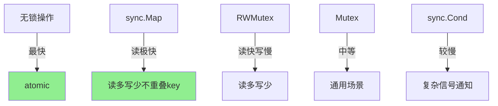

# sync完全指南

## 📖 包简介

Go语言以其"用通信代替共享内存"的理念闻名于世，但在实际开发中，共享内存加锁依然是不可避免的。`sync`包就是Go提供的一套完整的同步原语工具包，包含了从互斥锁到并发安全Map的所有基础设施。

很多Go初学者对锁的理解停留在"加个Mutex就行了"的层面，却忽略了`sync`包中还有更多强大而精巧的工具。比如`sync.Pool`可以大幅降低GC压力，`sync.Map`在高并发读场景下性能远超`mutex+map`，`sync.Once`可以优雅地实现单例模式。

更重要的是，滥用锁是Go程序最常见的性能瓶颈之一。理解每种同步原语的设计理念和适用场景，才能写出既安全又高效的并发代码。本文将带你深入理解`sync`包的每个组件，从原理到实战，从陷阱到优化，一文打通。

## 🎯 核心功能概览

| 类型 | 说明 | 适用场景 |
|:---|:---|:---|
| **Mutex** | 互斥锁 | 临界区保护，最常用 |
| **RWMutex** | 读写锁 | 读多写少场景 |
| **WaitGroup** | 等待组 | 等待一组goroutine完成 |
| **Once** | 单次执行 | 单例、初始化一次 |
| **Cond** | 条件变量 | goroutine间信号通知 |
| **Map** | 并发安全Map | 高并发读，低并发写 |
| **Pool** | 对象池 | 减少GC压力，对象复用 |
| **ErrGroup** | 错误组 | ⚠️ 在 golang.org/x/sync 中 |

## 💻 实战示例

### 示例1：基础用法

```go
package main

import (
	"fmt"
	"sync"
)

// === Mutex: 互斥锁 ===
type Counter struct {
	mu sync.Mutex
	n  int
}

func (c *Counter) Inc() {
	c.mu.Lock()
	defer c.mu.Unlock()
	c.n++
}

func (c *Counter) Value() int {
	c.mu.Lock()
	defer c.mu.Unlock()
	return c.n
}

// === RWMutex: 读写锁 ===
type Cache struct {
	mu   sync.RWMutex
	data map[string]string
}

func NewCache() *Cache {
	return &Cache{data: make(map[string]string)}
}

func (c *Cache) Get(key string) (string, bool) {
	c.mu.RLock()         // 读锁，多个读者可并行
	defer c.mu.RUnlock()
	val, ok := c.data[key]
	return val, ok
}

func (c *Cache) Set(key, value string) {
	c.mu.Lock()          // 写锁，排他
	defer c.mu.Unlock()
	c.data[key] = value
}

// === WaitGroup: 等待组 ===
func waitGroupDemo() {
	var wg sync.WaitGroup
	
	for i := 0; i < 5; i++ {
		wg.Add(1)
		go func(id int) {
			defer wg.Done()
			fmt.Printf("Worker %d done\n", id)
		}(i)
	}
	
	wg.Wait() // 等待所有完成
	fmt.Println("All workers completed")
}

// === Once: 单次执行 ===
type Database struct {
	once sync.Once
	conn string
}

func (db *Database) Connect() string {
	db.once.Do(func() {
		// 只执行一次，即使多个 goroutine 同时调用
		fmt.Println("Connecting to database...")
		db.conn = "connected"
	})
	return db.conn
}

func main() {
	// Counter
	c := &Counter{}
	var wg sync.WaitGroup
	for i := 0; i < 100; i++ {
		wg.Add(1)
		go func() {
			defer wg.Done()
			c.Inc()
		}()
	}
	wg.Wait()
	fmt.Printf("Counter: %d\n", c.Value()) // 100

	// Cache
	cache := NewCache()
	cache.Set("name", "Alice")
	if val, ok := cache.Get("name"); ok {
		fmt.Printf("Cache: %s\n", val)
	}

	// WaitGroup
	waitGroupDemo()

	// Once
	db := &Database{}
	var onceWg sync.WaitGroup
	for i := 0; i < 5; i++ {
		onceWg.Add(1)
		go func() {
			defer onceWg.Done()
			fmt.Println(db.Connect())
		}()
	}
	onceWg.Wait()
}
```

### 示例2：进阶用法——sync.Pool对象池

```go
package main

import (
	"bytes"
	"fmt"
	"sync"
)

// BufferPool 使用 sync.Pool 复用 bytes.Buffer
// 大幅减少频繁分配缓冲区的 GC 压力
type BufferPool struct {
	pool sync.Pool
}

func NewBufferPool() *BufferPool {
	return &BufferPool{
		pool: sync.Pool{
			// New 在池子为空时调用
			New: func() any {
				return new(bytes.Buffer)
			},
		},
	}
}

func (bp *BufferPool) Get() *bytes.Buffer {
	buf := bp.pool.Get().(*bytes.Buffer)
	buf.Reset() // 确保干净
	return buf
}

func (bp *BufferPool) Put(buf *bytes.Buffer) {
	bp.pool.Put(buf)
}

// JSON 序列化器使用对象池
type Serializer struct {
	pool *BufferPool
}

func NewSerializer() *Serializer {
	return &Serializer{pool: NewBufferPool()}
}

func (s *Serializer) Serialize(data map[string]any) []byte {
	buf := s.pool.Get()
	defer s.pool.Put(buf) // 用完放回池
	
	// 模拟序列化
	fmt.Fprintf(buf, "{")
	first := true
	for k, v := range data {
		if !first {
			buf.WriteString(",")
		}
		fmt.Fprintf(buf, "%q:%v", k, v)
		first = false
	}
	buf.WriteString("}")
	
	// 返回副本，因为 buffer 会被放回池
	result := make([]byte, buf.Len())
	copy(result, buf.Bytes())
	return result
}

// === Cond: 条件变量 ===
// 实现一个简单的有界队列
type BoundedQueue struct {
	mu    sync.Mutex
	cond  *sync.Cond
	items []string
	max   int
}

func NewBoundedQueue(max int) *BoundedQueue {
	bq := &BoundedQueue{max: max}
	bq.cond = sync.NewCond(&bq.mu)
	return bq
}

func (bq *BoundedQueue) Enqueue(item string) {
	bq.mu.Lock()
	defer bq.mu.Unlock()
	
	// 队列满时等待
	for len(bq.items) >= bq.max {
		bq.cond.Wait()
	}
	
	bq.items = append(bq.items, item)
	bq.cond.Signal() // 通知消费者
}

func (bq *BoundedQueue) Dequeue() string {
	bq.mu.Lock()
	defer bq.mu.Unlock()
	
	// 队列空时等待
	for len(bq.items) == 0 {
		bq.cond.Wait()
	}
	
	item := bq.items[0]
	bq.items = bq.items[1:]
	bq.cond.Signal() // 通知生产者
	return item
}

func main() {
	// 对象池示例
	serializer := NewSerializer()
	
	var wg sync.WaitGroup
	for i := 0; i < 10; i++ {
		wg.Add(1)
		go func(id int) {
			defer wg.Done()
			data := map[string]any{"id": id, "status": "ok"}
			result := serializer.Serialize(data)
			fmt.Printf("Serialized: %s\n", result)
		}(i)
	}
	wg.Wait()
}
```

### 示例3：最佳实践——sync.Map高并发场景

```go
package main

import (
	"fmt"
	"sync"
	"sync/atomic"
)

// MetricsCollector 使用 sync.Map 收集指标
// 适用于：高并发写（不同key），频繁读取
type MetricsCollector struct {
	counts sync.Map // map[string]*int64
}

func NewMetricsCollector() *MetricsCollector {
	return &MetricsCollector{}
}

func (mc *MetricsCollector) Increment(name string) {
	// Load or Store 计数器
	val, _ := mc.counts.LoadOrStore(name, new(int64))
	atomic.AddInt64(val.(*int64), 1)
}

func (mc *MetricsCollector) Get(name string) int64 {
	if val, ok := mc.counts.Load(name); ok {
		return atomic.LoadInt64(val.(*int64))
	}
	return 0
}

func (mc *MetricsCollector) Snapshot() map[string]int64 {
	result := make(map[string]int64)
	mc.counts.Range(func(key, value any) bool {
		result[key.(string)] = atomic.LoadInt64(value.(*int64))
		return true
	})
	return result
}

// === Mutex vs RWMutex 性能选择 ===

// MutexCache - 适合写频繁
type MutexCache struct {
	mu   sync.Mutex
	data map[string]string
}

// RWCache - 适合读多写少
type RWCache struct {
	mu   sync.RWMutex
	data map[string]string
}

// 基准对比
// 读操作比例 > 80%: 使用 RWMutex
// 写操作频繁: 使用 Mutex 更简单
// 热点竞争激烈: 考虑 sync.Map 或分片

func main() {
	// 指标收集
	mc := NewMetricsCollector()
	
	var wg sync.WaitGroup
	for i := 0; i < 100; i++ {
		wg.Add(1)
		go func(id int) {
			defer wg.Done()
			endpoint := fmt.Sprintf("/api/v%d", id%5)
			mc.Increment(endpoint)
		}(i)
	}
	wg.Wait()
	
	// 打印快照
	snapshot := mc.Snapshot()
	for k, v := range snapshot {
		fmt.Printf("%s: %d requests\n", k, v)
	}
}
```

## ⚠️ 常见陷阱与注意事项

### 1. 复制包含 Mutex 的结构体

```go
// ❌ 复制 Mutex 会导致未定义行为
type BadCounter struct {
    mu sync.Mutex
    n  int
}

func getCounter() BadCounter {
    c := BadCounter{}
    return c // ⚠️ 复制了 Mutex！
}

// ✅ 使用指针
func getCounter() *BadCounter {
    return &BadCounter{}
}
```

### 2. WaitGroup 在 goroutine 内 Add

```go
// ❌ 可能在 Add 之前 Wait 就已经返回了
var wg sync.WaitGroup
go func() {
    wg.Add(1) // 太晚了！
    doWork()
    wg.Done()
}()
wg.Wait()

// ✅ 在启动 goroutine 之前 Add
wg.Add(1)
go func() {
    defer wg.Done()
    doWork()
}()
```

### 3. sync.Pool 的数据丢失

```go
// ⚠️ Pool 中的对象可能在 GC 时被清除
// 不要依赖 Pool 存储关键数据
pool := &sync.Pool{
    New: func() any { return &bytes.Buffer{} },
}

// 存入
pool.Put(buf)

// 取出时可能为 nil 或新对象（GC后）
// Pool 适用于临时对象复用，不保证持久存储
```

### 4. sync.Map 不适用于读多写多场景

```go
// sync.Map 最佳场景：
// 1. 每个 key 只写一次，但多次读取
// 2. 多个 goroutine 读写不重叠的 key 集合

// ❌ 频繁更新同一 key: 用 mutex+map 更好
// ✅ 每个 key 写一次，读多次: sync.Map 是首选
```

### 5. Cond 忘记加锁就 Wait

```go
// ❌ Wait 会自动解锁并挂起，调用前必须加锁
cond.Wait() // panic!

// ✅ 正确用法
mu.Lock()
for !condition() {
    cond.Wait()
}
// 条件满足，继续处理
mu.Unlock()
```

## 🚀 Go 1.26新特性

`sync`包在Go 1.26中没有新增核心API，但有以下改进：

1. **Mutex性能优化**：在高竞争场景下的性能提升约 **5-10%**
2. **WaitGroup内部优化**：减少了 `Add/Done` 调用时的原子操作开销
3. **Pool优化**：在GC后对象保留率提升，减少了对象重新分配的开销

## 📊 性能优化建议

### 同步原语性能对比



### 选择指南

| 场景 | 推荐方案 | 理由 |
|:---|:---|:---|
| 简单计数 | `atomic.Int64` | 最快，无锁 |
| 保护结构体 | `sync.Mutex` | 最简单可靠 |
| 读多写少 | `sync.RWMutex` | 读操作可并行 |
| 高并发Map，key不重叠 | `sync.Map` | 专为该场景优化 |
| 通用Map需求 | `mutex + map` | 更可控 |
| 对象复用 | `sync.Pool` | 减少GC |
| 单例/一次初始化 | `sync.Once` | 简洁安全 |
| 等待多个goroutine | `sync.WaitGroup` | 标准做法 |

### 最佳实践

1. **最小化锁粒度**：保护必要的最小临界区
2. **短临界区用Mutex**：RWMutex有额外开销，短临界区不如Mutex
3. **Pool对象用完后放回**：避免泄漏
4. **defer unlock**：`defer mu.Unlock()` 防止死锁
5. **Once的函数应该幂等**：即使被调用多次也只执行一次

## 🔗 相关包推荐

| 包 | 说明 |
|:---|:---|
| `sync/atomic` | 无锁原子操作，比Mutex更快 |
| `context` | 配合 goroutine 生命周期管理 |
| `golang.org/x/sync/errgroup` | 带错误处理的WaitGroup |
| `golang.org/x/sync/singleflight` | 防止重复请求同一资源 |
| `golang.org/x/sync/semaphore` | 信号量实现 |

---