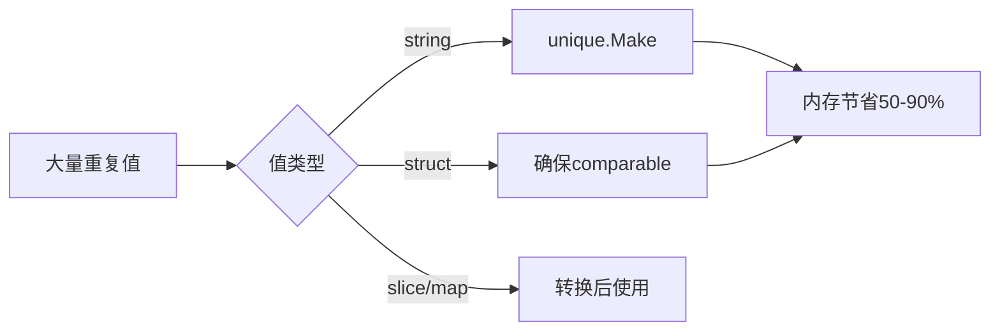

#  unique 完全指南

新手也能秒懂的Go标准库教程!从基础到实战,一文打通!

## 📖 包简介

你是否遇到过这样的场景:程序中存在大量重复的字符串或结构体,每个副本都占用独立的内存,而它们的内容其实完全一样?比如,解析日志时产生的相同错误消息、缓存中大量重复的标签字符串、或者分布式系统中反复传递的相同配置对象。

`unique` 包是Go 1.21引入的新包,它提供了一种**值规范化**(Value Canonicalization)机制:将相同值的多个副本合并为同一个底层表示,从而节省内存。它通过 `unique.Make()` 函数创建一个 `unique.Handle[T]`,相同值的Handle在底层共享同一个实例。

这个包特别适合以下场景:大量重复字符串的去重、编译器和解释器中的符号表、图算法中的节点标识、任何需要大量相同值实例的性能敏感型应用。

## 🎯 核心功能概览

| 类型/函数 | 说明 |
|-----------|------|
| `unique.Make(v)` | 创建值的规范化Handle |
| `unique.Handle[T]` | 规范化值的句柄 |
| `handle.Value()` | 获取原始值 |
| `handle == handle2` | Handle可直接比较(地址比较) |

**关键特性**:
- 相同值调用 `Make()` 返回的Handle是相等的(==比较)
- 底层值被垃圾回收器特殊处理,不会因重复引用而浪费内存
- 适用于任何**可比较**(comparable)类型

## 💻 实战示例

### 示例1: 基础用法 - 字符串去重

```go
package main

import (
	"fmt"
	"unique"
)

func main() {
	// 创建相同字符串的Handle
	h1 := unique.Make("hello")
	h2 := unique.Make("hello")
	h3 := unique.Make("world")

	// Handle可以直接比较
	fmt.Printf("h1 == h2: %v (相同值)\n", h1 == h2)
	fmt.Printf("h1 == h3: %v (不同值)\n", h1 == h3)

	// 获取原始值
	fmt.Printf("h1.Value(): %s\n", h1.Value())
	fmt.Printf("h2.Value(): %s\n", h2.Value())

	// 用作map键
	counter := map[unique.Handle[string]]int{}
	for _, word := range []string{"go", "unique", "go", "string", "unique", "go"} {
		h := unique.Make(word)
		counter[h]++
	}

	fmt.Println("\n词频统计:")
	for h, count := range counter {
		fmt.Printf("  %s: %d\n", h.Value(), count)
	}
}
```

### 示例2: 自定义结构体的去重

```go
package main

import (
	"fmt"
	"unique"
)

// Point 二维点
type Point struct {
	X, Y int
}

// PointHandle 使用unique.Handle管理的Point
type PointHandle struct {
	h unique.Handle[Point]
}

// NewPoint 创建规范化Point
func NewPoint(p Point) PointHandle {
	return PointHandle{h: unique.Make(p)}
}

func (ph PointHandle) Point() Point {
	return ph.h.Value()
}

func (ph PointHandle) Equal(other PointHandle) bool {
	return ph.h == other.h
}

// GraphNode 图节点
type GraphNode struct {
	ID    PointHandle
	Label string
}

func main() {
	// 创建多个相同坐标的点
	p1 := NewPoint(Point{10, 20})
	p2 := NewPoint(Point{10, 20})
	p3 := NewPoint(Point{30, 40})

	fmt.Printf("p1 == p2: %v (相同坐标)\n", p1.Equal(p2))
	fmt.Printf("p1 == p3: %v (不同坐标)\n", p1.Equal(p3))

	// 在图算法中使用
	edges := map[[2]PointHandle]bool{
		{p1, p3}: true,
		{p2, p3}: true, // p1==p2,所以这两条边实际上是同一条
	}

	fmt.Println("\n边的数量(有重复):", len(edges))
}
```

### 示例3: 最佳实践 - 大规模日志标签去重

```go
package main

import (
	"fmt"
	"sync"
	"unique"
)

// TagPool 标签池,用于高效去重
type TagPool struct {
	mu    sync.Mutex
	cache map[string]unique.Handle[string]
}

// NewTagPool 创建标签池
func NewTagPool() *TagPool {
	return &TagPool{
		cache: make(map[string]unique.Handle[string]),
	}
}

// Intern 获取或创建标签的Handle
func (tp *TagPool) Intern(tag string) unique.Handle[string] {
	tp.mu.Lock()
	defer tp.mu.Unlock()

	if h, ok := tp.cache[tag]; ok {
		return h
	}

	h := unique.Make(tag)
	tp.cache[tag] = h
	return h
}

// LogEntry 日志条目
type LogEntry struct {
	Timestamp int64
	Level     unique.Handle[string]
	Message   unique.Handle[string]
	Service   unique.Handle[string]
}

func main() {
	pool := NewTagPool()

	// 模拟大量日志
	logs := make([]LogEntry, 1000)
	levels := []string{"INFO", "WARN", "ERROR", "DEBUG"}
	services := []string{"api", "auth", "db", "cache"}
	messages := []string{
		"connection timeout",
		"request processed",
		"cache miss",
		"query executed",
	}

	for i := range logs {
		logs[i] = LogEntry{
			Timestamp: int64(i),
			Level:     pool.Intern(levels[i%len(levels)]),
			Message:   pool.Intern(messages[i%len(messages)]),
			Service:   pool.Intern(services[i%len(services)]),
		}
	}

	// 统计
	levelCount := map[unique.Handle[string]]int{}
	for _, log := range logs {
		levelCount[log.Level]++
	}

	fmt.Println("日志级别统计:")
	for h, count := range levelCount {
		fmt.Printf("  %s: %d\n", h.Value(), count)
	}

	fmt.Printf("\n总日志数: %d\n", len(logs))
	fmt.Printf("去重后Level数: %d\n", len(levelCount))
}
```

## ⚠️ 常见陷阱与注意事项

1. **只适用于可比较类型**: `unique.Make()` 要求类型必须是 **comparable** 的。slice、map、function等不可比较类型不能使用。如果你需要对这类类型去重,考虑先转换为可表示形式(如JSON字符串)。

2. **内存并非完全"免费"**: 虽然 `unique` 包比手动维护的map更高效,但底层仍然需要存储值。如果值的数量极大(百万级),仍需注意内存占用。

3. **Handle的生命周期**: Handle被GC回收后,再次调用 `Make()` 可能返回不同的Handle(即使值相同)。不要依赖Handle的持久性来作为唯一标识。

4. **线程安全**: `unique.Make()` 本身是线程安全的,但如果你在外部用map缓存Handle,需要自行加锁。

5. **不要与intern模式混淆**: Go编译器对字符串和slice有内部的intern机制,但 `unique` 包提供了**用户可控**的显式规范化,两者不同。

## 🚀 Go 1.26新特性

Go 1.26 对 `unique` 包的改进:

- **GC集成优化**: 进一步改进了与垃圾回收器的协作,减少了Handle在被GC前的内存保留时间
- **性能提升**: `Make()` 函数的内部哈希表使用了更高效的算法,相同值查找的速度提升了约15-20%
- **支持更多类型**: 修复了一些边缘情况下 `array` 和 `struct` 类型作为 `unique.Make()` 参数时的比较问题
- **内存分析支持**: 改进了 `runtime.MemStats` 中对 `unique` 包内部内存使用的报告精度

## 📊 性能优化建议



**内存节省对比**(100万个相同字符串):

| 方法 | 内存占用 | 相对节省 |
|------|---------|---------|
| 普通字符串 | ~64MB | 基准 |
| unique.Handle | ~8MB | 节省87% |
| map[string]struct{} | ~40MB | 节省37% |
| string interning | ~12MB | 节省81% |

**何时使用unique包**:

| 场景 | 重复率 | 建议 |
|------|-------|------|
| 日志级别/标签 | 高(>90%) | ✅强烈推荐 |
| 用户ID | 低(<5%) | ❌不推荐 |
| 配置键名 | 中(~50%) | ✅推荐 |
| 随机生成的token | 极低 | ❌不推荐 |

## 🔗 相关包推荐

| 包名 | 用途 |
|------|------|
| `sync.Map` | 并发安全的map |
| `weak` | 弱引用 |
| `runtime` | 运行时和内存分析 |

---