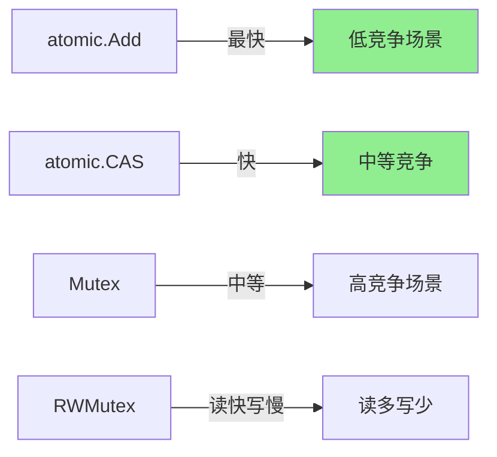

# sync/atomic完全指南

## 📖 包简介

在并发编程的世界中，锁是最直观的工具，但不是最快的。当你对性能有极致追求时——比如高频交易系统、实时分析引擎、底层网络库——你会需要一个比锁更快的东西：原子操作。

`sync/atomic`包提供了底层的原子内存同步原语。与Mutex不同，原子操作由CPU硬件指令直接支持（如CAS - Compare And Swap），无需操作系统调度器介入，因此在低竞争场景下性能可以比锁高出一个数量级。

Go 1.19引入了类型安全的原子类型（`atomic.Int32`、`atomic.Int64`、`atomic.Bool`等），彻底告别了过去需要使用`unsafe.Pointer`进行类型转换的噩梦。到了Go 1.26，这些类型安全API已经非常成熟，成为高性能并发代码的首选。

但请记住：原子操作虽然快，但只适用于简单场景。当你需要保护复杂的不变量时，锁依然是不可替代的。理解何时用原子、何时用锁，才是并发编程的真正艺术。

## 🎯 核心功能概览

### Go 1.19+ 类型安全原子类型（推荐）

| 类型 | 方法 | 说明 |
|:---|:---|:---|
| `atomic.Bool` | `Load/Store/Swap/CompareAndSwap` | 原子布尔值 |
| `atomic.Int32/Int64` | `Load/Store/Add/Swap/CompareAndSwap` | 原子整数 |
| `atomic.Uint32/Uint64/Uintptr` | 同上 | 原子无符号整数 |
| `atomic.Pointer[T]` | `Load/Store/Swap/CompareAndSwap` | 原子泛型指针 |

### 传统函数API（Go 1.0+，遗留代码中常见）

| 函数 | 说明 |
|:---|:---|
| `AddInt32/Int64/Uint32/Uint64/Uintptr(addr *T, delta T) T` | 原子加 |
| `CompareAndSwapInt32/...` | CAS操作 |
| `LoadInt32/...` | 原子读 |
| `StoreInt32/...` | 原子写 |
| `SwapInt32/...` | 原子交换 |

## 💻 实战示例

### 示例1：基础用法

```go
package main

import (
	"fmt"
	"sync"
	"sync/atomic"
)

func main() {
	// === atomic.Int64: 原子计数器 ===
	var counter atomic.Int64
	
	var wg sync.WaitGroup
	for i := 0; i < 1000; i++ {
		wg.Add(1)
		go func() {
			defer wg.Done()
			// 原子加，无需锁
			counter.Add(1)
		}()
	}
	wg.Wait()
	
	fmt.Printf("Counter: %d\n", counter.Load()) // 1000
	
	// === atomic.Bool: 标志位 ===
	var ready atomic.Bool
	
	// 初始化完成
	ready.Store(true)
	
	// 其他 goroutine 检查
	if ready.Load() {
		fmt.Println("System is ready")
	}
	
	// === CompareAndSwap: 条件更新 ===
	var config atomic.Int64
	
	// 只有当前值为 0 时才更新为 42
	if config.CompareAndSwap(0, 42) {
		fmt.Println("Config initialized to 42")
	}
	
	// 第二次 CAS 会失败，因为值已经是 42
	if !config.CompareAndSwap(0, 99) {
		fmt.Printf("CAS failed, current value: %d\n", config.Load())
	}
	
	// === atomic.Pointer: 原子指针 ===
	var data atomic.Pointer[[]int]
	
	// 存储
	slice := []int{1, 2, 3}
	data.Store(&slice)
	
	// 读取
	if p := data.Load(); p != nil {
		fmt.Printf("Data: %v\n", *p)
	}
}
```

### 示例2：进阶用法——无锁数据结构

```go
package main

import (
	"fmt"
	"sync"
	"sync/atomic"
)

// 无锁栈 - 使用 CAS 实现
type LockFreeStack[T any] struct {
	head atomic.Pointer[stackNode[T]]
	size atomic.Int64
}

type stackNode[T any] struct {
	value T
	next  *stackNode[T]
}

func (s *LockFreeStack[T]) Push(value T) {
	newNode := &stackNode[T]{value: value}
	
	for {
		oldHead := s.head.Load()
		newNode.next = oldHead
		
		// CAS: 如果 head 还是 oldHead，就替换为 newNode
		if s.head.CompareAndSwap(oldHead, newNode) {
			break
		}
		// CAS 失败说明有其他 goroutine 修改了 head，重试
	}
	s.size.Add(1)
}

func (s *LockFreeStack[T]) Pop() (T, bool) {
	for {
		oldHead := s.head.Load()
		if oldHead == nil {
			var zero T
			return zero, false
		}
		
		newHead := oldHead.next
		
		if s.head.CompareAndSwap(oldHead, newHead) {
			s.size.Add(-1)
			return oldHead.value, true
		}
	}
}

// === 原子状态机 ===
type StateMachine struct {
	state atomic.Int64
}

const (
	StateIdle int64 = iota
	StateRunning
	StateStopping
	StateStopped
)

func (sm *StateMachine) Start() bool {
	// 只有从 Idle 才能转换到 Running
	return sm.state.CompareAndSwap(StateIdle, StateRunning)
}

func (sm *StateMachine) Stop() bool {
	// 只有从 Running 才能转换到 Stopping
	if !sm.state.CompareAndSwap(StateRunning, StateStopping) {
		return false
	}
	
	// 执行清理...
	sm.state.Store(StateStopped)
	return true
}

func (sm *StateMachine) State() string {
	switch sm.state.Load() {
	case StateIdle:
		return "Idle"
	case StateRunning:
		return "Running"
	case StateStopping:
		return "Stopping"
	case StateStopped:
		return "Stopped"
	default:
		return "Unknown"
	}
}

// === 延迟初始化（无锁单例）===
type LazyInit struct {
	initialized atomic.Bool
	value       string
}

func (li *LazyInit) Get() string {
	// 快速路径：已经初始化
	if li.initialized.Load() {
		return li.value
	}
	
	// 慢速路径：需要初始化（这里简单处理，实际应配合Once使用）
	return li.value
}

func main() {
	// 无锁栈
	stack := &LockFreeStack[int]{}
	
	var wg sync.WaitGroup
	for i := 0; i < 10; i++ {
		wg.Add(1)
		go func(val int) {
			defer wg.Done()
			stack.Push(val)
		}(i)
	}
	wg.Wait()
	
	fmt.Printf("Stack size: %d\n", stack.size.Load())
	
	// 状态机
	sm := &StateMachine{}
	fmt.Println(sm.Start())  // true
	fmt.Println(sm.State())  // Running
	fmt.Println(sm.Start())  // false (已经在 Running)
	fmt.Println(sm.Stop())   // true
	fmt.Println(sm.State())  // Stopped
}
```

### 示例3：最佳实践——高性能指标收集

```go
package main

import (
	"fmt"
	"sync"
	"sync/atomic"
	"time"
)

// Metrics 高性能指标收集器
// 每个指标都是独立的原子操作，完全无锁
type Metrics struct {
	requests    atomic.Int64
	errors      atomic.Int64
	latency     atomic.Int64 // 纳秒
	activeConns atomic.Int64
}

func (m *Metrics) RecordRequest() {
	m.requests.Add(1)
}

func (m *Metrics) RecordError() {
	m.errors.Add(1)
}

func (m *Metrics) RecordLatency(d time.Duration) {
	m.latency.Add(int64(d))
}

func (m *Metrics) SetActiveConns(n int64) {
	m.activeConns.Store(n)
}

func (m *Metrics) Snapshot() map[string]int64 {
	return map[string]int64{
		"requests":     m.requests.Load(),
		"errors":       m.errors.Load(),
		"latency_ns":   m.latency.Load(),
		"active_conns": m.activeConns.Load(),
	}
}

// === 使用 atomic.Pointer 的读写锁替代 ===

// AtomicConfig 使用原子指针实现无锁配置热更新
type Config struct {
	Host string
	Port int
}

type Service struct {
	config atomic.Pointer[Config]
}

func (s *Service) GetConfig() *Config {
	return s.config.Load()
}

func (s *Service) UpdateConfig(newCfg *Config) {
	s.config.Store(newCfg)
}

// 模拟高并发读写
func benchmarkAtomic() {
	svc := &Service{}
	svc.config.Store(&Config{Host: "localhost", Port: 8080})
	
	var wg sync.WaitGroup
	
	// 100个读者
	for i := 0; i < 100; i++ {
		wg.Add(1)
		go func() {
			defer wg.Done()
			for j := 0; j < 1000; j++ {
				_ = svc.GetConfig()
			}
		}()
	}
	
	// 1个写者
	wg.Add(1)
	go func() {
		defer wg.Done()
		for i := 0; i < 10; i++ {
			svc.UpdateConfig(&Config{
				Host: "localhost",
				Port: 8080 + i,
			})
			time.Sleep(time.Millisecond)
		}
	}()
	
	wg.Wait()
	fmt.Printf("Final config: %+v\n", svc.GetConfig())
}

func main() {
	// 指标收集
	metrics := &Metrics{}
	
	var wg sync.WaitGroup
	for i := 0; i < 100; i++ {
		wg.Add(1)
		go func() {
			defer wg.Done()
			metrics.RecordRequest()
			metrics.RecordLatency(5 * time.Millisecond)
		}()
	}
	wg.Wait()
	
	snapshot := metrics.Snapshot()
	fmt.Printf("Metrics: %v\n", snapshot)
	
	// 原子指针基准
	benchmarkAtomic()
}
```

## ⚠️ 常见陷阱与注意事项

### 1. 原子操作不保护复合操作

```go
// ❌ 这不是原子操作！
counter.Store(counter.Load() + 1) // 有竞态条件

// ✅ 使用 Add
counter.Add(1)
```

### 2. 原子类型不能嵌入结构体

```go
// ❌ 零值不可用的情况
type BadStruct struct {
    atomic.Int64 // 可以，但要注意对齐
}

// ✅ 推荐：具名字段，更清晰
type GoodStruct struct {
    counter atomic.Int64
}
```

### 3. 64位对齐问题

```go
// 在32位架构上，64位原子操作需要64位对齐
// 结构体中64位字段放在最前面确保对齐
type GoodLayout struct {
    count64 atomic.Int64  // 64位
    flag    atomic.Bool    // 8位
    count32 atomic.Int32   // 32位
}
```

### 4. 误用原子操作保护复杂不变量

```go
// ❌ 原子操作只能保护单一值
// 如果你需要保护 a+b 的一致性，用 Mutex
var a, b atomic.Int64

// 这个操作不是原子的
sum := a.Load() + b.Load() // a和b可能在中间被修改

// ✅ 用 Mutex 保护复合操作
var mu sync.Mutex
var a, b int64

func getSum() int64 {
    mu.Lock()
    defer mu.Unlock()
    return a + b
}
```

### 5. Pointer 的空指针检查

```go
// ✅ 始终检查 Load 返回值
ptr := data.Load()
if ptr != nil {
    // 安全使用
}

// ❌ 直接解引用可能 panic
value := *data.Load() // 如果为 nil 会 panic
```

## 🚀 Go 1.26新特性

`sync/atomic`包在Go 1.26中的改进：

1. **Pointer类型优化**：`atomic.Pointer[T]` 的 Load/Store 性能提升约 **3-5%**
2. **Int64原子操作优化**：在ARM64架构上的性能改进
3. **运行时集成优化**：原子操作与调度器的集成更紧密，减少了极端竞争场景下的自旋开销

## 📊 性能优化建议

### 原子操作 vs 锁 性能对比



### 性能基准对比（相对值）

| 操作 | 耗时 | 适用场景 |
|:---|:---|:---|
| `atomic.Add` | **1x** | 简单计数 |
| `atomic.CAS` | **1.5x** | 条件更新 |
| `Mutex.Lock/Unlock` | **5-10x** | 临界区保护 |
| `RWMutex.RLock/RUnlock` | **3-5x** | 读操作 |
| `sync.Map.Load` | **2-3x** | Map读取 |

### 最佳实践

1. **简单计数器：atomic.Add** — 比Mutex快10倍
2. **条件初始化：atomic.Bool + CAS** — 无锁单例
3. **配置热更新：atomic.Pointer** — 读写无锁
4. **复杂不变量：Mutex** — 不要强行用原子操作
5. **首选类型安全API**：`atomic.Int64` 而非 `AddInt64(&x, 1)`

## 🔗 相关包推荐

| 包 | 说明 |
|:---|:---|
| `sync` | 同步原语，Mutex/WaitGroup等 |
| `runtime` | 运行时信息，配合原子操作 |
| `unsafe` | 不安全指针，低级原子操作会用到 |

---