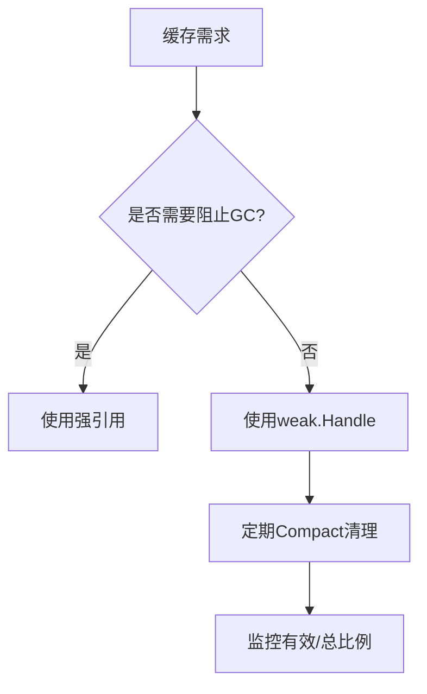

#  weak 完全指南

新手也能秒懂的Go标准库教程!从基础到实战,一文打通!

## 📖 包简介

在Go中,垃圾回收器(GC)非常智能——只要有一个引用指向某个对象,该对象就不会被回收。但有时候,你恰恰需要一种"**不强占对象**"的引用方式:比如缓存中保留对象的引用,但又不希望仅仅因为缓存的存在而阻止对象被GC。

这就是 `weak` 包的作用。它是Go 1.23引入的新包,提供了**弱引用**(Weak Reference)机制。弱引用不会阻止GC回收目标对象——当对象不再被任何强引用指向时,即使weak.Handle仍然存在,对象也会被回收,Handle变为"零值"状态。

这个包的典型应用场景包括:对象缓存(不影响GC)、观察者模式(避免内存泄漏)、关联元数据(不阻止主对象回收)等。如果你曾在Go中因为"忘记删除引用"而遭遇内存泄漏,weak包就是你的救星。

## 🎯 核心功能概览

| 类型/函数 | 说明 |
|-----------|------|
| `weak.Make(ptr)` | 从指针创建弱引用Handle |
| `weak.Handle[T]` | 弱引用句柄 |
| `handle.Value()` | 获取值(可能已被回收) |
| `handle != zero` | 检查Handle是否仍有效 |

**核心语义**:
- 弱引用**不阻止**GC回收目标对象
- `Value()` 返回 `(T, bool)`,bool表示对象是否仍然存在
- 只有指向**堆分配**对象的指针才能创建弱引用

## 💻 实战示例

### 示例1: 基础用法

```go
package main

import (
	"fmt"
	"runtime"
	"weak"
)

func main() {
	// 创建一个对象
	obj := &Data{ID: 42, Name: "example"}

	// 创建弱引用
	h := weak.Make(obj)

	// 对象仍然存在
	if val, ok := h.Value(); ok {
		fmt.Printf("对象存在: ID=%d, Name=%s\n", val.ID, val.Name)
	}

	// 释放强引用
	obj = nil

	// 强制GC
	runtime.GC()

	// 对象可能已被回收
	if val, ok := h.Value(); ok {
		fmt.Printf("对象仍在: ID=%d\n", val.ID)
	} else {
		fmt.Println("对象已被GC回收")
	}
}

type Data struct {
	ID   int
	Name string
}
```

### 示例2: 对象关联元数据(不影响GC)

```go
package main

import (
	"fmt"
	"runtime"
	"weak"
)

// User 用户对象
type User struct {
	ID   int
	Name string
}

// UserMetadata 用户元数据(使用弱引用,不阻止User被GC)
type UserMetadata struct {
	userHandle weak.Handle[User]
	ExtraInfo  string
}

// MetadataRegistry 元数据注册表
type MetadataRegistry struct {
	metadata []*UserMetadata
}

// Register 为用户注册元数据
func (r *MetadataRegistry) Register(user *User, info string) {
	r.metadata = append(r.metadata, &UserMetadata{
		userHandle: weak.Make(user),
		ExtraInfo:  info,
	})
}

// Cleanup 清理已回收用户的元数据
func (r *MetadataRegistry) Cleanup() int {
	alive := 0
	writeIdx := 0

	for _, m := range r.metadata {
		if _, ok := m.userHandle.Value(); ok {
			r.metadata[writeIdx] = m
			writeIdx++
			alive++
		}
	}

	// 截断slice
	r.metadata = r.metadata[:writeIdx]
	return len(r.metadata) - alive // 返回清理数量
}

func main() {
	registry := &MetadataRegistry{}

	// 注册用户
	user1 := &User{ID: 1, Name: "Alice"}
	user2 := &User{ID: 2, Name: "Bob"}
	user3 := &User{ID: 3, Name: "Charlie"}

	registry.Register(user1, "admin")
	registry.Register(user2, "editor")
	registry.Register(user3, "viewer")

	fmt.Printf("注册后元数据数量: %d\n", len(registry.metadata))

	// 释放user2
	user2 = nil
	runtime.GC()

	// 清理
	cleaned := registry.Cleanup()
	fmt.Printf("清理后元数据数量: %d (清理了 %d 个)\n",
		len(registry.metadata), cleaned)
}
```

### 示例3: 最佳实践 - 安全的对象缓存

```go
package main

import (
	"fmt"
	"runtime"
	"sync"
	"weak"
)

// ObjectCache 不阻止GC的对象缓存
type ObjectCache struct {
	mu    sync.RWMutex
	items []weak.Handle[string]
}

// NewObjectCache 创建缓存
func NewObjectCache() *ObjectCache {
	return &ObjectCache{
		items: make([]weak.Handle[string], 0, 128),
	}
}

// Add 添加到缓存(不阻止GC)
func (c *ObjectCache) Add(s *string) {
	c.mu.Lock()
	defer c.mu.Unlock()

	c.items = append(c.items, weak.Make(s))
}

// GetValidCount 获取仍然有效的缓存数量
func (c *ObjectCache) GetValidCount() int {
	c.mu.RLock()
	defer c.mu.RUnlock()

	count := 0
	for _, h := range c.items {
		if _, ok := h.Value(); ok {
			count++
		}
	}
	return count
}

// Compact 清理已回收的项
func (c *ObjectCache) Compact() {
	c.mu.Lock()
	defer c.mu.Unlock()

	writeIdx := 0
	for _, h := range c.items {
		if _, ok := h.Value(); ok {
			c.items[writeIdx] = h
			writeIdx++
		}
	}
	c.items = c.items[:writeIdx]
}

func main() {
	cache := NewObjectCache()

	// 添加一些对象
	objects := make([]*string, 10)
	for i := range objects {
		s := fmt.Sprintf("object-%d", i)
		objects[i] = &s
		cache.Add(objects[i])
	}

	fmt.Printf("缓存数量: %d, 有效: %d\n",
		10, cache.GetValidCount())

	// 释放一半
	for i := 0; i < 5; i++ {
		objects[i] = nil
	}

	runtime.GC()

	fmt.Printf("释放一半后, 有效: %d\n", cache.GetValidCount())

	cache.Compact()
	fmt.Printf("清理后缓存数量: %d\n", cache.GetValidCount())
}
```

## ⚠️ 常见陷阱与注意事项

1. **仅限堆分配对象**: `weak.Make()` 只能对指向**堆分配**对象的指针调用。如果你对栈上的局部变量指针调用,行为是未定义的。Go编译器通常能逃逸分析将需要的对象分配到堆上,但需注意。

2. **Value()返回双值**: `handle.Value()` 返回 `(T, bool)`,必须检查bool值!如果对象已被回收,返回的是 `T` 的零值和 `false`。忽略bool会导致使用零值而不自知。

3. **不是万能内存泄漏解药**: 弱引用只解决"引用阻止GC"的问题。如果你在其他地方(如全局变量、channel)仍有强引用,对象还是不会被回收。

4. **性能开销**: 弱引用内部需要额外的运行时支持,创建和访问的成本比普通引用高。在性能敏感路径中谨慎使用。

5. **Handle不能复制后使用**: Handle是值类型,复制后仍然指向同一个弱引用。但Handle本身的生命周期与目标对象无关——对象被回收后,Handle仍然存在(只是Value()返回false)。

## 🚀 Go 1.26新特性

Go 1.26 对 `weak` 包的改进:

- **GC性能优化**: 进一步降低了弱引用对GC周期的影响,减少了weak.Handle在GC扫描时的额外开销
- **更好的编译器检查**: Go 1.26编译器对 `weak.Make()` 的参数进行了更严格的逃逸分析检查,在编译时发现更多无效用法
- **Value()优化**: 优化了 `Value()` 方法的实现,减少了对象已被回收情况下的运行时开销
- **文档增强**: 增加了更多关于使用场景和限制的详细文档,特别是关于栈/堆分配的说明

## 📊 性能优化建议



**性能对比**(创建和访问):

| 操作 | 普通引用 | weak.Handle |
|------|---------|-------------|
| 创建 | ~1ns | ~50ns |
| 访问 | ~1ns | ~10ns |
| GC影响 | 引用计数+1 | 无阻止GC影响 |

**何时使用weak包**:

| 场景 | 推荐 | 原因 |
|------|------|------|
| 对象缓存 | ✅ | 不影响GC |
| 观察者列表 | ✅ | 避免泄漏 |
| 关联元数据 | ✅ | 主对象回收时自动清理 |
| 核心数据结构 | ❌ | 需要强引用保证 |
| 性能敏感路径 | ❌ | 额外开销不可接受 |

## 🔗 相关包推荐

| 包名 | 用途 |
|------|------|
| `unique` | 值规范化 |
| `runtime` | GC控制 |
| `sync` | 并发安全 |

---