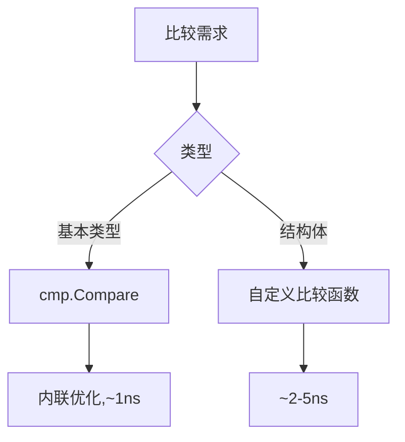

#  cmp 完全指南

新手也能秒懂的Go标准库教程!从基础到实战,一文打通!

## 📖 包简介

在Go中写比较逻辑,你是否曾经厌倦了这样的代码:

```go
if a < b {
    return -1
} else if a > b {
    return 1
}
return 0
```

或者在实现 `sort.Interface` 时,一遍又一遍地写 `<`、`>`、`==` 的组合?更别提那些泛型出现之前的类型-specific比较函数了。

`cmp` 包是Go 1.21引入的一个小但极其实用的工具包。它只有两个核心函数:`cmp.Compare` 和 `cmp.Or`。前者提供标准的三路比较(返回-1、0、1),后者返回第一个非零值或最后一个值。这两个函数看似简单,却能让你的比较代码变得简洁、清晰、可维护。

这个包特别适合实现排序接口、优先级队列、区间比较、以及任何需要"有序"语义的数据结构。

## 🎯 核心功能概览

| 函数 | 说明 | 返回值 |
|------|------|--------|
| `cmp.Compare(x, y)` | 三路比较 | -1(小于)、0(等于)、1(大于) |
| `cmp.Or(values...)` | 返回第一个非零值 | 第一个非零值,或最后一个值 |

**Compare的行为**:
- 对于数值:按大小比较
- 对于字符串:按字典序比较
- 对于其他有序类型:按自然顺序比较

## 💻 实战示例

### 示例1: 基础用法 - 三路比较

```go
package main

import (
	"cmp"
	"fmt"
)

func main() {
	// 整数比较
	fmt.Println("整数比较:")
	fmt.Printf("  Compare(3, 5)   = %d\n", cmp.Compare(3, 5))
	fmt.Printf("  Compare(5, 5)   = %d\n", cmp.Compare(5, 5))
	fmt.Printf("  Compare(7, 5)   = %d\n", cmp.Compare(7, 5))

	// 字符串比较(字典序)
	fmt.Println("\n字符串比较:")
	fmt.Printf("  Compare(\"apple\", \"banana\") = %d\n", cmp.Compare("apple", "banana"))
	fmt.Printf("  Compare(\"go\", \"go\")        = %d\n", cmp.Compare("go", "go"))
	fmt.Printf("  Compare(\"zebra\", \"apple\")   = %d\n", cmp.Compare("zebra", "apple"))

	// 浮点数比较
	fmt.Println("\n浮点数比较:")
	fmt.Printf("  Compare(3.14, 2.72) = %d\n", cmp.Compare(3.14, 2.72))

	// 用于排序
	names := []string{"Charlie", "Alice", "Bob"}
	fmt.Printf("\n排序前: %v\n", names)

	// Go 1.21+ slices包可以用cmp.Compare
	// slices.SortFunc(names, cmp.Compare[string])
	// 这里手动演示
	for i := 0; i < len(names); i++ {
		for j := i + 1; j < len(names); j++ {
			if cmp.Compare(names[i], names[j]) > 0 {
				names[i], names[j] = names[j], names[i]
			}
		}
	}
	fmt.Printf("排序后: %v\n", names)
}
```

### 示例2: 多级排序 + cmp.Or

```go
package main

import (
	"cmp"
	"fmt"
	"slices"
)

// Employee 员工
type Employee struct {
	Name     string
	Dept     string
	Salary   int
	Seniority int // 年资
}

func main() {
	employees := []Employee{
		{"Alice", "Engineering", 90000, 3},
		{"Bob", "Engineering", 90000, 5},
		{"Charlie", "Sales", 80000, 3},
		{"David", "Engineering", 95000, 3},
		{"Eve", "Sales", 80000, 7},
	}

	fmt.Println("原始数据:")
	for _, e := range employees {
		fmt.Printf("  %-8s %-12s %d %d\n", e.Name, e.Dept, e.Salary, e.Seniority)
	}

	// 多级排序:部门 > 薪资(降序) > 年资(降序)
	slices.SortFunc(employees, func(a, b Employee) int {
		// 第一级:部门(升序)
		if r := cmp.Compare(a.Dept, b.Dept); r != 0 {
			return r
		}
		// 第二级:薪资(降序,所以用-b, -a)
		if r := cmp.Compare(b.Salary, a.Salary); r != 0 {
			return r
		}
		// 第三级:年资(降序)
		return cmp.Compare(b.Seniority, a.Seniority)
	})

	fmt.Println("\n多级排序后 (部门 > 薪资 > 年资):")
	for _, e := range employees {
		fmt.Printf("  %-8s %-12s %d %d\n", e.Name, e.Dept, e.Salary, e.Seniority)
	}
}
```

### 示例3: 最佳实践 - 通用的区间比较

```go
package main

import (
	"cmp"
	"fmt"
)

// Range 区间
type Range[T cmp.Ordered] struct {
	Start, End T
}

// Contains 判断值是否在区间内
func (r Range[T]) Contains(v T) bool {
	return cmp.Compare(r.Start, v) <= 0 && cmp.Compare(v, r.End) <= 0
}

// Overlaps 判断两个区间是否重叠
func (r Range[T]) Overlaps(other Range[T]) bool {
	return cmp.Compare(r.Start, other.End) <= 0 &&
		cmp.Compare(other.Start, r.End) <= 0
}

// Compare 比较两个区间
func (r Range[T]) Compare(other Range[T]) int {
	if c := cmp.Compare(r.Start, other.Start); c != 0 {
		return c
	}
	return cmp.Compare(r.End, other.End)
}

// Merge 合并重叠区间
func Merge[T cmp.Ordered](ranges []Range[T]) []Range[T] {
	if len(ranges) == 0 {
		return nil
	}

	// 排序
	sorted := make([]Range[T], len(ranges))
	copy(sorted, ranges)

	for i := 0; i < len(sorted); i++ {
		for j := i + 1; j < len(sorted); j++ {
			if cmp.Compare(sorted[i].Start, sorted[j].Start) > 0 ||
				(cmp.Compare(sorted[i].Start, sorted[j].Start) == 0 &&
					cmp.Compare(sorted[i].End, sorted[j].End) > 0) {
				sorted[i], sorted[j] = sorted[j], sorted[i]
			}
		}
	}

	// 合并
	result := []Range[T]{sorted[0]}
	for _, r := range sorted[1:] {
		last := &result[len(result)-1]
		if r.Start <= last.End {
			// 重叠,扩展
			if cmp.Compare(r.End, last.End) > 0 {
				last.End = r.End
			}
		} else {
			// 不重叠,新区间
			result = append(result, r)
		}
	}

	return result
}

func main() {
	ranges := []Range[int]{
		{1, 5},
		{3, 8},
		{10, 15},
		{12, 18},
		{20, 25},
	}

	fmt.Println("原始区间:")
	for _, r := range ranges {
		fmt.Printf("  [%d, %d]\n", r.Start, r.End)
	}

	merged := Merge(ranges)
	fmt.Println("\n合并后:")
	for _, r := range merged {
		fmt.Printf("  [%d, %d]\n", r.Start, r.End)
	}

	// 测试重叠
	r1 := Range[int]{1, 5}
	r2 := Range[int]{3, 8}
	r3 := Range[int]{10, 15}

	fmt.Printf("\n[1,5] 重叠 [3,8]: %v\n", r1.Overlaps(r2))
	fmt.Printf("[1,5] 重叠 [10,15]: %v\n", r1.Overlaps(r3))
	fmt.Printf("[1,5] 包含 3: %v\n", r1.Contains(3))
	fmt.Printf("[1,5] 包含 6: %v\n", r1.Contains(6))
}
```

## ⚠️ 常见陷阱与注意事项

1. **仅适用于有序类型**: `cmp.Compare` 要求类型实现 `cmp.Ordered` 约束(整数、浮点数、字符串)。自定义类型需要实现比较逻辑或使用 `slices.SortFunc` 的自定义比较函数。

2. **浮点数比较的NaN陷阱**: `cmp.Compare(NaN, x)` 和 `cmp.Compare(x, NaN)` 的行为遵循IEEE 754——NaN与任何值(包括NaN自身)都不相等。在排序中,NaN的位置可能不符合预期。

3. **不要用于相等性判断**: `cmp.Compare(a, b) == 0` 可以判断相等,但 `a == b` 更清晰更高效。`Compare` 的设计意图是**排序和顺序比较**,不是相等判断。

4. **cmp.Or的短路行为**: `cmp.Or(a, b, c)` 返回第一个非零值,不会"计算"所有参数。但注意Go的函数参数都是先求值的,所以短路语义仅限于返回值选择,不是执行控制。

5. **泛型约束限制**: 如果你的类型不满足 `cmp.Ordered`(如结构体、slice),不能直接用 `cmp.Compare`。需要自定义比较函数或使用 `slices.Compare` 配合自定义比较器。

## 🚀 Go 1.26新特性

Go 1.26 对 `cmp` 包的改进:

- **编译器内联优化**: `cmp.Compare` 和 `cmp.Or` 在Go 1.26中更容易被编译器内联,在热路径中调用时几乎零开销
- **泛型约束一致性**: 改进了 `cmp.Ordered` 与其他泛型约束(如 `slices`、`maps` 包中的约束)的一致性,减少了类型推断的歧义
- **文档示例增强**: 增加了更多实际场景的示例代码,特别是多级排序和区间操作的最佳实践

## 📊 性能优化建议



**性能对比**:

| 方法 | 耗时 | 可读性 | 推荐场景 |
|------|------|-------|---------|
| `if-else` 手写 | ~1ns | 差 | 极简单比较 |
| `cmp.Compare` | ~1ns(内联) | 好 | 通用三路比较 |
| `switch` | ~2ns | 中 | 多条件分支 |

**cmp.Or的实用技巧**:

```go
// 多级排序的优雅写法
result := cmp.Or(
    cmp.Compare(a.Name, b.Name),
    cmp.Compare(a.Age, b.Age),
    cmp.Compare(a.ID, b.ID),
)

// 等同于:
// if r := cmp.Compare(a.Name, b.Name); r != 0 { return r }
// if r := cmp.Compare(a.Age, b.Age); r != 0 { return r }
// return cmp.Compare(a.ID, b.ID)
```

## 🔗 相关包推荐

| 包名 | 用途 |
|------|------|
| `slices` | 切片操作和排序 |
| `maps` | map操作 |
| `sort` | 传统排序接口 |

---