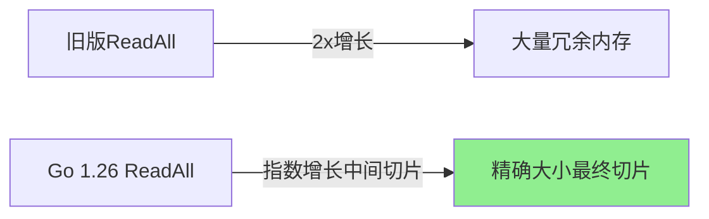
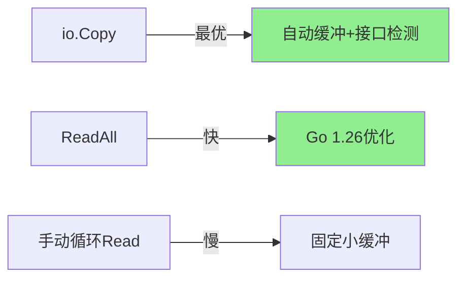

# io完全指南

## 📖 包简介

如果说Go的哲学是"少即是多"，那么`io`包就是这一哲学的最佳体现。整个包只有几个接口和少量函数，却构成了Go I/O操作的基石。`io.Reader`和`io.Writer`这两个简单接口，统一了文件读写、网络请求、内存缓冲、加密流等几乎所有I/O场景。

为什么一个HTTP响应、一个文件句柄、一个TCP连接、甚至一个内存中的bytes.Buffer都能用同样的`Read`和`Write`方法来操作？因为它们都实现了`io.Reader`和`io.Writer`接口。这种设计使得Go的代码可以轻松复用，一个处理`io.Reader`的函数可以同时处理文件、网络、内存等各种数据源。

到了Go 1.26，`io.ReadAll`迎来了重大性能优化，底层内存分配策略全面升级，读取速度提升约2倍，内存占用减少约50%。这是`io`包多年来最重要的性能改进之一。

## 🎯 核心功能概览

### 核心接口

| 接口 | 方法 | 说明 |
|:---|:---|:---|
| **Reader** | `Read(p []byte) (n int, err error)` | 读取数据 |
| **Writer** | `Write(p []byte) (n int, err error)` | 写入数据 |
| **Closer** | `Close() error` | 关闭资源 |
| **Seeker** | `Seek(offset int64, whence int) (int64, error)` | 定位 |
| **ReaderFrom** | `ReadFrom(r Reader) (n int64, err error)` | 从Reader读取 |
| **WriterTo** | `WriteTo(w Writer) (n int64, err error)` | 写入Writer |
| **ReaderAt** | `ReadAt(p []byte, off int64) (n int, err error)` | 从偏移读取 |
| **WriterAt** | `WriteAt(p []byte, off int64) (n int, err error)` | 从偏移写入 |
| **ByteReader/Writer** | `ReadByte/WriteByte` | 单字节操作 |
| **RuneReader** | `ReadRune() (r rune, size int, err error)` | 单字符操作 |
| **ByteScanner** | ByteReader + `UnreadByte` | 可回退单字节 |
| **ReadCloser** | Reader + Closer | 可关闭的Reader |
| **WriteCloser** | Writer + Closer | 可关闭的Writer |
| **ReadWriteCloser** | ReadWriter + Closer | 可关闭的读写 |

### 实用函数

| 函数 | 说明 |
|:---|:---|
| `Copy(dst Writer, src Reader) (written int64, err error)` | 复制数据 |
| `CopyN(dst, src, n)` | 复制N字节 |
| `ReadAll(r Reader) ([]byte, error)` | 读取所有数据 |
| `ReadFull(r, buf)` | 精确读取到buf满 |
| `ReadAtLeast(r, buf, min)` | 至少读取min字节 |
| `WriteString(w, s)` | 高效写入字符串 |
| `Pipe()` | 创建内存管道 |

### 预定义变量

| 变量 | 说明 |
|:---|:---|
| `EOF` | 文件结束标记 |
| `ErrShortWrite` | 写入字节数少于预期 |
| `ErrShortBuffer` | 缓冲区不足 |

## 💻 实战示例

### 示例1：基础用法

```go
package main

import (
	"bytes"
	"fmt"
	"io"
	"os"
	"strings"
)

func main() {
	// === Reader 示例 ===
	
	// strings.Reader 实现 io.Reader
	reader := strings.NewReader("Hello, Go I/O!")
	
	// 基础读取
	buf := make([]byte, 5)
	n, err := reader.Read(buf)
	fmt.Printf("Read %d bytes: %s\n", n, buf[:n])
	fmt.Printf("Error: %v\n", err) // <nil>
	
	// 读取到 EOF
	for {
		n, err = reader.Read(buf)
		if err == io.EOF {
			fmt.Println("Reached EOF")
			break
		}
		if n > 0 {
			fmt.Printf("Got: %s\n", buf[:n])
		}
	}
	
	// === Writer 示例 ===
	
	var buf2 bytes.Buffer
	
	// Write
	n, _ = buf2.Write([]byte("Hello"))
	buf2.Write([]byte(", "))
	
	// WriteString（更高效）
	io.WriteString(&buf2, "World!")
	
	fmt.Println(buf2.String()) // Hello, World!
	
	// === 组合接口 ===
	
	// ReadCloser: 常见于 HTTP 响应体
	// 模拟一个
	rc := io.NopCloser(strings.NewReader("data"))
	defer rc.Close()
	
	data, _ := io.ReadAll(rc)
	fmt.Printf("ReadCloser data: %s\n", data)
}
```

### 示例2：进阶用法——io.Copy与管道

```go
package main

import (
	"bytes"
	"fmt"
	"io"
	"os"
	"strings"
)

// === io.Copy: 高效数据复制 ===
func copyDemo() error {
	// 从字符串Reader复制到bytes.Buffer
	src := strings.NewReader("This is source data")
	var dst bytes.Buffer
	
	// Copy 自动处理缓冲区大小，效率远高于手动循环
	n, err := io.Copy(&dst, src)
	if err != nil {
		return err
	}
	
	fmt.Printf("Copied %d bytes: %s\n", n, dst.String())
	return nil
}

// === io.Pipe: 内存管道 ===
func pipeDemo() error {
	// 创建管道（类似Unix pipe）
	pr, pw := io.Pipe()
	
	// 写入端（通常在另一个goroutine中）
	go func() {
		defer pw.Close()
		pw.Write([]byte("Line 1\n"))
		pw.Write([]byte("Line 2\n"))
		pw.Write([]byte("Line 3\n"))
	}()
	
	// 读取端
	data, err := io.ReadAll(pr)
	if err != nil {
		return err
	}
	
	fmt.Printf("Pipe data: %s", data)
	return nil
}

// === TeeReader: 读取时分流 ===
func teeDemo() error {
	src := strings.NewReader("Hello from TeeReader!")
	
	var log bytes.Buffer
	// TeeReader 读取src时，同时写入log
	tee := io.TeeReader(src, &log)
	
	data, err := io.ReadAll(tee)
	if err != nil {
		return err
	}
	
	fmt.Printf("Main data: %s\n", data)
	fmt.Printf("Log data:  %s\n", log.String())
	return nil
}

// === MultiReader/MultiWriter ===
func multiDemo() error {
	// MultiReader: 多个Reader合并为一个
	r1 := strings.NewReader("Hello ")
	r2 := strings.NewReader("World")
	r3 := strings.NewReader("!")
	
	merged := io.MultiReader(r1, r2, r3)
	data, err := io.ReadAll(merged)
	if err != nil {
		return err
	}
	fmt.Printf("Merged: %s\n", data)
	
	// MultiWriter: 一个写入多个目标
	var buf1, buf2, buf3 bytes.Buffer
	mw := io.MultiWriter(&buf1, &buf2, &buf3)
	
	io.WriteString(mw, "Write once, store everywhere")
	
	fmt.Printf("Buf1: %s\n", buf1.String())
	fmt.Printf("Buf2: %s\n", buf2.String())
	fmt.Printf("Buf3: %s\n", buf3.String())
	return nil
}

// === LimitReader: 限制读取量 ===
func limitDemo() error {
	src := strings.NewReader("This is a long string")
	// 只读取前10个字节
	limited := io.LimitReader(src, 10)
	
	data, _ := io.ReadAll(limited)
	fmt.Printf("Limited: %s\n", data) // This is a 
	return nil
}

// === SectionReader: 从指定位置读取 ===
func sectionDemo() error {
	src := strings.NewReader("ABCDEFGHIJKLMNOPQRSTUVWXYZ")
	// 从偏移10开始，最多读10个字节
	section := io.NewSectionReader(src, 10, 10)
	
	data, _ := io.ReadAll(section)
	fmt.Printf("Section: %s\n", data) // KLMNOPQRST
	return nil
}

func main() {
	copyDemo()
	pipeDemo()
	teeDemo()
	multiDemo()
	limitDemo()
	sectionDemo()
}
```

### 示例3：最佳实践——自定义Reader/Writer

```go
package main

import (
	"bytes"
	"fmt"
	"io"
	"strings"
)

// CountingReader 包装Reader，统计读取字节数
type CountingReader struct {
	r     io.Reader
	total int64
}

func NewCountingReader(r io.Reader) *CountingReader {
	return &CountingReader{r: r}
}

func (cr *CountingReader) Read(p []byte) (int, error) {
	n, err := cr.r.Read(p)
	cr.total += int64(n)
	return n, err
}

func (cr *CountingReader) Total() int64 {
	return cr.total
}

// 实现 io.WriterTo 以优化 Copy
func (cr *CountingReader) WriteTo(w io.Writer) (int64, error) {
	// 如果底层Reader也实现WriterTo，直接委托
	if wt, ok := cr.r.(io.WriterTo); ok {
		n, err := wt.WriteTo(w)
		cr.total += n
		return n, err
	}
	// 否则用 io.Copy
	n, err := io.Copy(w, cr.r)
	cr.total += n
	return n, err
}

// UppercaseWriter 将写入的数据转大写
type UppercaseWriter struct {
	w io.Writer
}

func (uw *UppercaseWriter) Write(p []byte) (int, error) {
	upper := make([]byte, len(p))
	for i, b := range p {
		if b >= 'a' && b <= 'z' {
			upper[i] = b - 32
		} else {
			upper[i] = b
		}
	}
	return uw.w.Write(upper)
}

// 检查是否实现了特定接口
func checkInterfaces() {
	var buf bytes.Buffer
	
	// bytes.Buffer 实现了大量 io 接口
	var _ io.Reader = &buf
	var _ io.Writer = &buf
	var _ io.ReaderFrom = &buf
	var _ io.WriterTo = &buf
	var _ io.ByteReader = &buf
	var _ io.ByteWriter = &buf
	
	fmt.Println("bytes.Buffer implements many io interfaces")
}

// 读取并处理流式数据
func processStream(reader io.Reader, writer io.Writer) error {
	// 使用带缓冲的读取（io.Copy 内部已优化）
	_, err := io.Copy(writer, reader)
	return err
}

// 读取固定大小数据
func readFixedChunk(reader io.Reader, size int64) ([]byte, error) {
	chunk := make([]byte, size)
	// ReadFull 确保读取到chunk满
	_, err := io.ReadFull(reader, chunk)
	if err == io.EOF {
		return nil, io.ErrUnexpectedEOF
	}
	if err != nil {
		return nil, err
	}
	return chunk, nil
}

func main() {
	// CountingReader
	cr := NewCountingReader(strings.NewReader("Hello, World!"))
	data, _ := io.ReadAll(cr)
	fmt.Printf("Read: %s, Total: %d bytes\n", data, cr.Total())
	
	// UppercaseWriter
	var buf bytes.Buffer
	upper := &UppercaseWriter{w: &buf}
	io.WriteString(upper, "hello, world!")
	fmt.Printf("Upper: %s\n", buf.String())
	
	// 接口检查
	checkInterfaces()
	
	// 流式处理
	src := strings.NewReader("Stream data here")
	var dst bytes.Buffer
	if err := processStream(src, &dst); err != nil {
		fmt.Println("Error:", err)
	}
	fmt.Printf("Processed: %s\n", dst.String())
}
```

## ⚠️ 常见陷阱与注意事项

### 1. 误判 EOF

```go
// ❌ 错误！Read 可能在返回 EOF 的同时返回数据
n, err := reader.Read(buf)
if err == io.EOF {
    return // 可能丢失了 buf[:n] 的数据！
}

// ✅ 正确处理
n, err := reader.Read(buf)
if n > 0 {
    process(buf[:n]) // 先处理数据
}
if err == io.EOF {
    return nil // 然后检查错误
}
```

### 2. 忽略 Reader 的零值

```go
// ✅ 许多 Reader 的零值是可用的
var r io.Reader // nil
// 但 strings.NewReader("") 返回空 reader，Read 直接返回 EOF
```

### 3. 不使用 io.Copy

```go
// ❌ 手动循环复制
for {
    buf := make([]byte, 1024)
    n, err := src.Read(buf)
    if n > 0 {
        dst.Write(buf[:n])
    }
    if err != nil {
        break
    }
}

// ✅ io.Copy 自动处理缓冲和接口优化
io.Copy(dst, src)
```

### 4. 忘记 Close

```go
// ❌ 资源泄漏
resp, _ := http.Get(url)
data, _ := io.ReadAll(resp.Body)

// ✅ 始终 defer Close
resp, err := http.Get(url)
if err != nil { return err }
defer resp.Body.Close()
data, err := io.ReadAll(resp.Body)
```

### 5. Pipe 的 goroutine 泄漏

```go
// ❌ Pipe 需要读写端在不同 goroutine 中
pr, pw := io.Pipe()
pw.Write([]byte("data")) // 阻塞！没有读者
pr.Read(make([]byte, 10)) // 永远不会执行

// ✅ 读写端在不同的 goroutine
go func() {
    defer pw.Close()
    pw.Write([]byte("data"))
}()
io.ReadAll(pr)
```

## 🚀 Go 1.26新特性

### io.ReadAll 性能大升级

这是Go 1.26 `io`包最重要的改进：

**旧版问题**：
```go
// Go 1.25及之前
data, _ := io.ReadAll(reader)
// 使用简单的2倍增长策略
// 读取完后结果切片可能有大量未使用容量
// 例如读取1MB数据，可能分配2MB的切片
```

**Go 1.26优化**：
```go
// Go 1.26
data, _ := io.ReadAll(reader)
// 改用指数增长的中间切片
// 读取完成后一次性拷贝到精确大小的最终切片
// 结果切片零冗余容量
```

**性能对比**：

| 指标 | Go 1.25 | Go 1.26 | 提升 |
|:---|:---|:---|:---|
| 速度 | 基准 | **2x** | 快2倍 |
| 内存分配 | 2x数据量 | **精确大小** | 减少50%+ |
| 最终切片容量 | 有冗余 | **零冗余** | 无浪费 |



## 📊 性能优化建议

### I/O操作性能排行



### 最佳实践

1. **优先使用 io.Copy**：自动选择最优策略
2. **Go 1.26用户放心用 ReadAll**：已大幅优化
3. **大文件用 io.Copy + os.File**：避免全加载到内存
4. **实现 ReaderFrom/WriterTo**：让你的类型被Copy优化
5. **始终检查 EOF 前先处理数据**：`n > 0` 优先于 `err == EOF`

## 🔗 相关包推荐

| 包 | 说明 |
|:---|:---|
| `os` | 文件I/O，File实现io.ReadWriteCloser |
| `bufio` | 缓冲I/O，提升小读写操作性能 |
| `bytes` | 内存缓冲，Buffer实现io.ReadWriter |
| `net` | 网络I/O，Conn实现io.ReadWriter |
| `compress/gzip` | 压缩流，包装io.Reader/Writer |
| `io/fs` | Go 1.16+ 文件系统接口 |

---