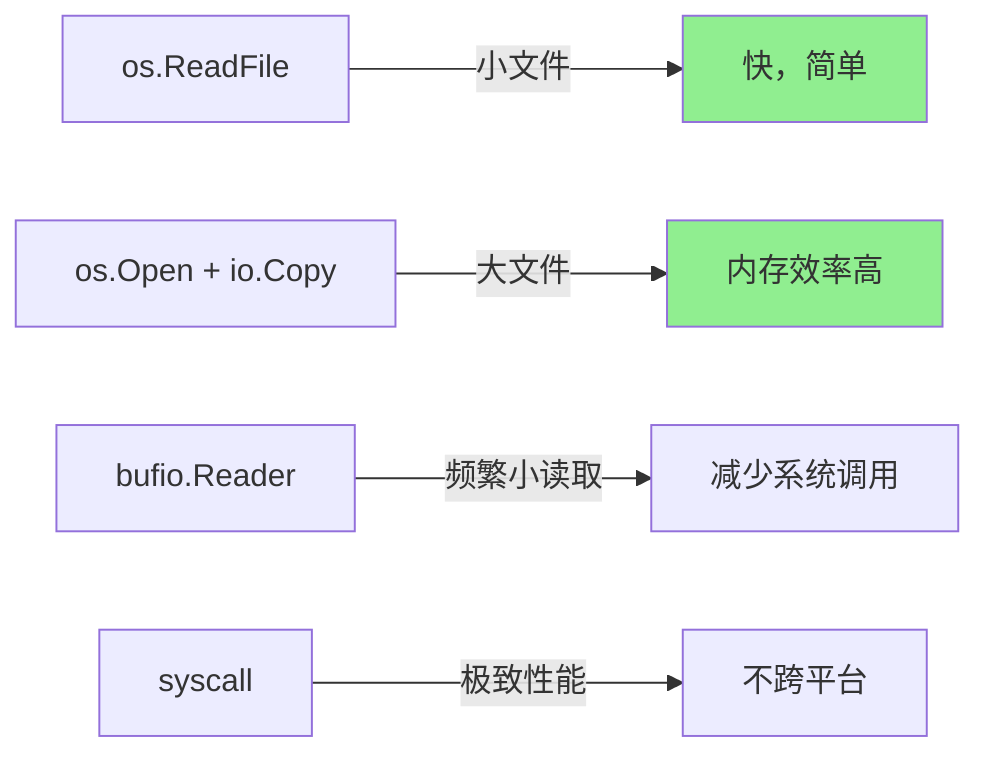

# os完全指南

## 📖 包简介

`os`包是Go程序与操作系统之间的桥梁。从文件读写到进程管理，从环境变量到信号处理，`os`包提供了与操作系统交互的统一接口层。无论你是读取配置文件、创建临时目录、处理命令行参数，还是管理子进程，都离不开这个包。

与直接使用系统调用不同，`os`包屏蔽了不同操作系统之间的差异。同样的`os.Open`在Linux、macOS、Windows上都能正常工作；同样的`os.Getwd`在任何平台上都返回当前工作目录。这就是Go"一次编写，到处运行"（在编译意义上）的魅力所在。

到了Go 1.26，`os`包迎来了一个重量级新功能——`Process.WithHandle`。这个方法让Go程序可以安全地访问操作系统底层的进程句柄（Linux上的pidfd，Windows上的原生句柄），彻底解决了PID复用可能导致误操作其他进程的安全隐患。对于需要管理子进程的服务程序来说，这是一个关乎安全的重大改进。

## 🎯 核心功能概览

### 文件操作

| 函数 | 说明 |
|:---|:---|
| `Open(name string) (*File, error)` | 只读打开文件 |
| `Create(name string) (*File, error)` | 创建或截断文件 |
| `OpenFile(name, flag, perm)` | 通用打开（指定模式+权限） |
| `Remove(name string) error` | 删除文件/空目录 |
| `RemoveAll(name string) error` | 递归删除 |
| `Rename(old, new string) error` | 重命名/移动 |
| `ReadFile/WriteFile(name string, data []byte)` | 快捷读写整个文件 |

### 目录操作

| 函数 | 说明 |
|:---|:---|
| `Mkdir(name string, perm FileMode) error` | 创建目录 |
| `MkdirAll(name string, perm FileMode) error` | 递归创建目录 |
| `ReadDir(name string) ([]DirEntry, error)` | 读取目录条目 |
| `ReadFile(name string) ([]DirEntry, error)` | 读取目录（已废弃） |

### 文件信息

| 类型/函数 | 说明 |
|:---|:---|
| `File` | 文件对象，实现io.Reader/Writer/Closer等 |
| `FileInfo` | 文件元信息（大小、权限、时间等） |
| `DirEntry` | 目录条目（轻量级） |
| `Stat(name string) (FileInfo, error)` | 获取文件信息（不打开文件） |
| `Lstat(name string) (FileInfo, error)` | 同上，不跟随符号链接 |

### 环境变量与工作目录

| 函数 | 说明 |
|:---|:---|
| `Getenv(key string) string` | 获取环境变量 |
| `Setenv(key, value string) error` | 设置环境变量 |
| `Environ() []string` | 获取所有环境变量 |
| `Getwd() (dir string, err error)` | 获取工作目录 |
| `Chdir(dir string) error` | 切换工作目录 |

### 进程管理

| 类型/函数 | 说明 |
|:---|:---|
| `Process` | 进程对象 |
| `ProcessState` | 进程退出状态 |
| `StartProcess(name string, argv []string, attr *ProcAttr)` | 启动进程 |
| `FindProcess(pid int) (*Process, error)` | 查找进程 |
| **`(p *Process) WithHandle(f func(uintptr))`** | **[Go 1.26] 安全访问进程句柄** |

### 信号处理

| 函数 | 说明 |
|:---|:---|
| `Signal` | 信号接口 |
| `Notify(c chan<- os.Signal, sig ...os.Signal)` | 接收信号 |
| `StopNotify(c chan<- os.Signal)` | 停止接收 |

## 💻 实战示例

### 示例1：基础用法

```go
package main

import (
	"fmt"
	"os"
)

func main() {
	// === 环境变量 ===
	fmt.Printf("GOPATH: %s\n", os.Getenv("GOPATH"))
	fmt.Printf("HOME: %s\n", os.Getenv("HOME"))
	
	// 设置环境变量（仅对当前进程及子进程有效）
	os.Setenv("MY_APP_ENV", "production")
	
	// 获取所有环境变量
	for _, env := range os.Environ() {
		// 格式: KEY=value
		fmt.Println(env)
	}
	
	// === 工作目录 ===
	wd, _ := os.Getwd()
	fmt.Printf("Working directory: %s\n", wd)
	
	// === 文件存在性检查 ===
	if _, err := os.Stat("/etc/hosts"); err == nil {
		fmt.Println("/etc/hosts exists")
	}
	
	// === IsExist / IsNotExist 辅助函数 ===
	if os.IsNotExist(err) {
		fmt.Println("File does not exist")
	}
	if os.IsExist(err) {
		fmt.Println("File already exists")
	}
}
```

### 示例2：进阶用法——文件操作

```go
package main

import (
	"fmt"
	"io"
	"os"
	"path/filepath"
)

// 安全创建并写入文件
func safeWriteFile(path string, data []byte, perm os.FileMode) error {
	// 确保目录存在
	dir := filepath.Dir(path)
	if err := os.MkdirAll(dir, 0755); err != nil {
		return fmt.Errorf("create dir: %w", err)
	}
	
	// 写入临时文件
	tmpFile, err := os.CreateTemp(dir, "*.tmp")
	if err != nil {
		return fmt.Errorf("create temp: %w", err)
	}
	tmpPath := tmpFile.Name()
	
	// 清理临时文件（失败时）
	success := false
	defer func() {
		if !success {
			os.Remove(tmpPath)
		}
	}()
	
	// 写入数据
	if _, err := tmpFile.Write(data); err != nil {
		tmpFile.Close()
		return fmt.Errorf("write: %w", err)
	}
	
	if err := tmpFile.Close(); err != nil {
		return fmt.Errorf("close temp: %w", err)
	}
	
	// 原子重命名
	if err := os.Rename(tmpPath, path); err != nil {
		return fmt.Errorf("rename: %w", err)
	}
	
	success = true
	return nil
}

// 遍历目录
func walkDir(root string) error {
	return filepath.WalkDir(root, func(path string, d os.DirEntry, err error) error {
		if err != nil {
			return err
		}
		
		info, _ := d.Info()
		mode := info.Mode()
		
		if d.IsDir() {
			fmt.Printf("[DIR]  %s (%v)\n", path, mode)
		} else if mode&0111 != 0 {
			fmt.Printf("[EXEC] %s (%d bytes)\n", path, info.Size())
		} else {
			fmt.Printf("[FILE] %s (%d bytes)\n", path, info.Size())
		}
		
		return nil
	})
}

// 复制文件
func copyFile(src, dst string) error {
	source, err := os.Open(src)
	if err != nil {
		return fmt.Errorf("open src: %w", err)
	}
	defer source.Close()
	
	destination, err := os.Create(dst)
	if err != nil {
		return fmt.Errorf("create dst: %w", err)
	}
	defer destination.Close()
	
	// io.Copy 自动选择最优策略
	_, err = io.Copy(destination, source)
	return err
}

func main() {
	// 安全写入
	data := []byte("Hello, safe file!")
	if err := safeWriteFile("/tmp/test_safe_write.txt", data, 0644); err != nil {
		fmt.Println("Error:", err)
	} else {
		fmt.Println("File written safely")
	}
	
	// 文件复制
	// copyFile("/tmp/src.txt", "/tmp/dst.txt")
	
	// 遍历目录（注释掉，避免输出过多）
	// walkDir("/tmp")
	
	// 临时文件和目录
	tmpFile, _ := os.CreateTemp("", "myapp-*.txt")
	fmt.Printf("Temp file: %s\n", tmpFile.Name())
	tmpFile.Close()
	os.Remove(tmpFile.Name())
	
	tmpDir, _ := os.MkdirTemp("", "myapp-*")
	fmt.Printf("Temp dir: %s\n", tmpDir)
	os.RemoveAll(tmpDir)
}
```

### 示例3：Go 1.26 Process.WithHandle实战

```go
package main

import (
	"fmt"
	"os"
	"os/exec"
	"runtime"
	"syscall"
	"time"
)

// Go 1.26: WithHandle 安全访问进程句柄
func withHandleDemo() error {
	// 启动一个子进程
	cmd := exec.Command("sleep", "60")
	if err := cmd.Start(); err != nil {
		return fmt.Errorf("start: %w", err)
	}
	
	fmt.Printf("Started process: PID %d\n", cmd.Process.Pid)
	
	// Go 1.26: 使用 WithHandle 安全获取底层句柄
	// 在 Linux 5.4+ 上返回 pidfd
	// 在 Windows 上返回进程句柄
	// 在其他平台返回 os.ErrNoHandle
	err := cmd.Process.WithHandle(func(handle uintptr) {
		fmt.Printf("Process handle: %d (0x%x)\n", handle, handle)
		
		// 在支持的平台上，可以用句柄执行高级操作
		// 例如 Linux 上的 pidfd 系统调用
		if runtime.GOOS == "linux" {
			// 使用 pidfd 发送信号（比 kill(pid, sig) 更安全）
			// 因为 pidfd 始终指向同一个进程，不会被 PID 复用误导
			syscall.Syscall(syscall.SYS_PIDFD_SEND_SIGNAL,
				handle, uintptr(syscall.SIGUSR1), 0)
			fmt.Println("Sent SIGUSR1 via pidfd")
		}
	})
	
	if err != nil {
		if err == os.ErrNoHandle {
			fmt.Println("WithHandle not supported on this platform")
		} else {
			return fmt.Errorf("withHandle: %w", err)
		}
	}
	
	// 清理
	time.Sleep(500 * time.Millisecond)
	cmd.Process.Kill()
	cmd.Wait()
	
	return nil
}

// 进程管理器
type ProcessManager struct {
	processes []*exec.Cmd
}

func (pm *ProcessManager) Start(name string, args ...string) error {
	cmd := exec.Command(name, args...)
	
	// 设置进程组（方便统一发送信号）
	cmd.SysProcAttr = &syscall.SysProcAttr{
		Setpgid: true,
	}
	
	if err := cmd.Start(); err != nil {
		return err
	}
	
	pm.processes = append(pm.processes, cmd)
	fmt.Printf("Started: %s (PID: %d)\n", name, cmd.Process.Pid)
	
	return nil
}

func (pm *ProcessManager) StopAll() {
	for _, cmd := range pm.processes {
		if cmd.Process != nil {
			// 向整个进程组发送终止信号
			syscall.Kill(-cmd.Process.Pid, syscall.SIGTERM)
		}
	}
	
	// 等待所有进程退出
	for _, cmd := range pm.processes {
		cmd.Wait()
	}
	
	fmt.Println("All processes stopped")
}

func (pm *ProcessManager) WaitForAll() error {
	for _, cmd := range pm.processes {
		if err := cmd.Wait(); err != nil {
			return fmt.Errorf("process %d: %w", cmd.Process.Pid, err)
		}
	}
	return nil
}

// 优雅关闭
func gracefulShutdown() {
	// 监听信号
	sigCh := make(chan os.Signal, 1)
	// Go 1.26: NotifyContext 取消时返回具体信号描述
	// signal.NotifyContext(ctx, os.Interrupt)
	// context.Cause(ctx) 返回: "interrupt signal received"
	
	// 传统方式
	sig := <-sigCh
	fmt.Printf("Received signal: %v\n", sig)
	fmt.Println("Shutting down gracefully...")
}

func main() {
	// WithHandle 示例
	if err := withHandleDemo(); err != nil {
		fmt.Println("Demo error:", err)
	}
	
	// 进程管理器
	pm := &ProcessManager{}
	pm.Start("sleep", "1")
	pm.Start("sleep", "2")
	pm.Start("sleep", "3")
	pm.StopAll()
	
	// 当前进程信息
	fmt.Printf("Current PID: %d\n", os.Getpid())
	fmt.Printf("Current Process: %+v\n", os.Args)
}
```

## ⚠️ 常见陷阱与注意事项

### 1. 忘记关闭文件

```go
// ❌ 文件描述符泄漏
f, _ := os.Open("file.txt")
data, _ := io.ReadAll(f)

// ✅ 始终 defer Close
f, err := os.Open("file.txt")
if err != nil { return err }
defer f.Close()
```

### 2. 文件权限的八进制表示

```go
// ❌ 用十进制而不是八进制
os.Chmod("file", 755) // 错误！755 十进制 ≠ 755 八进制

// ✅ 使用 0 前缀的八进制
os.Chmod("file", 0755) // 正确
```

### 3. PID复用问题（Go 1.26已解决）

```go
// ❌ PID 可能已被复用
process, _ := os.FindProcess(pid)
process.Kill() // 可能杀了另一个进程！

// ✅ Go 1.26: 使用 WithHandle
process.WithHandle(func(handle uintptr) {
    // handle 在 Linux 是 pidfd，在 Windows 是进程句柄
    // 始终指向原始进程，不会被复用
})
```

### 4. 使用Chdir影响全局状态

```go
// ❌ os.Chdir 影响整个进程
os.Chdir("/tmp")

// ✅ 使用绝对路径而不是改变工作目录
path := filepath.Join(baseDir, "file.txt")
```

### 5. 忽略文件竞态条件

```go
// ❌ TOCTOU (Time-of-check to time-of-use) 漏洞
if _, err := os.Stat(path); err == nil {
    f, _ := os.Open(path) // 文件可能已经改变
}

// ✅ 直接打开，处理错误
f, err := os.Open(path)
if err != nil {
    // 处理不存在或其他错误
}
```

## 🚀 Go 1.26新特性

### os.Process.WithHandle

这是Go 1.26 `os`包最重要的安全改进：

```go
func (p *Process) WithHandle(f func(handle uintptr)) error
```

**功能**：提供对底层进程句柄的安全访问。

```go
// 使用方式
err := process.WithHandle(func(handle uintptr) {
    // handle 在回调函数内有效
    // 即使进程已退出，句柄在回调期间仍然有效
    
    if runtime.GOOS == "linux" {
        // Linux 5.4+: 使用 pidfd
        // 比传统的 kill(pid, sig) 更安全
    } else if runtime.GOOS == "windows" {
        // Windows: 使用原生进程句柄
    }
})

if err == os.ErrNoHandle {
    // 不支持的平台（如 macOS/BSD）
}
```

**为什么需要 WithHandle？**

| 问题 | 传统PID操作 | WithHandle |
|:---|:---|:---|
| PID复用风险 | ⚠️ 可能操作到另一个进程 | ✅ 句柄始终指向原进程 |
| 生命周期 | ⚠️ 进程退出后PID可被复用 | ✅ 回调期间句柄有效 |
| 平台支持 | 不统一 | 自动处理平台差异 |

**其他Go 1.26改进**：

1. **Windows OpenFile 改进**：`flag`参数现在支持更多选项
2. **signal.NotifyContext**：取消时返回具体信号描述

## 📊 性能优化建议

### 文件操作性能



### 最佳实践

| 场景 | 推荐方案 | 理由 |
|:---|:---|:---|
| 小文件(< 1MB) | `os.ReadFile` | 最简单 |
| 大文件 | `os.Open` + `io.Copy` | 内存效率 |
| 频繁小读写 | `bufio` 包装 | 减少系统调用 |
| 临时文件 | `os.CreateTemp` | 自动清理 |
| 原子写入 | 临时文件+Rename | 保证一致性 |
| 进程管理 | `exec.Command` | 高级封装 |
| 安全进程操作 | `WithHandle` [Go 1.26] | 防止PID复用 |

1. **始终 defer Close**：防止文件描述符泄漏
2. **用 MkdirTemp/CreateTemp**：避免临时文件冲突
3. **用 filepath 包处理路径**：跨平台兼容
4. **Go 1.26项目用 WithHandle**：安全的进程操作
5. **优先用 os 而不是 syscall**：os 提供跨平台封装

## 🔗 相关包推荐

| 包 | 说明 |
|:---|:---|
| `os/exec` | 子进程管理，基于os.Process的高级封装 |
| `os/signal` | 信号处理 |
| `io` | I/O接口，os.File实现io.ReadWriteCloser |
| `path/filepath` | 跨平台路径操作 |
| `syscall` | 底层系统调用，需要时使用 |
| `io/fs` | 文件系统接口，Go 1.16+ |

---