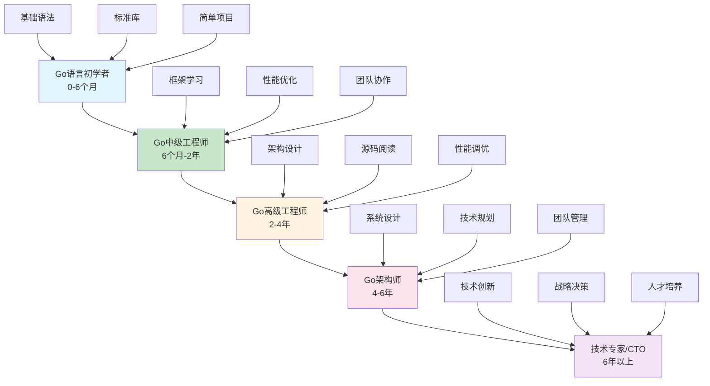
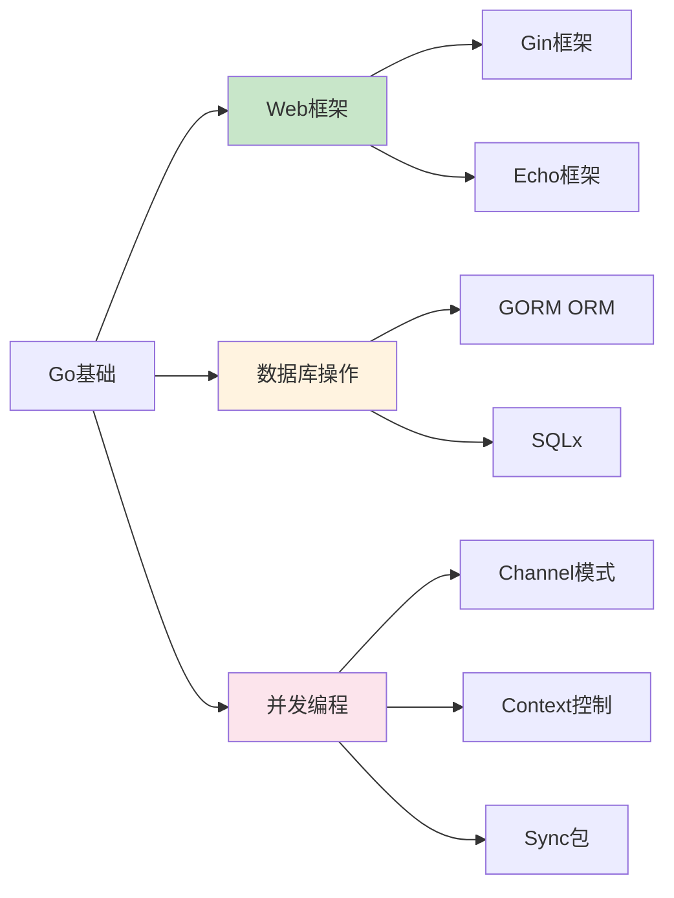
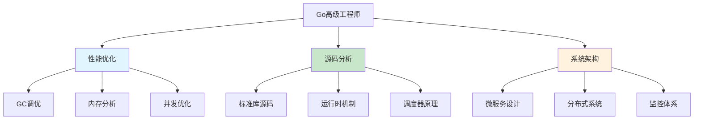
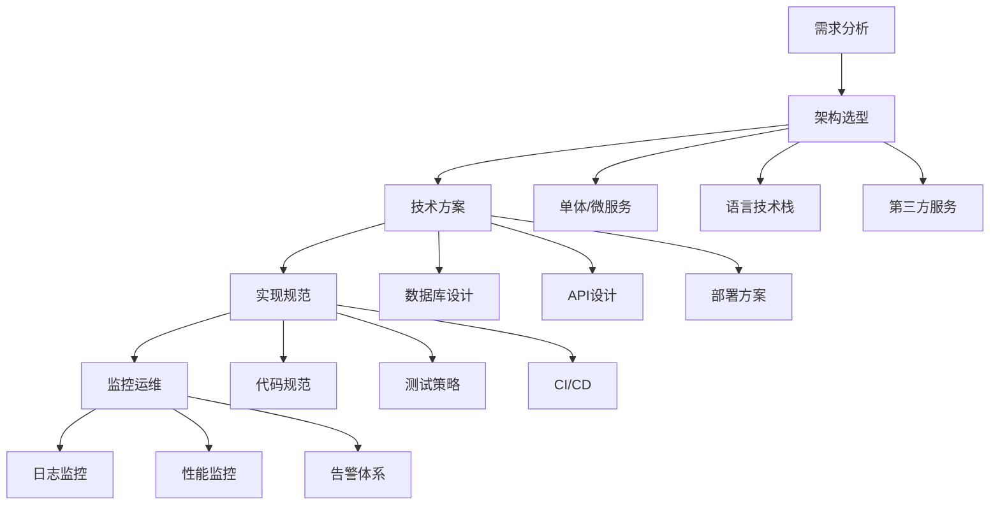

# Golang程序员发展之路：从菜鸟到专家的完全指南

> 🚀 每个Go大神都曾是踩过无数坑的初学者。今天我们来聊聊Golang程序员的成长之路，以及如何避开那些让人头疼的"坑"！

## 🎯 为什么选择Golang？

在开始我们的成长之旅前，先聊聊为什么要选Go语言：

**性能卓越** - Go的编译速度和执行效率在众多语言中名列前茅
**简洁语法** - 没有类继承，没有泛型(1.18前)，没有异常处理，代码清晰易懂
**并发王者** - goroutine和channel让并发编程变得简单优雅
**生态成熟** - Docker、Kubernetes等云原生明星项目都是用Go写的
**跨平台** - 一次编译，处处运行，简直就是云原生时代的标配

那么问题来了：怎么从Golang菜鸟成长为Go专家呢？让我们一步步来！

## 🗺️ Golang程序员发展路线图



## 📚 初级阶段：Go语言初学者（0-6个月）

这个阶段最重要的就是打好基础，**千万不要急于求成**！

### 必学技能

```go
// 基础语法 - 必须牢牢掌握
package main

import "fmt"

func main() {
    // 变量声明和类型系统
    var name string = "小明"
    
    // 简短声明（推荐）
    age := 25
    
    // 函数定义
    greet := func(name string) string {
        return "Hello, " + name
    }
    
    fmt.Println(greet(name))
    fmt.Printf("年龄: %d\n", age)
}
```

### 常见错误1：切片append的"魔法"

```go
// ❌ 错误：切片共享底层数组导致数据污染
func main() {
    original := []int{1, 2, 3}
    
    // 错误的复制方式
    copy1 := original[:2]  // 共享底层数组！
    copy1[0] = 999         // 这会影响original！
    
    fmt.Println(original) // [999 2 3] 被修改了！
}

// ✅ 正确：正确的切片复制
func main() {
    original := []int{1, 2, 3}
    
    // 方法1：make + copy
    copy1 := make([]int, 2)
    copy(copy1, original[:2])
    
    // 方法2：append到新切片
    copy2 := append([]int(nil), original[:2]...)
    
    copy1[0] = 999
    fmt.Println(original) // [1 2 3] 未被影响
    fmt.Println(copy1)    // [999 2]
}
```

### 常见错误2：循环变量闭包陷阱

```go
// ❌ 错误：goroutine中闭包捕获循环变量
func main() {
    for i := 0; i < 3; i++ {
        go func() {
            fmt.Println(i)  // 可能输出: 3, 3, 3
        }()
    }
    time.Sleep(time.Second)
}

// ✅ 正确：显式传递参数
func main() {
    for i := 0; i < 3; i++ {
        go func(id int) {
            fmt.Println(id)  // 正确输出: 0, 1, 2
        }(i)
    }
    time.Sleep(time.Second)
}
```

## 🚀 中级阶段：Go中级工程师（6个月-2年）

这个阶段要开始接触框架和实际项目，**重点关注代码质量和性能**。

### 技能树扩展



### 常见错误3：map并发陷阱

```go
// ❌ 错误：并发读写map导致panic
func main() {
    data := make(map[string]int)
    
    // 并发写入
    for i := 0; i < 1000; i++ {
        go func() {
            data["counter"] += 1  // panic: concurrent map writes
        }()
    }
    
    time.Sleep(time.Second)
}

// ✅ 正确：使用sync.Map或mutex
func main() {
    var data sync.Map
    
    // 方式1：使用sync.Map
    for i := 0; i < 1000; i++ {
        go func() {
            // 原子操作
            data.Store("counter", 1)
        }()
    }
    
    // 方式2：使用mutex
    var mu sync.Mutex
    counter := 0
    
    for i := 0; i < 1000; i++ {
        go func() {
            mu.Lock()
            counter++
            mu.Unlock()
        }()
    }
    
    time.Sleep(time.Second)
}
```

### 常见错误4：defer执行时机误解

```go
// ❌ 错误：不理解defer的参数预计算
func main() {
    now := time.Now()
    
    defer fmt.Println("程序运行时间:", time.Since(now))
    
    // 做一些工作
    time.Sleep(2 * time.Second)
    
    // 输出: 程序运行时间: 0s  （错误！）
}

// ✅ 正确：在defer中调用函数
func main() {
    start := time.Now()
    
    defer func() {
        fmt.Println("程序运行时间:", time.Since(start))
    }()
    
    // 做一些工作
    time.Sleep(2 * time.Second)
    
    // 正确输出: 程序运行时间: 2s
}
```

## 🎯 高级阶段：Go高级工程师（2-4年）

这个阶段要深入理解Go语言内部机制，**能够进行性能调优和架构设计**。

### 核心能力要求



### 常见错误5：goroutine泄漏

```go
// ❌ 错误：goroutine阻塞导致泄漏
func processData(input <-chan int) {
    for {
        select {
        case data := <-input:
            // 处理数据
            fmt.Println(data)
        }
    }
}

func main() {
    dataCh := make(chan int)
    go processData(dataCh)
    
    // 发送一些数据
    for i := 0; i < 10; i++ {
        dataCh <- i
    }
    
    // 问题：goroutine永远不会退出！
}

// ✅ 正确：使用context控制goroutine生命周期
func processData(ctx context.Context, input <-chan int) {
    for {
        select {
        case data := <-input:
            // 处理数据
            fmt.Println(data)
        case <-ctx.Done():
            fmt.Println("goroutine正常退出")
            return
        }
    }
}

func main() {
    ctx, cancel := context.WithCancel(context.Background())
    defer cancel()
    
    dataCh := make(chan int)
    go processData(ctx, dataCh)
    
    // 发送数据
    for i := 0; i < 10; i++ {
        dataCh <- i
    }
    
    // 优雅退出
    cancel()
    time.Sleep(time.Second)
}
```

### 常见错误6：性能优化误区

```go
// ❌ 错误：过度优化，代码可读性下降
func processUsers(users []User) []User {
    result := make([]User, 0, len(users))
    
    // 过度使用指针，反而增加GC压力
    for i := range users {
        if users[i].Active && users[i].Age > 18 {
            result = append(result, users[i])
        }
    }
    
    return result
}

// ✅ 正确：平衡性能和可读性
func processUsers(users []User) []User {
    var result []User
    
    for _, user := range users {
        if user.IsQualified() {
            result = append(result, user)
        }
    }
    
    // 预分配切片容量
    if len(result) > 100 {
        optimized := make([]User, 0, len(result))
        optimized = append(optimized, result...)
        return optimized
    }
    
    return result
}
```

## 🏗️ 专家阶段：Go架构师（4-6年）

这个阶段需要具备**系统设计能力和技术领导力**，能够把握技术方向。

### 架构设计能力



### 案例：微服务架构设计

```go
// 服务发现和注册
type ServiceRegistry struct {
    services map[string]*ServiceInfo
    mu       sync.RWMutex
}

type ServiceInfo struct {
    Name        string
    Endpoints   []string
    HealthCheck func() bool
    Metadata    map[string]string
}

// API网关路由
func (g *Gateway) Route(ctx context.Context, req *Request) (*Response, error) {
    // 服务发现
    service, err := g.registry.Discover(req.ServiceName)
    if err != nil {
        return nil, fmt.Errorf("service not found: %w", err)
    }
    
    // 负载均衡
    endpoint := g.balancer.Select(service.Endpoints)
    
    // 熔断器检查
    if !g.circuitBreaker.Allow(endpoint) {
        return nil, errors.New("circuit breaker open")
    }
    
    // 请求转发
    return g.client.Forward(ctx, endpoint, req)
}
```

## 💡 实战：构建一个完整的在线商城系统

让我们通过一个实际案例来综合运用所学技能：

### 项目架构设计

```
微服务架构：
├── api-gateway (HTTP网关，认证，限流)
├── user-service (用户管理，认证)
├── product-service (商品管理，库存)
├── order-service (订单处理，支付)
├── notification-service (消息通知)
└── monitoring (监控，日志)
```

### 核心技术实现

```go
// 订单服务核心逻辑
type OrderService struct {
    repo        OrderRepository
    productSvc  ProductService
    paymentSvc  PaymentService
    
    // 消息队列
    msgBroker   MessageBroker
    
    // 分布式锁
    locker      DistributedLocker
}

func (s *OrderService) CreateOrder(ctx context.Context, request *CreateOrderRequest) (*Order, error) {
    // 1. 验证商品库存
    products, err := s.productSvc.CheckInventory(request.Items)
    if err != nil {
        return nil, fmt.Errorf("库存检查失败: %w", err)
    }
    
    // 2. 获取分布式锁，防止并发创建
    lockKey := fmt.Sprintf("order_create_%s", request.UserID)
    if err := s.locker.Lock(ctx, lockKey); err != nil {
        return nil, fmt.Errorf("获取锁失败: %w", err)
    }
    defer s.locker.Unlock(ctx, lockKey)
    
    // 3. 创建订单
    order := &Order{
        ID:     generateOrderID(),
        UserID: request.UserID,
        Items:  products,
        Status: OrderStatusPending,
    }
    
    // 4. 保存到数据库
    if err := s.repo.Save(ctx, order); err != nil {
        return nil, fmt.Errorf("保存订单失败: %w", err)
    }
    
    // 5. 发送创建消息
    if err := s.msgBroker.Publish(ctx, "order.created", order); err != nil {
        log.Warn("发送订单创建消息失败", "error", err)
    }
    
    return order, nil
}

// 优雅关闭处理
func (s *OrderService) Shutdown(ctx context.Context) error {
    // 停止接收新请求
    s.healthStatus = HealthStatusStopping
    
    // 等待正在处理的请求完成
    select {
    case <-time.After(30 * time.Second):
        log.Warn("强制关闭，仍有请求在处理")
    case <-s.waitGroup.Done():
        log.Info("所有请求处理完成")
    }
    
    // 关闭资源
    if err := s.msgBroker.Close(); err != nil {
        log.Error("关闭消息队列失败", "error", err)
    }
    
    return nil
}
```

## 📊 技能评估与成长建议

### 技术能力评估矩阵

