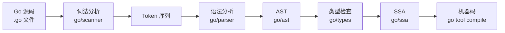
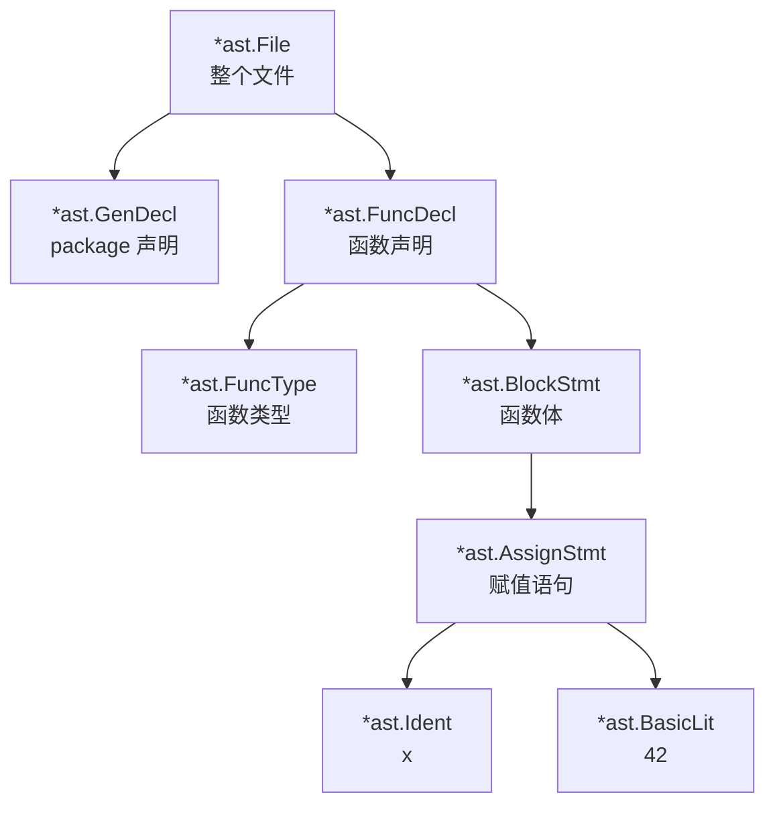
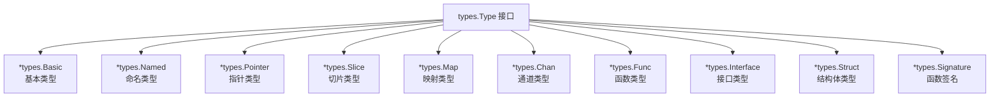
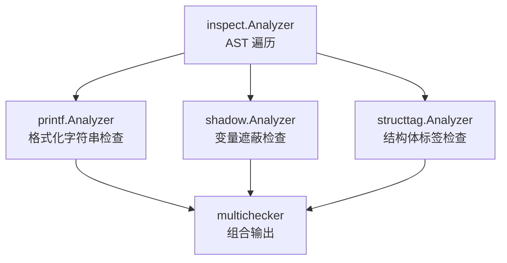
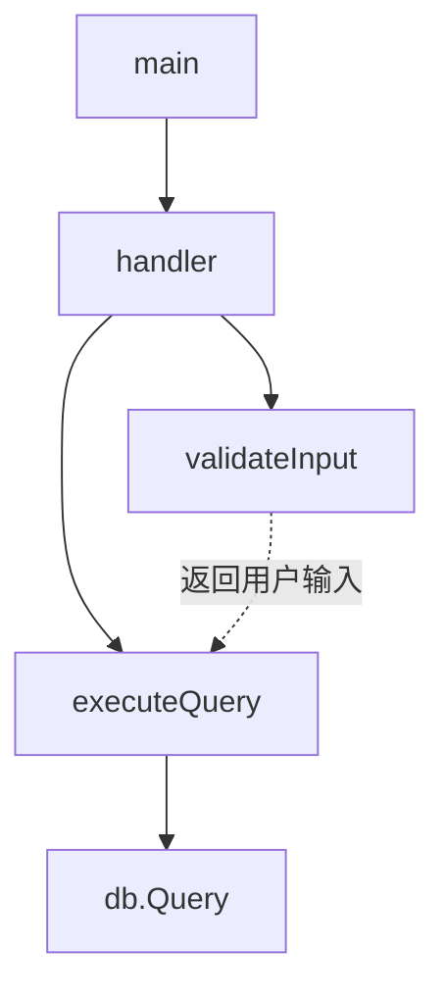
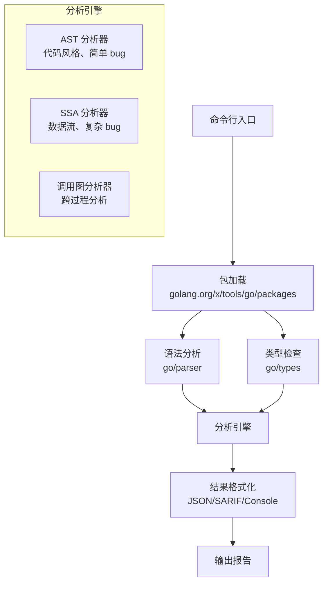
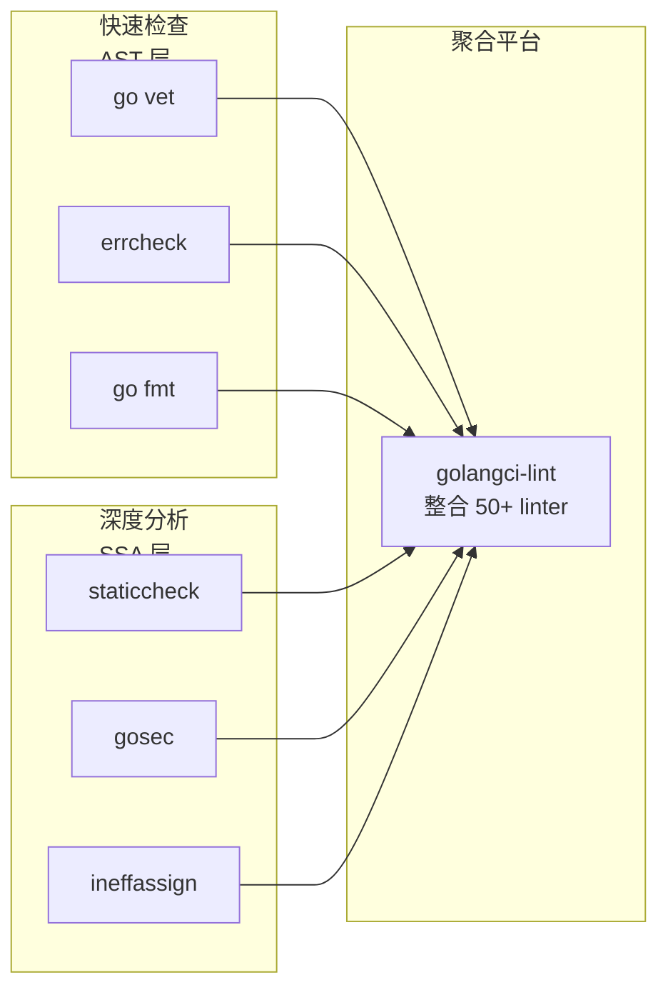
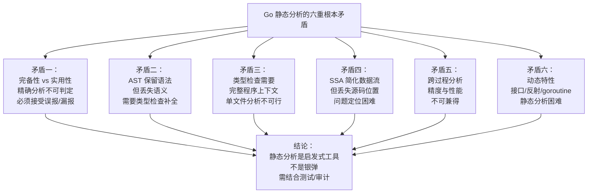

# Go 代码扫描深度解析：从 AST 到 SSA，看透静态分析的底层逻辑

> 当你运行 `go vet` 检查代码，或者配置 CI 流水线用 `golangci-lint` 拦截潜在 bug 时，你有没有想过——这些工具究竟是如何"读懂"你的 Go 代码的？它们不是简单地做文本匹配，而是经历了一个完整的编译前端流程：词法分析、语法分析、语义分析、中间表示构建。本文将从最基础的词法分析讲起，一步步深入到 Go 的抽象语法树（AST）、静态单赋值（SSA）形式、以及 `go/analysis` 框架，帮你构建一套完整的 Go 代码扫描知识体系。

---

## 一、为什么需要代码扫描？

### 1.1 编译器能发现的错误只是冰山一角

Go 编译器非常严格，能捕获类型不匹配、未使用变量、语法错误等问题。但编译器的设计目标是"生成正确的机器码"，而非"发现所有潜在问题"。编译器不会告诉你：

- 这个 `defer` 语句在错误处理路径中永远不会执行
- 这个 `context.WithTimeout` 返回的 cancel 函数没有被调用，导致 goroutine 泄漏
- 这个 SQL 查询存在注入漏洞
- 这个锁在错误路径中没有释放

这些问题需要更深层的程序分析才能发现——这就是代码扫描（Code Scanning）/ 静态分析（Static Analysis）的价值。

### 1.2 静态分析 vs 动态分析

| 维度 | 静态分析 | 动态分析 |
|------|---------|---------|
| 执行时机 | 编译/构建时 | 运行时 |
| 代码覆盖 | 所有代码路径（理论上） | 实际执行的代码路径 |
| 性能开销 | 无运行时开销 | 有运行时开销 |
| 误报率 | 可能有误报 | 无误报 |
| 漏报率 | 可能有漏报 | 未执行的路径无法检测 |
| 典型工具 | go vet, golangci-lint, gosec | 测试覆盖率、性能剖析 |

**根本矛盾之一：静态分析的完备性与实用性的权衡。**

静态分析的目标是发现所有潜在问题（完备性），但这会导致大量误报（把正确的代码标记为有问题）。实际工具必须在完备性和实用性之间做取舍——宁可漏报一些真问题，也不要产生太多误报让开发者疲于应付。

---

## 二、编译前端基础：从源码到 AST

### 2.1 Go 编译流程概览



代码扫描工具通常在 **AST 阶段** 或 **SSA 阶段** 介入，因为这两个阶段保留了足够的程序结构信息，同时又比源码更易于分析。

### 2.2 词法分析：从字符到 Token

词法分析器（Lexer/Scanner）的任务是将源代码字符流转换为 Token 序列。Token 是编程语言的最小有意义单元：

```go
// 源代码
package main

func main() {
    x := 42
}

// Token 序列
PACKAGE  "package"
IDENT    "main"
FUNC     "func"
IDENT    "main"
LPAREN   "("
RPAREN   ")"
LBRACE   "{"
IDENT    "x"
DEFINE   ":="
INT      "42"
RBRACE   "}"
```

Go 标准库提供了 `go/scanner` 包用于词法分析：

```go
package main

import (
    "go/scanner"
    "go/token"
)

func main() {
    src := []byte(`package main; func main() { x := 42 }`)
    
    var s scanner.Scanner
    fset := token.NewFileSet()
    file := fset.AddFile("example.go", fset.Base(), len(src))
    
    s.Init(file, src, nil, scanner.ScanComments)
    
    for {
        pos, tok, lit := s.Scan()
        if tok == token.EOF {
            break
        }
        println(tok.String(), lit)
    }
}
```

**词法分析的输出是 Token 序列，它丢失了空白符和注释（除非特别保留），但保留了每个 Token 的位置信息（用于错误定位）。**

### 2.3 语法分析：从 Token 到 AST

语法分析器（Parser）的任务是将 Token 序列组织成树形结构——抽象语法树（AST）。AST 是源代码的结构化表示，每个节点代表一个语法结构：



Go 标准库提供了 `go/parser` 和 `go/ast` 包用于语法分析：

```go
package main

import (
    "go/ast"
    "go/parser"
    "go/token"
)

func main() {
    src := `package main

func main() {
    x := 42
    println(x)
}`

    fset := token.NewFileSet()
    f, err := parser.ParseFile(fset, "example.go", src, parser.ParseComments)
    if err != nil {
        panic(err)
    }

    // 遍历 AST
    ast.Inspect(f, func(n ast.Node) bool {
        if n != nil {
            println(ast.NodeName(n))
        }
        return true
    })
}
```

### 2.4 AST 节点类型详解

Go 的 AST 节点定义在 `go/ast` 包中，核心类型包括：

| 节点类型 | 代表 | 示例 |
|---------|------|------|
| `*ast.File` | 整个源文件 | `package main; ...` |
| `*ast.FuncDecl` | 函数声明 | `func foo() {}` |
| `*ast.GenDecl` | 通用声明 | `var`, `const`, `type`, `import` |
| `*ast.AssignStmt` | 赋值语句 | `x := 42`, `x = 42` |
| `*ast.CallExpr` | 函数调用 | `foo(1, 2)` |
| `*ast.IfStmt` | if 语句 | `if x > 0 {}` |
| `*ast.ForStmt` | for 循环 | `for i := 0; i < 10; i++ {}` |
| `*ast.RangeStmt` | range 循环 | `for k, v := range m {}` |
| `*ast.Ident` | 标识符 | `x`, `main` |
| `*ast.BasicLit` | 基本字面量 | `42`, `"hello"` |
| `*ast.CompositeLit` | 复合字面量 | `[]int{1, 2}`, `Person{Name: "A"}` |
| `*ast.SelectorExpr` | 选择表达式 | `pkg.Func`, `obj.Field` |
| `*ast.BinaryExpr` | 二元表达式 | `a + b`, `x > y` |
| `*ast.UnaryExpr` | 一元表达式 | `-x`, `!ok` |

**根本矛盾之二：AST 保留了语法结构，但丢失了语义信息。**

AST 告诉你"这里有一个函数调用"，但它不知道这个函数调用的是哪个函数（如果是接口方法或跨包调用）；它告诉你"这里有一个标识符 x"，但它不知道 x 是什么类型。要获得这些信息，需要进入下一阶段——类型检查。

---

## 三、类型检查：从 AST 到类型信息

### 3.1 为什么类型检查对代码扫描很重要

很多代码扫描规则依赖于类型信息：

- 检测 SQL 注入：需要知道某个字符串是否来自用户输入
- 检测 goroutine 泄漏：需要知道某个函数返回的 `cancel` 函数是否被调用
- 检测错误处理：需要知道某个返回值是否实现了 `error` 接口

这些都需要类型检查提供的语义信息。

### 3.2 go/types 包

Go 标准库的 `go/types` 包提供了类型检查功能。它会遍历 AST，构建类型信息：

```go
package main

import (
    "go/ast"
    "go/parser"
    "go/token"
    "go/types"
)

func main() {
    src := `package main

import "fmt"

func main() {
    x := 42
    fmt.Println(x)
}`

    fset := token.NewFileSet()
    f, _ := parser.ParseFile(fset, "example.go", src, 0)

    conf := types.Config{Importer: nil}
    pkg, err := conf.Check("main", fset, []*ast.File{f}, nil)
    if err != nil {
        panic(err)
    }

    // 获取类型信息
    scope := pkg.Scope()
    obj := scope.Lookup("main")
    println(obj.Type().String())  // func()
}
```

### 3.3 类型信息的结构

`go/types` 包定义了丰富的类型系统：



### 3.4 根本矛盾之三：类型检查需要完整的程序上下文

`go/types` 的类型检查不是"文件级"的，而是"包级"甚至"程序级"的。要正确检查一个文件，需要：

1. 该文件所属的包的所有文件
2. 该包导入的所有包的类型信息

这意味着代码扫描工具不能只分析单个文件，而需要构建完整的程序表示。这大大增加了工具开发的复杂度。

---

## 四、SSA：静态单赋值形式

### 4.1 什么是 SSA？

SSA（Static Single Assignment，静态单赋值）是一种中间表示（IR）形式，其核心特性是：**每个变量只被赋值一次**。

```go
// 原始代码
x := 1
x = x + 1
x = x * 2

// SSA 形式
x0 := 1
x1 := x0 + 1
x2 := x1 * 2
```

每次赋值都创建一个新变量（带版本号），这简化了数据流分析——你可以直接通过变量名知道它的定义点。

### 4.2 为什么 SSA 对代码扫描有用？

SSA 形式特别适合做数据流分析：

- **到达定义分析**：一个变量在某点的值来自哪里？
- **常量传播**：某个变量在某点是否是常量？
- **活跃变量分析**：某个变量的值是否还会被使用？

这些分析在 AST 上很难做，因为 AST 保留了控制流但丢失了数据流的清晰表示。SSA 将数据流显式化。

### 4.3 Go 的 SSA 包

Go 提供了 `golang.org/x/tools/go/ssa` 包用于构建 SSA 形式：

```go
package main

import (
    "fmt"
    "go/ast"
    "go/parser"
    "go/token"
    "go/types"
    
    "golang.org/x/tools/go/ssa"
    "golang.org/x/tools/go/ssa/ssautil"
)

func main() {
    src := `package main

func add(a, b int) int {
    return a + b
}

func main() {
    x := add(1, 2)
    println(x)
}`

    fset := token.NewFileSet()
    f, _ := parser.ParseFile(fset, "example.go", src, 0)
    
    conf := types.Config{Importer: nil}
    pkg, _ := conf.Check("main", fset, []*ast.File{f}, nil)
    
    // 构建 SSA
    ssaProg := ssa.NewProgram(fset, ssa.BuilderMode(0))
    ssaPkg := ssaProg.CreatePackage(pkg, []*ast.File{f}, nil, true)
    ssaPkg.Build()
    
    // 打印 SSA
    for _, fn := range ssaPkg.Members {
        if f, ok := fn.(*ssa.Function); ok {
            fmt.Println(f)
        }
    }
}
```

### 4.4 SSA 指令类型

SSA 包定义了丰富的指令类型：

| 指令 | 含义 | 示例 |
|------|------|------|
| `Alloc` | 堆分配 | `new(T)` |
| `MakeSlice` | 创建切片 | `make([]int, 0)` |
| `MakeMap` | 创建映射 | `make(map[string]int)` |
| `MakeChan` | 创建通道 | `make(chan int)` |
| `MakeClosure` | 创建闭包 | `func() { ... }` |
| `Call` | 函数调用 | `foo(1, 2)` |
| `Defer` | defer 语句 | `defer cleanup()` |
| `Go` | go 语句 | `go worker()` |
| `Panic` | panic | `panic(err)` |
| `Recv` | 通道接收 | `<-ch` |
| `Send` | 通道发送 | `ch <- v` |
| `Select` | select 语句 | `select { case ... }` |
| `If` | 条件分支 | `if x > 0` |
| `Jump` | 无条件跳转 | `goto L` |
| `Return` | 返回 | `return x` |
| `Phi` | 合并点 | 控制流合并处的值选择 |

**Phi 指令是 SSA 的关键**：当控制流从多个路径汇聚到一个基本块时，Phi 指令选择正确的值：

```go
// 原始代码
var x int
if cond {
    x = 1
} else {
    x = 2
}
println(x)

// SSA 形式
if cond goto B1 else B2
B1:
    x1 = 1
    goto B3
B2:
    x2 = 2
    goto B3
B3:
    x3 = phi(B1: x1, B2: x2)  // 根据来自哪个块选择值
    println(x3)
```

### 4.5 根本矛盾之四：SSA 丢失了源码位置信息

SSA 形式为了简化分析，将程序转换为更底层的表示。代价是：**SSA 指令与源码位置的映射关系变得复杂**。当你发现 SSA 层面的问题时，要定位到源码的具体位置需要额外的映射机制。

---

## 五、go/analysis 框架：官方推荐的分析框架

### 5.1 为什么需要 analysis 框架？

直接使用 `go/ast` 和 `go/ssa` 做代码扫描有很多重复工作：

- 解析命令行参数
- 加载包及其依赖
- 构建 AST 和类型信息
- 处理多文件、多包
- 输出结果格式化

`go/analysis` 框架封装了这些通用逻辑，让开发者专注于分析逻辑本身。

### 5.2 Analyzer 结构

`go/analysis` 的核心是 `Analyzer` 结构：

```go
type Analyzer struct {
    Name string           // 分析器名称，如 "shadow"
    Doc  string           // 文档说明
    Run  func(*Pass) (interface{}, error)  // 分析函数
    Requires []*Analyzer  // 依赖的其他分析器
    ResultType reflect.Type  // 结果类型（用于传递分析结果）
    FactTypes []Fact       // 事实类型（用于跨包分析）
}
```

### 5.3 第一个自定义分析器

实现一个检测 `fmt.Println` 误用的分析器（生产环境应该用日志库）：

```go
package main

import (
    "go/ast"
    "go/token"
    
    "golang.org/x/tools/go/analysis"
    "golang.org/x/tools/go/analysis/singlechecker"
)

var NoPrintlnAnalyzer = &analysis.Analyzer{
    Name: "noprintln",
    Doc:  "detect fmt.Println usage",
    Run:  run,
}

func run(pass *analysis.Pass) (interface{}, error) {
    // 遍历 AST
    for _, file := range pass.Files {
        ast.Inspect(file, func(n ast.Node) bool {
            call, ok := n.(*ast.CallExpr)
            if !ok {
                return true
            }
            
            // 检查是否是 fmt.Println
            if sel, ok := call.Fun.(*ast.SelectorExpr); ok {
                if pkg, ok := sel.X.(*ast.Ident); ok {
                    if pkg.Name == "fmt" && sel.Sel.Name == "Println" {
                        pass.Report(analysis.Diagnostic{
                            Pos:     call.Pos(),
                            Message: "不要使用 fmt.Println，请使用日志库",
                        })
                    }
                }
            }
            return true
        })
    }
    return nil, nil
}

func main() {
    singlechecker.Main(NoPrintlnAnalyzer)
}
```

使用：

```bash
go build -o noprintln .
./noprintln ./...
```

### 5.4 Pass 对象：分析上下文

`Pass` 对象包含了分析所需的全部上下文：

```go
type Pass struct {
    Analyzer *Analyzer          // 当前分析器
    Fset     *token.FileSet     // 文件位置信息
    Files    []*ast.File        // 语法树
    Pkg      *types.Package     // 类型信息
    TypesInfo *types.Info       // 详细类型信息
    Report   func(Diagnostic)   // 报告问题的函数
    ResultOf map[*Analyzer]interface{}  // 依赖分析器的结果
}
```

### 5.5 分析器组合

`go/analysis` 支持分析器组合——一个分析器可以依赖其他分析器的结果：



```go
// 组合多个分析器
var MyAnalyzer = &analysis.Analyzer{
    Name: "mycheck",
    Doc:  "my custom checks",
    Run:  run,
    Requires: []*analysis.Analyzer{
        inspect.Analyzer,  // 依赖 inspect 分析器
    },
}

func run(pass *analysis.Pass) (interface{}, error) {
    // 获取依赖分析器的结果
    inspect := pass.ResultOf[inspect.Analyzer].(*inspector.Inspector)
    
    // 使用 inspector 进行更高效的遍历
    nodeFilter := []ast.Node{(*ast.CallExpr)(nil)}
    inspect.Preorder(nodeFilter, func(n ast.Node) {
        call := n.(*ast.CallExpr)
        // ... 分析逻辑
    })
    
    return nil, nil
}
```

### 5.6 inspector 包：高效遍历

对于大型代码库，使用 `ast.Inspect` 遍历所有节点可能太慢。`golang.org/x/tools/go/ast/inspector` 包提供了更高效的遍历方式：

```go
import "golang.org/x/tools/go/ast/inspector"

func run(pass *analysis.Pass) (interface{}, error) {
    inspect := pass.ResultOf[inspect.Analyzer].(*inspector.Inspector)
    
    // 只遍历特定类型的节点
    nodeFilter := []ast.Node{
        (*ast.FuncDecl)(nil),
        (*ast.CallExpr)(nil),
    }
    
    inspect.Preorder(nodeFilter, func(n ast.Node) {
        switch node := n.(type) {
        case *ast.FuncDecl:
            // 处理函数声明
        case *ast.CallExpr:
            // 处理函数调用
        }
    })
    
    return nil, nil
}
```

---

## 六、跨过程分析：从单函数到程序全局

### 6.1 为什么需要跨过程分析？

很多安全问题需要跨函数边界分析：

- 用户输入在 A 函数接收，传递到 B 函数，在 C 函数中拼入 SQL
- 锁在 A 函数获取，应该在 B 函数释放，但 B 函数提前返回

这些都需要分析函数之间的调用关系——跨过程分析（Interprocedural Analysis）。

### 6.2 调用图（Call Graph）

调用图表示程序中函数之间的调用关系：



Go 提供了 `golang.org/x/tools/go/callgraph` 包用于构建调用图：

```go
import (
    "golang.org/x/tools/go/callgraph"
    "golang.org/x/tools/go/callgraph/cha"
    "golang.org/x/tools/go/ssa"
)

// 构建 SSA
ssaProg := ssa.NewProgram(fset, 0)
// ... 构建 SSA 包 ...

// 构建调用图（CHA 算法：类层次分析）
cg := cha.CallGraph(ssaProg)

// 遍历调用图
callgraph.GraphVisitEdges(cg, func(edge *callgraph.Edge) error {
    caller := edge.Caller.Func
    callee := edge.Callee.Func
    println(caller.Name(), "->", callee.Name())
    return nil
})
```

### 6.3 调用图构建算法

| 算法 | 精度 | 性能 | 适用场景 |
|------|------|------|---------|
| CHA (Class Hierarchy Analysis) | 低 | 快 | 快速近似分析 |
| RTA (Rapid Type Analysis) | 中 | 较快 | 平衡精度和性能 |
| PTA (Points-To Analysis) | 高 | 慢 | 精确分析 |

**根本矛盾之五：跨过程分析的精度与性能不可兼得。**

精确的跨过程分析（如指针分析）需要追踪每个指针可能指向的对象，这在大型程序上是 NP-hard 问题。实际工具必须在精度和性能之间做权衡。

---

## 七、污点分析：安全扫描的核心技术

### 7.1 什么是污点分析？

污点分析（Taint Analysis）是检测安全漏洞的核心技术：

1. **标记污点源（Source）**：用户输入、网络请求、文件读取等不可信数据
2. **追踪污点传播**：污点数据如何流经程序
3. **检测污点汇聚点（Sink）**：SQL 查询、命令执行、HTML 输出等危险操作

如果污点数据未经净化（Sanitization）就到达 Sink，就存在漏洞。

### 7.2 SQL 注入检测示例

```go
// 污点源：r.FormValue("username") 是用户输入
username := r.FormValue("username")

// 污点传播：username 被拼接到 SQL 中
query := "SELECT * FROM users WHERE name = '" + username + "'"

// 污点汇聚点：db.Query 执行 SQL
db.Query(query)  // 存在 SQL 注入！
```

### 7.3 使用 SSA 实现污点分析

```go
func taintAnalysis(fn *ssa.Function, sources map[ssa.Value]bool) {
    // 正向数据流分析：追踪污点传播
    for _, block := range fn.Blocks {
        for _, instr := range block.Instrs {
            switch v := instr.(type) {
            case *ssa.Call:
                // 检查函数调用是否是 Source
                if isSource(v) {
                    sources[v] = true
                }
                // 检查函数调用是否是 Sink，且参数是否被污染
                if isSink(v) {
                    for _, arg := range v.Call.Args {
                        if sources[arg] {
                            reportTaintFlow(v, arg)
                        }
                    }
                }
                
            case *ssa.BinOp:
                // 二元操作：如果任一操作数被污染，结果也被污染
                if sources[v.X] || sources[v.Y] {
                    sources[v] = true
                }
                
            case *ssa.Store:
                // Store 指令：追踪变量赋值
                if sources[v.Val] {
                    sources[v.Addr] = true
                }
            }
        }
    }
}
```

### 7.4 根本矛盾之六：污点分析的完备性与误报率

污点分析面临的核心挑战：

1. **动态特性**：Go 的接口、反射、goroutine 使得静态追踪困难
2. **净化识别**：如何识别有效的净化操作？`strconv.Atoi` 可以净化，但 `strings.TrimSpace` 不能
3. **路径敏感**：某些路径上污点被净化，某些没有，静态分析难以区分

这些导致污点分析要么漏报（没发现真实漏洞），要么误报（把安全代码标记为漏洞）。

---

## 八、实战：构建一个完整的代码扫描工具

### 8.1 工具架构



### 8.2 使用 go/packages 加载包

`go/packages` 是 Go 官方推荐的包加载工具，它处理了模块解析、依赖加载等复杂逻辑：

```go
package main

import (
    "fmt"
    "golang.org/x/tools/go/packages"
)

func main() {
    cfg := &packages.Config{
        Mode: packages.NeedFiles | packages.NeedSyntax | 
              packages.NeedTypes | packages.NeedTypesInfo | packages.NeedDeps,
    }
    
    pkgs, err := packages.Load(cfg, "./...")
    if err != nil {
        panic(err)
    }
    
    for _, pkg := range pkgs {
        if len(pkg.Errors) > 0 {
            for _, e := range pkg.Errors {
                fmt.Println(e)
            }
            continue
        }
        
        fmt.Printf("Package: %s\n", pkg.Name)
        for _, file := range pkg.Syntax {
            fmt.Printf("  File: %s\n", pkg.Fset.File(file.Pos()).Name())
        }
    }
}
```

### 8.3 检测 defer 在错误路径中的问题

一个常见的 Go bug：

```go
func processFile(path string) error {
    f, err := os.Open(path)
    if err != nil {
        return err
    }
    defer f.Close()  // 如果下面出错，这个 defer 不会执行！
    
    data, err := ioutil.ReadAll(f)
    if err != nil {
        return err  // 这里返回，f.Close() 不会执行！
    }
    
    return process(data)
}
```

实际上这段代码是正确的（defer 在 return 时执行），但类似模式在复杂场景下容易出错。让我们检测一个更真实的 bug：

```go
func badExample() error {
    f, err := os.Open("file.txt")
    if err != nil {
        return err
    }
    
    data := make([]byte, 100)
    n, err := f.Read(data)
    if err != nil {
        return err  // f 没有关闭！
    }
    
    f.Close()  // 只在成功路径关闭
    return nil
}
```

检测器实现：

```go
var DeferCheckAnalyzer = &analysis.Analyzer{
    Name: "defercheck",
    Doc:  "check for missing defer on resource cleanup",
    Run:  runDeferCheck,
}

func runDeferCheck(pass *analysis.Pass) (interface{}, error) {
    inspect := pass.ResultOf[inspect.Analyzer].(*inspector.Inspector)
    
    // 找到所有资源获取操作（os.Open, os.Create 等）
    nodeFilter := []ast.Node{
        (*ast.AssignStmt)(nil),
    }
    
    inspect.Preorder(nodeFilter, func(n ast.Node) {
        assign := n.(*ast.AssignStmt)
        
        // 检查是否是资源获取
        for _, rhs := range assign.Rhs {
            call, ok := rhs.(*ast.CallExpr)
            if !ok {
                continue
            }
            
            if isResourceOpen(call) {
                // 检查是否有对应的 defer close
                if !hasDeferClose(pass, assign) {
                    pass.Reportf(assign.Pos(), 
                        "资源获取后没有 defer 关闭，可能导致泄漏")
                }
            }
        }
    })
    
    return nil, nil
}

func isResourceOpen(call *ast.CallExpr) bool {
    // 检查是否是 os.Open, os.Create 等
    if sel, ok := call.Fun.(*ast.SelectorExpr); ok {
        if pkg, ok := sel.X.(*ast.Ident); ok && pkg.Name == "os" {
            return sel.Sel.Name == "Open" || sel.Sel.Name == "Create"
        }
    }
    return false
}

func hasDeferClose(pass *analysis.Pass, assign *ast.AssignStmt) bool {
    // 简化检查：在同函数内查找 defer f.Close()
    // 实际实现需要更复杂的控制流分析
    return false
}
```

### 8.4 集成到 CI/CD

```yaml
# .github/workflows/code-scan.yml
name: Code Scan

on: [push, pull_request]

jobs:
  scan:
    runs-on: ubuntu-latest
    steps:
      - uses: actions/checkout@v3
      
      - name: Set up Go
        uses: actions/setup-go@v4
        with:
          go-version: '1.21'
      
      - name: Run go vet
        run: go vet ./...
      
      - name: Run golangci-lint
        uses: golangci/golangci-lint-action@v3
        with:
          version: latest
      
      - name: Run custom scanner
        run: |
          go build -o myscanner ./cmd/scanner
          ./myscanner ./...
```

---

## 九、现有工具生态

### 9.1 官方工具

| 工具 | 用途 | 分析层次 |
|------|------|---------|
| `go vet` | 常见错误检查 | AST |
| `go fmt` | 代码格式化 | AST |
| `gofmt -r` | 代码重构 | AST |

### 9.2 社区工具

| 工具 | 用途 | 分析层次 |
|------|------|---------|
| `golangci-lint` | 多 linter 聚合 | AST/SSA |
| `staticcheck` | 静态分析 | AST/SSA |
| `gosec` | 安全扫描 | AST/SSA |
| `errcheck` | 错误检查 | AST |
| `ineffassign` | 无效赋值检测 | SSA |
| `deadcode` | 死代码检测 | SSA |
| `structcheck` | 未使用字段检测 | SSA |
| `shadow` | 变量遮蔽检测 | AST |

### 9.3 工具对比



---



---

## 十一、给开发者的建议

### 11.1 何时编写自定义分析器

- **团队规范落地**：将代码规范自动化，如"禁止直接调用 fmt.Println"
- **特定 bug 模式**：团队历史上反复出现的特定 bug
- **安全合规**：检测特定安全模式，如"所有 SQL 查询必须使用参数化"

### 11.2 分析器开发最佳实践

1. **从 AST 开始**：简单规则用 AST，复杂数据流用 SSA
2. **使用 analysis 框架**：不要重复造轮子
3. **提供清晰的错误信息**：包含位置、原因、修复建议
4. **控制误报率**：宁可漏报不要误报
5. **编写测试用例**：正向案例（应检测）和负向案例（不应检测）

### 11.3 分析器测试

```go
func TestAnalyzer(t *testing.T) {
    testdata := analysistest.TestData()
    analysistest.Run(t, testdata, MyAnalyzer, "a", "b")
}
```

测试数据放在 `testdata/src/a/a.go`：

```go
package a

func f() {
    fmt.Println("hello") // want "不要使用 fmt.Println"
}
```

---